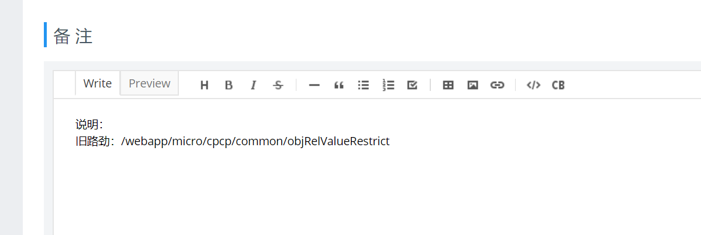

## 整体说明

YApi 用于接口内容记录，并可支持动态测试、保存测试结果

## Yapi流程说明

1. 服务端人员到YApi具体的目录中新增服务
    * 新增api需要**填写清楚各个字段内容及描述** 
    
      
    
    * **接口命名**建议 根据...查询/提交/更新/删除... 如（根据custId查询customer、根据custDTO提交customer）
    
    * 新增接口状态为**未完成**
2. 服务端人员提供提供YApi地址给客户端人员使用
3. 客户端人员根据YApi内容进行测试
    * 发现测试过程中存在问题，双方调整好YApi内容
    
    * 客户端在YApi上进行运行测试，根据需要的参数填入测试，并保存到测试结果集，**用例命名和接口命名一致** 
    
      
4. 以客户端的测试通过为准并修改YApi状态为**已完成**


##  统一url命名
1. restful 通过HTTP动作在加资源完成一个请求动作
2. 资源这个概念可以映射成一个实体，也可也是多个实体的一个组合，简单的说可以把资源看成一个DTO
3. url中不能包含动词，只能是名词（命名名词的时候，使用驼峰命名法或者小写），如productOrder
4. 资源都使用单数模式来表达 如prodInst offerInst（按照TMF规范复数表达用单数进行匿名）
5. 避免多级的URL如 cust/3/prodInst/4/prodInstAcct 等 ，转而使用query查询，对于具体请求哪个资源以最后资源命名 如  cust/3/prodInst/{path}?custId=11&&shardingId=2000,3000,5000 @TODO，path和？是否共存不能共存要进行区分。
6. 查询条件中尽量带上分片键  cust/1234?shardingId=222

##  统一HTTP动作

| API操作               | 对实体操作                | 操作描述               |
| --------------------- | ----------------------------------- | --------------------------------- |
| GET Resource          | 查询（Query）                       | 实体必须使用GET获取资源。         |
| POST Resource         | 创建（Create）                      | 实体必须使用POST创建一个新资源。  |
| PATCH Resource    | 更新实体的一部分（Partial Update） | 必须使用PATCH更新一个资源的一部分 |
| PUT Resource          | 完全更新一个实体（Complete Update） | 使用PUT通过                       |
| DELETE Resource       | 移除一个实体                        | 必须使用DELETE移除一个资源        |

PATCH和PUT根据实际业务来判断。

##  统一HTTP头参数

请求Header中携带的信息 ，持续更新。token是否考虑也放在头部分里面呢？

服务端如何控制需要认证的接口。通过注解处理，服务端控制

url中区分的力度 以及整个DTO的配置，资源完成一样整合一个DTO来处理

### 请求头

| ***\*头信息\**** | ***\*约束\**** | ***\*说明\****                                               |
| ---------------- | -------------- | ------------------------------------------------------------ |
| Content-Type     | Y              | application/json;charset=utf-8 ，GET方式的时候是要求送或者不送，省份都应该正常返回的，POST的时候Content-Type是强制送 |
| Content-Length   | N              | 请求的内容长度，示例：348                                    |
| Content-Encoding | N              | 它的值表示消息主体进行了何种方式的内容编码转换。例如：gzip   |
| Version          | N              | 接口版本号，不填默认V1.0.0                                   |
| Token            | N              | token信息，携带员工、区域等数据                              |
### 返回头

| ***\*头信息\**** | ***\*约束\**** | ***\*说明\****                                    |
| ---------------- | -------------- | ------------------------------------------------- |
| Content-Type     | Y              | application/json;charset=utf-8                    |
| Content-Length   | N              | 响应的内容长度，示例：348                         |
| Last-Modified    | N              | 请求资源的最后修改时间                            |
| ETag             | N              | 请求变量的实体标签的当前值，示例：xxxxxxxxxxxxxxx |
| Location         | N              | 标识新的资源，/openapi/capability/1               |
| Cache-Control    | N              | 指定响应遵循的缓存机制，示例：private             |
| Expires          | N              | 响应过期时间                                      |
| Date             | N              | 服务器消息发出的时间                              |
| Accept-Encoding  | N              | 浏览器发给服务器，声明浏览器支持的编码类型。      |
## 统一错误处理

客户端和服务端进行交互出现问题时，服务端要**返回对应的错误状态码和错误内容**。跟业务来进行处理

### 错误状态码
#### 客户端错误代码

| ***\*Code\**** | ***\*含义\****                                               | ***\*方法\****          |
| -------------- | ------------------------------------------------------------ | ----------------------- |
| 400            | 无效的请求                                                   | ALL                     |
| 401            | Unauthorized - 用户没有登录，没有认证                        | ALL                     |
| 403            | Forbidden - 用户没有被授权使用这个服务                       | ALL                     |
| 404            | Not found - 资源没有被找到                                   | ALL                     |
| 405            | Method Not Allowed - 请求不被支撑                            | ALL                     |
| 406            | Not Acceptable - 资源允许被创建的Content类型和请求中要求的可接受的类型不一致 | ALL                     |
| 408            | Requst Timeout，服务端在请求资源的时候超时                   | ALL                     |
| 409            | Conflict - 因为冲突，请求没有被完成                          | POST, PUT, DELETE,PATCH |
| 410            | Gone - 请求不再存在，比如一个请求已经被删除                  | ALL                     |
| 412            | Precondition Failed - 前置条件失败。在带有条件的请求的时候返回，例如当使用IFMatch时条件失败。用于乐观锁. | PUT, DELETE, PATCH      |
| 415            | Unsupported Media Type - 不支持的媒体类型。例如客户端发送的请求里面没有Content-Type | POST, PUT, DELETE,PATCH |
| 423            | Locked - 悲观锁                                              | PUT, DELETE, PATCH      |
| 428            | Precondition Required - 服务端需要有判断条件                 | ALL                     |
| 429            | Too many requests - 过多的服务请求，参见速率限制             | ALL                     |

#### 服务端错误码

| ***\*Code\**** | ***\*含义\****                                               | ***\*方法\**** |
| -------------- | ------------------------------------------------------------ | -------------- |
| 500            | Internal Server Error - 意外的服务器执行错误的通用错误信息（客户端也许可以重试） | ALL            |
| 501            | Not Implemented - 服务端无法完成请求（通常用于描述未来的可用性，例如新的功能 | ALL            |
| 503            | Service Unavailable - 服务暂时无法使用 (例如因为过载) — 客户端也许可以重试 | ALL            |

### 错误响应内容

| ***\*字段\**** | ***\*类型\**** | ***\*说明\****                                               |
| -------------- | -------------- | ------------------------------------------------------------ |
| code           | String         | 具体的错误代码，错误编码主数据，例如“API1001”。              |
| reason         | String         | 具体的错误说明，用于展示给客户端。例如: “XXX字段应该是数字格式” |
| message        | String         | 更详细的错误说明，以及解决错误的一些相关的方案               |
| referenceError | String         | 用于描述具体错误的html页面地址                               |

``` json
400
Content-Type:application/json
{
    "code":"XXXXX",
    "reason":"XXXXXXX",
    "message":"",
    "referenceError":""
}
```

## 通用的查询说明

### 分页

​	offset第几页，limit数量，offset=0&limit=100表达从第一页开始的100条数据，参数没带默认offset=0，limit=100；对于分页的请求服务器必须要返回一个总数内容 

### 排序

​	sort；正序 sort=custName 倒序sort=-custName。排序根据自身的DTO来做

### 过滤

​	fields；在一些查询中如果只需要资源中的部分字段可以在查询中使用fields来限制，默认返回整个资源的字段内容。如查询客户中的名称、客户编码，/cust/customer?fields=custId,custNumber

### 多条件

​	查询中涉及到多个条件的通过，来进行分隔开，如查询多个状态 status=2000,3000,5000

## Json数据表达要求

### 日期的格式表达

统一格式返回：yyyymmddHHmmss 

## 常见的例子介绍

### 带认证查询

通过业务注解来实现

``` json
Get /cust/customer/123
Content-Type: application/json
Token: 12211221211221

```

### POST、PUT是否返回资源

​    看业务来需要是否返回资源。

## 统一根路劲

​	定义各个中心中涉及的url的base路劲，对不确定路劲的可以发出来一起讨论

### 客户管理中心

​	baseUrl：/cust

 - 客户模块 baseUrl：/cust/cust

 - 资产模块 baseUrl：/cust/asset

   - 销售品实例 baseUrl：ust/asset/offerInst，

     说明：产销品的关联也放在该目录下

   - 产品实例 baseUrl：cust/asset/prodInst

### CPCP中心

​	baseUrl：/cpcp

 - 产品模块 baseUrl：/cpcp/product

   说明：产销品的关联也放在该目录下

	- 销售品模块 baseUrl：/cpcp/offer

### 基础运营中心

​	baseUrl：/ops

	- 渠道模块 baseUrl：/ops/channel
	- 组织模块 baseUrl：/ops/organization
	- 员工模块 baseUrl：/ops/staff

## 新旧服务映射管理

​	采用在API管理的方式，录用api时候在备注中进行说明



## 环境

1. 测试环境地址：待确认
2. 生产环境地址：待确认

一个资源多个条件查询，如何管理处理
现在都市面向Sql编程，如何针对不同的条件返回同样的DTO 。
1. 通过不同的api来进行区分  --导致api过多 很多相同，如何区别不同的api内容。涉及到api复用问题
2. 通过同一个api来处理     -- 后续维护性差，可扩展性差，服务升级降级不好处理
原则尽量不分  