# 死磕Spring

## 一、深入理解IOC

### 1. IOC理论

解释控制反转内容：

- **谁控制谁：**传统模式直接new对象，我直接控制对象，有了IOC后直接由IOC容器提供，IOC容器控制了对象

- **为何反转：**直接new是正转，到IOC后变从原本的主动到被动接受

### 2. 各个组件

ClassPathXmlApplicationContext 的类继承体系结构，虽然只有一部分，但是它基本上包含了 IoC 体系中大部分的核心类和接口。


#### 2.1 Resource体系

`org.springframework.core.io.Resource`，对资源的抽象。它的每一个实现类都代表了一种资源的访问策略，如 ClassPathResource、RLResource、FileSystemResource  等。

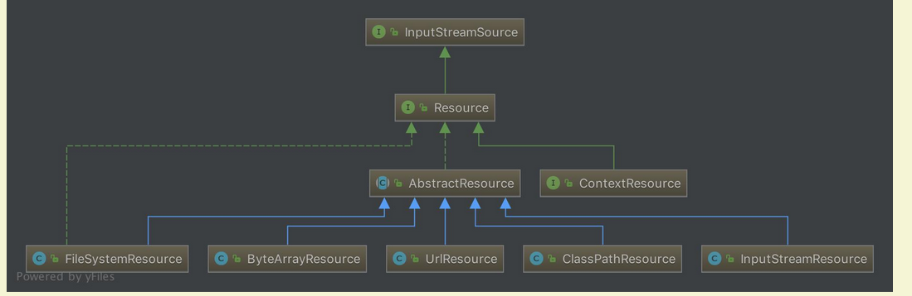

##### 	2.1.1 ResourceLoader 体系
有了资源，就应该有资源加载，Spring 利用 org.springframework.core.io.ResourceLoader 来进行统一资源加载，类图如下：

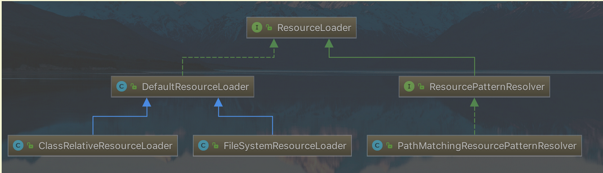

#### 2.2 BeanFactory 体系
org.springframework.beans.factory.BeanFactory，是一个非常纯粹的 bean 容器，它是 IoC 必备的数据结构，其中 BeanDefinition 是它的基本结构。BeanFactory 内部维护着一个BeanDefinition map ，并可根据 BeanDefinition 的描述进行 bean 的创建和管理。

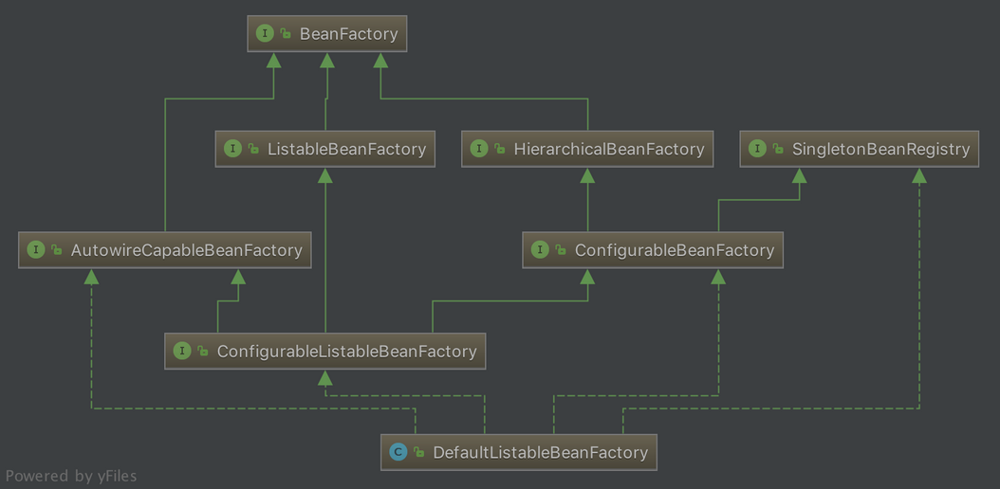

- BeanFactory 有三个直接子类 ListableBeanFactory、HierarchicalBeanFactory 和 AutowireCapableBeanFactory 。
- DefaultListableBeanFactory 为最终默认实现，它实现了所有接口。


#### 2.3 BeanDefinition 体系
org.springframework.beans.factory.config.BeanDefinition ，用来描述 Spring 中的 Bean 对象。

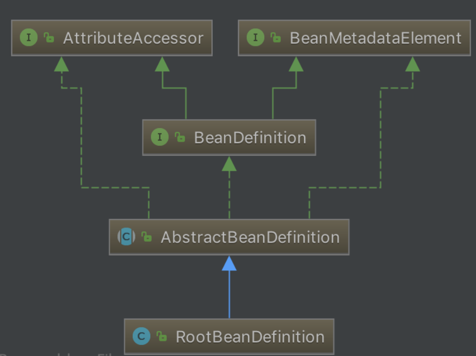

#### 2.4 BeanDefinitionReader 体系
org.springframework.beans.factory.support.BeanDefinitionReader 的作用是读取 Spring 的配置文件的内容，并将其转换成 Ioc 容器内部的数据结构 ：BeanDefinition 。

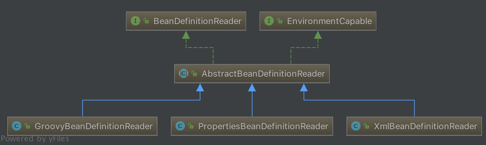

#### 2.5 ApplicationContext 体系
org.springframework.context.ApplicationContext ，这个就是大名鼎鼎的 Spring 容器，它叫做应用上下文，与我们应用息息相关。它**继承** BeanFactory ，所以它是 BeanFactory 的扩展升级版，如果BeanFactory 是屌丝的话，那么 ApplicationContext 则是名副其实的高富帅。由于 ApplicationContext 的结构就决定了它与 BeanFactory 的不同，其主要区别有：

    继承 org.springframework.context.MessageSource 接口，提供国际化的标准访问策略。
    继承 org.springframework.context.ApplicationEventPublisher 接口，提供强大的事件机制。
    扩展 ResourceLoader ，可以用来加载多种 Resource ，可以灵活访问不同的资源。
    对 Web 应用的支持。

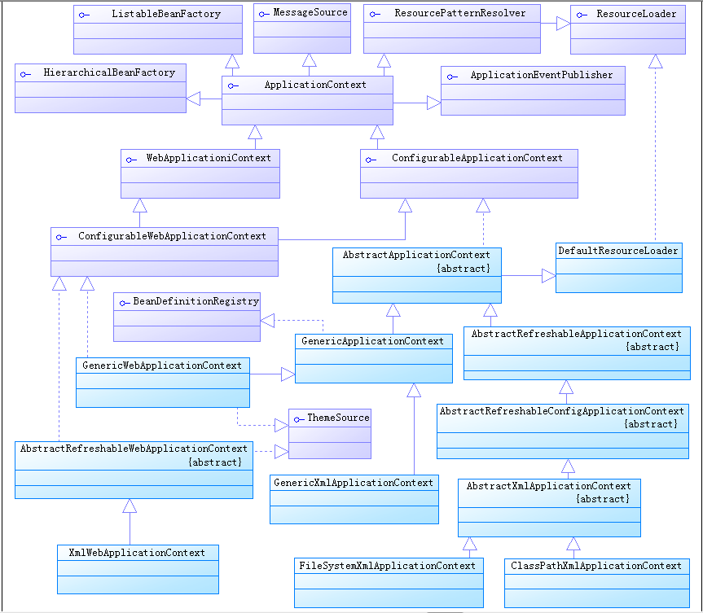

## 二、Spring 统一资源加载策略

1. 职能划分清楚。资源的定义和资源的加载应该要有一个清晰的**界限**；
2. 统一的抽象。统一的资源**定义**和资源加载**策略**。资源加载后要返回统一的抽象给客户端，客户端要对资源进行怎样的处理，应该由抽象资源接口来界定。

### 1. 统一资源：Resource

`org.springframework.core.io.Resource` 为 Spring 框架所有资源的抽象和访问接口，它继承 `org.springframework.core.io.InputStreamSource`接口。作为所有资源的统一抽象，Resource 定义了一些通用的方法，由子类 `AbstractResource` 提供统一的默认实现。具体看源码的Resource 内容。

#### 1.1 类结构

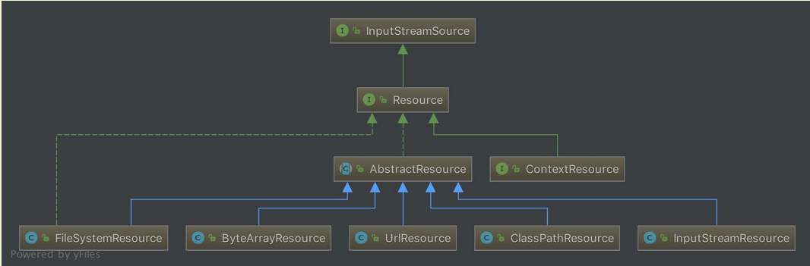


从上图可以看到，Resource 根据资源的不同类型提供不同的具体实现，如下：

- FileSystemResource ：对 `java.io.File` 类型资源的封装，只要是跟 File  打交道的，基本上与 FileSystemResource 也可以打交道。支持文件和 URL 的形式，实现 WritableResource  接口，且从 Spring Framework 5.0 开始，FileSystemResource 使用 NIO2 API进行读/写交互。
- ByteArrayResource ：对字节数组提供的数据的封装。如果通过 InputStream 形式访问该类型的资源，该实现会根据字节数组的数据构造一个相应的 ByteArrayInputStream。
- UrlResource ：对 `java.net.URL`类型资源的封装。内部委派 URL 进行具体的资源操作。
- ClassPathResource ：class path 类型资源的实现。使用给定的 ClassLoader 或者给定的 Class 来加载资源。
- InputStreamResource ：将给定的 InputStream 作为一种资源的 Resource 的实现类。

#### 1.2 AbstractResource

`org.springframework.core.io.AbstractResource` ，为 Resource 接口的默认**抽象**实现。它实现了 Resource 接口的**大部分的公共实现**，作为 Resource 接口中的重中之重，其定义查看源码内容

如果我们想要实现自定义的 Resource ，记住不要实现 Resource 接口，而应该继承 AbstractResource 抽象类，然后根据当前的具体资源特性覆盖相应的方法即可。

#### 1.3 其他子类

Resource 的子类，例如 FileSystemResource、ByteArrayResource 、ClassPathResource等等的代码非常简单。感兴趣的胖友，自己去研究。

### 2. 统一资源定位：ResourceLoader

`org.springframework.core.io.ResourceLoader` 为 Spring 资源加载的统一抽象，具体的资源加载则由相应的实现类来完成，所以我们可以将 ResourceLoader 称作为统一资源定位器。其定义如下：ResourceLoader，定义资源加载器，主要应用于根据给定的资源文件地址，返回对应的 Resource 。

```java
public interface ResourceLoader {

	String CLASSPATH_URL_PREFIX = ResourceUtils.CLASSPATH_URL_PREFIX; // CLASSPATH URL 前缀。默认为："classpath:"
    /**
    根据所提供资源的路径 location 返回 Resource 实例，但是它不确保该 Resource 一定存在，需要调用 Resource#exist() 方法来判断。
    该方法支持以下模式的资源加载：
        URL位置资源，如 "file:C:/test.dat" 。
        ClassPath位置资源，如 "classpath:test.dat 。
        相对路径资源，如 "WEB-INF/test.dat" ，此时返回的Resource 实例，根据实现不同而不同。
    该方法的主要实现是在其子类 DefaultResourceLoader 中实现，具体过程我们在分析 DefaultResourceLoader 时做详细说明。
    **/
	Resource getResource(String location);

	ClassLoader getClassLoader();

}
```

#### 2.1 子类结构

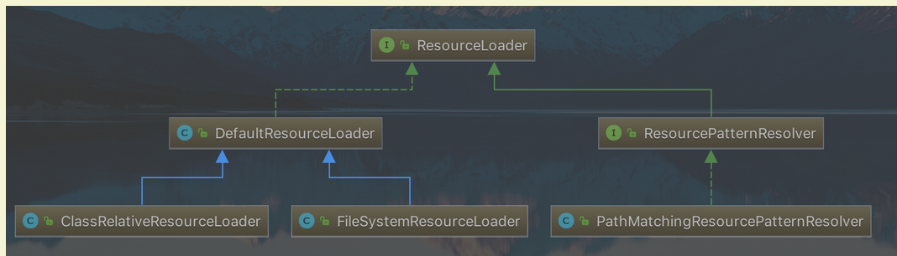

#### 2.2 DefaultResourceLoader

与 AbstractResource 相似，`org.springframework.core.io.DefaultResourceLoader` 是 ResourceLoader 的默认实现。

##### 2.2.1 构造函数

##### 2.2.2 getResource方法

ResourceLoader 中最核心的方法为 `#getResource(String location)` ，它根据提供的 location 返回相应的 Resource 。而 DefaultResourceLoader 对该方法提供了**核心实现**（因为，它的两个子类都没有提供覆盖该方法，所以可以断定 ResourceLoader 的资源加载策略就封装在 DefaultResourceLoader 中)，详情看源码内容

返回ClassPathContextResource或者FileUrlResource或者UrlResource或者ClassPathResource

每个其实最大的区别就在于读取文件的内容 getInputStream

##### 2.2.3 ProtocolResolver

`org.springframework.core.io.ProtocolResolver` ，用户自定义协议资源解决策略，作为 DefaultResourceLoader 的 **SPI**：它允许用户自定义资源加载协议，而不需要继承 ResourceLoader 的子类。
在介绍 Resource 时，提到如果要实现自定义 Resource，我们只需要继承 AbstractResource 即可，有了  ProtocolResolver 后，我们不需要继承 DefaultResourceLoader，改为实现 ProtocolResolver 接口也可以实现自定义的 ResourceLoader。

ProtocolResolver 接口，仅有一个方法 `Resource resolve(String location, ResourceLoader resourceLoader)` 。

在 Spring 中你会发现该接口并没有实现类，它需要用户自定义，自定义的 Resolver 如何加入 Spring 体系呢？调用 `DefaultResourceLoader#addProtocolResolver(ProtocolResolver)` 方法即可。


#### 2.3 FileSystemResourceLoader

我们看到，其实 DefaultResourceLoader 对`#getResourceByPath(String)` 方法处理其实不是很恰当，这个时候我们可以使用 `org.springframework.core.io.FileSystemResourceLoader` 。它继承 DefaultResourceLoader ，且覆写了 `#getResourceByPath(String)` 方法，该方法在default的getResource时候有d，使之从文件系统加载资源并以 FileSystemResource 类型返回，这样我们就可以得到想要的资源类型。代码如下：

```java
@Override
protected Resource getResourceByPath(String path) {
	// 截取首 /
	if (path.startsWith("/")) {
		path = path.substring(1);
	}
	// 创建 FileSystemContextResource 类型的资源
	return new FileSystemContextResource(path);
}
```

##### 2.3.1 FileSystemContextResource
FileSystemContextResource ，为 FileSystemResourceLoader 的内部类，它继承 FileSystemResource 类，实现 ContextResource 接口。代码如下：

```java
/**
 * FileSystemResource that explicitly expresses a context-relative path
 * through implementing the ContextResource interface.
 */
private static class FileSystemContextResource extends FileSystemResource implements ContextResource {

	public FileSystemContextResource(String path) {
		super(path);
	}

	@Override
	public String getPathWithinContext() {
		return getPath();
	}
}
```

- 在构造器中，也是调用 FileSystemResource 的构造函数来构造 FileSystemResource 的。
- 为什么要有 FileSystemContextResource 类的原因是，实现 ContextResource 接口，并实现对应的 `#getPathWithinContext()` 接口方法。

#### 2.4 ClassRelativeResourceLoader

`org.springframework.core.io.ClassRelativeResourceLoader` ，是 DefaultResourceLoader 的另一个子类的实现。和 FileSystemResourceLoader 类似，在实现代码的结构上类似，也是覆写 `#getResourceByPath(String path)` 方法，并返回其对应的 ClassRelativeContextResource 的资源类型。

ClassRelativeResourceLoader 扩展的功能是，可以根据给定的`class` 所在包或者所在包的子包下加载资源。

```java
@RequestMapping(value="/index.html")
	public String loginPage() throws IOException {
		ResourceLoader resourceLoader=new ClassRelativeResourceLoader(this.getClass());
        // test.xml是本类下的，如果使用/test.xml采用绝对路劲查找方式
        // 实际上是jdk自有的内容 java.lang.Class#resolveName协助查找的
		Resource resource=resourceLoader.getResource("test.xml");
		System.out.println(resource.getFile().getPath());
		return "index";
	}   
```

可以查看ClassRelativeResourceLoaderTest类

https://blog.csdn.net/seasonsbin/article/details/80914911

#### 2.5 ResourcePatternResolver
ResourceLoader 的 Resource getResource(String location) 方法，每次只能根据 location 返回一个 Resource 。当需要加载多个资源时，我们除了多次调用 #getResource(String location) 方法外，别无他法。org.springframework.core.io.support.ResourcePatternResolver 是 ResourceLoader 的扩展，它支持根据指定的资源路径匹配模式每次返回多个 Resource 实例，其定义如下：

```java
public interface ResourcePatternResolver extends ResourceLoader {

	String CLASSPATH_ALL_URL_PREFIX = "classpath*:";

	Resource[] getResources(String locationPattern) throws IOException;

}
```

- ResourcePatternResolver 在 ResourceLoader 的基础上增加了 `#getResources(String locationPattern)` 方法，以支持根据路径匹配模式返回**多个** Resource 实例。
- 同时，也新增了一种**新的协议**前缀 `"classpath*:"`，该协议前缀由其子类负责实现。

#### 2.6 PathMatchingResourcePatternResolver

`org.springframework.core.io.support.PathMatchingResourcePatternResolver` ，为 ResourcePatternResolver 最常用的子类，它除了支持 ResourceLoader 和 ResourcePatternResolver 新增的 `"classpath*:"` 前缀外，**还支持 Ant 风格的路径匹配模式**（类似于 `"**/*.xml"`）。

##### 2.6.1 构造函数

```java
/**
 * 内置的 ResourceLoader 资源定位器
 */
private final ResourceLoader resourceLoader;
/**
 * Ant 路径匹配器
 */
private PathMatcher pathMatcher = new AntPathMatcher();

public PathMatchingResourcePatternResolver() {
	this.resourceLoader = new DefaultResourceLoader();
}

public PathMatchingResourcePatternResolver(ResourceLoader resourceLoader) {
	Assert.notNull(resourceLoader, "ResourceLoader must not be null");
	this.resourceLoader = resourceLoader;
}

public PathMatchingResourcePatternResolver(@Nullable ClassLoader classLoader) {
	this.resourceLoader = new DefaultResourceLoader(classLoader);
}
```

- PathMatchingResourcePatternResolver 在实例化的时候，可以指定一个 ResourceLoader，如果不指定的话，它会在内部构造一个 DefaultResourceLoader 。
- `pathMatcher` 属性，默认为 AntPathMatcher 对象，用于支持 Ant 类型的路径匹配。

##### 2.6.2 getResource

```java
@Override
public Resource getResource(String location) {
	return getResourceLoader().getResource(location);
}

public ResourceLoader getResourceLoader() {
	return this.resourceLoader;
}
```

该方法，直接委托给相应的 ResourceLoader 来实现。所以，如果我们在实例化的  PathMatchingResourcePatternResolver 的时候，如果未指定 ResourceLoader  参数的情况下，那么在加载资源时，其实就是 DefaultResourceLoader 的过程。

其实在下面介绍的 `Resource[] getResources(String locationPattern)` 方法也相同，只不过返回的资源是**多个**而已。

```java
@Override
public Resource[] getResources(String locationPattern) throws IOException {
    Assert.notNull(locationPattern, "Location pattern must not be null");
    // 以 "classpath*:" 开头
    if (locationPattern.startsWith(CLASSPATH_ALL_URL_PREFIX)) {
        // 路径包含通配符
        // a class path resource (multiple resources for same name possible)
        if (getPathMatcher().isPattern(locationPattern.substring(CLASSPATH_ALL_URL_PREFIX.length()))) {
            // a class path resource pattern
            return findPathMatchingResources(locationPattern);
        // 路径不包含通配符
        } else {
            // all class path resources with the given name
            return findAllClassPathResources(locationPattern.substring(CLASSPATH_ALL_URL_PREFIX.length()));
        }
    // 不以 "classpath*:" 开头
    } else {
        // Generally only look for a pattern after a prefix here, // 通常只在这里的前缀后面查找模式
        // and on Tomcat only after the "*/" separator for its "war:" protocol. 而在 Tomcat 上只有在 “*/ ”分隔符之后才为其 “war:” 协议
        int prefixEnd = (locationPattern.startsWith("war:") ? locationPattern.indexOf("*/") + 1 :
                locationPattern.indexOf(':') + 1);
        // 路径包含通配符
        if (getPathMatcher().isPattern(locationPattern.substring(prefixEnd))) {
            // a file pattern
            return findPathMatchingResources(locationPattern);
        // 路径不包含通配符
        } else {
            // a single resource with the given name
            return new Resource[] {getResourceLoader().getResource(locationPattern)};
        }
    }
}
```

- **非** `"classpath*:"` 开头，且路径**不包含**通配符，直接委托给相应的 ResourceLoader 来实现。
- 其他情况，调用 `#findAllClassPathResources(...)`、或 `#findPathMatchingResources(...)` 方法，返回多个 Resource 。下面，我们来详细分析。

##### 2.6.3 findAllClassPathResources

当 `locationPattern` 以 `"classpath*:"` 开头但是不包含通配符，则调用 `#findAllClassPathResources(...)` 方法加载资源。该方法返回 classes 路径下和所有 jar 包中的所有相匹配的资源。

```java
protected Resource[] findAllClassPathResources(String location) throws IOException {
	String path = location;
	// 去除首个 /
	if (path.startsWith("/")) {
		path = path.substring(1);
	}
	// 真正执行加载所有 classpath 资源
	Set<Resource> result = doFindAllClassPathResources(path);
	if (logger.isTraceEnabled()) {
		logger.trace("Resolved classpath location [" + location + "] to resources " + result);
	}
	// 转换成 Resource 数组返回
	return result.toArray(new Resource[0]);
}
```

真正执行加载的是在 `#doFindAllClassPathResources(...)` 方法，代码如下：

```java
protected Set<Resource> doFindAllClassPathResources(String path) throws IOException {
	Set<Resource> result = new LinkedHashSet<>(16);
	ClassLoader cl = getClassLoader();
	// <1> 根据 ClassLoader 加载路径下的所有资源
	Enumeration<URL> resourceUrls = (cl != null ? cl.getResources(path) : ClassLoader.getSystemResources(path));
	// <2>
	while (resourceUrls.hasMoreElements()) {
		URL url = resourceUrls.nextElement();
		// 将 URL 转换成 UrlResource
		result.add(convertClassLoaderURL(url));
	}
	// <3> 加载路径下得所有 jar 包
	if ("".equals(path)) {
		// The above result is likely to be incomplete, i.e. only containing file system references.
		// We need to have pointers to each of the jar files on the classpath as well...
		addAllClassLoaderJarRoots(cl, result);
	}
	return result;
}
```

- <1> 处，根据 ClassLoader 加载路径下的所有资源。在加载资源过程时，如果在构造 PathMatchingResourcePatternResolver 实例的时候如果传入了 ClassLoader，则调用该 ClassLoader 的 `#getResources()` 方法，否则调用 `ClassLoader#getSystemResources(path)` 方法。另外，`ClassLoader#getResources()` 方法:

##### 2.6.4 findPathMatchingResources

当 `locationPattern` 中包含了**通配符**，则调用该方法进行资源加载。代码如下：

```java
protected Resource[] findPathMatchingResources(String locationPattern) throws IOException {
    // 确定根路径、子路径
    String rootDirPath = determineRootDir(locationPattern);
    String subPattern = locationPattern.substring(rootDirPath.length());
    // 获取根据路径下的资源
    Resource[] rootDirResources = getResources(rootDirPath);
    // 遍历，迭代
    Set<Resource> result = new LinkedHashSet<>(16);
    for (Resource rootDirResource : rootDirResources) {
        rootDirResource = resolveRootDirResource(rootDirResource);
        URL rootDirUrl = rootDirResource.getURL();
        // bundle 资源类型
        if (equinoxResolveMethod != null && rootDirUrl.getProtocol().startsWith("bundle")) {
            URL resolvedUrl = (URL) ReflectionUtils.invokeMethod(equinoxResolveMethod, null, rootDirUrl);
            if (resolvedUrl != null) {
                rootDirUrl = resolvedUrl;
            }
            rootDirResource = new UrlResource(rootDirUrl);
        }
        // vfs 资源类型
        if (rootDirUrl.getProtocol().startsWith(ResourceUtils.URL_PROTOCOL_VFS)) {
            result.addAll(VfsResourceMatchingDelegate.findMatchingResources(rootDirUrl, subPattern, getPathMatcher()));
        // jar 资源类型
        } else if (ResourceUtils.isJarURL(rootDirUrl) || isJarResource(rootDirResource)) {
            result.addAll(doFindPathMatchingJarResources(rootDirResource, rootDirUrl, subPattern));
        // 其它资源类型
        } else {
            result.addAll(doFindPathMatchingFileResources(rootDirResource, subPattern));
        }
    }
    if (logger.isTraceEnabled()) {
        logger.trace("Resolved location pattern [" + locationPattern + "] to resources " + result);
    }
    // 转换成 Resource 数组返回
    return result.toArray(new Resource[0]);
}
```

###### 2.6.4.1 determineRootDir

`determineRootDir(String location)` 方法，主要是用于确定根路径。代码如下：

```java
/**
 * Determine the root directory for the given location.
 * <p>Used for determining the starting point for file matching,
 * resolving the root directory location to a {@code java.io.File}
 * and passing it into {@code retrieveMatchingFiles}, with the
 * remainder of the location as pattern.
 * <p>Will return "/WEB-INF/" for the pattern "/WEB-INF/*.xml",
 * for example.
 * @param location the location to check
 * @return the part of the location that denotes the root directory
 * @see #retrieveMatchingFiles
 */
protected String determineRootDir(String location) {
	// 找到冒号的后一位
	int prefixEnd = location.indexOf(':') + 1;
	// 根目录结束位置
	int rootDirEnd = location.length();
	// 在从冒号开始到最后的字符串中，循环判断是否包含通配符，如果包含，则截断最后一个由”/”分割的部分。
	// 例如：在我们路径中，就是最后的ap?-context.xml这一段。再循环判断剩下的部分，直到剩下的路径中都不包含通配符。
	while (rootDirEnd > prefixEnd && getPathMatcher().isPattern(location.substring(prefixEnd, rootDirEnd))) {
		rootDirEnd = location.lastIndexOf('/', rootDirEnd - 2) + 1;
	}
	// 如果查找完成后，rootDirEnd = 0 了，则将之前赋值的 prefixEnd 的值赋给 rootDirEnd ，也就是冒号的后一位
	if (rootDirEnd == 0) {
		rootDirEnd = prefixEnd;
	}
	// 截取根目录
	return location.substring(0, rootDirEnd);
}
```

方法比较绕，效果如下示例：

|               原路径               |      确定根路径       |
| :--------------------------------: | :-------------------: |
| `classpath*:test/cc*/spring-*.xml` |  `classpath*:test/`   |
| `classpath*:test/aa/spring-*.xml`  | `classpath*:test/aa/` |

###### 2.6.4.2 doFindPathMatchingXXXResources
#doFindPathMatchingXXXResources(...) 方法，是个泛指，一共对应三个方法：

    #doFindPathMatchingJarResources(rootDirResource, rootDirUrl, subPatter) 方法
    #doFindPathMatchingFileResources(rootDirResource, subPattern) 方法
    VfsResourceMatchingDelegate#findMatchingResources(rootDirUrl, subPattern, pathMatcher) 方法

因为本文重在分析 Spring 统一资源加载策略的整体流程。相对来说，上面几个方法的代码量会比较多。所以本文不再追溯，感兴趣的胖友，推荐阅读如下文章：

   https://www.cnblogs.com/question-sky/p/6959493.html ，主要针对 #doFindPathMatchingJarResources(rootDirResource, rootDirUrl, subPatter) 方法。
    http://www.blogjava.net/DLevin/archive/2012/12/01/392337.html ，主要针对 #doFindPathMatchingFileResources(rootDirResource, subPattern) 方法。
    http://www.coderli.com/spring-wildpath-parse/ 😈 貌似没有下

#### 2.6JDKgetresource
最终都市classLoader进行获取资源信息

1. 相对路劲 相对于当前类

2. 绝对路劲相对于整个项目，被编译后进入了class 都是包名的方式 com/ffcs/...

3. ```java
   public class TestResource {
       public static void main(String[] args) {
           URL sys = TestResource.class.getResource("TestResource.class");
           System.out.println(sys);
   
           URL sys2 = TestResource.class.getResource("/subapplication.yml");
           System.out.println(sys2);
   
       }
   }
   
   file:/D:/code2/dgewp/dgewp/dict/basic-center/system-busi-app-parent/system-busi-app/target/classes/com/ffcs/bss/system/busi/app/controller/TestResource.class
   file:/D:/code2/dgewp/dgewp/dict/basic-center/system-busi-app-parent/system-busi-app/target/classes/subapplication.yml
   
   ```


#### 2.7小结

        classpath*:表示查找classpath路径下的所有符合条件的资源，包含jar、zip等资源；classpath:表示优先在项目的资源目录下查找，找不到才去jar、zip等资源中查找
    
        该类可以帮助spring查找到符合ant-style格式的所有资源，所以富有借鉴意义。附：ant-style指的是类似*/?此类的匹配字符


### 三、IoC 之加载 BeanDefinition

先看一段熟悉的代码：

```java
ClassPathResource resource = new ClassPathResource("bean.xml"); // <1>
DefaultListableBeanFactory factory = new DefaultListableBeanFactory(); // <2>
XmlBeanDefinitionReader reader = new XmlBeanDefinitionReader(factory); // <3>
reader.loadBeanDefinitions(resource); // <4>
```

这段代码是 Spring 中编程式使用 IoC 容器，通过这四段简单的代码，我们可以初步判断 IoC 容器的使用过程。

1. 获取资源
2. 获取 BeanFactory
3. 根据新建的 BeanFactory 创建一个 BeanDefinitionReader 对象，该 Reader 对象为资源的**解析器**
4. 装载资源

整个过程就分为三个步骤：资源定位、装载、注册，如下：


- **资源定位**我们一般用外部资源来描述 Bean 对象，所以在初始化 IoC 容器的第一步就是需要定位这个外部资源，在统一资源讲过了

- **装载**。装载就是 BeanDefinition 的载入。BeanDefinitionReader 读取、解析 Resource 资源，也就是将用户定义的 Bean 表示成 IoC 容器的内部数据结构：BeanDefinition 。

  - 在 IoC 容器内部维护着一个 BeanDefinition Map 的数据结构

  - 在配置文件中每一个 `` 都对应着一个 BeanDefinition 对象。

- **注册**。向 IoC 容器注册在第二步解析好的 BeanDefinition，这个过程是通过  BeanDefinitionRegistry 接口来实现的。在 IoC 容器内部其实是将第二个过程解析得到的 BeanDefinition  注入到一个 HashMap 容器中，IoC 容器就是通过这个 HashMap 来维护这些 BeanDefinition 的。
  - 在这里需要注意的一点是这个过程并没有完成依赖注入（Bean 创建），Bean 创建是发生在应用第一次调用 `#getBean(...)` 方法，向容器索要 Bean 时。
  - 当然我们可以通过设置预处理，即对某个 Bean 设置 `lazyinit = false` 属性，那么这个 Bean 的依赖注入就会在容器初始化的时候完成。

#### 1. loadBeanDefinitions

上面看到的  `reader.loadBeanDefinitions(resource)` 代码，才是加载资源的真正实现，所以我们直接从该方法入手。代码如下：

```java
// XmlBeanDefinitionReader.java
@Override
public int loadBeanDefinitions(Resource resource) throws BeanDefinitionStoreException {
	return loadBeanDefinitions(new EncodedResource(resource));
}
```

- 从指定的 xml 文件加载 Bean Definition ，这里会先对 Resource 资源封装成 `org.springframework.core.io.support.EncodedResource` 对象。这里为什么需要将 Resource 封装成 EncodedResource 呢？主要是为了对 Resource 进行编码，保证内容读取的正确性。
- 然后，再调用 `#loadBeanDefinitions(EncodedResource encodedResource)` 方法，执行真正的逻辑实现。

```java
/**
 * 当前线程，正在加载的 EncodedResource 集合。
 */
private final ThreadLocal<Set<EncodedResource>> resourcesCurrentlyBeingLoaded = new NamedThreadLocal<>("XML bean definition resources currently being loaded");

public int loadBeanDefinitions(EncodedResource encodedResource) throws BeanDefinitionStoreException {
	Assert.notNull(encodedResource, "EncodedResource must not be null");
	if (logger.isTraceEnabled()) {
		logger.trace("Loading XML bean definitions from " + encodedResource);
	}

	// <1> 获取已经加载过的资源
	Set<EncodedResource> currentResources = this.resourcesCurrentlyBeingLoaded.get();
	if (currentResources == null) {
		currentResources = new HashSet<>(4);
		this.resourcesCurrentlyBeingLoaded.set(currentResources);
	}
	if (!currentResources.add(encodedResource)) { // 将当前资源加入记录中。如果已存在，抛出异常
		throw new BeanDefinitionStoreException("Detected cyclic loading of " + encodedResource + " - check your import definitions!");
	}
	try {
		// <2> 从 EncodedResource 获取封装的 Resource ，并从 Resource 中获取其中的 InputStream
		InputStream inputStream = encodedResource.getResource().getInputStream();
		try {
			InputSource inputSource = new InputSource(inputStream);
			if (encodedResource.getEncoding() != null) { // 设置编码
				inputSource.setEncoding(encodedResource.getEncoding());
			}
			// 核心逻辑部分，执行加载 BeanDefinition
			return doLoadBeanDefinitions(inputSource, encodedResource.getResource());
		} finally {
			inputStream.close();
		}
	} catch (IOException ex) {
		throw new BeanDefinitionStoreException("IOException parsing XML document from " + encodedResource.getResource(), ex);
	} finally {
		// 从缓存中剔除该资源 <3>
		currentResources.remove(encodedResource);
		if (currentResources.isEmpty()) {
			this.resourcesCurrentlyBeingLoaded.remove();
		}
	}
}
```

    <1> 处，通过 resourcesCurrentlyBeingLoaded.get() 代码，来获取已经加载过的资源，然后将 encodedResource 加入其中，如果 resourcesCurrentlyBeingLoaded 中已经存在该资源，则抛出 BeanDefinitionStoreException 异常。
        为什么需要这么做呢？答案在 "Detected cyclic loading" ，避免一个 EncodedResource 在加载时，还没加载完成，又加载自身，从而导致死循环。
        也因此，在 <3> 处，当一个 EncodedResource 加载完成后，需要从缓存中剔除。
    <2> 处理，从 encodedResource 获取封装的 Resource 资源，并从 Resource 中获取相应的 InputStream ，然后将 InputStream 封装为 InputSource ，最后调用 #doLoadBeanDefinitions(InputSource inputSource, Resource resource) 方法，执行加载 Bean Definition 的真正逻辑。

#### 2. doLoadBeanDefinitions

```java
protected int doLoadBeanDefinitions(InputSource inputSource, Resource resource)
		throws BeanDefinitionStoreException {
	try {
		// <1> 获取 XML Document 实例
		Document doc = doLoadDocument(inputSource, resource);
		// <2> 根据 Document 实例，注册 Bean 信息
		int count = registerBeanDefinitions(doc, resource);
		if (logger.isDebugEnabled()) {
			logger.debug("Loaded " + count + " bean definitions from " + resource);
		}
		return count;
```

- 在 `<1>` 处，调用 `#doLoadDocument(InputSource inputSource, Resource resource)` 方法，根据 xml 文件，获取 Document 实例。
- 在 `<2>` 处，调用 `#registerBeanDefinitions(Document doc, Resource resource)` 方法，根据获取的 Document 实例，注册 Bean 信息。

#### 3. doLoadDocument

```java
protected Document doLoadDocument(InputSource inputSource, Resource resource) throws Exception {
	return this.documentLoader.loadDocument(inputSource, getEntityResolver(), this.errorHandler,
			getValidationModeForResource(resource), isNamespaceAware());
}
```

1. 调用 `#getValidationModeForResource(Resource resource)` 方法，获取指定资源（xml）的**验证模式**
2. 调用 `DocumentLoader#loadDocument(InputSource inputSource,  EntityResolver entityResolver, ErrorHandler errorHandler, int  validationMode, boolean namespaceAware)` 方法，获取 XML Document 实例。详细解析，见。

#### 4. Resource模式验证

概念理解 DTD与XSD的区别。

##### 4.1 getValidationModeForResource

```java

// 禁用验证模式
public static final int VALIDATION_NONE = XmlValidationModeDetector.VALIDATION_NONE;
// 自动获取验证模式
public static final int VALIDATION_AUTO = XmlValidationModeDetector.VALIDATION_AUTO;
// DTD 验证模式
public static final int VALIDATION_DTD = XmlValidationModeDetector.VALIDATION_DTD;
// XSD 验证模式
public static final int VALIDATION_XSD = XmlValidationModeDetector.VALIDATION_XSD;
protected int getValidationModeForResource(Resource resource) {
    // <1> 获取指定的验证模式
   int validationModeToUse = getValidationMode();
   if (validationModeToUse != VALIDATION_AUTO) {
      return validationModeToUse;
   }
    // 其次，自动获取验证模式
   int detectedMode = detectValidationMode(resource);
   if (detectedMode != VALIDATION_AUTO) {
      return detectedMode;
   }
    // 最后，使用 VALIDATION_XSD 做为默认
   // Hmm, we didn't get a clear indication... Let's assume XSD,
   // since apparently no DTD declaration has been found up until
   // detection stopped (before finding the document's root tag).
   return VALIDATION_XSD;
}
```

##### 4.2 detectValidationMode

```java
  /**
   * XML 验证模式探测器
   */
protected int detectValidationMode(Resource resource) {
   if (resource.isOpen()) {
      throw new BeanDefinitionStoreException(
            "Passed-in Resource [" + resource + "] contains an open stream: " +
            "cannot determine validation mode automatically. Either pass in a Resource " +
            "that is able to create fresh streams, or explicitly specify the validationMode " +
            "on your XmlBeanDefinitionReader instance.");
   }

   InputStream inputStream;
   try {
      inputStream = resource.getInputStream();
   }
   catch (IOException ex) {
      throw new BeanDefinitionStoreException(
            "Unable to determine validation mode for [" + resource + "]: cannot open InputStream. " +
            "Did you attempt to load directly from a SAX InputSource without specifying the " +
            "validationMode on your XmlBeanDefinitionReader instance?", ex);
   }
// <x> 获取相应的验证模式
   try {
      return this.validationModeDetector.detectValidationMode(inputStream);
   }
   catch (IOException ex) {
      throw new BeanDefinitionStoreException("Unable to determine validation mode for [" +
            resource + "]: an error occurred whilst reading from the InputStream.", ex);
   }
}
```

##### 4.3 XmlValidationModeDetector

```java
public int detectValidationMode(InputStream inputStream) throws IOException {
    // Peek into the file to look for DOCTYPE.
    BufferedReader reader = new BufferedReader(new InputStreamReader(inputStream));
    try {
        // 是否为 DTD 校验模式。默认为，非 DTD 模式，即 XSD 模式
        boolean isDtdValidated = false;
        String content;
        // <0> 循环，逐行读取 XML 文件的内容
        while ((content = reader.readLine()) != null) {
            content = consumeCommentTokens(content);
            // 跳过，如果是注释，或者
            if (this.inComment || !StringUtils.hasText(content)) {
                continue;
            }
            // <1> 包含 DOCTYPE 为 DTD 模式
            if (hasDoctype(content)) {
                isDtdValidated = true;
                break;
            }
            // <2>  hasOpeningTag 方法会校验，如果这一行有 < ，并且 < 后面跟着的是字母，则返回 true 。
            if (hasOpeningTag(content)) {
                // End of meaningful data...
                break;
            }
        }
        // 返回 VALIDATION_DTD or VALIDATION_XSD 模式
        return (isDtdValidated ? VALIDATION_DTD : VALIDATION_XSD);
    } catch (CharConversionException ex) {
           
        // <3> 返回 VALIDATION_AUTO 模式
        // Choked on some character encoding...
        // Leave the decision up to the caller.
        return VALIDATION_AUTO;
    } finally {
        reader.close();
    }
}
```

##### 4.4文档解析相关文档

- 《spring源码（六）–XmlValidationModeDetector（获取xml文档校验模式）》](https://blog.csdn.net/ljz2016/article/details/82686884)

- [《XmlValidationModeDetector》](https://my.oschina.net/u/3579120/blog/1532852) 

- ```java
  XmlValidationModeDetectorTests //源码这个类测试
  ```

#### 5.  IoC 之获取 Document 对象

调用 `DocumentLoader#loadDocument(InputSource inputSource,  EntityResolver entityResolver, ErrorHandler errorHandler, int  validationMode, boolean namespaceAware)` 方法，获取 XML Document 实例。

##### 5.1 DocumentLoader

获取 Document 的策略，由接口 `org.springframework.beans.factory.xml.DocumentLoader` 定义。代码如下：

```java
public interface DocumentLoader {

	Document loadDocument(
			InputSource inputSource, EntityResolver entityResolver,
			ErrorHandler errorHandler, int validationMode, boolean namespaceAware)
			throws Exception;

}
```
- inputSource 方法参数，加载 Document 的 Resource 资源。
- entityResolver 方法参数，解析文件的解析器。
- errorHandler 方法参数，处理加载 Document 对象的过程的错误。
- validationMode 方法参数，验证模式。
- namespaceAware 方法参数，命名空间支持。如果要提供对 XML 名称空间的支持，则需要值为 true

##### 5.2 DefaultDocumentLoader

```java
/**
 * Load the {@link Document} at the supplied {@link InputSource} using the standard JAXP-configured
 * XML parser.
 */
@Override
public Document loadDocument(InputSource inputSource, EntityResolver entityResolver,
		ErrorHandler errorHandler, int validationMode, boolean namespaceAware) throws Exception {
	// <1> 创建 DocumentBuilderFactory
	DocumentBuilderFactory factory = createDocumentBuilderFactory(validationMode, namespaceAware);
	if (logger.isTraceEnabled()) {
		logger.trace("Using JAXP provider [" + factory.getClass().getName() + "]");
	}
	// <2> 创建 DocumentBuilder
	DocumentBuilder builder = createDocumentBuilder(factory, entityResolver, errorHandler);
	// <3> 解析 XML InputSource 返回 Document 对象
	return builder.parse(inputSource);
}
```

首先，调用 #`createDocumentBuilderFactory(...)` 方法，创建 `javax.xml.parsers.DocumentBuilderFactory` 对象。代码如下：

```java
**
 * JAXP attribute used to configure the schema language for validation.
 */
private static final String SCHEMA_LANGUAGE_ATTRIBUTE = "http://java.sun.com/xml/jaxp/properties/schemaLanguage";
/**
 * JAXP attribute value indicating the XSD schema language.
 */
private static final String XSD_SCHEMA_LANGUAGE = "http://www.w3.org/2001/XMLSchema";
protected DocumentBuilderFactory createDocumentBuilderFactory(int validationMode, boolean namespaceAware)
        throws ParserConfigurationException {
    // 创建 DocumentBuilderFactory
    DocumentBuilderFactory factory = DocumentBuilderFactory.newInstance();
    factory.setNamespaceAware(namespaceAware); // 设置命名空间支持
    if (validationMode != XmlValidationModeDetector.VALIDATION_NONE) {
        factory.setValidating(true); // 开启校验
        // XSD 模式下，设置 factory 的属性
        if (validationMode == XmlValidationModeDetector.VALIDATION_XSD) {
            // Enforce namespace aware for XSD...
            factory.setNamespaceAware(true); // XSD 模式下，强制设置命名空间支持
            // 设置 SCHEMA_LANGUAGE_ATTRIBUTE
            try {
                factory.setAttribute(SCHEMA_LANGUAGE_ATTRIBUTE, XSD_SCHEMA_LANGUAGE);
            } catch (IllegalArgumentException ex) {
                ParserConfigurationException pcex = new ParserConfigurationException(
                        "Unable to validate using XSD: Your JAXP provider [" + factory +
                        "] does not support XML Schema. Are you running on Java 1.4 with Apache Crimson? " +
                        "Upgrade to Apache Xerces (or Java 1.5) for full XSD support.");
                pcex.initCause(ex);
                throw pcex;
            }
        }
    }
    return factory;
}
```

然后，调用 `#createDocumentBuilder(DocumentBuilderFactory factory, EntityResolver entityResolver,ErrorHandler errorHandler)` 方法，创建 `javax.xml.parsers.DocumentBuilder` 对象。代码如下：

```java
protected DocumentBuilder createDocumentBuilder(DocumentBuilderFactory factory,
		@Nullable EntityResolver entityResolver, @Nullable ErrorHandler errorHandler)
		throws ParserConfigurationException {
	// 创建 DocumentBuilder 对象
	DocumentBuilder docBuilder = factory.newDocumentBuilder();
	// <x> 设置 EntityResolver 属性
	if (entityResolver != null) {
		docBuilder.setEntityResolver(entityResolver);
	}
	// 设置 ErrorHandler 属性
	if (errorHandler != null) {
		docBuilder.setErrorHandler(errorHandler);
	}
	return docBuilder;
}
```

##### 5.3 EntityResolver

通过 `DocumentLoader#loadDocument(...)` 方法来获取 Document 对象时，有一个方法参数 `entityResolver` 。该参数是通过 `XmlBeanDefinitionReader#getEntityResolver()` 方法来获取的。代码如下：

```java
// XmlBeanDefinitionReader.java

/**
 * EntityResolver 解析器 验证文档的格式内容
 */
@Nullable
private EntityResolver entityResolver;

protected EntityResolver getEntityResolver() {
	if (this.entityResolver == null) {
		// Determine default EntityResolver to use.
		ResourceLoader resourceLoader = getResourceLoader();
		if (resourceLoader != null) {
			this.entityResolver = new ResourceEntityResolver(resourceLoader);
		} else {
			this.entityResolver = new DelegatingEntityResolver(getBeanClassLoader());
		}
	}
	return this.entityResolver;
}
```

- 如果 ResourceLoader 不为 `null`，则根据指定的 ResourceLoader 创建一个 ResourceEntityResolver 对象。
- 如果 ResourceLoader 为 `null` ，则创建 一个 DelegatingEntityResolver 对象。该 Resolver 委托给默认的 BeansDtdResolver 和 PluggableSchemaResolver 。

###### 5.3.1 作用

EntityResolver 的作用就是，通过实现它，应用可以自定义如何**寻找**【验证文件】的逻辑。在 loadDocument 方法中涉及一个参数 EntityResolver ，何为EntityResolver？官网这样解释：如果  SAX 应用程序需要实现自定义处理外部实体，则必须实现此接口并使用 setEntityResolver 方法向SAX  驱动器注册一个实例。也就是说，对于解析一个XML，SAX 首先读取该 XML 文档上的声明，根据声明去寻找相应的 DTD  定义，以便对文档进行一个验证。默认的寻找规则，即通过网络（实现上就是声明的DTD的URI地址）来下载相应的DTD声明，并进行认证。下载的过程是一个漫长的过程，而且当网络中断或不可用时，这里会报错，就是因为相应的DTD声明没有被找到的原因。

EntityResolver 的作用是项目本身就可以提供一个如何寻找 DTD 声明的方法，即由程序来实现寻找 DTD 声明的过程，比如我们将 DTD 文件放到项目中某处，在实现时直接将此文档读取并返回给 SAX 即可。这样就避免了通过网络来寻找相应的声明。

`org.xml.sax.EntityResolver` 接口，代码如下：

```java
public interface EntityResolver {

    public abstract InputSource resolveEntity (String publicId, String systemId)
        throws SAXException, IOException;

}
```

接口方法接收两个参数 `publicId` 和 `systemId` ，并返回 InputSource 对象。两个参数声明如下：

- `publicId` ：被引用的外部实体的公共标识符，如果没有提供，则返回 `null` 。
- `systemId` ：被引用的外部实体的系统标识符。

这两个参数的实际内容和具体的验证模式的关系如下：

- XSD 验证模式
  - publicId：null
  - systemId：http://www.springframework.org/schema/beans/spring-beans.xsd
  - [](http://static.iocoder.cn/08e5f8a505505def17e84becd4f0dbf9)XSD 验证模式
- DTD 验证模式
  - publicId：-//SPRING//DTD BEAN 2.0//EN
  - systemId：http://www.springframework.org/dtd/spring-beans.dtd
  - [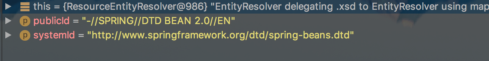](http://static.iocoder.cn/8f77d23019c10f4ac026968ce19067ef)DTD 验证模式

###### 5.3.2 DelegatingEntityResolver

```java
@Override
@Nullable
public InputSource resolveEntity(String publicId, @Nullable String systemId) throws SAXException, IOException {
	if (systemId != null) {
		// DTD 模式
		if (systemId.endsWith(DTD_SUFFIX)) {
			return this.dtdResolver.resolveEntity(publicId, systemId);
		// XSD 模式
		} else if (systemId.endsWith(XSD_SUFFIX)) {
			return this.schemaResolver.resolveEntity(publicId, systemId);
		}
	}
	return null;
}
```

###### 5.3.3 BeansDtdResolver

BeansDtdResolver 的解析过程，代码如下：

```java
/**
 * DTD 文件的后缀
 */
private static final String DTD_EXTENSION = ".dtd";
/**
 * Spring Bean DTD 的文件名
 */
private static final String DTD_NAME = "spring-beans";

@Override
@Nullable
public InputSource resolveEntity(String publicId, @Nullable String systemId) throws IOException {
    if (logger.isTraceEnabled()) {
        logger.trace("Trying to resolve XML entity with public ID [" + publicId +
                "] and system ID [" + systemId + "]");
    }
    // 必须以 .dtd 结尾
    if (systemId != null && systemId.endsWith(DTD_EXTENSION)) {
        // 获取最后一个 / 的位置
        int lastPathSeparator = systemId.lastIndexOf('/');
        // 获取 spring-beans 的位置
        int dtdNameStart = systemId.indexOf(DTD_NAME, lastPathSeparator);
        if (dtdNameStart != -1) { // 找到
            String dtdFile = DTD_NAME + DTD_EXTENSION;
            if (logger.isTraceEnabled()) {
                logger.trace("Trying to locate [" + dtdFile + "] in Spring jar on classpath");
            }
            try {
                // 创建 ClassPathResource 对象
                Resource resource = new ClassPathResource(dtdFile, getClass());
                // 创建 InputSource 对象，并设置 publicId、systemId 属性
                InputSource source = new InputSource(resource.getInputStream());
                source.setPublicId(publicId);
                source.setSystemId(systemId);
                if (logger.isTraceEnabled()) {
                    logger.trace("Found beans DTD [" + systemId + "] in classpath: " + dtdFile);
                }
                return source;
            }
            catch (IOException ex) {
                if (logger.isDebugEnabled()) {
                    logger.debug("Could not resolve beans DTD [" + systemId + "]: not found in classpath", ex);
                }
            }
        }
    }

    // 使用默认行为，从网络上下载
    // Use the default behavior -> download from website or wherever.
    return null;
}
```

从上面的代码中，我们可以看到，加载 DTD 类型的 `BeansDtdResolver#resolveEntity(...)` 过程，只是对 `systemId` 进行了简单的校验（从最后一个 / 开始，内容中是否包含 `spring-beans`），然后构造一个 InputSource 对象，并设置 `publicId`、`systemId` 属性，然后返回。

###### 5.3.4 PluggableSchemaResolver

```java
@Nullable
private final ClassLoader classLoader;

/**
 * Schema 文件地址
 */
private final String schemaMappingsLocation;

/** Stores the mapping of schema URL -> local schema path. */
@Nullable
private volatile Map<String, String> schemaMappings; // namespaceURI 与 Schema 文件地址的映射集合

@Override
@Nullable
public InputSource resolveEntity(String publicId, @Nullable String systemId) throws IOException {
    if (logger.isTraceEnabled()) {
        logger.trace("Trying to resolve XML entity with public id [" + publicId +
                "] and system id [" + systemId + "]");
    }

    if (systemId != null) {
        // 获得 Resource 所在位置
        String resourceLocation = getSchemaMappings().get(systemId);
        if (resourceLocation != null) {
            // 创建 ClassPathResource
            Resource resource = new ClassPathResource(resourceLocation, this.classLoader);
            try {
                // 创建 InputSource 对象，并设置 publicId、systemId 属性
                InputSource source = new InputSource(resource.getInputStream());
                source.setPublicId(publicId);
                source.setSystemId(systemId);
                if (logger.isTraceEnabled()) {
                    logger.trace("Found XML schema [" + systemId + "] in classpath: " + resourceLocation);
                }
                return source;
            }
            catch (FileNotFoundException ex) {
                if (logger.isDebugEnabled()) {
                    logger.debug("Could not find XML schema [" + systemId + "]: " + resource, ex);
                }
            }
        }
    }
    return null;
```

- 首先调用 `#getSchemaMappings()` 方法，获取一个映射表(systemId 与其在本地的对照关系)。代码如下：

  ```java
  private Map<String, String> getSchemaMappings() {
      Map<String, String> schemaMappings = this.schemaMappings;
      // 双重检查锁，实现 schemaMappings 单例
      if (schemaMappings == null) {
          synchronized (this) {
              schemaMappings = this.schemaMappings;
              if (schemaMappings == null) {
                  if (logger.isTraceEnabled()) {
                      logger.trace("Loading schema mappings from [" + this.schemaMappingsLocation + "]");
                  }
                  try {
                      // 以 Properties 的方式，读取 schemaMappingsLocation
                      Properties mappings = PropertiesLoaderUtils.loadAllProperties(this.schemaMappingsLocation, this.classLoader);
                      if (logger.isTraceEnabled()) {
                          logger.trace("Loaded schema mappings: " + mappings);
                      }
                      // 将 mappings 初始化到 schemaMappings 中
                      schemaMappings = new ConcurrentHashMap<>(mappings.size());
                      CollectionUtils.mergePropertiesIntoMap(mappings, schemaMappings);
                      this.schemaMappings = schemaMappings;
                  } catch (IOException ex) {
                      throw new IllegalStateException(
                              "Unable to load schema mappings from location [" + this.schemaMappingsLocation + "]", ex);
                  }
              }
          }
      }
      return schemaMappings;
  }
  ```

  - 映射表如下（**部分**）:[](http://static.iocoder.cn/4dba22abb6ce4bc1a7721afb2cb53567)映射表

- 然后，根据传入的 `systemId` 获取该 `systemId` 在本地的路径 `resourceLocation` 。

- 最后，根据 `resourceLocation` ，构造 InputSource 对象。

###### 5.3.5 ResourceEntityResolver

ResourceEntityResolver 的解析过程，代码如下:

```java
private final ResourceLoader resourceLoader;

@Override
@Nullable
public InputSource resolveEntity(String publicId, @Nullable String systemId) throws SAXException, IOException {
    // 调用父类的方法，进行解析
    InputSource source = super.resolveEntity(publicId, systemId);
    // 解析失败，resourceLoader 进行解析
    if (source == null && systemId != null) {
        // 获得 resourcePath ，即 Resource 资源地址
        String resourcePath = null;
        try {
            String decodedSystemId = URLDecoder.decode(systemId, "UTF-8"); // 使用 UTF-8 ，解码 systemId
            String givenUrl = new URL(decodedSystemId).toString(); // 转换成 URL 字符串
            // 解析文件资源的相对路径（相对于系统根路径）
            String systemRootUrl = new File("").toURI().toURL().toString();
            // Try relative to resource base if currently in system root.
            if (givenUrl.startsWith(systemRootUrl)) {
                resourcePath = givenUrl.substring(systemRootUrl.length());
            }
        } catch (Exception ex) {
            // Typically a MalformedURLException or AccessControlException.
            if (logger.isDebugEnabled()) {
                logger.debug("Could not resolve XML entity [" + systemId + "] against system root URL", ex);
            }
            // No URL (or no resolvable URL) -> try relative to resource base.
            resourcePath = systemId;
        }
        if (resourcePath != null) {
            if (logger.isTraceEnabled()) {
                logger.trace("Trying to locate XML entity [" + systemId + "] as resource [" + resourcePath + "]");
            }
            // 获得 Resource 资源
            Resource resource = this.resourceLoader.getResource(resourcePath);
            // 创建 InputSource 对象
            source = new InputSource(resource.getInputStream());
            // 设置 publicId 和 systemId 属性
            source.setPublicId(publicId);
            source.setSystemId(systemId);
            if (logger.isDebugEnabled()) {
                logger.debug("Found XML entity [" + systemId + "]: " + resource);
            }
        }
    }
    return source;
}
```

- 首先，调用**父类**的方法，进行解析。
- 如果失败，使用 `resourceLoader` ，尝试读取 `systemId` 对应的 Resource 资源。

###### 5.3.7 总结

是不是看到此处，有点懵逼，不是说好了分享**获取 Document 对象**，结果内容主要是 EntityResolver 呢？因为，从 XML 中获取 Document 对象，已经有 `javax.xml` 库进行解析。而 EntityResolver 的重点，是在于如何获取【验证文件】，从而验证用户写的 XML 是否通过验证。真正执行验证的是jdk自带的这块内容javax.xml.parsers.DocumentBuilder.parse。

果要解析一个 XML 文件，SAX 首先会读取该 XML 文档上的声明，然后根据声明去寻找相应的 DTD 定义，以便对文档进行验证。**默认的加载规则是通过网络方式下载验证文件**，而在实际生产环境中我们会遇到网络中断或者不可用状态，那么就应用就会因为无法下载验证文件而报错

#### 6. IoC 之注册 BeanDefinitions    

获取 XML Document 对象后，会根据该对象和 Resource 资源对象调用 `XmlBeanDefinitionReader#registerBeanDefinitions(Document doc, Resource resource)` 方法，开始注册 BeanDefinitions 之旅。代码如下：

```java
// AbstractBeanDefinitionReader.java
private final BeanDefinitionRegistry registry;

// XmlBeanDefinitionReader.java
public int registerBeanDefinitions(Document doc, Resource resource) throws BeanDefinitionStoreException {
	// <1> 创建 BeanDefinitionDocumentReader 对象
	BeanDefinitionDocumentReader documentReader = createBeanDefinitionDocumentReader();
	// <2> 获取已注册的 BeanDefinition 数量
	int countBefore = getRegistry().getBeanDefinitionCount();
	// <3> 创建 XmlReaderContext 对象
	// <4> 注册 BeanDefinition
	documentReader.registerBeanDefinitions(doc, createReaderContext(resource));
	// 计算新注册的 BeanDefinition 数量
	return getRegistry().getBeanDefinitionCount() - countBefore;
```

- `<1>` 处，调用 `#createBeanDefinitionDocumentReader()` 方法，实例化 BeanDefinitionDocumentReader 对象。
- `<2>` 处，调用 `BeanDefinitionRegistry#getBeanDefinitionCount()` 方法，获取**已注册**的 BeanDefinition 数量。
- `<3>` 处，调用 `#createReaderContext(Resource resource)` 方法，创建 XmlReaderContext 对象。
- `<4>` 处，调用 `BeanDefinitionDocumentReader#registerBeanDefinitions(Document doc, XmlReaderContext readerContext)` 方法，读取 XML 元素，注册 BeanDefinition 们。
- `<5>` 处，计**算新注册**的 BeanDefinition 数量。

##### 6.1 createBeanDefinitionDocumentReader

`#createBeanDefinitionDocumentReader()`，实例化 BeanDefinitionDocumentReader 对象。代码如下：

```java
/**
 * documentReader 的类
 *
 * @see #createBeanDefinitionDocumentReader() 
 */
private Class<? extends BeanDefinitionDocumentReader> documentReaderClass = DefaultBeanDefinitionDocumentReader.class;

protected BeanDefinitionDocumentReader createBeanDefinitionDocumentReader() {
	return BeanUtils.instantiateClass(this.documentReaderClass);
}
```

- `documentReaderClass` 的默认值为 `DefaultBeanDefinitionDocumentReader.class` 。关于它，我们在后续的文章，详细解析。

##### 6.2 registerBeanDefinitions

`reanDefinitionDocumentReader#registerBeanDefinitions(Document doc, XmlReaderContext readerContext)` 方法，注册 BeanDefinition ，在接口 BeanDefinitionDocumentReader 中定义。代码如下：

```java
public interface BeanDefinitionDocumentReader {

	/**
	 * Read bean definitions from the given DOM document and
	 * register them with the registry in the given reader context.
	 * @param doc the DOM document
	 * @param readerContext the current context of the reader
	 * (includes the target registry and the resource being parsed)
	 * @throws BeanDefinitionStoreException in case of parsing errors
	 */
	void registerBeanDefinitions(Document doc, XmlReaderContext readerContext)
			throws BeanDefinitionStoreException;

}
```

**从给定的 Document 对象中解析定义的 BeanDefinition 并将他们注册到注册表中**。方法接收两个参数：

- `doc` 方法参数：待解析的 Document 对象。
- `readerContext` 方法，解析器的当前上下文，包括目标注册表和被解析的资源。它是根据 Resource 来创建的，见 

###### 6.2.1 DefaultBeanDefinitionDocumentReader

BeanDefinitionDocumentReader 有且只有一个默认实现类 DefaultBeanDefinitionDocumentReader 。它对 `#registerBeanDefinitions(...)` 方法的实现代码如下：

DefaultBeanDefinitionDocumentReader 对该方法提供了实现：

```java
@Nullable
private XmlReaderContext readerContext;

@Nullable
private BeanDefinitionParserDelegate delegate;
    
/**
 * This implementation parses bean definitions according to the "spring-beans" XSD
 * (or DTD, historically).
 * <p>Opens a DOM Document; then initializes the default settings
 * specified at the {@code <beans/>} level; then parses the contained bean definitions.
 */
@Override
public void registerBeanDefinitions(Document doc, XmlReaderContext readerContext) {
    this.readerContext = readerContext;
    // 获得 XML Document Root Element
    // 执行注册 BeanDefinition
    doRegisterBeanDefinitions(doc.getDocumentElement());
}

/**
 * Register each bean definition within the given root {@code <beans/>} element.
 */
@SuppressWarnings("deprecation")  // for Environment.acceptsProfiles(String...)
protected void doRegisterBeanDefinitions(Element root) {
    // Any nested <beans> elements will cause recursion in this method. In
    // order to propagate and preserve <beans> default-* attributes correctly,
    // keep track of the current (parent) delegate, which may be null. Create
    // the new (child) delegate with a reference to the parent for fallback purposes,
    // then ultimately reset this.delegate back to its original (parent) reference.
    // this behavior emulates a stack of delegates without actually necessitating one.
    // 记录老的 BeanDefinitionParserDelegate 对象
    BeanDefinitionParserDelegate parent = this.delegate;
    // <1> 创建 BeanDefinitionParserDelegate 对象，并进行设置到 delegate
    this.delegate = createDelegate(getReaderContext(), root, parent);
    // <2> 检查 <beans /> 根标签的命名空间是否为空，或者是 http://www.springframework.org/schema/beans
    if (this.delegate.isDefaultNamespace(root)) {
        // <2.1> 处理 profile 属性。可参见《Spring3自定义环境配置 <beans profile="">》http://nassir.iteye.com/blog/1535799
        String profileSpec = root.getAttribute(PROFILE_ATTRIBUTE);
        if (StringUtils.hasText(profileSpec)) {
            // <2.2> 使用分隔符切分，可能有多个 profile 。
            String[] specifiedProfiles = StringUtils.tokenizeToStringArray(
                    profileSpec, BeanDefinitionParserDelegate.MULTI_VALUE_ATTRIBUTE_DELIMITERS);
            // <2.3> 如果所有 profile 都无效，则不进行注册
            // We cannot use Profiles.of(...) since profile expressions are not supported
            // in XML config. See SPR-12458 for details.
            if (!getReaderContext().getEnvironment().acceptsProfiles(specifiedProfiles)) {
                if (logger.isDebugEnabled()) {
                    logger.debug("Skipped XML bean definition file due to specified profiles [" + profileSpec +
                            "] not matching: " + getReaderContext().getResource());
                }
                return;
            }
        }
    }

    // <3> 解析前处理
    preProcessXml(root);
    // <4> 解析
    parseBeanDefinitions(root, this.delegate);
    // <5> 解析后处理
    postProcessXml(root);

    // 设置 delegate 回老的 BeanDefinitionParserDelegate 对象
    this.delegate = parent;
}
```

`<1>` 处，创建 BeanDefinitionParserDelegate 对象，并进行设置到 `delegate` 。BeanDefinitionParserDelegate 是一个重要的类，它负责**解析 BeanDefinition**。代码如下：

```java
protected BeanDefinitionParserDelegate createDelegate(
        XmlReaderContext readerContext, Element root, @Nullable BeanDefinitionParserDelegate parentDelegate) {
    // 创建 BeanDefinitionParserDelegate 对象
    BeanDefinitionParserDelegate delegate = new BeanDefinitionParserDelegate(readerContext);
    // 初始化默认
    delegate.initDefaults(root, parentDelegate);
    return delegate;
}
```

`<2>` 处，检查 `` **根**标签的命名空间是否为空，或者是 http://www.springframework.org/schema/beans 。

- `<2.1>` 处，判断是否 `` 上配置了 `profile` 属性。不了解这块的胖友，可以看下 [《《Spring3自定义环境配置 》》](http://nassir.iteye.com/blog/1535799) 。
- `<2.2>` 处，使用分隔符切分，可能有**多个** profile 。
- `<2.3>` 处，判断，如果所有 profile 都无效，则 `return` 不进行注册。

`<4>` 处，调用 `#parseBeanDefinitions(Element root, BeanDefinitionParserDelegate delegate)` 方法，进行解析逻辑。详细解析，见 [「3.1 parseBeanDefinitions」](http://svip.iocoder.cn/Spring/IoC-register-BeanDefinitions/#) 。

`<3>` / `<5>` 处，解析**前后**的处理，目前这两个方法都是空实现，交由子类来实现。代码如下：

```java
protected void preProcessXml(Element root) {}

protected void postProcessXml(Element root) {}
```

###### 6.2.2 parseBeanDefinitions

`#parseBeanDefinitions(Element root, BeanDefinitionParserDelegate delegate)` 方法，进行解析逻辑。代码如下：

```java
/**
 * Parse the elements at the root level in the document:
 * "import", "alias", "bean".
 * @param root the DOM root element of the document
 */
protected void parseBeanDefinitions(Element root, BeanDefinitionParserDelegate delegate) {
    // <1> 如果根节点使用默认命名空间，执行默认解析
    if (delegate.isDefaultNamespace(root)) {
        // 遍历子节点
        NodeList nl = root.getChildNodes();
        for (int i = 0; i < nl.getLength(); i++) {
            Node node = nl.item(i);
            if (node instanceof Element) {
                Element ele = (Element) node;
                // <1> 如果该节点使用默认命名空间，执行默认解析
                if (delegate.isDefaultNamespace(ele)) {
                    parseDefaultElement(ele, delegate);
                // 如果该节点非默认命名空间，执行自定义解析
                } else {
                    delegate.parseCustomElement(ele);
                }
            }
        }
    // <2> 如果根节点非默认命名空间，执行自定义解析
    } else {
        delegate.parseCustomElement(root);
    }
}
```

Spring 有**两种** Bean 声明方式：

- 配置文件式声明：`` 。对应 `<1>` 处。
- 自定义注解方式：`` 。对应 `<2>` 处。

`<1>` 处，如果**根**节点或**子**节点**使用**默认命名空间，调用 `#parseDefaultElement(Element ele, BeanDefinitionParserDelegate delegate)` 方法，执行默认解析。代码如下：

```java
private void parseDefaultElement(Element ele, BeanDefinitionParserDelegate delegate) {
	if (delegate.nodeNameEquals(ele, IMPORT_ELEMENT)) { // import
		importBeanDefinitionResource(ele);
	} else if (delegate.nodeNameEquals(ele, ALIAS_ELEMENT)) { // alias
		processAliasRegistration(ele);
	} else if (delegate.nodeNameEquals(ele, BEAN_ELEMENT)) { // bean
		processBeanDefinition(ele, delegate);
	} else if (delegate.nodeNameEquals(ele, NESTED_BEANS_ELEMENT)) { // beans
		// recurse
		doRegisterBeanDefinitions(ele);
	}
}
```

`<2>` 处，如果**根**节点或**子**节点**不使用**默认命名空间，调用 `BeanDefinitionParserDelegate#parseCustomElement(Element ele)` 方法，执行**自定义**解析。详细的解析，见后续文章。

##### 6.3 createReaderContext

`#createReaderContext(Resource resource)` 方法，创建 XmlReaderContext 对象。代码如下：

```java
private ProblemReporter problemReporter = new FailFastProblemReporter();
private ReaderEventListener eventListener = new EmptyReaderEventListener();
private SourceExtractor sourceExtractor = new NullSourceExtractor();
@Nullable
private NamespaceHandlerResolver namespaceHandlerResolver;

/**
 * Create the {@link XmlReaderContext} to pass over to the document reader.
 */
public XmlReaderContext createReaderContext(Resource resource) {
	return new XmlReaderContext(resource, this.problemReporter, this.eventListener,
			this.sourceExtractor, this, getNamespaceHandlerResolver());
}
```

关于 XmlReaderContext 的详细解析，见后续文章。

##### 6.4 小结

至此，`XmlBeanDefinitionReader#doLoadBeanDefinitions(InputSource inputSource, Resource resource)` 方法中，做的三件事情已经全部分析完毕，下面将对 **BeanDefinition 的解析过程**做详细分析说明。

另外，`XmlBeanDefinitionReader#doLoadBeanDefinitions(InputSource inputSource, Resource resource)` 方法，整体时序图如下：

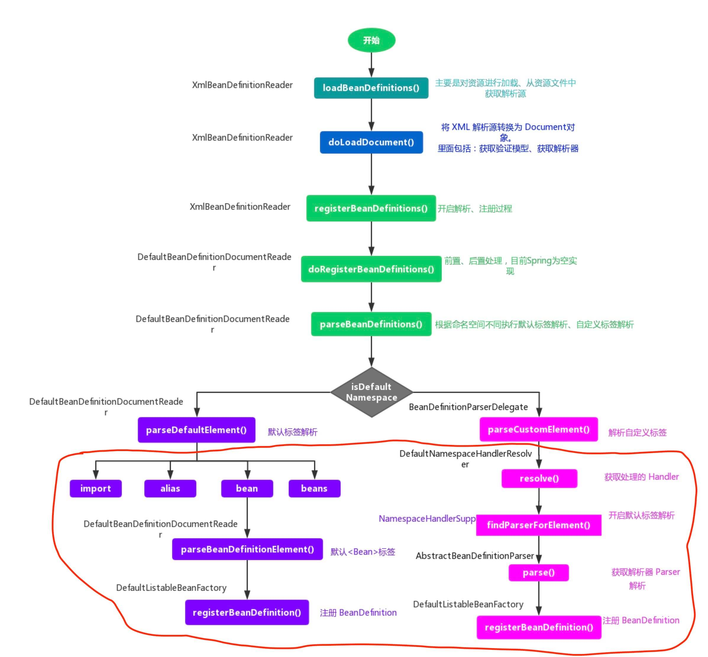

####  7. IoC 之解析Bean：解析 import 标签    

pring 中有两种解析 Bean 的方式：

- 如果根节点或者子节点采用默认命名空间的话，则调用 `#parseDefaultElement(...)` 方法，进行**默认**标签解析
- 否则，调用 `BeanDefinitionParserDelegate#parseCustomElement(...)` 方法，进行**自定义**解析。

```java
// DefaultBeanDefinitionDocumentReader.java

public static final String IMPORT_ELEMENT = "import";
public static final String ALIAS_ATTRIBUTE = "alias";
public static final String BEAN_ELEMENT = BeanDefinitionParserDelegate.BEAN_ELEMENT;
public static final String NESTED_BEANS_ELEMENT = "beans";

private void parseDefaultElement(Element ele, BeanDefinitionParserDelegate delegate) {
	if (delegate.nodeNameEquals(ele, IMPORT_ELEMENT)) { // import
		importBeanDefinitionResource(ele);
	} else if (delegate.nodeNameEquals(ele, ALIAS_ELEMENT)) { // alias
		processAliasRegistration(ele);
	} else if (delegate.nodeNameEquals(ele, BEAN_ELEMENT)) { // bean
		processBeanDefinition(ele, delegate);
	} else if (delegate.nodeNameEquals(ele, NESTED_BEANS_ELEMENT)) { // beans
		// recurse
		doRegisterBeanDefinitions(ele);
	}
}
```

该方法的功能一目了然，分别是对四种不同的标签进行解析，分别是 `import`、`alias`、`bean`、`beans` 。咱门从第一个标签 `import` 开始。

##### 7.1 import示例

经历过 Spring 配置文件的小伙伴都知道，如果工程比较大，配置文件的维护会让人觉得恐怖，文件太多了，想象将所有的配置都放在一个 `spring.xml` 配置文件中，哪种后怕感是不是很明显？

所有针对这种情况 Spring 提供了一个分模块的思路，利用 `import` 标签，例如我们可以构造一个这样的 `spring.xml` 。

```xml
<?xml version="1.0" encoding="UTF-8"?>
<beans xmlns="http://www.springframework.org/schema/beans"
       xmlns:xsi="http://www.w3.org/2001/XMLSchema-instance"
       xsi:schemaLocation="http://www.springframework.org/schema/beans
       http://www.springframework.org/schema/beans/spring-beans.xsd">

    <import resource="spring-student.xml"/>

    <import resource="spring-student-dtd.xml"/>

</beans>
```

`spring.xml` 配置文件中，使用 `import` 标签的方式导入其他模块的配置文件。

- 如果有配置需要修改直接修改相应配置文件即可。
- 若有新的模块需要引入直接增加 `import` 即可。

这样大大简化了配置后期维护的复杂度，同时也易于管理。

##### 7.2 importBeanDefinitionResource

Spring 使用 `#importBeanDefinitionResource(Element ele)` 方法，完成对 `import` 标签的解析。

```java
// DefaultBeanDefinitionDocumentReader.java

/**
 * Parse an "import" element and load the bean definitions
 * from the given resource into the bean factory.
 */
protected void importBeanDefinitionResource(Element ele) {
    // <1> 获取 resource 的属性值
    String location = ele.getAttribute(RESOURCE_ATTRIBUTE);
    // 为空，直接退出
    if (!StringUtils.hasText(location)) {
        getReaderContext().error("Resource location must not be empty", ele); // 使用 problemReporter 报错
        return;
    }

    // <2> 解析系统属性，格式如 ："${user.dir}"
    // Resolve system properties: e.g. "${user.dir}"
    location = getReaderContext().getEnvironment().resolveRequiredPlaceholders(location);

    // 实际 Resource 集合，即 import 的地址，有哪些 Resource 资源
    Set<Resource> actualResources = new LinkedHashSet<>(4);

    // <3> 判断 location 是相对路径还是绝对路径
    // Discover whether the location is an absolute or relative URI
    boolean absoluteLocation = false;
    try {
        absoluteLocation = ResourcePatternUtils.isUrl(location) || ResourceUtils.toURI(location).isAbsolute();
    } catch (URISyntaxException ex) {
        // cannot convert to an URI, considering the location relative
        // unless it is the well-known Spring prefix "classpath*:"
    }

    // Absolute or relative?
    // <4> 绝对路径
    if (absoluteLocation) {
        try {
            // 添加配置文件地址的 Resource 到 actualResources 中，并加载相应的 BeanDefinition 们
            int importCount = getReaderContext().getReader().loadBeanDefinitions(location, actualResources);
            if (logger.isTraceEnabled()) {
                logger.trace("Imported " + importCount + " bean definitions from URL location [" + location + "]");
            }
        } catch (BeanDefinitionStoreException ex) {
            getReaderContext().error(
                    "Failed to import bean definitions from URL location [" + location + "]", ele, ex);
        }
    // <5> 相对路径
    } else {
        // No URL -> considering resource location as relative to the current file.
        try {
            int importCount;
            // 创建相对地址的 Resource
            Resource relativeResource = getReaderContext().getResource().createRelative(location);
            // 存在
            if (relativeResource.exists()) {
                // 加载 relativeResource 中的 BeanDefinition 们
                importCount = getReaderContext().getReader().loadBeanDefinitions(relativeResource);
                // 添加到 actualResources 中
                actualResources.add(relativeResource);
            // 不存在
            } else {
                // 获得根路径地址
                String baseLocation = getReaderContext().getResource().getURL().toString();
                // 添加配置文件地址的 Resource 到 actualResources 中，并加载相应的 BeanDefinition 们
                importCount = getReaderContext().getReader().loadBeanDefinitions(
                        StringUtils.applyRelativePath(baseLocation, location) /* 计算绝对路径 */, actualResources);
            }
            if (logger.isTraceEnabled()) {
                logger.trace("Imported " + importCount + " bean definitions from relative location [" + location + "]");
            }
        } catch (IOException ex) {
            getReaderContext().error("Failed to resolve current resource location", ele, ex);
        } catch (BeanDefinitionStoreException ex) {
            getReaderContext().error(
                    "Failed to import bean definitions from relative location [" + location + "]", ele, ex);
        }
    }
    // <6> 解析成功后，进行监听器激活处理
    Resource[] actResArray = actualResources.toArray(new Resource[0]);
    getReaderContext().fireImportProcessed(location, actResArray, extractSource(ele));
}
```

解析 import 标签的过程较为清晰，整个过程如下：

```txt
<1> 处，获取 source 属性的值，该值表示资源的路径。
    <2> 处，解析路径中的系统属性，如 "${user.dir}" 。
<3> 处，判断资源路径 location 是绝对路径还是相对路径。详细解析，见 「2.1 判断路径」 。
    <4> 处，如果是绝对路径，则调递归调用 Bean 的解析过程，进行另一次的解析。详细解析，见 「2.2 处理绝对路径」 。
    <5> 处，如果是相对路径，则先计算出绝对路径得到 Resource，然后进行解析。详细解析，见 「2.3 处理相对路径」 。
<6> 处，通知监听器，完成解析。
```

###### 7.2.1 判断路劲

通过以下代码，来判断 `location` 是为相对路径还是绝对路径：

```java
absoluteLocation = ResourcePatternUtils.isUrl(location) // <1>
    || ResourceUtils.toURI(location).isAbsolute(); // <2>
```

判断绝对路径的规则如下：

- `<1>` 以 `classpath*:` 或者 `classpath:` 开头的为绝对路径。
- `<1>` 能够通过该 `location` 构建出 `java.net.URL` 为绝对路径。
- `<2>` 根据 `location` 构造 `java.net.URI` 判断调用 `#isAbsolute()` 方法，判断是否为绝对路径。

###### 7.2.2 处理绝对路径

如果 `location` 为绝对路径，则调用 `#loadBeanDefinitions(String location, Set actualResources)`， 方法。该方法在 `org.springframework.beans.factory.support.AbstractBeanDefinitionReader` 中定义，代码如下：

```java
/**
 * Load bean definitions from the specified resource location.
 * <p>The location can also be a location pattern, provided that the
 * ResourceLoader of this bean definition reader is a ResourcePatternResolver.
 * @param location the resource location, to be loaded with the ResourceLoader
 * (or ResourcePatternResolver) of this bean definition reader
 * @param actualResources a Set to be filled with the actual Resource objects
 * that have been resolved during the loading process. May be {@code null}
 * to indicate that the caller is not interested in those Resource objects.
 * @return the number of bean definitions found
 * @throws BeanDefinitionStoreException in case of loading or parsing errors
 * @see #getResourceLoader()
 * @see #loadBeanDefinitions(org.springframework.core.io.Resource)
 * @see #loadBeanDefinitions(org.springframework.core.io.Resource[])
 */
public int loadBeanDefinitions(String location, @Nullable Set<Resource> actualResources) throws BeanDefinitionStoreException {
    // 获得 ResourceLoader 对象
    ResourceLoader resourceLoader = getResourceLoader();
    if (resourceLoader == null) {
        throw new BeanDefinitionStoreException(
                "Cannot load bean definitions from location [" + location + "]: no ResourceLoader available");
    }

    if (resourceLoader instanceof ResourcePatternResolver) {
        // Resource pattern matching available.
        try {
            // 获得 Resource 数组，因为 Pattern 模式匹配下，可能有多个 Resource 。例如说，Ant 风格的 location
            Resource[] resources = ((ResourcePatternResolver) resourceLoader).getResources(location);
            // 加载 BeanDefinition 们
            int count = loadBeanDefinitions(resources);
            // 添加到 actualResources 中
            if (actualResources != null) {
                Collections.addAll(actualResources, resources);
            }
            if (logger.isTraceEnabled()) {
                logger.trace("Loaded " + count + " bean definitions from location pattern [" + location + "]");
            }
            return count;
        } catch (IOException ex) {
            throw new BeanDefinitionStoreException(
                    "Could not resolve bean definition resource pattern [" + location + "]", ex);
        }
    } else {
        // Can only load single resources by absolute URL.
        // 获得 Resource 对象，
        Resource resource = resourceLoader.getResource(location);
        // 加载 BeanDefinition 们
        int count = loadBeanDefinitions(resource);
        // 添加到 actualResources 中
        if (actualResources != null) {
            actualResources.add(resource);
        }
        if (logger.isTraceEnabled()) {
            logger.trace("Loaded " + count + " bean definitions from location [" + location + "]");
        }
        return count;
    }
}
```

整个逻辑比较简单：

- 首先，获取 ResourceLoader 对象。
- 然后，根据不同的 ResourceLoader 执行不同的逻辑，主要是可能存在多个 Resource 。
- 最终，都会回归到 `XmlBeanDefinitionReader#loadBeanDefinitions(Resource... resources)` 方法，所以这是一个递归的过程。
- 另外，获得到的 Resource 的对象或数组，都会添加到 `actualResources` 中

###### 7.2.3 处理相对路径

如果 `location` 是相对路径，则会根据相应的 Resource 计算出相应的相对路径的 Resource 对象 ，然后：

- 若该 Resource 存在，则调用 `XmlBeanDefinitionReader#loadBeanDefinitions()` 方法，进行 BeanDefinition 加载。
- 否则，构造一个绝对 `location`( 即 `StringUtils.applyRelativePath(baseLocation, location)` 处的代码)，并调用 `#loadBeanDefinitions(String location, Set actualResources)` 方法，**与绝对路径过程一样**。

##### 7.3 小结

至此，`import` 标签解析完毕，整个过程比较清晰明了：**获取 source 属性值，得到正确的资源路径，然后调用 `XmlBeanDefinitionReader#loadBeanDefinitions(Resource... resources)` 方法，进行递归的 BeanDefinition 加载**。

#### 8. IoC 之解析bean 标签

##### 8.1  processBeanDefinition

在方法 `#parseDefaultElement(...)` 方法中，如果遇到标签为 `bean` 时，则调用 `#processBeanDefinition(Element ele, BeanDefinitionParserDelegate delegate)` 方法，进行 `bean` 标签的解析。代码如下：

```java
// DefaultBeanDefinitionDocumentReader.java

/**
 * Process the given bean element, parsing the bean definition
 * and registering it with the registry.
 */
protected void processBeanDefinition(Element ele, BeanDefinitionParserDelegate delegate) {
    // 进行 bean 元素解析。
    // <1> 如果解析成功，则返回 BeanDefinitionHolder 对象。而 BeanDefinitionHolder 为 name 和 alias 的 BeanDefinition 对象
    // 如果解析失败，则返回 null 。
    BeanDefinitionHolder bdHolder = delegate.parseBeanDefinitionElement(ele);
    if (bdHolder != null) {
        // <2> 进行自定义标签处理
        bdHolder = delegate.decorateBeanDefinitionIfRequired(ele, bdHolder);
        try {
            // <3> 进行 BeanDefinition 的注册
            // Register the final decorated instance.
            BeanDefinitionReaderUtils.registerBeanDefinition(bdHolder, getReaderContext().getRegistry());
        } catch (BeanDefinitionStoreException ex) {
            getReaderContext().error("Failed to register bean definition with name '" +
                    bdHolder.getBeanName() + "'", ele, ex);
        }
        // <4> 发出响应事件，通知相关的监听器，已完成该 Bean 标签的解析。
        // Send registration event.
        getReaderContext().fireComponentRegistered(new BeanComponentDefinition(bdHolder));
    }
}
```

##### 8.2 parseBeanDefinitionElement

`BeanDefinitionParserDelegate#parseBeanDefinitionElement(Element ele, BeanDefinitionParserDelegate delegate)` 方法，进行 `` 元素解析。代码如下：

```java
// BeanDefinitionParserDelegate.java

/**
 * Parses the supplied {@code <bean>} element. May return {@code null}
 * if there were errors during parse. Errors are reported to the
 * {@link org.springframework.beans.factory.parsing.ProblemReporter}.
 */
@Nullable
public BeanDefinitionHolder parseBeanDefinitionElement(Element ele) {
    return parseBeanDefinitionElement(ele, null);
}

/**
 * Parses the supplied {@code <bean>} element. May return {@code null}
 * if there were errors during parse. Errors are reported to the
 * {@link org.springframework.beans.factory.parsing.ProblemReporter}.
 *
 * @param containingBean TODO 芋艿，需要进一步确认
 */
@Nullable
public BeanDefinitionHolder parseBeanDefinitionElement(Element ele, @Nullable BeanDefinition containingBean) {
    // <1> 解析 id 和 name 属性
    String id = ele.getAttribute(ID_ATTRIBUTE);
    String nameAttr = ele.getAttribute(NAME_ATTRIBUTE);

    // <1> 计算别名集合
    List<String> aliases = new ArrayList<>();
    if (StringUtils.hasLength(nameAttr)) {
        String[] nameArr = StringUtils.tokenizeToStringArray(nameAttr, MULTI_VALUE_ATTRIBUTE_DELIMITERS);
        aliases.addAll(Arrays.asList(nameArr));
    }

    // <3.1> beanName ，优先，使用 id
    String beanName = id;
    // <3.2> beanName ，其次，使用 aliases 的第一个
    if (!StringUtils.hasText(beanName) && !aliases.isEmpty()) {
        beanName = aliases.remove(0); // 移除出别名集合
        if (logger.isTraceEnabled()) {
            logger.trace("No XML 'id' specified - using '" + beanName +
                    "' as bean name and " + aliases + " as aliases");
        }
    }
    // <2> 检查 beanName 的唯一性
    if (containingBean == null) {
        checkNameUniqueness(beanName, aliases, ele);
    }
    // <4> 解析属性，构造 AbstractBeanDefinition 对象
    AbstractBeanDefinition beanDefinition = parseBeanDefinitionElement(ele, beanName, containingBean);
    if (beanDefinition != null) {
        // <3.3> beanName ，再次，使用 beanName 生成规则
        if (!StringUtils.hasText(beanName)) {
            try {
                if (containingBean != null) {
                    // <3.3> 生成唯一的 beanName
                    beanName = BeanDefinitionReaderUtils.generateBeanName(
                            beanDefinition, this.readerContext.getRegistry(), true);
                } else {
                    // <3.3> 生成唯一的 beanName
                    beanName = this.readerContext.generateBeanName(beanDefinition);
                    // TODO 芋艿，需要进一步确认
                    // Register an alias for the plain bean class name, if still possible,
                    // if the generator returned the class name plus a suffix.
                    // This is expected for Spring 1.2/2.0 backwards compatibility.
                    String beanClassName = beanDefinition.getBeanClassName();
                    if (beanClassName != null &&
                            beanName.startsWith(beanClassName) && beanName.length() > beanClassName.length() &&
                            !this.readerContext.getRegistry().isBeanNameInUse(beanClassName)) {
                        aliases.add(beanClassName);
                    }
                }
                if (logger.isTraceEnabled()) {
                    logger.trace("Neither XML 'id' nor 'name' specified - " +
                            "using generated bean name [" + beanName + "]");
                }
            } catch (Exception ex) {
                error(ex.getMessage(), ele);
                return null;
            }
        }
        // <5> 创建 BeanDefinitionHolder 对象
        String[] aliasesArray = StringUtils.toStringArray(aliases);
        return new BeanDefinitionHolder(beanDefinition, beanName, aliasesArray);
    }
    return null;
}
```

这个方法还没有对 `bean` 标签进行解析，只是在解析动作之前做了一些功能架构，主要的工作有：

- `<1>` 处，解析 `id`、`name` 属性，确定 `aliases` 集合

- `<2>` 处，检测 `beanName` 是否唯一。代码如下：

  ```java
  /**
   * 已使用 Bean 名字的集合
   *
   * Stores all used bean names so we can enforce uniqueness on a per
   * beans-element basis. Duplicate bean ids/names may not exist within the
   * same level of beans element nesting, but may be duplicated across levels.
   */
  private final Set<String> usedNames = new HashSet<>();
  
  /**
   * Validate that the specified bean name and aliases have not been used already
   * within the current level of beans element nesting.
   */
  protected void checkNameUniqueness(String beanName, List<String> aliases, Element beanElement) {
  	// 寻找是否 beanName 已经使用
      String foundName = null;
  	if (StringUtils.hasText(beanName) && this.usedNames.contains(beanName)) {
  		foundName = beanName;
  	}
  	if (foundName == null) {
  		foundName = CollectionUtils.findFirstMatch(this.usedNames, aliases);
  	}
  	// 若已使用，使用 problemReporter 提示错误
  	if (foundName != null) {
  		error("Bean name '" + foundName + "' is already used in this <beans> element", beanElement);
  	}
  
  	// 添加到 usedNames 集合
  	this.usedNames.add(beanName);
  	this.usedNames.addAll(aliases);
  }
  ```

- 这里有必要说下 `beanName` 的命名规则：

  - `<3.1>` 处，如果 `id` 不为空，则 `beanName = id` 。
  - `<3.2>` 处，如果 `id` 为空，但是 `aliases` 不空，则 `beanName` 为 `aliases` 的**第一个**元素
  - `<3.3>` 处，如果两者都为空，则根据**默认规则**来设置 beanName 。因为**默认规则**不是本文的重点，所以暂时省略。感兴趣的胖友，自己研究下哈。

- `<4>` 处，调用 `#parseBeanDefinitionElement(Element ele, String beanName, BeanDefinition containingBean)` 方法，对属性进行解析并封装成 AbstractBeanDefinition 实例 `beanDefinition` 。

- `<5>` 处，根据所获取的信息（`beanName`、`aliases`、`beanDefinition`）构造 BeanDefinitionHolder 实例对象并返回。其中，BeanDefinitionHolder 的简化代码如下：

  ```java
  /**
   * BeanDefinition 对象
   */
  private final BeanDefinition beanDefinition;
  /**
   * Bean 名字
   */
  private final String beanName;
  /**
   * 别名集合
   */
  @Nullable
  private final String[] aliases;
  ```

###### 8.2.1 parseBeanDefinitionElement

`#parseBeanDefinitionElement(Element ele, String beanName, BeanDefinition containingBean)` 方法，对属性进行解析并封装成 AbstractBeanDefinition 实例，代码如下

```java
/**
 * Parse the bean definition itself, without regard to name or aliases. May return
 * {@code null} if problems occurred during the parsing of the bean definition.
 */
@Nullable
public AbstractBeanDefinition parseBeanDefinitionElement(
        Element ele, String beanName, @Nullable BeanDefinition containingBean) {
    this.parseState.push(new BeanEntry(beanName));
    // 解析 class 属性
    String className = null;
    if (ele.hasAttribute(CLASS_ATTRIBUTE)) {
        className = ele.getAttribute(CLASS_ATTRIBUTE).trim();
    }
    // 解析 parent 属性
    String parent = null;
    if (ele.hasAttribute(PARENT_ATTRIBUTE)) {
        parent = ele.getAttribute(PARENT_ATTRIBUTE);
    }
    try {
        // 创建用于承载属性的 AbstractBeanDefinition 实例
        AbstractBeanDefinition bd = createBeanDefinition(className, parent);
        // 解析默认 bean 的各种属性
        parseBeanDefinitionAttributes(ele, beanName, containingBean, bd);
        // 提取 description
        bd.setDescription(DomUtils.getChildElementValueByTagName(ele, DESCRIPTION_ELEMENT));
        // tips：
        // 下面的一堆是解析 <bean>......</bean> 内部的子元素，
        // 解析出来以后的信息都放到 bd 的属性中
        // 解析元数据 <meta />
        parseMetaElements(ele, bd);
        // 解析 lookup-method 属性 <lookup-method />
        parseLookupOverrideSubElements(ele, bd.getMethodOverrides());
        // 解析 replaced-method 属性 <replaced-method />
        parseReplacedMethodSubElements(ele, bd.getMethodOverrides());
        // 解析构造函数参数 <constructor-arg />
        parseConstructorArgElements(ele, bd);
        // 解析 property 子元素 <property />
        parsePropertyElements(ele, bd);
        // 解析 qualifier 子元素 <qualifier />
        parseQualifierElements(ele, bd);
        bd.setResource(this.readerContext.getResource());
        bd.setSource(extractSource(ele));
        return bd;
    } catch (ClassNotFoundException ex) {
        error("Bean class [" + className + "] not found", ele, ex);
    } catch (NoClassDefFoundError err) {
        error("Class that bean class [" + className + "] depends on not found", ele, err);
    } catch (Throwable ex) {
        error("Unexpected failure during bean definition parsing", ele, ex);
    } finally {
        this.parseState.pop();
    }

    return null;
}
```

到这里，`bean` 标签的所有属性我们都可以看到其解析的过程，也就说到这里我们已经解析一个基本可用的 BeanDefinition 。

###### 8.2.2 createBeanDefinition

`#createBeanDefinition(String className, String parentName)` 方法，创建 AbstractBeanDefinition 对象。代码如下：

```java
/**
 * Create a bean definition for the given class name and parent name.
 * @param className the name of the bean class
 * @param parentName the name of the bean's parent bean
 * @return the newly created bean definition
 * @throws ClassNotFoundException if bean class resolution was attempted but failed
 */
protected AbstractBeanDefinition createBeanDefinition(@Nullable String className, @Nullable String parentName)
		throws ClassNotFoundException {
	return BeanDefinitionReaderUtils.createBeanDefinition(
			parentName, className, this.readerContext.getBeanClassLoader());
}
```

##### 8.3 BeanDefinition

`org.springframework.beans.factory.config.BeanDefinition` ，是一个接口，它描述了一个 Bean 实例的**定义**，包括属性值、构造方法值和继承自它的类的更多信息。代码如下：

```java
String SCOPE_SINGLETON = ConfigurableBeanFactory.SCOPE_SINGLETON;
String SCOPE_PROTOTYPE = ConfigurableBeanFactory.SCOPE_PROTOTYPE;


int ROLE_APPLICATION = 0;
int ROLE_SUPPORT = 1;
int ROLE_INFRASTRUCTURE = 2;

void setParentName(@Nullable String parentName);
@Nullable
String getParentName();

void setBeanClassName(@Nullable String beanClassName);
@Nullable
String getBeanClassName();

void setScope(@Nullable String scope);
@Nullable
String getScope();

void setLazyInit(boolean lazyInit);
boolean isLazyInit();

void setDependsOn(@Nullable String... dependsOn);
@Nullable
String[] getDependsOn();

void setAutowireCandidate(boolean autowireCandidate);
boolean isAutowireCandidate();

void setPrimary(boolean primary);
boolean isPrimary();

void setFactoryBeanName(@Nullable String factoryBeanName);
@Nullable
String getFactoryBeanName();

void setFactoryMethodName(@Nullable String factoryMethodName);
@Nullable
String getFactoryMethodName();

ConstructorArgumentValues getConstructorArgumentValues();
default boolean hasConstructorArgumentValues() {
	return !getConstructorArgumentValues().isEmpty();
}

MutablePropertyValues getPropertyValues();
default boolean hasPropertyValues() {
	return !getPropertyValues().isEmpty();
}

void setInitMethodName(@Nullable String initMethodName);
@Nullable
String getInitMethodName();

void setDestroyMethodName(@Nullable String destroyMethodName);
@Nullable
String getDestroyMethodName();

void setRole(int role);
int getRole();

void setDescription(@Nullable String description);
@Nullable
String getDescription();

boolean isSingleton();

boolean isPrototype();

boolean isAbstract();

@Nullable
String getResourceDescription();

@Nullable
BeanDefinition getOriginatingBeanDefinition();
```

###### 8.3.1 BeanDefinition 的父关系

BeanDefinition  继承 AttributeAccessor 和 BeanMetadataElement 接口。两个接口定义如下：

- `org.springframework.cor.AttributeAccessor` 接口，定义了与其它对象的（元数据）进行连接和访问的约定，即对属性的修改，包括获取、设置、删除。代码如下：

  ```java
  public interface AttributeAccessor {
  
  	void setAttribute(String name, @Nullable Object value);
  
  	@Nullable
  	Object getAttribute(String name);
  
  	@Nullable
  	Object removeAttribute(String name);
  
  	boolean hasAttribute(String name);
  
  	String[] attributeNames();
  
  }
  ```

- `org.springframework.beans.BeanMetadataElement` 接口，Bean 元对象持有的配置元素可以通过 `#getSource()` 方法来获取。代码如下：

  ```java
  public interface BeanMetadataElement {
  	@Nullable
  	Object getSource();
  }
  ```

###### 8.3.2 BeanDefinition 的子关系

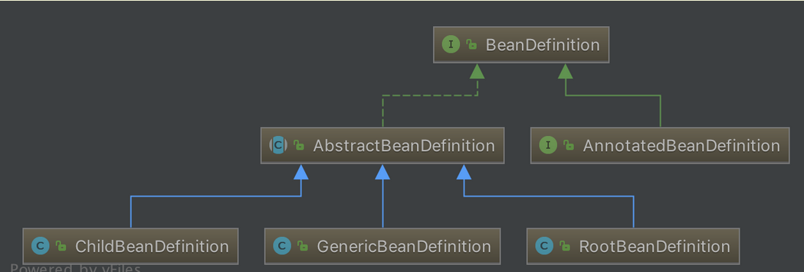

我们常用的三个实现类有：

- `org.springframework.beans.factory.support.ChildBeanDefinition`
- `org.springframework.beans.factory.support.RootBeanDefinition`
- `org.springframework.beans.factory.support.GenericBeanDefinition`
- ChildBeanDefinition、RootBeanDefinition、GenericBeanDefinition 三者都继承  AbstractBeanDefinition 抽象类，即 AbstractBeanDefinition 对三个子类的共同的类信息进行抽象。
- 如果配置文件中定义了父 `` 和 子 `` ，则父 `` 用 RootBeanDefinition 表示，子 ``  用 ChildBeanDefinition 表示，而没有父 `` 的就使用RootBeanDefinition 表示。
- GenericBeanDefinition 为一站式服务类。这个解释一脸懵逼？没事，继续往下看。

##### 8.4 解析bean标签

在 `BeanDefinitionParserDelegate#parseBeanDefinitionElement(Element ele, String beanName, BeanDefinition containingBean)` 方法中，完成解析后，返回的是一个已经完成对 `` 标签解析的 BeanDefinition 实例。

###### 8.4.1 createBeanDefinition

在该方法内部，首先调用 `#createBeanDefinition(String className, String parentName)` 方法，创建 AbstractBeanDefinition 对象。代码如下：

```java
protected AbstractBeanDefinition createBeanDefinition(@Nullable String className, @Nullable String parentName)
		throws ClassNotFoundException {
	return BeanDefinitionReaderUtils.createBeanDefinition(
			parentName, className, this.readerContext.getBeanClassLoader());
}
```

- 委托 BeanDefinitionReaderUtils 创建，代码如下：

  ```java
  // BeanDefinitionReaderUtils.java
  
  public static AbstractBeanDefinition createBeanDefinition(
          @Nullable String parentName, @Nullable String className, @Nullable ClassLoader classLoader) throws ClassNotFoundException {
      // 创建 GenericBeanDefinition 对象
      GenericBeanDefinition bd = new GenericBeanDefinition();
      // 设置 parentName
      bd.setParentName(parentName);
      if (className != null) {
          // 设置 beanClass
          if (classLoader != null) {
              bd.setBeanClass(ClassUtils.forName(className, classLoader));
          // 设置 beanClassName
          } else {
              bd.setBeanClassName(className);
          }
      }
      return bd;
  }
  ```

  - 该方法主要是，创建 GenericBeanDefinition 对象，并设置 `parentName`、`className`、`beanClass` 属性。

###### 8.4.2 parseBeanDefinitionAttributes

创建完 GenericBeanDefinition 实例后，再调用 `#parseBeanDefinitionAttributes(Element ele, String beanName, BeanDefinition containingBean, AbstractBeanDefinition bd)` 方法，该方法将创建好的 GenericBeanDefinition 实例当做参数，对 `bean` 标签的所有属性进行解析看源码org.springframework.beans.factory.xml.BeanDefinitionParserDelegate#parseBeanDefinitionAttributes。

##### 8.5 bean其他标签内容

- `meta` ：元数据。
- `lookup-method` ：Spring 动态改变 bean 里方法的实现。方法执行返回的对象，使用 Spring 内原有的这类对象替换，通过改变方法返回值来动态改变方法。内部实现为使用 cglib 方法，重新生成子类，重写配置的方法和返回对象，达到动态改变的效果。

- `replace-method` ：Spring 动态改变 bean 里方法的实现。需要改变的方法，使用 Spring 内原有其他类（需要继承接口`org.springframework.beans.factory.support.MethodReplacer`）的逻辑，替换这个方法。通过改变方法执行逻辑来动态改变方法。

###### 8.5.1 meta 子元素

元数据。当需要使用里面的信息时可以通过 key 获取。

meta 所声明的 key 并不会在 Bean 中体现，只是一个额外的声明，当我们需要使用里面的信息时，通过调用 BeanDefinition 的 `#getAttribute(String name)` 方法来获取。该子元素的解析过程，代码如下：

```java
// BeanDefinitionParserDelegate.java
public void parseMetaElements(Element ele, BeanMetadataAttributeAccessor attributeAccessor) {
    NodeList nl = ele.getChildNodes();
    // 遍历子节点
    for (int i = 0; i < nl.getLength(); i++) {
        Node node = nl.item(i);
        // <meta key="special-data" value="sprecial stragey" />
        if (isCandidateElement(node) && nodeNameEquals(node, META_ELEMENT)) { // 标签名为 meta
            Element metaElement = (Element) node;
            String key = metaElement.getAttribute(KEY_ATTRIBUTE); // key
            String value = metaElement.getAttribute(VALUE_ATTRIBUTE); // value
            // 创建 BeanMetadataAttribute 对象
            BeanMetadataAttribute attribute = new BeanMetadataAttribute(key, value);
            attribute.setSource(extractSource(metaElement));
            // 添加到 BeanMetadataAttributeAccessor 中
            attributeAccessor.addMetadataAttribute(attribute);
        }
    }
}
```

解析过程较为简单，获取相应的 key - value 构建 BeanMetadataAttribute 对象，然后调用 `BeanMetadataAttributeAccessor#addMetadataAttribute(BeanMetadataAttribute)` 方法，添加 BeanMetadataAttribute 加入到 AbstractBeanDefinition 中。

addMetadataAttribute

调用 `BeanMetadataAttributeAccessor#addMetadataAttribute(BeanMetadataAttribute)` 方法，添加 BeanMetadataAttribute 加入到 AbstractBeanDefinition 中。代码如下：

```java
// BeanMetadataAttributeAccessor.java

public void addMetadataAttribute(BeanMetadataAttribute attribute) {
	super.setAttribute(attribute.getName(), attribute);
}
```

- 委托 AttributeAccessorSupport 实现，如下：

```java
// AttributeAccessorSupport.java

/** Map with String keys and Object values. */
private final Map<String, Object> attributes = new LinkedHashMap<>();

@Override
public void setAttribute(String name, @Nullable Object value) {
	Assert.notNull(name, "Name must not be null");
	if (value != null) {
		this.attributes.put(name, value);
	} else {
		removeAttribute(name);
	}
}
```

`org.springframework.core.AttributeAccessorSupport` ，是接口 AttributeAccessor 的实现者。 AttributeAccessor 接口定义了与其他对象的元数据进行连接和访问的约定，可以通过该接口对属性进行获取、设置、删除操作。

getAttribute

设置元数据后，则可以通过调用 BeanDefinition 的  `#getAttribute(String name)` 方法来获取属性。代码如下：

```java
// AttributeAccessorSupport.java

/** Map with String keys and Object values. */
private final Map<String, Object> attributes = new LinkedHashMap<>();

@Override
@Nullable
public Object getAttribute(String name) {
	Assert.notNull(name, "Name must not be null");
	return this.attributes.get(name);
}
```

###### 8.5.2 lookup-method 子元素

**lookup-method** ：获取器注入，是把一个方法声明为返回某种类型的 bean 但实际要返回的 bean 是在配置文件里面配置的。该方法可以用于设计一些可插拔的功能上，解除程序依赖

```java
public interface Car {
   void display();
}
public class Bmw implements Car{
    @Override
    public void display() {
        System.out.println("我是 BMW");
    }
}
public class Hongqi implements Car{
    @Override
    public void display() {
        System.out.println("我是 hongqi");
    }
}

public abstract class Display {
    public void display(){
        getCar().display();
    } 
    public abstract Car getCar();

}
public static void main(String[] args) {
    ApplicationContext context = new ClassPathXmlApplicationContext("classpath:spring.xml");
    Display display = (Display) context.getBean("display");
    display.display();
}
```

XML 配置内容如下：

```xml
<bean id="display" class="org.springframework.core.test1.Display">
    <lookup-method name="getCar" bean="hongqi"/>
</bean>
```

parseLookupOverrideSubElements

看了这个示例，我们初步了解了 `looku-method` 子元素提供的功能了。其解析通过 `#parseLookupOverrideSubElements(Element beanEle, MethodOverrides overrides)` 方法，代码如下：

```
// BeanDefinitionParserDelegate.java

public void parseLookupOverrideSubElements(Element beanEle, MethodOverrides overrides) {
    NodeList nl = beanEle.getChildNodes();
    // 遍历子节点
    for (int i = 0; i < nl.getLength(); i++) {
        Node node = nl.item(i);
        if (isCandidateElement(node) && nodeNameEquals(node, LOOKUP_METHOD_ELEMENT)) { // 标签名为 lookup-method
            Element ele = (Element) node;
            String methodName = ele.getAttribute(NAME_ATTRIBUTE); // name
            String beanRef = ele.getAttribute(BEAN_ELEMENT); // bean
            // 创建 LookupOverride 对象
            LookupOverride override = new LookupOverride(methodName, beanRef);
            override.setSource(extractSource(ele));
            // 添加到 MethodOverrides 中
            overrides.addOverride(override);
        }
    }
}
```

解析过程和 `meta` 子元素没有多大区别，同样是解析 methodName、beanRef 构造一个 LookupOverride 对象，然后记录到 AbstractBeanDefinition 中的 `methodOverrides` 属性中。

在实例化 Bean 的时候，再详细阐述具体的实现过程，这里仅仅只是一个**标记**作用

###### 8.5.3 replace-method 子元素

可以在运行时调用新的方法替换现有的方法，还能动态的更新原有方法的逻辑。

该标签使用方法和 `lookup-method` 标签差不多，只不过替代方法的类需要实现 `org.springframework.beans.factory.support.MethodReplacer` 接口。如下:

```java
public class Method {

    public void display(){
        System.out.println("我是原始方法");
    }

}

public class MethodReplace implements MethodReplacer {

    @Override
    public Object reimplement(Object obj, Method method, Object[] args) throws Throwable {
        System.out.println("我是替换方法");
        return null;
    }

}

public static void main(String[] args) {
    ApplicationContext context = new ClassPathXmlApplicationContext("classpath:spring.xml");
    Method method = (Method) context.getBean("method");
    method.display();
}
```

xml示例

```xml
<bean id="methodReplace" class="org.springframework.core.test1.MethodReplace"/>

<bean id="method" class="org.springframework.core.test1.Method">

    <replaced-method name="display" replacer="methodReplace"/>

</bean>
```

上面代码演示了 `replaced-method` 子元素的用法，其解析通过 `#parseReplacedMethodSubElements(Element beanEle, MethodOverrides overrides)` 方法，代码如下：

```java
/**
 * Parse replaced-method sub-elements of the given bean element.
 */
public void parseReplacedMethodSubElements(Element beanEle, MethodOverrides overrides) {
    NodeList nl = beanEle.getChildNodes();
    // 遍历子节点
    for (int i = 0; i < nl.getLength(); i++) {
        Node node = nl.item(i);
        if (isCandidateElement(node) && nodeNameEquals(node, REPLACED_METHOD_ELEMENT)) { // 标签名为 replace-method
            Element replacedMethodEle = (Element) node;
            String name = replacedMethodEle.getAttribute(NAME_ATTRIBUTE); // name
            String callback = replacedMethodEle.getAttribute(REPLACER_ATTRIBUTE); // replacer
            // 创建 ReplaceOverride 对象
            ReplaceOverride replaceOverride = new ReplaceOverride(name, callback);
            // Look for arg-type match elements. 参见 《spring bean中lookup-method属性 replaced-method属性》 http://linql2010-126-com.iteye.com/blog/2018385
            List<Element> argTypeEles = DomUtils.getChildElementsByTagName(replacedMethodEle, ARG_TYPE_ELEMENT); // arg-type 子标签
            for (Element argTypeEle : argTypeEles) {
                String match = argTypeEle.getAttribute(ARG_TYPE_MATCH_ATTRIBUTE); // arg-type 子标签的 match 属性
                match = (StringUtils.hasText(match) ? match : DomUtils.getTextValue(argTypeEle));
                if (StringUtils.hasText(match)) {
                    replaceOverride.addTypeIdentifier(match);
                }
            }
            replaceOverride.setSource(extractSource(replacedMethodEle));
            // 添加到 MethodOverrides 中
            overrides.addOverride(replaceOverride);
        }
    }
}
```

该子元素和 `lookup-method` 标签的解析过程差不多，同样是提取 `name` 和 `replacer` 属性构建 ReplaceOverride 对象，然后记录到 AbstractBeanDefinition 中的 `methodOverrides` 属性中。

在实例化 Bean 的时候，再详细阐述具体的实现过程，这里仅仅只是一个**标记**作用。

##### 8.6  bean的其他标签内容

###### 8.6.1 constructor-arg 子元素

1. parseConstructorArgElements

```java
// BeanDefinitionParserDelegate.java

public void parseConstructorArgElements(Element beanEle, BeanDefinition bd) {
	NodeList nl = beanEle.getChildNodes();
	for (int i = 0; i < nl.getLength(); i++) {
		Node node = nl.item(i);
		if (isCandidateElement(node) && nodeNameEquals(node, CONSTRUCTOR_ARG_ELEMENT)) { // 标签名为 constructor-arg
			parseConstructorArgElement((Element) node, bd);
		}
	}
}
```

遍历所有子元素，如果为 `constructor-arg` 标签，则调用 `#parseConstructorArgElement(Element ele, BeanDefinition bd)` 方法，进行解析。

2. parseConstructorArgElement

###### 8.6.2 property 子元素

具体直接看源代码 ，实际上就是解析xml的内容封装成对象进行返回，然后设置到bd里面

##### 8.7 解析自定义标签

回到org.springframework.beans.factory.xml.DefaultBeanDefinitionDocumentReader#processBeanDefinition，当默认标签解析完后会进行自定义标签的解析

###### 8.7.1 decorateBeanDefinitionIfRequired

```java
public BeanDefinitionHolder decorateBeanDefinitionIfRequired(
      Element ele, BeanDefinitionHolder originalDef, @Nullable BeanDefinition containingBd) {

   BeanDefinitionHolder finalDefinition = originalDef;

   // <1> 遍历属性，查看是否有适用于装饰的【属性】
   // Decorate based on custom attributes first.
   NamedNodeMap attributes = ele.getAttributes();
   for (int i = 0; i < attributes.getLength(); i++) {
      Node node = attributes.item(i);
      finalDefinition = decorateIfRequired(node, finalDefinition, containingBd);
   }

   // <2> 遍历子节点，查看是否有适用于修饰的【子节点】
   // Decorate based on custom nested elements.
   NodeList children = ele.getChildNodes();
   for (int i = 0; i < children.getLength(); i++) {
      Node node = children.item(i);
      if (node.getNodeType() == Node.ELEMENT_NODE) {
         finalDefinition = decorateIfRequired(node, finalDefinition, containingBd);
      }
   }
   return finalDefinition;
}
```

###### 8.7.2 decorateIfRequired

```java
public BeanDefinitionHolder decorateIfRequired(
      Node node, BeanDefinitionHolder originalDef, @Nullable BeanDefinition containingBd) {

   // <1> 获取自定义标签的命名空间
   String namespaceUri = getNamespaceURI(node);
   // <2> 过滤掉默认命名标签
   if (namespaceUri != null && !isDefaultNamespace(namespaceUri)) {
      // <2> 获取相应的处理器
      NamespaceHandler handler = this.readerContext.getNamespaceHandlerResolver().resolve(namespaceUri);
      if (handler != null) {
         // <3> 进行装饰处理
         BeanDefinitionHolder decorated =
               handler.decorate(node, originalDef, new ParserContext(this.readerContext, this, containingBd));
         if (decorated != null) {
            return decorated;
         }
      }
      else if (namespaceUri.startsWith("http://www.springframework.org/schema/")) {
         error("Unable to locate Spring NamespaceHandler for XML schema namespace [" + namespaceUri + "]", node);
      }
      else {
         // A custom namespace, not to be handled by Spring - maybe "xml:...".
         if (logger.isDebugEnabled()) {
            logger.debug("No Spring NamespaceHandler found for XML schema namespace [" + namespaceUri + "]");
         }
      }
   }
   return originalDef;
}
```

- 在 `<1>` 处，首先获取自定义标签的命名空间。
- 在 `<2>` 处，如果**不是默认的命名空间**，则根据该命名空间获取相应的处理器。
- 在 `<3>` 处，如果处理器存在，则进行装饰处理。

##### 8.8 bean解析小结

至此，BeanDefinition 的解析过程已经全部完成了，下面做一个简要的总结：

解析 BeanDefinition 的入口在 DefaultBeanDefinitionDocumentReader 的`#parseBeanDefinitions(Element root, BeanDefinitionParserDelegate delegate)` 方法。该方法会根据命令空间来判断标签是默认标签还是自定义标签，其中：

- 默认标签，由 `#parseDefaultElement(Element ele, BeanDefinitionParserDelegate delegate)` 方法来实现
- 自定义标签，由 BeanDefinitionParserDelegate 的 `#parseCustomElement(Element ele, @Nullable BeanDefinition containingBd)` 方法来实现。

在默认标签解析中，会根据标签名称的不同进行 `import`、`alias`、`bean`、`beans` 四大标签进行处理。其中 `bean` 标签的解析为核心，它由 `processBeanDefinition(Element ele, BeanDefinitionParserDelegate delegate)` 方法实现。

`processBeanDefinition(Element ele, BeanDefinitionParserDelegate delegate)` 方法，开始进入解析核心工作，分为三步：

1. 解析默认标签的**默认**标签：`BeanDefinitionParserDelegate#parseBeanDefinitionElement(Element ele, ...)` 方法。该方法会依次解析 `` 标签的属性、各个子元素，解析完成后返回一个 GenericBeanDefinition 实例对象。
2. 解析默认标签下的**自定义**标签：`BeanDefinitionParserDelegate#decorateBeanDefinitionIfRequired(Element ele, BeanDefinitionHolder definitionHolder)` 方法。
3. 注册解析的 BeanDefinition：`BeanDefinitionReaderUtils#registerBeanDefinition(BeanDefinitionHolder definitionHolder, BeanDefinitionRegistry registry)` 方法。

#### 9. IoC 之解析自定义标签

##### 9.1 parseCustomElement

DefaultBeanDefinitionDocumentReader 的`#parseBeanDefinitions(Element root, BeanDefinitionParserDelegate delegate)` 方法，负责标签的解析工作，根据命名空间的不同进行不同标签的解析。其中，**自定义标签**由 BeanDefinitionParserDelegate 的 `#parseCustomElement(Element ele, BeanDefinition containingBd)` 方法来实现。代码如下：

```java
@Nullable
public BeanDefinition parseCustomElement(Element ele) {
    return parseCustomElement(ele, null);
}

@Nullable
public BeanDefinition parseCustomElement(Element ele, @Nullable BeanDefinition containingBd) {
    // <1> 获取 namespaceUri
    String namespaceUri = getNamespaceURI(ele);
    if (namespaceUri == null) {
        return null;
    }
    // <2> 根据 namespaceUri 获取相应的 Handler
    NamespaceHandler handler = this.readerContext.getNamespaceHandlerResolver().resolve(namespaceUri);
    if (handler == null) {
        error("Unable to locate Spring NamespaceHandler for XML schema namespace [" + namespaceUri + "]", ele);
        return null;
    }
    // 调用自定义的 Handler 处理
    return handler.parse(ele, new ParserContext(this.readerContext, this, containingBd));
}
```

处理过程分为三步：

1. 调用 `#getNamespaceURI((Node node)` 方法，获取 `namespaceUri` 。代码如下：

   ```java
   @Nullable
   public String getNamespaceURI(Node node) {
   	return node.getNamespaceURI();
   }
   ```

2. 调用 `XmlReaderContext#getNamespaceHandlerResolver()` 方法，获得命名空间的解析器。详细解析，见 [「2.2 getNamespaceHandlerResolver」](http://svip.iocoder.cn/Spring/IoC-parse-BeanDefinitions-in-parseCustomElement/#) 。

3. 调用 `NamespaceHandlerResolver#resolve(String namespaceUri)` 方法，根据 `namespaceUri` 获取相应的 Handler 对象。这个映射关系我们在 `spring.handlers` 中已经定义了，所以只需要找到该类，然后初始化返回。详细解析，见 [「2.3 resolve」](http://svip.iocoder.cn/Spring/IoC-parse-BeanDefinitions-in-parseCustomElement/#) 。

4. 调用 `NamespaceHandler#parse(Element element, ParserContext parserContext)` 方法，调用自定义的 Handler 处理。详细解析，见 [「2.4 parse」](http://svip.iocoder.cn/Spring/IoC-parse-BeanDefinitions-in-parseCustomElement/#) 。

##### 9.2 getNamespaceHandlerResolver

```java
/** * NamespaceHandler 解析器 */private final NamespaceHandlerResolver namespaceHandlerResolver;public final NamespaceHandlerResolver getNamespaceHandlerResolver() {	return this.namespaceHandlerResolver;}
```

###### 9.2.1 namespaceHandlerResolver的初始化

- 首先，是通过 XmlBeanDefinitionReader 的 `#createBeanDefinitionDocumentReader()` 方法，获取 Document 解析器 BeanDefinitionDocumentReader 实例。
- 然后，调用 BeanDefinitionDocumentReader 实例的 `#registerBeanDefinitions(Document doc, XmlReaderContext readerContext)` 方法，进行注册。而该方法需要提供两个参数，一个是 Document 实例 `doc`，一个是 XmlReaderContext 实例 `readerContext` 。

`readerContext` 实例对象由 XmlBeanDefinitionReader 的 `#createReaderContext(Resource resource)` 方法创建。`namespaceHandlerResolver` 实例对象就是在这个时候初始化的，代码如下：

```java
// XmlBeanDefinitionReader.java
public XmlReaderContext createReaderContext(Resource resource) {
	return new XmlReaderContext(resource, this.problemReporter, this.eventListener,
			this.sourceExtractor, this, getNamespaceHandlerResolver());
}
```

- XmlReaderContext 构造函数中最后一个参数就是 NamespaceHandlerResolver 对象，该对象由 `getNamespaceHandlerResolver()` 提供，如下：

  ```java
  // XmlBeanDefinitionReader.java
  
  public NamespaceHandlerResolver getNamespaceHandlerResolver() {
  	if (this.namespaceHandlerResolver == null) {
  		this.namespaceHandlerResolver = createDefaultNamespaceHandlerResolver();
  	}
  	return this.namespaceHandlerResolver;
  }
  
  protected NamespaceHandlerResolver createDefaultNamespaceHandlerResolver() {
  	ClassLoader cl = (getResourceLoader() != null ? getResourceLoader().getClassLoader() : getBeanClassLoader());
  	return new DefaultNamespaceHandlerResolver(cl); // <x>
  }
  ```

  - 从 `` 处，我们可以看到，NamespaceHandlerResolver 对象的**最终类型**是 `org.springframework.beans.factory.xml.DefaultNamespaceHandlerResolver` 。

##### 9.3 resolve

所以， `getNamespaceHandlerResolver().resolve(namespaceUri)` 调用的就是 DefaultNamespaceHandlerResolver 的 `#resolve(String namespaceUri)` 方法。代码如下：

```java
@Override
@Nullable
public NamespaceHandler resolve(String namespaceUri) {
    // <1> 获取所有已经配置的 Handler 映射
    Map<String, Object> handlerMappings = getHandlerMappings();
    // <2> 根据 namespaceUri 获取 handler 的信息
    Object handlerOrClassName = handlerMappings.get(namespaceUri);
    // <3.1> 不存在
    if (handlerOrClassName == null) {
        return null;
    // <3.2> 已经初始化
    } else if (handlerOrClassName instanceof NamespaceHandler) {
        return (NamespaceHandler) handlerOrClassName;
    // <3.3> 需要进行初始化
    } else {
        String className = (String) handlerOrClassName;
        try {
            // 获得类，并创建 NamespaceHandler 对象
            Class<?> handlerClass = ClassUtils.forName(className, this.classLoader);
            if (!NamespaceHandler.class.isAssignableFrom(handlerClass)) {
                throw new FatalBeanException("Class [" + className + "] for namespace [" + namespaceUri +
                        "] does not implement the [" + NamespaceHandler.class.getName() + "] interface");
            }
            NamespaceHandler namespaceHandler = (NamespaceHandler) BeanUtils.instantiateClass(handlerClass);
            // 初始化 NamespaceHandler 对象
            namespaceHandler.init();
            // 添加到缓存
            handlerMappings.put(namespaceUri, namespaceHandler);
            return namespaceHandler;
        } catch (ClassNotFoundException ex) {
            throw new FatalBeanException("Could not find NamespaceHandler class [" + className +
                    "] for namespace [" + namespaceUri + "]", ex);
        } catch (LinkageError err) {
            throw new FatalBeanException("Unresolvable class definition for NamespaceHandler class [" +
                    className + "] for namespace [" + namespaceUri + "]", err);
        }
    }
}
```

<1> 处，首先，调用 #getHandlerMappings() 方法，获取所有配置文件中的映射关系 handlerMappings 。详细解析，胖友先跳到 「2.3.1 getHandlerMappings」 ，看完就回到此处，继续往下走。
<2> 处，然后，根据 namespaceUri 获取 handler 的信息。
<3.1> 处，handlerOrClassName 不存在，则返回 null 空。
<3.2> 处，handlerOrClassName 已经初始化成 NamespaceHandler 对象，直接返回它。
<3.3> 处，handlerOrClassName 还是类路径，则创建 NamespaceHandler 对象，并调用 NamespaceHandler#init() 方法，初始化 NamespaceHandler 对象。详细解析，见 「2.3.2 init」 。
另外，创建的 NamespaceHandler 对象，会添加到 handlerMappings 中，进行缓存。

###### 9.3.1 getHandlerMappings

```java
/** ClassLoader to use for NamespaceHandler classes. */
@Nullable
private final ClassLoader classLoader;
/**默认的handlers的路劲**/
public static final String DEFAULT_HANDLER_MAPPINGS_LOCATION = "META-INF/spring.handlers";
/**
 * NamespaceHandler 映射配置文件地址
 *
 * Resource location to search for.
 */
private final String handlerMappingsLocation;

/**
 * Stores the mappings from namespace URI to NamespaceHandler class name / instance.
 *
 * NamespaceHandler 映射。
 *
 * key：命名空间
 * value：分成两种情况：1）未初始化时，对应的 NamespaceHandler 的类路径；2）已初始化，对应的 NamespaceHandler 对象
 */
@Nullable
private volatile Map<String, Object> handlerMappings;

/**
 * Load the specified NamespaceHandler mappings lazily.
 */
private Map<String, Object> getHandlerMappings() {
	// 双重检查锁，延迟加载
	Map<String, Object> handlerMappings = this.handlerMappings;
	if (handlerMappings == null) {
		synchronized (this) {
			handlerMappings = this.handlerMappings;
			if (handlerMappings == null) {
				if (logger.isTraceEnabled()) {
					logger.trace("Loading NamespaceHandler mappings from [" + this.handlerMappingsLocation + "]");
				}
				try {
					// 读取 handlerMappingsLocation
					Properties mappings = PropertiesLoaderUtils.loadAllProperties(this.handlerMappingsLocation, this.classLoader);
					if (logger.isTraceEnabled()) {
						logger.trace("Loaded NamespaceHandler mappings: " + mappings);
					}
					// 初始化到 handlerMappings 中
					handlerMappings = new ConcurrentHashMap<>(mappings.size());
					CollectionUtils.mergePropertiesIntoMap(mappings, handlerMappings);
					this.handlerMappings = handlerMappings;
				} catch (IOException ex) {
					throw new IllegalStateException(
							"Unable to load NamespaceHandler mappings from location [" + this.handlerMappingsLocation + "]", ex);
				}
			}
		}
	}
	return handlerMappings;
}
```

- 虽然代码比较长，但是逻辑实际很简单。
- 通过延迟加载( lazy-init )的方式，加载 `handlerMappingsLocation` 中配置的 NamespaceHandler 的映射，到 `handlerMappings` 中。
- `handlerMappings` 的**值属性**有 2 种情况，胖友仔细看下注释

###### 9.3.2 init

实现 NamespaceHandler 的 `#init()` 方法，主要是将自定义标签解析器进行注册。例如，我们自定义 UserNamespaceHandler 的 `#init()` 方法，代码如下：

```java
// UserNamespaceHandler.java

@Override
public void init() {
    registerBeanDefinitionParser("user",new UserDefinitionParser());
}
```

- 直接调用父类 NamespaceHandlerSupport 的 `#registerBeanDefinitionParser(String elementName, BeanDefinitionParser parser)` 方法，注册指定元素的 BeanDefinitionParser 解析器。

registerBeanDefinitionParser

NamespaceHandlerSupport 的 `#registerBeanDefinitionParser(String elementName, BeanDefinitionParser parser)` 方法，注册指定元素的 BeanDefinitionParser 解析器。代码如下：

```java
// NamespaceHandlerSupport.java
/**
 * Stores the {@link BeanDefinitionParser} implementations keyed by the
 * local name of the {@link Element Elements} they handle.
 *
 * key：元素名
 * value：对应 BeanDefinitionParser 的解析器
 */
private final Map<String, BeanDefinitionParser> parsers = new HashMap<>();

protected final void registerBeanDefinitionParser(String elementName, BeanDefinitionParser parser) {
	this.parsers.put(elementName, parser);
}
```

- 其实就是将映射关系放在一个 Map 结构的 `parsers` 对象中。

##### 9.4 parse

完成后返回 NamespaceHandler 对象，然后调用其 `#parse(Element element, ParserContext parserContext)` 方法开始自定义标签的解析。代码如下：

```java
// NamespaceHandlerSupport.java
@Override
@Nullable
public BeanDefinition parse(Element element, ParserContext parserContext) {
	// <1> 获得元素对应的 BeanDefinitionParser 对象
	BeanDefinitionParser parser = findParserForElement(element, parserContext);
	// <2> 执行解析
	return (parser != null ? parser.parse(element, parserContext) : null);
}
```

- `<1>` 处，调用 `#findParserForElement(Element element, ParserContext parserContext)` 方法，获取对应的 BeanDefinitionParser 实例。实际上，其实就是获取在 NamespaceHandlerSupport 的 `#registerBeanDefinitionParser()` 方法里面注册的实例对象。代码如下：

  ```java
    /**
     * Locates the {@link BeanDefinitionParser} from the register implementations using
     * the local name of the supplied {@link Element}.
     */
    @Nullable
    private BeanDefinitionParser findParserForElement(Element element, ParserContext parserContext) {
  // 获得元素名
    	String localName = parserContext.getDelegate().getLocalName(element);
    	// 获得 BeanDefinitionParser 对象
    	BeanDefinitionParser parser = this.parsers.get(localName);
    	if (parser == null) {
    		parserContext.getReaderContext().fatal(
    				"Cannot locate BeanDefinitionParser for element [" + localName + "]", element);
    	}
    	return parser;
    }
  ```

  - 首先，获取 `localName`，在上面的例子中就是：`"user` 。
  - 然后，从 Map 实例 `parsers` 中获取 BeanDefinitionParser 对象。在上面的例子中就是：UserBeanDefinitionParser 对象。

- `<2>` 处，返回 BeanDefinitionParser 对象后，调用其 `#parse(Element element, ParserContext parserContext)` 方法。该方法在 AbstractBeanDefinitionParser 中实现，代码如下：

  ```java
    // AbstractBeanDefinitionParser.java
  
    @Override
    @Nullable
    public final BeanDefinition parse(Element element, ParserContext parserContext) {
  // <1> 内部解析，返回 AbstractBeanDefinition 对象
    	AbstractBeanDefinition definition = parseInternal(element, parserContext);
    	if (definition != null && !parserContext.isNested()) {
    		try {
    		    // 解析 id 属性
    			String id = resolveId(element, definition, parserContext);
    			if (!StringUtils.hasText(id)) {
    				parserContext.getReaderContext().error(
    						"Id is required for element '" + parserContext.getDelegate().getLocalName(element)
    								+ "' when used as a top-level tag", element);
    			}
    			// 解析 aliases 属性
    			String[] aliases = null;
    			if (shouldParseNameAsAliases()) {
    				String name = element.getAttribute(NAME_ATTRIBUTE);
    				if (StringUtils.hasLength(name)) {
    					aliases = StringUtils.trimArrayElements(StringUtils.commaDelimitedListToStringArray(name));
    				}
    			}
    			// 创建 BeanDefinitionHolder 对象
    			BeanDefinitionHolder holder = new BeanDefinitionHolder(definition, id, aliases);
    			// 注册 BeanDefinition
    			registerBeanDefinition(holder, parserContext.getRegistry());
    			// 触发事件
    			if (shouldFireEvents()) {
    				BeanComponentDefinition componentDefinition = new BeanComponentDefinition(holder);
    				postProcessComponentDefinition(componentDefinition);
    				parserContext.registerComponent(componentDefinition);
    			}
    		} catch (BeanDefinitionStoreException ex) {
    			String msg = ex.getMessage();
    			parserContext.getReaderContext().error((msg != null ? msg : ex.toString()), element);
    			return null;
    		}
    	}
    	return definition;
    }
  ```

  - 核心在 `<1>` 处 `#parseInternal(Element element, ParserContext parserContext)` 方法。为什么这么说？因为该方法返回的是 AbstractBeanDefinition 对象。从前面**默认标签**的解析过程来看，我们就可以判断该方法就是将标签解析为 AbstractBeanDefinition ，且后续代码都是将 AbstractBeanDefinition 转换为 BeanDefinitionHolder 对象。所以真正的解析工作都交由 `#parseInternal(Element element, ParserContext parserContext)` 方法来实现。关于该方法，详细解析，见 [「2.4.1 parseInternal」](http://svip.iocoder.cn/Spring/IoC-parse-BeanDefinitions-in-parseCustomElement/#) 。
  - 其它逻辑，例如 `#resolveId(Element element, AbstractBeanDefinition definition, ParserContext parserContext)` 方法，都比较简单，感兴趣的胖友，可以自己去看

###### 9.3.3 parseInternal

`#parseInternal(Element element, ParserContext parserContext)` 方法，解析 XML 元素为 AbstractBeanDefinition 对象。代码如下：

```java
// AbstractSingleBeanDefinitionParser.java

@Override
protected final AbstractBeanDefinition parseInternal(Element element, ParserContext parserContext) {
    // 创建 BeanDefinitionBuilder 对象
    BeanDefinitionBuilder builder = BeanDefinitionBuilder.genericBeanDefinition();
    // 获取父类元素
    String parentName = getParentName(element);
    if (parentName != null) {
        builder.getRawBeanDefinition().setParentName(parentName);
    }
    // 获取自定义标签中的 class，这个时候会去调用自定义解析中的 getBeanClass()
    Class<?> beanClass = getBeanClass(element);
    if (beanClass != null) {
        builder.getRawBeanDefinition().setBeanClass(beanClass);
    } else {
        // beanClass 为 null，意味着子类并没有重写 getBeanClass() 方法，则尝试去判断是否重写了 getBeanClassName()
        String beanClassName = getBeanClassName(element);
        if (beanClassName != null) {
            builder.getRawBeanDefinition().setBeanClassName(beanClassName);
        }
    }
    // 设置 source 属性
    builder.getRawBeanDefinition().setSource(parserContext.extractSource(element));
    // 设置 scope 属性
    BeanDefinition containingBd = parserContext.getContainingBeanDefinition();
    if (containingBd != null) {
        // Inner bean definition must receive same scope as containing bean.
        builder.setScope(containingBd.getScope());
    }
    // 设置 lazy-init 属性
    if (parserContext.isDefaultLazyInit()) {
        // Default-lazy-init applies to custom bean definitions as well.
        builder.setLazyInit(true);
    }
    // 调用子类的 doParse() 进行解析
    doParse(element, parserContext, builder);
    return builder.getBeanDefinition();
}
```

- 在该方法中我们主要关注两个方法：`#getBeanClass((Element element)` 、`#doParse(Element element, BeanDefinitionBuilder builder)`。
- 对于 `getBeanClass()` 方法，AbstractSingleBeanDefinitionParser 类并没有提供具体实现，而是直接返回 `null` ，**意味着它希望子类能够重写该方法**。当然，如果没有重写该方法，这会去调用 `#getBeanClassName()` ，判断子类是否已经重写了该方法。
- 对于 `#doParse(Element element, BeanDefinitionBuilder builder)` 方法，则是直接**空实现**。

所以对于 `#parseInternal(Element element, ParserContext parserContext)` 方法 而言，它总是期待它的子类能够实现 `#getBeanClass((Element element)` 、`#doParse(Element element, BeanDefinitionBuilder builder)` 方法。其中，`#doParse(Element element, BeanDefinitionBuilder builder)` **方法尤为重要**！如果，你不提供该方法的实现，怎么来解析自定义标签呢？此时，胖友可以回过头，再看一眼在 [「1.3 定义 Parser 类」](http://svip.iocoder.cn/Spring/IoC-parse-BeanDefinitions-in-parseCustomElement/#) 的 UserDefinitionParser 实现类，是不是已经能够很好理解咧。


##### 9.5 小结

至此，自定义标签的解析过程已经分析完成了。其实整个过程还是较为简单：

- 首先，会加载 `spring.handlers` 文件，将其中内容进行一个解析，形成 `` 这样的一个映射。
- 然后，根据获取的 `namespaceUri` 就可以得到相应的类路径，对其进行初始化等到相应的 NamespaceHandler 对象。
- 之后，调用该 NamespaceHandler 的 `#parse(...)` 方法，在该方法中根据标签的 `localName` 得到相应的 BeanDefinitionParser 实例对象。
- 最后，调用该 BeanDefinitionParser 的 `#parse(...)` 方法。该方法定义在 AbstractBeanDefinitionParser 抽象类中，核心逻辑封装在其 `#parseInternal(...)` 方法中，该方法返回一个 AbstractBeanDefinition 实例对象，其主要是在 AbstractSingleBeanDefinitionParser 中实现。对于自定义的 Parser 类，其需要实现 `#getBeanClass()` 或者 `#getBeanClassName()` 任一方法，和 `#doParse(...)` 方法。

整体流程如[下图](https://gitee.com/chenssy/blog-home/raw/master/image/201811/spring-201807151001.png)：

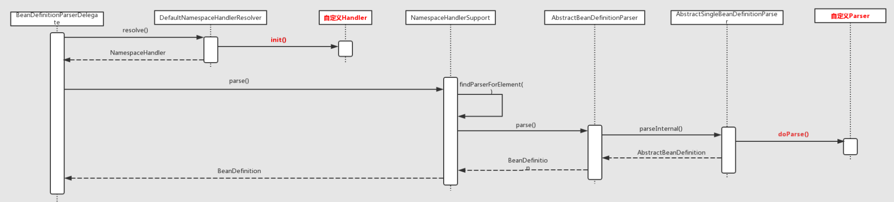


#### 10. 注册解析的 BeanDefinitions

DefaultBeanDefinitionDocumentReader 的 `#processBeanDefinition()` 方法，完成 Bean 标签解析的核心工作。代码如下：

```java
/ DefaultBeanDefinitionDocumentReader.java

protected void processBeanDefinition(Element ele, BeanDefinitionParserDelegate delegate) {
    // 进行 bean 元素解析。
    // 如果解析成功，则返回 BeanDefinitionHolder 对象。而 BeanDefinitionHolder 为 name 和 alias 的 BeanDefinition 对象
    // 如果解析失败，则返回 null 。
    BeanDefinitionHolder bdHolder = delegate.parseBeanDefinitionElement(ele);
    if (bdHolder != null) {
        // 进行自定义标签处理
        bdHolder = delegate.decorateBeanDefinitionIfRequired(ele, bdHolder);
        try {
            // 进行 BeanDefinition 的注册
            // Register the final decorated instance.
            BeanDefinitionReaderUtils.registerBeanDefinition(bdHolder, getReaderContext().getRegistry());
        } catch (BeanDefinitionStoreException ex) {
            getReaderContext().error("Failed to register bean definition with name '" +
                    bdHolder.getBeanName() + "'", ele, ex);
        }
        // 发出响应事件，通知相关的监听器，已完成该 Bean 标签的解析。
        // Send registration event.
        getReaderContext().fireComponentRegistered(new BeanComponentDefinition(bdHolder));
    }
}
```

- 解析工作分为三步：
  - 1、解析默认标签。
  - 2、解析默认标签后下得自定义标签。
  - 3、注册解析后的 BeanDefinition 。
- 经过前面两个步骤的解析，这时的 BeanDefinition 已经可以满足后续的使用要求了，**那么接下来的工作就是将这些 BeanDefinition 进行注册，也就是完成第三步**。

##### 10.1 BeanDefinitionReaderUtils

注册 BeanDefinition ，由 `BeanDefinitionReaderUtils.registerBeanDefinition()` 完成。代码如下：

```java
// BeanDefinitionReaderUtils.java
 
public static void registerBeanDefinition(
        BeanDefinitionHolder definitionHolder, BeanDefinitionRegistry registry)
        throws BeanDefinitionStoreException {

    // 注册 beanName
    // Register bean definition under primary name.
    String beanName = definitionHolder.getBeanName();
    registry.registerBeanDefinition(beanName, definitionHolder.getBeanDefinition());

    // 注册 alias
    // Register aliases for bean name, if any.
    String[] aliases = definitionHolder.getAliases();
    if (aliases != null) {
        for (String alias : aliases) {
            registry.registerAlias(beanName, alias);
        }
    }
}
```


##### 10.2 BeanDefinitionRegistry

BeanDefinition 的注册，由接口 `org.springframework.beans.factory.support.BeanDefinitionRegistry` 定义。

###### 10.2.1 通过 beanName 注册

调用 BeanDefinitionRegistry 的 `#registerBeanDefinition(String beanName, BeanDefinition beanDefinition)` 方法，实现通过 `beanName` 注册 BeanDefinition 。代码如下：

```java
// DefaultListableBeanFactory.java

/** Whether to allow re-registration of a different definition with the same name. */
private boolean allowBeanDefinitionOverriding = true;

/** Map of bean definition objects, keyed by bean name. */
private final Map<String, BeanDefinition> beanDefinitionMap = new ConcurrentHashMap<>(256);
/** List of bean definition names, in registration order. */
private volatile List<String> beanDefinitionNames = new ArrayList<>(256);
/** List of names of manually registered singletons, in registration order. */
private volatile Set<String> manualSingletonNames = new LinkedHashSet<>(16);
/** Cached array of bean definition names in case of frozen configuration. */
@Nullable
private volatile String[] frozenBeanDefinitionNames;

@Override
public void registerBeanDefinition(String beanName, BeanDefinition beanDefinition)
        throws BeanDefinitionStoreException {

    // 校验 beanName 与 beanDefinition 非空
    Assert.hasText(beanName, "Bean name must not be empty");
    Assert.notNull(beanDefinition, "BeanDefinition must not be null");

    // <1> 校验 BeanDefinition 。
    // 这是注册前的最后一次校验了，主要是对属性 methodOverrides 进行校验。
    if (beanDefinition instanceof AbstractBeanDefinition) {
        try {
            ((AbstractBeanDefinition) beanDefinition).validate();
        } catch (BeanDefinitionValidationException ex) {
            throw new BeanDefinitionStoreException(beanDefinition.getResourceDescription(), beanName,
                    "Validation of bean definition failed", ex);
        }
    }

    // <2> 从缓存中获取指定 beanName 的 BeanDefinition
    BeanDefinition existingDefinition = this.beanDefinitionMap.get(beanName);
    // <3> 如果已经存在
    if (existingDefinition != null) {
        // 如果存在但是不允许覆盖，抛出异常
        if (!isAllowBeanDefinitionOverriding()) {
            throw new BeanDefinitionOverrideException(beanName, beanDefinition, existingDefinition);
        // 覆盖 beanDefinition 大于 被覆盖的 beanDefinition 的 ROLE ，打印 info 日志
        } else if (existingDefinition.getRole() < beanDefinition.getRole()) {
            // e.g. was ROLE_APPLICATION, now overriding with ROLE_SUPPORT or ROLE_INFRASTRUCTURE
            if (logger.isInfoEnabled()) {
                logger.info("Overriding user-defined bean definition for bean '" + beanName +
                        "' with a framework-generated bean definition: replacing [" +
                        existingDefinition + "] with [" + beanDefinition + "]");
            }
        // 覆盖 beanDefinition 与 被覆盖的 beanDefinition 不相同，打印 debug 日志
        } else if (!beanDefinition.equals(existingDefinition)) {
            if (logger.isDebugEnabled()) {
                logger.debug("Overriding bean definition for bean '" + beanName +
                        "' with a different definition: replacing [" + existingDefinition +
                        "] with [" + beanDefinition + "]");
            }
        // 其它，打印 debug 日志
        } else {
            if (logger.isTraceEnabled()) {
                logger.trace("Overriding bean definition for bean '" + beanName +
                        "' with an equivalent definition: replacing [" + existingDefinition +
                        "] with [" + beanDefinition + "]");
            }
        }
        // 允许覆盖，直接覆盖原有的 BeanDefinition 到 beanDefinitionMap 中。
        this.beanDefinitionMap.put(beanName, beanDefinition);
    // <4> 如果未存在
    } else {
        // 检测创建 Bean 阶段是否已经开启，如果开启了则需要对 beanDefinitionMap 进行并发控制
        if (hasBeanCreationStarted()) {
            // beanDefinitionMap 为全局变量，避免并发情况
            // Cannot modify startup-time collection elements anymore (for stable iteration)
            synchronized (this.beanDefinitionMap) {
                // 添加到 BeanDefinition 到 beanDefinitionMap 中。
                this.beanDefinitionMap.put(beanName, beanDefinition);
                // 添加 beanName 到 beanDefinitionNames 中
                List<String> updatedDefinitions = new ArrayList<>(this.beanDefinitionNames.size() + 1);
                updatedDefinitions.addAll(this.beanDefinitionNames);
                updatedDefinitions.add(beanName);
                this.beanDefinitionNames = updatedDefinitions;
                // 从 manualSingletonNames 移除 beanName
                if (this.manualSingletonNames.contains(beanName)) {
                    Set<String> updatedSingletons = new LinkedHashSet<>(this.manualSingletonNames);
                    updatedSingletons.remove(beanName);
                    this.manualSingletonNames = updatedSingletons;
                }
            }
        } else {
            // Still in startup registration phase
            // 添加到 BeanDefinition 到 beanDefinitionMap 中。
            this.beanDefinitionMap.put(beanName, beanDefinition);
            // 添加 beanName 到 beanDefinitionNames 中
            this.beanDefinitionNames.add(beanName);
            // 从 manualSingletonNames 移除 beanName
            this.manualSingletonNames.remove(beanName);
        }
        
        this.frozenBeanDefinitionNames = null;
    }

    // <5> 重新设置 beanName 对应的缓存
    if (existingDefinition != null || containsSingleton(beanName)) {
        resetBeanDefinition(beanName);
    }
}
```
处理过程如下：

<1> 对 BeanDefinition 进行校验，该校验也是注册过程中的最后一次校验了，主要是对 AbstractBeanDefinition 的 methodOverrides 属性进行校验。
<2> 根据 beanName 从缓存中获取 BeanDefinition 对象。
<3> 如果缓存中存在，则根据 allowBeanDefinitionOverriding 标志来判断是否允许覆盖。如果允许则直接覆盖。否则，抛出 BeanDefinitionStoreException 异常。
<4> 若缓存中没有指定 beanName 的 BeanDefinition，则判断当前阶段是否已经开始了 Bean 的创建阶段？如果是，则需要对 beanDefinitionMap 进行加锁控制并发问题，否则直接设置即可。
对于 #hasBeanCreationStarted() 方法，后续做详细介绍，这里不过多阐述。
<5> 若缓存中存在该 beanName 或者单例 bean 集合中存在该 beanName ，则调用 #resetBeanDefinition(String beanName) 方法，重置 BeanDefinition 缓存。
😈 其实整段代码的核心就在于 this.beanDefinitionMap.put(beanName, beanDefinition); 代码块。而 BeanDefinition 的缓存也不是神奇的东西，就是定义一个 Map ：

key 为 beanName 。
value 为 BeanDefinition 对象。

###### 10.2.2 注册 alias 和 beanName 的映射

调用 BeanDefinitionRegistry 的 `#registerAlias(String name, String alias)` 方法，注册 `alias` 和 `beanName` 的映射关系。代码如下：

```java
// SimpleAliasRegistry.java

/** Map from alias to canonical name. */
// key: alias
// value: beanName
private final Map<String, String> aliasMap = new ConcurrentHashMap<>(16);

@Override
public void registerAlias(String name, String alias) {
    // 校验 name 、 alias
    Assert.hasText(name, "'name' must not be empty");
    Assert.hasText(alias, "'alias' must not be empty");
    synchronized (this.aliasMap) {
        // name == alias 则去掉alias
        if (alias.equals(name)) {
            this.aliasMap.remove(alias);
            if (logger.isDebugEnabled()) {
                logger.debug("Alias definition '" + alias + "' ignored since it points to same name");
            }
        } else {
            // 获取 alias 已注册的 beanName
            String registeredName = this.aliasMap.get(alias);
            // 已存在
            if (registeredName != null) {
                // 相同，则 return ，无需重复注册
                if (registeredName.equals(name)) {
                    // An existing alias - no need to re-register
                    return;
                }
                // 不允许覆盖，则抛出 IllegalStateException 异常
                if (!allowAliasOverriding()) {
                    throw new IllegalStateException("Cannot define alias '" + alias + "' for name '" +
                            name + "': It is already registered for name '" + registeredName + "'.");
                }
                if (logger.isDebugEnabled()) {
                    logger.debug("Overriding alias '" + alias + "' definition for registered name '" +
                            registeredName + "' with new target name '" + name + "'");
                }
            }
            // 校验，是否存在循环指向
            checkForAliasCircle(name, alias);
            // 注册 alias
            this.aliasMap.put(alias, name);
            if (logger.isTraceEnabled()) {
                logger.trace("Alias definition '" + alias + "' registered for name '" + name + "'");
            }
        }
    }
}
```

- 注册 `alias` 和注册 BeanDefinition 的过程差不多。

- 在最后，调用了 `#checkForAliasCircle()` 来对别名进行了**循环**检测。代码如下：

  ```java
  protected void checkForAliasCircle(String name, String alias) {
      if (hasAlias(alias, name)) {
          throw new IllegalStateException("Cannot register alias '" + alias +
                  "' for name '" + name + "': Circular reference - '" +
                  name + "' is a direct or indirect alias for '" + alias + "' already");
      }
  }
  public boolean hasAlias(String name, String alias) {
      for (Map.Entry<String, String> entry : this.aliasMap.entrySet()) {
          String registeredName = entry.getValue();
          if (registeredName.equals(name)) {
              String registeredAlias = entry.getKey();
              if (registeredAlias.equals(alias) || hasAlias(registeredAlias, alias)) {
                  return true;
              }
          }
      }
      return false;
  }
  ```

  - 如果 `name`、`alias` 分别为 1 和 3 ，则构成 `（1,3）` 的映射。加入，此时集合中存在`（A,1）`、`（3,A）` 的映射，意味着出现循环指向的情况，则抛出 IllegalStateException 异常。


#### 11. IoC 之装载 BeanDefinitions 总结

至此，整个 IoC 的初始化过程就已经完成了，从 Bean 资源的定位，转换为 Document 对象，接着对其进行解析，最后注册到 IoC 容器中，都已经完美地完成了。现在 IoC 容器中已经建立了整个 Bean 的配置信息，这些 Bean 可以被检索、使用、维护，他们是控制反转的基础，是后面注入 Bean 的依赖。最后用一张流程图来结束这篇总结之文。

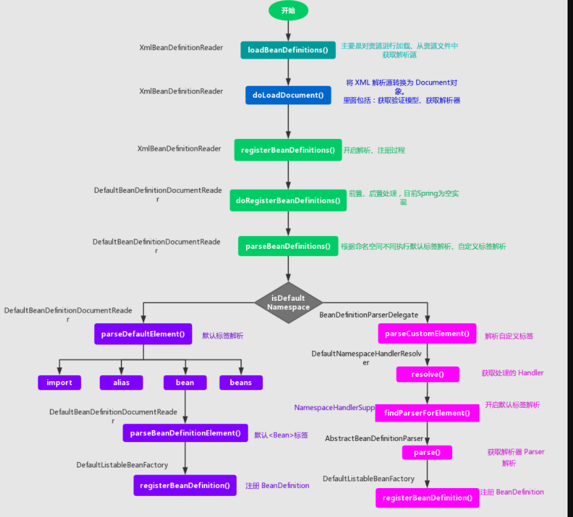

另外，艿艿推荐几篇不错的 Srping IoC 容器相关的博客：

- JavaDoop [《Spring IOC 容器源码分析》](https://javadoop.com/post/spring-ioc)
- Yikun [《Spring IOC 核心源码学习》](https://yikun.github.io/2015/05/29/Spring-IOC核心源码学习/)
- DearBelinda [《Spring专题之 IOC 源码分析》](https://segmentfault.com/a/1190000016261917)

参考资料https://segmentfault.com/a/1190000016261917


## 四、IoC 之加载 BeanDefinition

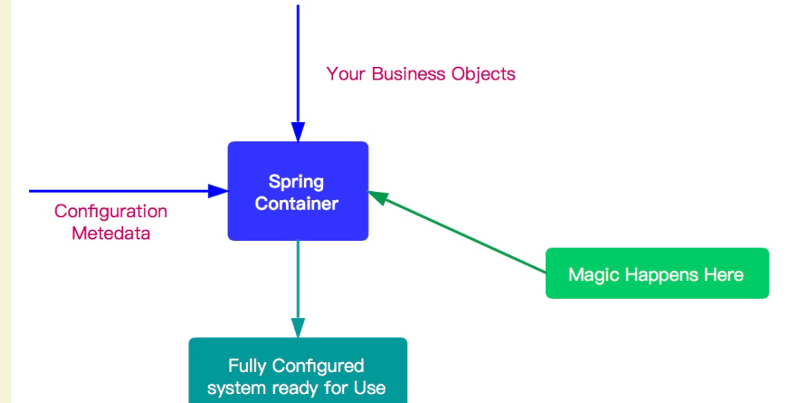

1. 容器初始化阶段
   - 首先，通过某种方式加载 Configuration Metadata (主要是依据 Resource、ResourceLoader 两个体系) 。
   - 然后，容器会对加载的 Configuration MetaData 进行解析和分析，并将分析的信息组装成 BeanDefinition 。
   - 最后，将 BeanDefinition 保存注册到相应的 BeanDefinitionRegistry 中。
   - 至此，Spring IoC 的初始化工作完成。
2. 加载 Bean 阶段
   - 经过容器初始化阶段后，应用程序中定义的 bean 信息已经全部加载到系统中了，当我们显示或者隐式地调用 `BeanFactory#getBean(...)` 方法时，则会触发加载 Bean 阶段。
   - 在这阶段，容器会首先检查所请求的对象是否已经初始化完成了，如果没有，则会根据注册的 Bean 信息实例化请求的对象，并为其注册依赖，然后将其返回给请求方。
   - 至此第二个阶段也已经完成。

### 1. getBean大体流程说明

#### 1.1 getbean

当我们显示或者隐式地调用 `BeanFactory#getBean(String name)` 方法时，则会触发加载 Bean 阶段。代码如下：

```java
// AbstractBeanFactory.java

@Override
public Object getBean(String name) throws BeansException {
	return doGetBean(name, null, null, false);
}
```

- 内部调用 `doGetBean(String name, final Class requiredType, Object[] args, boolean typeCheckOnly)` 方法，其接受四个方法参数：
  - `name` ：要获取 Bean 的名字
  - `requiredType` ：要获取 bean 的类型
  - `args` ：创建 Bean 时传递的参数。这个参数仅限于创建 Bean 时使用。
  - `typeCheckOnly` ：是否为类型检查。

#### 1.2 doGetBean

`#doGetBean(String name, final Class requiredType, Object[] args, boolean typeCheckOnly)` 方法，代码比较长，各位耐心看下。代码如下：

```java
//  .java

protected <T> T doGetBean(final String name, @Nullable final Class<T> requiredType,
        @Nullable final Object[] args, boolean typeCheckOnly) throws BeansException {
    // <1> 返回 bean 名称，剥离工厂引用前缀。
    // 如果 name 是 alias ，则获取对应映射的 beanName 。
    final String beanName = transformedBeanName(name);
    Object bean;

    // 从缓存中或者实例工厂中获取 Bean 对象
    // Eagerly check singleton cache for manually registered singletons.
    Object sharedInstance = getSingleton(beanName);
    if (sharedInstance != null && args == null) {
        if (logger.isTraceEnabled()) {
            if (isSingletonCurrentlyInCreation(beanName)) {
                logger.trace("Returning eagerly cached instance of singleton bean '" + beanName +
                        "' that is not fully initialized yet - a consequence of a circular reference");
            } else {
                logger.trace("Returning cached instance of singleton bean '" + beanName + "'");
            }
        }
        // <2> 完成 FactoryBean 的相关处理，并用来获取 FactoryBean 的处理结果
        bean = getObjectForBeanInstance(sharedInstance, name, beanName, null);
    } else {
        // Fail if we're already creating this bean instance:
        // We're assumably within a circular reference.
        // <3> 因为 Spring 只解决单例模式下得循环依赖，在原型模式下如果存在循环依赖则会抛出异常。
        if (isPrototypeCurrentlyInCreation(beanName)) {
            throw new BeanCurrentlyInCreationException(beanName);
        }

        // <4> 如果容器中没有找到，则从父类容器中加载
        // Check if bean definition exists in this factory.
        BeanFactory parentBeanFactory = getParentBeanFactory();
        if (parentBeanFactory != null && !containsBeanDefinition(beanName)) {
            // Not found -> check parent.
            String nameToLookup = originalBeanName(name);
            if (parentBeanFactory instanceof AbstractBeanFactory) {
                return ((AbstractBeanFactory) parentBeanFactory).doGetBean(
                        nameToLookup, requiredType, args, typeCheckOnly);
            } else if (args != null) {
                // Delegation to parent with explicit args.
                return (T) parentBeanFactory.getBean(nameToLookup, args);
            } else if (requiredType != null) {
                // No args -> delegate to standard getBean method.
                return parentBeanFactory.getBean(nameToLookup, requiredType);
            } else {
                return (T) parentBeanFactory.getBean(nameToLookup);
            }
        }

        // <5> 如果不是仅仅做类型检查则是创建bean，这里需要记录
        if (!typeCheckOnly) {
            markBeanAsCreated(beanName);
        }

        try {
            // <6> 从容器中获取 beanName 相应的 GenericBeanDefinition 对象，并将其转换为 RootBeanDefinition 对象
            final RootBeanDefinition mbd = getMergedLocalBeanDefinition(beanName);
            // 检查给定的合并的 BeanDefinition
            checkMergedBeanDefinition(mbd, beanName, args);

            // Guarantee initialization of beans that the current bean depends on.
            // <7> 处理所依赖的 bean
            String[] dependsOn = mbd.getDependsOn();
            if (dependsOn != null) {
                for (String dep : dependsOn) {
                    // 若给定的依赖 bean 已经注册为依赖给定的 bean
                    // 循环依赖的情况
                    if (isDependent(beanName, dep)) {
                        throw new BeanCreationException(mbd.getResourceDescription(), beanName,
                                "Circular depends-on relationship between '" + beanName + "' and '" + dep + "'");
                    }
                    // 缓存依赖调用 TODO 芋艿
                    registerDependentBean(dep, beanName);
                    try {
                        getBean(dep);
                    } catch (NoSuchBeanDefinitionException ex) {
                        throw new BeanCreationException(mbd.getResourceDescription(), beanName,
                                "'" + beanName + "' depends on missing bean '" + dep + "'", ex);
                    }
                }
            }

            // <8> bean 实例化
            // Create bean instance.
            if (mbd.isSingleton()) { // 单例模式
                sharedInstance = getSingleton(beanName, () -> {
                    try {
                        return createBean(beanName, mbd, args);
                    }
                    catch (BeansException ex) {
                        // Explicitly remove instance from singleton cache: It might have been put there
                        // eagerly by the creation process, to allow for circular reference resolution.
                        // Also remove any beans that received a temporary reference to the bean.
                        // 显式从单例缓存中删除 Bean 实例
                        // 因为单例模式下为了解决循环依赖，可能他已经存在了，所以销毁它。 TODO 芋艿
                        destroySingleton(beanName);
                        throw ex;
                    }
                });
                bean = getObjectForBeanInstance(sharedInstance, name, beanName, mbd);
            } else if (mbd.isPrototype()) { // 原型模式
                // It's a prototype -> create a new instance.
                Object prototypeInstance;
                try {
                    beforePrototypeCreation(beanName);
                    prototypeInstance = createBean(beanName, mbd, args);
                } finally {
                    afterPrototypeCreation(beanName);
                }
                bean = getObjectForBeanInstance(prototypeInstance, name, beanName, mbd);
            } else {
                // 从指定的 scope 下创建 bean
                String scopeName = mbd.getScope();
                final Scope scope = this.scopes.get(scopeName);
                if (scope == null) {
                    throw new IllegalStateException("No Scope registered for scope name '" + scopeName + "'");
                }try {
                    Object scopedInstance = scope.get(beanName, () -> {
                        beforePrototypeCreation(beanName);
                        try {
                            return createBean(beanName, mbd, args);
                        } finally {
                            afterPrototypeCreation(beanName);
                        }
                    });
                    bean = getObjectForBeanInstance(scopedInstance, name, beanName, mbd);
                } catch (IllegalStateException ex) {
                    throw new BeanCreationException(beanName,
                            "Scope '" + scopeName + "' is not active for the current thread; consider " +
                            "defining a scoped proxy for this bean if you intend to refer to it from a singleton",
                            ex);
                }
            }
        } catch (BeansException ex) {
            cleanupAfterBeanCreationFailure(beanName);
            throw ex;
        }
    }

    // <9> 检查需要的类型是否符合 bean 的实际类型
    // Check if required type matches the type of the actual bean instance.
    if (requiredType != null && !requiredType.isInstance(bean)) {
        try {
            T convertedBean = getTypeConverter().convertIfNecessary(bean, requiredType);
            if (convertedBean == null) {
                throw new BeanNotOfRequiredTypeException(name, requiredType, bean.getClass());
            }
            return convertedBean;
        } catch (TypeMismatchException ex) {
            if (logger.isTraceEnabled()) {
                logger.trace("Failed to convert bean '" + name + "' to required type '" +
                        ClassUtils.getQualifiedName(requiredType) + "'", ex);
            }
            throw new BeanNotOfRequiredTypeException(name, requiredType, bean.getClass());
        }
    }
    return (T) bean;
}
```

##### 1.2.1 获取beanName

对应代码段如下：

```java
// AbstractBeanFactory.java

final String beanName = transformedBeanName(name);
```

- 这里传递的是 `name` 方法，不一定就是 beanName，可能是 aliasName ，也有可能是 FactoryBean ，所以这里需要调用 `#transformedBeanName(String name)` 方法，对 `name` 进行一番转换。代码如下：

  ```java
  // AbstractBeanFactory.java
  
  protected String transformedBeanName(String name) {
  	return canonicalName(BeanFactoryUtils.transformedBeanName(name));
  }
  ```

  - 调用 `BeanFactoryUtils#transformedBeanName(String name)` 方法，去除 FactoryBean 的修饰符。代码如下：

    ```java
    // BeanFactoryUtils.java
    
    /**
     * Cache from name with factory bean prefix to stripped name without dereference.
     *
     * 缓存 {@link #transformedBeanName(String)} 已经转换好的结果。
     *
     * @since 5.1
     * @see BeanFactory#FACTORY_BEAN_PREFIX
     */
    private static final Map<String, String> transformedBeanNameCache = new ConcurrentHashMap<>();
    /**
     * 去除 FactoryBean 的修饰符 &
     *
     * 如果 name 以 “&” 为前缀，那么会去掉该 "&" 。
     * 例如，name = "&studentService" ，则会是 name = "studentService"。
     *
     * Return the actual bean name, stripping out the factory dereference
     * prefix (if any, also stripping repeated factory prefixes if found).
     * @param name the name of the bean
     * @return the transformed name
     * @see BeanFactory#FACTORY_BEAN_PREFIX
     */
    public static String transformedBeanName(String name) {
        Assert.notNull(name, "'name' must not be null");
        if (!name.startsWith(BeanFactory.FACTORY_BEAN_PREFIX)) { // BeanFactory.FACTORY_BEAN_PREFIX = $
            return name;
        }
        // computeIfAbsent 方法，分成两种情况：
        //      1. 未存在，则进行计算执行，并将结果添加到缓存、
        //      2. 已存在，则直接返回，无需计算。
        return transformedBeanNameCache.computeIfAbsent(name, beanName -> {
            do {
                beanName = beanName.substring(BeanFactory.FACTORY_BEAN_PREFIX.length());
            } while (beanName.startsWith(BeanFactory.FACTORY_BEAN_PREFIX));
            return beanName;
        });
    }
    ```

    - 实际上，逻辑比较简单，就是去除传入 `name` 参数的 `"&"` 的前缀。

      > 小知识补充。假设配置了一个 FactoryBean 的名字为 `"abc"` ，那么获取 FactoryBean 创建的 Bean 时，使用 `"abc"` ，如果获取 FactoryBean 本身，使用 `"$abc"` 。另外，`&`定义在 `BeanFactory.FACTORY_BEAN_PREFIX = "&"` 上。

    - `transformedBeanNameCache` 集合的存在，是为了缓存转换后的结果。下次再获取相同的 `name` 时，直接返回缓存中的结果即可。

  - 调用 `#canonicalName(String name)` 方法，取指定的 `alias` 所表示的最终 beanName 。

    ```java
    // SimpleAliasRegistry.java
    
    /** Map from alias to canonical name. */
    // key: alias
    // value: beanName
    private final Map<String, String> aliasMap = new ConcurrentHashMap<>(16);
    
    public String canonicalName(String name) {
    	String canonicalName = name;
    	// Handle aliasing...
    	String resolvedName;
    	// 循环，从 aliasMap 中，获取到最终的 beanName
    	do {
    		resolvedName = this.aliasMap.get(canonicalName);
    		if (resolvedName != null) {
    			canonicalName = resolvedName;
    		}
    	} while (resolvedName != null);
    	return canonicalName;
    }
    ```

    - 主要是一个循环获取 beanName 的过程，例如，别名 A 指向名称为 B 的 bean 则返回 B，若 别名 A 指向别名 B，别名 B 指向名称为 C 的 bean，则返回 C。

##### 1.2.2 从单例bean缓存获取bean对象

对应代码段如下：

```java
// AbstractBeanFactory.java

// 从缓存中或者实例工厂中获取 Bean 对象
// Eagerly check singleton cache for manually registered singletons.
Object sharedInstance = getSingleton(beanName);
if (sharedInstance != null && args == null) {
	if (logger.isTraceEnabled()) {
		if (isSingletonCurrentlyInCreation(beanName)) {
			logger.trace("Returning eagerly cached instance of singleton bean '" + beanName +
					"' that is not fully initialized yet - a consequence of a circular reference");
		} else {
			logger.trace("Returning cached instance of singleton bean '" + beanName + "'");
		}
	}
	// <x> 完成 FactoryBean 的相关处理，并用来获取 FactoryBean 的处理结果
	bean = getObjectForBeanInstance(sharedInstance, name, beanName, null);
}
```

- 我们知道单例模式的 Bean 在整个过程中只会被创建一次。第一次创建后会将该 Bean 加载到缓存中。后面，在获取 Bean 就会直接从单例缓存中获取。

- `` 处，如果从缓存中得到了 Bean 对象，则需要调用 `#getObjectForBeanInstance(Object beanInstance, String name, String beanName, RootBeanDefinition mbd)` 方法，对 Bean 进行实例化处理。因为，缓存中记录的是最原始的 Bean 状态，我们得到的不一定是我们**最终**想要的 Bean 。另外，FactoryBean 的用途如下：

  > From 《Spring 源码深度解析》P83 页
  >
  > 一般情况下，Spring 通过反射机制利用 bean 的 class 属性指定实现类来实例化 bean 。某些情况下，实例化 bean 过程比较复杂，如果按照传统的方式，则需要在 中提供大量的配置信息，配置方式的灵活性是受限的，这时采用编码的方式可能会得到一个简单的方案。Spring 为此提供了一个 FactoryBean 的工厂类接口，用户可以通过实现该接口定制实例化 bean 的逻辑。
  >
  > FactoryBean 接口对于 Spring 框架来说战友重要的地址，Spring 自身就提供了 70 多个 FactoryBean 的实现。它们隐藏了实例化一些复杂 bean 的细节，给上层应用带来了便利。

#### 1.3 原型模式依赖检查

对应代码段如下：

```java
// AbstractBeanFactory.java

// Fail if we're already creating this bean instance:
// We're assumably within a circular reference.
// 因为 Spring 只解决单例模式下得循环依赖，在原型模式下如果存在循环依赖则会抛出异常。
if (isPrototypeCurrentlyInCreation(beanName)) {
	throw new BeanCurrentlyInCreationException(beanName);
}
```

Spring 只处理单例模式下得循环依赖，对于原型模式的循环依赖直接抛出异常。主要原因还是在于，**和 Spring 解决循环依赖的策略有关**。

- 对于**单例( Singleton )模式**， Spring 在创建 Bean 的时候并不是等 Bean 完全创建完成后才会将 Bean 添加至缓存中，而是不等 Bean 创建完成就会将创建 Bean 的 ObjectFactory 提早加入到缓存中，这样一旦下一个 Bean 创建的时候需要依赖 bean 时则直接使用 ObjectFactroy 。
- 但是**原型( Prototype )模式**，我们知道是没法使用缓存的，所以 Spring 对原型模式的循环依赖处理策略则是不处理。

####  1.4 从 parentBeanFactory 获取 Bean

对应代码段如下：

```java
// AbstractBeanFactory.java

// 如果当前容器中没有找到，则从父类容器中加载
// Check if bean definition exists in this factory.
BeanFactory parentBeanFactory = getParentBeanFactory();
if (parentBeanFactory != null && !containsBeanDefinition(beanName)) {
    // Not found -> check parent.
    String nameToLookup = originalBeanName(name);
    // 如果，父类容器为 AbstractBeanFactory ，直接递归查找
    if (parentBeanFactory instanceof AbstractBeanFactory) {
        return ((AbstractBeanFactory) parentBeanFactory).doGetBean(
                nameToLookup, requiredType, args, typeCheckOnly);
    // 用明确的 args 从 parentBeanFactory 中，获取 Bean 对象
    } else if (args != null) {
        // Delegation to parent with explicit args.
        return (T) parentBeanFactory.getBean(nameToLookup, args);
    // 用明确的 requiredType 从 parentBeanFactory 中，获取 Bean 对象
    } else if (requiredType != null) {
        // No args -> delegate to standard getBean method.
        return parentBeanFactory.getBean(nameToLookup, requiredType);
    // 直接使用 nameToLookup 从 parentBeanFactory 获取 Bean 对象
    } else {
        return (T) parentBeanFactory.getBean(nameToLookup);
    }
}
```

- 如果**当前**容器缓存中没有相对应的 BeanDefinition 对象，则会尝试从父类工厂（`parentBeanFactory`）中加载，然后再去递归调用 `#getBean(...)` 方法。

#### 1.5 指定的 Bean 标记为已经创建或即将创建

对应代码段如下：

```java
// AbstractBeanFactory.java

// 如果不是仅仅做类型检查则是创建bean，这里需要记录
if (!typeCheckOnly) {
	markBeanAsCreated(beanName);
}
```

#### 1.6 获取 BeanDefinition

对应代码段如下：

```java
// AbstractBeanFactory.java

// 从容器中获取 beanName 相应的 GenericBeanDefinition 对象，并将其转换为 RootBeanDefinition 对象
final RootBeanDefinition mbd = getMergedLocalBeanDefinition(beanName);
// 检查给定的合并的 BeanDefinition
checkMergedBeanDefinition(mbd, beanName, args);
```

> 因为从 XML 配置文件中读取到的 Bean 信息是存储在GenericBeanDefinition 中的。但是，所有的 Bean 后续处理都是针对于 RootBeanDefinition 的，所以这里需要进行一个转换。
>
> 转换的同时，如果父类 bean 不为空的话，则会一并合并父类的属性。

#### 1.7 依赖 Bean 处理

对应代码段如下：

```java
// AbstractBeanFactory.java

// Guarantee initialization of beans that the current bean depends on.
// 处理所依赖的 bean
String[] dependsOn = mbd.getDependsOn();
if (dependsOn != null) {
    for (String dep : dependsOn) {
        // 若给定的依赖 bean 已经注册为依赖给定的 bean
        // 即循环依赖的情况，抛出 BeanCreationException 异常
        if (isDependent(beanName, dep)) {
            throw new BeanCreationException(mbd.getResourceDescription(), beanName,
                    "Circular depends-on relationship between '" + beanName + "' and '" + dep + "'");
        }
        // 缓存依赖调用 TODO 芋艿
        registerDependentBean(dep, beanName);
        try {
            // 递归处理依赖 Bean
            getBean(dep);
        } catch (NoSuchBeanDefinitionException ex) {
            throw new BeanCreationException(mbd.getResourceDescription(), beanName,
                    "'" + beanName + "' depends on missing bean '" + dep + "'", ex);
        }
    }
}
```

- 每个 Bean 都不是单独工作的，它会依赖其他 Bean，其他 Bean 也会依赖它。
- 对于依赖的 Bean ，它会优先加载，所以，在 Spring 的加载顺序中，在初始化某一个 Bean 的时候，首先会初始化这个 Bean 的依赖。

#### 1.8 不同作用域的 Bean 实例化

对应代码段如下：

```java
// AbstractBeanFactory.java

// bean 实例化
// Create bean instance.
if (mbd.isSingleton()) { // 单例模式
    sharedInstance = getSingleton(beanName, () -> {
        try {
            return createBean(beanName, mbd, args);
        }
        catch (BeansException ex) {
            // Explicitly remove instance from singleton cache: It might have been put there
            // eagerly by the creation process, to allow for circular reference resolution.
            // Also remove any beans that received a temporary reference to the bean.
            // 显式从单例缓存中删除 Bean 实例
            // 因为单例模式下为了解决循环依赖，可能他已经存在了，所以销毁它。 TODO 芋艿
            destroySingleton(beanName);
            throw ex;
        }
    });
    bean = getObjectForBeanInstance(sharedInstance, name, beanName, mbd);
} else if (mbd.isPrototype()) { // 原型模式
    // It's a prototype -> create a new instance.
    Object prototypeInstance;
    try {
        beforePrototypeCreation(beanName);
        prototypeInstance = createBean(beanName, mbd, args);
    } finally {
        afterPrototypeCreation(beanName);
    }
    bean = getObjectForBeanInstance(prototypeInstance, name, beanName, mbd);
} else {
    // 从指定的 scope 下创建 bean
    String scopeName = mbd.getScope();
    final Scope scope = this.scopes.get(scopeName);
    if (scope == null) {
        throw new IllegalStateException("No Scope registered for scope name '" + scopeName + "'");
    }try {
        Object scopedInstance = scope.get(beanName, () -> {
            beforePrototypeCreation(beanName);
            try {
                return createBean(beanName, mbd, args);
            } finally {
                afterPrototypeCreation(beanName);
            }
        });
        bean = getObjectForBeanInstance(scopedInstance, name, beanName, mbd);
    } catch (IllegalStateException ex) {
        throw new BeanCreationException(beanName,
                "Scope '" + scopeName + "' is not active for the current thread; consider " +
                "defining a scoped proxy for this bean if you intend to refer to it from a singleton",
                ex);
    }
}
```

- Spring Bean 的作用域默认为 singleton 。当然，还有其他作用域，如 prototype、request、session 等。
- 不同的作用域会有不同的初始化策略。

#### 1.9 类型转换

对应代码段如下：

```java
// AbstractBeanFactory.java

// 检查需要的类型是否符合 bean 的实际类型
// Check if required type matches the type of the actual bean instance.
if (requiredType != null && !requiredType.isInstance(bean)) {
    try {
        // 执行转换
        T convertedBean = getTypeConverter().convertIfNecessary(bean, requiredType);
        // 转换失败，抛出 BeanNotOfRequiredTypeException 异常
        if (convertedBean == null) {
            throw new BeanNotOfRequiredTypeException(name, requiredType, bean.getClass());
        }
        return convertedBean;
    } catch (TypeMismatchException ex) {
        if (logger.isTraceEnabled()) {
            logger.trace("Failed to convert bean '" + name + "' to required type '" +
                    ClassUtils.getQualifiedName(requiredType) + "'", ex);
        }
        throw new BeanNotOfRequiredTypeException(name, requiredType, bean.getClass());
    }
}
```

- 在调用 `#doGetBean(...)` 方法时，`有一个 requiredTyp`e 参数。该参数的功能就是将返回的 Bean 转换为 `requiredType` 类型。
- 当然就一般而言，我们是不需要进行类型转换的，也就是 `requiredType` 为空（比如 `#getBean(String name)` 方法）。但有，可能会存在这种情况，比如我们返回的 Bean 类型为 String ，我们在使用的时候需要将其转换为 Integer，那么这个时候 `requiredType` 就有用武之地了。**当然我们一般是不需要这样做的**。

#### 1.10小结

至此 `BeanFactory#getBean(...)` 方法的过程讲解完了。后续将会对该过程进行拆分，更加详细的说明，弄清楚其中的来龙去脉，所以这篇博客只能算是 Spring Bean 加载过程的一个概览。拆分主要是分为三个部分：

1. 分析从缓存中获取单例 Bean ，以及对 Bean 的实例中获取对象。
2. 如果从单例缓存中获取 Bean ，Spring 是怎么加载的呢？所以第二部分是分析 Bean 加载，以及 Bean 的依赖处理。
3. Bean 已经加载了，依赖也处理完毕了，第三部分则分析各个作用域的 Bean 初始化过程。
4. 不错的文章推荐
   - zhanglbjames [《Spring-IoC-getBean源码解析》](https://www.jianshu.com/p/a6acfceb42fb)
   - glmapper [《Spring源码系列：依赖注入（一）getBean》](https://juejin.im/post/5a7532746fb9a0633a70d57f)
   - 是Guava不是瓜娃 [《Spring原理与源码分析系列（五）- Spring IoC源码分析（下）》](https://blog.csdn.net/noaman_wgs/article/details/79138883)


### 2. 从单例缓存中获取单例 Bean

```java
// AbstractBeanFactory.java

// 从缓存中或者实例工厂中获取 Bean 对象
// Eagerly check singleton cache for manually registered singletons.
Object sharedInstance = getSingleton(beanName);
if (sharedInstance != null && args == null) {
	if (logger.isTraceEnabled()) {
		if (isSingletonCurrentlyInCreation(beanName)) {
			logger.trace("Returning eagerly cached instance of singleton bean '" + beanName +
					"' that is not fully initialized yet - a consequence of a circular reference");
		} else {
			logger.trace("Returning cached instance of singleton bean '" + beanName + "'");
		}
	}
	// 完成 FactoryBean 的相关处理，并用来获取 FactoryBean 的处理结果
	bean = getObjectForBeanInstance(sharedInstance, name, beanName, null);
}
```

#### 2.1 getSingleton

在上篇博客 [《【死磕 Spring】—— IoC 之开启 Bean 的加载》](http://svip.iocoder.cn/Spring/IoC-get-Bean-begin) 中提到过，Spring 对单例模式的 bean 只会创建一次。后续，如果再获取该 Bean ，则是直接从单例缓存中获取，该过程就体现在 `#getSingleton(String beanName)` 方法中。代码如下：

```java
// DefaultSingletonBeanRegistry.java

@Override
@Nullable
public Object getSingleton(String beanName) {
    return getSingleton(beanName, true);
}

@Nullable
protected Object getSingleton(String beanName, boolean allowEarlyReference) {
    // 从单例缓冲中加载 bean
    Object singletonObject = this.singletonObjects.get(beanName);
    // 缓存中的 bean 为空，且当前 bean 正在创建
    if (singletonObject == null && isSingletonCurrentlyInCreation(beanName)) {
        // 加锁
        synchronized (this.singletonObjects) {
            // 从 earlySingletonObjects 获取
            singletonObject = this.earlySingletonObjects.get(beanName);
            // earlySingletonObjects 中没有，且允许提前创建
            if (singletonObject == null && allowEarlyReference) {
                // 从 singletonFactories 中获取对应的 ObjectFactory
                ObjectFactory<?> singletonFactory = this.singletonFactories.get(beanName);
                if (singletonFactory != null) {
                    // 获得 bean
                    singletonObject = singletonFactory.getObject();
                    // 添加 bean 到 earlySingletonObjects 中
                    this.earlySingletonObjects.put(beanName, singletonObject);
                    // 从 singletonFactories 中移除对应的 ObjectFactory
                    this.singletonFactories.remove(beanName);
                }
            }
        }
    }
    return singletonObject;
}
```

这段代码非常简单，保持淡定，过程如下：

- 第一步，从 `singletonObjects` 中，获取 Bean 对象。

- 第二步，若为空且当前 bean 正在创建中，则从 `earlySingletonObjects` 中获取 Bean 对象。

- 第三步，若为空且允许提前创建，则从 `singletonFactories` 中获取相应的 ObjectFactory 对象。若不为空，则调用其 `ObjectFactory#getObject(String name)` 方法，创建 Bean 对象，然后将其加入到 `earlySingletonObjects` ，然后从 `singletonFactories` 删除。

- 总体逻辑，就是根据 `beanName` 依次检测这三个 Map，若为空，从下一个，否则返回。这三个 Map 存放的都有各自的功能，代码如下：

  ```java
  // DefaultSingletonBeanRegistry.java
  
  /**
   * Cache of singleton objects: bean name to bean instance.
   *
   * 存放的是单例 bean 的映射。
   *
   * 对应关系为 bean name --> bean instance
   */
  private final Map<String, Object> singletonObjects = new ConcurrentHashMap<>(256);
  
  /**
   * Cache of singleton factories: bean name to ObjectFactory.
   *
   * 存放的是 ObjectFactory，可以理解为创建单例 bean 的 factory 。
   *
   * 对应关系是 bean name --> ObjectFactory，这是factoryBean，不是实际的处理内容
   **/
  private final Map<String, ObjectFactory<?>> singletonFactories = new HashMap<>(16);
  
  /**
   * Cache of early singleton objects: bean name to bean instance.
   *
   * 存放的是早期的 bean，对应关系也是 bean name --> bean instance。
   *
   * 它与 {@link #singletonFactories} 区别在于 earlySingletonObjects 中存放的 bean 不一定是完整。
   *
   * 从 {@link #getSingleton(String)} 方法中，我们可以了解，bean 在创建过程中就已经加入到 earlySingletonObjects 中了。
   * 所以当在 bean 的创建过程中，就可以通过 getBean() 方法获取。
   *
   * 这个 Map 也是【循环依赖】的关键所在。
   */
  private final Map<String, Object> earlySingletonObjects = new HashMap<>(16);
  ```

##### 三级缓存

1. 一级缓存singletonObjects完全创建好的 bean名称和对象
2. 二级缓存earlySingletonObjects，已创建好未进行初始化内容，由三级缓存放入
3. 三级缓存singletonFactories，ObjectFactory是一个封装类，真正对象在getObject

##### isSingletonCurrentlyInCreation

在上面代码中，还有一个非常重要的检测方法 `#isSingletonCurrentlyInCreation(String beanName)` 方法，该方法用于判断该 `beanName` 对应的 Bean **是否在创建过程**中，注意这个过程讲的是整个工厂中。代码如下：

```java
// DefaultSingletonBeanRegistry.java

/**
 * Names of beans that are currently in creation.
 *
 * 正在创建中的单例 Bean 的名字的集合
 */
private final Set<String> singletonsCurrentlyInCreation =
		Collections.newSetFromMap(new ConcurrentHashMap<>(16));
```

从这段代码中，我们可以预测，在 Bean 创建过程中都会将其加入到 `singletonsCurrentlyInCreation` 集合中。具体是在什么时候加的，我们后面分析。

#### 2.2 getObjectForBeanInstance

到这里从缓存中获取 bean 的过程已经分析完毕了，我们再看开篇的代码段，从缓存中获取 Bean 后，若其不为 `null` 且 `args` 为空，则会调用 `#getObjectForBeanInstance(Object beanInstance, String name, String beanName,RootBeanDefinition mbd)` 方法，进行处理。

- 为什么会有这么一段呢？因为我们从缓存中获取的 bean 是**最原始**的 Bean ，并不一定使我们最终想要的 Bean 。
- 怎么办呢？调用 `#getObjectForBeanInstance(...)` 方法，进行处理，该方法的定义为获取给定 Bean 实例的对象，该对象要么是 bean 实例本身，要么就是 FactoryBean 创建的 Bean 对象。

代码如下：

```java
// AbstractBeanFactory.java

protected Object getObjectForBeanInstance(
        Object beanInstance, String name, String beanName, @Nullable RootBeanDefinition mbd) {
    // <1> 若为工厂类引用（name 以 & 开头）
    // Don't let calling code try to dereference the factory if the bean isn't a factory.
    if (BeanFactoryUtils.isFactoryDereference(name)) {
        // 如果是 NullBean，则直接返回
        if (beanInstance instanceof NullBean) {
            return beanInstance;
        }
        // 如果 beanInstance 不是 FactoryBean 类型，则抛出异常
        if (!(beanInstance instanceof FactoryBean)) {
            throw new BeanIsNotAFactoryException(transformedBeanName(name), beanInstance.getClass());
        }
    }

    // 到这里我们就有了一个 Bean 实例，当然该实例可能是会是是一个正常的 bean 又或者是一个 FactoryBean
    // 如果是 FactoryBean，我我们则创建该 Bean
    // Now we have the bean instance, which may be a normal bean or a FactoryBean.
    // If it's a FactoryBean, we use it to create a bean instance, unless the
    // caller actually wants a reference to the factory.
    if (!(beanInstance instanceof FactoryBean) || BeanFactoryUtils.isFactoryDereference(name)) {
        return beanInstance;
    }

    Object object = null;
    // <3> 若 BeanDefinition 为 null，则从缓存中加载 Bean 对象
    if (mbd == null) {
        object = getCachedObjectForFactoryBean(beanName);
    }
    // 若 object 依然为空，则可以确认，beanInstance 一定是 FactoryBean 。从而，使用 FactoryBean 获得 Bean 对象
    if (object == null) {
        // Return bean instance from factory.
        FactoryBean<?> factory = (FactoryBean<?>) beanInstance;
        // containsBeanDefinition 检测 beanDefinitionMap 中也就是在所有已经加载的类中
        // 检测是否定义 beanName
        // Caches object obtained from FactoryBean if it is a singleton.
        if (mbd == null && containsBeanDefinition(beanName)) {
            // 将存储 XML 配置文件的 GenericBeanDefinition 转换为 RootBeanDefinition，
            // 如果指定 BeanName 是子 Bean 的话同时会合并父类的相关属性
            mbd = getMergedLocalBeanDefinition(beanName);
        }
        // 是否是用户定义的，而不是应用程序本身定义的
        boolean synthetic = (mbd != null && mbd.isSynthetic());
        // 核心处理方法，使用 FactoryBean 获得 Bean 对象
        object = getObjectFromFactoryBean(factory, beanName, !synthetic);
    }
    return object;
}
```

该方法主要是进行检测工作的，主要如下：

- `<1>` 处，若 `name` 为工厂相关的（以 & 开头），且 `beanInstance` 为 NullBean 类型则直接返回，如果 `beanInstance` 不为 FactoryBean 类型则抛出 BeanIsNotAFactoryException 异常。这里主要是**校验** `beanInstance` 的**正确性**。

- `<2>` 处，如果 `beanInstance` 不为 FactoryBean 类型或者 `name` 也不是与工厂相关的，则直接返回 `beanInstance` 这个 Bean 对象。**这里主要是对非 FactoryBean 类型处理**。

- `<3>` 处，如果 BeanDefinition 为空，则从 `factoryBeanObjectCache` 中加载 Bean 对象。如果还是空，则可以断定 `beanInstance` 一定是 FactoryBean 类型，则委托 `#getObjectFromFactoryBean(FactoryBean factory, String beanName, boolean shouldPostProcess)` 方法，进行处理，**使用 FactoryBean 获得 Bean 对象**。

  > 老艿艿：所以实际上，`#getObjectForBeanInstance(...)` 方法的**重心**，就是使用 FactoryBean 对象，获得( 或者创建 )其 Bean 对象，即调用 `#getObjectFromFactoryBean(...)` 方法。

#### 2.3 getObjectFromFactoryBean

从上面可以看出， `#getObjectForBeanInstance(Object beanInstance, String name, String beanName,RootBeanDefinition mbd)` 方法，分成两种情况：

- 第一种，当该实例对象为**非 FactoryBean 类型**，**直接**返回给定的 Bean 实例对象 `beanInstance` 。
- 第二种，当该实例对象为**FactoryBean 类型**，从 FactoryBean ( `beanInstance` ) 中，获取 Bean 实例对象。

第二种，通过 `#getObjectFromFactoryBean(FactoryBean factory, String beanName, boolean shouldPostProcess)` 方法来实现。代码如下：

```java
// FactoryBeanRegistrySupport.java

/**
 * Cache of singleton objects created by FactoryBeans: FactoryBean name to object.
 *
 * 缓存 FactoryBean 创建的单例 Bean 对象的映射
 * beanName ===> Bean 对象
 */
private final Map<String, Object> factoryBeanObjectCache = new ConcurrentHashMap<>(16);

protected Object getObjectFromFactoryBean(FactoryBean<?> factory, String beanName, boolean shouldPostProcess) {
    // <1> 为单例模式且缓存中存在
    if (factory.isSingleton() && containsSingleton(beanName)) {
        synchronized (getSingletonMutex()) { // <1.1> 单例锁
            // <1.2> 从缓存中获取指定的 factoryBean
            Object object = this.factoryBeanObjectCache.get(beanName);
            if (object == null) {
                // 为空，则从 FactoryBean 中获取对象
                object = doGetObjectFromFactoryBean(factory, beanName);
                // 从缓存中获取
                // TODO 芋艿，具体原因
                // Only post-process and store if not put there already during getObject() call above
                // (e.g. because of circular reference processing triggered by custom getBean calls)
                Object alreadyThere = this.factoryBeanObjectCache.get(beanName);
                if (alreadyThere != null) {
                    object = alreadyThere;
                } else {
                    // <1.3> 需要后续处理
                    if (shouldPostProcess) {
                        // 若该 Bean 处于创建中，则返回非处理对象，而不是存储它
                        if (isSingletonCurrentlyInCreation(beanName)) {
                            // Temporarily return non-post-processed object, not storing it yet..
                            return object;
                        }
                        // 单例 Bean 的前置处理
                        beforeSingletonCreation(beanName);
                        try {
                            // 对从 FactoryBean 获取的对象进行后处理
                            // 生成的对象将暴露给 bean 引用
                            object = postProcessObjectFromFactoryBean(object, beanName);
                        } catch (Throwable ex) {
                            throw new BeanCreationException(beanName,
                                    "Post-processing of FactoryBean's singleton object failed", ex);
                        } finally {
                            // 单例 Bean 的后置处理
                            afterSingletonCreation(beanName);
                        }
                    }
                    // <1.4> 添加到 factoryBeanObjectCache 中，进行缓存
                    if (containsSingleton(beanName)) {
                        this.factoryBeanObjectCache.put(beanName, object);
                    }
                }
            }
            return object;
        }
    // <2>
    } else {
        // 为空，则从 FactoryBean 中获取对象
        Object object = doGetObjectFromFactoryBean(factory, beanName);
        // 需要后续处理
        if (shouldPostProcess) {
            try {
                // 对从 FactoryBean 获取的对象进行后处理
                // 生成的对象将暴露给 bean 引用
                object = postProcessObjectFromFactoryBean(object, beanName);
            }
            catch (Throwable ex) {
                throw new BeanCreationException(beanName, "Post-processing of FactoryBean's object failed", ex);
            }
        }
        return object;
    }
}
```

主要流程如下：

- 若为单例且单例 Bean 缓存中存在 `beanName` ，则 `<1>` 进行后续处理（跳转到下一步），否则，则 `<2>` 从 FactoryBean 中获取 Bean 实例对象。

- `<1.1>` 首先，获取锁。其实我们在前面篇幅中发现了大量的同步锁，锁住的对象都是 `this.singletonObjects`，主要是因为在单例模式中必须要**保证全局唯一**。代码如下：

  ```java
  // DefaultSingletonBeanRegistry.java
  
  /**
   * Cache of singleton objects: bean name to bean instance.
   *
   * 存放的是单例 bean 的映射。
   *
   * 对应关系为 bean name --> bean instance
   */
  private final Map<String, Object> singletonObjects = new ConcurrentHashMap<>(256);
  
  public final Object getSingletonMutex() {
  	return this.singletonObjects;
  }
  ```

- `<1.2>` 然后，从 `factoryBeanObjectCache` 缓存中获取实例对象 `object` 。若 `object` 为空，则调用 `#doGetObjectFromFactoryBean(FactoryBean factory, String beanName)` 方法，从 FactoryBean 获取对象，其实内部就是调用 `FactoryBean#getObject()` 方法。代码如下：

  ```java
  private Object doGetObjectFromFactoryBean(final FactoryBean<?> factory, final String beanName)
      throws BeanCreationException {
      Object object;
      try {
          // 需要权限验证
          if (System.getSecurityManager() != null) {
              AccessControlContext acc = getAccessControlContext();
              try {
                  // <x> 从 FactoryBean 中，获得 Bean 对象
                  object = AccessController.doPrivileged((PrivilegedExceptionAction<Object>) factory::getObject, acc);
              } catch (PrivilegedActionException pae) {
                  throw pae.getException();
              }
          } else {
              // <x> 从 FactoryBean 中，获得 Bean 对象
              object = factory.getObject();
          }
      } catch (FactoryBeanNotInitializedException ex) {
          throw new BeanCurrentlyInCreationException(beanName, ex.toString());
      } catch (Throwable ex) {
          throw new BeanCreationException(beanName, "FactoryBean threw exception on object creation", ex);
      }
      // Do not accept a null value for a FactoryBean that's not fully
      // initialized yet: Many FactoryBeans just return null then.
      if (object == null) {
          if (isSingletonCurrentlyInCreation(beanName)) {
              throw new BeanCurrentlyInCreationException(
                      beanName, "FactoryBean which is currently in creation returned null from getObject");
          }
          object = new NullBean();
      }
      return object;
  }
  ```

  - 在 `` 处，可以看到，调用 `FactoryBean#getObject()` 方法，获取 Bean 对象。

- `<1.3>` 如果需要后续处理( `shouldPostProcess = true` )，则进行进一步处理，步骤如下：

  - 若该 Bean 处于创建中（`#isSingletonCurrentlyInCreation(String beanName)` 方法返回 `true` ），则返回**非处理的 Bean 对象**，而不是存储它。
  - 调用 `#beforeSingletonCreation(String beanName)` 方法，进行创建之前的处理。默认实现将该 Bean 标志为当前创建的。
  - 调用 `#postProcessObjectFromFactoryBean(Object object, String beanName)` 方法，对从 FactoryBean 获取的 Bean 实例对象进行后置处理。详细解析，见 [「2.3 postProcessObjectFromFactoryBean」](http://svip.iocoder.cn/Spring/IoC-get-Bean-getSingleton/#) 。
  - 调用 `#afterSingletonCreation(String beanName)` 方法，进行创建 Bean 之后的处理，默认实现是将该 bean 标记为不再在创建中。

- `<1.4>` 最后，加入到 `factoryBeanObjectCache` 缓存中。

该方法应该就是创建 Bean 实例对象中的核心方法之一了。这里我们关注三个方法：

- `#beforeSingletonCreation(String beanName)`
- `#afterSingletonCreation(String beanName)`
- `#postProcessObjectFromFactoryBean(Object object, String beanName)`

#### 2.4 isSingletonCurrentlyInCreation

可能有小伙伴觉得前面两个方法不是很重要，LZ 可以肯定告诉你，这两方法是非常重要的操作，因为**他们记录着 Bean 的加载状态，是检测当前 Bean 是否处于创建中的关键之处，对解决 Bean 循环依赖起着关键作用**。

- `#beforeSingletonCreation(String beanName)` 方法，用于添加标志，当前 bean **正处于**创建中
- `#afterSingletonCreation(String beanName)` 方法，用于移除标记，当前 Bean **不处于**创建中。

其实在这篇博客刚刚开始就已经提到了， `#isSingletonCurrentlyInCreation(String beanName)` 方法，是用于检测当前 Bean 是否处于创建之中。代码如下：

```java
// DefaultSingletonBeanRegistry.java

/**
 * Names of beans that are currently in creation.
 *
 * 正在创建中的单例 Bean 的名字的集合
 */
private final Set<String> singletonsCurrentlyInCreation =
        Collections.newSetFromMap(new ConcurrentHashMap<>(16));
```

- 是根据 `singletonsCurrentlyInCreation` 集合中是否包含了 `beanName` 。
- 

##### 2.4.1 beforeSingletonCreation

集合的元素，则一定是在 `#beforeSingletonCreation(String beanName)` 方法中添加的。代码如下：

```java
// DefaultSingletonBeanRegistry.java

protected void beforeSingletonCreation(String beanName) {
	if (!this.inCreationCheckExclusions.contains(beanName)
            && !this.singletonsCurrentlyInCreation.add(beanName)) { // 添加
		throw new BeanCurrentlyInCreationException(beanName); // 如果添加失败，则抛出 BeanCurrentlyInCreationException 异常。
	}
}
```

##### 2.4.2 afterSingletonCreation

`#afterSingletonCreation(String beanName)` 方法，为移除，则一定就是对 `singletonsCurrentlyInCreation` 集合 remove 了。代码如下：

```java
// DefaultSingletonBeanRegistry.java

protected void afterSingletonCreation(String beanName) {
	if (!this.inCreationCheckExclusions.contains(beanName) &&
            !this.singletonsCurrentlyInCreation.remove(beanName)) { // 移除
	    // 如果移除失败，则抛出 IllegalStateException 异常
		throw new IllegalStateException("Singleton '" + beanName + "' isn't currently in creation");
	}
}
```

#### 2.5postProcessObjectFromFactoryBean

`postProcessObjectFromFactoryBean(Object object, String beanName)` 方法，对从 FactoryBean 处获取的 Bean 实例对象进行后置处理。其默认实现是直接返回 object 对象，不做任何处理。代码如下：

```java
// DefaultSingletonBeanRegistry.java

protected Object postProcessObjectFromFactoryBean(Object object, String beanName) throws BeansException {
	return object;
}
```


当然，子类可以重写，例如应用后处理器。`org.springframework.beans.factory.support.AbstractAutowireCapableBeanFactory` 抽象类，对其提供了实现，代码如下：

```java
// AbstractAutowireCapableBeanFactory.java

protected Object postProcessObjectFromFactoryBean(Object object, String beanName) {
	return applyBeanPostProcessorsAfterInitialization(object, beanName);
}
```

- 该方法的定义为：对所有的 `{@code postProcessAfterInitialization}` 进行回调注册 BeanPostProcessors ，让他们能够后期处理从 FactoryBean 中获取的对象。下面是具体实现：

  ```java
  // AbstractAutowireCapableBeanFactory.java
  
  @Override
  public Object applyBeanPostProcessorsAfterInitialization(Object existingBean, String beanName)
          throws BeansException {
      Object result = existingBean;
      // 遍历 BeanPostProcessor
      for (BeanPostProcessor processor : getBeanPostProcessors()) {
          // 处理
          Object current = processor.postProcessAfterInitialization(result, beanName);
          // 返回空，则返回 result
          if (current == null) {
              return result;
          }
          // 修改 result
          result = current;
      }
      return result;
  }
  ```

  - 对于后置处理器，这里我们不做过多阐述，后面会专门的博文进行详细介绍，这里我们只需要记住一点：尽可能保证所有 bean 初始化后都会调用注册的 `BeanPostProcessor#postProcessAfterInitialization(Object bean, String beanName)` 方法进行处理，在实际开发过程中大可以针对此特性设计自己的业务逻辑。

### 3.parentBeanFactory 与依赖处理

如果从单例缓存中没有获取到单例 Bean 对象，则说明两种两种情况：

1. 该 Bean 的 scope 不是 singleton
2. 该 Bean 的 scope 是 singleton ，但是没有初始化完成。

针对这两种情况，Spring 是如何处理的呢？统一加载并完成初始化！这部分内容的篇幅较长，拆分为两部分：

- 第一部分，主要是一些检测、parentBeanFactory 以及依赖处理。
- 第二部分则是各个 scope 的初始化。

代码如下：

```java
// AbstractBeanFactory.java
//protected <T> T doGetBean(final String name, final Class<T> requiredType, final Object[] args, boolean typeCheckOnly)

// ... 省略很多代码

// Fail if we're already creating this bean instance:
// We're assumably within a circular reference.
// <3> 因为 Spring 只解决单例模式下得循环依赖，在原型模式下如果存在循环依赖则会抛出异常。
if (isPrototypeCurrentlyInCreation(beanName)) {
    throw new BeanCurrentlyInCreationException(beanName);
}

// <4> 如果容器中没有找到，则从父类容器中加载
// Check if bean definition exists in this factory.
BeanFactory parentBeanFactory = getParentBeanFactory();
if (parentBeanFactory != null && !containsBeanDefinition(beanName)) {
    // Not found -> check parent.
    String nameToLookup = originalBeanName(name);
    if (parentBeanFactory instanceof AbstractBeanFactory) {
        return ((AbstractBeanFactory) parentBeanFactory).doGetBean(
                nameToLookup, requiredType, args, typeCheckOnly);
    } else if (args != null) {
        // Delegation to parent with explicit args.
        return (T) parentBeanFactory.getBean(nameToLookup, args);
    } else if (requiredType != null) {
        // No args -> delegate to standard getBean method.
        return parentBeanFactory.getBean(nameToLookup, requiredType);
    } else {
        return (T) parentBeanFactory.getBean(nameToLookup);
    }
}

// <5> 如果不是仅仅做类型检查则是创建bean，这里需要记录
if (!typeCheckOnly) {
    markBeanAsCreated(beanName);
}

try {
    // <6> 从容器中获取 beanName 相应的 GenericBeanDefinition 对象，并将其转换为 RootBeanDefinition 对象
    final RootBeanDefinition mbd = getMergedLocalBeanDefinition(beanName);
    // 检查给定的合并的 BeanDefinition
    checkMergedBeanDefinition(mbd, beanName, args);

    // Guarantee initialization of beans that the current bean depends on.
    // <7> 处理所依赖的 bean
    String[] dependsOn = mbd.getDependsOn();
    if (dependsOn != null) {
        for (String dep : dependsOn) {
            // 若给定的依赖 bean 已经注册为依赖给定的 bean
            // 循环依赖的情况
            if (isDependent(beanName, dep)) {
                throw new BeanCreationException(mbd.getResourceDescription(), beanName,
                        "Circular depends-on relationship between '" + beanName + "' and '" + dep + "'");
            }
            // 缓存依赖调用
            registerDependentBean(dep, beanName);
            try {
                getBean(dep);
            } catch (NoSuchBeanDefinitionException ex) {
                throw new BeanCreationException(mbd.getResourceDescription(), beanName,
                        "'" + beanName + "' depends on missing bean '" + dep + "'", ex);
            }
        }
    }
}

// ... 省略很多代码
```


#### 3.1 检测

在前面就提过，Spring 只解决单例模式下的循环依赖，对于原型模式的循环依赖则是抛出 BeanCurrentlyInCreationException 异常，所以首先检查该 `beanName` 是否处于原型模式下的循环依赖。如下：

```java
// AbstractBeanFactory.java

if (isPrototypeCurrentlyInCreation(beanName)) {
    throw new BeanCurrentlyInCreationException(beanName);
}
```

- 调用 `#isPrototypeCurrentlyInCreation(String beanName)` 方法，判断当前 Bean 是否正在创建。代码如下：

  ```java
  // AbstractBeanFactory.java
  
  protected boolean isPrototypeCurrentlyInCreation(String beanName) {
  	Object curVal = this.prototypesCurrentlyInCreation.get();
  	return (curVal != null &&
  			(curVal.equals(beanName)  // 相等
                      || (curVal instanceof Set && ((Set<?>) curVal).contains(beanName)))); // 包含
  }
  ```

  - 其实检测逻辑和单例模式一样，一个“集合”存放着正在创建的 Bean ，从该集合中进行判断即可，只不过单例模式的“集合”为 Set ，而原型模式的则是 ThreadLocal 。`prototypesCurrentlyInCreation` 定义如下：

    ```java
    // AbstractBeanFactory.java
    
    /** Names of beans that are currently in creation. */
    private final ThreadLocal<Object> prototypesCurrentlyInCreation =
    		new NamedThreadLocal<>("Prototype beans currently in creation");
    ```

#### 3.2 检查父类 BeanFactory

若 `#containsBeanDefinition(String beanName)` 方法中不存在 `beanName` 相对应的 BeanDefinition 对象时，则从 `parentBeanFactory` 中获取。代码如下：

```java
// AbstractBeanFactory.java

// 获取 parentBeanFactory
BeanFactory parentBeanFactory = getParentBeanFactory();
// parentBeanFactory 不为空且 beanDefinitionMap 中不存该 name 的 BeanDefinition
if (parentBeanFactory != null && !containsBeanDefinition(beanName)) {
    // 确定原始 beanName
    String nameToLookup = originalBeanName(name);
    // 若为 AbstractBeanFactory 类型，委托父类处理
    if (parentBeanFactory instanceof AbstractBeanFactory) {
        return ((AbstractBeanFactory) parentBeanFactory).doGetBean(
                nameToLookup, requiredType, args, typeCheckOnly);
    } else if (args != null) {
        // 委托给构造函数 getBean() 处理
        return (T) parentBeanFactory.getBean(nameToLookup, args);
    } else {
        // 没有 args，委托给标准的 getBean() 处理
        return parentBeanFactory.getBean(nameToLookup, requiredType);
    }
}
```

- 整个过程较为简单，都是委托 `parentBeanFactory` 的 `#getBean(...)` 方法来进行处理，只不过在获取之前对 `breanName` 进行简单的处理，主要是想获取原始的 `beanName` 。代码如下：

  ```java
  // AbstractBeanFactory.java
  
  protected String originalBeanName(String name) {
  	String beanName = transformedBeanName(name); // <1>
  	if (name.startsWith(FACTORY_BEAN_PREFIX)) { // <2>
  		beanName = FACTORY_BEAN_PREFIX + beanName;
  	}
  	return beanName;
  }
  ```

  - `<1>` 处，`#transformedBeanName(String name)` 方法，是对 `name` 进行转换，获取真正的 beanName 。在 [《【死磕 Spring】—— IoC 之开启 Bean 的加载》](http://svip.iocoder.cn/Spring/IoC-get-Bean-begin) 中，已经有详细解析。
  - `<2>` 处，如果 `name` 是以 `“&”` 开头的，则加上 `“&”` ，因为在 `#transformedBeanName(String name)` 方法，将 `“&”` 去掉了，这里**补上**。

#### 3.3 类型检查

方法参数 `typeCheckOnly` ，是用来判断调用 `#getBean(...)` 方法时，表示是否为**仅仅**进行类型检查获取 Bean 对象。如果不是仅仅做类型检查，而是创建 Bean 对象，则需要调用 `#markBeanAsCreated(String beanName)` 方法，进行记录。代码如下：

```java
// AbstractBeanFactory.java

/**
 *  Names of beans that have already been created at least once.
 *已创建 Bean 的名字集合
 *  已创建 Bean 的名字集合
 */
private final Set<String> alreadyCreated = Collections.newSetFromMap(new ConcurrentHashMap<>(256));

protected void markBeanAsCreated(String beanName) {
    // 没有创建
    if (!this.alreadyCreated.contains(beanName)) {
        // 加上全局锁
        synchronized (this.mergedBeanDefinitions) {
            // 再次检查一次：DCL 双检查模式
            if (!this.alreadyCreated.contains(beanName)) {
                // Let the bean definition get re-merged now that we're actually creating
                // the bean... just in case some of its metadata changed in the meantime.
                // 从 mergedBeanDefinitions 中删除 beanName，并在下次访问时重新创建它。
                clearMergedBeanDefinition(beanName);
                // 添加到已创建 bean 集合中
                this.alreadyCreated.add(beanName);
            }
        }
    }
}

protected void clearMergedBeanDefinition(String beanName) {
    this.mergedBeanDefinitions.remove(beanName);
}
```

#### 3.4 获取 RootBeanDefinition

```java
// AbstractBeanFactory.java

// 从容器中获取 beanName 相应的 GenericBeanDefinition 对象，并将其转换为 RootBeanDefinition 对象
final RootBeanDefinition mbd = getMergedLocalBeanDefinition(beanName);
// 检查给定的合并的 BeanDefinition
checkMergedBeanDefinition(mbd, beanName, args);
```

- 调用 `#getMergedLocalBeanDefinition(String beanName)` 方法，获取相对应的 BeanDefinition 对象。代码如下：

  ```java
  // AbstractBeanFactory.java
  
  /** Map from bean name to merged RootBeanDefinition. */
  private final Map<String, RootBeanDefinition> mergedBeanDefinitions = new ConcurrentHashMap<>(256);
  
  protected RootBeanDefinition getMergedLocalBeanDefinition(String beanName) throws BeansException {
      // Quick check on the concurrent map first, with minimal locking.
      // 快速从缓存中获取，如果不为空，则直接返回
      RootBeanDefinition mbd = this.mergedBeanDefinitions.get(beanName);
      if (mbd != null) {
          return mbd;
      }
      // 获取 RootBeanDefinition，
      // 如果返回的 BeanDefinition 是子类 bean 的话，则合并父类相关属性
      return getMergedBeanDefinition(beanName, getBeanDefinition(beanName));
  }
  ```

  - 首先，直接从 `mergedBeanDefinitions` 缓存中获取相应的 RootBeanDefinition 对象，如果存在则直接返回。
  - 否则，调用 `#getMergedBeanDefinition(String beanName, BeanDefinition bd)` 方法，获取 RootBeanDefinition 对象。若获取的 BeanDefinition 为**子** BeanDefinition，则需要合并**父类**的相关属性。关于该方法的源码，本文不做详细解析。感兴趣的胖友，可以自己研究。

- 调用 `#checkMergedBeanDefinition()` 方法，检查给定的合并的 BeanDefinition 对象。代码如下：

  ```java
  // AbstractBeanFactory.java
  
  protected void checkMergedBeanDefinition(RootBeanDefinition mbd, String beanName, @Nullable Object[] args)
  		throws BeanDefinitionStoreException {
  	if (mbd.isAbstract()) {
  		throw new BeanIsAbstractException(beanName);
  	}
  }
  ```

#### 3.5 处理依赖

如果一个 Bean 有依赖 Bean 的话，那么在初始化该 Bean 时是需要先初始化它所依赖的 Bean 。代码如下：

```java
// AbstractBeanFactory.java

// Guarantee initialization of beans that the current bean depends on.
// 处理所依赖的 bean
String[] dependsOn = mbd.getDependsOn();
if (dependsOn != null) {
    for (String dep : dependsOn) {
        // <1> 若给定的依赖 bean 已经注册为依赖给定的 bean
        // 即循环依赖的情况，抛出 BeanCreationException 异常
        if (isDependent(beanName, dep)) {
            throw new BeanCreationException(mbd.getResourceDescription(), beanName,
                    "Circular depends-on relationship between '" + beanName + "' and '" + dep + "'");
        }
        // <2> 缓存依赖调用 TODO 芋艿
        registerDependentBean(dep, beanName);
        try {
            // <3> 递归处理依赖 Bean
            getBean(dep);
        } catch (NoSuchBeanDefinitionException ex) {
            throw new BeanCreationException(mbd.getResourceDescription(), beanName,
                    "'" + beanName + "' depends on missing bean '" + dep + "'", ex);
        }
    }
}
```

- 这段代码逻辑是：通过迭代的方式依次对依赖 bean 进行检测、校验。如果通过，则调用 `#getBean(String beanName)` 方法，实例化**依赖**的 Bean 对象。

##### 3.51 isDependent

`<1>` 处，调用 `#isDependent(String beanName, String dependentBeanName)` 方法，是校验该依赖是否已经注册给当前 Bean 。代码如下：

```java
// DefaultSingletonBeanRegistry.java

/**
 * Map between dependent bean names: bean name to Set of dependent bean names.
 *
 * 保存的是依赖 beanName 之间的映射关系：beanName - > 依赖 beanName 的集合
 */
private final Map<String, Set<String>> dependentBeanMap = new ConcurrentHashMap<>(64);

protected boolean isDependent(String beanName, String dependentBeanName) {
	synchronized (this.dependentBeanMap) {
		return isDependent(beanName, dependentBeanName, null);
	}
}
```

- `dependentBeanMap` 对象保存的是依赖 `beanName` 之间的映射关系：`beanName` - > 依赖 `beanName` 的集合。

- 同步加锁给 `dependentBeanMap` 对象，然后调用 `#isDependent(String beanName, String dependentBeanName, Set alreadySeen)` 方法，进行校验。代码如下：

  ```java
  // DefaultSingletonBeanRegistry.java
  
  private boolean isDependent(String beanName, String dependentBeanName, @Nullable Set<String> alreadySeen) {
      // alreadySeen 已经检测的依赖 bean
      if (alreadySeen != null && alreadySeen.contains(beanName)) {
          return false;
      }
      // 获取原始 beanName
      String canonicalName = canonicalName(beanName);
      // 获取当前 beanName 的依赖集合
      Set<String> dependentBeans = this.dependentBeanMap.get(canonicalName);
      if (dependentBeans == null) {
          return false;
      }
      // 存在，则证明存在已经注册的依赖
      if (dependentBeans.contains(dependentBeanName)) {
          return true;
      }
      // 递归检测依赖
      for (String transitiveDependency : dependentBeans) {
          if (alreadySeen == null) {
              alreadySeen = new HashSet<>();
          }
          // 添加到 alreadySeen 中
          alreadySeen.add(beanName);
          // 递推
          if (isDependent(transitiveDependency, dependentBeanName, alreadySeen)) {
              return true;
          }
      }
      return false;
  }
  ```

  - 代码比较长，当然也有点绕。感兴趣的胖友，可以调试下。

##### 3.52 registerDependentBean

`<2>` 处，如果校验成功，则调用 `#registerDependentBean(String beanName, String dependentBeanName)` 方法，将该依赖进行注册，便于在销毁 Bean 之前对其进行销毁。代码如下：

```java
// DefaultSingletonBeanRegistry.java

/**
 * Map between dependent bean names: bean name to Set of dependent bean names.
 *
 * 保存的是依赖 beanName 之间的映射关系：beanName - > 依赖 beanName 的集合
 */
private final Map<String, Set<String>> dependentBeanMap = new ConcurrentHashMap<>(64);

/**
 * Map between depending bean names: bean name to Set of bean names for the bean's dependencies.
 *
 * 保存的是依赖 beanName 之间的映射关系：依赖 beanName - > beanName 的集合
 */
private final Map<String, Set<String>> dependenciesForBeanMap = new ConcurrentHashMap<>(64);

public void registerDependentBean(String beanName, String dependentBeanName) {
    // 获取 beanName
    String canonicalName = canonicalName(beanName);

    // 添加 <canonicalName, <dependentBeanName>> 到 dependentBeanMap 中
    synchronized (this.dependentBeanMap) {
        Set<String> dependentBeans =
                this.dependentBeanMap.computeIfAbsent(canonicalName, k -> new LinkedHashSet<>(8));
        if (!dependentBeans.add(dependentBeanName)) {
            return;
        }
    }

    // 添加 <dependentBeanName, <canonicalName>> 到 dependenciesForBeanMap 中
    synchronized (this.dependenciesForBeanMap) {
        Set<String> dependenciesForBean =
                this.dependenciesForBeanMap.computeIfAbsent(dependentBeanName, k -> new LinkedHashSet<>(8));
        dependenciesForBean.add(canonicalName);
    }
}
```

- 其实将就是该映射关系保存到两个集合中：`dependentBeanMap`、`dependenciesForBeanMap` 。

##### 3.53 getBean

`<3>` 处，最后调用 `#getBean(String beanName)` 方法，实例化依赖 Bean 对象。

### 4. 分析各 scope 的 Bean 创建

#### 4.1 singleton

Spring 的 scope 默认为 singleton ，其初始化的代码如下：

```java
// AbstractBeanFactory.java

if (mbd.isSingleton()) { // 单例模式
    sharedInstance = getSingleton(beanName, () -> {
        try {
            return createBean(beanName, mbd, args);
        }
        catch (BeansException ex) {
            // Explicitly remove instance from singleton cache: It might have been put there
            // eagerly by the creation process, to allow for circular reference resolution.
            // Also remove any beans that received a temporary reference to the bean.
            // 显式从单例缓存中删除 Bean 实例
            // 因为单例模式下为了解决循环依赖，可能他已经存在了，所以销毁它。 TODO 芋艿
            destroySingleton(beanName);
            throw ex;
        }
    });
    // <x>
    bean = getObjectForBeanInstance(sharedInstance, name, beanName, mbd);
}
```

已经分析了从缓存中获取单例模式的 bean 。但是如果缓存中**不存在**呢？则需要从头开始加载 Bean ，这个过程由 `#getSingleton(String beanName, ObjectFactory singletonFactory)` 方法来实现。代码如下：

```java
// DefaultSingletonBeanRegistry.java

public Object getSingleton(String beanName, ObjectFactory<?> singletonFactory) {
    Assert.notNull(beanName, "Bean name must not be null");
    // 全局加锁
    synchronized (this.singletonObjects) {
        // <1> 从缓存中检查一遍
        // 因为 singleton 模式其实就是复用已经创建的 bean 所以这步骤必须检查
        Object singletonObject = this.singletonObjects.get(beanName);
        //  为空，开始加载过程
        if (singletonObject == null) {
            if (this.singletonsCurrentlyInDestruction) {
                throw new BeanCreationNotAllowedException(beanName,
                        "Singleton bean creation not allowed while singletons of this factory are in destruction " +
                        "(Do not request a bean from a BeanFactory in a destroy method implementation!)");
            }
            if (logger.isDebugEnabled()) {
                logger.debug("Creating shared instance of singleton bean '" + beanName + "'");
            }
            // <2> 加载前置处理
            beforeSingletonCreation(beanName);
            boolean newSingleton = false;
            boolean recordSuppressedExceptions = (this.suppressedExceptions == null);
            if (recordSuppressedExceptions) {
                this.suppressedExceptions = new LinkedHashSet<>();
            }
            try {
                // <3> 初始化 bean
                // 这个过程其实是调用 createBean() 方法
                singletonObject = singletonFactory.getObject();
                newSingleton = true;
            } catch (IllegalStateException ex) {
                // Has the singleton object implicitly appeared in the meantime ->
                // if yes, proceed with it since the exception indicates that state.
                singletonObject = this.singletonObjects.get(beanName);
                if (singletonObject == null) {
                    throw ex;
                }
            } catch (BeanCreationException ex) {
                if (recordSuppressedExceptions) {
                    for (Exception suppressedException : this.suppressedExceptions) {
                        ex.addRelatedCause(suppressedException);
                    }
                }
                throw ex;
            } finally {
                if (recordSuppressedExceptions) {
                    this.suppressedExceptions = null;
                }
                // <4> 后置处理
                afterSingletonCreation(beanName);
            }
            // <5> 加入缓存中
            if (newSingleton) {
                addSingleton(beanName, singletonObject);
            }
        }
        return singletonObject;
    }
}
```

- 其实，这个过程并没有真正创建 Bean 对象，仅仅只是做了一部分准备和预处理步骤。真正获取单例 bean 的方法，其实是由 `<3>` 处的 `singletonFactory.getObject()` 这部分代码块来实现，而 `singletonFactory` 由回调方法产生。

#### 4.2 原型模式

```java
/ AbstractBeanFactory.java

else if (mbd.isPrototype()) {
    Object prototypeInstance = null;
    try {
       // <1> 加载前置处理
        beforePrototypeCreation(beanName);
        // <2> 创建 Bean 对象
        prototypeInstance = createBean(beanName, mbd, args);
    } finally {
       // <3> 加载后缀处理
        afterPrototypeCreation(beanName);
    }
    // <4> 从 Bean 实例中获取对象 真正的bean
    bean = getObjectForBeanInstance(prototypeInstance, name, beanName, mbd);
}

```

#### 4.3 各个scope获取bean

```java
// AbstractBeanFactory.java

else {
    // 获得 scopeName 对应的 Scope 对象
    String scopeName = mbd.getScope();
    final Scope scope = this.scopes.get(scopeName);
    if (scope == null) {
        throw new IllegalStateException("No Scope registered for scope name '" + scopeName + "'");
    }
    try {
        // 从指定的 scope 下创建 bean
        Object scopedInstance = scope.get(beanName, () -> {
            // 加载前置处理
            beforePrototypeCreation(beanName);
            try {
                // 创建 Bean 对象
                return createBean(beanName, mbd, args);
            } finally {
                // 加载后缀处理
                afterPrototypeCreation(beanName);
            }
        });
        // 从 Bean 实例中获取对象
        bean = getObjectForBeanInstance(scopedInstance, name, beanName, mbd);
    } catch (IllegalStateException ex) {
        throw new BeanCreationException(beanName,
                "Scope '" + scopeName + "' is not active for the current thread; consider " +
                "defining a scoped proxy for this bean if you intend to refer to it from a singleton",
                ex);
    }
}
```

- **核心流程和原型模式一样**，只不过获取 bean 实例是由 `Scope#get(String name, ObjectFactory objectFactory)` 方法来实现。代码如下：

  ```java
  // SimpleThreadScope.java
  
  private final ThreadLocal<Map<String, Object>> threadScope =
      new NamedThreadLocal<Map<String, Object>>("SimpleThreadScope") {
          @Override
          protected Map<String, Object> initialValue() {
              return new HashMap<>();
          }
      };
  
  @Override
  public Object get(String name, ObjectFactory<?> objectFactory) {
      // 获取 scope 缓存
      Map<String, Object> scope = this.threadScope.get();
      Object scopedObject = scope.get(name);
      if (scopedObject == null) {
          scopedObject = objectFactory.getObject();
          // 加入缓存
          scope.put(name, scopedObject);
      }
      return scopedObject;
  }
  ```

  - `org.springframework.beans.factory.config.Scope` 接口，有**多种**实现类。其他的 Scope 实现类，感兴趣的胖友，可以单独去看。

### 5. 创建 Bean（一）之主流程

#### 5.1 createBean 抽象方法

```java
// AbstractBeanFactory.java

protected abstract Object createBean(String beanName, RootBeanDefinition mbd, @Nullable Object[] args)
		throws BeanCreationException;
```

- 该方法定义在 AbstractBeanFactory 中，其含义是根据给定的 BeanDefinition 和 `args` 实例化一个 Bean 对象。
- 如果该 BeanDefinition 存在父类，则该 BeanDefinition 已经合并了父类的属性。
- 所有 Bean 实例的创建，都会委托给该方法实现。
- 该方法接受三个方法参数：
  - `beanName` ：bean 的名字。
  - `mbd` ：已经合并了父类属性的（如果有的话）BeanDefinition 对象。
  - `args` ：用于构造函数或者工厂方法创建 Bean 实例对象的参数。

#### 5.2 createBean的默认实现

该抽象方法的默认实现是在类 AbstractAutowireCapableBeanFactory 中实现，代码如下：

```java
// AbstractAutowireCapableBeanFactory.java

@Override
protected Object createBean(String beanName, RootBeanDefinition mbd, @Nullable Object[] args)
        throws BeanCreationException {

    if (logger.isTraceEnabled()) {
        logger.trace("Creating instance of bean '" + beanName + "'");
    }
    RootBeanDefinition mbdToUse = mbd;

    // Make sure bean class is actually resolved at this point, and
    // clone the bean definition in case of a dynamically resolved Class
    // which cannot be stored in the shared merged bean definition.
    // <1> 确保此时的 bean 已经被解析了
    // 如果获取的class 属性不为null，则克隆该 BeanDefinition
    // 主要是因为该动态解析的 class 无法保存到到共享的 BeanDefinition
    Class<?> resolvedClass = resolveBeanClass(mbd, beanName);
    if (resolvedClass != null && !mbd.hasBeanClass() && mbd.getBeanClassName() != null) {
        mbdToUse = new RootBeanDefinition(mbd);
        mbdToUse.setBeanClass(resolvedClass);
    }

    // Prepare method overrides.
    try {
        // <2> 验证和准备覆盖方法
        mbdToUse.prepareMethodOverrides();
    } catch (BeanDefinitionValidationException ex) {
        throw new BeanDefinitionStoreException(mbdToUse.getResourceDescription(),
                beanName, "Validation of method overrides failed", ex);
    }

    try {
        // Give BeanPostProcessors a chance to return a proxy instead of the target bean instance.
        // <3> 实例化的前置处理
        // 给 BeanPostProcessors 一个机会用来返回一个代理类而不是真正的类实例
        // AOP 的功能就是基于这个地方
        Object bean = resolveBeforeInstantiation(beanName, mbdToUse);
        if (bean != null) {
            return bean;
        }
    } catch (Throwable ex) {
        throw new BeanCreationException(mbdToUse.getResourceDescription(), beanName,
                "BeanPostProcessor before instantiation of bean failed", ex);
    }

    try {
        // <4> 创建 Bean 对象
        Object beanInstance = doCreateBean(beanName, mbdToUse, args);
        if (logger.isTraceEnabled()) {
            logger.trace("Finished creating instance of bean '" + beanName + "'");
        }
        return beanInstance;
    } catch (BeanCreationException | ImplicitlyAppearedSingletonException ex) {
        // A previously detected exception with proper bean creation context already,
        // or illegal singleton state to be communicated up to DefaultSingletonBeanRegistry.
        throw ex;
    } catch (Throwable ex) {
        throw new BeanCreationException(
                mbdToUse.getResourceDescription(), beanName, "Unexpected exception during bean creation", ex);
    }
}
```

过程如下：

- `<1>` 处，解析指定 BeanDefinition 的 class 属性。
- `<2>` 处，处理 `override` 属性。
- `<3>` 处，实例化的前置处理。
- `<4>` 处，创建 Bean 对象。

##### 5.2.1 实例化的前置处理（AOP内容）

`#resolveBeforeInstantiation(String beanName, RootBeanDefinition mbd)` 方法的作用，是给 BeanPostProcessors 后置处理器返回一个**代理对象**的机会。其，实在调用该方法之前 Spring 一直都没有创建 bean ，那么这里返回一个 bean 的代理类有什么作用呢？作用体现在后面的 `if` 判断，代码如下：

```java
// AbstractBeanDefinition.java

Object bean = resolveBeforeInstantiation(beanName, mbdToUse);
// ↓↓↓ 
if (bean != null) {
	return bean;
}
```

- 如果代理对象不为空，则直接返回代理对象，这一步骤有非常重要的作用，Spring 后续实现 AOP 就是基于这个地方判断的。

- `#resolveBeforeInstantiation(String beanName, RootBeanDefinition mbd)` 方法，代码如下：

  ```java
  // AbstractAutowireCapableBeanFactory.java
  
  @Nullable
  protected Object resolveBeforeInstantiation(String beanName, RootBeanDefinition mbd) {
      Object bean = null;
      if (!Boolean.FALSE.equals(mbd.beforeInstantiationResolved)) {
          // Make sure bean class is actually resolved at this point.
          if (!mbd.isSynthetic() && hasInstantiationAwareBeanPostProcessors()) {
              Class<?> targetType = determineTargetType(beanName, mbd);
              if (targetType != null) {
                  // 前置
                  bean = applyBeanPostProcessorsBeforeInstantiation(targetType, beanName);
                  if (bean != null) {
                      // 后置
                      bean = applyBeanPostProcessorsAfterInitialization(bean, beanName);
                  }
              }
          }
          mbd.beforeInstantiationResolved = (bean != null);
      }
      return bean;
  }
  ```

  - 这个方法核心就在于 `applyBeanPostProcessorsBeforeInstantiation()` 和 `applyBeanPostProcessorsAfterInitialization()` 两个方法，before 为实例化前的后处理器应用，after 为实例化后的后处理器应用。
  - 由于本文的主题是创建 bean ，关于 Bean 的增强处理后续 LZ 会单独出博文来做详细说明。

详细解析，见 TODO

##### 5.2.2 创建bean

如果没有代理对象，就只能走常规的路线进行 bean 的创建了，该过程有 `#doCreateBean(final String beanName, final RootBeanDefinition mbd, final @Nullable Object[] args)` 方法来实现。代码如下：

```java
// AbstractAutowireCapableBeanFactory.java

protected Object doCreateBean(final String beanName, final RootBeanDefinition mbd, final @Nullable Object[] args)
        throws BeanCreationException {

    // Instantiate the bean.
    // BeanWrapper 是对 Bean 的包装，其接口中所定义的功能很简单包括设置获取被包装的对象，获取被包装 bean 的属性描述器
    BeanWrapper instanceWrapper = null;
    // <1> 单例模型，则从未完成的 FactoryBean 缓存中删除
    if (mbd.isSingleton()) {
        instanceWrapper = this.factoryBeanInstanceCache.remove(beanName);
    }
    // <2> 使用合适的实例化策略来创建新的实例：工厂方法、构造函数自动注入、简单初始化
    if (instanceWrapper == null) {
        instanceWrapper = createBeanInstance(beanName, mbd, args);
    }
    // 包装的实例对象
    final Object bean = instanceWrapper.getWrappedInstance();
    // 包装的实例对象的类型
    Class<?> beanType = instanceWrapper.getWrappedClass();
    if (beanType != NullBean.class) {
        mbd.resolvedTargetType = beanType;
    }

    // Allow post-processors to modify the merged bean definition.
    // <3> 判断是否有后置处理
    // 如果有后置处理，则允许后置处理修改 BeanDefinition
    synchronized (mbd.postProcessingLock) {
        if (!mbd.postProcessed) {
            try {
                // 后置处理修改 BeanDefinition
                applyMergedBeanDefinitionPostProcessors(mbd, beanType, beanName);
            } catch (Throwable ex) {
                throw new BeanCreationException(mbd.getResourceDescription(), beanName,
                        "Post-processing of merged bean definition failed", ex);
            }
            mbd.postProcessed = true;
        }
    }

    // Eagerly cache singletons to be able to resolve circular references
    // even when triggered by lifecycle interfaces like BeanFactoryAware.
    // <4> 解决单例模式的循环依赖
    boolean earlySingletonExposure = (mbd.isSingleton() // 单例模式
            && this.allowCircularReferences // 运行循环依赖
            && isSingletonCurrentlyInCreation(beanName)); // 当前单例 bean 是否正在被创建
    if (earlySingletonExposure) {
        if (logger.isTraceEnabled()) {
            logger.trace("Eagerly caching bean '" + beanName +
                    "' to allow for resolving potential circular references");
        }
        // 提前将创建的 bean 实例加入到 singletonFactories 中
        // 这里是为了后期避免循环依赖
        addSingletonFactory(beanName, () -> getEarlyBeanReference(beanName, mbd, bean));
    }

    // Initialize the bean instance.
    // 开始初始化 bean 实例对象
    Object exposedObject = bean;
    try {
        // <5> 对 bean 进行填充，将各个属性值注入，其中，可能存在依赖于其他 bean 的属性
        // 则会递归初始依赖 bean
        populateBean(beanName, mbd, instanceWrapper);
        // <6> 调用初始化方法
        exposedObject = initializeBean(beanName, exposedObject, mbd);
    } catch (Throwable ex) {
        if (ex instanceof BeanCreationException && beanName.equals(((BeanCreationException) ex).getBeanName())) {
            throw (BeanCreationException) ex;
        } else {
            throw new BeanCreationException(
                    mbd.getResourceDescription(), beanName, "Initialization of bean failed", ex);
        }
    }

    // <7> 循环依赖处理
    if (earlySingletonExposure) {
        // 获取 earlySingletonReference
        Object earlySingletonReference = getSingleton(beanName, false);
        // 只有在存在循环依赖的情况下，earlySingletonReference 才不会为空
        if (earlySingletonReference != null) {
            // 如果 exposedObject 没有在初始化方法中被改变，也就是没有被增强
            if (exposedObject == bean) {
                exposedObject = earlySingletonReference;
            // 处理依赖
            } else if (!this.allowRawInjectionDespiteWrapping && hasDependentBean(beanName)) {
                String[] dependentBeans = getDependentBeans(beanName);
                Set<String> actualDependentBeans = new LinkedHashSet<>(dependentBeans.length);
                for (String dependentBean : dependentBeans) {
                    if (!removeSingletonIfCreatedForTypeCheckOnly(dependentBean)) {
                        actualDependentBeans.add(dependentBean);
                    }
                }
                if (!actualDependentBeans.isEmpty()) {
                    throw new BeanCurrentlyInCreationException(beanName,
                            "Bean with name '" + beanName + "' has been injected into other beans [" +
                            StringUtils.collectionToCommaDelimitedString(actualDependentBeans) +
                            "] in its raw version as part of a circular reference, but has eventually been " +
                            "wrapped. This means that said other beans do not use the final version of the " +
                            "bean. This is often the result of over-eager type matching - consider using " +
                            "'getBeanNamesOfType' with the 'allowEagerInit' flag turned off, for example.");
                }
            }
        }
    }

    // Register bean as disposable.
    // <8> 注册 bean
    try {
        registerDisposableBeanIfNecessary(beanName, bean, mbd);
    } catch (BeanDefinitionValidationException ex) {
        throw new BeanCreationException(
                mbd.getResourceDescription(), beanName, "Invalid destruction signature", ex);
    }

    return exposedObject;
}
```

### 6. 创建 Bean（二）之实例化 Bean 对象

可以简单认为class.newInstance创建

`#createBeanInstance(String beanName, RootBeanDefinition mbd, Object[] args)` 方法，用于实例化 Bean 对象。它会根据不同情况，选择不同的实例化策略来完成 Bean 的初始化，主要包括：

- Supplier 回调：`#obtainFromSupplier(final String beanName, final RootBeanDefinition mbd)` 方法。
- 工厂方法初始化：`#instantiateUsingFactoryMethod(String beanName, RootBeanDefinition mbd, @Nullable Object[] explicitArgs)` 方法。
- 构造函数自动注入初始化：`#autowireConstructor(final String beanName, final RootBeanDefinition mbd, Constructor[] chosenCtors, final Object[] explicitArgs)` 方法。
- 默认构造函数注入：`#instantiateBean(final String beanName, final RootBeanDefinition mbd)` 方法。


对于 `#createBeanInstance(...)` 方法而言，他就是**选择合适实例化策略**来为 bean 创建实例对象，具体的策略有：

- Supplier 回调方式
- 工厂方法初始化
- 构造函数自动注入初始化
- 默认构造函数注入。

其中，工厂方法初始化和构造函数自动注入初始化两种方式**最为复杂**，主要是因为构造函数和构造参数的不确定性，Spring 需要花大量的精力来确定构造函数和构造参数，如果确定了则好办，直接选择实例化策略即可。

当然，在实例化的时候会根据是否有需要覆盖或者动态替换掉的方法，因为存在覆盖或者织入的话需要创建动态代理将方法织入，这个时候就只能选择 CGLIB 的方式来实例化，否则直接利用反射的方式即可，方便快捷。

### 7. 创建 Bean（三）之属性填充

#### populateBean

```java
// AbstractAutowireCapableBeanFactory.java

protected void populateBean(String beanName, RootBeanDefinition mbd, @Nullable BeanWrapper bw) {
    // 没有实例化对象
    if (bw == null) {
        // 有属性，则抛出 BeanCreationException 异常
        if (mbd.hasPropertyValues()) {
            throw new BeanCreationException(
                    mbd.getResourceDescription(), beanName, "Cannot apply property values to null instance");
            // 没有属性，直接 return 返回
        } else {
            // Skip property population phase for null instance.
            return;
        }
    }

    // <1> 在设置属性之前给 InstantiationAwareBeanPostProcessors 最后一次改变 bean 的机会
    // Give any InstantiationAwareBeanPostProcessors the opportunity to modify the
    // state of the bean before properties are set. This can be used, for example,
    // to support styles of field injection.
    boolean continueWithPropertyPopulation = true;
    if (!mbd.isSynthetic()  // bean 不是"合成"的，即未由应用程序本身定义
            && hasInstantiationAwareBeanPostProcessors()) { // 是否持有 InstantiationAwareBeanPostProcessor
        // 迭代所有的 BeanPostProcessors
        for (BeanPostProcessor bp : getBeanPostProcessors()) {
            if (bp instanceof InstantiationAwareBeanPostProcessor) { // 如果为 InstantiationAwareBeanPostProcessor
                InstantiationAwareBeanPostProcessor ibp = (InstantiationAwareBeanPostProcessor) bp;
                // 返回值为是否继续填充 bean
                // postProcessAfterInstantiation：如果应该在 bean上面设置属性则返回 true，否则返回 false
                // 一般情况下，应该是返回true 。
                // 返回 false 的话，将会阻止在此 Bean 实例上调用任何后续的 InstantiationAwareBeanPostProcessor 实例。
                if (!ibp.postProcessAfterInstantiation(bw.getWrappedInstance(), beanName)) {
                    continueWithPropertyPopulation = false;
                    break;
                }
            }
        }
    }
    // 如果后续处理器发出停止填充命令，则终止后续操作
    if (!continueWithPropertyPopulation) {
        return;
    }

    // bean 的属性值
    PropertyValues pvs = (mbd.hasPropertyValues() ? mbd.getPropertyValues() : null);

    // <2> 自动注入
    if (mbd.getResolvedAutowireMode() == AUTOWIRE_BY_NAME || mbd.getResolvedAutowireMode() == AUTOWIRE_BY_TYPE) {
        // 将 PropertyValues 封装成 MutablePropertyValues 对象
        // MutablePropertyValues 允许对属性进行简单的操作，并提供构造函数以支持Map的深度复制和构造。
        MutablePropertyValues newPvs = new MutablePropertyValues(pvs);
        // Add property values based on autowire by name if applicable.
        // 根据名称自动注入
        if (mbd.getResolvedAutowireMode() == AUTOWIRE_BY_NAME) {
            autowireByName(beanName, mbd, bw, newPvs);
        }
        // Add property values based on autowire by type if applicable.
        // 根据类型自动注入
        if (mbd.getResolvedAutowireMode() == AUTOWIRE_BY_TYPE) {
            autowireByType(beanName, mbd, bw, newPvs);
        }
        pvs = newPvs;
    }

    // 是否已经注册了 InstantiationAwareBeanPostProcessors
    boolean hasInstAwareBpps = hasInstantiationAwareBeanPostProcessors();
    // 是否需要进行【依赖检查】
    boolean needsDepCheck = (mbd.getDependencyCheck() != AbstractBeanDefinition.DEPENDENCY_CHECK_NONE);

    // <3> BeanPostProcessor 处理
    PropertyDescriptor[] filteredPds = null;
    if (hasInstAwareBpps) {
        if (pvs == null) {
            pvs = mbd.getPropertyValues();
        }
        // 遍历 BeanPostProcessor 数组
        for (BeanPostProcessor bp : getBeanPostProcessors()) {
            if (bp instanceof InstantiationAwareBeanPostProcessor) {
                InstantiationAwareBeanPostProcessor ibp = (InstantiationAwareBeanPostProcessor) bp;
                // 对所有需要依赖检查的属性进行后处理
                PropertyValues pvsToUse = ibp.postProcessProperties(pvs, bw.getWrappedInstance(), beanName);
                if (pvsToUse == null) {
                    // 从 bw 对象中提取 PropertyDescriptor 结果集
                    // PropertyDescriptor：可以通过一对存取方法提取一个属性
                    if (filteredPds == null) {
                        filteredPds = filterPropertyDescriptorsForDependencyCheck(bw, mbd.allowCaching);
                    }
                    pvsToUse = ibp.postProcessPropertyValues(pvs, filteredPds, bw.getWrappedInstance(), beanName);
                    if (pvsToUse == null) {
                        return;
                    }
                }
                pvs = pvsToUse;
            }
        }
    }
    
    // <4> 依赖检查
    if (needsDepCheck) {
        if (filteredPds == null) {
            filteredPds = filterPropertyDescriptorsForDependencyCheck(bw, mbd.allowCaching);
        }
        // 依赖检查，对应 depends-on 属性
        checkDependencies(beanName, mbd, filteredPds, pvs);
    }

    // <5> 将属性应用到 bean 中
    if (pvs != null) {
        applyPropertyValues(beanName, mbd, bw, pvs);
    }
}
```


- `<1>` ，根据 `hasInstantiationAwareBeanPostProcessors` 属性来判断，是否需要在注入属性之前给 InstantiationAwareBeanPostProcessors 最后一次改变 bean 的机会。**此过程可以控制 Spring 是否继续进行属性填充**。

- 统一存入到 PropertyValues 中，PropertyValues 用于描述 bean 的属性。

  <2>处，根据注入类型(AbstractBeanDefinition#getResolvedAutowireMode()方法的返回值 )的不同来判断：

  - 是根据名称来自动注入（`#autowireByName(...)`）
- 还是根据类型来自动注入（`#autowireByType(...)`）
  - 详细解析，见 [「1.1 自动注入」](http://svip.iocoder.cn/Spring/IoC-get-Bean-createBean-4/#) 。
  
  - `<3>` ，进行 BeanPostProcessor 处理。
- `<4>` ，依赖检测。
  
- `<5>` ，将所有 PropertyValues 中的属性，填充到 BeanWrapper 中。

#### 7.1  自动注入

Spring 会根据注入类型（ `byName` / `byType` ）的不同，调用不同的方法来注入属性值。代码如下：

```java
// AbstractBeanDefinition.java

/**
 * 注入模式
 */
private int autowireMode = AUTOWIRE_NO;

public int getResolvedAutowireMode() {
	if (this.autowireMode == AUTOWIRE_AUTODETECT) { // 自动检测模式，获得对应的检测模式
		// Work out whether to apply setter autowiring or constructor autowiring.
		// If it has a no-arg constructor it's deemed to be setter autowiring,
		// otherwise we'll try constructor autowiring.
		Constructor<?>[] constructors = getBeanClass().getConstructors();
		for (Constructor<?> constructor : constructors) {
			if (constructor.getParameterCount() == 0) {
				return AUTOWIRE_BY_TYPE;
			}
		}
		return AUTOWIRE_CONSTRUCTOR;
	} else {
		return this.autowireMode;
	}
}
```

##### 7.1.1 autowireByName

`#autowireByName(String beanName, AbstractBeanDefinition mbd, BeanWrapper bw, MutablePropertyValues pvs)` 方法，是根据**属性名称**，完成自动依赖注入的。代码如下：

```java
// AbstractAutowireCapableBeanFactory.java

protected void autowireByName(String beanName, AbstractBeanDefinition mbd, BeanWrapper bw, MutablePropertyValues pvs) {
    // <1> 对 Bean 对象中非简单属性
    String[] propertyNames = unsatisfiedNonSimpleProperties(mbd, bw);
    // 遍历 propertyName 数组
    for (String propertyName : propertyNames) {
        // 如果容器中包含指定名称的 bean，则将该 bean 注入到 bean中
        if (containsBean(propertyName)) {
            // 递归初始化相关 bean
            Object bean = getBean(propertyName);
            // 为指定名称的属性赋予属性值
            pvs.add(propertyName, bean);
            // 属性依赖注入
            registerDependentBean(propertyName, beanName);
            if (logger.isTraceEnabled()) {
                logger.trace("Added autowiring by name from bean name '" + beanName +
                        "' via property '" + propertyName + "' to bean named '" + propertyName + "'");
            }
        } else {
            if (logger.isTraceEnabled()) {
                logger.trace("Not autowiring property '" + propertyName + "' of bean '" + beanName +
                        "' by name: no matching bean found");
            }
        }
    }
}
```

- `<1>` 处，该方法逻辑很简单，获取该 bean 的非简单属性。**什么叫做非简单属性呢**？就是类型为对象类型的属性，但是这里并不是将所有的对象类型都都会找到，比如 8 个原始类型，String 类型 ，Number类型、Date类型、URL类型、URI类型等都会被忽略。代码如下：

  ```java
  // AbstractAutowireCapableBeanFactory.java
  
  protected String[] unsatisfiedNonSimpleProperties(AbstractBeanDefinition mbd, BeanWrapper bw) {
      // 创建 result 集合
      Set<String> result = new TreeSet<>();
      PropertyValues pvs = mbd.getPropertyValues();
      // 遍历 PropertyDescriptor 数组
      PropertyDescriptor[] pds = bw.getPropertyDescriptors();
      for (PropertyDescriptor pd : pds) {
          if (pd.getWriteMethod() != null // 有可写方法
                  && !isExcludedFromDependencyCheck(pd) // 依赖检测中没有被忽略
                  && !pvs.contains(pd.getName()) // pvs 不包含该属性名
                  && !BeanUtils.isSimpleProperty(pd.getPropertyType())) { // 不是简单属性类型
              result.add(pd.getName()); // 添加到 result 中
          }
      }
      return StringUtils.toStringArray(result);
  }
  ```

  - 过滤**条件**为：有可写方法、依赖检测中没有被忽略、不是简单属性类型。
  - 过滤**结果**为：其实这里获取的就是需要依赖注入的属性。

- 获取需要依赖注入的属性后，通过迭代、递归的方式初始化相关的 bean ，然后调用 `#registerDependentBean(String beanName, String dependentBeanName)` 方法，完成注册依赖。代码如下：

  ```java
  // DefaultSingletonBeanRegistry.java
  
  /**
   * Map between dependent bean names: bean name to Set of dependent bean names.
   *
   * 保存的是依赖 beanName 之间的映射关系：beanName - > 依赖 beanName 的集合
   */
  private final Map<String, Set<String>> dependentBeanMap = new ConcurrentHashMap<>(64);
  
  /**
   * Map between depending bean names: bean name to Set of bean names for the bean's dependencies.
   *
   * 保存的是依赖 beanName 之间的映射关系：依赖 beanName - > beanName 的集合
   */
  private final Map<String, Set<String>> dependenciesForBeanMap = new ConcurrentHashMap<>(64);
  
  public void registerDependentBean(String beanName, String dependentBeanName) {
      // 获取 beanName
      String canonicalName = canonicalName(beanName);
      // 添加 <canonicalName, <dependentBeanName>> 到 dependentBeanMap 中
      synchronized (this.dependentBeanMap) {
          Set<String> dependentBeans =
                  this.dependentBeanMap.computeIfAbsent(canonicalName, k -> new LinkedHashSet<>(8));
          if (!dependentBeans.add(dependentBeanName)) {
              return;
          }
      }
      // 添加 <dependentBeanName, <canonicalName>> 到 dependenciesForBeanMap 中
      synchronized (this.dependenciesForBeanMap) {
          Set<String> dependenciesForBean =
                  this.dependenciesForBeanMap.computeIfAbsent(dependentBeanName, k -> new LinkedHashSet<>(8));
          dependenciesForBean.add(canonicalName);
      }
  }
  ```


##### 7.1.2 autowireByType

- 其实主要过程和根据名称自动注入**差不多**，都是找到需要依赖注入的属性，然后通过迭代的方式寻找所匹配的 bean，最后调用 `#registerDependentBean(...)` 方法，来注册依赖。不过相对于 `#autowireByName(...)` 方法而言，根据类型寻找相匹配的 bean 过程**比较复杂**。
- 

#### 7.2 applyPropertyValues

其实，上面只是完成了所有注入属性的获取，将获取的属性封装在 PropertyValues 的实例对象 `pvs` 中，并没有应用到已经实例化的 bean 中。而 `#applyPropertyValues(String beanName, BeanDefinition mbd, BeanWrapper bw, PropertyValues pvs)` 方法，则是完成这一步骤的。代码如下：

```
// AbstractAutowireCapableBeanFactory.java

protected void applyPropertyValues(String beanName, BeanDefinition mbd, BeanWrapper bw, PropertyValues pvs) {
    if (pvs.isEmpty()) {
        return;
    }

    // 设置 BeanWrapperImpl 的 SecurityContext 属性
    if (System.getSecurityManager() != null && bw instanceof BeanWrapperImpl) {
        ((BeanWrapperImpl) bw).setSecurityContext(getAccessControlContext());
    }

    // MutablePropertyValues 类型属性
    MutablePropertyValues mpvs = null;

    // 原始类型
    List<PropertyValue> original;
    // 获得 original
    if (pvs instanceof MutablePropertyValues) {
        mpvs = (MutablePropertyValues) pvs;
        // 属性值已经转换
        if (mpvs.isConverted()) {
            // Shortcut: use the pre-converted values as-is.
            try {
                // 为实例化对象设置属性值 ，依赖注入真真正正地实现在此！！！！！
                bw.setPropertyValues(mpvs);
                return;
            } catch (BeansException ex) {
                throw new BeanCreationException(
                        mbd.getResourceDescription(), beanName, "Error setting property values", ex);
            }
        }
        original = mpvs.getPropertyValueList();
    } else {
        // 如果 pvs 不是 MutablePropertyValues 类型，则直接使用原始类型
        original = Arrays.asList(pvs.getPropertyValues());
    }

    // 获取 TypeConverter = 获取用户自定义的类型转换
    TypeConverter converter = getCustomTypeConverter();
    if (converter == null) {
        converter = bw;
    }

    // 获取对应的解析器
    BeanDefinitionValueResolver valueResolver = new BeanDefinitionValueResolver(this, beanName, mbd, converter);

    // Create a deep copy, resolving any references for values.
    List<PropertyValue> deepCopy = new ArrayList<>(original.size());
    boolean resolveNecessary = false;
    // 遍历属性，将属性转换为对应类的对应属性的类型
    for (PropertyValue pv : original) {
        // 属性值不需要转换
        if (pv.isConverted()) {
            deepCopy.add(pv);
        // 属性值需要转换
        } else {
            String propertyName = pv.getName();
            Object originalValue = pv.getValue(); // 原始的属性值，即转换之前的属性值
            Object resolvedValue = valueResolver.resolveValueIfNecessary(pv, originalValue); // 转换属性值，例如将引用转换为IoC容器中实例化对象引用 ！！！！！ 对属性值的解析！！
            Object convertedValue = resolvedValue; // 转换之后的属性值
            boolean convertible = bw.isWritableProperty(propertyName) &&
                    !PropertyAccessorUtils.isNestedOrIndexedProperty(propertyName);  // 属性值是否可以转换
            // 使用用户自定义的类型转换器转换属性值
            if (convertible) {
                convertedValue = convertForProperty(resolvedValue, propertyName, bw, converter);
            }
            // Possibly store converted value in merged bean definition,
            // in order to avoid re-conversion for every created bean instance.
            // 存储转换后的属性值，避免每次属性注入时的转换工作
            if (resolvedValue == originalValue) {
                if (convertible) {
                    // 设置属性转换之后的值
                    pv.setConvertedValue(convertedValue);
                }
                deepCopy.add(pv);
            // 属性是可转换的，且属性原始值是字符串类型，且属性的原始类型值不是
            // 动态生成的字符串，且属性的原始值不是集合或者数组类型
            } else if (convertible && originalValue instanceof TypedStringValue &&
                    !((TypedStringValue) originalValue).isDynamic() &&
                    !(convertedValue instanceof Collection || ObjectUtils.isArray(convertedValue))) {
                pv.setConvertedValue(convertedValue);
                deepCopy.add(pv);
            } else {
                resolveNecessary = true;
                // 重新封装属性的值
                deepCopy.add(new PropertyValue(pv, convertedValue));
            }
        }
    }
    // 标记属性值已经转换过
    if (mpvs != null && !resolveNecessary) {
        mpvs.setConverted();
    }

    // Set our (possibly massaged) deep copy.
    // 进行属性依赖注入，依赖注入的真真正正实现依赖的注入方法在此！！！
    try {
        bw.setPropertyValues(new MutablePropertyValues(deepCopy));
    } catch (BeansException ex) {
        throw new BeanCreationException(
                mbd.getResourceDescription(), beanName, "Error setting property values", ex);
    }
}
```

总结 `#applyPropertyValues(...)` 方法（完成属性转换）：

- 属性值类型**不需要**转换时，不需要解析属性值，直接准备进行依赖注入。
- 属性值**需要**进行类型转换时，如对其他对象的引用等，首先需要解析属性值，然后对解析后的属性值进行依赖注入。


### 8. 创建 Bean（五）之循环依赖处理

需要搞懂两个点：为什么需要二级缓存？为什么需要三级缓存？

#### 8.1 什么是循环依赖

循环依赖，其实就是循环引用，就是两个或者两个以上的 bean 互相引用对方，最终形成一个闭环，如 A 依赖 B，B 依赖 C，C 依赖 A。如下图所示：


循环依赖，其实就是一个**死循环**的过程，在初始化 A 的时候发现引用了 B，这时就会去初始化 B，然后又发现 B 引用 C，跑去初始化 C，初始化 C 的时候发现引用了 A，则又会去初始化 A，依次循环永不退出，除非有**终结条件**。

Spring 循环依赖的**场景**有两种：

1. 构造器的循环依赖。
2. field 属性的循环依赖。

对于构造器的循环依赖，Spring 是无法解决的，只能抛出 BeanCurrentlyInCreationException 异常表示循环依赖，**所以下面我们分析的都是基于 field 属性的循环依赖**。

在博客 [《【【死磕 Spring】—— IoC 之开启 Bean 的加载》](http://svip.iocoder.cn/Spring/IoC-get-Bean-begin) 中提到，Spring 只解决 scope 为 singleton 的循环依赖。对于scope 为 prototype 的 bean ，Spring 无法解决，直接抛出 BeanCurrentlyInCreationException 异常。

为什么 Spring 不处理 prototype bean 呢？其实如果理解 Spring 是如何解决 singleton bean 的循环依赖就明白了。这里先卖一个关子，我们先来关注 Spring 是如何解决 singleton bean 的循环依赖的。

#### 8.2 解决循环依赖

##### 8.2.1 getSingleton

我们先从加载 bean 最初始的方法 AbstractBeanFactory 的 `#doGetBean(final String name, final Class requiredType, final Object[] args, boolean typeCheckOnly)` 方法开始。

在 `#doGetBean(...)` 方法中，首先会根据 `beanName` 从单例 bean 缓存中获取，**如果不为空则直接返回**。代码如下：

```java
// AbstractBeanFactory.java

Object sharedInstance = getSingleton(beanName);
```

- 调用 `#getSingleton(String beanName, boolean allowEarlyReference)` 方法，从单例缓存中获取。代码如下：

  ```java
  // DefaultSingletonBeanRegistry.java
  
  @Nullable
  protected Object getSingleton(String beanName, boolean allowEarlyReference) {
      // 从单例缓冲中加载 bean
      Object singletonObject = this.singletonObjects.get(beanName);
      // 缓存中的 bean 为空，且当前 bean 正在创建
      if (singletonObject == null && isSingletonCurrentlyInCreation(beanName)) {
          // 加锁
          synchronized (this.singletonObjects) {
              // 从 earlySingletonObjects 获取
              singletonObject = this.earlySingletonObjects.get(beanName);
              // earlySingletonObjects 中没有，且允许提前创建
              if (singletonObject == null && allowEarlyReference) {
                  // 从 singletonFactories 中获取对应的 ObjectFactory
                  ObjectFactory<?> singletonFactory = this.singletonFactories.get(beanName);
                  if (singletonFactory != null) {
                      // 获得 bean
                      singletonObject = singletonFactory.getObject();
                      // 添加 bean 到 earlySingletonObjects 中
                      this.earlySingletonObjects.put(beanName, singletonObject);
                      // 从 singletonFactories 中移除对应的 ObjectFactory
                      this.singletonFactories.remove(beanName);
                  }
              }
          }
      }
      return singletonObject;
  }
  ```

  - 这个方法主要是从三个缓存中获取，分别是：`singletonObjects`、`earlySingletonObjects`、`singletonFactories` 。三者定义如下：

    ```java
    // DefaultSingletonBeanRegistry.java
            
    /**
     * Cache of singleton objects: bean name to bean instance.
     *
     * 一级缓存，存放的是单例 bean 的映射。
     *
     * 注意，这里的 bean 是已经创建完成的。
     *
     * 对应关系为 bean name --> bean instance
     */
    private final Map<String, Object> singletonObjects = new ConcurrentHashMap<>(256);
        
    /**
     * Cache of early singleton objects: bean name to bean instance.
     *
     * 二级缓存，存放的是早期半成品（未初始化完）的 bean，对应关系也是 bean name --> bean instance。
     *
     * 它与 {@link #singletonObjects} 区别在于， 它自己存放的 bean 不一定是完整。
     *
     * 这个 Map 也是【循环依赖】的关键所在。
     */
    private final Map<String, Object> earlySingletonObjects = new HashMap<>(16);
        
    /**
     * Cache of singleton factories: bean name to ObjectFactory.
     *
     * 三级缓存，存放的是 ObjectFactory，可以理解为创建早期半成品（未初始化完）的 bean 的 factory ，最终添加到二级缓存 {@link #earlySingletonObjects} 中
     *
     * 对应关系是 bean name --> ObjectFactory
     *
     * 这个 Map 也是【循环依赖】的关键所在。
     */
    private final Map<String, ObjectFactory<?>> singletonFactories = new HashMap<>(16);
    ```

    - `singletonObjects` ：单例对象的 Cache 。
    - `earlySingletonObjects` ：**提前曝光**的单例对象的 Cache 。
    - `singletonFactories` ： 单例对象工厂的 Cache 。

它们三，就是 Spring 解决 singleton bean 的关键因素所在，我称他们为**三级缓存**：

- 第一级为 `singletonObjects`
- 第二级为 `earlySingletonObjects`
- 第三级为 `singletonFactories`

这里，我们已经通过 `#getSingleton(String beanName, boolean allowEarlyReference)` 方法，看到他们是如何配合的。详细分析该方法之前，提下其中的 `#isSingletonCurrentlyInCreation(String beanName)` 方法和 `allowEarlyReference` 变量：

- `#isSingletonCurrentlyInCreation(String beanName)` 方法：判断当前 singleton bean 是否处于创建中。bean 处于创建中，也就是说 bean 在初始化但是没有完成初始化，有一个这样的过程其实和 Spring 解决 bean 循环依赖的理念相辅相成。**因为 Spring 解决 singleton bean 的核心就在于提前曝光 bean** 。
- `allowEarlyReference` 变量：从字面意思上面理解就是允许提前拿到引用。其实真正的意思是，是否允许从 `singletonFactories` 缓存中通过 `#getObject()` 方法，拿到对象。为什么会有这样一个字段呢？**原因就在于 `singletonFactories` 才是 Spring 解决 singleton bean 的诀窍所在**，这个我们后续分析。

------

`#getSingleton(String beanName, boolean allowEarlyReference)` 方法，整个过程如下：

- 首先，从一级缓存 `singletonObjects` 获取。

- 如果，没有且当前指定的 `beanName` 正在创建，就再从二级缓存 `earlySingletonObjects` 中获取。

- 如果，还是没有获取到且允许 `singletonFactories` 通过 `#getObject()` 获取，则从三级缓存 `singletonFactories` 获取。如果获取到，则通过其 `#getObject()` 方法，获取对象，并将其加入到二级缓存 `earlySingletonObjects` 中，并从三级缓存 `singletonFactories` 删除。代码如下：

  ```java
  // DefaultSingletonBeanRegistry.java
  
  singletonObject = singletonFactory.getObject();
  this.earlySingletonObjects.put(beanName, singletonObject);
  this.singletonFactories.remove(beanName);
  ```

  - 这样，就从三级缓存**升级**到二级缓存了。
  - 😈 所以，二级缓存存在的**意义**，就是缓存三级缓存中的 ObjectFactory 的 `#getObject()` 方法的执行结果，提早曝光的**单例** Bean 对象。

  

  

  ##### 8.2.2 addSingletonFactory

  上面是从缓存中获取，但是缓存中的数据从哪里添加进来的呢？一直往下跟会发现在 AbstractAutowireCapableBeanFactory 的 `#doCreateBean(final String beanName, final RootBeanDefinition mbd, final Object[] args)` 方法中，有这么一段代码：

  ```java
  // AbstractAutowireCapableBeanFactory.java
  
  boolean earlySingletonExposure = (mbd.isSingleton() // 单例模式
          && this.allowCircularReferences // 运行循环依赖
          && isSingletonCurrentlyInCreation(beanName)); // 当前单例 bean 是否正在被创建
  if (earlySingletonExposure) {
      if (logger.isTraceEnabled()) {
          logger.trace("Eagerly caching bean '" + beanName +
                  "' to allow for resolving potential circular references");
      }
      // 提前将创建的 bean 实例加入到 singletonFactories 中
      // <X> 这里是为了后期避免循环依赖
      addSingletonFactory(beanName, () -> getEarlyBeanReference(beanName, mbd, bean));
  }
  ```

  - 当一个 Bean 满足三个条件时，则调用

     

    ```
    #addSingletonFactory(...)
    ```

     

    方法，将它添加到缓存中。三个条件如下：

    - 单例
    - 运行提前暴露 bean
    - 当前 bean 正在创建中

  - `#addSingletonFactory(String beanName, ObjectFactory singletonFactory)` 方法，代码如下：

    ```
    // DefaultSingletonBeanRegistry.java
    
    protected void addSingletonFactory(String beanName, ObjectFactory<?> singletonFactory) {
    	Assert.notNull(singletonFactory, "Singleton factory must not be null");
    	synchronized (this.singletonObjects) {
    		if (!this.singletonObjects.containsKey(beanName)) {
    			this.singletonFactories.put(beanName, singletonFactory);
    			this.earlySingletonObjects.remove(beanName);
    			this.registeredSingletons.add(beanName);
    		}
    	}
    }
    ```

    - 从这段代码我们可以看出，`singletonFactories` 这个三级缓存才是解决 Spring Bean 循环依赖的诀窍所在。同时这段代码发生在 `#createBeanInstance(...)` 方法之后，也就是说这个 bean 其实已经被创建出来了，**但是它还不是很完美（没有进行属性填充和初始化），但是对于其他依赖它的对象而言已经足够了（可以根据对象引用定位到堆中对象），能够被认出来了**。所以 Spring 在这个时候，选择将该对象提前曝光出来让大家认识认识。

  另外，`` 处的 `#getEarlyBeanReference(String beanName, RootBeanDefinition mbd, Object bean)` 方法也**非常重要**，这里会创建早期初始化 Bean 可能存在的 AOP 代理等等。代码如下：

  ```java
  // AbstractAutowireCapableBeanFactory.java
  
  /**
   * 对创建的早期半成品（未初始化）的 Bean 处理引用
   *
   * 例如说，AOP 就是在这里动态织入，创建其代理 Bean 返回
   *
   * Obtain a reference for early access to the specified bean,
   * typically for the purpose of resolving a circular reference.
   * @param beanName the name of the bean (for error handling purposes)
   * @param mbd the merged bean definition for the bean
   * @param bean the raw bean instance
   * @return the object to expose as bean reference
   */
  protected Object getEarlyBeanReference(String beanName, RootBeanDefinition mbd, Object bean) {
  	Object exposedObject = bean;
  	if (!mbd.isSynthetic() && hasInstantiationAwareBeanPostProcessors()) {
  		for (BeanPostProcessor bp : getBeanPostProcessors()) {
  			if (bp instanceof SmartInstantiationAwareBeanPostProcessor) {
  				SmartInstantiationAwareBeanPostProcessor ibp = (SmartInstantiationAwareBeanPostProcessor) bp;
  				exposedObject = ibp.getEarlyBeanReference(exposedObject, beanName);
  			}
  		}
  	}
  	return exposedObject;
  }
  ```

  - 这也是为什么 Spring 需要额外增加 `singletonFactories` 三级缓存的原因，解决 Spring 循环依赖情况下的 Bean 存在动态代理等情况，不然循环注入到别人的 Bean 就是原始的，而不是经过动态代理的！
  - 另外，这里在推荐一篇[《Spring循环依赖三级缓存是否可以减少为二级缓存？》](https://segmentfault.com/a/1190000023647227)文章，解释的也非常不错。

##### 8.2.3 addSingleton

介绍到这里我们发现三级缓存 `singletonFactories` 和 二级缓存 `earlySingletonObjects` 中的值都有出处了，那一级缓存在哪里设置的呢？在类 DefaultSingletonBeanRegistry 中，可以发现这个 `#addSingleton(String beanName, Object singletonObject)` 方法，代码如下：

```
// DefaultSingletonBeanRegistry.java

protected void addSingleton(String beanName, Object singletonObject) {
	synchronized (this.singletonObjects) {
		this.singletonObjects.put(beanName, singletonObject);
		this.singletonFactories.remove(beanName);
		this.earlySingletonObjects.remove(beanName);
		this.registeredSingletons.add(beanName);
	}
}
```

- 添加至一级缓存，同时从二级、三级缓存中删除。

- 这个方法在我们创建 bean 的链路中有哪个地方引用呢？其实在前面博客 LZ 已经提到过了，在 `#doGetBean(...)` 方法中，处理不同 scope 时，如果是 singleton，则调用 `#getSingleton(...)` 方法，如下图所示：

  [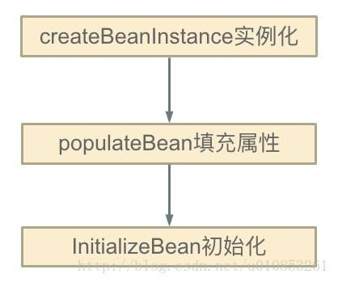](http://static.iocoder.cn/20170912091609918.jpeg)getSingleton

- 前面几篇博客已经分析了 `#createBean(...)` 方法，这里就不再阐述了，我们关注 `#getSingleton(String beanName, ObjectFactory singletonFactory)` 方法，代码如下：

  ```
  // AbstractBeanFactory.java
  
  public Object getSingleton(String beanName, ObjectFactory<?> singletonFactory) {
      Assert.notNull(beanName, "Bean name must not be null");
      synchronized (this.singletonObjects) {
          Object singletonObject = this.singletonObjects.get(beanName);
          if (singletonObject == null) {
              //....
              try {
                  singletonObject = singletonFactory.getObject();
                  newSingleton = true;
              }
              //.....
              if (newSingleton) {
                  addSingleton(beanName, singletonObject);
              }
          }
          return singletonObject;
      }
  }
  ```

  - 😈 注意，此处的 `#getSingleton(String beanName, ObjectFactory singletonFactory)` 方法，在 AbstractBeanFactory 类中实现，和 [「2.1 getSingleton」](http://svip.iocoder.cn/Spring/IoC-get-Bean-createBean-5/#) **不同**。

#### 8.3 总结

为什么是3级别缓存？AOP 和性能 ，**一级 是完全初始化好的对象 2级是 创建好的对象，可能包含代理对象 3级是创建好的ObjectFactory**

至此，Spring 关于 singleton bean 循环依赖已经分析完毕了。所以我们基本上可以确定 Spring 解决循环依赖的方案了：

- Spring 在创建 bean 的时候并不是等它完全完成，而是在创建过程中将创建中的 bean 的 ObjectFactory 提前曝光（即加入到 `singletonFactories` 缓存中）。
- 这样，一旦下一个 bean 创建的时候需要依赖 bean ，则直接使用 ObjectFactory 的 `#getObject()` 方法来获取了，也就是 [「2.1 getSingleton」](http://svip.iocoder.cn/Spring/IoC-get-Bean-createBean-5/#) 小结中的方法中的代码片段了。

到这里，关于 Spring 解决 bean 循环依赖就已经分析完毕了。最后来描述下就上面那个循环依赖 Spring 解决的过程：

- 首先 A 完成初始化第一步并将自己提前曝光出来（通过 ObjectFactory 将自己提前曝光），在初始化的时候，发现自己依赖对象 B，此时就会去尝试 get(B)，这个时候发现 B 还没有被创建出来
- 然后 B 就走创建流程，在 B 初始化的时候，同样发现自己依赖 C，C 也没有被创建出来
- 这个时候 C 又开始初始化进程，但是在初始化的过程中发现自己依赖 A，于是尝试 get(A)，这个时候由于 A 已经添加至缓存中（一般都是添加至三级缓存 `singletonFactories` ），通过 ObjectFactory 提前曝光，所以可以通过 `ObjectFactory#getObject()` 方法来拿到 A 对象，C 拿到 A 对象后顺利完成初始化，然后将自己添加到一级缓存中
- 回到 B ，B 也可以拿到 C 对象，完成初始化，A 可以顺利拿到 B 完成初始化。到这里整个链路就已经完成了初始化过程了

> 老艿艿的建议
>
> 可能逻辑干看比较绕，胖友可以拿出一个草稿纸，画一画上面提到的 A、B、C 初始化的过程。
>
> 相信，胖友会很快明白了。
>
> 如下是《Spring 源码深度解析》P114 页的一张图，非常有助于理解。
>
> [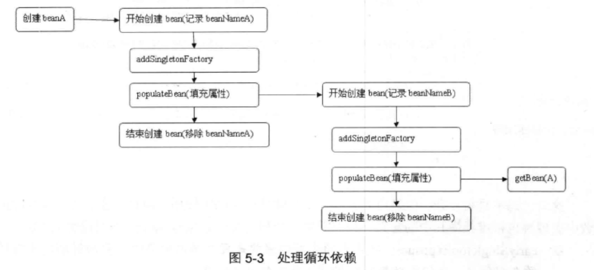](http://static.iocoder.cn/images/Spring/2019-06-13/01.png)

### 9. 创建 Bean（六）之初始化 Bean 对象

#### 9.1 initializeBean

```java
// AbstractAutowireCapableBeanFactory.java

protected Object initializeBean(final String beanName, final Object bean, @Nullable RootBeanDefinition mbd) {
    if (System.getSecurityManager() != null) { // 安全模式
        AccessController.doPrivileged((PrivilegedAction<Object>) () -> {
            // <1> 激活 Aware 方法，对特殊的 bean 处理：Aware、BeanClassLoaderAware、BeanFactoryAware
            invokeAwareMethods(beanName, bean);
            return null;
        }, getAccessControlContext());
    } else {
        // <1> 激活 Aware 方法，对特殊的 bean 处理：Aware、BeanClassLoaderAware、BeanFactoryAware
        invokeAwareMethods(beanName, bean);
    }

    // <2> 后处理器，before
    Object wrappedBean = bean;
    if (mbd == null || !mbd.isSynthetic()) {
        wrappedBean = applyBeanPostProcessorsBeforeInitialization(wrappedBean, beanName);
    }

    // <3> 激活用户自定义的 init 方法
    try {
        invokeInitMethods(beanName, wrappedBean, mbd);
    } catch (Throwable ex) {
        throw new BeanCreationException(
                (mbd != null ? mbd.getResourceDescription() : null),
                beanName, "Invocation of init method failed", ex);
    }

    // <2> 后处理器，after
    if (mbd == null || !mbd.isSynthetic()) {
        wrappedBean = applyBeanPostProcessorsAfterInitialization(wrappedBean, beanName);
    }

    return wrappedBean;
}
```

初始化 bean 的方法其实就是三个步骤的处理，而这三个步骤主要还是根据**用户设定**的来进行初始化，这三个过程为：

- `<1>` 激活 Aware 方法。
- `<3>` 后置处理器的应用。
- `<2>` 激活自定义的 init 方法。

#### 9.2 激活Aware方法

Aware ，英文翻译是意识到的，感知的。Spring 提供了诸多 Aware 接口，用于辅助 Spring Bean 以编程的方式调用 Spring 容器，通过实现这些接口，可以增强 Spring Bean 的功能。

Spring 提供了如下系列的 Aware 接口：

- LoadTimeWeaverAware：加载Spring Bean时织入第三方模块，如AspectJ
- BeanClassLoaderAware：加载Spring Bean的类加载器
- BootstrapContextAware：资源适配器BootstrapContext，如JCA,CCI
- ResourceLoaderAware：底层访问资源的加载器
- BeanFactoryAware：声明BeanFactory
- PortletConfigAware：PortletConfig
- PortletContextAware：PortletContext
- ServletConfigAware：ServletConfig
- ServletContextAware：ServletContext
- MessageSourceAware：国际化
- ApplicationEventPublisherAware：应用事件
- NotificationPublisherAware：JMX通知
- BeanNameAware：声明Spring Bean的名字

------

`#invokeAwareMethods(final String beanName, final Object bean)` 方法，代码如下：

```java
// AbstractAutowireCapableBeanFactory.java

private void invokeAwareMethods(final String beanName, final Object bean) {
    if (bean instanceof Aware) {
        // BeanNameAware
        if (bean instanceof BeanNameAware) {
            ((BeanNameAware) bean).setBeanName(beanName);
        }
        // BeanClassLoaderAware
        if (bean instanceof BeanClassLoaderAware) {
            ClassLoader bcl = getBeanClassLoader();
            if (bcl != null) {
                ((BeanClassLoaderAware) bean).setBeanClassLoader(bcl);
            }
        }
        // BeanFactoryAware
        if (bean instanceof BeanFactoryAware) {
            ((BeanFactoryAware) bean).setBeanFactory(AbstractAutowireCapableBeanFactory.this);
        }
    }
}
```

这里代码就没有什么好说的，主要是处理 BeanNameAware、BeanClassLoaderAware、BeanFactoryAware 。

##### 9.2.1 常见的aware

- LoadTimeWeaverAware：加载Spring Bean时织入第三方模块，如AspectJ
- BeanClassLoaderAware：加载Spring Bean的类加载器
- BootstrapContextAware：资源适配器BootstrapContext，如JCA,CCI
- ResourceLoaderAware：底层访问资源的加载器
- BeanFactoryAware：声明BeanFactory
- PortletConfigAware：PortletConfig
- PortletContextAware：PortletContext
- ServletConfigAware：ServletConfig
- ServletContextAware：ServletContext
- MessageSourceAware：国际化
- ApplicationEventPublisherAware：应用事件
- NotificationPublisherAware：JMX通知
- BeanNameAware：声明Spring Bean的名字

#### 9.3 后置处理器的应用（BeanPostProcessor ）

BeanPostProcessor 的作用：在 Bean 完成实例化后，如果我们需要对其进行一些配置、增加一些自己的处理逻辑，那么请使用 BeanPostProcessor。

`org.springframework.beans.factory.config.BeanPostProcessor` 接口，代码如下：

```java
public interface BeanPostProcessor {

	@Nullable
	default Object postProcessBeforeInitialization(Object bean, String beanName) throws BeansException {
		return bean;
	}

	@Nullable
	default Object postProcessAfterInitialization(Object bean, String beanName) throws BeansException {
		return bean;
	}

}
```

**BeanPostProcessor 可以理解为是 Spring 的一个工厂钩子（其实 Spring 提供一系列的钩子，如 Aware 、InitializingBean、DisposableBean），它是 Spring 提供的对象实例化阶段强有力的扩展点，**允许 Spring 在实例化 bean 阶段对其进行定制化修改，比较常见的使用场景是处理标记接口实现类或者为当前对象提供代理实现（例如 AOP）。

一般普通的 BeanFactory 是不支持自动注册 BeanPostProcessor 的，需要我们手动调用 `#addBeanPostProcessor(BeanPostProcessor beanPostProcessor)` 方法进行注册。注册后的 BeanPostProcessor 适用于所有该 BeanFactory 创建的 bean，但是 **ApplicationContext 可以在其 bean 定义中自动检测所有的 BeanPostProcessor 并自动完成注册，同时将他们应用到随后创建的任何 Bean 中**。

`#postProcessBeforeInitialization(Object bean, String beanName)` 和 `#postProcessAfterInitialization(Object bean, String beanName)` 两个方法，都接收一个 Object 类型的 `bean` ，一个 String 类型的 `beanName` ，其中 `bean` 是已经实例化了的 `instanceBean` ，能拿到这个你是不是可以对它为所欲为了？ 这两个方法是初始化 `bean` 的前后置处理器，他们应用 `#invokeInitMethods(String beanName, final Object bean, RootBeanDefinition mbd)` 方法的前后。如下图：


代码层次上面已经贴出来，这里再贴一次：

[](http://static.iocoder.cn/8d2ae41f84bfb1928845428dae1b26c1)201808221006

两者源码如下：

```java
// AbstractAutowireCapableBeanFactory.java

@Override
public Object applyBeanPostProcessorsBeforeInitialization(Object existingBean, String beanName)
		throws BeansException {
	Object result = existingBean;
	// 遍历 BeanPostProcessor 数组
	for (BeanPostProcessor processor : getBeanPostProcessors()) {
	    // 处理
		Object current = processor.postProcessBeforeInitialization(result, beanName);
        // 返回空，则返回 result
		if (current == null) {
			return result;
		}
		// 修改 result
		result = current;
	}
	return result;
}

@Override
public Object applyBeanPostProcessorsAfterInitialization(Object existingBean, String beanName)
		throws BeansException {
	Object result = existingBean;
	// 遍历 BeanPostProcessor
	for (BeanPostProcessor processor : getBeanPostProcessors()) {
	    // 处理
		Object current = processor.postProcessAfterInitialization(result, beanName);
		// 返回空，则返回 result
		if (current == null) {
			return result;
		}
		// 修改 result
		result = current;
	}
	return result;
}
```

##### 9.3.1 自动检测并注册

`#getBeanPostProcessors()` 方法，返回的是 `beanPostProcessors` 集合，该集合里面存放就是我们自定义的 BeanPostProcessor ，如果该集合中存在元素则调用相应的方法，否则就直接返回 bean 了。这也是为什么使用 BeanFactory 容器是无法输出自定义 BeanPostProcessor 里面的内容，因为在 `BeanFactory#getBean(...)` 方法的过程中根本就没有将我们自定义的 BeanPostProcessor 注入进来，所以要想 BeanFactory 容器 的 BeanPostProcessor 生效我们必须手动调用 `#addBeanPostProcessor(BeanPostProcessor beanPostProcessor)` 方法，将定义的 BeanPostProcessor 注册到相应的 BeanFactory 中。**但是 ApplicationContext 不需要手动，因为 ApplicationContext 会自动检测并完成注册**。

ApplicationContext 实现自动注册的原因，在于我们构造一个 ApplicationContext 实例对象的时候会调用 `#registerBeanPostProcessors(ConfigurableListableBeanFactory beanFactory)` 方法，将检测到的 BeanPostProcessor 注入到 ApplicationContext 容器中，同时应用到该容器创建的 bean 中。代码如下：

```java
// AbstractApplicationContext.java

/**
 * 实例化并调用已经注入的 BeanPostProcessor
 * 必须在应用中 bean 实例化之前调用
 */
protected void registerBeanPostProcessors(ConfigurableListableBeanFactory beanFactory) {
    PostProcessorRegistrationDelegate.registerBeanPostProcessors(beanFactory, this);
}

// PostProcessorRegistrationDelegate.java

public static void registerBeanPostProcessors(
		ConfigurableListableBeanFactory beanFactory, AbstractApplicationContext applicationContext) {

    // 获取所有的 BeanPostProcessor 的 beanName
    // 这些 beanName 都已经全部加载到容器中去，但是没有实例化
	String[] postProcessorNames = beanFactory.getBeanNamesForType(BeanPostProcessor.class, true, false);

	// Register BeanPostProcessorChecker that logs an info message when
	// a bean is created during BeanPostProcessor instantiation, i.e. when
	// a bean is not eligible for getting processed by all BeanPostProcessors.
    // 记录所有的beanProcessor数量
	int beanProcessorTargetCount = beanFactory.getBeanPostProcessorCount() + 1 + postProcessorNames.length;
	// 注册 BeanPostProcessorChecker，它主要是用于在 BeanPostProcessor 实例化期间记录日志
    // 当 Spring 中高配置的后置处理器还没有注册就已经开始了 bean 的实例化过程，这个时候便会打印 BeanPostProcessorChecker 中的内容
	beanFactory.addBeanPostProcessor(new BeanPostProcessorChecker(beanFactory, beanProcessorTargetCount));

	// Separate between BeanPostProcessors that implement PriorityOrdered,
	// Ordered, and the rest.
    // PriorityOrdered 保证顺序
	List<BeanPostProcessor> priorityOrderedPostProcessors = new ArrayList<>();
    // MergedBeanDefinitionPostProcessor
	List<BeanPostProcessor> internalPostProcessors = new ArrayList<>();
    // 使用 Ordered 保证顺序
	List<String> orderedPostProcessorNames = new ArrayList<>();
    // 没有顺序
	List<String> nonOrderedPostProcessorNames = new ArrayList<>();
	for (String ppName : postProcessorNames) {
        // PriorityOrdered
        if (beanFactory.isTypeMatch(ppName, PriorityOrdered.class)) {
            // 调用 getBean 获取 bean 实例对象
			BeanPostProcessor pp = beanFactory.getBean(ppName, BeanPostProcessor.class);
			priorityOrderedPostProcessors.add(pp);
			if (pp instanceof MergedBeanDefinitionPostProcessor) {
				internalPostProcessors.add(pp);
			}
		} else if (beanFactory.isTypeMatch(ppName, Ordered.class)) {
            // 有序 Ordered
			orderedPostProcessorNames.add(ppName);
		} else {
            // 无序
			nonOrderedPostProcessorNames.add(ppName);
		}
	}

	// First, register the BeanPostProcessors that implement PriorityOrdered.
    // 第一步，注册所有实现了 PriorityOrdered 的 BeanPostProcessor
    // 先排序
	sortPostProcessors(priorityOrderedPostProcessors, beanFactory);
    // 后注册
	registerBeanPostProcessors(beanFactory, priorityOrderedPostProcessors);

	// Next, register the BeanPostProcessors that implement Ordered.
    // 第二步，注册所有实现了 Ordered 的 BeanPostProcessor
	List<BeanPostProcessor> orderedPostProcessors = new ArrayList<>();
	for (String ppName : orderedPostProcessorNames) {
		BeanPostProcessor pp = beanFactory.getBean(ppName, BeanPostProcessor.class);
		orderedPostProcessors.add(pp);
		if (pp instanceof MergedBeanDefinitionPostProcessor) {
			internalPostProcessors.add(pp);
		}
	}
    // 先排序
	sortPostProcessors(orderedPostProcessors, beanFactory);
    // 后注册
	registerBeanPostProcessors(beanFactory, orderedPostProcessors);

	// Now, register all regular BeanPostProcessors.
    // 第三步注册所有无序的 BeanPostProcessor
	List<BeanPostProcessor> nonOrderedPostProcessors = new ArrayList<>();
	for (String ppName : nonOrderedPostProcessorNames) {
		BeanPostProcessor pp = beanFactory.getBean(ppName, BeanPostProcessor.class);
		nonOrderedPostProcessors.add(pp);
		if (pp instanceof MergedBeanDefinitionPostProcessor) {
			internalPostProcessors.add(pp);
		}
	}
	// 注册，无需排序
	registerBeanPostProcessors(beanFactory, nonOrderedPostProcessors);

	// Finally, re-register all internal BeanPostProcessors.
    // 最后，注册所有的 MergedBeanDefinitionPostProcessor 类型的 BeanPostProcessor
	sortPostProcessors(internalPostProcessors, beanFactory);
	registerBeanPostProcessors(beanFactory, internalPostProcessors);

	// Re-register post-processor for detecting inner beans as ApplicationListeners,
	// moving it to the end of the processor chain (for picking up proxies etc).
    // 加入ApplicationListenerDetector（探测器）
    // 重新注册 BeanPostProcessor 以检测内部 bean，因为 ApplicationListeners 将其移动到处理器链的末尾
	beanFactory.addBeanPostProcessor(new ApplicationListenerDetector(applicationContext));
}
```

- 方法首先 `beanFactory` 获取注册到该 BeanFactory 中所有 BeanPostProcessor 类型的 `beanName` 数组，其实就是找所有实现了 BeanPostProcessor 接口的 bean ，然后迭代这些 bean ，将其按照 PriorityOrdered、Ordered、无序的顺序，添加至相应的 List 集合中，最后依次调用 `#sortPostProcessors(List postProcessors, ConfigurableListableBeanFactory beanFactory)` 方法来进行排序处理、 `#registerBeanPostProcessors(ConfigurableListableBeanFactory beanFactory, List postProcessors)` 方法来完成注册。

- 【**排序**】很简单，如果 `beanFactory` 为 DefaultListableBeanFactory ，则返回 BeanFactory 所依赖的比较器，否则反正默认的比较器(OrderComparator)，然后调用 `List#sort(Comparator c)` 方法即可。代码如下：

  ```java
  // PostProcessorRegistrationDelegate.java
  private static void sortPostProcessors(List<?> postProcessors, ConfigurableListableBeanFactory beanFactory) {
  	// 获得 Comparator 对象
      Comparator<Object> comparatorToUse = null;
  	if (beanFactory instanceof DefaultListableBeanFactory) { // 依赖的 Comparator 对象
  		comparatorToUse = ((DefaultListableBeanFactory) beanFactory).getDependencyComparator();
  	}
  	if (comparatorToUse == null) { // 默认 Comparator 对象
  		comparatorToUse = OrderComparator.INSTANCE;
  	}
  	// 排序
  	postProcessors.sort(comparatorToUse);
  }
  ```

- 而对于【**注册**】，同样是调用 `AbstractBeanFactory#addBeanPostProcessor(BeanPostProcessor beanPostProcessor)` 方法完成注册。代码如下：

  ```java
  // PostProcessorRegistrationDelegate.java
  
  private static void registerBeanPostProcessors(ConfigurableListableBeanFactory beanFactory, List<BeanPostProcessor> postProcessors) {
      // 遍历 BeanPostProcessor 数组，注册
  	for (BeanPostProcessor postProcessor : postProcessors) {
  		beanFactory.addBeanPostProcessor(postProcessor);
  	}
  }
  ```

##### 9.3.2 小结

至此，BeanPostProcessor 已经分析完毕了，这里简单总结下：

1. BeanPostProcessor 的作用域是容器级别的，它只和所在的容器相关 ，当 BeanPostProcessor 完成注册后，它会应用于所有跟它在同一个容器内的 bean 。
2. BeanFactory 和 ApplicationContext 对 BeanPostProcessor 的处理不同，**ApplicationContext 会自动检测所有实现了 BeanPostProcessor 接口的 bean，并完成注册，但是使用 BeanFactory 容器时则需要手动调用 `AbstractBeanFactory#addBeanPostProcessor(BeanPostProcessor beanPostProcessor)` 方法来完成注册**
3. ApplicationContext 的 BeanPostProcessor 支持 Ordered，而 BeanFactory 的 BeanPostProcessor 是不支持的，原因在于ApplicationContext 会对 BeanPostProcessor 进行 Ordered 检测并完成排序，而 BeanFactory 中的 BeanPostProcessor 只跟注册的顺序有关。

#### 9.4 激活自定义的init方法

##### 9.4.1 InitializingBean

Spring 容器会主动检查当前 bean 是否已经实现了 InitializingBean 接口，如果实现了，则会掉用其 `#afterPropertiesSet()` 方法。这个主动检查、调用的动作是由 `#invokeInitMethods(String beanName, final Object bean, @Nullable RootBeanDefinition mbd)` 方法来完成的。代码如下：

```java
// AbstractAutowireCapableBeanFactory.java

protected void invokeInitMethods(String beanName, final Object bean, @Nullable RootBeanDefinition mbd)
        throws Throwable {
    // 首先会检查是否是 InitializingBean ，如果是的话需要调用 afterPropertiesSet()
    boolean isInitializingBean = (bean instanceof InitializingBean);
    if (isInitializingBean && (mbd == null || !mbd.isExternallyManagedInitMethod("afterPropertiesSet"))) {
        if (logger.isTraceEnabled()) {
            logger.trace("Invoking afterPropertiesSet() on bean with name '" + beanName + "'");
        }
        if (System.getSecurityManager() != null) { // 安全模式
            try {
                AccessController.doPrivileged((PrivilegedExceptionAction<Object>) () -> {
                    // 属性初始化的处理
                    ((InitializingBean) bean).afterPropertiesSet();
                    return null;
                }, getAccessControlContext());
            } catch (PrivilegedActionException pae) {
                throw pae.getException();
            }
        } else {
            // 属性初始化的处理
            ((InitializingBean) bean).afterPropertiesSet();
        }
    }

    if (mbd != null && bean.getClass() != NullBean.class) {
        // 判断是否指定了 init-method()，
        // 如果指定了 init-method()，则再调用制定的init-method
        String initMethodName = mbd.getInitMethodName();
        if (StringUtils.hasLength(initMethodName) &&
                !(isInitializingBean && "afterPropertiesSet".equals(initMethodName)) &&
                !mbd.isExternallyManagedInitMethod(initMethodName)) {
            // 激活用户自定义的初始化方法
            // 利用反射机制执行
            invokeCustomInitMethod(beanName, bean, mbd);
        }
    }
}
```

- 首先，检测当前 bean 是否实现了 InitializingBean 接口，如果实现了则调用其 `#afterPropertiesSet()` 方法。
- 然后，再检查是否也指定了 `init-method`，如果指定了则通过反射机制调用指定的 `init-method` 方法。

虽然该接口为 Spring 容器的扩展性立下了汗马功劳，但是如果真的让我们的业务对象来实现这个接口就显得不是那么的友好了，Spring 的一个核心理念就是无侵入性，但是如果我们业务类实现这个接口就显得 Spring 容器具有侵入性了。所以 Spring 还提供了另外一种实现的方式：`init-method` 方法。

##### 9.4.2 init-method


##### 9.4.3 小结

从 `#invokeInitMethods(...)` 方法中，我们知道 `init-method` 指定的方法会在 `#afterPropertiesSet()` 方法之后执行，如果 `#afterPropertiesSet()` 方法的执行的过程中出现了异常，则 `init-method` 是不会执行的，而且由于 `init-method` 采用的是反射执行的方式，所以 `#afterPropertiesSet()` 方法的执行效率一般会高些，但是并不能排除我们要优先使用 `init-method`，主要是因为它消除了 bean 对 Spring 的依赖，Spring 没有侵入到我们业务代码，这样会更加符合 Spring 的理念。诚然，`init-method` 是基于 xml 配置文件的，就目前而言，我们的工程几乎都摒弃了配置，而采用注释的方式，那么 `@PreDestory` 可能适合你，当然这个注解我们后面分析。

至此，InitializingBean 和 init-method 已经分析完毕了，对于DisposableBean 和 `destroy-method` ，他们和 init 相似，这里就不做阐述了。


### 10. bean 的生命周期


### 11. BeanFactoryPostProcessor深入分析

BeanFactoryPostProcessor 的机制，就相当于给了我们在 Bean 实例化之前最后一次修改 BeanDefinition 的机会，我们可以利用这个机会对 BeanDefinition 来进行一些额外的操作，比如更改某些 bean 的一些属性，给某些 Bean 增加一些其他的信息等等操作。

```java
 void postProcessBeanFactory(ConfigurableListableBeanFactory beanFactory) throws BeansException;
```

`#postProcessBeanFactory(...)` 方法，工作于 BeanDefinition 加载完成之后，Bean 实例化之前，其主要作用是对加载 BeanDefinition 进行修改。有一点需要需要**注意**的是在 `#postProcessBeanFactory(...)` 方法中，千万不能进行 Bean 的实例化工作，因为这样会导致 Bean 过早实例化，会产生严重后果，**我们始终需要注意的是 BeanFactoryPostProcessor 是与 BeanDefinition 打交道的，如果想要与 Bean 打交道，请使用 BeanPostProcessor** 。

与 BeanPostProcessor 一样，BeanFactoryPostProcessor 同样支持**排序**，一个容器可以同时拥有多个 BeanFactoryPostProcessor ，这个时候如果我们比较在乎他们的顺序的话，可以实现 Ordered 接口。

如果要自定义 BeanFactoryPostProcessor ，直接实现该接口即可。

#### 示例

```java
public class BeanFactoryPostProcessor_1 implements BeanFactoryPostProcessor,Ordered {    @Override    public void postProcessBeanFactory(ConfigurableListableBeanFactory beanFactory) throws BeansException {        System.out.println("调用 BeanFactoryPostProcessor_1 ...");        System.out.println("容器中有 BeanDefinition 的个数：" + beanFactory.getBeanDefinitionCount());        // 获取指定的 BeanDefinition        BeanDefinition bd = beanFactory.getBeanDefinition("studentService");        MutablePropertyValues pvs = bd.getPropertyValues();        pvs.addPropertyValue("name","chenssy1");        pvs.addPropertyValue("age",15);    }    @Override    public int getOrder() {        return 1;    }}
```

#### 原理

ApplicationContext  会自动识别和注册beanFactoryPostProcessor

####  PropertyPlaceholderConfigurer解析

是beanFactoryPostProcesser的重要子类

PropertyPlacehoderConfigurer 允许我们用 Properties 文件中的属性，来定义应用上下文（配置文件或者注解）。就是说我们在 XML 配置文件（或者其他方式，如注解方式）中使用**占位符**的方式来定义一些资源，并将这些占位符所代表的资源配置到 Properties 中，这样只需要对 Properties 文件进行修改即可，这个特性非常，在后面来介绍一种我们在项目中经常用到场景。

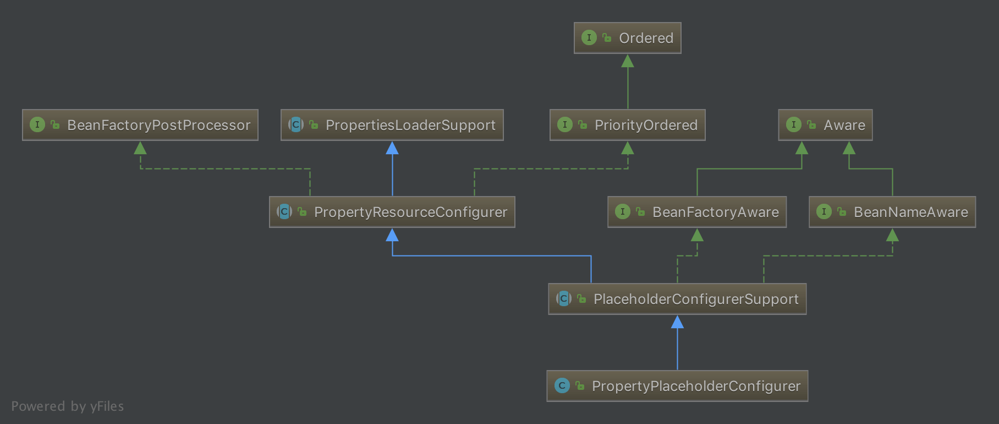

内容较多，具体举个例子就是我们具体在成员变量里面设置 ${value:aaaa}这种的，会被properties中替换掉一个具体的值来处理，而这个过程实在beanFactoryPost中进行处理也就是beanDefinition完成后，准备实例化bean开始前。

##### 多环境切换-环境切换

在我们项目开发过程中，都会存在多个环境，如 dev 、test 、prod 等等，各个环境的配置都会不一样，在传统的开发过程中我们都是在进行打包的时候进行人工干预，或者将配置文件放在系统外部，加载的时候指定加载目录，这种方式容易出错，那么有没有一种比较好的方式来解决这种情况呢？有，**利用 PropertyPlaceholderConfigurer 的特性来动态加载配置文件，实现多环境切换**。

首先我们定义四个 Properties 文件，如下：

[](http://static.iocoder.cn/15374242055683.jpg)

配置内容如下：

- `application-dev.properties` 文件，如下：

  ```
  student.name=chenssy-dev
  ```

- `application-test.properties` 文件，如下：

  ```
  student.name=chenssy-test
  ```

- `application-prod.properties` 文件，如下：

  ```
  student.name=chenssy-prod
  ```

然后实现一个类，该类继承 PropertyPlaceholderConfigurer，实现 `#loadProperties(Properties props)` 方法，根据环境的不同加载不同的配置文件，代码如下：

```java
public class CustomPropertyConfig extends PropertyPlaceholderConfigurer {

    private Resource[] locations;

    private PropertiesPersister propertiesPersister = new DefaultPropertiesPersister();

    @Override
    public void setLocations(Resource[] locations) {
        this.locations = locations;
    }

    @Override
    public void setLocalOverride(boolean localOverride) {
        this.localOverride = localOverride;
    }

    /**
     * 覆盖这个方法，根据启动参数，动态读取配置文件
     * @param props
     * @throws IOException
     */
    @Override
    protected void loadProperties(Properties props) throws IOException {
        if (locations != null) {
            // locations 里面就已经包含了那三个定义的文件
            for (Resource location : this.locations) {
                InputStream is = null;
                try {
                    String filename = location.getFilename();
                    String env = "application-" + System.getProperty("spring.profiles.active", "dev") + ".properties";

                    // 找到我们需要的文件，加载
                    if (filename.contains(env)) {
                        logger.info("Loading properties file from " + location);
                        is = location.getInputStream();
                        this.propertiesPersister.load(props, is);

                    }
                } catch (IOException ex) {
                    logger.info("读取配置文件失败.....");
                    throw ex;
                } finally {
                    if (is != null) {
                        is.close();
                    }
                }
            }
        }
    }
}
```

配置文件：

```
<bean id="PropertyPlaceholderConfigurer" class="org.springframework.core.custom.CustomPropertyConfig">
    <property name="locations">
        <list>
            <value>classpath:config/application-dev.properties</value>
            <value>classpath:config/application-test.properties</value>
            <value>classpath:config/application-prod.properties</value>
        </list>
    </property>
</bean>

<bean id="studentService" class="org.springframework.core.service.StudentService">
    <property name="name" value="${student.name}"/>
</bean>
```

在 idea 的 VM options 里面增加 `-Dspring.profiles.active=dev`，标志当前环境为 dev 环境。测试代码如下：

```
ApplicationContext context = new ClassPathXmlApplicationContext("spring.xml");

StudentService studentService = (StudentService) context.getBean("studentService");
System.out.println("student name:" + studentService.getName());
```

运行结果：

```
student name:chenssy-dev
```

当将 `-Dspring.profiles.active` 调整为 test，则打印结果则是 chenssy-test，这样就完全实现了根据不同的环境加载不同的配置。

如果各位用过 Spring Boot 的话，这个就完全是 Spring Boot 里面的 `spring.profiles.active` ，可参见 `org.springframework.core.envAbstractEnvironment` 类，对应博客为 [《Spring boot源码分析-profiles环境（4）》](https://blog.csdn.net/jamet/article/details/77508182) 。

#### PropertyOverrideConfigurer 

PropertyOverrideConfigurer 允许我们对 Spring 容器中配置的任何我们想处理的 bean 定义的 property 信息进行覆盖替换。通俗点说，就是我们可以通过 PropertyOverrideConfigurer 来覆盖任何 bean 中的任何属性，只要我们想。

##### 使用

PropertyOverrideConfigurer 的使用规则是 `beanName.propertyName=value`，这里需要注意的是 `beanName.propertyName` 则是该 bean 中存在的属性。

比如：

依然使用以前的例子，`Student.class`，我们只需要修改下配置文件，声明下 PropertyOverrideConfigurer 以及其加载的配置文件。如下：

```
<bean class="org.springframework.beans.factory.config.PropertyOverrideConfigurer">
    <property name="locations">
        <list>
            <value>classpath:application.properties</value>
        </list>
    </property>
</bean>

<bean id="student" class="org.springframework.core.service.StudentService">
    <property name="name" value="chenssy"/>
</bean>
```

- 指定 student 的 `name` 属性值为 `"chenssy"` 。

- 声明 PropertyOverrideConfigurer 加载的文件为 `application.properties`，内容如下：

  ```
  student.name = chenssy-PropertyOverrideConfigurer
  ```

  - 指定 beanName 为 `student` 的 bean 的 `name` 属性值为 `"chenssy-PropertyOverrideConfigurer"` 。

测试打印 `student` 中的 `name` 属性值，代码如下：

```
ApplicationContext context = new ClassPathXmlApplicationContext("spring.xml");

StudentService studentService = (StudentService) context.getBean("student");
System.out.println("student name:" + studentService.getName());
```

运行结果为：

[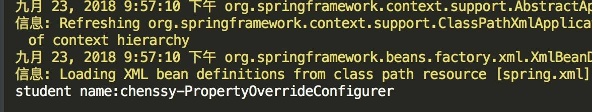](http://static.iocoder.cn/15377119278769.jpg)

从中可以看出 PropertyOverrideConfigurer 定义的文件取代了 bean 中默认的值。

示例二：

下面我们看一个有趣的例子，如果我们一个 bean 中 PropertyPlaceholderConfigurer 和 PropertyOverrideConfigurer 都使用呢？那是显示谁定义的值呢？这里先简单分析下：如果PropertyOverrideConfigurer 先作用，那么 PropertyPlaceholderConfigurer 在匹配占位符的时候就找不到了，**如果 PropertyOverrideConfigurer 后作用，也会直接取代 PropertyPlaceholderConfigurer 定义的值，所以无论如何都会显示 PropertyOverrideConfigurer 定义的值**。是不是这样呢

如何

##### 使用原理

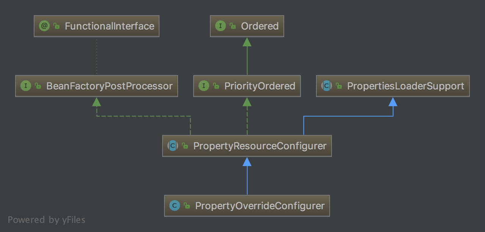

#### 两者结构比较

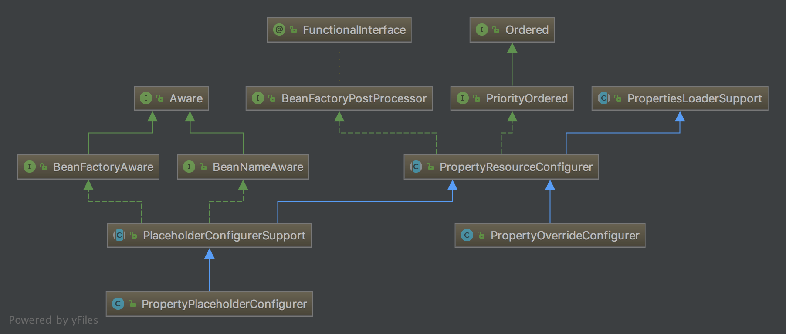


### 12. [IoC 之深入分析 Bean 的类型转换体系](http://svip.iocoder.cn/Spring/IoC-TypeConverter/)

一个优秀的convert实现处理，参考仿写一个，covert的注册，使用等

抽象方法里面定义一个 抽象的处理类：typeConverterDelegate 
各个实现自己设置这个 处理类，抽象方法委派给这个抽象类处理
ConverterRegistry，ConversionService ConfigurableConversionService实现他 进行处理 ，再来一个 真正处理拉欸实现加缓存，自定义的covert类和查询covert都在这里面啊等等
ResolvableType 用于封装 Java 的 Type 类型。

### 13.BeanWrapper分析

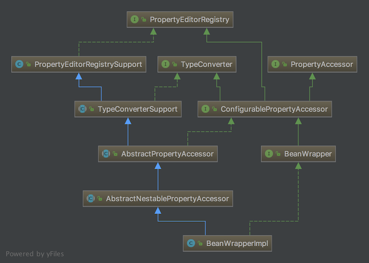


## SpringWeb


关于input流和ouput流只能一次的时候，把他保存起来，然后后续的getInputStrem等都从这个数据走