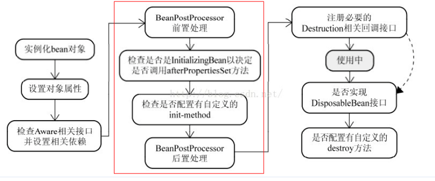

## SpringBoot

## SpringClound

### 常用类

#### Fegin


#### 一个请求的流程走向
1. org.apache.catalina.core.StandardWrapperValve#invoke
    创建了filterChain和servlet,当filter有错误时候,开始抛出异常然后重新构造了一个error请求再次走一次内容
   org.apache.catalina.core.ApplicationFilterChain#doFilter开始过滤器的处理,
    
    过滤器的处理逻辑大概如下,ApplicationFilterChain在每个类中存在,每个类调用doFilter,又会回到ApplicationFilterChain里面有调用具体的fitler方法.因此ApplicationFilterChain要控制好指针.
    filter抛出异常后会catch同时设置异常的相关信息
    org.apache.catalina.core.StandardHostValve#status会异常判断是否在往error页面进行请求.
    org.apache.catalina.util.ErrorPageSupport里面存储了状态码和页面的映射内容,何时注册?
  ```
  org.springframework.boot.web.embedded.tomcat.TomcatServletWebServerFactory#configureContext进行了注册
org.springframework.boot.autoconfigure.web.servlet.error.ErrorMvcAutoConfiguration.ErrorPageCustomizer#registerErrorPages
可以根据不同的状态码注册,不同的异常注册,
  ```

  org.apache.catalina.core.StandardHostValve#custom做真正的二次转发地址内容又进行一次过滤器和servlet内容

#### filter的顺序处理


## 常见问题:
1. BeanFactory 和 ApplicationContext 的不同点

ApplicationContext 是 Spring 应用程序中的中央接口，用于向应用程序提供配置信息它继承了 BeanFactory 接口，所以 ApplicationContext 包含 BeanFactory 的所有功能以及更多功能！它的主要功能是支持大型的业务应用的创建**特性：**

- Bean instantiation/wiring
- Bean 的实例化/串联
- 自动的 BeanPostProcessor 注册
- 自动的 BeanFactoryPostProcessor 注册
- 方便的 MessageSource 访问（i18n）
- ApplicationEvent 的发布

这是一个用来访问 Spring 容器的 root 接口，要访问 Spring 容器，我们将使用 Spring 依赖注入功能，使用 BeanFactory 接口和它的子接口特性：

    Bean 的实例化/串联

通常情况，BeanFactory 的实现是使用懒加载的方式，这意味着 beans 只有在我们通过 getBean() 方法直接调用它们时才进行实例化

2. @PostConstruct 的使用
   如果想在生成对象时完成某些初始化操作，而偏偏这些初始化操作又依赖于依赖注入，那么久无法在构造函数中实现。为此，可以使用@PostConstruct注解一个方法来完成初始化，@PostConstruct注解的方法将会在依赖注入完成后被自动调用。

   调用的顺序Constructor > @PostConstruct > InitializingBean > init-method

3. @ConfigurationProperties 
   https://blog.csdn.net/yusimiao/article/details/97622666

4. Order注解的使用

   4.0以上的版本注入order可以对bean的加载优先进行控制

   二、SpringBoot排序实现步骤：（AnnotationAwareOrderComparator类）

       先查找是否是PriorityOrdered接口（优先级最高）
       查找该类自己的Order值【实现Ordered接口，调用getOrder方法】
       查找注解@Order的值(如果是Spring则没有该次步骤，并且排序实现类应该是上述的父类【OrderComparator】)

   三、如果同时实现Ordered接口 和 @Order注解，应该取接口的值
   
5. 指定Bean初始化顺序，
  
    构造方法依赖
    @DependOn 注解
    BeanPostProcessor 扩展
    
    

初步理解整个流程 bean先创建BeanFactoryPostProcessor在bean实例化之前执行， 构造函数处理-》，之后实例化bean（调用构造函数，并调用set方法注入属性值，包括了awroid数据），然后在调用两个初始化方法前后，执行了BeanPostProcessor。初始化方法的执行顺序是，先执行afterPropertiesSet，再执行init-method。

 运用场景：postProcessAfterInitialization可以对一个类在做增强处理

二、InstantiationAwareBeanPostProcessor与BeanPostProcessor对比

     BeanPostProcessor 执行时机为bean初始化（Initialization）阶段，日常可以拓展该接口对bean初始化进行定制化处理。
     InstantiationAwareBeanPostProcessor 执行时机bean实例化（Instantiation）阶段，典型用于替换bean默认创建方式，例如aop通过拓展接口生成代理对应，主要用于基础框架层面。如果日常业务中需要拓展该，spring推荐使用适配器类InstantiationAwareBeanPostProcessorAdapter。
    所有bean创建都会进行回调。
```
BeanFactoryAware和ApplicationContextAware的区别？
BeanFactory 接口和BeanFactory 接口的区别？
bean的生命周期
```

