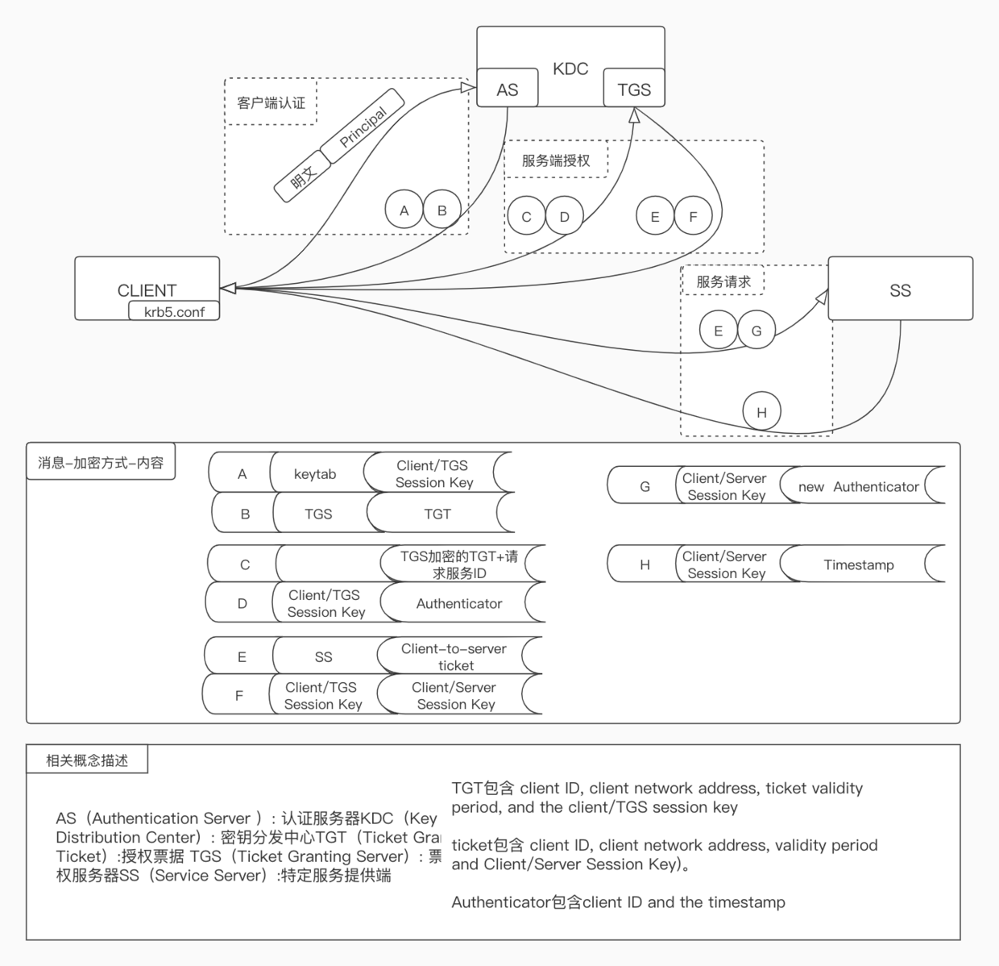

# Kerberos
## 认证流程


它主要包含：认证服务器（AS）和票据授权服务器(TGS)组成的密钥分发中心（KDC），以及提供特定服务的SS。相关概念描述：

- AS（Authentication Server）= 认证服务器
- KDC（Key Distribution Center）= 密钥分发中心
- TGT（Ticket Granting Ticket）= 授权票据
- TGS（Ticket Granting Server）= 票据授权服务器
- SS（Service Server）= 特定服务提供端


## Kerberos的几个概念

### Realm

类似于namespace的概念，一个realm包含多个principal。一个principal属于一个特定的realm。

### Principal

认证的主体，可以认为等效于用户名。

Principal的名称格式为

```txtdart
name/role@realm
```

 Keytab

二进制文件。包含了principal和加密了的principal密钥信息，可以用来认证principal。

### Kadmin

Kadmin即Kerberos administration server，运行在主kerberos节点。负责存储KDC数据库，管理principal信息。


