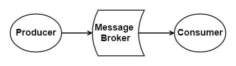
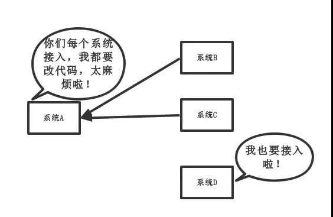
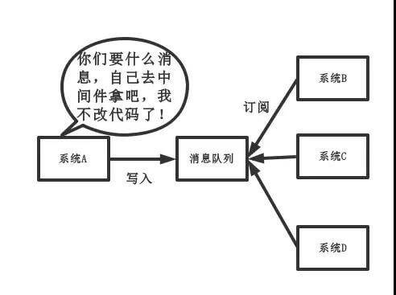

## 消息队列由哪些角色组成？

如下图所示：

MQ 角色

- 生产者（Producer）：负责产生消息。
- 消费者（Consumer）：负责消费消息
- 消息代理（Message Broker）：负责存储消息和转发消息两件事情。其中，转发消息分为推送和拉取两种方式。
  - 拉取（Pull），是指 Consumer 主动从 Message Broker 获取消息
  - 推送（Push），是指 Message Broker 主动将 Consumer 感兴趣的消息推送给 Consumer 。

## 消息队列有哪些使用场景？

一般来说，有四大类使用场景：

- 应用解耦
- 异步处理
- 流量削峰
- 消息通讯
- 日志处理

**其中，应用解耦、异步处理是比较核心的**。

> 艿艿：这个问题，也适合回答《为什么使用消息队列？》，当然需要扩充下，下面我们来看看。

## 为什么使用消息队列进行应用解耦？

传统模式下，如下图所示：传统模式

- 缺点比较明显，系统间耦合性太强。系统 A 在代码中直接调用系统 B 和系统 C 的代码，如果将来 D 系统接入，系统 A 还需要修改代码，过于麻烦！并且，万一系统 A、B、C 万一还改接口，还要持续跟进。

引入消息队列后，如下图所示：新模式

- 将消息写入消息队列，需要消息的系统自己从消息队列中订阅，从而系统 A 不需要做任何修改。

所以，有了消息队列之后，从主动调用的方式，变成了消息的订阅发布( 或者说，事件的发布和监听 )，从而解耦。

举个实际场景的例子，用户支付订单完成后，系统需要给用户发红包、增加积分等等行为，就可以通过这样的方式进行解耦。

## 消息队列有什么优缺点？

- 系统可用性降低。(MQ挂多挂)

  系统引入的外部依赖越多，越容易挂掉。本来你就是 A 系统调用 BCD 三个系统的接口就好了，本来 ABCD 四个系统好好的，没啥问题，你偏加个 MQ 进来，万一 MQ 挂了咋整，MQ 一挂，整套系统崩溃的，你不就完了？**所以，消息队列一定要做好高可用**。

- 系统复杂度提高。

  主要需要多考虑，1）消息怎么不重复消息。2）消息怎么保证不丢失。3）需要消息顺序的业务场景，怎么处理。

- 一致性问题。

  A 系统处理完了直接返回成功了，人都以为你这个请求就成功了。但是问题是，要是 B、C。D 三个系统那里，B、D 两个系统写库成功了，结果 C 系统写库失败了，咋整？你这数据就不一致了。
  当然，这不仅仅是 MQ 的问题，引入 RPC 之后本身就存在这样的问题。**如果我们在使用 MQ 时，一定要达到数据的最终一致性**。即，C 系统最终执行完成。