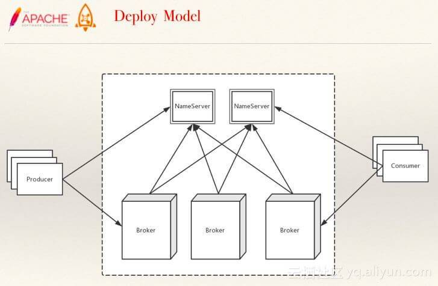

# 缓存面试题

## 消息队列由哪些角色组成？

如下图所示：

[](http://static.iocoder.cn/images/MQ/2019_11_12/01.png)MQ 角色

- 生产者（Producer）：负责产生消息。
- 消费者（Consumer）：负责消费消息
- 消息代理（Message Broker）：负责存储消息和转发消息两件事情。其中，转发消息分为推送和拉取两种方式。
  - 拉取（Pull），是指 Consumer 主动从 Message Broker 获取消息
  - 推送（Push），是指 Message Broker 主动将 Consumer 感兴趣的消息推送给 Consumer 。

## 消息队列有哪些使用场景？

一般来说，有四大类使用场景：

- 应用解耦
- 异步处理
- 流量削峰
- 消息通讯
- 日志处理

**其中，应用解耦、异步处理是比较核心的**。

> 艿艿：这个问题，也适合回答《为什么使用消息队列？》，当然需要扩充下，下面我们来看看。

## 为什么使用消息队列进行应用解耦？

传统模式下，如下图所示：[](http://static.iocoder.cn/images/MQ/2019_11_12/03.png)传统模式

- 缺点比较明显，系统间耦合性太强。系统 A 在代码中直接调用系统 B 和系统 C 的代码，如果将来 D 系统接入，系统 A 还需要修改代码，过于麻烦！并且，万一系统 A、B、C 万一还改接口，还要持续跟进。

引入消息队列后，如下图所示：[](http://static.iocoder.cn/images/MQ/2019_11_12/04.png)新模式

- 将消息写入消息队列，需要消息的系统自己从消息队列中订阅，从而系统 A 不需要做任何修改。

所以，有了消息队列之后，从主动调用的方式，变成了消息的订阅发布( 或者说，事件的发布和监听 )，从而解耦。

举个实际场景的例子，用户支付订单完成后，系统需要给用户发红包、增加积分等等行为，就可以通过这样的方式进行解耦。

## 消息队列有什么优缺点？

- 系统可用性降低。(MQ挂多挂)

  系统引入的外部依赖越多，越容易挂掉。本来你就是 A 系统调用 BCD 三个系统的接口就好了，本来 ABCD 四个系统好好的，没啥问题，你偏加个 MQ 进来，万一 MQ 挂了咋整，MQ 一挂，整套系统崩溃的，你不就完了？**所以，消息队列一定要做好高可用**。

- 系统复杂度提高。

  主要需要多考虑，1）消息怎么不重复消息。2）消息怎么保证不丢失。3）需要消息顺序的业务场景，怎么处理。

- 一致性问题。

  A 系统处理完了直接返回成功了，人都以为你这个请求就成功了。但是问题是，要是 B、C。D 三个系统那里，B、D 两个系统写库成功了，结果 C 系统写库失败了，咋整？你这数据就不一致了。
  当然，这不仅仅是 MQ 的问题，引入 RPC 之后本身就存在这样的问题。**如果我们在使用 MQ 时，一定要达到数据的最终一致性**。即，C 系统最终执行完成。

## 消息队列有几种消费语义？

一共有 3 种，分别如下：

1. 消息至多被消费一次（At most once）：消息可能会丢失，但绝不重传。
2. 消息至少被消费一次（At least once）：消息可以重传，但绝不丢失。
3. 消息仅被消费一次（Exactly once）：每一条消息只被传递一次。

为了支持上面 3 种消费语义，可以分 3 个阶段，考虑消息队列系统中Producer、Message Broker、Consumer 需要满足的条件。

> 下面的内容，可能比较绕，胖友耐心理解。

🦅 **1. 消息至多被消费一次**

该语义是最容易满足的，特点是整个消息队列吞吐量大，实现简单。适合能容忍丢消息，~~消息重复消费的任务~~（和厮大沟通了下，这句话应该是错的，所以去掉）。

> 和晓峰又讨论了下，“~~消息重复消费的任务~~”的意思是，因为不会重复投递，所以间接解决了消息重复消费的问题。

- Producer 发送消息到 Message Broker 阶段
  - Producer 发消息给Message Broker 时，**不要求 Message Broker 对接收到的消息响应确认**，Producer 也不用关心 Message Broker 是否收到消息了。
- Message Broker 存储/转发阶段
  - 对 Message Broker 的存储不要求持久性。
  - 转发消息时，也不用关心 Consumer 是否真的收到了。
- Consumer 消费阶段
  - Consumer 从 Message Broker 中获取到消息后，可以从 Message Broker 删除消息。
  - 或 Message Broker 在消息被 Consumer 拿去消费时删除消息，不用关心 Consumer 最后对消息的消费情况如何。

🦅 **2. 消息至少被消费一次**

适合**不能容忍丢消息，允许重复消费的任务**。

- Producer 发送消息到 Message Broker 阶段
  - Producer 发消息给 Message Broker ，Message Broker 必须响应对消息的确认。
- Message Broker 存储/转发阶段
  - Message Broker 必须提供持久性保障。
  - 转发消息时，Message Broker 需要 Consumer 通知删除消息，才能将消息删除。
- Consumer消费阶段
  - Consumer 从 Message Broker 中获取到消息，必须在消费完成后，Message Broker上的消息才能被删除。

🦅 **3. 消息仅被消费一次**

适合对消息消费情况要求非常高的任务，实现较为复杂。

在这里需要考虑一个问题，就是这里的“仅被消费一次”指的是如下哪种场景：

- Message Broker 上存储的消息被 Consumer 仅消费一次。
- Producer 上产生的消息被 Consumer 仅消费一次。

① Message Broker 上存储的消息被 Consumer 仅消费一次

- Producer 发送消息到 Message Broker 阶段
  - Producer 发消息给 Message Broker 时，不要求 Message Broker 对接收到的消息响应确认，Producer 也不用关心Message Broker 是否收到消息了。
- Message Broker 存储/转发阶段
  - Message Broker 必须提供持久性保障
  - 并且，每条消息在其消费队列里有唯一标识（这个唯一标识可以由 Producer 产生，也可以由 Message Broker 产生）。
- Consumer 消费阶段
  - Consumer 从 Message Broker中获取到消息后，需要记录下消费的消息标识，以便在后续消费中防止对某个消息重复消费（比如 Consumer 获取到消息，消费完后，还没来得及从 Message Broker 删除消息，就挂了，这样 Message Broker 如果把消息重新加入待消费队列的话，那么这条消息就会被重复消费了）。

② Producer 上产生的消息被 Consumer 仅消费一次

- Producer 发送消息到 Message Broker 阶段
  - Producer 发消息给 Message Broker 时，Message Broker 必须响应对消息的确认，并且 Producer 负责为该消息产生唯一标识，以防止 Consumer 重复消费（因为 Producer 发消息给Message Broker 后，由于网络问题没收到 Message Broker 的响应，可能会重发消息给到 Message Broker ）。
- Message Broker 存储/转发阶段
  - Message Broker 必须提供持久性保障
  - 并且，每条消息在其消费队列里有唯一标识（这个唯一标识需要由Producer产生）。
- Consumer 消费阶段
  - 和【① Message Broker 上存储的消息被 Consumer 仅消费一次】相同。

------

虽然 3 种方式看起来比较复杂，但是我们会发现，是层层递进，越来越可靠。

实际生产场景下，我们是倾向第 3 种的 ② 的情况，每条消息从 Producer 保证被送达，并且被 Consumer 仅消费一次。当然，重心还是如何保证 **Consumer 仅消费一次**，虽然说，消息产生的唯一标志可以在框架层级去做排重，但是最稳妥的，还是业务层也保证消费的幂等性。

## 消息队列有几种投递方式？分别有什么优缺点

在 [「消息队列由哪些角色组成？」](http://svip.iocoder.cn/MQ/Interview/#) 中，我们已经提到消息队列有 **push 推送**和 **pull 拉取**两种投递方式。

一种模型的某些场景下的优点，在另一些场景就可能是缺点。无论是 push 还是 pull ，都存在各种的利弊。

- push
  - 优点，就是及时性。
  - 缺点，就是受限于消费者的消费能力，可能造成消息的堆积，Broker 会不断给消费者发送不能处理的消息。
- pull
  - 优点，就是主动权掌握在消费方，可以根据自己的消息速度进行消息拉取。
  - 缺点，就是消费方不知道什么时候可以获取的最新的消息，会有消息延迟和忙等。

目前的消息队列，基于 push + pull 模式结合的方式，**Broker 仅仅告诉 Consumer 有新的消息，具体的消息拉取，还是 Consumer 自己主动拉取。**

> 艿艿：其实这个问题，会告诉我们两个道理。
>
> 1. 一个功能的实现，有多种实现方式，有优点就有缺点。并且，一个实现的缺点，恰好是另外一个实现的优点。
> 2. 一个功能的实现，可能是多种实现方式的结合，取一个平衡点，不那么优，也不那么缺。😈 再说一句题外话，是和否之间，还有灰色地方。

## 如何保证消费者的消费消息的幂等性？

🦅 **分析原因**

在 [「消息队列有几种消费语义？」](http://svip.iocoder.cn/MQ/Interview/#) 中，我们已经看了三种消费语义。如果要达到消费者的消费消息的幂等性，就需要**消息仅被消费一次**，且**每条消息从 Producer 保证被送达，并且被 Consumer 仅消费一次**。

那么，我们就基于这个场景，来思考下，为什么会出现消息重复的问题？

- 对于 Producer 来说

  - 可能因为网络问题，Producer 重试多次发送消息，实际第一次就发送成功，那么就会产生多条相同的消息。
  - ….

- 对于 Consumer 来说

  - 可能因为 Broker 的消息进度丢失，导致消息重复投递给 Consumer 。

  - Consumer 消费成功，但是因为 JVM 异常崩溃，导致消息的消费进度未及时同步给 Consumer 。

    > 对于大多数消息队列，考虑到性能，消费进度是异步定时同步给 Broker 。

  - …

🦅 **如何解决**

所以，上述的种种情况，都可能导致消费者会获取到重复的消息，那么我们的思考就无法是解决不发送、投递重复的消息，而是消费者在消费时，如何保证幂等性。

消费者实现幂等性，有两种方式：

1. 框架层统一封装。
2. 业务层自己实现。

① **框架层统一封装**

首先，需要有一个消息排重的唯一标识，该编号只能由 Producer 生成，例如说使用 uuid、或者其它唯一编号的算法 。

然后，就需要有一个排重的存储器，例如说：

- 使用关系数据库，增加一个排重表，使用消息编号作为唯一主键。
- 使用 KV 数据库，KEY 存储消息编号，VALUE 任一。*此处，暂时不考虑 KV 数据库持久化的问题*

那么，我们要什么时候插入这条排重记录呢？

- 在消息消费执行业务逻辑**之前**，插入这条排重记录。但是，此时会有可能 JVM 异常崩溃。那么 JVM 重启后，这条消息就无法被消费了。因为，已经存在这条排重记录。

- 在消息消费执行业务逻辑

  之后

  ，插入这条排重记录。

  - 如果业务逻辑执行失败，显然，我们不能插入这条排重记录，因为我们后续要消费重试。
  - 如果业务逻辑执行成功，此时，我们可以插入这条排重记录。但是，万一插入这条排重记录失败呢？**那么，需要让插入记录和业务逻辑在同一个事务当中，此时，我们只能使用数据库**。

😈 感觉好复杂，嘿嘿。

② **业务层自己实现**

方式很多，这个和 HTTP 请求实现幂等是一样的逻辑：

- 先查询数据库，判断数据是否已经被更新过。如果是，则直接返回消费完成，否则执行消费。
- 更新数据库时，带上数据的状态。如果更新失败，则直接返回消费完成，否则执行消费。
- …

如果胖友的系统的并发量非常大，可以使用 Zookeeper 或者 Redis 实现分布式锁，避免并发带来的问题。当然，引入一个组件，也会带来另外的复杂性：

1. 系统的并发能力下降。
2. Zookeeper 和 Redis 在获取分布式锁时，发现它们已经挂掉，此时到底要不要继续执行下去呢？嘿嘿。

**选择**

正常情况下，出现重复消息的概率其实很小，如果由框架层统一封装来实现的话，肯定会对消息系统的吞吐量和高可用有影响，所以最好还是由业务层自己实现处理消息重复的问题。

当然，这两种方式不是冲突的。可以提供不同类型的消息，根据配置，使用哪种方式。例如说：

- 默认情况下，开启【框架层统一封装】的功能。
- 可以通过配置，关闭【框架层统一封装】的功能。

当然，如果可能的话，尽可能业务层自己实现。/(ㄒoㄒ)/~~但是，实际上，很多时候，开发者不太会注意，哈哈哈哈。

## 如何保证生产者的发送消息的可靠性？

不同的消息队列，其架构不同，所以实现发送消息的可靠性的方案不同。所以参见如下文章：

- RocketMQ [《精尽 RocketMQ 面试题》](http://svip.iocoder.cn/RocketMQ/Interview/) 的 [「RocketMQ 是否会弄丢数据？」](http://svip.iocoder.cn/MQ/Interview/#) 的面试题。
- RabbitMQ [《精尽 RabbitMQ 面试题》](http://svip.iocoder.cn/RabbitMQ/Interview/) 的 [「RabbitMQ 是否会弄丢数据？」](http://svip.iocoder.cn/MQ/Interview/#) 的面试题。
- Kafka [《精尽 Kafka 面试题》](http://svip.iocoder.cn/Kafka/Interview/) 的 [「Kafka 是否会弄丢数据？」](http://svip.iocoder.cn/MQ/Interview/#) 的面试题。

## 如何保证消息的顺序性？

不同的消息队列，其架构不同，所以实现消息的顺序性的方案不同。所以参见如下文章：

- RocketMQ [《精尽 RocketMQ 面试题》](http://svip.iocoder.cn/RocketMQ/Interview/) 的 [「什么是顺序消息？如何实现？」](http://svip.iocoder.cn/MQ/Interview/#) 的面试题。
- RabbitMQ [《精尽 RabbitMQ 面试题》](http://svip.iocoder.cn/RabbitMQ/Interview/) 的 [「RabbitMQ 如何保证消息的顺序性？」](http://svip.iocoder.cn/MQ/Interview/#) 面试题。
- Kafka [《精尽 Kafka 面试题》](http://svip.iocoder.cn/Kafka/Interview/) 的 [「Kafka 如何保证消息的顺序性？」](http://svip.iocoder.cn/MQ/Interview/#) 的面试题。

## 消息队列如何实现高可用？

不同的消息队列，其架构不同，所以实现高可用的方案不同。所以参见如下文章：

- RocketMQ [《精尽 RocketMQ 面试题》](http://svip.iocoder.cn/RocketMQ/Interview/) 的 [「如何实现 RocketMQ 高可用？」](http://svip.iocoder.cn/MQ/Interview/#) 的面试题。
- RabbitMQ [《精尽 RabbitMQ 面试题》](http://svip.iocoder.cn/RabbitMQ/Interview/) 的 [「RabbitMQ 如何实现高可用？」](http://svip.iocoder.cn/MQ/Interview/#) 的面试题。
- Kafka [《精尽 Kafka 面试题》](http://svip.iocoder.cn/Kafka/Interview/) 的 [「Kafka 如何实现高可用？」](http://svip.iocoder.cn/MQ/Interview/#) 的面试题。

## Kafka、ActiveMQ、RabbitMQ、RocketMQ 有什么优缺点？

这四者，对比如下表格如下：

| 特性                     | ActiveMQ                              | RabbitMQ                                           | RocketMQ                                                     | Kafka                                                        |
| :----------------------- | :------------------------------------ | :------------------------------------------------- | :----------------------------------------------------------- | :----------------------------------------------------------- |
| 单机吞吐量               | 万级，比 RocketMQ、Kafka 低一个数量级 | 同 ActiveMQ                                        | 10 万级，支撑高吞吐                                          | 10 万级，高吞吐，一般配合大数据类的系统来进行实时数据计算、日志采集等场景 |
| topic 数量对吞吐量的影响 |                                       |                                                    | topic 可以达到几百/几千的级别，吞吐量会有较小幅度的下降，这是 RocketMQ 的一大优势，在同等机器下，可以支撑大量的 topic | topic 从几十到几百个时候，吞吐量会大幅度下降，在同等机器下，Kafka 尽量保证 topic 数量不要过多，如果要支撑大规模的 topic，需要增加更多的机器资源 |
| 时效性                   | ms 级                                 | 微秒级，这是 RabbitMQ 的一大特点，延迟最低         | ms 级                                                        | 延迟在 ms 级以内                                             |
| 可用性                   | 高，基于主从架构实现高可用            | 同 ActiveMQ                                        | 非常高，分布式架构                                           | 非常高，分布式，一个数据多个副本，少数机器宕机，不会丢失数据，不会导致不可用 |
| 消息可靠性               | 有较低的概率丢失数据                  |                                                    | 经过参数优化配置，可以做到 0 丢失                            | 同 RocketMQ                                                  |
| 功能支持                 | MQ 领域的功能极其完备                 | 基于 erlang 开发，并发能力很强，性能极好，延时很低 | MQ 功能较为完善，还是分布式的，扩展性好                      | 功能较为简单，主要支持简单的 MQ 功能，在大数据领域的实时计算以及日志采集被大规模使用 |

🦅 **ActiveMQ**

一般的业务系统要引入 MQ，最早大家都用 ActiveMQ ，但是现在确实大家用的不多了( 特别是互联网公司 )，没经过大规模吞吐量场景的验证( **性能较差** )，社区也不是很活跃( 主要精力在研发 [ActiveMQ Apollo](https://activemq.apache.org/apollo/) )，所以大家还是算了，我个人不推荐用这个了。

🦅 **RabbitMQ**

后来大家开始用 RabbitMQ，但是确实 Erlang 语言阻止了大量的 Java 工程师去深入研究和掌控它，对公司而言，几乎处于不可控的状态，但是确实人家是开源的，比较稳定的支持，社区活跃度也高。另外，因为 Spring Cloud 在消息队列的支持上，对 RabbitMQ 是比较不错的，所以在选型上又更加被推崇。

🦅 **RocketMQ**

不过现在确实越来越多的公司，会去用 RocketMQ，确实很不错（阿里出品）。~~但社区可能有突然黄掉的风险，对自己公司技术实力有绝对自信的，推荐用 RocketMQ，否则回去老老实实用 RabbitMQ 吧，人家有活跃的开源社区，绝对不会黄。~~ 目前已经加入 Apache ，所以社区层面有相应的保证，并且是使用 Java 语言进行实现，对于 Java 工程师更容易去深入研究和掌控它。目前，也是比较推荐去选择的。并且，如果使用阿里云，可以直接使用其云服务。

当然，现在比较被社区诟病的是，**官方暂未提供比较好的中文文档，国内外也缺乏比较好的 RocketMQ 书籍，**所以是比较大的痛点。

🦅 **总结**

- 所以**中小型公司**，技术实力较为一般，技术挑战不是特别高，用 RabbitMQ 是不错的选择

- 大型公司

  ，基础架构研发实力较强，用 RocketMQ 是很好的选择。

  - 当然，中小型公司使用 RocketMQ 也是没什么问题的选择，特别是以 Java 为主语言的公司。

- 如果是

  大数据领域

  的实时计算、日志采集等场景，用 Kafka 是业内标准的，绝对没问题，社区活跃度很高，绝对不会黄，何况几乎是全世界这个领域的事实性规范。

  - 另外，目前国内也是有非常多的公司，将 Kafka 应用在业务系统中，例如唯品会、陆金所、美团等等。

目前，艿艿的团队使用 RocketMQ 作为消息队列，因为有 RocketMQ 5 年左右使用经验，并且目前线上环境是使用阿里云，适合我们团队。

🦅 **补充**

推荐阅读如下几篇文章：

- [《Kafka、RabbitMQ、RocketMQ等消息中间件的对比》](https://blog.csdn.net/belvine/article/details/80842240)
- [《Kafka、RabbitMQ、RocketMQ消息中间件的对比 —— 消息发送性能》](http://jm.taobao.org/2016/04/01/kafka-vs-rabbitmq-vs-rocketmq-message-send-performance/)
- [《RocketMQ与Kafka对比（18项差异）》](https://www.cnblogs.com/BYRans/p/6100653.html)

当然，很多测评放在现在已经不适用了，特别是 Kafka ，大量评测是基于 0.X 版本，而 Kafka 目前已经演进到 2.X 版本，已经不可同日而语了。

🔥 **使用示例**

- [《芋道 Spring Boot 消息队列 RocketMQ 入门》](http://www.iocoder.cn/Spring-Boot/RocketMQ/?vip) 对应 [lab-31](https://github.com/YunaiV/SpringBoot-Labs/tree/master/lab-31) 。
- [《芋道 Spring Boot 消息队列 Kafka 入门》](http://www.iocoder.cn/Spring-Boot/Kafka/?vip) 对应 [lab-03-kafka](https://github.com/YunaiV/SpringBoot-Labs/tree/master/lab-03-kafka)
- [《芋道 Spring Boot 消息队列 RabbitMQ 入门》](http://www.iocoder.cn/Spring-Boot/RabbitMQ/?vip) 对应 [lab-04-rabbitmq](https://github.com/YunaiV/SpringBoot-Labs/tree/master/lab-04-rabbitmq)
- [《芋道 Spring Boot 消息队列 ActiveMQ 入门》](http://www.iocoder.cn/Spring-Boot/ActiveMQ/?vip) 对应 [lab-32](https://github.com/YunaiV/SpringBoot-Labs/tree/master/lab-32) 。

## 消息队列的一般存储方式有哪些？

当前业界几款主流的MQ消息队列采用的存储方式主要有以下三种方式。

🦅 **1. 分布式KV存储**

这类 MQ 一般会采用诸如 LevelDB 、RocksDB 和 Redis 来作为消息持久化的方式。由于分布式缓存的读写能力要优于 DB ，所以在对消息的读写能力要求都不是比较高的情况下，采用这种方式倒也不失为一种可以替代的设计方案。

消息存储于分布式 KV 需要解决的问题在于**如何保证 MQ 整体的可靠性**。

🦅 **2. 文件系统**

目前业界较为常用的几款产品（RocketMQ / Kafka / RabbitMQ）均采用的是消息刷盘至所部署虚拟机/物理机的文件系统来做**持久化（刷盘一般可以分为异步刷盘和同步刷盘两种模式）**。

> 刷盘指的是存储到硬盘。

消息刷盘为消息存储提供了一种高效率、高可靠性和高性能的数据持久化方式。除非部署 MQ 机器本身或是本地磁盘挂了，否则一般是不会出现无法持久化的故障问题。

🦅 **3. 关系型数据库 DB**

Apache下开源的另外一款MQ—ActiveMQ（默认采用的KahaDB做消息存储）可选用 JDBC 的方式来做消息持久化，通过简单的 XML 配置信息即可实现JDBC消息存储。

由于，普通关系型数据库（如 MySQL ）在单表数据量达到千万级别的情况下，其 IO 读写性能往往会出现瓶颈。因此，如果要选型或者自研一款性能强劲、吞吐量大、消息堆积能力突出的 MQ 消息队列，那么并不推荐采用关系型数据库作为消息持久化的方案。在可靠性方面，该种方案非常依赖 DB ，如果一旦 DB 出现故障，则 MQ 的消息就无法落盘存储会导致线上故障。

🦅 **小结**

因此，综合上所述从存储效率来说，**文件系统 > 分布式 KV 存储 > 关系型数据库 DB** ，直接操作文件系统肯定是最快和最高效的，而关系型数据库 TPS 一般相比于分布式 KV 系统会更低一些（简略地说，关系型数据库本身也是一个需要读写文件 Server ，这时 MQ 作为 Client与其建立连接并发送待持久化的消息数据，同时又需要依赖 DB 的事务等，这一系列操作都比较消耗性能），所以如果追求高效的IO读写，那么选择操作文件系统会更加合适一些。但是如果从易于实现和快速集成来看，**文件系统 > 分布式 KV 存储 > 关系型数据库 DB**，但是性能会下降很多。

另外，从消息中间件的本身定义来考虑，应该尽量减少对于外部第三方中间件的依赖。一般来说依赖的外部系统越多，也会使得本身的设计越复杂，所以个人的理解是采用**文件系统**作为消息存储的方式，更贴近消息中间件本身的定义。

## 推荐的文章

参考与推荐如下文章：

- 小火箭 [《关于消息队列的思考》](http://yangxikun.com/2017/03/22/message-queue.html)
- zhangxd [《JAVA 高级面试题 1》](http://zhangxianda.com/2017/06/22/JAVA高级面试题/)
- wayen [《面试：分布式之消息队列要点复习》](https://segmentfault.com/a/1190000015301449)
- 步积 [《消息队列技术介绍》](https://www.jianshu.com/p/689ce4205021) 。如果胖友对 MQ 没有系统了解过，可以认真仔细看看。
- 送人玫瑰手留余香 [《面试阿里后的总结》](http://www.voidcn.com/article/p-dzmqlwhn-boa.html)
- yanglbme [《为什么使用消息队列？消息队列有什么优点和缺点？Kafka、ActiveMQ、RabbitMQ、RocketMQ 都有什么优点和缺点？》](https://github.com/doocs/advanced-java/blob/master/docs/high-concurrency/why-mq.md)
- 癫狂侠 [《消息中间件—RocketMQ消息存储（一）》](https://www.jianshu.com/p/b73fdd893f98)
- hacpai [《【面试宝典】消息队列如何保证幂等性？》](https://hacpai.com/article/1542160729029)
- yanglbme [《如何保证消息不被重复消费？（如何保证消息消费时的幂等性）》](https://github.com/doocs/advanced-java/blob/master/docs/high-concurrency/how-to-ensure-that-messages-are-not-repeatedly-consumed.md)

# RocketMq面试题

## RocketMQ 由哪些角色组成？

如下图所示：[](http://static.iocoder.cn/images/RocketMQ/2019_11_12/01.png)RocketMQ 角色

- 生产者（Producer）：负责产生消息，生产者向消息服务器发送由业务应用程序系统生成的消息。
- 消费者（Consumer）：负责消费消息，消费者从消息服务器拉取信息并将其输入用户应用程序。
- 消息服务器（Broker）：是消息存储中心，主要作用是接收来自 Producer 的消息并存储， Consumer 从这里取得消息。
- 名称服务器（NameServer）：用来保存 Broker 相关 Topic 等元信息并给 Producer ，提供 Consumer 查找 Broker 信息。

## 请描述下 RocketMQ 的整体流程？

[](http://static.iocoder.cn/images/RocketMQ/2019_11_12/02.png)整体流程

- 1、启动 **Namesrv**，Namesrv起 来后监听端口，等待 Broker、Producer、Consumer 连上来，相当于一个路由控制中心。

- 2、**Broker** 启动，跟所有的 Namesrv **保持长连接**，定时发送心跳包。

  > 心跳包中，包含当前 Broker 信息(IP+端口等)以及存储所有 Topic 信息。
  > 注册成功后，Namesrv 集群中就有 Topic 跟 Broker 的映射关系。

- 3、收发消息前，先创建 Topic 。创建 Topic 时，需要指定该 Topic 要存储在 哪些 Broker上。也可以在发送消息时自动创建Topic。

- 4、**Producer** 发送消息。

  > 启动时，先跟 Namesrv 集群中的其中一台建立长连接，并从Namesrv 中获取当前发送的 Topic 存在哪些 Broker 上，然后跟对应的 Broker 建立长连接，直接向 Broker 发消息。

- 5、**Consumer** 消费消息。

  > Consumer 跟 Producer 类似。跟其中一台 Namesrv 建立长连接，获取当前订阅 Topic 存在哪些 Broker 上，然后直接跟 Broker 建立连接通道，开始消费消息。

## 请说说你对 Namesrv 的了解？

- 1、 Namesrv 用于存储 Topic、Broker 关系信息，功能简单，稳定性高。

  - 多个 Namesrv 之间**相互没有通信**，单台 Namesrv 宕机不影响其它 Namesrv 与集群。

    > 多个 Namesrv 之间的信息共享，**通过 Broker 主动向多个 Namesrv 都发起心跳**。正如上文所说，Broker 需要跟**所有** Namesrv 连接。

  - 即使整个 Namesrv 集群宕机，已经正常工作的 Producer、Consumer、Broker 仍然能正常工作，但新起的 Producer、Consumer、Broker 就无法工作。

    > 这点和 Dubbo 有些不同，**不会缓存 Topic 等元信息到本地文件**。

- 2、 Namesrv 压力不会太大，平时主要开销是在**维持心跳和提供 Topic-Broker 的关系数据**。但有一点需要注意，Broker 向 Namesr 发心跳时，会带上当前自己所负责的所有 Topic 信息，如果 Topic 个数太多（万级别），会导致一次心跳中，就 Topic 的数据就几十 M，网络情况差的话，网络传输失败，心跳失败，导致 Namesrv 误认为 Broker 心跳失败。

  > 当然，一般公司，很难达到过万级的 Topic ，因为一方面体量达不到，另一方面 RocketMQ 提供了 Tag 属性。
  >
  > 另外，内网环境网络相对是比较稳定的，传输几十 M 问题不大。同时，如果真的要优化，Broker 可以把心跳包做压缩，再发送给 Namesrv 。不过，这样也会带来 CPU 的占用率的提升。

## 如何配置 Namesrv 地址到生产者和消费者？

将 Namesrv 地址列表提供给客户端( 生产者和消费者 )，有四种方法：

- 编程方式，就像 `producer.setNamesrvAddr("ip:port")` 。
- Java 启动参数设置，使用 `rocketmq.namesrv.addr` 。
- 环境变量，使用 `NAMESRV_ADDR` 。
- HTTP 端点，例如说：`http://namesrv.rocketmq.xxx.com` 地址，通过 DNS 解析获得 Namesrv 真正的地址。

## 请说说你对 Broker 的了解？

- 1、 **高并发读写服务**。Broker的高并发读写主要是依靠以下两点：

  - 消息顺序写，**所有 Topic 数据同时只会写一个文件，**一个文件满1G ，再写新文件，真正的顺序写盘，使得发消息 TPS 大幅提高。
  - 消息随机读，RocketMQ 尽可能让读命中系统**Pagecache ，因为操作系统访问 Pagecache 时，即使只访问 1K 的消息，系统也会提前预读出更多的数据**在下次读时就可能命中 Pagecache ，减少 IO 操作。

- 2、 **负载均衡与动态伸缩**。

  - 负载均衡：Broker 上存 Topic 信息，Topic 由**多个队列组成，队列会平均分散在多个 Broker 上**，而 Producer 的发送机制**保证消息尽量平均分布到所有队列中**，最终效果就是所有消息都平均落在每个 Broker 上。

  - 尽量平均分布到所有队列中，最终效果就是所有消息都平均落在每个 Broker 上。

  - 动态伸缩能力（非顺序消息）：Broker 的伸缩性体现在两个维度：Topic、Broker。

    - Topic 维度：假如一个 Topic 的消息量特别大，但集群水位压力还是很低，就可以扩大该 Topic 的队列数， Topic 的队列数跟发送、消费速度成正比。

      > Topic 的队列数一旦扩大，就无法很方便的缩小。因为，生产者和消费者都是基于相同的队列数来处理。
      > 如果真的想要缩小，只能新建一个 Topic ，然后使用它。
      > 不过，Topic 的队列数，也不存在什么影响的，淡定。

    - Broker 维度：如果集群水位很高了，需要扩容，直接加机器部署 Broker 就可以。Broker 启动后向 Namesrv 注册，Producer、Consumer 通过 Namesrv 发现新Broker，立即跟该 Broker 直连，收发消息。

      > 新增的 Broker 想要下线，想要下线也比较麻烦，暂时没特别好的方案。**大体的前提是，消费者消费完该 Broker 的消息，生产者不往这个 Broker 发送消息。**

- 3、 **高可用 & 高可靠**。

  - 高可用：集群部署时一般都为主备，备机实时从主机同步消息，如果其中一个主机宕机，备机提供消费服务，但不提供写服务。

  - 高可靠：所有发往 Broker 的消息，有同步刷盘和异步刷盘机制。

    - 同步刷盘时，消息写入物理文件才会返回成功。

    - 异步刷盘时，只有机器宕机，才会产生消息丢失，Broker 挂掉可能会发生，但是机器宕机崩溃是很少发生的，除非突然断电。

      > 如果 Broker 挂掉，未同步到硬盘的消息，还在 Pagecache 中呆着。

- 4、 **Broker 与 Namesrv 的心跳机制**。

  - 单个 Broker 跟所有 Namesrv 保持心跳请求，**心跳间隔为30秒，**心跳请求中包括当前 Broker 所有的 Topic 信息。
  - Namesrv 会反查 Broker 的心跳信息，如果某个 Broker 在**2 分钟之内都没有心跳**，则认为该 Broker 下线，调整 Topic 跟 Broker 的对应关系。**但此时 Namesrv 不会主动通知Producer、Consumer 有 Broker 宕机。也就说，只能等 Producer、Consumer 下次定时拉取 Topic 信息的时候，才会发现有 Broker 宕机。**

从上面的描述中，我们也已经发现 Broker 是 RocketMQ 中最最最复杂的角色，主要包括如下五个模块：

- 远程处理模块：是 Broker 的入口，处理来自客户的请求。
- Client Manager ：管理客户端（生产者/消费者），并维护消费者的主题订阅。
- Store Service ：提供简单的 API 来存储或查询物理磁盘中的消息。
- HA 服务：提供主节点和从节点之间的数据同步功能。
- 索引服务：通过指定键为消息建立索引，并提供快速的消息查询。


## Broker 如何实现消息的存储？

关于 Broker 如何实现消息的存储，这是一个很大的话题，所以艿艿建议直接看如下的资料，保持耐心。

- [《读懂这篇文章，你的阿里技术面就可以过关了 | Apache RocketMQ》](https://www.jianshu.com/p/6d0c118c17de)

  的如下部分：

  - [「三、RocketMQ的存储模型」](http://svip.iocoder.cn/RocketMQ/Interview/#)

- 《RocketMQ 原理简介》

  的如下部分：

  - [「6.3 数据存储结构」](http://svip.iocoder.cn/RocketMQ/Interview/#)
- [「6.4 存储目录结构」](http://svip.iocoder.cn/RocketMQ/Interview/#)
  - [「7.1 单机支持 1 万以上持久化队列」](http://svip.iocoder.cn/RocketMQ/Interview/#)
  - [「7.2 刷盘策略」](http://svip.iocoder.cn/RocketMQ/Interview/#)
  
- 癫狂侠

  - [《消息中间件 —— RocketMQ消息存储（一）》](https://www.jianshu.com/p/b73fdd893f98)
  - [《消息中间件 —— RocketMQ消息存储（二）》](https://www.jianshu.com/p/6d0c118c17de)

## 请说说你对 Producer 的了解？

- 1、**获得 Topic-Broker 的映射关系**。

  - Producer 启动时，也需要指定 Namesrv 的地址，从 Namesrv 集群中选一台建立长连接。如果该 Namesrv 宕机，会自动连其他 Namesrv ，直到有可用的 Namesrv 为止。
  - 生产者每 30 秒从 Namesrv 获取 Topic 跟 Broker 的映射关系，更新到本地内存中。然后再跟 Topic 涉及的所有 Broker 建立长连接，每隔 30 秒发一次心跳。
  - 在 Broker 端也会每 10 秒扫描一次当前注册的 Producer ，如果发现某个 Producer 超过 2 分钟都没有发心跳，则断开连接。

- 2、**生产者端的负载均衡**。

  - 生产者发送时，会自动轮询当前所有可发送的broker，一条消息发送成功，下次换另外一个broker发送，以达到消息平均落到所有的broker上。

    > 这里需要注意一点：假如某个 Broker 宕机，**意味生产者最长需要 30 秒才能感知到**。在这期间会向宕机的 Broker 发送消息。当一条消息发送到某个 Broker 失败后，会自动再重发 2 次，假如还是发送失败，则抛出发送失败异常。
    >
    > 客户端里会自动轮询另外一个 Broker 重新发送，这个对于用户是透明的。

## Producer 发送消息有几种方式？

Producer 发送消息，有三种方式：

1. 同步方式
2. 异步方式
3. Oneway 方式

其中，方式 1 和 2 比较常见，具体使用哪一种方式需要根据业务情况来判断。而方式 3 ，适合大数据场景，允许有一定消息丢失的场景。

具体的代码实现，可以看看 [《芋道 Spring Boot 消息队列 RocketMQ 入门》](http://www.iocoder.cn/Spring-Boot/RocketMQ/?vip)的[「3. 快速入门」](http://svip.iocoder.cn/RocketMQ/Interview/#) 小节

## 请说说你对 Consumer 的了解？

- 1、获得 Topic-Broker 的映射关系.

  - Consumer 启动时需要指定 Namesrv 地址，与其中一个 Namesrv 建立长连接。消费者**每隔 30 秒从 Namesrv 获取所有Topic 的最新队列情况，**这意味着某个 Broker 如果宕机，客户端最多要 30 秒才能感知。连接建立后，从 Namesrv 中获取当前消费 Topic 所涉及的 Broker，直连 Broker 。
  - Consumer 跟 Broker 是长连接，会每隔 30 秒发心跳信息到Broker 。Broker 端每 10 秒检查一次当前存活的 Consumer ，若发现某个 Consumer 2 分钟内没有心跳，就断开与该 Consumer 的连接，并且向该消费组的其他实例发送通知，**触发该消费者集群的负载均衡**

- 2、**消费者端的负载均衡**。根据消费者的消费模式不同，负载均衡方式也不同。

  > 消费者有两种消费模式：集群消费和广播消费。
  >
  > - 集群消费：一个 Topic 可以由同一个消费这分组( Consumer Group )下所有消费者分担消费。
  >   具体例子：假如 TopicA 有 6 个队列，某个消费者分组起了 2 个消费者实例，那么每个消费者负责消费 3 个队列。如果再增加一个消费者分组相同消费者实例，即当前共有 3 个消费者同时消费 6 个队列，那每个消费者负责 2 个队列的消费。

  - 广播消费：每个消费者消费 Topic 下的所有队列。

## 消费者消费模式有几种？

消费者消费模式有两种：集群消费和广播消费。

🦅 **1. 集群消费**

消费者的一种消费模式。一个 Consumer Group 中的各个 Consumer 实例分摊去消费消息，即一条消息只会投递到一个 Consumer Group 下面的一个实例。

- 实际上，每个 Consumer 是平均分摊 Message Queue 的去做拉取消费。例如某个 Topic 有 3 个队列，其中一个 Consumer Group 有 3 个实例（可能是 3 个进程，或者 3 台机器），那么每个实例只消费其中的 1 个队列。
- 而由 Producer 发送消息的时候是轮询所有的队列，所以消息会平均散落在不同的队列上，可以认为队列上的消息是平均的。那么实例也就平均地消费消息了。
- 这种模式下，消费进度的存储会持久化到 Broker 。
- 当新建一个 Consumer Group 时，默认情况下，该分组的消费者会从 min offset 开始重新消费消息。

具体的代码实现，可以看看 [《芋道 Spring Boot 消息队列 RocketMQ 入门》](http://www.iocoder.cn/Spring-Boot/RocketMQ/?vip)的[「3. 快速入门」](http://svip.iocoder.cn/RocketMQ/Interview/#) 小节，在[「3.10 简单测试」](http://svip.iocoder.cn/RocketMQ/Interview/#)中有集群消费的示例。

🦅 **2. 广播消费**

消费者的一种消费模式。消息将对一 个Consumer Group 下的各个 Consumer 实例都投递一遍。即即使这些 Consumer 属于同一个Consumer Group ，消息也会被 Consumer Group 中的每个 Consumer 都消费一次。

- 实际上，是一个消费组下的每个消费者实例都获取到了 Topic 下面的每个 Message Queue 去拉取消费。所以消息会投递到每个消费者实例。
- 这种模式下，消费进度会存储持久化到实例本地。

具体的代码实现，可以看看 [《芋道 Spring Boot 消息队列 RocketMQ 入门》](http://www.iocoder.cn/Spring-Boot/RocketMQ/?vip)的[「7. 广播消费」](http://svip.iocoder.cn/RocketMQ/Interview/#) 小节。

## 消费者获取消息有几种模式？

消费者获取消息有两种模式：推送模式和拉取模式。

🦅 **1. PushConsumer**

推送模式（虽然 RocketMQ 使用的是长轮询）的消费者。消息的能及时被消费。使用非常简单，内部已处理如线程池消费、流控、负载均衡、异常处理等等的各种场景。

- 长轮询，就是我们在 [《 精尽【消息队列 】面试题》](http://svip.iocoder.cn/MQ/Interview) 提到的，push + pull 模式结合的方式。

🦅 **2. PullConsumer**

拉取模式的消费者。应用主动控制拉取的时机，怎么拉取，怎么消费等。主动权更高。但要自己处理各种场景。

------

决绝绝大多数场景下，我们只会使用 PushConsumer 推送模式。😈 至少艿艿目前，暂时还没用过 PullConsumer 。

## 如何对消息进行重放？

消费位点就是一个数字，把 Consumer Offset 改一下，就可以达到重放的目的了。

## 什么是顺序消息？如何实现？

消费消息的顺序要同发送消息的顺序一致。由于 Consumer 消费消息的时候是针对 Message Queue 顺序拉取并开始消费，且一条 Message Queue 只会给一个消费者（集群模式下），所以能够保证同一个消费者实例对于 Queue 上消息的消费是顺序地开始消费（不一定顺序消费完成，因为消费可能并行）。

- Consumer ：在 RocketMQ 中，顺序消费主要指的是**都是 Queue 级别的局部顺序**。这一类消息为满足顺序性，必须 Producer 单线程顺序发送，且发送到同一个队列，这样 Consumer 就可以按照 Producer 发送的顺序去消费消息。
- Producer ：生产者发送的时候可以用 MessageQueueSelector 为某一批消息（通常是有相同的唯一标示id）选择同一个 Queue ，则这一批消息的消费将是顺序消息（并由同一个consumer完成消息）。或者 Message Queue 的数量只有 1 ，但这样消费的实例只能有一个，多出来的实例都会空跑。

**当然，上面的文字比较绕，总的来说，RocketMQ 提供了两种顺序级别**：

- 普通顺序消息 ：Producer 将相关联的消息发送到相同的消息队列。

- 严格顺序消息 ：在【普通顺序消息】的基础上，Consumer 严格顺序消费。

  > 也就说，顺序消息包括两块：Producer 的顺序发送，和 Consumer 的顺序消费。

🦅 **1. 普通顺序消息**

顺序消息的一种，正常情况下可以保证完全的顺序消息，但是一旦发生异常，Broker 宕机或重启，由于队列总数发生发化，消费者会触发负载均衡，而默认地负载均衡算法采取哈希取模平均，这样负载均衡分配到定位的队列会发化，使得队列可能分配到别的实例上，则会短暂地出现消息顺序不一致。

如果业务能容忍在集群异常情况（如某个 Broker 宕机或者重启）下，消息短暂的乱序，使用普通顺序方式比较合适。

🦅 **2. 严格顺序消息**

顺序消息的一种，无论正常异常情况都能保证顺序，但是牺牲了分布式 Failover 特性，**即 Broker 集群中只要有一台机器不可用，则整个集群都不可用，服务可用性大大降低。**

如果服务器部署为同步双写模式，此缺陷可通过备机自动切换为主避免，不过仍然会存在几分钟的服务不可用。（依赖同步双写，主备自动切换，自动切换功能目前并未实现）

🦅 **小结**

目前已知的应用只有数据库 binlog 同步强依赖严格顺序消息，其他应用绝大部分都可以容忍短暂乱序，推荐使用普通的顺序消息。

🦅 **实现原理**

顺序消息的实现，相对比较复杂，想要深入理解的胖友，可以看看 [《RocketMQ 源码分析 —— Message 顺序发送与消费》](http://www.iocoder.cn/RocketMQ/message-send-and-consume-orderly/) 。

具体的代码实现，可以看看 [《芋道 Spring Boot 消息队列 RocketMQ 入门》](http://www.iocoder.cn/Spring-Boot/RocketMQ/?vip)的[「8. 顺序消息」](http://svip.iocoder.cn/RocketMQ/Interview/#) 小节。

## 顺序消息扩容的过程中，如何在不停写的情况下保证消息顺序？

1. 成倍扩容，实现扩容前后，同样的 key，hash 到原队列，或者 hash 到新扩容的队列。
2. 扩容前，记录旧队列中的最大位点。
3. 对于每个 Consumer Group ，保证旧队列中的数据消费完，再消费新队列，也即：先对新队列进行禁读即可。

## 什么是定时消息？如何实现？

定时消息，是指消息发到 Broker 后，不能立刻被 Consumer 消费，要到特定的时间点或者等待特定的时间后才能被消费。

目前，开源版本的 RocketMQ **只支持固定延迟级别的延迟消息**，不支持任一时刻的延迟消息。如下表格：

| 延迟级别 | 时间 |
| :------- | :--- |
| 1        | 1s   |
| 2        | 5s   |
| 3        | 10s  |
| 4        | 30s  |
| 5        | 1m   |
| 6        | 2m   |
| 7        | 3m   |
| 8        | 4m   |
| 9        | 5m   |
| 10       | 6m   |
| 11       | 7m   |
| 12       | 8m   |
| 13       | 9m   |
| 14       | 10m  |
| 15       | 20m  |
| 16       | 30m  |
| 17       | 1h   |
| 18       | 2h   |

- 可通过配置文件，自定义每个延迟级别对应的延迟时间。当然，这是全局的。
- 如果胖友想要实现任一时刻的延迟消息，比较简单的方式是插入延迟消息到数据库中，然后通过定时任务轮询，到达指定时间，发送到 RocketMQ 中。

🦅 **实现原理**

- 1、 定时消息发送到 Broker 后，会被存储 Topic 为 `SCHEDULE_TOPIC_XXXX` 中，并且所在 Queue 编号为延迟级别 - 1 。

  > 需要 -1 的原因是，延迟级别是从 1 开始的。如果延迟级别为 0 ，意味着无需延迟。

- 2、Broker 针对每个 `SCHEDULE_TOPIC_XXXX` 的队列，都创建一个定时任务，**顺序**扫描到达时间的延迟消息，重新存储到延迟消息**原始**的 Topic 的**原始** Queue 中，这样它就可以被 Consumer 消费到。此处会有两个问题：

  - 为什么是“**顺序**扫描到达时间的延迟消息”？因为先进 `SCHEDULE_TOPIC_XXXX` 的延迟消息，在其所在的队列，意味着先到达延迟时间。
  - 会不会存在重复扫描的情况？每个 `SCHEDULE_TOPIC_XXXX` 的扫描进度，会每 10s 存储到 `config/delayOffset.json` 文件中，所以正常情况下，不会存在重复扫描。如果异常关闭，则可能导致重复扫描。

详细的，胖友可以看看 [《RocketMQ 源码分析 —— 定时消息与消息重试》](http://www.iocoder.cn/RocketMQ/message-schedule-and-retry/) 。

具体的代码实现，可以看看 [《芋道 Spring Boot 消息队列 RocketMQ 入门》](http://www.iocoder.cn/Spring-Boot/RocketMQ/?vip)的[「5. 定时消息」](http://svip.iocoder.cn/RocketMQ/Interview/#) 小节。

## 什么是消息重试？如何实现？

消息重试，Consumer 消费消息失败后，要提供一种重试机制，令消息再消费一次。

- Consumer 会将消费失败的消息发回 Broker，进入延迟消息队列。即，消费失败的消息，不会立即消费。
- 也就是说，消息重试是构建在定时消息之上的功能。

🦅 **消息重试的主要流程**

1. Consumer 消费失败，将消息发送回 Broker 。
2. Broker 收到重试消息之后置换 Topic ，存储消息。
3. Consumer 会拉取该 Topic 对应的 retryTopic 的消息。
4. Consumer 拉取到 retryTopic 消息之后，置换到原始的 Topic ，把消息交给 Listener 消费。

这里，可能有几个点，胖友会比较懵逼，艿艿简单解释下：

1. Consumer 消息失败后，会将消息的 Topic 修改为 `%RETRY%` + Topic 进行，添加 `"RETRY_TOPIC"` 属性为原始 Topic ，然后再返回给 Broker 中。
2. Broker 收到重试消息之后，会有两次修改消息的 Topic 。
   - 首先，会将消息的 Topic 修改为 `%RETRY%` + ConsumerGroup ，因为这个消息是当前消费这分组消费失败，只能被这个消费组所重新消费。😈 注意噢，消费者会默认订阅 Topic 为 `%RETRY%` + ConsumerGroup 的消息。
   - 然后，会将消息的 Topic 修改为 `SCHEDULE_TOPIC_XXXX` ，添加 `"REAL_TOPIC"` 属性为 `%RETRY%` + ConsumerGroup ，因为重试消息需要延迟消费。
3. Consumer 会拉取该 Topic 对应的 retryTopic 的消息，此处的 retryTopic 为 `%RETRY%` + ConsumerGroup 。
4. Consumer 拉取到 retryTopic 消息之后，置换到原始的 Topic ，因为有消息的 `"RETRY_TOPIC"` 属性是原始 Topic ，然后把消息交给 Listener 消费。

😈 有一丢丢复杂，胖友可以在思考思考~详细的，胖友可以看看 [《RocketMQ 源码分析 —— 定时消息与消息重试》](http://www.iocoder.cn/RocketMQ/message-schedule-and-retry/) 。

具体的代码实现，可以看看 [《芋道 Spring Boot 消息队列 RocketMQ 入门》](http://www.iocoder.cn/Spring-Boot/RocketMQ/?vip)的[「6. 消费重试」](http://svip.iocoder.cn/RocketMQ/Interview/#) 小节。

## 多次消费失败后，怎么办？

默认情况下，当一条消息被消费**失败 16 次后，**会被存储到 Topic 为 `"%DLQ%"` + ConsumerGroup 到死信队列。

为什么 Topic 是 `"%DLQ%"` + ConsumerGroup 呢？因为，是这个 ConsumerGroup 对消息的消费失败，所以 Topic 里要以 ConsumerGroup 为维度。

后续，我们可以通过订阅 `"%DLQ%"` + ConsumerGroup ，做相应的告警。

## 什么是事务消息？如何实现？

关于事务消息的概念和原理，胖友可以看看官方对这块的解答，即 [《RocketMQ 4.3 正式发布，支持分布式事务》](https://www.infoq.cn/article/2018%2F08%2Frocketmq-4.3-release) 的 [「四 事务消息」](http://svip.iocoder.cn/RocketMQ/Interview/#) 小节。

艿艿 16 年的时候，基于 RocketMQ 早期的版本，写了 [《RocketMQ 源码分析 —— 事务消息》](http://www.iocoder.cn/RocketMQ/message-transaction/) 文章，虽然 RocketMQ 版本不太一样，但是大体的思路是差不多的，可以帮助胖友更容易的读懂事务消息相关的源码。

- 简单看了下最新版本的 RocketMQ 的事务代码，新增了

   

  ```
  RMQ_SYS_TRANS_HALF_TOPIC
  ```

   

  和

   

  ```
  RMQ_SYS_TRANS_OP_HALF_TOPIC
  ```

   

  两个队列。

  - Producer 发送 PREPARED Message 到 Broker 后，先存储到 `RMQ_SYS_TRANS_HALF_TOPIC` 队列中。
  - Producer 提交或回滚 PREPARED Message 时，会添加一条消息到 `RMQ_SYS_TRANS_OP_HALF_TOPIC` 队列中，标记这个消息已经处理。
  - Producer 提交 PREPARED Message 时，会将当前消息存储到原 Topic 的队列中，从而该消息能够被 Consumer 拉取消费。

具体的代码实现，可以看看 [《芋道 Spring Boot 消息队列 RocketMQ 入门》](http://www.iocoder.cn/Spring-Boot/RocketMQ/?vip)的[「9. 事务消息」](http://svip.iocoder.cn/RocketMQ/Interview/#) 小节。

## 如何实现 RocketMQ 高可用？

在 [「RocketMQ 由哪些角色组成？」](http://svip.iocoder.cn/RocketMQ/Interview/#) 中，我们看到 RocketMQ 有四个角色，需要考虑每个角色的高可用。

[](http://static.iocoder.cn/images/RocketMQ/2019_11_12/02.png)RocketMQ 集群

🦅 **1. Producer**

- 1、Producer 自身在应用中，所以无需考虑高可用。
- 2、Producer 配置多个 Namesrv 列表，从而保证 Producer 和 Namesrv 的连接高可用。并且，会从 Namesrv 定时拉取最新的 Topic 信息。
- 3、Producer 会和所有 Broker 直连，在发送消息时，会选择一个 Broker 进行发送。如果发送失败，则会使用另外一个 Broker 。
- 4、Producer 会定时向 Broker 心跳，证明其存活。而 Broker 会定时检测，判断是否有 Producer 异常下线。

🦅 **2. Consumer**

- 1、Consumer 需要部署多个节点，以保证 Consumer 自身的高可用。当相同消费者分组中有新的 Consumer 上线，或者老的 Consumer 下线，会重新分配 Topic 的 Queue 到目前消费分组的 Consumer 们。
- 2、Consumer 配置多个 Namesrv 列表，从而保证 Consumer 和 Namesrv 的连接高可用。并且，会从 Consumer 定时拉取最新的 Topic 信息。
- 3、Consumer 会和所有 Broker 直连，消费相应分配到的 Queue 的消息。如果消费失败，则会发回消息到 Broker 中。
- 4、Consumer 会定时向 Broker 心跳，证明其存活。而 Broker 会定时检测，判断是否有 Consumer 异常下线。

🦅 **3. Namesrv**

- 1、Namesrv 需要部署多个节点，以保证 Namesrv 的高可用。
- 2、Namesrv 本身是无状态，不产生数据的存储，是通过 Broker 心跳将 Topic 信息同步到 Namesrv 中。
- 3、多个 Namesrv 之间不会有数据的同步，是通过 Broker 向多个 Namesrv 多写。

🦅 **4. Broker**

- 1、多个 Broker 可以形成一个 Broker 分组。每个 Broker 分组存在一个 Master 和多个 Slave 节点。
  - Master 节点，可提供读和写功能。Slave 节点，可提供读功能。
  - Master 节点会不断发送新的 CommitLog 给 Slave节点。Slave 节点不断上报本地的 CommitLog 已经同步到的位置给 Master 节点。
  - Slave 节点会从 Master 节点拉取消费进度、Topic 配置等等。
- 2、多个 Broker 分组，形成 Broker 集群。
  - Broker 集群和集群之间，不存在通信与数据同步。
- 3、Broker 可以配置同步刷盘或异步刷盘，根据消息的持久化的可靠性来配置。

🦅 **总结**

目前官方提供三套配置：

- **2m-2s-async**

| brokerClusterName | brokerName | brokerRole   | brokerId |
| :---------------- | :--------- | :----------- | :------- |
| DefaultCluster    | broker-a   | ASYNC_MASTER | 0        |
| DefaultCluster    | broker-a   | SLAVE        | 1        |
| DefaultCluster    | broker-b   | ASYNC_MASTER | 0        |
| DefaultCluster    | broker-b   | SLAVE        | 1        |

- **2m-2s-sync**

| brokerClusterName | brokerName | brokerRole  | brokerId |
| :---------------- | :--------- | :---------- | :------- |
| DefaultCluster    | broker-a   | SYNC_MASTER | 0        |
| DefaultCluster    | broker-a   | SLAVE       | 1        |
| DefaultCluster    | broker-b   | SYNC_MASTER | 0        |
| DefaultCluster    | broker-b   | SLAVE       | 1        |

- **2m-noslave**

| brokerClusterName | brokerName | brokerRole   | brokerId |
| :---------------- | :--------- | :----------- | :------- |
| DefaultCluster    | broker-a   | ASYNC_MASTER | 0        |
| DefaultCluster    | broker-b   | ASYNC_MASTER | 0        |

相关的源码解析，胖友可以看看 [《RocketMQ 源码分析 —— 高可用》](http://www.iocoder.cn/RocketMQ/high-availability/) 。

## RocketMQ 是否会弄丢数据？

> 艿艿：注意，RocketMQ 是否会丢数据，主要取决于我们如何使用。这点，非常重要噢。

🦅 **消费端弄丢了数据？**

对于消费端，如果我们在使用 Push 模式的情况下，只有我们消费返回成功，才会异步定期更新消费进度到 Broker 上。

如果消费端异常崩溃，可能导致消费进度未更新到 Broker 上，那么无非是 Consumer 可能重复拉取到已经消费过的消息。关于这个，就需要消费端做好消费的幂等性。

🦅 **Broker 弄丢了数据？**

在上面的问题中，我们已经看到了 Broker 提供了两个特性：

- 刷盘方式：同步刷盘、异步刷盘。
- 复制方式：同步复制、异步复制。

如果要保证 Broker 数据最大化的不丢，需要在搭建 Broker 集群时，设置为同步刷盘、同步复制。当然，带来了可靠性，也会一定程度降低性能。

如果想要在可靠性和性能之间做一个平衡，可以选择同步复制，加主从 Broker 都是和异步刷盘。因为，刷盘比较消耗性能。

🦅 **生产者会不会弄丢数据？**

Producer 可以设置三次发送消息重试。

## 如何保证消费者的消费消息的幂等性？

在 [《精尽【消息队列 】面试题》](http://svip.iocoder.cn/MQ/Interview) 中，已经解析过该问题。当然，我们有几点要补充下：

- Producer 在发送消息时，默认会生成消息编号( `msgId` )，可见 `org.apache.rocketmq.common.message.MessageClientExt` 类。
- Broker 在存储消息时，会生成结合 offset 的消息编号( `offsetMsgId` ) 。
- Consumer 在消费消息失败后，将该消息发回 Broker 后，会产生新的 `offsetMsgId` 编号，但是 `msgId` 不变。

## 重点补充说明

RocketMQ 涉及的内容很多，能够问的问题也特别多，但是我们不能仅仅为了面试，应该是为了对 RocketMQ 了解更多，使用的更优雅。所以，强烈胖友认真撸下如下三个 PDF ：

- [《RocketMQ 用户指南》](http://gd-rus-public.cn-hangzhou.oss-pub.aliyun-inc.com/attachment/201604/08/20160408164726/RocketMQ_userguide.pdf) 基于 RocketMQ 3 的版本。
- [《RocketMQ 原理简介》](http://alibaba.github.io/RocketMQ-docs/document/design/RocketMQ_design.pdf) 基于 RocketMQ 3 的版本。
- [《RocketMQ 最佳实践》](http://gd-rus-public.cn-hangzhou.oss-pub.aliyun-inc.com/attachment/201604/08/20160408164929/RocketMQ_experience.pdf) 基于 RocketMQ 3 的版本。

## 666. 彩蛋

RocketMQ 能够问的东西，真的挺多的，中间也和一些朋友探讨过。如果胖友有什么想要问的，可以在星球给艿艿留言。

参考与推荐如下文章：

- javahongxi [《RocketMQ 架构模块解析》](https://blog.csdn.net/javahongxi/article/details/72956608)
- 薛定谔的风口猪 [《RocketMQ —— 角色与术语详解》](http://jaskey.github.io/blog/2016/12/15/rocketmq-concept/)
- 阿里中间件小哥 [《一文讲透 Apache RocketMQ 技术精华》](http://www.10tiao.com/html/683/201811/2650718577/1.html)