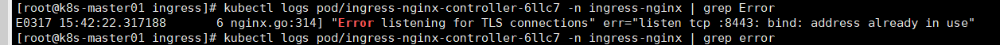
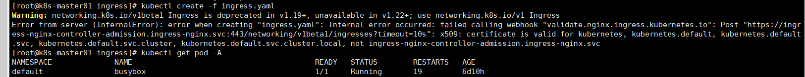
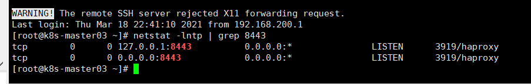
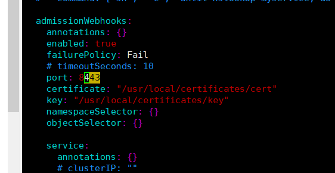
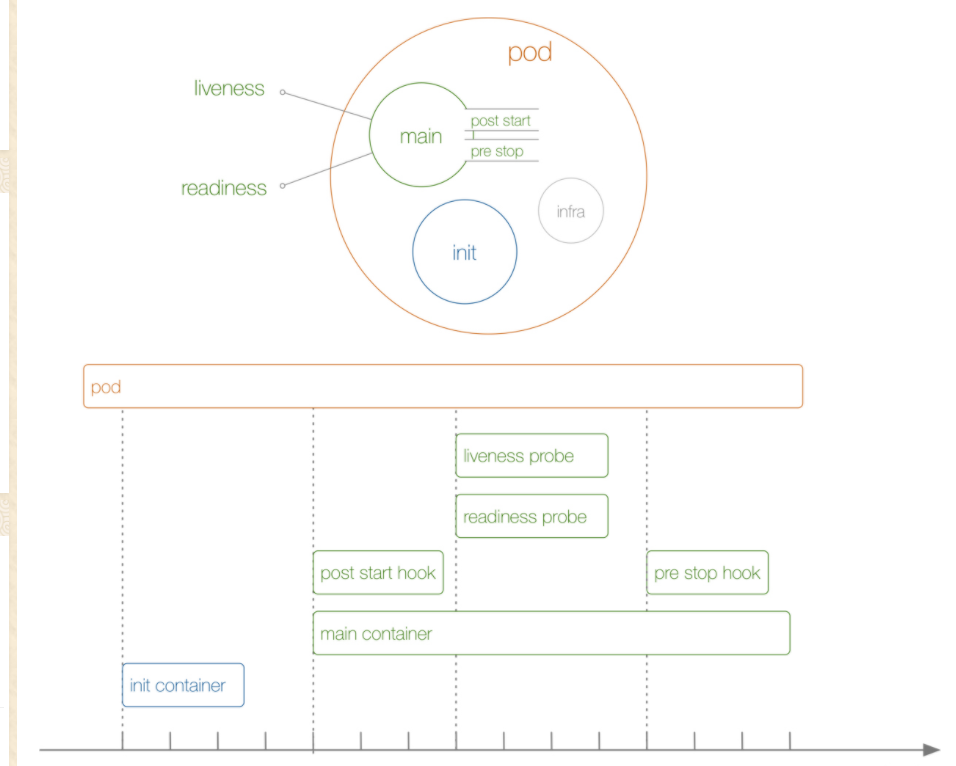
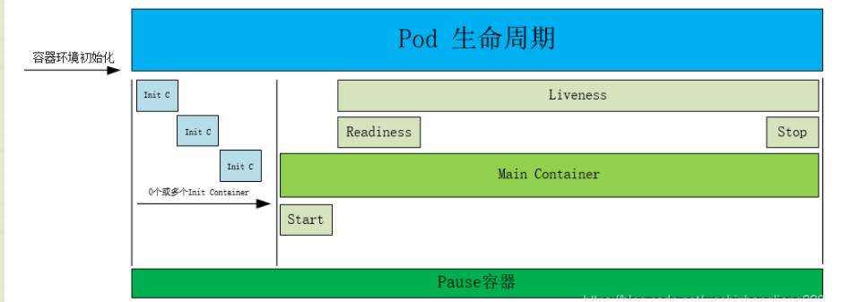

## 使用minikube 

minikube.exe start   --driver=docker   --alsologtostderr    --image-mirror-country='cn'   --registry-mirror=https://registry.docker-cn.com --image-repository=registry.cn-hangzhou.aliyuncs.com/google_containers

 --registry-mirror=https://registry.docker-cn.com 

 minikube start --driver=hyperv 

1. 创建一个名为kubia的replicationController

kubectl run kubia --image=luksa/kubia --port=8080 -generator=run/v1

2. 为replicationController暴漏服务

kubectl expose rc kubia --type=LoadBalancer --name kubia-http

3. 查看服务等内容

   kubectl get/describe pod/node/service/rc

4. 暴露服务

   minikube service kubia-http
   
5. kubectl scale rc kubia --replicas=3

6. 查看pod的ip和对应的node
    kubectl get pods -o wide

7. 查看pod 的yaml文件
    kubectl get po kubia-j6pqv -o yaml

8. 查看pods的定义
    kubectl explain pods 

9. 创建pod
    kubectl create -f kubia-manual.yaml

10. 看日志
    kubectl logs kubia-manual -c 【容器】

11. 本地端口转发
    kubectl port-forward kubia-manual 8888:8080

12. 查看pod带有的标签
    kubectl get po --show-labels

13. 查看具体的某些标签
    kubectl get po -L createion_method,env

14. 修改pod的标签
    kubectl label po/node kubia-manual 【--overwrite】

15. 过滤标签得到pod
    kubectl get po -l 

16. 添加注解信息
    kubectl annotate pod kubia-manual mycompany.com/somannotation="foo bar"
    kubectl describe pod

17. 获得所有的命名空间
    kubectl get ns
    kubectl get po --namespace kube-system

19. 删除pod
    kubectl delete ns custom-namespace
    kubectl delete po [-l] kubia

20. 删除命名空间中几乎所有的资源
    kubectl delete all --all

21. 查看前一次容器的日志（一般用于容器重新创建）
    kubectl logs mypod --previous

22. 编辑yaml模板内容
    kubectl edit rc kubia

23. 删除rc但是不删除pod
    kubectl delete rc kubia --cascade=false

24. 进入pod执行命令
    kubectl exec kubia-9ml2v  -- curl -s http://10.96.138.237

25. 进入容器的内部
    kubectl exec -it kubia-jnxzb  bash

26. headless和stafulset的结合作用

    能够发现集群的pod准确ip
    
27. 获取所有的命名空间下的pod
      kubectl get pod --all-namespaces【 kubectl get pod -A】
      -n kube-system
    
27. -o yaml模式

28. 创建configmaping命令

     kubectl create configmap fortune-config --from-literal=sleep-interval=25 --from-literal=sleepl=sleep

     --from-file=（文件夹或者文件）


	kubectl create -f *.yaml 创建一个资源
	kubectl replace -f *.yaml 替换一个资源
	kubectl apply -f *.yaml 如果没有则创建，如果有则替换
	kubectl edit 
	kubectl los -f pod
	kubectl create deployment nginx --image=nginx:1.15.2
### 基础概念篇
#### Master节点
几个主要组件
1. API Server 集群控制的中枢，唯一一个和etcd交互的，各个组件通过API Server来进行交互，包含了鉴权等内容
2. Controller Manager 集群状态管理器，控制面板，控制pod的状态数量 等内容
3. Scheduler调度器，调度pod到哪个node上，根据策略选择
4. Etcd 键值存储高性能 在ssd硬盘上能体现较好的优势

#### Node节点
1. kubectl ，上报node和pod的状态信息
2. kubectl proxy 负责Pod之间的通信和负载均衡，将指定的流量分发到后端正确的机器上。
    - 查看Kube-proxy工作模式：curl 127.0.0.1:10249/proxyMode
    - Ipvs：监听Master节点增加和删除service以及endpoint的消息，调用Netlink接口创建相应的IPVS规则。通过IPVS规则，将流量转发至相应的Pod上。
    - Iptables：监听Master节点增加和删除service以及endpoint的消息，对于每一个Service，他都会场景一个iptables规则，将service的clusterIP代理到后端对应的Pod。
其他组件
 - Calico：符合CNI标准的网络插件，给每个Pod生成一个唯一的IP地址，并且把每个节点当做一个路由器。Cilium
- CoreDNS：用于Kubernetes集群内部Service的解析，可以让Pod把Service名称解析成IP地址，然后通过Service的IP地址进行连接到对应的应用上。
- Docker：容器引擎，负责对容器的管理。

#### POD
#####  定义一个POD
#####  POD的探针
- StartupProbe：k8s1.16版本后新加的探测方式，用于判断容器内应用程序是否已经启动。如果配置了startupProbe，就会先禁止其他的探测，直到它成功为止，成功后将不在进行探测。
- LivenessProbe：用于探测容器是否运行，如果探测失败，kubelet会根据配置的重启策略进行相应的处理。若没有配置该探针，默认就是success。
- ReadinessProbe：一般用于探测容器内的程序是否健康，它的返回值如果为success，那么久代表这个容器已经完成启动，并且程序已经是可以接受流量的状态。
##### 探针的检测方式
- ExecAction：在容器内执行一个命令，如果返回值为0，则认为容器健康。
- TCPSocketAction：通过TCP连接检查容器内的端口是否是通的，如果是通的就认为容器健康。
- HTTPGetAction：通过应用程序暴露的API地址来检查程序是否是正常的，如果状态码为200~400之间，则认为容器健康。

### 资源管理
#### Deployment
1. 基础概念
2. 更新操作
	改动到spec.template才会生成一个新的rs
	- 更新新的镜像操作
		kubectl set image deploy nginx-dep nginx=nginx:1.15.4 --record
		如果新的镜像不行 则不会进行更新 要看配置的程度
	- 查看更新的状态
		kubectl rollout status deploy nginx-dep 或者 descirbe 
	- 查看所有的历史jilu
		kubectl rollout history deploy nginx-dep
3. 回滚操作
	- 回滚操作
		[root@k8s-master01 ~]# # 回滚到上一个版本
		[root@k8s-master01 ~]# kubectl rollout undo deploy nginx 
    - 查看版本详细信息
       [root@k8s-master01 ~]# # 查看指定版本的详细信息
       [root@k8s-master01 ~]# kubectl rollout history deploy nginx --revision=5
    - 回滚到指定版本 
       kubectl rollout undo deploy nginx --to-revision=5
4. 扩容镜像
    kubectl scale deploy nginx-dep --replicas=3 
5. 暂停和恢复
	- 暂停功能 针对set指令 用replace 和edit 
		[root@k8s-master01 ~]# # Deployment 暂停功能
		[root@k8s-master01 ~]# kubectl rollout pause deployment nginx 
		kubectl set resources deploy nginx  -c nginx --limits=cpu=100m,memory=100Mi --requests=cpu=50m,memory=56Mi
	- 回复功能
	kubectl rollout resume deploy nginx 
6. 注意的参数
- spec.revisionHistoryLimit：设置保留RS旧的revision的个数，设置为0的话，不保留历史数据
- spec.minReadySeconds：可选参数，指定新创建的Pod在没有任何容器崩溃的情况下视为Ready最小的秒数，默认为0，即一旦被创建就视为可用。
- 滚动更新的策略：
	- spec.strategy.type：更新deployment的方式，默认是RollingUpdate
	- RollingUpdate：默认滚动更新，可以指定maxSurge和maxUnavailable
		- maxUnavailable：指定在回滚或更新时最大不可用的Pod的数量，可选字段，默认25%，可以设置成数字或百分比，如果该值为0，那么maxSurge就不能0
		- maxSurge：可以超过期望值的最大Pod数，可选字段，默认为25%，可以设置成数字或百分比，如果该值为0，那么maxUnavailable不能为0
	- Recreate：重建，先删除旧的Pod，在创建新的Pod
#### StatefulSet
1. 常用于部署有状态的且需要有序启动的应用程序，启动是一个个启动，前面还没启动好不会往后处理
2. 删除一个StatefulSet时，不保证对Pod的终止，要在StatefulSet中实现Pod的有序和正常终止，可以在删除之前将StatefulSet的副本缩减为0。
3. 定义一个sts
4. 扩容一个sts kubectl scale sts web --replicas=3
5. 执行容器内部内容 kubectl exec -it busybox -- sh
6. 查看某个pod/service的地址 nslookup web-1.nginx 
	service会返回所有的pod内容
	/ # nslookup web-1.nginx
    Server:    10.96.0.10
    Address 1: 10.96.0.10 kube-dns.kube-system.svc.cluster.local

    Name:      web-1.nginx
    Address 1: 172.18.195.9 web-1.nginx.default.svc.cluster.local
    / # nslookup nginx
    Server:    10.96.0.10
    Address 1: 10.96.0.10 kube-dns.kube-system.svc.cluster.local

    Name:      nginx
    Address 1: 172.25.244.202 web-2.nginx.default.svc.cluster.local
    Address 2: 172.18.195.9 web-1.nginx.default.svc.cluster.local
    Address 3: 172.25.244.201 web-0.nginx.default.svc.cluster.local
7 -w是一个watch状态
8. 更新的策略，
	- RollingUpdate	，从数量大的往上更新，更新过程中如果0挂掉 要先启动0在进行更新
		大于partition数字的才更新
	- Ondelete  删除时候才更新 ，可以用于灰度更新
#### DaemonSet

1. 和nodeselector来配合使用

#### label内容
1. 可以给任务资源打上标签 kubectl label node k8s-node01 nginx=v2
2. 删除标签 kubectl label node  k8s-node01 nginx-
3. 覆盖标签 kubectl label node  k8s-node01 nginx=v3 --overwrite
4. 给pod选择对应的资源 nodeSelector nginx: v3   spec节点同级。

#### sevice内容
1. 创建一个service内部，selector port 自己暴漏的和targetpod
2. 注意观察service 的ep内容， 以及ipvsadmin 和route 的内容了解他怎么转发的
3. 使用Service代理k8s外部应用 ，不用selector 然后在自己创建ep来进行映射 name和labels要对应上，在进行替换
4. service的类型
	- ClusterIP：在集群内部使用，也是默认值。
	
   - ExternalName：通过返回定义的CNAME别名。
   
    - NodePort：在所有安装了kube-proxy的节点上打开一个端口，此端口可以代理至后端Pod，然后集群外部可以使用节点的IP地址和NodePort的端口号访问到集群Pod的服务。NodePort端口范围默认是30000-32767。指定一个NodePort，NodePort的效率比较慢
   
    - LoadBalancer：使用云提供商的负载均衡器公开服务。
   
#### ingress内容

是否有区分命名空间：有

1. 用helm来创建一个ingress修改里面的配置

2. 需要rewrite和不需要rewrite的要分开下

3. ingress最好使用hostNetWork的方式，这样在主机上直接暴露这个端口，不用使用kubectl-proxy进行代理，效率会高

4. 要利用好logs命令 kubectl log pod 2222 

   

   





####  Horizontal Pod Autoscaler：Pod的水平自动伸缩器。
	观察Pod的CPU、内存使用率自动扩展或缩容Pod的数量。
	不适用于无法缩放的对象，比如DaemonSet。
	支持CPU、内存（少用，内存大扩容也没用）跟request来进行比较
	自定义指标的扩缩容（业务暴漏接口来进行扩容弄个）。
要求必须定义 Requests参数，必须安装metrics-server。
kubectl get hpa
kubectl autoscale deploy nginx  --cpu-percent=20 --min=3  --max=5

while true; do wget -q -o- http:// > /dev/null ; done

### ConfigMap
允许你将配置文件与镜像文件分离，以使容器化的应用程序具有可移植性，也有命名空间
#### 基于目录创建 ConfigMap 
kubectl 识别目录下基本名可以作为合法键名的 文件，并将这些文件打包到新的 ConfigMap 中。普通文件之外的所有目录项都会被 忽略（例如，子目录、符号链接、设备、管道等等）。
kubectl create configmap game-config --from-file=configure-pod-container/configmap/
#### 基于文件创建 ConfigMap 
kubectl create configmap game-config-2 --from-file=configure-pod-container/configmap/game.properties
#### 选项从环境文件创建 ConfigMap
    Env 文件中的每一行必须为 VAR=VAL 格式。
    以＃开头的行（即注释）将被忽略。
    空行将被忽略。
    引号不会被特殊处理（即它们将成为 ConfigMap 值的一部分）。
kubectl create configmap game-config-env-file \
       --from-env-file=configure-pod-container/configmap/game-env-file.properties

#### 自定义key创建configMap
kubectl create configmap game-config-3 --from-file=<my-key-name>=<path-to-file>
#### 容器和configMap的使用
1. 单个 ConfigMap 中的数据定义容器环境变量

```yaml
      env:
        # Define the environment variable
        - name: SPECIAL_LEVEL_KEY
          valueFrom:
            configMapKeyRef:
              # The ConfigMap containing the value you want to assign to SPECIAL_LEVEL_KEY
              name: special-config
              # Specify the key associated with the value
              key: special.how
```

2. ConfigMap 中的所有键值对配置为容器环境变量

   ```yaml
   spec:
     containers:
       - name: test-container
         image: k8s.gcr.io/busybox
         command: [ "/bin/sh", "-c", "env" ]
         envFrom:
         - configMapRef:
             name: special-config
     restartPolicy: Never
   ```

3. POD命令中使用环境变量

   ```yaml
     containers:
       - name: test-container
         image: k8s.gcr.io/busybox
         command: [ "/bin/sh", "-c", "echo $(SPECIAL_LEVEL_KEY) $(SPECIAL_TYPE_KEY)" ]
         env:
           - name: SPECIAL_LEVEL_KEY
             valueFrom:
               configMapKeyRef:
                 name: special-config
                 key: SPECIAL_LEVEL
           - name: SPECIAL_TYPE_KEY
             valueFrom:
               configMapKeyRef:
                 name: special-config
                 key: SPECIAL_TYPE
     restartPolicy: Never
   ```

4. 将 ConfigMap 数据添加到一个卷中

   ```yaml
   apiVersion: v1
   kind: Pod
   metadata:
     name: dapi-test-pod
   spec:
     containers:
       - name: test-container
         image: k8s.gcr.io/busybox
         command: [ "/bin/sh", "-c", "ls /etc/config/" ]
         volumeMounts:
         - name: config-volume
           mountPath: /etc/config
     volumes:
       - name: config-volume
         configMap:
           # Provide the name of the ConfigMap containing the files you want
           # to add to the container
           name: special-config
     restartPolicy: Never
   ```

展示出来的在目录上就是一个个文件里面包含了内容

5. 将 ConfigMap 数据特定文件添加到数据卷中的特定路径

   ```yaml
   apiVersion: v1
   kind: Pod
   metadata:
     name: dapi-test-pod
   spec:
     containers:
       - name: test-container
         image: k8s.gcr.io/busybox
         command: [ "/bin/sh","-c","cat /etc/config/keys" ]
         volumeMounts:
         - name: config-volume
           mountPath: /etc/config
     volumes:
       - name: config-volume
         configMap:
           name: special-config
           items:
           - key: SPECIAL_LEVEL
             path: keys
     restartPolicy: Never
   ```

6. 将 ConfigMap 数据特定文件添加到数据卷中的特定文件（只挂载一个）

   ​    volumeMounts:

   ​    \- name: nginx-config-volume

   ​     mountPath: /etc/nginx/nginx.conf

   ​     subPath: etc/nginx/nginx.conf

      volumes:

   ​    \- name: nginx-config-volume

   ​     configMap:

   ​      name: nginx-conf

   ​      items:

   ​      \- key: nginx.conf

   ​       path: etc/nginx/nginx.conf

### Secret

#### 创建secret

请注意，特殊字符（例如：`$`，`\`，`*`，`=` 和 `!`）由你的 [shell](https://en.wikipedia.org/wiki/Shell_(computing)) 解释执行，而且需要转义。 在大多数 shell 中，转义密码最简便的方法是用单引号括起来。

```shell
kubectl create secret generic dev-db-secret \
  --from-literal=username=devuser \
  --from-literal=password='S!B\*d$zDsb='
```

```shell
kubectl create secret generic db-user-pass --from-file=./username.txt 
```

用describe不会显示具体的内容需要-oyaml才会显示

kubectl get secret db-user-pass -oyaml

解码操作echo 'MWYyZDFlMmU2N2Rm' | base64 --decode

#### 环境变量引用secret

```yaml
spec:
  containers:
  - name: envars-test-container
    image: nginx
    env:
    - name: SECRET_USERNAME
      valueFrom:
        secretKeyRef:
          name: backend-user
          key: backend-username
```

#### 挂载volume

```yaml
apiVersion: v1
kind: Pod
metadata:
  name: secret-test-pod
spec:
  containers:
    - name: test-container
      image: nginx
      volumeMounts:
        # name must match the volume name below
        - name: secret-volume
          mountPath: /etc/secret-volume
  # The secret data is exposed to Containers in the Pod through a Volume.
  volumes:
    - name: secret-volume
      secret:
        secretName: test-secret
```

### 热更新configmap和secret

热更新ConfigMap或Secret：
[root@k8s-master01 ~]# kubectl create cm nginx-conf --from-file=nginx.conf --dry-run -oyaml  | kubectl replace -f-

subpath的内容无法被更新上

### Volumes处理
用于共享数据，和持久化存储的内容
#### emptyDir Volumes
容器摧毁后就没有了 用于两个容器间共享数据，还有像fileBeat这种来收集日志处理
#### HostPath
把节点上的文件目录挂载到pod上。
#### Nfs

yum install nfs-utils -y

df -Th 查看磁盘挂载内容
生产上不建议使用，不是高可靠建议使用nas平台兼容nfs挂载数据共享

#### PV方式

kubectl get pv,pvc

PV是没有命名空间的 PVC有命名空间

storageclass和accessMode要相同

pv和pvc也有标签，可以storageclass一样通过标签来匹配。

### 高级调度使用
#### cronjob
cronjob 对于高时间要求的 注意拉取镜像需要时间，使用的是controller-manager时间，如果在容器里面要保证容器的时间一致。名字不能超过52个字符
部分内容说明
concurrencyPolicy：是否允许并发调度执行，Allow（如果上个任务还没执行完成，时间到了开始一个新的任务）、Forbid（等待沙工任务执行完成）、replace（替换上一个任务）
suspend（是否挂起）
#### 容忍和污点
和label有点类型比label强大，可以符合和不符合都处理，当节点上有污点时候，允许pod能容忍的 时间，经常比如说节点挂了，集群会给节点打上污点，pod允许容忍多少分钟在这个节点上。
节点不正常，磁盘不够等等 
#### initContainer内容
比post好用，post不一定在entry前执行完成，initcontainer保证。我们知道一个Pod里面的所有容器是共享数据卷和网络命名空间的，所以Init Container里面产生的数据可以被主容器使用到的，按照顺序完成init container的内容完成后退出继续后面的init

initContainer添加内核配置？
#### Affinity亲和力
包含了nodeselector所有功能，还有容器亲和力更强大。

nodeselector和亲和力都配置的话,要求都要满足才行.  

 部署在同一个拓扑域（节点上label的标签算是一个拓扑域，因为各个的值不同又是各个的拓扑域），算法比较耗资源 按需来配置

#### RBAC内容


#### 临时容器
看下功能是否已经开启 kubectl -h | grep
在线上的pod注入一个容器要求打开共享的空间登内容

### 常见问题

1. 网络具体如何通信，如何查看
查看ipvs的转发规则（linux 命令）
	nestat -lntp 学会看显示内容的含义
	ipvsadmin -ln  配置了服务到pod 的转发内容
	route -n    配置pod到到具体物理机的路由关系
	vim set paste的作用
	
2. pod的生命周期内容
Kubernetes 在容器创建后立即发送 postStart 事件。 然而，postStart 处理函数的调用**不保证早于**容器的入口点（entrypoint） 的执行。postStart 处理函数与容器的代码是异步执行的，但 Kubernetes 的容器管理逻辑会一直阻塞等待 postStart 处理函数执行完毕。 只有 postStart 处理函数执行完毕，容器的状态才会变成 RUNNING。

3. 提示启动命令异常的一定要按照规范编写

   https://blog.csdn.net/qq_33448670/article/details/80004950 
   
4. 同一个pod 里面挂多个容器时候不能用相同的端口

5. 当 出现 一般就是命令问题，命令要使用 sh -c 这种方式处理

6. pod的一个生命周期图

   

