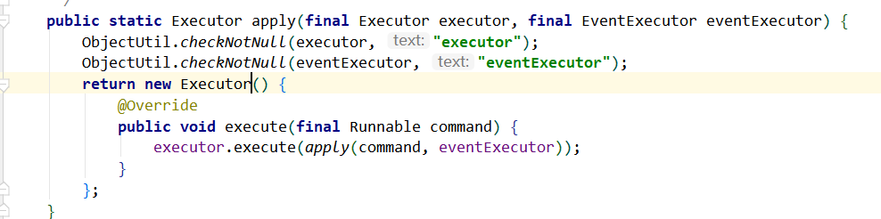
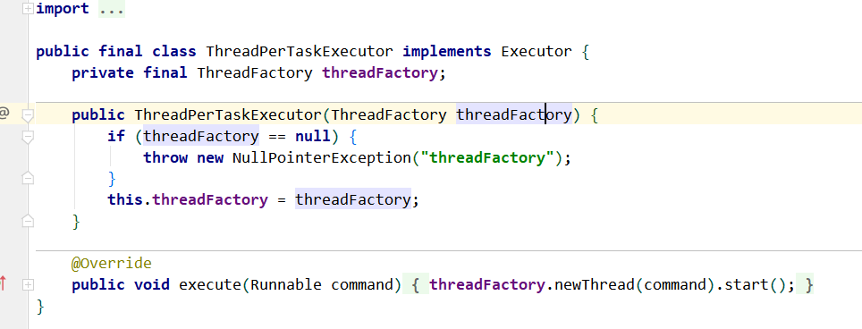

## 整体流程：
### 服务端启动流程分析 ：
####  创建服务端Channel
1. 创建NioServerSocketChannel；里面包含了ServerSocketChannel，且设置为非阻塞；对应的还配置的NioServerSocketChannelConfig（设置了socket），设置了channel的id，channelPipleLine，unSafe（真正的底层传输数据内容，实例是NioMessageUnsafe）
2. 初始化channel；把前面设置在serverBootStrap的option和attr设置到channel的config上，
在PipleLine上增加一个handler，该handler 设置了所有子内容（在ServerbootStrap）上的。
3. 注册Channel到Selector；在父的NioEventGroupLoop上把channel注册到selector，把**选到的NioEventLoop和channel做绑定关系**
4. 绑定端口
####  NioEventLoopGroup
1. NioEventLoopGroup 的创建；默认核心数*2的线程数、包含一个executor，实例是**ThreadPerTaskExecutor**，children里面包含了n个EventExecutor（实例是NioEventLoop），创建n个NioEventLoop，里面也有executor，这个executr的实例是父group的executor进行execute的，

   
   里面还有MPSC队列，也创建了selector。NioEventLoopGroup继续创建了选择子Loop的选择器，

2. ThreadPerTaskExecutor；
3. 向NioEventLoop 添加任务；找到channel绑定的nioeventLoop进行excute，把任务添加到MPSC中，execute会先判断当前线程是否是nioeventLoop的线程，不是开启线程（原子变量判断只能开启一次，）
4. nioeventLoop添加任务时候startThread，执行nioeventLoop的excutor进行excute事件处理，其实真正处理的就是ThreadPerTaskExecutor进行excute，里面的runnable是一直在重复执行MPSC任务队列。


疑问NioServerSocketChannelConfig上的socket 有什么作用，看到在设置option时候会把SO_BACKLOG、SO_RCVBUF等设置到里面去（io.netty.bootstrap.AbstractBootstrap#setChannelOption）；

### 启动流程分析 ：

####


### 源码分析

#### NioEventLoopGroup
##### 继承体系：

(asserts/image-20200917123646503.png)

##### New:

1. 输入线程数否则默认是cpu核心数，创建EventExecutor数组保存NioEventLoop实例数据，默认创建了ThreadPerTaskExecutor继承Executor
2. 

##### 主要方法：

#### NioEventLoop

属性：

```
addTaskWakesUp
```

##### 从NioEventLoopGroup上创建：

 	1. parent 属性指向NioEventLoopGroup创建的实例
 	2. 在SingleThreadEventExecutor创建了addTaskWakesUp、maxPendingTasks，RejectedExecutionHandler、taskQueue(LinkedBlockingQueue)
 	3. 在SingleThreadEventExecutor上创建了Executor，从NioEventLoopGroup带下来的ThreadPerTaskExecutor进行封装，在每个任务执行的时候设置当前NioEventLoop数据。
 	4. 在SingleThreadEventLoop创建了tailTasks(LinkedBlockingQueue) 什么用呢
 	5. 保存provider来源NioEventLoopGroup， selector、unwrappedSelector、 selectStrategy作用io.netty.channel.nio.NioEventLoop#NioEventLoop？
 	6. 


ThreadPerTaskExecutor



疑问怎么没有用线程池去管线程

ThreadFactory是来自于DefaultThreadFactory，

##### 主要方法：

#### ServerBootstrap
##### channel
把NioServerSocketChannel.class赋值进去
##### option:
##### handler
##### childOption
##### childHandler
##### attr
##### childAttr
##### bind
1. initAndRegister 初始化；初始化NioServerSocketChannel，把option和attr设置到初始化NioServerSocketChannel.channelConfig中
##### initAndRegister
1. 新建NioServerSocketChannel

#### NioServerSocketChannel
##### 初始化：
1. SelectorProvider打开ServerSocketChannel，新增NioServerSocketChannelConfig

#### NioServerSocketChannelConfig
关联了ServerSocketChannel和socket


Tuple 元组