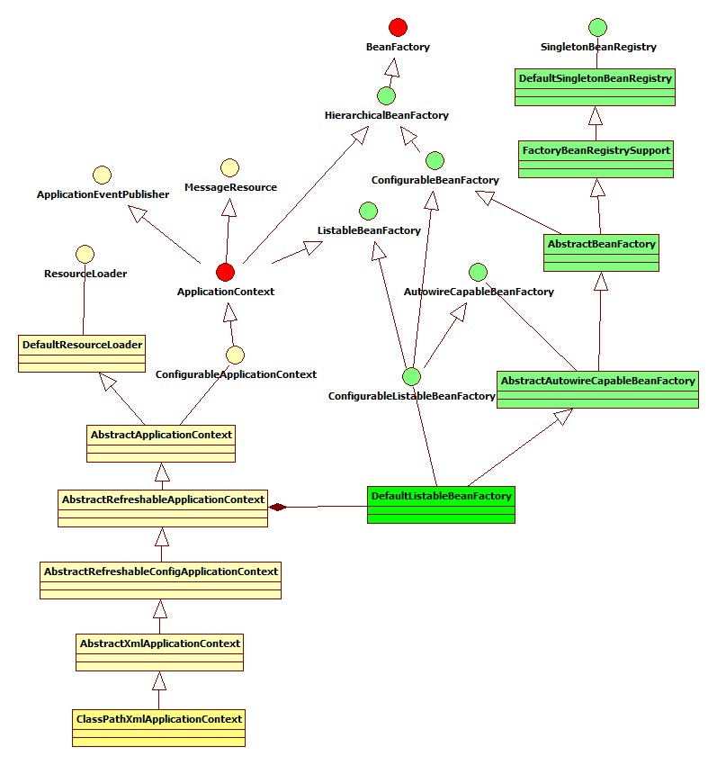
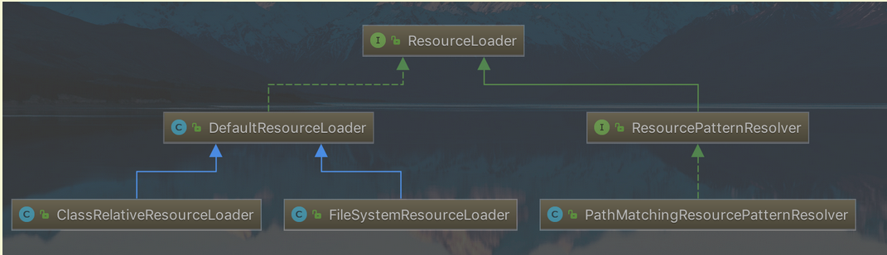
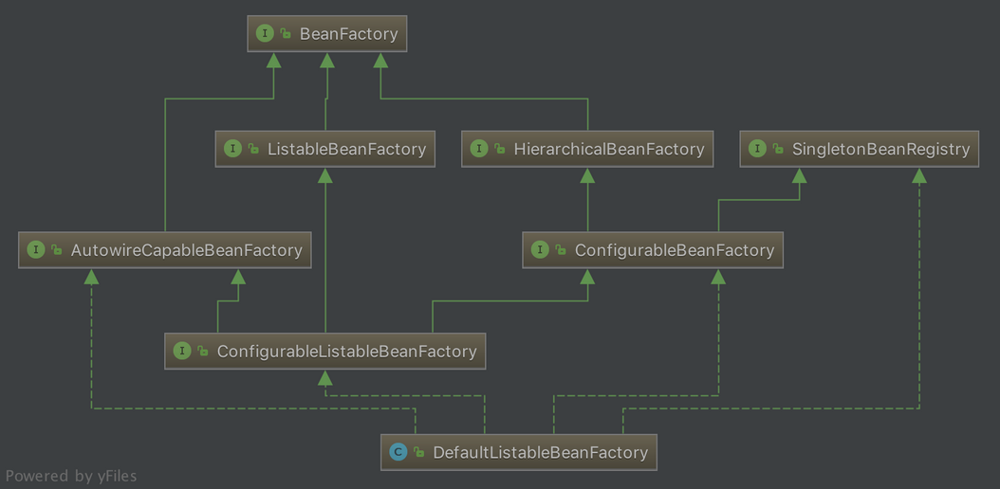
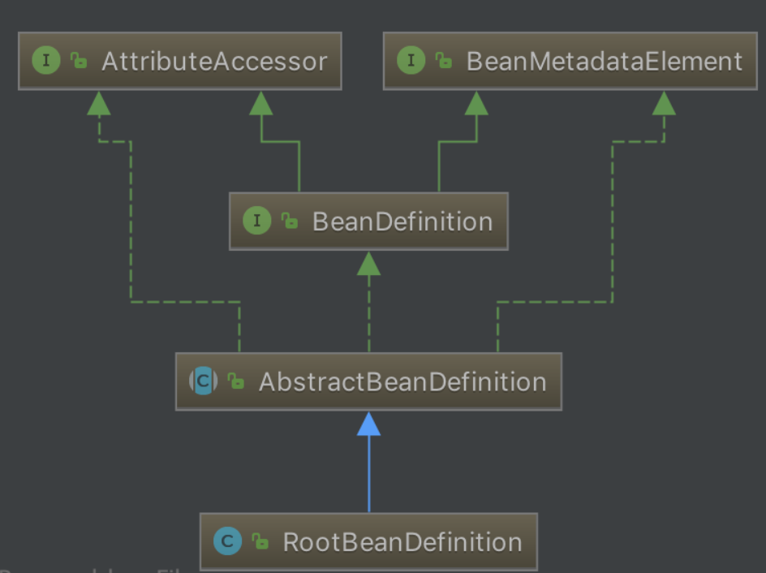
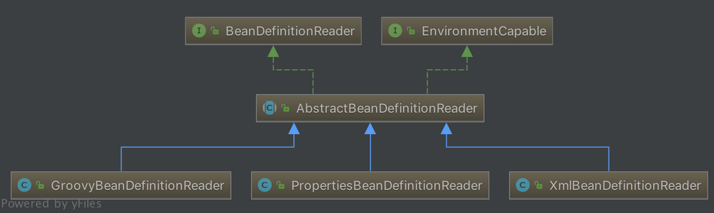
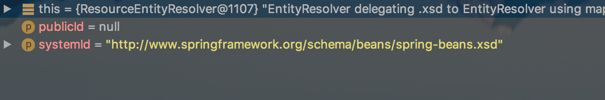
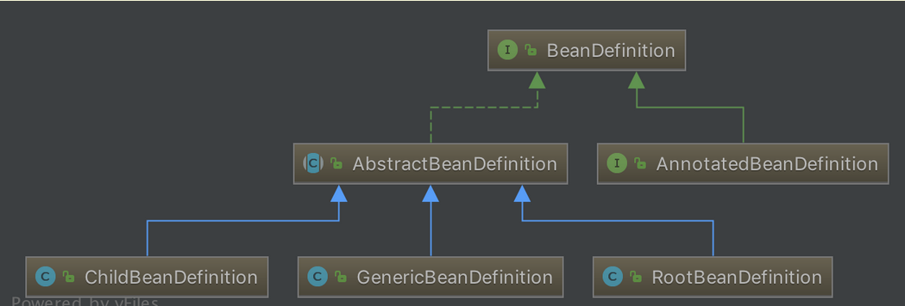

# 死磕Spring

## 一、深入理解IOC

### 1. IOC理论

解释控制反转内容：

- **谁控制谁：**传统模式直接new对象，我直接控制对象，有了IOC后直接由IOC容器提供，IOC容器控制了对象

- **为何反转：**直接new是正转，到IOC后变从原本的主动到被动接受

### 2. 各个组件

ClassPathXmlApplicationContext 的类继承体系结构，虽然只有一部分，但是它基本上包含了 IoC 体系中大部分的核心类和接口。



#### 2.1 Resource体系

`org.springframework.core.io.Resource`，对资源的抽象。它的每一个实现类都代表了一种资源的访问策略，如 ClassPathResource、RLResource、FileSystemResource  等。


##### 2.1.1 ResourceLoader 体系
有了资源，就应该有资源加载，Spring 利用 org.springframework.core.io.ResourceLoader 来进行统一资源加载，类图如下：



#### 2.2 BeanFactory 体系
org.springframework.beans.factory.BeanFactory，是一个非常纯粹的 bean 容器，它是 IoC 必备的数据结构，其中 BeanDefinition 是它的基本结构。BeanFactory 内部维护着一个BeanDefinition map ，并可根据 BeanDefinition 的描述进行 bean 的创建和管理。



- BeanFactory 有三个直接子类 ListableBeanFactory、HierarchicalBeanFactory 和 AutowireCapableBeanFactory 。
- DefaultListableBeanFactory 为最终默认实现，它实现了所有接口。


#### 2.3 BeanDefinition 体系
org.springframework.beans.factory.config.BeanDefinition ，用来描述 Spring 中的 Bean 对象。



#### 2.4 BeanDefinitionReader 体系
org.springframework.beans.factory.support.BeanDefinitionReader 的作用是读取 Spring 的配置文件的内容，并将其转换成 Ioc 容器内部的数据结构 ：BeanDefinition 。



#### 2.5 ApplicationContext 体系
org.springframework.context.ApplicationContext ，这个就是大名鼎鼎的 Spring 容器，它叫做应用上下文，与我们应用息息相关。它**继承** BeanFactory ，所以它是 BeanFactory 的扩展升级版，如果BeanFactory 是屌丝的话，那么 ApplicationContext 则是名副其实的高富帅。由于 ApplicationContext 的结构就决定了它与 BeanFactory 的不同，其主要区别有：

    继承 org.springframework.context.MessageSource 接口，提供国际化的标准访问策略。
    继承 org.springframework.context.ApplicationEventPublisher 接口，提供强大的事件机制。
    扩展 ResourceLoader ，可以用来加载多种 Resource ，可以灵活访问不同的资源。
    对 Web 应用的支持。


## 二、Spring 统一资源加载策略

1. 职能划分清楚。资源的定义和资源的加载应该要有一个清晰的**界限**；
2. 统一的抽象。统一的资源**定义**和资源加载**策略**。资源加载后要返回统一的抽象给客户端，客户端要对资源进行怎样的处理，应该由抽象资源接口来界定。

### 1. 统一资源：Resource

`org.springframework.core.io.Resource` 为 Spring 框架所有资源的抽象和访问接口，它继承 `org.springframework.core.io.InputStreamSource`接口。作为所有资源的统一抽象，Resource 定义了一些通用的方法，由子类 `AbstractResource` 提供统一的默认实现。具体看源码的Resource 内容。

#### 1.1 类结构


从上图可以看到，Resource 根据资源的不同类型提供不同的具体实现，如下：

- FileSystemResource ：对 `java.io.File` 类型资源的封装，只要是跟 File  打交道的，基本上与 FileSystemResource 也可以打交道。支持文件和 URL 的形式，实现 WritableResource  接口，且从 Spring Framework 5.0 开始，FileSystemResource 使用 NIO2 API进行读/写交互。
- ByteArrayResource ：对字节数组提供的数据的封装。如果通过 InputStream 形式访问该类型的资源，该实现会根据字节数组的数据构造一个相应的 ByteArrayInputStream。
- UrlResource ：对 `java.net.URL`类型资源的封装。内部委派 URL 进行具体的资源操作。
- ClassPathResource ：class path 类型资源的实现。使用给定的 ClassLoader 或者给定的 Class 来加载资源。
- InputStreamResource ：将给定的 InputStream 作为一种资源的 Resource 的实现类。

#### 1.2 AbstractResource

`org.springframework.core.io.AbstractResource` ，为 Resource 接口的默认**抽象**实现。它实现了 Resource 接口的**大部分的公共实现**，作为 Resource 接口中的重中之重，其定义查看源码内容

如果我们想要实现自定义的 Resource ，记住不要实现 Resource 接口，而应该继承 AbstractResource 抽象类，然后根据当前的具体资源特性覆盖相应的方法即可。

#### 1.3 其他子类

Resource 的子类，例如 FileSystemResource、ByteArrayResource 、ClassPathResource等等的代码非常简单。感兴趣的胖友，自己去研究。

### 2. 统一资源定位：ResourceLoader

`org.springframework.core.io.ResourceLoader` 为 Spring 资源加载的统一抽象，具体的资源加载则由相应的实现类来完成，所以我们可以将 ResourceLoader 称作为统一资源定位器。其定义如下：ResourceLoader，定义资源加载器，主要应用于根据给定的资源文件地址，返回对应的 Resource 。

```java
public interface ResourceLoader {

	String CLASSPATH_URL_PREFIX = ResourceUtils.CLASSPATH_URL_PREFIX; // CLASSPATH URL 前缀。默认为："classpath:"
    /**
    根据所提供资源的路径 location 返回 Resource 实例，但是它不确保该 Resource 一定存在，需要调用 Resource#exist() 方法来判断。
    该方法支持以下模式的资源加载：
        URL位置资源，如 "file:C:/test.dat" 。
        ClassPath位置资源，如 "classpath:test.dat 。
        相对路径资源，如 "WEB-INF/test.dat" ，此时返回的Resource 实例，根据实现不同而不同。
    该方法的主要实现是在其子类 DefaultResourceLoader 中实现，具体过程我们在分析 DefaultResourceLoader 时做详细说明。
    **/
	Resource getResource(String location);

	ClassLoader getClassLoader();

}
```

#### 2.1 子类结构


#### 2.2 DefaultResourceLoader

与 AbstractResource 相似，`org.springframework.core.io.DefaultResourceLoader` 是 ResourceLoader 的默认实现。

##### 2.2.1 构造函数

##### 2.2.2 getResource方法

ResourceLoader 中最核心的方法为 `#getResource(String location)` ，它根据提供的 location 返回相应的 Resource 。而 DefaultResourceLoader 对该方法提供了**核心实现**（因为，它的两个子类都没有提供覆盖该方法，所以可以断定 ResourceLoader 的资源加载策略就封装在 DefaultResourceLoader 中)，详情看源码内容

返回ClassPathContextResource或者FileUrlResource或者UrlResource或者ClassPathResource

每个其实最大的区别就在于读取文件的内容 getInputStream

##### 2.2.3 ProtocolResolver

`org.springframework.core.io.ProtocolResolver` ，用户自定义协议资源解决策略，作为 DefaultResourceLoader 的 **SPI**：它允许用户自定义资源加载协议，而不需要继承 ResourceLoader 的子类。
在介绍 Resource 时，提到如果要实现自定义 Resource，我们只需要继承 AbstractResource 即可，有了  ProtocolResolver 后，我们不需要继承 DefaultResourceLoader，改为实现 ProtocolResolver 接口也可以实现自定义的 ResourceLoader。

ProtocolResolver 接口，仅有一个方法 `Resource resolve(String location, ResourceLoader resourceLoader)` 。

在 Spring 中你会发现该接口并没有实现类，它需要用户自定义，自定义的 Resolver 如何加入 Spring 体系呢？调用 `DefaultResourceLoader#addProtocolResolver(ProtocolResolver)` 方法即可。


#### 2.3 FileSystemResourceLoader

我们看到，其实 DefaultResourceLoader 对`#getResourceByPath(String)` 方法处理其实不是很恰当，这个时候我们可以使用 `org.springframework.core.io.FileSystemResourceLoader` 。它继承 DefaultResourceLoader ，且覆写了 `#getResourceByPath(String)` 方法，该方法在default的getResource时候有d，使之从文件系统加载资源并以 FileSystemResource 类型返回，这样我们就可以得到想要的资源类型。代码如下：

```java
@Override
protected Resource getResourceByPath(String path) {
	// 截取首 /
	if (path.startsWith("/")) {
		path = path.substring(1);
	}
	// 创建 FileSystemContextResource 类型的资源
	return new FileSystemContextResource(path);
}
```

##### 2.3.1 FileSystemContextResource
FileSystemContextResource ，为 FileSystemResourceLoader 的内部类，它继承 FileSystemResource 类，实现 ContextResource 接口。代码如下：

```java
/**
 * FileSystemResource that explicitly expresses a context-relative path
 * through implementing the ContextResource interface.
 */
private static class FileSystemContextResource extends FileSystemResource implements ContextResource {

	public FileSystemContextResource(String path) {
		super(path);
	}

	@Override
	public String getPathWithinContext() {
		return getPath();
	}
}
```

- 在构造器中，也是调用 FileSystemResource 的构造函数来构造 FileSystemResource 的。
- 为什么要有 FileSystemContextResource 类的原因是，实现 ContextResource 接口，并实现对应的 `#getPathWithinContext()` 接口方法。

#### 2.4 ClassRelativeResourceLoader

`org.springframework.core.io.ClassRelativeResourceLoader` ，是 DefaultResourceLoader 的另一个子类的实现。和 FileSystemResourceLoader 类似，在实现代码的结构上类似，也是覆写 `#getResourceByPath(String path)` 方法，并返回其对应的 ClassRelativeContextResource 的资源类型。

ClassRelativeResourceLoader 扩展的功能是，可以根据给定的`class` 所在包或者所在包的子包下加载资源。

```java
@RequestMapping(value="/index.html")
	public String loginPage() throws IOException {
		ResourceLoader resourceLoader=new ClassRelativeResourceLoader(this.getClass());
        // test.xml是本类下的，如果使用/test.xml采用绝对路劲查找方式
        // 实际上是jdk自有的内容 java.lang.Class#resolveName协助查找的
		Resource resource=resourceLoader.getResource("test.xml");
		System.out.println(resource.getFile().getPath());
		return "index";
	}   
```

可以查看ClassRelativeResourceLoaderTest类

https://blog.csdn.net/seasonsbin/article/details/80914911

#### 2.5 ResourcePatternResolver
ResourceLoader 的 Resource getResource(String location) 方法，每次只能根据 location 返回一个 Resource 。当需要加载多个资源时，我们除了多次调用 #getResource(String location) 方法外，别无他法。org.springframework.core.io.support.ResourcePatternResolver 是 ResourceLoader 的扩展，它支持根据指定的资源路径匹配模式每次返回多个 Resource 实例，其定义如下：

```java
public interface ResourcePatternResolver extends ResourceLoader {

	String CLASSPATH_ALL_URL_PREFIX = "classpath*:";

	Resource[] getResources(String locationPattern) throws IOException;

}
```

- ResourcePatternResolver 在 ResourceLoader 的基础上增加了 `#getResources(String locationPattern)` 方法，以支持根据路径匹配模式返回**多个** Resource 实例。
- 同时，也新增了一种**新的协议**前缀 `"classpath*:"`，该协议前缀由其子类负责实现。

#### 2.6 PathMatchingResourcePatternResolver

`org.springframework.core.io.support.PathMatchingResourcePatternResolver` ，为 ResourcePatternResolver 最常用的子类，它除了支持 ResourceLoader 和 ResourcePatternResolver 新增的 `"classpath*:"` 前缀外，**还支持 Ant 风格的路径匹配模式**（类似于 `"**/*.xml"`）。

##### 2.6.1 构造函数

```java
/**
 * 内置的 ResourceLoader 资源定位器
 */
private final ResourceLoader resourceLoader;
/**
 * Ant 路径匹配器
 */
private PathMatcher pathMatcher = new AntPathMatcher();

public PathMatchingResourcePatternResolver() {
	this.resourceLoader = new DefaultResourceLoader();
}

public PathMatchingResourcePatternResolver(ResourceLoader resourceLoader) {
	Assert.notNull(resourceLoader, "ResourceLoader must not be null");
	this.resourceLoader = resourceLoader;
}

public PathMatchingResourcePatternResolver(@Nullable ClassLoader classLoader) {
	this.resourceLoader = new DefaultResourceLoader(classLoader);
}
```

- PathMatchingResourcePatternResolver 在实例化的时候，可以指定一个 ResourceLoader，如果不指定的话，它会在内部构造一个 DefaultResourceLoader 。
- `pathMatcher` 属性，默认为 AntPathMatcher 对象，用于支持 Ant 类型的路径匹配。

##### 2.6.2 getResource

```java
@Override
public Resource getResource(String location) {
	return getResourceLoader().getResource(location);
}

public ResourceLoader getResourceLoader() {
	return this.resourceLoader;
}
```

该方法，直接委托给相应的 ResourceLoader 来实现。所以，如果我们在实例化的  PathMatchingResourcePatternResolver 的时候，如果未指定 ResourceLoader  参数的情况下，那么在加载资源时，其实就是 DefaultResourceLoader 的过程。

其实在下面介绍的 `Resource[] getResources(String locationPattern)` 方法也相同，只不过返回的资源是**多个**而已。

```java
@Override
public Resource[] getResources(String locationPattern) throws IOException {
    Assert.notNull(locationPattern, "Location pattern must not be null");
    // 以 "classpath*:" 开头
    if (locationPattern.startsWith(CLASSPATH_ALL_URL_PREFIX)) {
        // 路径包含通配符
        // a class path resource (multiple resources for same name possible)
        if (getPathMatcher().isPattern(locationPattern.substring(CLASSPATH_ALL_URL_PREFIX.length()))) {
            // a class path resource pattern
            return findPathMatchingResources(locationPattern);
        // 路径不包含通配符
        } else {
            // all class path resources with the given name
            return findAllClassPathResources(locationPattern.substring(CLASSPATH_ALL_URL_PREFIX.length()));
        }
    // 不以 "classpath*:" 开头
    } else {
        // Generally only look for a pattern after a prefix here, // 通常只在这里的前缀后面查找模式
        // and on Tomcat only after the "*/" separator for its "war:" protocol. 而在 Tomcat 上只有在 “*/ ”分隔符之后才为其 “war:” 协议
        int prefixEnd = (locationPattern.startsWith("war:") ? locationPattern.indexOf("*/") + 1 :
                locationPattern.indexOf(':') + 1);
        // 路径包含通配符
        if (getPathMatcher().isPattern(locationPattern.substring(prefixEnd))) {
            // a file pattern
            return findPathMatchingResources(locationPattern);
        // 路径不包含通配符
        } else {
            // a single resource with the given name
            return new Resource[] {getResourceLoader().getResource(locationPattern)};
        }
    }
}
```

- **非** `"classpath*:"` 开头，且路径**不包含**通配符，直接委托给相应的 ResourceLoader 来实现。
- 其他情况，调用 `#findAllClassPathResources(...)`、或 `#findPathMatchingResources(...)` 方法，返回多个 Resource 。下面，我们来详细分析。

##### 2.6.3 findAllClassPathResources

当 `locationPattern` 以 `"classpath*:"` 开头但是不包含通配符，则调用 `#findAllClassPathResources(...)` 方法加载资源。该方法返回 classes 路径下和所有 jar 包中的所有相匹配的资源。

```java
protected Resource[] findAllClassPathResources(String location) throws IOException {
	String path = location;
	// 去除首个 /
	if (path.startsWith("/")) {
		path = path.substring(1);
	}
	// 真正执行加载所有 classpath 资源
	Set<Resource> result = doFindAllClassPathResources(path);
	if (logger.isTraceEnabled()) {
		logger.trace("Resolved classpath location [" + location + "] to resources " + result);
	}
	// 转换成 Resource 数组返回
	return result.toArray(new Resource[0]);
}
```

真正执行加载的是在 `#doFindAllClassPathResources(...)` 方法，代码如下：

```java
protected Set<Resource> doFindAllClassPathResources(String path) throws IOException {
	Set<Resource> result = new LinkedHashSet<>(16);
	ClassLoader cl = getClassLoader();
	// <1> 根据 ClassLoader 加载路径下的所有资源
	Enumeration<URL> resourceUrls = (cl != null ? cl.getResources(path) : ClassLoader.getSystemResources(path));
	// <2>
	while (resourceUrls.hasMoreElements()) {
		URL url = resourceUrls.nextElement();
		// 将 URL 转换成 UrlResource
		result.add(convertClassLoaderURL(url));
	}
	// <3> 加载路径下得所有 jar 包
	if ("".equals(path)) {
		// The above result is likely to be incomplete, i.e. only containing file system references.
		// We need to have pointers to each of the jar files on the classpath as well...
		addAllClassLoaderJarRoots(cl, result);
	}
	return result;
}
```

- <1> 处，根据 ClassLoader 加载路径下的所有资源。在加载资源过程时，如果在构造 PathMatchingResourcePatternResolver 实例的时候如果传入了 ClassLoader，则调用该 ClassLoader 的 `#getResources()` 方法，否则调用 `ClassLoader#getSystemResources(path)` 方法。另外，`ClassLoader#getResources()` 方法:

##### 2.6.4 findPathMatchingResources

当 `locationPattern` 中包含了**通配符**，则调用该方法进行资源加载。代码如下：

```java
protected Resource[] findPathMatchingResources(String locationPattern) throws IOException {
    // 确定根路径、子路径
    String rootDirPath = determineRootDir(locationPattern);
    String subPattern = locationPattern.substring(rootDirPath.length());
    // 获取根据路径下的资源
    Resource[] rootDirResources = getResources(rootDirPath);
    // 遍历，迭代
    Set<Resource> result = new LinkedHashSet<>(16);
    for (Resource rootDirResource : rootDirResources) {
        rootDirResource = resolveRootDirResource(rootDirResource);
        URL rootDirUrl = rootDirResource.getURL();
        // bundle 资源类型
        if (equinoxResolveMethod != null && rootDirUrl.getProtocol().startsWith("bundle")) {
            URL resolvedUrl = (URL) ReflectionUtils.invokeMethod(equinoxResolveMethod, null, rootDirUrl);
            if (resolvedUrl != null) {
                rootDirUrl = resolvedUrl;
            }
            rootDirResource = new UrlResource(rootDirUrl);
        }
        // vfs 资源类型
        if (rootDirUrl.getProtocol().startsWith(ResourceUtils.URL_PROTOCOL_VFS)) {
            result.addAll(VfsResourceMatchingDelegate.findMatchingResources(rootDirUrl, subPattern, getPathMatcher()));
        // jar 资源类型
        } else if (ResourceUtils.isJarURL(rootDirUrl) || isJarResource(rootDirResource)) {
            result.addAll(doFindPathMatchingJarResources(rootDirResource, rootDirUrl, subPattern));
        // 其它资源类型
        } else {
            result.addAll(doFindPathMatchingFileResources(rootDirResource, subPattern));
        }
    }
    if (logger.isTraceEnabled()) {
        logger.trace("Resolved location pattern [" + locationPattern + "] to resources " + result);
    }
    // 转换成 Resource 数组返回
    return result.toArray(new Resource[0]);
}
```

###### 2.6.4.1 determineRootDir

`determineRootDir(String location)` 方法，主要是用于确定根路径。代码如下：

```java
/**
 * Determine the root directory for the given location.
 * <p>Used for determining the starting point for file matching,
 * resolving the root directory location to a {@code java.io.File}
 * and passing it into {@code retrieveMatchingFiles}, with the
 * remainder of the location as pattern.
 * <p>Will return "/WEB-INF/" for the pattern "/WEB-INF/*.xml",
 * for example.
 * @param location the location to check
 * @return the part of the location that denotes the root directory
 * @see #retrieveMatchingFiles
 */
protected String determineRootDir(String location) {
	// 找到冒号的后一位
	int prefixEnd = location.indexOf(':') + 1;
	// 根目录结束位置
	int rootDirEnd = location.length();
	// 在从冒号开始到最后的字符串中，循环判断是否包含通配符，如果包含，则截断最后一个由”/”分割的部分。
	// 例如：在我们路径中，就是最后的ap?-context.xml这一段。再循环判断剩下的部分，直到剩下的路径中都不包含通配符。
	while (rootDirEnd > prefixEnd && getPathMatcher().isPattern(location.substring(prefixEnd, rootDirEnd))) {
		rootDirEnd = location.lastIndexOf('/', rootDirEnd - 2) + 1;
	}
	// 如果查找完成后，rootDirEnd = 0 了，则将之前赋值的 prefixEnd 的值赋给 rootDirEnd ，也就是冒号的后一位
	if (rootDirEnd == 0) {
		rootDirEnd = prefixEnd;
	}
	// 截取根目录
	return location.substring(0, rootDirEnd);
}
```

方法比较绕，效果如下示例：

|               原路径               |      确定根路径       |
| :--------------------------------: | :-------------------: |
| `classpath*:test/cc*/spring-*.xml` |  `classpath*:test/`   |
| `classpath*:test/aa/spring-*.xml`  | `classpath*:test/aa/` |

###### 2.6.4.2 doFindPathMatchingXXXResources
#doFindPathMatchingXXXResources(...) 方法，是个泛指，一共对应三个方法：

    #doFindPathMatchingJarResources(rootDirResource, rootDirUrl, subPatter) 方法
    #doFindPathMatchingFileResources(rootDirResource, subPattern) 方法
    VfsResourceMatchingDelegate#findMatchingResources(rootDirUrl, subPattern, pathMatcher) 方法

因为本文重在分析 Spring 统一资源加载策略的整体流程。相对来说，上面几个方法的代码量会比较多。所以本文不再追溯，感兴趣的胖友，推荐阅读如下文章：

   https://www.cnblogs.com/question-sky/p/6959493.html ，主要针对 #doFindPathMatchingJarResources(rootDirResource, rootDirUrl, subPatter) 方法。
    http://www.blogjava.net/DLevin/archive/2012/12/01/392337.html ，主要针对 #doFindPathMatchingFileResources(rootDirResource, subPattern) 方法。
    http://www.coderli.com/spring-wildpath-parse/ 😈 貌似没有下

##### 2.6小结

        classpath*:表示查找classpath路径下的所有符合条件的资源，包含jar、zip等资源；classpath:表示优先在项目的资源目录下查找，找不到才去jar、zip等资源中查找
    
        该类可以帮助spring查找到符合ant-style格式的所有资源，所以富有借鉴意义。附：ant-style指的是类似*/?此类的匹配字符


### 三、IoC 之加载 BeanDefinition

先看一段熟悉的代码：

```java
ClassPathResource resource = new ClassPathResource("bean.xml"); // <1>
DefaultListableBeanFactory factory = new DefaultListableBeanFactory(); // <2>
XmlBeanDefinitionReader reader = new XmlBeanDefinitionReader(factory); // <3>
reader.loadBeanDefinitions(resource); // <4>
```

这段代码是 Spring 中编程式使用 IoC 容器，通过这四段简单的代码，我们可以初步判断 IoC 容器的使用过程。

1. 获取资源
2. 获取 BeanFactory
3. 根据新建的 BeanFactory 创建一个 BeanDefinitionReader 对象，该 Reader 对象为资源的**解析器**
4. 装载资源

整个过程就分为三个步骤：资源定位、装载、注册，如下：


- **资源定位**我们一般用外部资源来描述 Bean 对象，所以在初始化 IoC 容器的第一步就是需要定位这个外部资源，在统一资源讲过了

- **装载**。装载就是 BeanDefinition 的载入。BeanDefinitionReader 读取、解析 Resource 资源，也就是将用户定义的 Bean 表示成 IoC 容器的内部数据结构：BeanDefinition 。

  - 在 IoC 容器内部维护着一个 BeanDefinition Map 的数据结构

  - 在配置文件中每一个 `` 都对应着一个 BeanDefinition 对象。

- **注册**。向 IoC 容器注册在第二步解析好的 BeanDefinition，这个过程是通过  BeanDefinitionRegistry 接口来实现的。在 IoC 容器内部其实是将第二个过程解析得到的 BeanDefinition  注入到一个 HashMap 容器中，IoC 容器就是通过这个 HashMap 来维护这些 BeanDefinition 的。
  - 在这里需要注意的一点是这个过程并没有完成依赖注入（Bean 创建），Bean 创建是发生在应用第一次调用 `#getBean(...)` 方法，向容器索要 Bean 时。
  - 当然我们可以通过设置预处理，即对某个 Bean 设置 `lazyinit = false` 属性，那么这个 Bean 的依赖注入就会在容器初始化的时候完成。

#### 1. loadBeanDefinitions

上面看到的  `reader.loadBeanDefinitions(resource)` 代码，才是加载资源的真正实现，所以我们直接从该方法入手。代码如下：

```java
// XmlBeanDefinitionReader.java
@Override
public int loadBeanDefinitions(Resource resource) throws BeanDefinitionStoreException {
	return loadBeanDefinitions(new EncodedResource(resource));
}
```

- 从指定的 xml 文件加载 Bean Definition ，这里会先对 Resource 资源封装成 `org.springframework.core.io.support.EncodedResource` 对象。这里为什么需要将 Resource 封装成 EncodedResource 呢？主要是为了对 Resource 进行编码，保证内容读取的正确性。
- 然后，再调用 `#loadBeanDefinitions(EncodedResource encodedResource)` 方法，执行真正的逻辑实现。

```java
/**
 * 当前线程，正在加载的 EncodedResource 集合。
 */
private final ThreadLocal<Set<EncodedResource>> resourcesCurrentlyBeingLoaded = new NamedThreadLocal<>("XML bean definition resources currently being loaded");

public int loadBeanDefinitions(EncodedResource encodedResource) throws BeanDefinitionStoreException {
	Assert.notNull(encodedResource, "EncodedResource must not be null");
	if (logger.isTraceEnabled()) {
		logger.trace("Loading XML bean definitions from " + encodedResource);
	}

	// <1> 获取已经加载过的资源
	Set<EncodedResource> currentResources = this.resourcesCurrentlyBeingLoaded.get();
	if (currentResources == null) {
		currentResources = new HashSet<>(4);
		this.resourcesCurrentlyBeingLoaded.set(currentResources);
	}
	if (!currentResources.add(encodedResource)) { // 将当前资源加入记录中。如果已存在，抛出异常
		throw new BeanDefinitionStoreException("Detected cyclic loading of " + encodedResource + " - check your import definitions!");
	}
	try {
		// <2> 从 EncodedResource 获取封装的 Resource ，并从 Resource 中获取其中的 InputStream
		InputStream inputStream = encodedResource.getResource().getInputStream();
		try {
			InputSource inputSource = new InputSource(inputStream);
			if (encodedResource.getEncoding() != null) { // 设置编码
				inputSource.setEncoding(encodedResource.getEncoding());
			}
			// 核心逻辑部分，执行加载 BeanDefinition
			return doLoadBeanDefinitions(inputSource, encodedResource.getResource());
		} finally {
			inputStream.close();
		}
	} catch (IOException ex) {
		throw new BeanDefinitionStoreException("IOException parsing XML document from " + encodedResource.getResource(), ex);
	} finally {
		// 从缓存中剔除该资源 <3>
		currentResources.remove(encodedResource);
		if (currentResources.isEmpty()) {
			this.resourcesCurrentlyBeingLoaded.remove();
		}
	}
}
```

    <1> 处，通过 resourcesCurrentlyBeingLoaded.get() 代码，来获取已经加载过的资源，然后将 encodedResource 加入其中，如果 resourcesCurrentlyBeingLoaded 中已经存在该资源，则抛出 BeanDefinitionStoreException 异常。
        为什么需要这么做呢？答案在 "Detected cyclic loading" ，避免一个 EncodedResource 在加载时，还没加载完成，又加载自身，从而导致死循环。
        也因此，在 <3> 处，当一个 EncodedResource 加载完成后，需要从缓存中剔除。
    <2> 处理，从 encodedResource 获取封装的 Resource 资源，并从 Resource 中获取相应的 InputStream ，然后将 InputStream 封装为 InputSource ，最后调用 #doLoadBeanDefinitions(InputSource inputSource, Resource resource) 方法，执行加载 Bean Definition 的真正逻辑。

#### 2. doLoadBeanDefinitions

```java
protected int doLoadBeanDefinitions(InputSource inputSource, Resource resource)
		throws BeanDefinitionStoreException {
	try {
		// <1> 获取 XML Document 实例
		Document doc = doLoadDocument(inputSource, resource);
		// <2> 根据 Document 实例，注册 Bean 信息
		int count = registerBeanDefinitions(doc, resource);
		if (logger.isDebugEnabled()) {
			logger.debug("Loaded " + count + " bean definitions from " + resource);
		}
		return count;
```

- 在 `<1>` 处，调用 `#doLoadDocument(InputSource inputSource, Resource resource)` 方法，根据 xml 文件，获取 Document 实例。
- 在 `<2>` 处，调用 `#registerBeanDefinitions(Document doc, Resource resource)` 方法，根据获取的 Document 实例，注册 Bean 信息。

#### 3. doLoadDocument

```java
protected Document doLoadDocument(InputSource inputSource, Resource resource) throws Exception {
	return this.documentLoader.loadDocument(inputSource, getEntityResolver(), this.errorHandler,
			getValidationModeForResource(resource), isNamespaceAware());
}
```

1. 调用 `#getValidationModeForResource(Resource resource)` 方法，获取指定资源（xml）的**验证模式**
2. 调用 `DocumentLoader#loadDocument(InputSource inputSource,  EntityResolver entityResolver, ErrorHandler errorHandler, int  validationMode, boolean namespaceAware)` 方法，获取 XML Document 实例。详细解析，见。

#### 4. Resource模式验证

概念理解 DTD与XSD的区别。

##### 4.1 getValidationModeForResource

```java

// 禁用验证模式
public static final int VALIDATION_NONE = XmlValidationModeDetector.VALIDATION_NONE;
// 自动获取验证模式
public static final int VALIDATION_AUTO = XmlValidationModeDetector.VALIDATION_AUTO;
// DTD 验证模式
public static final int VALIDATION_DTD = XmlValidationModeDetector.VALIDATION_DTD;
// XSD 验证模式
public static final int VALIDATION_XSD = XmlValidationModeDetector.VALIDATION_XSD;
protected int getValidationModeForResource(Resource resource) {
    // <1> 获取指定的验证模式
   int validationModeToUse = getValidationMode();
   if (validationModeToUse != VALIDATION_AUTO) {
      return validationModeToUse;
   }
    // 其次，自动获取验证模式
   int detectedMode = detectValidationMode(resource);
   if (detectedMode != VALIDATION_AUTO) {
      return detectedMode;
   }
    // 最后，使用 VALIDATION_XSD 做为默认
   // Hmm, we didn't get a clear indication... Let's assume XSD,
   // since apparently no DTD declaration has been found up until
   // detection stopped (before finding the document's root tag).
   return VALIDATION_XSD;
}
```

##### 4.2 detectValidationMode

```java
  /**
   * XML 验证模式探测器
   */
protected int detectValidationMode(Resource resource) {
   if (resource.isOpen()) {
      throw new BeanDefinitionStoreException(
            "Passed-in Resource [" + resource + "] contains an open stream: " +
            "cannot determine validation mode automatically. Either pass in a Resource " +
            "that is able to create fresh streams, or explicitly specify the validationMode " +
            "on your XmlBeanDefinitionReader instance.");
   }

   InputStream inputStream;
   try {
      inputStream = resource.getInputStream();
   }
   catch (IOException ex) {
      throw new BeanDefinitionStoreException(
            "Unable to determine validation mode for [" + resource + "]: cannot open InputStream. " +
            "Did you attempt to load directly from a SAX InputSource without specifying the " +
            "validationMode on your XmlBeanDefinitionReader instance?", ex);
   }
// <x> 获取相应的验证模式
   try {
      return this.validationModeDetector.detectValidationMode(inputStream);
   }
   catch (IOException ex) {
      throw new BeanDefinitionStoreException("Unable to determine validation mode for [" +
            resource + "]: an error occurred whilst reading from the InputStream.", ex);
   }
}
```

##### 4.3 XmlValidationModeDetector

```java
public int detectValidationMode(InputStream inputStream) throws IOException {
    // Peek into the file to look for DOCTYPE.
    BufferedReader reader = new BufferedReader(new InputStreamReader(inputStream));
    try {
        // 是否为 DTD 校验模式。默认为，非 DTD 模式，即 XSD 模式
        boolean isDtdValidated = false;
        String content;
        // <0> 循环，逐行读取 XML 文件的内容
        while ((content = reader.readLine()) != null) {
            content = consumeCommentTokens(content);
            // 跳过，如果是注释，或者
            if (this.inComment || !StringUtils.hasText(content)) {
                continue;
            }
            // <1> 包含 DOCTYPE 为 DTD 模式
            if (hasDoctype(content)) {
                isDtdValidated = true;
                break;
            }
            // <2>  hasOpeningTag 方法会校验，如果这一行有 < ，并且 < 后面跟着的是字母，则返回 true 。
            if (hasOpeningTag(content)) {
                // End of meaningful data...
                break;
            }
        }
        // 返回 VALIDATION_DTD or VALIDATION_XSD 模式
        return (isDtdValidated ? VALIDATION_DTD : VALIDATION_XSD);
    } catch (CharConversionException ex) {
           
        // <3> 返回 VALIDATION_AUTO 模式
        // Choked on some character encoding...
        // Leave the decision up to the caller.
        return VALIDATION_AUTO;
    } finally {
        reader.close();
    }
}
```

##### 4.4文档解析相关文档

- 《spring源码（六）–XmlValidationModeDetector（获取xml文档校验模式）》](https://blog.csdn.net/ljz2016/article/details/82686884)

- [《XmlValidationModeDetector》](https://my.oschina.net/u/3579120/blog/1532852) 

- ```java
  XmlValidationModeDetectorTests //源码这个类测试
  ```

#### 5.  IoC 之获取 Document 对象

调用 `DocumentLoader#loadDocument(InputSource inputSource,  EntityResolver entityResolver, ErrorHandler errorHandler, int  validationMode, boolean namespaceAware)` 方法，获取 XML Document 实例。

##### 5.1 DocumentLoader

获取 Document 的策略，由接口 `org.springframework.beans.factory.xml.DocumentLoader` 定义。代码如下：

```java
public interface DocumentLoader {

	Document loadDocument(
			InputSource inputSource, EntityResolver entityResolver,
			ErrorHandler errorHandler, int validationMode, boolean namespaceAware)
			throws Exception;

}
```
- inputSource 方法参数，加载 Document 的 Resource 资源。
- entityResolver 方法参数，解析文件的解析器。
- errorHandler 方法参数，处理加载 Document 对象的过程的错误。
- validationMode 方法参数，验证模式。
- namespaceAware 方法参数，命名空间支持。如果要提供对 XML 名称空间的支持，则需要值为 true

##### 5.2 DefaultDocumentLoader

```java
/**
 * Load the {@link Document} at the supplied {@link InputSource} using the standard JAXP-configured
 * XML parser.
 */
@Override
public Document loadDocument(InputSource inputSource, EntityResolver entityResolver,
		ErrorHandler errorHandler, int validationMode, boolean namespaceAware) throws Exception {
	// <1> 创建 DocumentBuilderFactory
	DocumentBuilderFactory factory = createDocumentBuilderFactory(validationMode, namespaceAware);
	if (logger.isTraceEnabled()) {
		logger.trace("Using JAXP provider [" + factory.getClass().getName() + "]");
	}
	// <2> 创建 DocumentBuilder
	DocumentBuilder builder = createDocumentBuilder(factory, entityResolver, errorHandler);
	// <3> 解析 XML InputSource 返回 Document 对象
	return builder.parse(inputSource);
}
```

首先，调用 #`createDocumentBuilderFactory(...)` 方法，创建 `javax.xml.parsers.DocumentBuilderFactory` 对象。代码如下：

```java
**
 * JAXP attribute used to configure the schema language for validation.
 */
private static final String SCHEMA_LANGUAGE_ATTRIBUTE = "http://java.sun.com/xml/jaxp/properties/schemaLanguage";
/**
 * JAXP attribute value indicating the XSD schema language.
 */
private static final String XSD_SCHEMA_LANGUAGE = "http://www.w3.org/2001/XMLSchema";
protected DocumentBuilderFactory createDocumentBuilderFactory(int validationMode, boolean namespaceAware)
        throws ParserConfigurationException {
    // 创建 DocumentBuilderFactory
    DocumentBuilderFactory factory = DocumentBuilderFactory.newInstance();
    factory.setNamespaceAware(namespaceAware); // 设置命名空间支持
    if (validationMode != XmlValidationModeDetector.VALIDATION_NONE) {
        factory.setValidating(true); // 开启校验
        // XSD 模式下，设置 factory 的属性
        if (validationMode == XmlValidationModeDetector.VALIDATION_XSD) {
            // Enforce namespace aware for XSD...
            factory.setNamespaceAware(true); // XSD 模式下，强制设置命名空间支持
            // 设置 SCHEMA_LANGUAGE_ATTRIBUTE
            try {
                factory.setAttribute(SCHEMA_LANGUAGE_ATTRIBUTE, XSD_SCHEMA_LANGUAGE);
            } catch (IllegalArgumentException ex) {
                ParserConfigurationException pcex = new ParserConfigurationException(
                        "Unable to validate using XSD: Your JAXP provider [" + factory +
                        "] does not support XML Schema. Are you running on Java 1.4 with Apache Crimson? " +
                        "Upgrade to Apache Xerces (or Java 1.5) for full XSD support.");
                pcex.initCause(ex);
                throw pcex;
            }
        }
    }
    return factory;
}
```

然后，调用 `#createDocumentBuilder(DocumentBuilderFactory factory, EntityResolver entityResolver,ErrorHandler errorHandler)` 方法，创建 `javax.xml.parsers.DocumentBuilder` 对象。代码如下：

```java
protected DocumentBuilder createDocumentBuilder(DocumentBuilderFactory factory,
		@Nullable EntityResolver entityResolver, @Nullable ErrorHandler errorHandler)
		throws ParserConfigurationException {
	// 创建 DocumentBuilder 对象
	DocumentBuilder docBuilder = factory.newDocumentBuilder();
	// <x> 设置 EntityResolver 属性
	if (entityResolver != null) {
		docBuilder.setEntityResolver(entityResolver);
	}
	// 设置 ErrorHandler 属性
	if (errorHandler != null) {
		docBuilder.setErrorHandler(errorHandler);
	}
	return docBuilder;
}
```

##### 5.3 EntityResolver

通过 `DocumentLoader#loadDocument(...)` 方法来获取 Document 对象时，有一个方法参数 `entityResolver` 。该参数是通过 `XmlBeanDefinitionReader#getEntityResolver()` 方法来获取的。代码如下：

```java
// XmlBeanDefinitionReader.java

/**
 * EntityResolver 解析器 验证文档的格式内容
 */
@Nullable
private EntityResolver entityResolver;

protected EntityResolver getEntityResolver() {
	if (this.entityResolver == null) {
		// Determine default EntityResolver to use.
		ResourceLoader resourceLoader = getResourceLoader();
		if (resourceLoader != null) {
			this.entityResolver = new ResourceEntityResolver(resourceLoader);
		} else {
			this.entityResolver = new DelegatingEntityResolver(getBeanClassLoader());
		}
	}
	return this.entityResolver;
}
```

- 如果 ResourceLoader 不为 `null`，则根据指定的 ResourceLoader 创建一个 ResourceEntityResolver 对象。
- 如果 ResourceLoader 为 `null` ，则创建 一个 DelegatingEntityResolver 对象。该 Resolver 委托给默认的 BeansDtdResolver 和 PluggableSchemaResolver 。

###### 5.3.1 作用

EntityResolver 的作用就是，通过实现它，应用可以自定义如何**寻找**【验证文件】的逻辑。在 loadDocument 方法中涉及一个参数 EntityResolver ，何为EntityResolver？官网这样解释：如果  SAX 应用程序需要实现自定义处理外部实体，则必须实现此接口并使用 setEntityResolver 方法向SAX  驱动器注册一个实例。也就是说，对于解析一个XML，SAX 首先读取该 XML 文档上的声明，根据声明去寻找相应的 DTD  定义，以便对文档进行一个验证。默认的寻找规则，即通过网络（实现上就是声明的DTD的URI地址）来下载相应的DTD声明，并进行认证。下载的过程是一个漫长的过程，而且当网络中断或不可用时，这里会报错，就是因为相应的DTD声明没有被找到的原因。

EntityResolver 的作用是项目本身就可以提供一个如何寻找 DTD 声明的方法，即由程序来实现寻找 DTD 声明的过程，比如我们将 DTD 文件放到项目中某处，在实现时直接将此文档读取并返回给 SAX 即可。这样就避免了通过网络来寻找相应的声明。

`org.xml.sax.EntityResolver` 接口，代码如下：

```java
public interface EntityResolver {

    public abstract InputSource resolveEntity (String publicId, String systemId)
        throws SAXException, IOException;

}
```

接口方法接收两个参数 `publicId` 和 `systemId` ，并返回 InputSource 对象。两个参数声明如下：

- `publicId` ：被引用的外部实体的公共标识符，如果没有提供，则返回 `null` 。
- `systemId` ：被引用的外部实体的系统标识符。

这两个参数的实际内容和具体的验证模式的关系如下：

- XSD 验证模式
  - publicId：null
  - systemId：http://www.springframework.org/schema/beans/spring-beans.xsd
  - [](http://static.iocoder.cn/08e5f8a505505def17e84becd4f0dbf9)XSD 验证模式
- DTD 验证模式
  - publicId：-//SPRING//DTD BEAN 2.0//EN
  - systemId：http://www.springframework.org/dtd/spring-beans.dtd
  - [](http://static.iocoder.cn/8f77d23019c10f4ac026968ce19067ef)DTD 验证模式

###### 5.3.2 DelegatingEntityResolver

```java
@Override
@Nullable
public InputSource resolveEntity(String publicId, @Nullable String systemId) throws SAXException, IOException {
	if (systemId != null) {
		// DTD 模式
		if (systemId.endsWith(DTD_SUFFIX)) {
			return this.dtdResolver.resolveEntity(publicId, systemId);
		// XSD 模式
		} else if (systemId.endsWith(XSD_SUFFIX)) {
			return this.schemaResolver.resolveEntity(publicId, systemId);
		}
	}
	return null;
}
```

###### 5.3.3 BeansDtdResolver

BeansDtdResolver 的解析过程，代码如下：

```java
/**
 * DTD 文件的后缀
 */
private static final String DTD_EXTENSION = ".dtd";
/**
 * Spring Bean DTD 的文件名
 */
private static final String DTD_NAME = "spring-beans";

@Override
@Nullable
public InputSource resolveEntity(String publicId, @Nullable String systemId) throws IOException {
    if (logger.isTraceEnabled()) {
        logger.trace("Trying to resolve XML entity with public ID [" + publicId +
                "] and system ID [" + systemId + "]");
    }
    // 必须以 .dtd 结尾
    if (systemId != null && systemId.endsWith(DTD_EXTENSION)) {
        // 获取最后一个 / 的位置
        int lastPathSeparator = systemId.lastIndexOf('/');
        // 获取 spring-beans 的位置
        int dtdNameStart = systemId.indexOf(DTD_NAME, lastPathSeparator);
        if (dtdNameStart != -1) { // 找到
            String dtdFile = DTD_NAME + DTD_EXTENSION;
            if (logger.isTraceEnabled()) {
                logger.trace("Trying to locate [" + dtdFile + "] in Spring jar on classpath");
            }
            try {
                // 创建 ClassPathResource 对象
                Resource resource = new ClassPathResource(dtdFile, getClass());
                // 创建 InputSource 对象，并设置 publicId、systemId 属性
                InputSource source = new InputSource(resource.getInputStream());
                source.setPublicId(publicId);
                source.setSystemId(systemId);
                if (logger.isTraceEnabled()) {
                    logger.trace("Found beans DTD [" + systemId + "] in classpath: " + dtdFile);
                }
                return source;
            }
            catch (IOException ex) {
                if (logger.isDebugEnabled()) {
                    logger.debug("Could not resolve beans DTD [" + systemId + "]: not found in classpath", ex);
                }
            }
        }
    }

    // 使用默认行为，从网络上下载
    // Use the default behavior -> download from website or wherever.
    return null;
}
```

从上面的代码中，我们可以看到，加载 DTD 类型的 `BeansDtdResolver#resolveEntity(...)` 过程，只是对 `systemId` 进行了简单的校验（从最后一个 / 开始，内容中是否包含 `spring-beans`），然后构造一个 InputSource 对象，并设置 `publicId`、`systemId` 属性，然后返回。

###### 5.3.4 PluggableSchemaResolver

```java
@Nullable
private final ClassLoader classLoader;

/**
 * Schema 文件地址
 */
private final String schemaMappingsLocation;

/** Stores the mapping of schema URL -> local schema path. */
@Nullable
private volatile Map<String, String> schemaMappings; // namespaceURI 与 Schema 文件地址的映射集合

@Override
@Nullable
public InputSource resolveEntity(String publicId, @Nullable String systemId) throws IOException {
    if (logger.isTraceEnabled()) {
        logger.trace("Trying to resolve XML entity with public id [" + publicId +
                "] and system id [" + systemId + "]");
    }

    if (systemId != null) {
        // 获得 Resource 所在位置
        String resourceLocation = getSchemaMappings().get(systemId);
        if (resourceLocation != null) {
            // 创建 ClassPathResource
            Resource resource = new ClassPathResource(resourceLocation, this.classLoader);
            try {
                // 创建 InputSource 对象，并设置 publicId、systemId 属性
                InputSource source = new InputSource(resource.getInputStream());
                source.setPublicId(publicId);
                source.setSystemId(systemId);
                if (logger.isTraceEnabled()) {
                    logger.trace("Found XML schema [" + systemId + "] in classpath: " + resourceLocation);
                }
                return source;
            }
            catch (FileNotFoundException ex) {
                if (logger.isDebugEnabled()) {
                    logger.debug("Could not find XML schema [" + systemId + "]: " + resource, ex);
                }
            }
        }
    }
    return null;
```

- 首先调用 `#getSchemaMappings()` 方法，获取一个映射表(systemId 与其在本地的对照关系)。代码如下：

  ```java
  private Map<String, String> getSchemaMappings() {
      Map<String, String> schemaMappings = this.schemaMappings;
      // 双重检查锁，实现 schemaMappings 单例
      if (schemaMappings == null) {
          synchronized (this) {
              schemaMappings = this.schemaMappings;
              if (schemaMappings == null) {
                  if (logger.isTraceEnabled()) {
                      logger.trace("Loading schema mappings from [" + this.schemaMappingsLocation + "]");
                  }
                  try {
                      // 以 Properties 的方式，读取 schemaMappingsLocation
                      Properties mappings = PropertiesLoaderUtils.loadAllProperties(this.schemaMappingsLocation, this.classLoader);
                      if (logger.isTraceEnabled()) {
                          logger.trace("Loaded schema mappings: " + mappings);
                      }
                      // 将 mappings 初始化到 schemaMappings 中
                      schemaMappings = new ConcurrentHashMap<>(mappings.size());
                      CollectionUtils.mergePropertiesIntoMap(mappings, schemaMappings);
                      this.schemaMappings = schemaMappings;
                  } catch (IOException ex) {
                      throw new IllegalStateException(
                              "Unable to load schema mappings from location [" + this.schemaMappingsLocation + "]", ex);
                  }
              }
          }
      }
      return schemaMappings;
  }
  ```

  - 映射表如下（**部分**）:[](http://static.iocoder.cn/4dba22abb6ce4bc1a7721afb2cb53567)映射表

- 然后，根据传入的 `systemId` 获取该 `systemId` 在本地的路径 `resourceLocation` 。

- 最后，根据 `resourceLocation` ，构造 InputSource 对象。

###### 5.3.5 ResourceEntityResolver

ResourceEntityResolver 的解析过程，代码如下:

```java
private final ResourceLoader resourceLoader;

@Override
@Nullable
public InputSource resolveEntity(String publicId, @Nullable String systemId) throws SAXException, IOException {
    // 调用父类的方法，进行解析
    InputSource source = super.resolveEntity(publicId, systemId);
    // 解析失败，resourceLoader 进行解析
    if (source == null && systemId != null) {
        // 获得 resourcePath ，即 Resource 资源地址
        String resourcePath = null;
        try {
            String decodedSystemId = URLDecoder.decode(systemId, "UTF-8"); // 使用 UTF-8 ，解码 systemId
            String givenUrl = new URL(decodedSystemId).toString(); // 转换成 URL 字符串
            // 解析文件资源的相对路径（相对于系统根路径）
            String systemRootUrl = new File("").toURI().toURL().toString();
            // Try relative to resource base if currently in system root.
            if (givenUrl.startsWith(systemRootUrl)) {
                resourcePath = givenUrl.substring(systemRootUrl.length());
            }
        } catch (Exception ex) {
            // Typically a MalformedURLException or AccessControlException.
            if (logger.isDebugEnabled()) {
                logger.debug("Could not resolve XML entity [" + systemId + "] against system root URL", ex);
            }
            // No URL (or no resolvable URL) -> try relative to resource base.
            resourcePath = systemId;
        }
        if (resourcePath != null) {
            if (logger.isTraceEnabled()) {
                logger.trace("Trying to locate XML entity [" + systemId + "] as resource [" + resourcePath + "]");
            }
            // 获得 Resource 资源
            Resource resource = this.resourceLoader.getResource(resourcePath);
            // 创建 InputSource 对象
            source = new InputSource(resource.getInputStream());
            // 设置 publicId 和 systemId 属性
            source.setPublicId(publicId);
            source.setSystemId(systemId);
            if (logger.isDebugEnabled()) {
                logger.debug("Found XML entity [" + systemId + "]: " + resource);
            }
        }
    }
    return source;
}
```

- 首先，调用**父类**的方法，进行解析。
- 如果失败，使用 `resourceLoader` ，尝试读取 `systemId` 对应的 Resource 资源。

###### 5.3.7 总结

是不是看到此处，有点懵逼，不是说好了分享**获取 Document 对象**，结果内容主要是 EntityResolver 呢？因为，从 XML 中获取 Document 对象，已经有 `javax.xml` 库进行解析。而 EntityResolver 的重点，是在于如何获取【验证文件】，从而验证用户写的 XML 是否通过验证。真正执行验证的是jdk自带的这块内容javax.xml.parsers.DocumentBuilder.parse。

果要解析一个 XML 文件，SAX 首先会读取该 XML 文档上的声明，然后根据声明去寻找相应的 DTD 定义，以便对文档进行验证。**默认的加载规则是通过网络方式下载验证文件**，而在实际生产环境中我们会遇到网络中断或者不可用状态，那么就应用就会因为无法下载验证文件而报错

#### 6. IoC 之注册 BeanDefinitions    

获取 XML Document 对象后，会根据该对象和 Resource 资源对象调用 `XmlBeanDefinitionReader#registerBeanDefinitions(Document doc, Resource resource)` 方法，开始注册 BeanDefinitions 之旅。代码如下：

```java
// AbstractBeanDefinitionReader.java
private final BeanDefinitionRegistry registry;

// XmlBeanDefinitionReader.java
public int registerBeanDefinitions(Document doc, Resource resource) throws BeanDefinitionStoreException {
	// <1> 创建 BeanDefinitionDocumentReader 对象
	BeanDefinitionDocumentReader documentReader = createBeanDefinitionDocumentReader();
	// <2> 获取已注册的 BeanDefinition 数量
	int countBefore = getRegistry().getBeanDefinitionCount();
	// <3> 创建 XmlReaderContext 对象
	// <4> 注册 BeanDefinition
	documentReader.registerBeanDefinitions(doc, createReaderContext(resource));
	// 计算新注册的 BeanDefinition 数量
	return getRegistry().getBeanDefinitionCount() - countBefore;
```

- `<1>` 处，调用 `#createBeanDefinitionDocumentReader()` 方法，实例化 BeanDefinitionDocumentReader 对象。
- `<2>` 处，调用 `BeanDefinitionRegistry#getBeanDefinitionCount()` 方法，获取**已注册**的 BeanDefinition 数量。
- `<3>` 处，调用 `#createReaderContext(Resource resource)` 方法，创建 XmlReaderContext 对象。
- `<4>` 处，调用 `BeanDefinitionDocumentReader#registerBeanDefinitions(Document doc, XmlReaderContext readerContext)` 方法，读取 XML 元素，注册 BeanDefinition 们。
- `<5>` 处，计**算新注册**的 BeanDefinition 数量。

##### 6.1 createBeanDefinitionDocumentReader

`#createBeanDefinitionDocumentReader()`，实例化 BeanDefinitionDocumentReader 对象。代码如下：

```java
/**
 * documentReader 的类
 *
 * @see #createBeanDefinitionDocumentReader() 
 */
private Class<? extends BeanDefinitionDocumentReader> documentReaderClass = DefaultBeanDefinitionDocumentReader.class;

protected BeanDefinitionDocumentReader createBeanDefinitionDocumentReader() {
	return BeanUtils.instantiateClass(this.documentReaderClass);
}
```

- `documentReaderClass` 的默认值为 `DefaultBeanDefinitionDocumentReader.class` 。关于它，我们在后续的文章，详细解析。

##### 6.2 registerBeanDefinitions

`reanDefinitionDocumentReader#registerBeanDefinitions(Document doc, XmlReaderContext readerContext)` 方法，注册 BeanDefinition ，在接口 BeanDefinitionDocumentReader 中定义。代码如下：

```java
public interface BeanDefinitionDocumentReader {

	/**
	 * Read bean definitions from the given DOM document and
	 * register them with the registry in the given reader context.
	 * @param doc the DOM document
	 * @param readerContext the current context of the reader
	 * (includes the target registry and the resource being parsed)
	 * @throws BeanDefinitionStoreException in case of parsing errors
	 */
	void registerBeanDefinitions(Document doc, XmlReaderContext readerContext)
			throws BeanDefinitionStoreException;

}
```

**从给定的 Document 对象中解析定义的 BeanDefinition 并将他们注册到注册表中**。方法接收两个参数：

- `doc` 方法参数：待解析的 Document 对象。
- `readerContext` 方法，解析器的当前上下文，包括目标注册表和被解析的资源。它是根据 Resource 来创建的，见 

###### 6.2.1 DefaultBeanDefinitionDocumentReader

BeanDefinitionDocumentReader 有且只有一个默认实现类 DefaultBeanDefinitionDocumentReader 。它对 `#registerBeanDefinitions(...)` 方法的实现代码如下：

DefaultBeanDefinitionDocumentReader 对该方法提供了实现：

```java
@Nullable
private XmlReaderContext readerContext;

@Nullable
private BeanDefinitionParserDelegate delegate;
    
/**
 * This implementation parses bean definitions according to the "spring-beans" XSD
 * (or DTD, historically).
 * <p>Opens a DOM Document; then initializes the default settings
 * specified at the {@code <beans/>} level; then parses the contained bean definitions.
 */
@Override
public void registerBeanDefinitions(Document doc, XmlReaderContext readerContext) {
    this.readerContext = readerContext;
    // 获得 XML Document Root Element
    // 执行注册 BeanDefinition
    doRegisterBeanDefinitions(doc.getDocumentElement());
}

/**
 * Register each bean definition within the given root {@code <beans/>} element.
 */
@SuppressWarnings("deprecation")  // for Environment.acceptsProfiles(String...)
protected void doRegisterBeanDefinitions(Element root) {
    // Any nested <beans> elements will cause recursion in this method. In
    // order to propagate and preserve <beans> default-* attributes correctly,
    // keep track of the current (parent) delegate, which may be null. Create
    // the new (child) delegate with a reference to the parent for fallback purposes,
    // then ultimately reset this.delegate back to its original (parent) reference.
    // this behavior emulates a stack of delegates without actually necessitating one.
    // 记录老的 BeanDefinitionParserDelegate 对象
    BeanDefinitionParserDelegate parent = this.delegate;
    // <1> 创建 BeanDefinitionParserDelegate 对象，并进行设置到 delegate
    this.delegate = createDelegate(getReaderContext(), root, parent);
    // <2> 检查 <beans /> 根标签的命名空间是否为空，或者是 http://www.springframework.org/schema/beans
    if (this.delegate.isDefaultNamespace(root)) {
        // <2.1> 处理 profile 属性。可参见《Spring3自定义环境配置 <beans profile="">》http://nassir.iteye.com/blog/1535799
        String profileSpec = root.getAttribute(PROFILE_ATTRIBUTE);
        if (StringUtils.hasText(profileSpec)) {
            // <2.2> 使用分隔符切分，可能有多个 profile 。
            String[] specifiedProfiles = StringUtils.tokenizeToStringArray(
                    profileSpec, BeanDefinitionParserDelegate.MULTI_VALUE_ATTRIBUTE_DELIMITERS);
            // <2.3> 如果所有 profile 都无效，则不进行注册
            // We cannot use Profiles.of(...) since profile expressions are not supported
            // in XML config. See SPR-12458 for details.
            if (!getReaderContext().getEnvironment().acceptsProfiles(specifiedProfiles)) {
                if (logger.isDebugEnabled()) {
                    logger.debug("Skipped XML bean definition file due to specified profiles [" + profileSpec +
                            "] not matching: " + getReaderContext().getResource());
                }
                return;
            }
        }
    }

    // <3> 解析前处理
    preProcessXml(root);
    // <4> 解析
    parseBeanDefinitions(root, this.delegate);
    // <5> 解析后处理
    postProcessXml(root);

    // 设置 delegate 回老的 BeanDefinitionParserDelegate 对象
    this.delegate = parent;
}
```

`<1>` 处，创建 BeanDefinitionParserDelegate 对象，并进行设置到 `delegate` 。BeanDefinitionParserDelegate 是一个重要的类，它负责**解析 BeanDefinition**。代码如下：

```java
protected BeanDefinitionParserDelegate createDelegate(
        XmlReaderContext readerContext, Element root, @Nullable BeanDefinitionParserDelegate parentDelegate) {
    // 创建 BeanDefinitionParserDelegate 对象
    BeanDefinitionParserDelegate delegate = new BeanDefinitionParserDelegate(readerContext);
    // 初始化默认
    delegate.initDefaults(root, parentDelegate);
    return delegate;
}
```

`<2>` 处，检查 `` **根**标签的命名空间是否为空，或者是 http://www.springframework.org/schema/beans 。

- `<2.1>` 处，判断是否 `` 上配置了 `profile` 属性。不了解这块的胖友，可以看下 [《《Spring3自定义环境配置 》》](http://nassir.iteye.com/blog/1535799) 。
- `<2.2>` 处，使用分隔符切分，可能有**多个** profile 。
- `<2.3>` 处，判断，如果所有 profile 都无效，则 `return` 不进行注册。

`<4>` 处，调用 `#parseBeanDefinitions(Element root, BeanDefinitionParserDelegate delegate)` 方法，进行解析逻辑。详细解析，见 [「3.1 parseBeanDefinitions」](http://svip.iocoder.cn/Spring/IoC-register-BeanDefinitions/#) 。

`<3>` / `<5>` 处，解析**前后**的处理，目前这两个方法都是空实现，交由子类来实现。代码如下：

```java
protected void preProcessXml(Element root) {}

protected void postProcessXml(Element root) {}
```

###### 6.2.2 parseBeanDefinitions

`#parseBeanDefinitions(Element root, BeanDefinitionParserDelegate delegate)` 方法，进行解析逻辑。代码如下：

```java
/**
 * Parse the elements at the root level in the document:
 * "import", "alias", "bean".
 * @param root the DOM root element of the document
 */
protected void parseBeanDefinitions(Element root, BeanDefinitionParserDelegate delegate) {
    // <1> 如果根节点使用默认命名空间，执行默认解析
    if (delegate.isDefaultNamespace(root)) {
        // 遍历子节点
        NodeList nl = root.getChildNodes();
        for (int i = 0; i < nl.getLength(); i++) {
            Node node = nl.item(i);
            if (node instanceof Element) {
                Element ele = (Element) node;
                // <1> 如果该节点使用默认命名空间，执行默认解析
                if (delegate.isDefaultNamespace(ele)) {
                    parseDefaultElement(ele, delegate);
                // 如果该节点非默认命名空间，执行自定义解析
                } else {
                    delegate.parseCustomElement(ele);
                }
            }
        }
    // <2> 如果根节点非默认命名空间，执行自定义解析
    } else {
        delegate.parseCustomElement(root);
    }
}
```

Spring 有**两种** Bean 声明方式：

- 配置文件式声明：`` 。对应 `<1>` 处。
- 自定义注解方式：`` 。对应 `<2>` 处。

`<1>` 处，如果**根**节点或**子**节点**使用**默认命名空间，调用 `#parseDefaultElement(Element ele, BeanDefinitionParserDelegate delegate)` 方法，执行默认解析。代码如下：

```java
private void parseDefaultElement(Element ele, BeanDefinitionParserDelegate delegate) {
	if (delegate.nodeNameEquals(ele, IMPORT_ELEMENT)) { // import
		importBeanDefinitionResource(ele);
	} else if (delegate.nodeNameEquals(ele, ALIAS_ELEMENT)) { // alias
		processAliasRegistration(ele);
	} else if (delegate.nodeNameEquals(ele, BEAN_ELEMENT)) { // bean
		processBeanDefinition(ele, delegate);
	} else if (delegate.nodeNameEquals(ele, NESTED_BEANS_ELEMENT)) { // beans
		// recurse
		doRegisterBeanDefinitions(ele);
	}
}
```

`<2>` 处，如果**根**节点或**子**节点**不使用**默认命名空间，调用 `BeanDefinitionParserDelegate#parseCustomElement(Element ele)` 方法，执行**自定义**解析。详细的解析，见后续文章。

##### 6.3 createReaderContext

`#createReaderContext(Resource resource)` 方法，创建 XmlReaderContext 对象。代码如下：

```java
private ProblemReporter problemReporter = new FailFastProblemReporter();
private ReaderEventListener eventListener = new EmptyReaderEventListener();
private SourceExtractor sourceExtractor = new NullSourceExtractor();
@Nullable
private NamespaceHandlerResolver namespaceHandlerResolver;

/**
 * Create the {@link XmlReaderContext} to pass over to the document reader.
 */
public XmlReaderContext createReaderContext(Resource resource) {
	return new XmlReaderContext(resource, this.problemReporter, this.eventListener,
			this.sourceExtractor, this, getNamespaceHandlerResolver());
}
```

关于 XmlReaderContext 的详细解析，见后续文章。

##### 6.4 小结

至此，`XmlBeanDefinitionReader#doLoadBeanDefinitions(InputSource inputSource, Resource resource)` 方法中，做的三件事情已经全部分析完毕，下面将对 **BeanDefinition 的解析过程**做详细分析说明。

另外，`XmlBeanDefinitionReader#doLoadBeanDefinitions(InputSource inputSource, Resource resource)` 方法，整体时序图如下：


####  7. IoC 之解析Bean：解析 import 标签    

pring 中有两种解析 Bean 的方式：

- 如果根节点或者子节点采用默认命名空间的话，则调用 `#parseDefaultElement(...)` 方法，进行**默认**标签解析
- 否则，调用 `BeanDefinitionParserDelegate#parseCustomElement(...)` 方法，进行**自定义**解析。

```java
// DefaultBeanDefinitionDocumentReader.java

public static final String IMPORT_ELEMENT = "import";
public static final String ALIAS_ATTRIBUTE = "alias";
public static final String BEAN_ELEMENT = BeanDefinitionParserDelegate.BEAN_ELEMENT;
public static final String NESTED_BEANS_ELEMENT = "beans";

private void parseDefaultElement(Element ele, BeanDefinitionParserDelegate delegate) {
	if (delegate.nodeNameEquals(ele, IMPORT_ELEMENT)) { // import
		importBeanDefinitionResource(ele);
	} else if (delegate.nodeNameEquals(ele, ALIAS_ELEMENT)) { // alias
		processAliasRegistration(ele);
	} else if (delegate.nodeNameEquals(ele, BEAN_ELEMENT)) { // bean
		processBeanDefinition(ele, delegate);
	} else if (delegate.nodeNameEquals(ele, NESTED_BEANS_ELEMENT)) { // beans
		// recurse
		doRegisterBeanDefinitions(ele);
	}
}
```

该方法的功能一目了然，分别是对四种不同的标签进行解析，分别是 `import`、`alias`、`bean`、`beans` 。咱门从第一个标签 `import` 开始。

##### 7.1 import示例

经历过 Spring 配置文件的小伙伴都知道，如果工程比较大，配置文件的维护会让人觉得恐怖，文件太多了，想象将所有的配置都放在一个 `spring.xml` 配置文件中，哪种后怕感是不是很明显？

所有针对这种情况 Spring 提供了一个分模块的思路，利用 `import` 标签，例如我们可以构造一个这样的 `spring.xml` 。

```xml
<?xml version="1.0" encoding="UTF-8"?>
<beans xmlns="http://www.springframework.org/schema/beans"
       xmlns:xsi="http://www.w3.org/2001/XMLSchema-instance"
       xsi:schemaLocation="http://www.springframework.org/schema/beans
       http://www.springframework.org/schema/beans/spring-beans.xsd">

    <import resource="spring-student.xml"/>

    <import resource="spring-student-dtd.xml"/>

</beans>
```

`spring.xml` 配置文件中，使用 `import` 标签的方式导入其他模块的配置文件。

- 如果有配置需要修改直接修改相应配置文件即可。
- 若有新的模块需要引入直接增加 `import` 即可。

这样大大简化了配置后期维护的复杂度，同时也易于管理。

##### 7.2 importBeanDefinitionResource

Spring 使用 `#importBeanDefinitionResource(Element ele)` 方法，完成对 `import` 标签的解析。

```java
// DefaultBeanDefinitionDocumentReader.java

/**
 * Parse an "import" element and load the bean definitions
 * from the given resource into the bean factory.
 */
protected void importBeanDefinitionResource(Element ele) {
    // <1> 获取 resource 的属性值
    String location = ele.getAttribute(RESOURCE_ATTRIBUTE);
    // 为空，直接退出
    if (!StringUtils.hasText(location)) {
        getReaderContext().error("Resource location must not be empty", ele); // 使用 problemReporter 报错
        return;
    }

    // <2> 解析系统属性，格式如 ："${user.dir}"
    // Resolve system properties: e.g. "${user.dir}"
    location = getReaderContext().getEnvironment().resolveRequiredPlaceholders(location);

    // 实际 Resource 集合，即 import 的地址，有哪些 Resource 资源
    Set<Resource> actualResources = new LinkedHashSet<>(4);

    // <3> 判断 location 是相对路径还是绝对路径
    // Discover whether the location is an absolute or relative URI
    boolean absoluteLocation = false;
    try {
        absoluteLocation = ResourcePatternUtils.isUrl(location) || ResourceUtils.toURI(location).isAbsolute();
    } catch (URISyntaxException ex) {
        // cannot convert to an URI, considering the location relative
        // unless it is the well-known Spring prefix "classpath*:"
    }

    // Absolute or relative?
    // <4> 绝对路径
    if (absoluteLocation) {
        try {
            // 添加配置文件地址的 Resource 到 actualResources 中，并加载相应的 BeanDefinition 们
            int importCount = getReaderContext().getReader().loadBeanDefinitions(location, actualResources);
            if (logger.isTraceEnabled()) {
                logger.trace("Imported " + importCount + " bean definitions from URL location [" + location + "]");
            }
        } catch (BeanDefinitionStoreException ex) {
            getReaderContext().error(
                    "Failed to import bean definitions from URL location [" + location + "]", ele, ex);
        }
    // <5> 相对路径
    } else {
        // No URL -> considering resource location as relative to the current file.
        try {
            int importCount;
            // 创建相对地址的 Resource
            Resource relativeResource = getReaderContext().getResource().createRelative(location);
            // 存在
            if (relativeResource.exists()) {
                // 加载 relativeResource 中的 BeanDefinition 们
                importCount = getReaderContext().getReader().loadBeanDefinitions(relativeResource);
                // 添加到 actualResources 中
                actualResources.add(relativeResource);
            // 不存在
            } else {
                // 获得根路径地址
                String baseLocation = getReaderContext().getResource().getURL().toString();
                // 添加配置文件地址的 Resource 到 actualResources 中，并加载相应的 BeanDefinition 们
                importCount = getReaderContext().getReader().loadBeanDefinitions(
                        StringUtils.applyRelativePath(baseLocation, location) /* 计算绝对路径 */, actualResources);
            }
            if (logger.isTraceEnabled()) {
                logger.trace("Imported " + importCount + " bean definitions from relative location [" + location + "]");
            }
        } catch (IOException ex) {
            getReaderContext().error("Failed to resolve current resource location", ele, ex);
        } catch (BeanDefinitionStoreException ex) {
            getReaderContext().error(
                    "Failed to import bean definitions from relative location [" + location + "]", ele, ex);
        }
    }
    // <6> 解析成功后，进行监听器激活处理
    Resource[] actResArray = actualResources.toArray(new Resource[0]);
    getReaderContext().fireImportProcessed(location, actResArray, extractSource(ele));
}
```

解析 import 标签的过程较为清晰，整个过程如下：

```txt
<1> 处，获取 source 属性的值，该值表示资源的路径。
    <2> 处，解析路径中的系统属性，如 "${user.dir}" 。
<3> 处，判断资源路径 location 是绝对路径还是相对路径。详细解析，见 「2.1 判断路径」 。
    <4> 处，如果是绝对路径，则调递归调用 Bean 的解析过程，进行另一次的解析。详细解析，见 「2.2 处理绝对路径」 。
    <5> 处，如果是相对路径，则先计算出绝对路径得到 Resource，然后进行解析。详细解析，见 「2.3 处理相对路径」 。
<6> 处，通知监听器，完成解析。
```

###### 7.2.1 判断路劲

通过以下代码，来判断 `location` 是为相对路径还是绝对路径：

```java
absoluteLocation = ResourcePatternUtils.isUrl(location) // <1>
    || ResourceUtils.toURI(location).isAbsolute(); // <2>
```

判断绝对路径的规则如下：

- `<1>` 以 `classpath*:` 或者 `classpath:` 开头的为绝对路径。
- `<1>` 能够通过该 `location` 构建出 `java.net.URL` 为绝对路径。
- `<2>` 根据 `location` 构造 `java.net.URI` 判断调用 `#isAbsolute()` 方法，判断是否为绝对路径。

###### 7.2.2 处理绝对路径

如果 `location` 为绝对路径，则调用 `#loadBeanDefinitions(String location, Set actualResources)`， 方法。该方法在 `org.springframework.beans.factory.support.AbstractBeanDefinitionReader` 中定义，代码如下：

```java
/**
 * Load bean definitions from the specified resource location.
 * <p>The location can also be a location pattern, provided that the
 * ResourceLoader of this bean definition reader is a ResourcePatternResolver.
 * @param location the resource location, to be loaded with the ResourceLoader
 * (or ResourcePatternResolver) of this bean definition reader
 * @param actualResources a Set to be filled with the actual Resource objects
 * that have been resolved during the loading process. May be {@code null}
 * to indicate that the caller is not interested in those Resource objects.
 * @return the number of bean definitions found
 * @throws BeanDefinitionStoreException in case of loading or parsing errors
 * @see #getResourceLoader()
 * @see #loadBeanDefinitions(org.springframework.core.io.Resource)
 * @see #loadBeanDefinitions(org.springframework.core.io.Resource[])
 */
public int loadBeanDefinitions(String location, @Nullable Set<Resource> actualResources) throws BeanDefinitionStoreException {
    // 获得 ResourceLoader 对象
    ResourceLoader resourceLoader = getResourceLoader();
    if (resourceLoader == null) {
        throw new BeanDefinitionStoreException(
                "Cannot load bean definitions from location [" + location + "]: no ResourceLoader available");
    }

    if (resourceLoader instanceof ResourcePatternResolver) {
        // Resource pattern matching available.
        try {
            // 获得 Resource 数组，因为 Pattern 模式匹配下，可能有多个 Resource 。例如说，Ant 风格的 location
            Resource[] resources = ((ResourcePatternResolver) resourceLoader).getResources(location);
            // 加载 BeanDefinition 们
            int count = loadBeanDefinitions(resources);
            // 添加到 actualResources 中
            if (actualResources != null) {
                Collections.addAll(actualResources, resources);
            }
            if (logger.isTraceEnabled()) {
                logger.trace("Loaded " + count + " bean definitions from location pattern [" + location + "]");
            }
            return count;
        } catch (IOException ex) {
            throw new BeanDefinitionStoreException(
                    "Could not resolve bean definition resource pattern [" + location + "]", ex);
        }
    } else {
        // Can only load single resources by absolute URL.
        // 获得 Resource 对象，
        Resource resource = resourceLoader.getResource(location);
        // 加载 BeanDefinition 们
        int count = loadBeanDefinitions(resource);
        // 添加到 actualResources 中
        if (actualResources != null) {
            actualResources.add(resource);
        }
        if (logger.isTraceEnabled()) {
            logger.trace("Loaded " + count + " bean definitions from location [" + location + "]");
        }
        return count;
    }
}
```

整个逻辑比较简单：

- 首先，获取 ResourceLoader 对象。
- 然后，根据不同的 ResourceLoader 执行不同的逻辑，主要是可能存在多个 Resource 。
- 最终，都会回归到 `XmlBeanDefinitionReader#loadBeanDefinitions(Resource... resources)` 方法，所以这是一个递归的过程。
- 另外，获得到的 Resource 的对象或数组，都会添加到 `actualResources` 中

###### 7.2.3 处理相对路径

如果 `location` 是相对路径，则会根据相应的 Resource 计算出相应的相对路径的 Resource 对象 ，然后：

- 若该 Resource 存在，则调用 `XmlBeanDefinitionReader#loadBeanDefinitions()` 方法，进行 BeanDefinition 加载。
- 否则，构造一个绝对 `location`( 即 `StringUtils.applyRelativePath(baseLocation, location)` 处的代码)，并调用 `#loadBeanDefinitions(String location, Set actualResources)` 方法，**与绝对路径过程一样**。

##### 7.3 小结

至此，`import` 标签解析完毕，整个过程比较清晰明了：**获取 source 属性值，得到正确的资源路径，然后调用 `XmlBeanDefinitionReader#loadBeanDefinitions(Resource... resources)` 方法，进行递归的 BeanDefinition 加载**。

#### 8. IoC 之解析bean 标签

##### 8.1  processBeanDefinition

在方法 `#parseDefaultElement(...)` 方法中，如果遇到标签为 `bean` 时，则调用 `#processBeanDefinition(Element ele, BeanDefinitionParserDelegate delegate)` 方法，进行 `bean` 标签的解析。代码如下：

```java
// DefaultBeanDefinitionDocumentReader.java

/**
 * Process the given bean element, parsing the bean definition
 * and registering it with the registry.
 */
protected void processBeanDefinition(Element ele, BeanDefinitionParserDelegate delegate) {
    // 进行 bean 元素解析。
    // <1> 如果解析成功，则返回 BeanDefinitionHolder 对象。而 BeanDefinitionHolder 为 name 和 alias 的 BeanDefinition 对象
    // 如果解析失败，则返回 null 。
    BeanDefinitionHolder bdHolder = delegate.parseBeanDefinitionElement(ele);
    if (bdHolder != null) {
        // <2> 进行自定义标签处理
        bdHolder = delegate.decorateBeanDefinitionIfRequired(ele, bdHolder);
        try {
            // <3> 进行 BeanDefinition 的注册
            // Register the final decorated instance.
            BeanDefinitionReaderUtils.registerBeanDefinition(bdHolder, getReaderContext().getRegistry());
        } catch (BeanDefinitionStoreException ex) {
            getReaderContext().error("Failed to register bean definition with name '" +
                    bdHolder.getBeanName() + "'", ele, ex);
        }
        // <4> 发出响应事件，通知相关的监听器，已完成该 Bean 标签的解析。
        // Send registration event.
        getReaderContext().fireComponentRegistered(new BeanComponentDefinition(bdHolder));
    }
}
```

##### 8.2 parseBeanDefinitionElement

`BeanDefinitionParserDelegate#parseBeanDefinitionElement(Element ele, BeanDefinitionParserDelegate delegate)` 方法，进行 `` 元素解析。代码如下：

```java
// BeanDefinitionParserDelegate.java

/**
 * Parses the supplied {@code <bean>} element. May return {@code null}
 * if there were errors during parse. Errors are reported to the
 * {@link org.springframework.beans.factory.parsing.ProblemReporter}.
 */
@Nullable
public BeanDefinitionHolder parseBeanDefinitionElement(Element ele) {
    return parseBeanDefinitionElement(ele, null);
}

/**
 * Parses the supplied {@code <bean>} element. May return {@code null}
 * if there were errors during parse. Errors are reported to the
 * {@link org.springframework.beans.factory.parsing.ProblemReporter}.
 *
 * @param containingBean TODO 芋艿，需要进一步确认
 */
@Nullable
public BeanDefinitionHolder parseBeanDefinitionElement(Element ele, @Nullable BeanDefinition containingBean) {
    // <1> 解析 id 和 name 属性
    String id = ele.getAttribute(ID_ATTRIBUTE);
    String nameAttr = ele.getAttribute(NAME_ATTRIBUTE);

    // <1> 计算别名集合
    List<String> aliases = new ArrayList<>();
    if (StringUtils.hasLength(nameAttr)) {
        String[] nameArr = StringUtils.tokenizeToStringArray(nameAttr, MULTI_VALUE_ATTRIBUTE_DELIMITERS);
        aliases.addAll(Arrays.asList(nameArr));
    }

    // <3.1> beanName ，优先，使用 id
    String beanName = id;
    // <3.2> beanName ，其次，使用 aliases 的第一个
    if (!StringUtils.hasText(beanName) && !aliases.isEmpty()) {
        beanName = aliases.remove(0); // 移除出别名集合
        if (logger.isTraceEnabled()) {
            logger.trace("No XML 'id' specified - using '" + beanName +
                    "' as bean name and " + aliases + " as aliases");
        }
    }
    // <2> 检查 beanName 的唯一性
    if (containingBean == null) {
        checkNameUniqueness(beanName, aliases, ele);
    }
    // <4> 解析属性，构造 AbstractBeanDefinition 对象
    AbstractBeanDefinition beanDefinition = parseBeanDefinitionElement(ele, beanName, containingBean);
    if (beanDefinition != null) {
        // <3.3> beanName ，再次，使用 beanName 生成规则
        if (!StringUtils.hasText(beanName)) {
            try {
                if (containingBean != null) {
                    // <3.3> 生成唯一的 beanName
                    beanName = BeanDefinitionReaderUtils.generateBeanName(
                            beanDefinition, this.readerContext.getRegistry(), true);
                } else {
                    // <3.3> 生成唯一的 beanName
                    beanName = this.readerContext.generateBeanName(beanDefinition);
                    // TODO 芋艿，需要进一步确认
                    // Register an alias for the plain bean class name, if still possible,
                    // if the generator returned the class name plus a suffix.
                    // This is expected for Spring 1.2/2.0 backwards compatibility.
                    String beanClassName = beanDefinition.getBeanClassName();
                    if (beanClassName != null &&
                            beanName.startsWith(beanClassName) && beanName.length() > beanClassName.length() &&
                            !this.readerContext.getRegistry().isBeanNameInUse(beanClassName)) {
                        aliases.add(beanClassName);
                    }
                }
                if (logger.isTraceEnabled()) {
                    logger.trace("Neither XML 'id' nor 'name' specified - " +
                            "using generated bean name [" + beanName + "]");
                }
            } catch (Exception ex) {
                error(ex.getMessage(), ele);
                return null;
            }
        }
        // <5> 创建 BeanDefinitionHolder 对象
        String[] aliasesArray = StringUtils.toStringArray(aliases);
        return new BeanDefinitionHolder(beanDefinition, beanName, aliasesArray);
    }
    return null;
}
```

这个方法还没有对 `bean` 标签进行解析，只是在解析动作之前做了一些功能架构，主要的工作有：

- `<1>` 处，解析 `id`、`name` 属性，确定 `aliases` 集合

- `<2>` 处，检测 `beanName` 是否唯一。代码如下：

  ```java
  /**
   * 已使用 Bean 名字的集合
   *
   * Stores all used bean names so we can enforce uniqueness on a per
   * beans-element basis. Duplicate bean ids/names may not exist within the
   * same level of beans element nesting, but may be duplicated across levels.
   */
  private final Set<String> usedNames = new HashSet<>();
  
  /**
   * Validate that the specified bean name and aliases have not been used already
   * within the current level of beans element nesting.
   */
  protected void checkNameUniqueness(String beanName, List<String> aliases, Element beanElement) {
  	// 寻找是否 beanName 已经使用
      String foundName = null;
  	if (StringUtils.hasText(beanName) && this.usedNames.contains(beanName)) {
  		foundName = beanName;
  	}
  	if (foundName == null) {
  		foundName = CollectionUtils.findFirstMatch(this.usedNames, aliases);
  	}
  	// 若已使用，使用 problemReporter 提示错误
  	if (foundName != null) {
  		error("Bean name '" + foundName + "' is already used in this <beans> element", beanElement);
  	}
  
  	// 添加到 usedNames 集合
  	this.usedNames.add(beanName);
  	this.usedNames.addAll(aliases);
  }
  ```

- 这里有必要说下 `beanName` 的命名规则：

  - `<3.1>` 处，如果 `id` 不为空，则 `beanName = id` 。
  - `<3.2>` 处，如果 `id` 为空，但是 `aliases` 不空，则 `beanName` 为 `aliases` 的**第一个**元素
  - `<3.3>` 处，如果两者都为空，则根据**默认规则**来设置 beanName 。因为**默认规则**不是本文的重点，所以暂时省略。感兴趣的胖友，自己研究下哈。

- `<4>` 处，调用 `#parseBeanDefinitionElement(Element ele, String beanName, BeanDefinition containingBean)` 方法，对属性进行解析并封装成 AbstractBeanDefinition 实例 `beanDefinition` 。

- `<5>` 处，根据所获取的信息（`beanName`、`aliases`、`beanDefinition`）构造 BeanDefinitionHolder 实例对象并返回。其中，BeanDefinitionHolder 的简化代码如下：

  ```java
  /**
   * BeanDefinition 对象
   */
  private final BeanDefinition beanDefinition;
  /**
   * Bean 名字
   */
  private final String beanName;
  /**
   * 别名集合
   */
  @Nullable
  private final String[] aliases;
  ```

###### 8.2.1 parseBeanDefinitionElement

`#parseBeanDefinitionElement(Element ele, String beanName, BeanDefinition containingBean)` 方法，对属性进行解析并封装成 AbstractBeanDefinition 实例，代码如下

```java
/**
 * Parse the bean definition itself, without regard to name or aliases. May return
 * {@code null} if problems occurred during the parsing of the bean definition.
 */
@Nullable
public AbstractBeanDefinition parseBeanDefinitionElement(
        Element ele, String beanName, @Nullable BeanDefinition containingBean) {
    this.parseState.push(new BeanEntry(beanName));
    // 解析 class 属性
    String className = null;
    if (ele.hasAttribute(CLASS_ATTRIBUTE)) {
        className = ele.getAttribute(CLASS_ATTRIBUTE).trim();
    }
    // 解析 parent 属性
    String parent = null;
    if (ele.hasAttribute(PARENT_ATTRIBUTE)) {
        parent = ele.getAttribute(PARENT_ATTRIBUTE);
    }
    try {
        // 创建用于承载属性的 AbstractBeanDefinition 实例
        AbstractBeanDefinition bd = createBeanDefinition(className, parent);
        // 解析默认 bean 的各种属性
        parseBeanDefinitionAttributes(ele, beanName, containingBean, bd);
        // 提取 description
        bd.setDescription(DomUtils.getChildElementValueByTagName(ele, DESCRIPTION_ELEMENT));
        // tips：
        // 下面的一堆是解析 <bean>......</bean> 内部的子元素，
        // 解析出来以后的信息都放到 bd 的属性中
        // 解析元数据 <meta />
        parseMetaElements(ele, bd);
        // 解析 lookup-method 属性 <lookup-method />
        parseLookupOverrideSubElements(ele, bd.getMethodOverrides());
        // 解析 replaced-method 属性 <replaced-method />
        parseReplacedMethodSubElements(ele, bd.getMethodOverrides());
        // 解析构造函数参数 <constructor-arg />
        parseConstructorArgElements(ele, bd);
        // 解析 property 子元素 <property />
        parsePropertyElements(ele, bd);
        // 解析 qualifier 子元素 <qualifier />
        parseQualifierElements(ele, bd);
        bd.setResource(this.readerContext.getResource());
        bd.setSource(extractSource(ele));
        return bd;
    } catch (ClassNotFoundException ex) {
        error("Bean class [" + className + "] not found", ele, ex);
    } catch (NoClassDefFoundError err) {
        error("Class that bean class [" + className + "] depends on not found", ele, err);
    } catch (Throwable ex) {
        error("Unexpected failure during bean definition parsing", ele, ex);
    } finally {
        this.parseState.pop();
    }

    return null;
}
```

到这里，`bean` 标签的所有属性我们都可以看到其解析的过程，也就说到这里我们已经解析一个基本可用的 BeanDefinition 。

###### 8.2.2 createBeanDefinition

`#createBeanDefinition(String className, String parentName)` 方法，创建 AbstractBeanDefinition 对象。代码如下：

```java
/**
 * Create a bean definition for the given class name and parent name.
 * @param className the name of the bean class
 * @param parentName the name of the bean's parent bean
 * @return the newly created bean definition
 * @throws ClassNotFoundException if bean class resolution was attempted but failed
 */
protected AbstractBeanDefinition createBeanDefinition(@Nullable String className, @Nullable String parentName)
		throws ClassNotFoundException {
	return BeanDefinitionReaderUtils.createBeanDefinition(
			parentName, className, this.readerContext.getBeanClassLoader());
}
```

##### 8.3 BeanDefinition

`org.springframework.beans.factory.config.BeanDefinition` ，是一个接口，它描述了一个 Bean 实例的**定义**，包括属性值、构造方法值和继承自它的类的更多信息。代码如下：

```java
String SCOPE_SINGLETON = ConfigurableBeanFactory.SCOPE_SINGLETON;
String SCOPE_PROTOTYPE = ConfigurableBeanFactory.SCOPE_PROTOTYPE;


int ROLE_APPLICATION = 0;
int ROLE_SUPPORT = 1;
int ROLE_INFRASTRUCTURE = 2;

void setParentName(@Nullable String parentName);
@Nullable
String getParentName();

void setBeanClassName(@Nullable String beanClassName);
@Nullable
String getBeanClassName();

void setScope(@Nullable String scope);
@Nullable
String getScope();

void setLazyInit(boolean lazyInit);
boolean isLazyInit();

void setDependsOn(@Nullable String... dependsOn);
@Nullable
String[] getDependsOn();

void setAutowireCandidate(boolean autowireCandidate);
boolean isAutowireCandidate();

void setPrimary(boolean primary);
boolean isPrimary();

void setFactoryBeanName(@Nullable String factoryBeanName);
@Nullable
String getFactoryBeanName();

void setFactoryMethodName(@Nullable String factoryMethodName);
@Nullable
String getFactoryMethodName();

ConstructorArgumentValues getConstructorArgumentValues();
default boolean hasConstructorArgumentValues() {
	return !getConstructorArgumentValues().isEmpty();
}

MutablePropertyValues getPropertyValues();
default boolean hasPropertyValues() {
	return !getPropertyValues().isEmpty();
}

void setInitMethodName(@Nullable String initMethodName);
@Nullable
String getInitMethodName();

void setDestroyMethodName(@Nullable String destroyMethodName);
@Nullable
String getDestroyMethodName();

void setRole(int role);
int getRole();

void setDescription(@Nullable String description);
@Nullable
String getDescription();

boolean isSingleton();

boolean isPrototype();

boolean isAbstract();

@Nullable
String getResourceDescription();

@Nullable
BeanDefinition getOriginatingBeanDefinition();
```

###### 8.3.1 BeanDefinition 的父关系

BeanDefinition  继承 AttributeAccessor 和 BeanMetadataElement 接口。两个接口定义如下：

- `org.springframework.cor.AttributeAccessor` 接口，定义了与其它对象的（元数据）进行连接和访问的约定，即对属性的修改，包括获取、设置、删除。代码如下：

  ```java
  public interface AttributeAccessor {
  
  	void setAttribute(String name, @Nullable Object value);
  
  	@Nullable
  	Object getAttribute(String name);
  
  	@Nullable
  	Object removeAttribute(String name);
  
  	boolean hasAttribute(String name);
  
  	String[] attributeNames();
  
  }
  ```

- `org.springframework.beans.BeanMetadataElement` 接口，Bean 元对象持有的配置元素可以通过 `#getSource()` 方法来获取。代码如下：

  ```java
  public interface BeanMetadataElement {
  	@Nullable
  	Object getSource();
  }
  ```

###### 8.3.2 BeanDefinition 的子关系



我们常用的三个实现类有：

- `org.springframework.beans.factory.support.ChildBeanDefinition`
- `org.springframework.beans.factory.support.RootBeanDefinition`
- `org.springframework.beans.factory.support.GenericBeanDefinition`
- ChildBeanDefinition、RootBeanDefinition、GenericBeanDefinition 三者都继承  AbstractBeanDefinition 抽象类，即 AbstractBeanDefinition 对三个子类的共同的类信息进行抽象。
- 如果配置文件中定义了父 `` 和 子 `` ，则父 `` 用 RootBeanDefinition 表示，子 ``  用 ChildBeanDefinition 表示，而没有父 `` 的就使用RootBeanDefinition 表示。
- GenericBeanDefinition 为一站式服务类。这个解释一脸懵逼？没事，继续往下看。

##### 8.4 解析bean标签

在 `BeanDefinitionParserDelegate#parseBeanDefinitionElement(Element ele, String beanName, BeanDefinition containingBean)` 方法中，完成解析后，返回的是一个已经完成对 `` 标签解析的 BeanDefinition 实例。

###### 8.4.1 createBeanDefinition

在该方法内部，首先调用 `#createBeanDefinition(String className, String parentName)` 方法，创建 AbstractBeanDefinition 对象。代码如下：

```java
protected AbstractBeanDefinition createBeanDefinition(@Nullable String className, @Nullable String parentName)
		throws ClassNotFoundException {
	return BeanDefinitionReaderUtils.createBeanDefinition(
			parentName, className, this.readerContext.getBeanClassLoader());
}
```

- 委托 BeanDefinitionReaderUtils 创建，代码如下：

  ```java
  // BeanDefinitionReaderUtils.java
  
  public static AbstractBeanDefinition createBeanDefinition(
          @Nullable String parentName, @Nullable String className, @Nullable ClassLoader classLoader) throws ClassNotFoundException {
      // 创建 GenericBeanDefinition 对象
      GenericBeanDefinition bd = new GenericBeanDefinition();
      // 设置 parentName
      bd.setParentName(parentName);
      if (className != null) {
          // 设置 beanClass
          if (classLoader != null) {
              bd.setBeanClass(ClassUtils.forName(className, classLoader));
          // 设置 beanClassName
          } else {
              bd.setBeanClassName(className);
          }
      }
      return bd;
  }
  ```

  - 该方法主要是，创建 GenericBeanDefinition 对象，并设置 `parentName`、`className`、`beanClass` 属性。

###### 8.4.2 parseBeanDefinitionAttributes

创建完 GenericBeanDefinition 实例后，再调用 `#parseBeanDefinitionAttributes(Element ele, String beanName, BeanDefinition containingBean, AbstractBeanDefinition bd)` 方法，该方法将创建好的 GenericBeanDefinition 实例当做参数，对 `bean` 标签的所有属性进行解析看源码org.springframework.beans.factory.xml.BeanDefinitionParserDelegate#parseBeanDefinitionAttributes。

##### 8.5 bean其他标签内容

- `meta` ：元数据。
- `lookup-method` ：Spring 动态改变 bean 里方法的实现。方法执行返回的对象，使用 Spring 内原有的这类对象替换，通过改变方法返回值来动态改变方法。内部实现为使用 cglib 方法，重新生成子类，重写配置的方法和返回对象，达到动态改变的效果。

- `replace-method` ：Spring 动态改变 bean 里方法的实现。需要改变的方法，使用 Spring 内原有其他类（需要继承接口`org.springframework.beans.factory.support.MethodReplacer`）的逻辑，替换这个方法。通过改变方法执行逻辑来动态改变方法。

###### 8.5.1 meta 子元素

元数据。当需要使用里面的信息时可以通过 key 获取。

meta 所声明的 key 并不会在 Bean 中体现，只是一个额外的声明，当我们需要使用里面的信息时，通过调用 BeanDefinition 的 `#getAttribute(String name)` 方法来获取。该子元素的解析过程，代码如下：

```java
// BeanDefinitionParserDelegate.java
public void parseMetaElements(Element ele, BeanMetadataAttributeAccessor attributeAccessor) {
    NodeList nl = ele.getChildNodes();
    // 遍历子节点
    for (int i = 0; i < nl.getLength(); i++) {
        Node node = nl.item(i);
        // <meta key="special-data" value="sprecial stragey" />
        if (isCandidateElement(node) && nodeNameEquals(node, META_ELEMENT)) { // 标签名为 meta
            Element metaElement = (Element) node;
            String key = metaElement.getAttribute(KEY_ATTRIBUTE); // key
            String value = metaElement.getAttribute(VALUE_ATTRIBUTE); // value
            // 创建 BeanMetadataAttribute 对象
            BeanMetadataAttribute attribute = new BeanMetadataAttribute(key, value);
            attribute.setSource(extractSource(metaElement));
            // 添加到 BeanMetadataAttributeAccessor 中
            attributeAccessor.addMetadataAttribute(attribute);
        }
    }
}
```

解析过程较为简单，获取相应的 key - value 构建 BeanMetadataAttribute 对象，然后调用 `BeanMetadataAttributeAccessor#addMetadataAttribute(BeanMetadataAttribute)` 方法，添加 BeanMetadataAttribute 加入到 AbstractBeanDefinition 中。

addMetadataAttribute

调用 `BeanMetadataAttributeAccessor#addMetadataAttribute(BeanMetadataAttribute)` 方法，添加 BeanMetadataAttribute 加入到 AbstractBeanDefinition 中。代码如下：

```java
// BeanMetadataAttributeAccessor.java

public void addMetadataAttribute(BeanMetadataAttribute attribute) {
	super.setAttribute(attribute.getName(), attribute);
}
```

- 委托 AttributeAccessorSupport 实现，如下：

```java
// AttributeAccessorSupport.java

/** Map with String keys and Object values. */
private final Map<String, Object> attributes = new LinkedHashMap<>();

@Override
public void setAttribute(String name, @Nullable Object value) {
	Assert.notNull(name, "Name must not be null");
	if (value != null) {
		this.attributes.put(name, value);
	} else {
		removeAttribute(name);
	}
}
```

`org.springframework.core.AttributeAccessorSupport` ，是接口 AttributeAccessor 的实现者。 AttributeAccessor 接口定义了与其他对象的元数据进行连接和访问的约定，可以通过该接口对属性进行获取、设置、删除操作。

getAttribute

设置元数据后，则可以通过调用 BeanDefinition 的  `#getAttribute(String name)` 方法来获取属性。代码如下：

```java
// AttributeAccessorSupport.java

/** Map with String keys and Object values. */
private final Map<String, Object> attributes = new LinkedHashMap<>();

@Override
@Nullable
public Object getAttribute(String name) {
	Assert.notNull(name, "Name must not be null");
	return this.attributes.get(name);
}
```

###### 8.5.2 lookup-method 子元素

**lookup-method** ：获取器注入，是把一个方法声明为返回某种类型的 bean 但实际要返回的 bean 是在配置文件里面配置的。该方法可以用于设计一些可插拔的功能上，解除程序依赖

```java
public interface Car {
   void display();
}
public class Bmw implements Car{
    @Override
    public void display() {
        System.out.println("我是 BMW");
    }
}
public class Hongqi implements Car{
    @Override
    public void display() {
        System.out.println("我是 hongqi");
    }
}

public abstract class Display {
    public void display(){
        getCar().display();
    } 
    public abstract Car getCar();

}
public static void main(String[] args) {
    ApplicationContext context = new ClassPathXmlApplicationContext("classpath:spring.xml");
    Display display = (Display) context.getBean("display");
    display.display();
}
```

XML 配置内容如下：

```xml
<bean id="display" class="org.springframework.core.test1.Display">
    <lookup-method name="getCar" bean="hongqi"/>
</bean>
```

parseLookupOverrideSubElements

看了这个示例，我们初步了解了 `looku-method` 子元素提供的功能了。其解析通过 `#parseLookupOverrideSubElements(Element beanEle, MethodOverrides overrides)` 方法，代码如下：

```
// BeanDefinitionParserDelegate.java

public void parseLookupOverrideSubElements(Element beanEle, MethodOverrides overrides) {
    NodeList nl = beanEle.getChildNodes();
    // 遍历子节点
    for (int i = 0; i < nl.getLength(); i++) {
        Node node = nl.item(i);
        if (isCandidateElement(node) && nodeNameEquals(node, LOOKUP_METHOD_ELEMENT)) { // 标签名为 lookup-method
            Element ele = (Element) node;
            String methodName = ele.getAttribute(NAME_ATTRIBUTE); // name
            String beanRef = ele.getAttribute(BEAN_ELEMENT); // bean
            // 创建 LookupOverride 对象
            LookupOverride override = new LookupOverride(methodName, beanRef);
            override.setSource(extractSource(ele));
            // 添加到 MethodOverrides 中
            overrides.addOverride(override);
        }
    }
}
```

解析过程和 `meta` 子元素没有多大区别，同样是解析 methodName、beanRef 构造一个 LookupOverride 对象，然后记录到 AbstractBeanDefinition 中的 `methodOverrides` 属性中。

在实例化 Bean 的时候，再详细阐述具体的实现过程，这里仅仅只是一个**标记**作用

###### 8.5.3 replace-method 子元素

可以在运行时调用新的方法替换现有的方法，还能动态的更新原有方法的逻辑。

该标签使用方法和 `lookup-method` 标签差不多，只不过替代方法的类需要实现 `org.springframework.beans.factory.support.MethodReplacer` 接口。如下:

```java
public class Method {

    public void display(){
        System.out.println("我是原始方法");
    }

}

public class MethodReplace implements MethodReplacer {

    @Override
    public Object reimplement(Object obj, Method method, Object[] args) throws Throwable {
        System.out.println("我是替换方法");
        return null;
    }

}

public static void main(String[] args) {
    ApplicationContext context = new ClassPathXmlApplicationContext("classpath:spring.xml");
    Method method = (Method) context.getBean("method");
    method.display();
}
```

xml示例

```xml
<bean id="methodReplace" class="org.springframework.core.test1.MethodReplace"/>

<bean id="method" class="org.springframework.core.test1.Method">

    <replaced-method name="display" replacer="methodReplace"/>

</bean>
```

上面代码演示了 `replaced-method` 子元素的用法，其解析通过 `#parseReplacedMethodSubElements(Element beanEle, MethodOverrides overrides)` 方法，代码如下：

```java
/**
 * Parse replaced-method sub-elements of the given bean element.
 */
public void parseReplacedMethodSubElements(Element beanEle, MethodOverrides overrides) {
    NodeList nl = beanEle.getChildNodes();
    // 遍历子节点
    for (int i = 0; i < nl.getLength(); i++) {
        Node node = nl.item(i);
        if (isCandidateElement(node) && nodeNameEquals(node, REPLACED_METHOD_ELEMENT)) { // 标签名为 replace-method
            Element replacedMethodEle = (Element) node;
            String name = replacedMethodEle.getAttribute(NAME_ATTRIBUTE); // name
            String callback = replacedMethodEle.getAttribute(REPLACER_ATTRIBUTE); // replacer
            // 创建 ReplaceOverride 对象
            ReplaceOverride replaceOverride = new ReplaceOverride(name, callback);
            // Look for arg-type match elements. 参见 《spring bean中lookup-method属性 replaced-method属性》 http://linql2010-126-com.iteye.com/blog/2018385
            List<Element> argTypeEles = DomUtils.getChildElementsByTagName(replacedMethodEle, ARG_TYPE_ELEMENT); // arg-type 子标签
            for (Element argTypeEle : argTypeEles) {
                String match = argTypeEle.getAttribute(ARG_TYPE_MATCH_ATTRIBUTE); // arg-type 子标签的 match 属性
                match = (StringUtils.hasText(match) ? match : DomUtils.getTextValue(argTypeEle));
                if (StringUtils.hasText(match)) {
                    replaceOverride.addTypeIdentifier(match);
                }
            }
            replaceOverride.setSource(extractSource(replacedMethodEle));
            // 添加到 MethodOverrides 中
            overrides.addOverride(replaceOverride);
        }
    }
}
```

该子元素和 `lookup-method` 标签的解析过程差不多，同样是提取 `name` 和 `replacer` 属性构建 ReplaceOverride 对象，然后记录到 AbstractBeanDefinition 中的 `methodOverrides` 属性中。

在实例化 Bean 的时候，再详细阐述具体的实现过程，这里仅仅只是一个**标记**作用。

##### 8.6  bean的其他标签内容

###### 8.6.1 constructor-arg 子元素

1. parseConstructorArgElements

```java
// BeanDefinitionParserDelegate.java

public void parseConstructorArgElements(Element beanEle, BeanDefinition bd) {
	NodeList nl = beanEle.getChildNodes();
	for (int i = 0; i < nl.getLength(); i++) {
		Node node = nl.item(i);
		if (isCandidateElement(node) && nodeNameEquals(node, CONSTRUCTOR_ARG_ELEMENT)) { // 标签名为 constructor-arg
			parseConstructorArgElement((Element) node, bd);
		}
	}
}
```

遍历所有子元素，如果为 `constructor-arg` 标签，则调用 `#parseConstructorArgElement(Element ele, BeanDefinition bd)` 方法，进行解析。

2. parseConstructorArgElement

###### 8.6.2 property 子元素

具体直接看源代码 ，实际上就是解析xml的内容封装成对象进行返回，然后设置到bd里面

##### 8.7 解析自定义标签

回到org.springframework.beans.factory.xml.DefaultBeanDefinitionDocumentReader#processBeanDefinition，当默认标签解析完后会进行自定义标签的解析

###### 8.7.1 decorateBeanDefinitionIfRequired

```java
public BeanDefinitionHolder decorateBeanDefinitionIfRequired(
      Element ele, BeanDefinitionHolder originalDef, @Nullable BeanDefinition containingBd) {

   BeanDefinitionHolder finalDefinition = originalDef;

   // <1> 遍历属性，查看是否有适用于装饰的【属性】
   // Decorate based on custom attributes first.
   NamedNodeMap attributes = ele.getAttributes();
   for (int i = 0; i < attributes.getLength(); i++) {
      Node node = attributes.item(i);
      finalDefinition = decorateIfRequired(node, finalDefinition, containingBd);
   }

   // <2> 遍历子节点，查看是否有适用于修饰的【子节点】
   // Decorate based on custom nested elements.
   NodeList children = ele.getChildNodes();
   for (int i = 0; i < children.getLength(); i++) {
      Node node = children.item(i);
      if (node.getNodeType() == Node.ELEMENT_NODE) {
         finalDefinition = decorateIfRequired(node, finalDefinition, containingBd);
      }
   }
   return finalDefinition;
}
```

###### 8.7.2 decorateIfRequired

```java
public BeanDefinitionHolder decorateIfRequired(
      Node node, BeanDefinitionHolder originalDef, @Nullable BeanDefinition containingBd) {

   // <1> 获取自定义标签的命名空间
   String namespaceUri = getNamespaceURI(node);
   // <2> 过滤掉默认命名标签
   if (namespaceUri != null && !isDefaultNamespace(namespaceUri)) {
      // <2> 获取相应的处理器
      NamespaceHandler handler = this.readerContext.getNamespaceHandlerResolver().resolve(namespaceUri);
      if (handler != null) {
         // <3> 进行装饰处理
         BeanDefinitionHolder decorated =
               handler.decorate(node, originalDef, new ParserContext(this.readerContext, this, containingBd));
         if (decorated != null) {
            return decorated;
         }
      }
      else if (namespaceUri.startsWith("http://www.springframework.org/schema/")) {
         error("Unable to locate Spring NamespaceHandler for XML schema namespace [" + namespaceUri + "]", node);
      }
      else {
         // A custom namespace, not to be handled by Spring - maybe "xml:...".
         if (logger.isDebugEnabled()) {
            logger.debug("No Spring NamespaceHandler found for XML schema namespace [" + namespaceUri + "]");
         }
      }
   }
   return originalDef;
}
```

- 在 `<1>` 处，首先获取自定义标签的命名空间。
- 在 `<2>` 处，如果**不是默认的命名空间**，则根据该命名空间获取相应的处理器。
- 在 `<3>` 处，如果处理器存在，则进行装饰处理。

##### 8.8 bean解析小结

至此，BeanDefinition 的解析过程已经全部完成了，下面做一个简要的总结：

解析 BeanDefinition 的入口在 DefaultBeanDefinitionDocumentReader 的`#parseBeanDefinitions(Element root, BeanDefinitionParserDelegate delegate)` 方法。该方法会根据命令空间来判断标签是默认标签还是自定义标签，其中：

- 默认标签，由 `#parseDefaultElement(Element ele, BeanDefinitionParserDelegate delegate)` 方法来实现
- 自定义标签，由 BeanDefinitionParserDelegate 的 `#parseCustomElement(Element ele, @Nullable BeanDefinition containingBd)` 方法来实现。

在默认标签解析中，会根据标签名称的不同进行 `import`、`alias`、`bean`、`beans` 四大标签进行处理。其中 `bean` 标签的解析为核心，它由 `processBeanDefinition(Element ele, BeanDefinitionParserDelegate delegate)` 方法实现。

`processBeanDefinition(Element ele, BeanDefinitionParserDelegate delegate)` 方法，开始进入解析核心工作，分为三步：

1. 解析默认标签的**默认**标签：`BeanDefinitionParserDelegate#parseBeanDefinitionElement(Element ele, ...)` 方法。该方法会依次解析 `` 标签的属性、各个子元素，解析完成后返回一个 GenericBeanDefinition 实例对象。
2. 解析默认标签下的**自定义**标签：`BeanDefinitionParserDelegate#decorateBeanDefinitionIfRequired(Element ele, BeanDefinitionHolder definitionHolder)` 方法。
3. 注册解析的 BeanDefinition：`BeanDefinitionReaderUtils#registerBeanDefinition(BeanDefinitionHolder definitionHolder, BeanDefinitionRegistry registry)` 方法。


参考资料https://segmentfault.com/a/1190000016261917

## SpringWeb

关于input流和ouput流只能一次的时候，把他保存起来，然后后续的getInputStrem等都从这个数据走