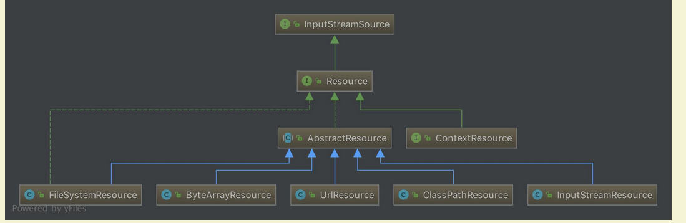
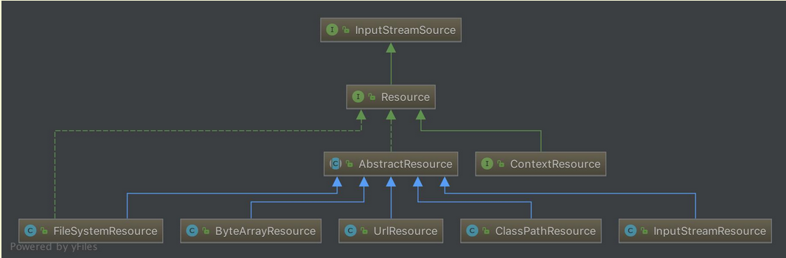
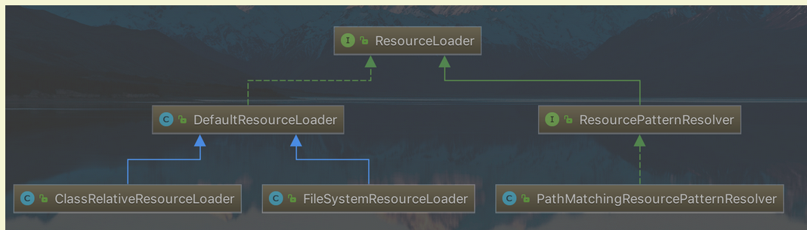

# 死磕Spring

## 一、深入理解IOC

### 1. IOC理论

解释控制反转内容：

- **谁控制谁：**传统模式直接new对象，我直接控制对象，有了IOC后直接由IOC容器提供，IOC容器控制了对象

- **为何反转：**直接new是正转，到IOC后变从原本的主动到被动接受

### 2. 各个组件

ClassPathXmlApplicationContext 的类继承体系结构，虽然只有一部分，但是它基本上包含了 IoC 体系中大部分的核心类和接口。


#### 2.1 Resource体系

`org.springframework.core.io.Resource`，对资源的抽象。它的每一个实现类都代表了一种资源的访问策略，如 ClassPathResource、RLResource、FileSystemResource  等。



##### 2.1.1 ResourceLoader 体系
有了资源，就应该有资源加载，Spring 利用 org.springframework.core.io.ResourceLoader 来进行统一资源加载，类图如下：


#### 2.2 BeanFactory 体系
org.springframework.beans.factory.BeanFactory，是一个非常纯粹的 bean 容器，它是 IoC 必备的数据结构，其中 BeanDefinition 是它的基本结构。BeanFactory 内部维护着一个BeanDefinition map ，并可根据 BeanDefinition 的描述进行 bean 的创建和管理。


- BeanFactory 有三个直接子类 ListableBeanFactory、HierarchicalBeanFactory 和 AutowireCapableBeanFactory 。
- DefaultListableBeanFactory 为最终默认实现，它实现了所有接口。


#### 2.3 BeanDefinition 体系
org.springframework.beans.factory.config.BeanDefinition ，用来描述 Spring 中的 Bean 对象。


#### 2.4 BeanDefinitionReader 体系
org.springframework.beans.factory.support.BeanDefinitionReader 的作用是读取 Spring 的配置文件的内容，并将其转换成 Ioc 容器内部的数据结构 ：BeanDefinition 。


#### 2.5 ApplicationContext 体系
org.springframework.context.ApplicationContext ，这个就是大名鼎鼎的 Spring 容器，它叫做应用上下文，与我们应用息息相关。它**继承** BeanFactory ，所以它是 BeanFactory 的扩展升级版，如果BeanFactory 是屌丝的话，那么 ApplicationContext 则是名副其实的高富帅。由于 ApplicationContext 的结构就决定了它与 BeanFactory 的不同，其主要区别有：

    继承 org.springframework.context.MessageSource 接口，提供国际化的标准访问策略。
    继承 org.springframework.context.ApplicationEventPublisher 接口，提供强大的事件机制。
    扩展 ResourceLoader ，可以用来加载多种 Resource ，可以灵活访问不同的资源。
    对 Web 应用的支持。


## 二、Spring 统一资源加载策略

1. 职能划分清楚。资源的定义和资源的加载应该要有一个清晰的**界限**；
2. 统一的抽象。统一的资源**定义**和资源加载**策略**。资源加载后要返回统一的抽象给客户端，客户端要对资源进行怎样的处理，应该由抽象资源接口来界定。

### 1. 统一资源：Resource

`org.springframework.core.io.Resource` 为 Spring 框架所有资源的抽象和访问接口，它继承 `org.springframework.core.io.InputStreamSource`接口。作为所有资源的统一抽象，Resource 定义了一些通用的方法，由子类 `AbstractResource` 提供统一的默认实现。具体看源码的Resource 内容。

#### 1.1 类结构




从上图可以看到，Resource 根据资源的不同类型提供不同的具体实现，如下：

- FileSystemResource ：对 `java.io.File` 类型资源的封装，只要是跟 File  打交道的，基本上与 FileSystemResource 也可以打交道。支持文件和 URL 的形式，实现 WritableResource  接口，且从 Spring Framework 5.0 开始，FileSystemResource 使用 NIO2 API进行读/写交互。
- ByteArrayResource ：对字节数组提供的数据的封装。如果通过 InputStream 形式访问该类型的资源，该实现会根据字节数组的数据构造一个相应的 ByteArrayInputStream。
- UrlResource ：对 `java.net.URL`类型资源的封装。内部委派 URL 进行具体的资源操作。
- ClassPathResource ：class path 类型资源的实现。使用给定的 ClassLoader 或者给定的 Class 来加载资源。
- InputStreamResource ：将给定的 InputStream 作为一种资源的 Resource 的实现类。

#### 1.2 AbstractResource

`org.springframework.core.io.AbstractResource` ，为 Resource 接口的默认**抽象**实现。它实现了 Resource 接口的**大部分的公共实现**，作为 Resource 接口中的重中之重，其定义查看源码内容

如果我们想要实现自定义的 Resource ，记住不要实现 Resource 接口，而应该继承 AbstractResource 抽象类，然后根据当前的具体资源特性覆盖相应的方法即可。

#### 1.3 其他子类

Resource 的子类，例如 FileSystemResource、ByteArrayResource 、ClassPathResource等等的代码非常简单。感兴趣的胖友，自己去研究。

### 2. 统一资源定位：ResourceLoader

`org.springframework.core.io.ResourceLoader` 为 Spring 资源加载的统一抽象，具体的资源加载则由相应的实现类来完成，所以我们可以将 ResourceLoader 称作为统一资源定位器。其定义如下：ResourceLoader，定义资源加载器，主要应用于根据给定的资源文件地址，返回对应的 Resource 。

```java
public interface ResourceLoader {

	String CLASSPATH_URL_PREFIX = ResourceUtils.CLASSPATH_URL_PREFIX; // CLASSPATH URL 前缀。默认为："classpath:"
    /**
    根据所提供资源的路径 location 返回 Resource 实例，但是它不确保该 Resource 一定存在，需要调用 Resource#exist() 方法来判断。
    该方法支持以下模式的资源加载：
        URL位置资源，如 "file:C:/test.dat" 。
        ClassPath位置资源，如 "classpath:test.dat 。
        相对路径资源，如 "WEB-INF/test.dat" ，此时返回的Resource 实例，根据实现不同而不同。
    该方法的主要实现是在其子类 DefaultResourceLoader 中实现，具体过程我们在分析 DefaultResourceLoader 时做详细说明。
    **/
	Resource getResource(String location);

	ClassLoader getClassLoader();

}
```

#### 2.1 子类结构



#### 2.2 DefaultResourceLoader

与 AbstractResource 相似，`org.springframework.core.io.DefaultResourceLoader` 是 ResourceLoader 的默认实现。

##### 2.2.1 构造函数

##### 2.2.2 getResource方法

ResourceLoader 中最核心的方法为 `#getResource(String location)` ，它根据提供的 location 返回相应的 Resource 。而 DefaultResourceLoader 对该方法提供了**核心实现**（因为，它的两个子类都没有提供覆盖该方法，所以可以断定 ResourceLoader 的资源加载策略就封装在 DefaultResourceLoader 中)，详情看源码内容

返回ClassPathContextResource或者FileUrlResource或者UrlResource或者ClassPathResource

每个其实最大的区别就在于读取文件的内容 getInputStream

##### 2.2.3 ProtocolResolver

`org.springframework.core.io.ProtocolResolver` ，用户自定义协议资源解决策略，作为 DefaultResourceLoader 的 **SPI**：它允许用户自定义资源加载协议，而不需要继承 ResourceLoader 的子类。
在介绍 Resource 时，提到如果要实现自定义 Resource，我们只需要继承 AbstractResource 即可，有了  ProtocolResolver 后，我们不需要继承 DefaultResourceLoader，改为实现 ProtocolResolver 接口也可以实现自定义的 ResourceLoader。

ProtocolResolver 接口，仅有一个方法 `Resource resolve(String location, ResourceLoader resourceLoader)` 。

在 Spring 中你会发现该接口并没有实现类，它需要用户自定义，自定义的 Resolver 如何加入 Spring 体系呢？调用 `DefaultResourceLoader#addProtocolResolver(ProtocolResolver)` 方法即可。


#### 2.3 FileSystemResourceLoader

我们看到，其实 DefaultResourceLoader 对`#getResourceByPath(String)` 方法处理其实不是很恰当，这个时候我们可以使用 `org.springframework.core.io.FileSystemResourceLoader` 。它继承 DefaultResourceLoader ，且覆写了 `#getResourceByPath(String)` 方法，该方法在default的getResource时候有d，使之从文件系统加载资源并以 FileSystemResource 类型返回，这样我们就可以得到想要的资源类型。代码如下：

```java
@Override
protected Resource getResourceByPath(String path) {
	// 截取首 /
	if (path.startsWith("/")) {
		path = path.substring(1);
	}
	// 创建 FileSystemContextResource 类型的资源
	return new FileSystemContextResource(path);
}
```

##### 2.3.1 FileSystemContextResource
FileSystemContextResource ，为 FileSystemResourceLoader 的内部类，它继承 FileSystemResource 类，实现 ContextResource 接口。代码如下：

```java
/**
 * FileSystemResource that explicitly expresses a context-relative path
 * through implementing the ContextResource interface.
 */
private static class FileSystemContextResource extends FileSystemResource implements ContextResource {

	public FileSystemContextResource(String path) {
		super(path);
	}

	@Override
	public String getPathWithinContext() {
		return getPath();
	}
}
```

- 在构造器中，也是调用 FileSystemResource 的构造函数来构造 FileSystemResource 的。
- 为什么要有 FileSystemContextResource 类的原因是，实现 ContextResource 接口，并实现对应的 `#getPathWithinContext()` 接口方法。

#### 2.4 ClassRelativeResourceLoader

`org.springframework.core.io.ClassRelativeResourceLoader` ，是 DefaultResourceLoader 的另一个子类的实现。和 FileSystemResourceLoader 类似，在实现代码的结构上类似，也是覆写 `#getResourceByPath(String path)` 方法，并返回其对应的 ClassRelativeContextResource 的资源类型。

ClassRelativeResourceLoader 扩展的功能是，可以根据给定的`class` 所在包或者所在包的子包下加载资源。

```java
@RequestMapping(value="/index.html")
	public String loginPage() throws IOException {
		ResourceLoader resourceLoader=new ClassRelativeResourceLoader(this.getClass());
        // test.xml是本类下的，如果使用/test.xml采用绝对路劲查找方式
        // 实际上是jdk自有的内容 java.lang.Class#resolveName协助查找的
		Resource resource=resourceLoader.getResource("test.xml");
		System.out.println(resource.getFile().getPath());
		return "index";
	}   
```

可以查看ClassRelativeResourceLoaderTest类

https://blog.csdn.net/seasonsbin/article/details/80914911

#### 2.5 ResourcePatternResolver
ResourceLoader 的 Resource getResource(String location) 方法，每次只能根据 location 返回一个 Resource 。当需要加载多个资源时，我们除了多次调用 #getResource(String location) 方法外，别无他法。org.springframework.core.io.support.ResourcePatternResolver 是 ResourceLoader 的扩展，它支持根据指定的资源路径匹配模式每次返回多个 Resource 实例，其定义如下：

```java
public interface ResourcePatternResolver extends ResourceLoader {

	String CLASSPATH_ALL_URL_PREFIX = "classpath*:";

	Resource[] getResources(String locationPattern) throws IOException;

}
```

- ResourcePatternResolver 在 ResourceLoader 的基础上增加了 `#getResources(String locationPattern)` 方法，以支持根据路径匹配模式返回**多个** Resource 实例。
- 同时，也新增了一种**新的协议**前缀 `"classpath*:"`，该协议前缀由其子类负责实现。

#### 2.6 PathMatchingResourcePatternResolver

`org.springframework.core.io.support.PathMatchingResourcePatternResolver` ，为 ResourcePatternResolver 最常用的子类，它除了支持 ResourceLoader 和 ResourcePatternResolver 新增的 `"classpath*:"` 前缀外，**还支持 Ant 风格的路径匹配模式**（类似于 `"**/*.xml"`）。

##### 2.6.1 构造函数

```java
/**
 * 内置的 ResourceLoader 资源定位器
 */
private final ResourceLoader resourceLoader;
/**
 * Ant 路径匹配器
 */
private PathMatcher pathMatcher = new AntPathMatcher();

public PathMatchingResourcePatternResolver() {
	this.resourceLoader = new DefaultResourceLoader();
}

public PathMatchingResourcePatternResolver(ResourceLoader resourceLoader) {
	Assert.notNull(resourceLoader, "ResourceLoader must not be null");
	this.resourceLoader = resourceLoader;
}

public PathMatchingResourcePatternResolver(@Nullable ClassLoader classLoader) {
	this.resourceLoader = new DefaultResourceLoader(classLoader);
}
```

- PathMatchingResourcePatternResolver 在实例化的时候，可以指定一个 ResourceLoader，如果不指定的话，它会在内部构造一个 DefaultResourceLoader 。
- `pathMatcher` 属性，默认为 AntPathMatcher 对象，用于支持 Ant 类型的路径匹配。

##### 2.6.2 getResource

```java
@Override
public Resource getResource(String location) {
	return getResourceLoader().getResource(location);
}

public ResourceLoader getResourceLoader() {
	return this.resourceLoader;
}
```

该方法，直接委托给相应的 ResourceLoader 来实现。所以，如果我们在实例化的  PathMatchingResourcePatternResolver 的时候，如果未指定 ResourceLoader  参数的情况下，那么在加载资源时，其实就是 DefaultResourceLoader 的过程。

其实在下面介绍的 `Resource[] getResources(String locationPattern)` 方法也相同，只不过返回的资源是**多个**而已。

```java
@Override
public Resource[] getResources(String locationPattern) throws IOException {
    Assert.notNull(locationPattern, "Location pattern must not be null");
    // 以 "classpath*:" 开头
    if (locationPattern.startsWith(CLASSPATH_ALL_URL_PREFIX)) {
        // 路径包含通配符
        // a class path resource (multiple resources for same name possible)
        if (getPathMatcher().isPattern(locationPattern.substring(CLASSPATH_ALL_URL_PREFIX.length()))) {
            // a class path resource pattern
            return findPathMatchingResources(locationPattern);
        // 路径不包含通配符
        } else {
            // all class path resources with the given name
            return findAllClassPathResources(locationPattern.substring(CLASSPATH_ALL_URL_PREFIX.length()));
        }
    // 不以 "classpath*:" 开头
    } else {
        // Generally only look for a pattern after a prefix here, // 通常只在这里的前缀后面查找模式
        // and on Tomcat only after the "*/" separator for its "war:" protocol. 而在 Tomcat 上只有在 “*/ ”分隔符之后才为其 “war:” 协议
        int prefixEnd = (locationPattern.startsWith("war:") ? locationPattern.indexOf("*/") + 1 :
                locationPattern.indexOf(':') + 1);
        // 路径包含通配符
        if (getPathMatcher().isPattern(locationPattern.substring(prefixEnd))) {
            // a file pattern
            return findPathMatchingResources(locationPattern);
        // 路径不包含通配符
        } else {
            // a single resource with the given name
            return new Resource[] {getResourceLoader().getResource(locationPattern)};
        }
    }
}
```

- **非** `"classpath*:"` 开头，且路径**不包含**通配符，直接委托给相应的 ResourceLoader 来实现。
- 其他情况，调用 `#findAllClassPathResources(...)`、或 `#findPathMatchingResources(...)` 方法，返回多个 Resource 。下面，我们来详细分析。

##### 2.6.3 findAllClassPathResources

当 `locationPattern` 以 `"classpath*:"` 开头但是不包含通配符，则调用 `#findAllClassPathResources(...)` 方法加载资源。该方法返回 classes 路径下和所有 jar 包中的所有相匹配的资源。

```java
protected Resource[] findAllClassPathResources(String location) throws IOException {
	String path = location;
	// 去除首个 /
	if (path.startsWith("/")) {
		path = path.substring(1);
	}
	// 真正执行加载所有 classpath 资源
	Set<Resource> result = doFindAllClassPathResources(path);
	if (logger.isTraceEnabled()) {
		logger.trace("Resolved classpath location [" + location + "] to resources " + result);
	}
	// 转换成 Resource 数组返回
	return result.toArray(new Resource[0]);
}
```

真正执行加载的是在 `#doFindAllClassPathResources(...)` 方法，代码如下：

```java
protected Set<Resource> doFindAllClassPathResources(String path) throws IOException {
	Set<Resource> result = new LinkedHashSet<>(16);
	ClassLoader cl = getClassLoader();
	// <1> 根据 ClassLoader 加载路径下的所有资源
	Enumeration<URL> resourceUrls = (cl != null ? cl.getResources(path) : ClassLoader.getSystemResources(path));
	// <2>
	while (resourceUrls.hasMoreElements()) {
		URL url = resourceUrls.nextElement();
		// 将 URL 转换成 UrlResource
		result.add(convertClassLoaderURL(url));
	}
	// <3> 加载路径下得所有 jar 包
	if ("".equals(path)) {
		// The above result is likely to be incomplete, i.e. only containing file system references.
		// We need to have pointers to each of the jar files on the classpath as well...
		addAllClassLoaderJarRoots(cl, result);
	}
	return result;
}
```

- <1> 处，根据 ClassLoader 加载路径下的所有资源。在加载资源过程时，如果在构造 PathMatchingResourcePatternResolver 实例的时候如果传入了 ClassLoader，则调用该 ClassLoader 的 `#getResources()` 方法，否则调用 `ClassLoader#getSystemResources(path)` 方法。另外，`ClassLoader#getResources()` 方法:

##### 2.6.4 findPathMatchingResources

当 `locationPattern` 中包含了**通配符**，则调用该方法进行资源加载。代码如下：

```java
protected Resource[] findPathMatchingResources(String locationPattern) throws IOException {
    // 确定根路径、子路径
    String rootDirPath = determineRootDir(locationPattern);
    String subPattern = locationPattern.substring(rootDirPath.length());
    // 获取根据路径下的资源
    Resource[] rootDirResources = getResources(rootDirPath);
    // 遍历，迭代
    Set<Resource> result = new LinkedHashSet<>(16);
    for (Resource rootDirResource : rootDirResources) {
        rootDirResource = resolveRootDirResource(rootDirResource);
        URL rootDirUrl = rootDirResource.getURL();
        // bundle 资源类型
        if (equinoxResolveMethod != null && rootDirUrl.getProtocol().startsWith("bundle")) {
            URL resolvedUrl = (URL) ReflectionUtils.invokeMethod(equinoxResolveMethod, null, rootDirUrl);
            if (resolvedUrl != null) {
                rootDirUrl = resolvedUrl;
            }
            rootDirResource = new UrlResource(rootDirUrl);
        }
        // vfs 资源类型
        if (rootDirUrl.getProtocol().startsWith(ResourceUtils.URL_PROTOCOL_VFS)) {
            result.addAll(VfsResourceMatchingDelegate.findMatchingResources(rootDirUrl, subPattern, getPathMatcher()));
        // jar 资源类型
        } else if (ResourceUtils.isJarURL(rootDirUrl) || isJarResource(rootDirResource)) {
            result.addAll(doFindPathMatchingJarResources(rootDirResource, rootDirUrl, subPattern));
        // 其它资源类型
        } else {
            result.addAll(doFindPathMatchingFileResources(rootDirResource, subPattern));
        }
    }
    if (logger.isTraceEnabled()) {
        logger.trace("Resolved location pattern [" + locationPattern + "] to resources " + result);
    }
    // 转换成 Resource 数组返回
    return result.toArray(new Resource[0]);
}
```

###### 2.6.4.1 determineRootDir

`determineRootDir(String location)` 方法，主要是用于确定根路径。代码如下：

```java
/**
 * Determine the root directory for the given location.
 * <p>Used for determining the starting point for file matching,
 * resolving the root directory location to a {@code java.io.File}
 * and passing it into {@code retrieveMatchingFiles}, with the
 * remainder of the location as pattern.
 * <p>Will return "/WEB-INF/" for the pattern "/WEB-INF/*.xml",
 * for example.
 * @param location the location to check
 * @return the part of the location that denotes the root directory
 * @see #retrieveMatchingFiles
 */
protected String determineRootDir(String location) {
	// 找到冒号的后一位
	int prefixEnd = location.indexOf(':') + 1;
	// 根目录结束位置
	int rootDirEnd = location.length();
	// 在从冒号开始到最后的字符串中，循环判断是否包含通配符，如果包含，则截断最后一个由”/”分割的部分。
	// 例如：在我们路径中，就是最后的ap?-context.xml这一段。再循环判断剩下的部分，直到剩下的路径中都不包含通配符。
	while (rootDirEnd > prefixEnd && getPathMatcher().isPattern(location.substring(prefixEnd, rootDirEnd))) {
		rootDirEnd = location.lastIndexOf('/', rootDirEnd - 2) + 1;
	}
	// 如果查找完成后，rootDirEnd = 0 了，则将之前赋值的 prefixEnd 的值赋给 rootDirEnd ，也就是冒号的后一位
	if (rootDirEnd == 0) {
		rootDirEnd = prefixEnd;
	}
	// 截取根目录
	return location.substring(0, rootDirEnd);
}
```

方法比较绕，效果如下示例：

|               原路径               |      确定根路径       |
| :--------------------------------: | :-------------------: |
| `classpath*:test/cc*/spring-*.xml` |  `classpath*:test/`   |
| `classpath*:test/aa/spring-*.xml`  | `classpath*:test/aa/` |

###### 2.6.4.2 doFindPathMatchingXXXResources
#doFindPathMatchingXXXResources(...) 方法，是个泛指，一共对应三个方法：

    #doFindPathMatchingJarResources(rootDirResource, rootDirUrl, subPatter) 方法
    #doFindPathMatchingFileResources(rootDirResource, subPattern) 方法
    VfsResourceMatchingDelegate#findMatchingResources(rootDirUrl, subPattern, pathMatcher) 方法

因为本文重在分析 Spring 统一资源加载策略的整体流程。相对来说，上面几个方法的代码量会比较多。所以本文不再追溯，感兴趣的胖友，推荐阅读如下文章：

   https://www.cnblogs.com/question-sky/p/6959493.html ，主要针对 #doFindPathMatchingJarResources(rootDirResource, rootDirUrl, subPatter) 方法。
    http://www.blogjava.net/DLevin/archive/2012/12/01/392337.html ，主要针对 #doFindPathMatchingFileResources(rootDirResource, subPattern) 方法。
    http://www.coderli.com/spring-wildpath-parse/ 😈 貌似没有下

##### 2.6小结

        classpath*:表示查找classpath路径下的所有符合条件的资源，包含jar、zip等资源；classpath:表示优先在项目的资源目录下查找，找不到才去jar、zip等资源中查找
    
        该类可以帮助spring查找到符合ant-style格式的所有资源，所以富有借鉴意义。附：ant-style指的是类似*/?此类的匹配字符


### 三、IoC 之加载 BeanDefinition


## SpringWeb

关于input流和ouput流只能一次的时候，把他保存起来，然后后续的getInputStrem等都从这个数据走