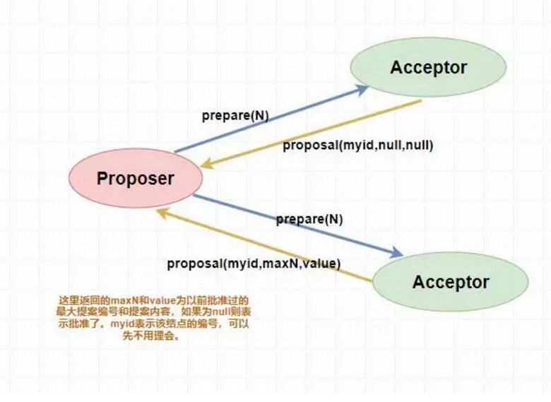

## 概念内容
### 基本概念
#### ACID 概念
  （原子性、一致性、隔离性（脏读、授权读取、可重复读、串行）、持久性）
#### CAP理论
  一个分布式系统不能同时满足一致性、可用性、分区容错性这三个基本需求，最多满足两项。
1. 一致性
   将数据副本分布式在不同节点上，对1个节点数据进行更新且成功后，
其余的没有更新。强一致性对一个数据项的更新成功后，所有的用户可以读取最新的值，这样就认为具有一致性
2. 可用性
    服务处于可用状态，每次的请求总是在**有限时间内** **可用的返回结果**。
3. 分区容错性
    不同节点分布在不同网络，由于一些原因导致这些子网络不连通，对外仍然要提供满足一致性和可用性服务。对于分布式系统来说p时必要的，必须要解决和面对的问题。
4. 各种组合内容
CA：单机模式下
AP：放弃一致性，更多指的时非强一致性
CP：要求强一致，受到影响的需要等待一定的时间，无法对外提服务等。
#### BASE理论
  基本可用、软状态、最终一致性三个短语的简写，从CAP中逐步演化而来，核心思想及时无法做到强一致性，也要做到最终一致性。
1. 基本可用
    分布式系统出现不可预知故障的时候，允许损失部分可用性，
  - 响应时间上的损失
  - 功能上的损失
2. 软状态
    系统数据存在中间状态，该状态不影响系统整体可用，允许系统不同节点的数据副本之间进行数据同步的过程存在延时。
3. 最终一致性
    经过以端时间同步后，最终达到一致
  - 因果关系一致性。A写，读B 必须时A的最新数据
  - 读已之所写。进程A更新，后面的读都市足心的数据
  - 会话一致性。
  - 单调读一致性。
  - 单调写一致性。
#### 一致性协议
  机器中每个节点明确的知道自己进行事务操作的结果，但无法直接获取道其他节点，当跨多个分布式节点又要满足ACID特性上海，需要引入一个成为协调者的组件统一调度所有分布式节点的执行逻辑。
##### 2PC
  二阶段提交。将一个事务的处理过程分为投票和执行两个阶段，核心时对每个事务都采用先尝试后提交。是一种强一致性的算法。
  阶段一：提交事务请求
  1. 事务询问。协调者向所有参与者发送事务内容，询问是否可执行操作，并等待个参与者响应。
  2. 执行事务。各参与者节点执行事务操作，并将Undo和Redo信息计入事务日志中。
  3. 各参与者向协调者反馈事务询问的响应。如果参与者成功执行了事务操作，反馈yes响应，没有成功执行，反馈no。

    这阶段也叫投票阶段，各个参与者投票表没是否要执行接下去的事务提交操作。
    阶段二：执行事务提交
    协调者会根据各参与者的反馈情况决定最终是否可以进行事务提交操作，包含以下两种情况
  - 执行事务提交。得到所有参与者反馈yes
  1. 发送提交请求。协调者向所有参与者节点发出Commit请求。
  2. 事务提交。参与者收到commit请求后，回正式执行事务提交操作，并在完成提交之后释放在整个事务执行期间占用的事务资源。
  3. 反馈事务提交结果。参与者在完成事务提交之后，向协调者发送Ack消息。
  4. 协调者接收到所有参与者反馈的Ack消息后，完成事务。
  - 中断事务。任何一个参与者反馈no，或者等待超时就会中断。
  1. 发送回滚请求。协调者向所有参与者节点发送Rollback请求。
  2. 事务回滚。参与者接收到Rollback请求后，会利用在阶段一中的记录的Undo信息来执行事务回滚操作，并在完成回滚后释放事务占用资源。
  3. 反馈事务回滚结果。参与者在完成事务回滚后，向协调者发送Ack消息。
  4. 中断事务。协调者接收到所有参与者反馈的Ack消息后，完成事务中断。
###### 优缺点
优点：原理简单，实现方便
缺点：同步阻塞、单点问题、脑裂、太过保守
1. 同步阻塞。限制分布式系统的性能，所有参与该事务操作的逻辑都处于阻塞状态，各个参与者在等待其他参与者响应的过程中，无法进行其他任何操作。
2. 单点问题。协调者很重要出现问题l，参与者会一直锁定资源。
3. 数据不一致。阶段二时，向所有参与者发送Commit后，发送网络异常或是协调者自身奔溃，导致部分参与者收到Commit，就会发生数据不一样。
4. 太过保守。任何一个参与者因为故障网络等问题，协调者要进行判断是否需要终端事务，没有很好的容错机制。任何失败都会导致事务失败。
##### 3PC
基于二阶段而提出的三阶段提交
  阶段一：CanCommit
  1. 事务询问。协调者向所有的参与者发送一个包含事务内容的canCommit请求，询问是否可以执行事务提交，等待参与者返回。
  2. 参与者反馈。自身认为可顺利执行事务，反馈yes。

    阶段二：PreCommit
  - 执行事务预提交。 假如协调者从所有的参与者反馈道Yse
  1. 发送预提交请求。协调者向参与者发送preCommit请求，并进入Prepared阶段。
  2. 事务预提交。参与者接收到PreCommit后，会执行事务操作内容，并将Undo和Redo信息记录道事务日志中。
  3. 反馈执行响应。参与者反馈协调者Ack响应，同时等待最终指令。
  - 中断事务。参与者反馈no，或者网络超时
  1. 发送中断请求。协调者向所有参与者发出abort。
  2. 中断事务。收到协调者的abort请求，或是等待协调者请求过程中出现超时，参与者都会中断事务。

    阶段三：doCommit。一旦进度阶段三，如果参与者无法接收到来自协调者的命令，自动会进行事务提交
  - 执行提交，都反馈yes
  1. 发送提交请求。协调者正常状态且收到来自所有参与者的Ack响应，将状态从预提交改为提交。发送doCommit请求。
  2. 事务提交。参与者会正式执行事务提交操作，并在完成提交后释放在整个事务执行期间占用的资源。
  3. 反馈事务提交结果。参与者完成后，向协调者发送Ack消息。
  4. 完成事务。协调者收到参与者反馈的Ack后，完成事务。
  - 中断事务。任意参与者反馈no，或超时，协调者无法接收到所有参与者的反馈响应。
  1. 发送中断请求。协调者向所有参与者发出abort。
  2. 事务回滚。利用阶段二的Undo信息来执行回滚操作，并释放资源。
  3. 反馈回滚结果。
  4. 中断事务。

###### 优缺点
优点：降低阻塞范围，单点故障后继续达成一致
缺点：造成数据不一致，preCommit阶段后
##### Paxos算法
基于3阶段不一致问题，提出Paxos算法。
需要解决的问题就是如何在一个可能发送异常的分布式系统中，快速且正确的在集群中对某个数据的值达成一致，并保证不论发生任何异常，都不会破坏系统的一致性。
拜占庭将军问题。消息不可靠
在 Paxos 中主要有三个角色，分别为** Proposer 提案者、Acceptor 表决者、Learner 学习者**
主要阶段有Prepare阶段、Accept 阶段

1. Prepare阶段
    Proposer 提案者：负责提出 proposal，每个提案者在提出提案时都会首先获取到一个 具有全局唯一性的、递增的提案编号 N，即在整个集群中是唯一的编号 N，然后将该编号赋予其要提出的提案，在第一阶段是只将提案编号发送给所有的表决者
    Acceptor 表决者：每个表决者在 accept 某提案后，会将该提案编号N记录在本地，这样每个表决者中保存的已经被 accept 的提案中会存在一个编号最大的提案，其编号假设为 maxN。每个表决者仅会 accept 编号大于自己本地 maxN 的提案，在批准提案时表决者会将以前接受过的最大编号的提案作为响应反馈给 Proposer。
2. Accept阶段
当一个提案被 Proposer 提出后，如果 Proposer **收到了超过半数的 Acceptor 的批准（**Proposer 本身同意），那么此时 Proposer 会给所有的 Acceptor** 发送真正的提案**（你可以理解为第一阶段为试探），这个时候 Proposer 就会发送提案的内容和提案编号。
表决者收到提案请求后会再次**比较**本身已经批准过的最大提案编号和该提案编号，如果该提案编号大于等于已经批准过的最大提案编号，那么就 accept 该提案（此时执行提案内容但不提交），随后将情况返回给 Proposer。如果不满足则不回应或者返回 NO。

当 Proposer 收到超过**半数的** Accept ，那么它这个时候会向**所有的**acceptor 发送提案的提交请求。需要注意的是，因为上述仅仅是超过半数的 acceptor 批准执行了该提案内容，其他没有批准的并没有执行该提案内容，所以这个时候需要向未批准的 acceptor 发送提案内容和提案编号并让它**无条件执行和提交**，而对于前面已经批准过该提案的 acceptor 来说 仅仅需要发送该提案的编号，让 acceptor **执行提交**就行了。
###### 算法的死循环问题
比如说，此时提案者 P1 提出一个方案 M1，完成了 Prepare 阶段的工作，这个时候 acceptor 则批准了 M1，但是此时提案者 P2 同时也提出了一个方案 M2，它也完成了 Prepare 阶段的工作。然后 P1 的方案已经不能在第二阶段被批准了（因为 acceptor 已经批准了比 M1 更大的 M2），所以 P1 自增方案变为 M3 重新进入 Prepare 阶段，然后 acceptor ，又批准了新的 M3 方案，它又不能批准 M2 了，这个时候 M2 又自增进入 Prepare 阶段。
  

###### Paxos工程的实践
1. Chubby

### zookeeper介绍
#### 什么是zookeeper
是一个分布式数据一致性的解决方案，可以基于他实现数据发布/订阅、负载均衡、命名服务、分布式协调/通知、集群管理、Master选举、分布式锁和分布式队列管理。ZooKeeper可以保证如下分布式一致性特性
1. 顺序一致性。
2. 原子性
3. 单一试图
4. 可靠性
5. 实时性。保证在一定时间内
#### Zookeeper设计目标
1. 简单的数据模型。像文件目录结构一样，但不同的是把全量数据存储在内存种。
2. 可以构建集群。每台机器之间都互相保持通信，只要集群超过一半可以工作，那整个集群就能正常对外服务。Zookeeper的客户端会选择和集群中任意一台机器共同创建一个TCP链接，断开后客户端会自动连接道集群中的其他机器。
3. 顺序访问。每次请求分配一个全局唯一的递增序号。该序号反映所有事务操作的先后顺序
4. 高性能。全量数据存储在内存中。
#### Zookeeper基本概念
1. 集群角色
    构成集群的每个机器都有自己的角色，最典型的集群模式就是Master/Slave模式。
    Zookeeper引入了Leader、Follower、Observer三种角色。通过一个选举选定一台Leader机器，Leader为客户端提供读和写服务。Follower和Observer都能提供读服务，区别在于Observer机器不参与Leader选举。
2. 会话
    客户端与服务器之间时一个TCP长连接。对外默认端口2181
3. 数据节点（Znode）
    数据模型是一颗树，由斜杠进行分割的路劲，每个ZNode上都回保存自己的数据。分为持久节点、临时节点，持久节点一旦创建了除非主动进行ZNode移除操作，否则会一直保存在ZooKeeper上，临时节点旧不一样，他的生命周期与客户端会话包订，一旦客户端会话失效，客户端创建的所有临时节点都会移除。
4. 版本
    每个Znode都会维护一个叫做Stat的数据结构，记录三个版本（version（当前Znode版本）、cversion（当前ZNode子节点的版本）、aversion(当前ZNode的ACL版本)）。
5. Watcher
    事件监听器，是Zookeeper的一个很重要特性。允许用户在指定节点上注册一些Watcher，并在一些特定事件触发时候，Zookeeper服务端会将事件通知到感兴趣的客户端上去，该机制是Zookeeper实现分布式协调服务的重要特性。
6. ACL
    采用Access Control Lists策略来进行权限控制。
#### ZAB协议
##### 基本介绍
并没有采用Paxos算法，而是用ZAB来保证数据一致性核心算法。是一个特别为ZooKeeper设计的奔溃可恢复的原子消息广播算法。所有事务请求必须由一个**全局唯一的服务器来协调处理**（Leader），剩余的其他服务器成为Follower服务器，Leader负责把客户端的事务请求转化成一个提议，并将该提议分发给所有Follower，之后Leader服务器等待Follower反馈，超过半数正确反馈后，Leader再次向所有的Follower分发Commit。
##### 重点说明
###### 消息广播
类似于一个二阶段提交的过程。
所有的Follower服务器要么正常反馈Leader提出的内容， 要么抛弃，只要过半服务器已经反馈Ack就可以提交请求，不需要等待所有反馈。当然这种简化情况下，无法解决因Leader奔溃导致的数据不一致问题。因此要靠奔溃恢复来解决。整个消息广播基于FIFO特性的TCP协议来进行通信，因此很容易保证消息广播过程中接收和发送的顺序性。
在广播过程中，广播事务前，Leader服务器首先为这事务分配一个全局单调递增的唯一ID，成为ZXID，为了保证每个消息严格顺序，按照ZXID的先后顺序来进行排序与处理。
  广播过程中Leader为每一个Follower服务器各自分配一个单独的队列，后将Proposal依次放入这些队列中去，并根据FIFO策略发送，每个Follower在接收到这个事务后，都会首先将其以事务日志的形式写道本地磁盘中，并在成功写入后返回一个Ack响应。Leader收到超过半数的Ack，就会广播一个Commit消息给所有Follower提交，同时Leader自身也会完成事务提交。
###### 崩溃恢复

##### 与Paxos区别

#####  常见问题
1. 广播时候通过二阶段来提交，在Commit时候如果一部分Follower更新了但是一部分因为Leader奔溃没更新
2. 广播时候通过二阶段来提交，未Commit，Leader奔溃
## 应用场景
1. 分布式协调
    分布式协调简单说就是有人对ZooKeeper中的数据做了监听，如果修改了ZooKeeper中被监听的数据，ZooKeeper反过来会告诉给发起监听的人数据的变更。比如在Kafka的设计中，Kafka的一个节点在ZooKeeper中创建了一个数据，Kafka的策略是谁创建了这个数据谁就是Kafka集群的主节点，其余的节点都会去监听这个数据。如果主节点宕机了，这ZooKeeper对应的数据就会发生变更，既而监听这个数据的其余节点就会感知到主节点宕机了，然后重新进行选举。
2. 元数据管理
	很多分布式的程序需要集中式的管理自己的元数据，这个时候ZooKeeper就是一个很好的选择。比如Kafka，Storm等分布式的工具就会把集群里核心的元数据存放在ZooKeeper中。
3. 高可用
	很多分布式的项目都是主从式的架构，正常情况下集群里有一个是主节点，其余的都是从节点。但是如果只有一个主节点的话，程序就会有单点故障问题，那么这个时候就需要部署多个主节点实现高可用了，利用ZooKeeper从多个主节点中选出一个作为master，其余的作为StandBy。比如鼎鼎大名的HDFS就是靠ZooKeeper实现的高可用。
4. 分布式锁
	在企业里面很多的项目需要分布式锁，我们可以使用ZooKeeper搞分布式锁，不过这儿大家要注意一点，ZooKeeper确实是可以搞分布式锁的，但是ZooKeeper不支持太高的并发，也就是说如果是高并发的情况下，分布式锁用ZooKeeper可能也不太适合，如果在高并发的情况下建议大家使用Redis去搞分布式锁，但是并发不太高的情况下用ZooKeeper搞分布式锁是比较方便的，也有很多人确实是这么使用的。