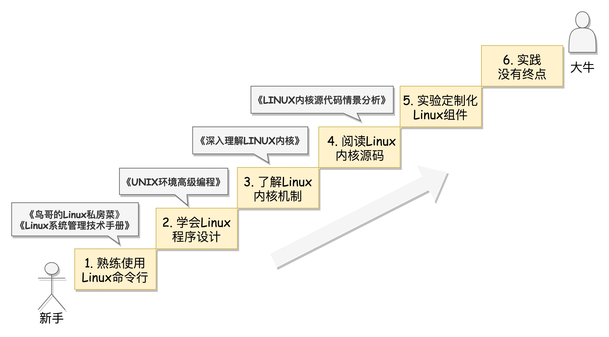

书单

- [ ] 了不起的Markdown      
- [x] Effective Java 3

网路编程实战：

- [x] C程序语言设计  了解数组和指针、结构体和函数
- [x] UNIX网络编程 杨继张翻译的版本
- [x] TCP/IP 详解 卷 1：协议 当作资料来查  

Linux

1. 命令篇
   - [ ] 鸟哥的Linux私房菜  linux 命令
   - [ ] Linux系统管理技术手册 鸟哥的升入
2. 学会进行程序设计
   - [ ] UNIX环境高级编程
3. 了解Linux内核机制
   - [ ] 深入理解LINUX内核
4. 阅读Linux内核代码，聚焦核心逻辑和场景
   - [ ] LINUX内核源代码情景分析

