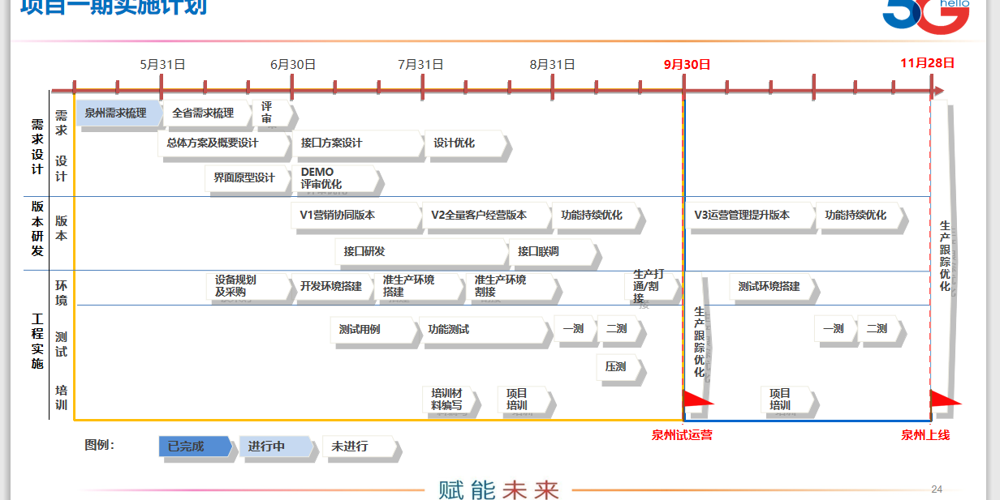
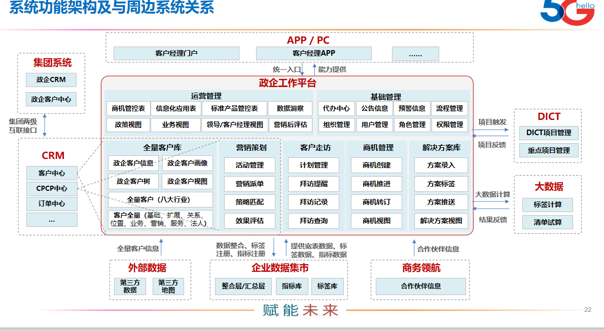

这个项目计划任务和时间细化，另外下周已经明确的事情往下推进。前2个等我南平回来一起促进，你先了解。
1、完成需求分析和实施方案评审，根据评审结果进行调整和优化。
2、配合政企部做好全省的需求调研工作。
3、项目组启动需求规格说明书和项目技术方案的编写，预计花2周时间，根据调研情况不断完善。

## 上线时间段

### 6-8月这段时间：

- V1版本： 营销协同版本

  全量政企客户市场空间
  360全景政企客户视图   -- 来自crm？如何嵌套问题
  全量清单级客户派单营销
  政企三张表管控
  营销过程运营管控

- V2版本：全量客户经验版本

#### 版本具体内容

1. 界面原型设计
2. 需求说明书
3. 技术方案书
4. 设备规划采购
5. 接口方案与研发
6. 功能研发

### 8.31开始测试

### 9.30试运营

## 功能架构

## V1版本
### 全量的客户信息
1. 全量客户获取整合
	1.1 批量导入 支撑对非CRM在网客户数据维护，进行信息增强。
	1.2 CRM在网客户数据同步
	
2. 全量客户管理维护

   

3. CRM在网客户清理归并

4. CRM客户数据动态关联
### 客户的全量信息
1. 客户的客观信息
2. 客户的业务信息
3. 客户的标签信息
4. 客户的商机信息
5. 客户的营销信息
### 政企客户树
### 政企客户视图

## 2020 06.01