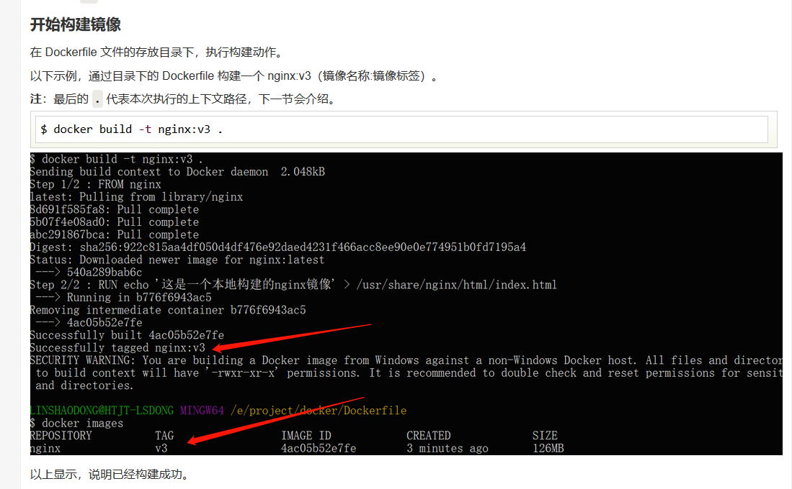

# 工具快捷键使用

  主要介绍一些工具使用的快捷键内容

## 火狐快捷键
ctrl+table，ctrl+shift+table 切换页面
ctrl+n ctrl+w 快速开启/关闭一个页面
## sublime

Alt+F3 选中文本按下快捷键，即可一次性选择全部的相同文本进行同时编辑
ctrl+shift+l 批量处理多行、


## IDEA

### 基于默认的修改
#### 编辑
F6 移动class
ctrl+y 删除一行
ctrl+d 复制当前行  ctrl+w 一层层复制
ctrl+shift+f9 编译文件
ctrl+alt+建好
F6 移动class
ctrl+F12 类的所有方法
ctrl+e打开最近文件
alt+f1 切换导航栏 alt+1
ctrl+f12看类的方法
ctrl+shift+f 查找
ctrl+alt+u 继承树
ctrl+alt+b 实现
ctrl+u 接口
ctrl+shift+a 弹出动作框
alt+shift+箭号  移动代码


#### 启动应用
ctrl+f9 build project
shift +f9 debug启动
shift+f2 停止


基于eclipse copy修改
ctrl+shift+f9 编译文件
shift+f1 定位下一个错误
ctrl+f1 提示异常内容
alt+shift+r 修改变量名称
ctrl+tab 代码中切换
ctrl+shift+o 去除无用的包
ctrl+home 回到首个字符
ctrl+end 到最后一个字符
alt+enter  接口上时候，实现类或者其他操作，包的时候操作包内容
alt+insert 接口上会实现类 类上  getsetter
shift+shifit 用名称查找相关文件
ctrl+h  查找所有文件中的内容
ctrl+shift+l 打开文件夹
ctrl+alt+l 格式化代码
自定义快捷键
alt+n 新建java 类

## maven
### 常见的问题
1. 出现peer not authenticated
	解决方案：临时的增加这句话mvn dependency:resolve -Dmaven.wagon.http.ssl.insecure=true -Dmaven.wagon.http.ssl.allowall=true，
	原因： maven3.0.5后增加ssl证书校验
	相关链接： https://stackoverflow.com/questions/15691985/maven-release-peer-not-authenticated
	
2. 下载源码

  mvn dependency:sources -DdownloadSources=true -DdownloadJavadocs=true

3. maven的生命周期管理
    生命周期（clean、default、site）、生命周期与插件的关系，插件与目标的关系？
    生命周期只是一个定义，实际上都市由插件执行，一个插件包含了多个目标
    
4. 插件的参数配置
    通过命令行，mvn install -Dmaven.test.skip=true
    
5. 插件的调用
    mvn 《插件名称|前缀》：《目标》[-D参数名=参数值]
    插件的解析过程：插件一样有着插件仓库pluginGroups 记录地址， 也有groupID和a'r
    只是插件有默认的groupId（org.apache.maven.plugins）,可以步指定
    前缀通过maven-metaata.xml做了映射，标识是哪个groupid
    
6. 插件的解析过程

    

7.强制更新包

**mvn clean install -e -U**

8. pom 的repositories作用范围

```
repositories的传递只在父子目录上
```
9. depencymanagement会不会去下载包
    不会

10. maven依赖树分析

  ```
  mvn dependency:tree -Dverbose -Dincludes=com.google.guava:guava  
  ```

mvn clean install -U -X 显示更多的日志信息

maven-assembly-plugi

mvn dependency:tree -Dverbose

## Typora

可以拥有不同的主题 推荐 Vue主题 和Bear 主题
- CTRL+SHIFT+L 跳出侧边栏的文件管理大纲
- Ctrl+/打开关闭源代码模式
- 支持html语法的不能实时渲染
- CTRL+SHIFT+I插入图片
- CTRL+K插入地址

 [常用操作](https://zhuanlan.zhihu.com/p/90561228)

## GIT
 最优的存储能⼒力力 
 ⾮非凡的性能
 开源的
 很容易易做备份
 ⽀支持离线操作
 很容易易定制⼯工作流程

### 常见的一些说明
1.最小配置local globle 
2.认识工作区和暂存区
3.文件重命名的简便方法
4.gitlog查看版本历史
5.gitk 图形展示历史
6..git目录的研究
7.commit、tree、blob关系
8.分离头指针要注意的事项
    git checkout   
      ‘hash' 分离头指针，正在工作没有分支的内容，如果没有-b下去 切换分支可能就没了
9.删除不必要的分支
    git branch  查看分支
       -v 看本地多少个分支
       -a 查看所有的包括远程分支
       -d 分支名，删除分支
       -D 删除分支
10.修改commit的message信息、修改老旧commitmessage、连续commit整理成一个、间隔的commit整理成一个
     git commit --m 暂存区提交到版本历史
       -am 工作区直接提交到版本历史
       --amend 修改最新一次提交日志
     git rebase 
       -i hash值 变基操作，基是他的父亲。原理是重新分离头指针。合并多个commit

11.  比较暂存区与HEAD文件的差异 、比较工作区和暂存区文件差异、看指定提交文件的差异、和仓库的对比
    git diff  **默认比较工作区和暂存区的区别所有**
       -- 文件名 只会比对特地的文件。
       HEAD HEAD~1 查看版本的区别 
       --cached 比对暂存区与HEAD中的区别 git diff --cached
       两个分支名称 -- 文件名 对不同分支的文件进行比较  git diff temp master -- index.html
       两个commit值 -- 文件名 对不同分支的commit进行比较  git diff 32322 11122 -- index.html
12.暂存区恢复成和HEAD一样、工作区恢复成和暂存区一样、取消暂存区文件的更改
     git reset 变更暂存区的内容
       HEAD 暂存区的恢复和HEAD中一样，所有文件
       HEAD -- {文件名} 对单个或者多个文件
       --hard hash值 头指针指向新的hash 同时暂存区和工作区也都恢复
                  git reset --hard fcbf4c66c4a22
     git checkout   
    		-- {文件名} 暂存区恢复到工作区上  git checkout -- 1.txt
13.消除最近几次提交、删除文件方法
      git reset 
           --hard hash值 头指针指向新的hash 同时暂存区和工作区也都恢复
                  git reset --hard fcbf4c66c4a22
14.临时加塞紧急任务处理

	git stash  把当前**工作区**的内容存储起来
	   list 看多少东西有存储
	   pop 把存储的弹出并删除当前zhan
	   apply 弹出保留栈
15.指定不需要管理的文件
16.git仓库被分到本地
17.配置公私钥和远端进行连接。
 先看本地有没有 公私yao配置  ls -al ~/.ssh
 无则创建一个  ssh-keygen -t rsa -b 4096 -C "731291014@qq.com"
 把公钥贴到github上，通过ssh -T git@github.com来进行测hi
18.远端创建一个项目和本地的项目进行 合并提交 
    git remote add github git@github.com:zhenglzh/watch_git_objects.git
    push fetch
19.模拟两个人来进行提交
    不同人修改不同文件  merge
    不同人修改相同文件不同区域 merge
    不同人修改相同文件相同区域 ，会冲突。一定要记得先fetch或者pulll ，在merge
    不同人变更文件为不同文件名，会冲突
20.禁止push -f 操作、不要对集成分支改变历史rebase
21.github上的搜索使用 in:readme stars:>5000
22.github组织类型仓库、team成员、创建一个组织仓库等
22.结合idea使用 

23.git流程的几个开发主干开发、 gitflow、gitlab flow、github flow
24.挑选分支进行合并集中合并策略的不一样内容，commit merge ，merge commit ，rebase merge
25.projects中看板查看
26.gitlab功能说明
27.本地还没提交，用reset 不会删除，要用clean， untraancked file   
    git clean -df
	git-clean - Remove untracked files from the working tree

### 内容说明
#### 配置user信息
$ git config --global  user.name ‘your_name’ 
$ git config --global  user.email ‘your_email@domain.com’ 


展示：


删除：


#### 建仓库

两种⽅方式： 

1. ⽤用 Git 之前已经有项⽬目代码
$ cd 项⽬目代码所在的⽂文件夹 $ git init 
2. ⽤用 Git 之前还没有项⽬目代码
$ cd 某个⽂文件夹 $ git init your_project    #会在当前路路径下创建和项⽬目名称同名的⽂文件夹 $ $cd  your_project      

#### 其他内容
工作目录、暂存区、版本历史
熟悉add、commit、mv、log、gitk命令

#### .git目录内容


HEAD：整个仓库正在工作哪个分支上 指向refs里面的内容
config：配置信息用户等
refs文件夹：

tags 标签可以里程碑打一个
heads 文件夹里面是 有分支，master test，master文件里面存放的是hash值，就是最后的commit
objects文件夹：

pack文件夹：git打包文件在这边
通过外面的英文和里面的叠加可以看到内容

#### blob、tree、commit对象关系
一个commit 是当时的一个快照 里面包含了tree ，一个目录一个tree，blob是具体内容
当我们add时候就已经把内容放到.git/objects 里面中一个blob
git cat-file -p 083e18d
#### 常用命令
git add  增加 
   -u 已经被git管控的文件进行更新
git rm 删除工作区并提交到暂存区
git commit --m 暂存区提交到版本历史
   -am 工作区直接提交到版本历史
   --amend 修改最新一次提交日志
git reset --hard 把暂存区和工作区还原回去 
git mv 变化工作目录内容和添加到暂存区
git log 看当前分支版本演变历史
  --oneline 行看
  -n4 看最近几次提交 
  --all 查看所有分支演进历史
  --graph 图形分支查看
  temp 查看 temp 分支
git branch  查看分支
   -v 看本地多少个分支
   -a 查看所有的包括远程分支
   -d 分支名，删除分支
   -D 删除分支
git checkout   
  -b 目录  ‘hash值’/远端路劲     创建分支并到该分支里面
  分支名称  切换分支
  ‘hash' 分离头指针，正在工作没有分支的内容，如果没有-b下去 切换分支可能就没了
  -- 文件名 暂存区恢复到工作区上  git checkout -- 1.txt
git cat-file  看一个对象
   -t ‘hash’ 类型
   -p 看内容
git diff  **默认比较工作区和暂存区的区别所有**
   -- 文件名 只会比对特地的文件。
   HEAD HEAD~1 查看版本的区别 
   --cached 比对暂存区与HEAD中的区别 git diff --cached
   两个分支名称 -- 文件名 对不同分支的文件进行比较  git diff temp master -- index.html
   两个commit值 -- 文件名 对不同分支的commit进行比较  git diff 32322 11122 -- index.html
git rebase 
   -i hash值 变基操作，基是他的父亲。原理是重新分离头指针。合并多个commit
git reset 变更暂存区的内容
   HEAD 暂存区的恢复和HEAD中一样，所有文件
   HEAD -- 文件名 对单个或者多个文件
   --hard hash值 头指针指向新的hash 同时暂存区和工作区也都恢复
              git reset --hard fcbf4c66c4a22
git stash  把当前**工作区**的内容存储起来
   list 看多少东西有存储
   pop 把存储的弹出并删除当前zhan
   apply 弹出保留栈
.gitignore 文件可以做配置 把一些不需要的文件不进行管控提交	
git clone 克隆一个仓库内容
  哑协议和远程协议的区别 具体看图


  协议路劲 目录
  --bare 不复制工作区内容
  git clone --bare file:///e/BaiduNetdiskDownload/git_learning/watch_git_objects
git remote 
   -v 看当前有没有远端备份内容
   add 名称 路劲
   git remote add zhineng file:///e/BaiduNetdiskDownload/git_learning/watch_git_objects_remote/watch_git_objects.git
git push 当前分支push到远端
    远端站点  分支
    远端站点 --all  所有分支
git merge 合并树图看，本地会重新一次commit ，有两个父亲。与rebase不同
    名称 
git fetch 从远端拉去
  git fetch github master
git pull 拉取同时做merge行为 相当于 fetch有merge
gitk 图形界面查看版本历史
   --all 搜索数据都选上

1. 在已有的git内容上推送到另外一个仓库 不影响当前仓库

   git push https://github.com/b/b.git mybranch:remote_branch_name 
   
   git push http://10.128.22.195:8080/test_gitlab_group/dgewp.git dev-20210220:dev-20210220

## docker
-t -i -d -p

拉取镜像

docker pull sonatype/nexus3

docker images
**-a :**列出本地所有的镜像（含中间映像层，默认情况下，过滤掉中间映像层）；
**--digests :**显示镜像的摘要信息；
**-f :**显示满足条件的镜像；
**--format :**指定返回值的模板文件；
**--no-trunc :**显示完整的镜像信息；
**-q :**只显示镜像ID。

1. 查看所有的容器命令如下：
    $ docker ps -a

2. 使用 docker start 启动一个已停止的容器：
    $ docker start b750bbbcfd88 

3. 在大部分的场景下，我们希望 docker 的服务是在后台运行的，我们可以过 -d 指定容器的运行模式。
    $ docker run -itd --name ubuntu-test ubuntu /bin/bash

4. 停止容器的命令如下： 
    $ docker stop <容器 ID>

5. 停止的容器可以通过 docker restart 重启：
    $ docker restart <容器 ID>

6. 在使用 -d 参数时，容器启动后会进入后台。此时想要进入容器，可以通过以下指令进入：
    docker exec：推荐大家使用 docker exec 命令，因为此退出容器终端，不会导致容器的停止。
    docker exec -it 243c32535da7 /bin/bash

7. 导出本地某个容器，可以使用 docker export 命令。
    docker export 1e560fca3906 > ubuntu.tar

8. 导入容器快照
    $ cat docker/ubuntu.tar | docker import - test/ubuntu:v1

  docker load -i .\activiti-web-2.0.9-SNAPSHOT.tar

9. 删除容器
    docker rm -f 1e560fca3906

10. docker run -d -p 5000:5000 training/webapp python app.py

11. 容器端口的映射情况
    docker port bf08b7f2cd89

12. Docker 的底层信息
     docker inspect 

13. 创建镜像
- 从已经创建的容器中更新镜像，并且提交这个镜像
	docker commit -m="has update" -a="runoob" e218edb10161 runoob/ubuntu:v2
	-m: 提交的描述信息
	-a: 指定镜像作者
	runoob/ubuntu:v2: 指定要创建的目标镜像名
- 使用 Dockerfile 指令来创建一个新的镜像
	1. 创建一个 Dockerfile 文件，其中包含一组指令来告诉 Docker 如何构建我们的镜像。
	2. docker build -t runoob/centos:6.7 .
		-t ：指定要创建的目标镜像名
14. 设置镜像标签
    docker tag 860c279d2fec runoob/centos:dev

15. docker run --rm  退出后会清理掉容器的 data volumes

16. -v 本地目录:容器目录 或 -v 容器目录 

17. 网络互联

	- 宿主机和镜像的连通-P 和-p
	- 容器的几个互联
	- 配置dns
	1. 我们可以在宿主机的 /etc/docker/daemon.json 文件中增加以下内容来设置全部容器的 DNS,是否生效 查看 容器里面的 $ docker run -it --rm  ubuntu  cat etc/resolv.conf
	2. 手动指定容器的配置 $ docker run -it --rm -h host_ubuntu  --dns=114.114.114.114 --dns-search=test.com ubuntu
	参数说明：
	--rm：容器退出时自动清理容器内部的文件系统。
	-h HOSTNAME 或者 --hostname=HOSTNAME： 设定容器的主机名，它会被写到容器内的 /etc/hostname 和 /etc/hosts。
	--dns=IP_ADDRESS： 添加 DNS 服务器到容器的 /etc/resolv.conf 中，让容器用这个服务器来解析所有不在 /etc/hosts 中的主机名。
	--dns-search=DOMAIN： 设定容器的搜索域，当设定搜索域为 .example.com 时，在搜索一个名为 host 的主机时，DNS 不仅搜索 host，还会搜索 host.example.com。

16. dockerfile讲解

    上下文路劲注意 build 时候 不要无用的文件放在里面

    

    

    详细的指令

    - copy 复制指令，从上下文目录中复制文件或者目录到容器里指定路径。

      
      
    - ADD
    
      
    
    - CMD
    
      
    
    - ### ENTRYPOINT
    
      
    
      
    
    - ENV
    
      
    
    - ARG
    
      
    
    - VOLUME
    
      
    
    - WORKDIR
    
      
    
      

17. docker compose

18. 如何进入 docker /bin/bash交互界面

19. 本机数据导入到docker中

    ```bash
    docker cp FILE_PATH 容器ID:/root
    docker cp 容器ID:/root/data.tar /home/user
    ```

22. docker 默认一个在跑数据

    docker run -d centos /bin/sh -c "while true; do echo hello world; sleep 1; done"

    所有的命令都能直接覆盖吗 =》会覆盖

23. docker push 出现：x509: certificate signed by unknown authority
     docker login url 和 insecure-registries需要增加配置
     /etc/docker/daemon.json

24. docker容器跑着为啥会挂掉

    https://segmentfault.com/a/1190000009583997

    Docker 容器启动时，默认会把容器内部第一个进程，也就是`pid=1`的程序，作为docker容器是否正在运行的依据，如果 docker 容器pid=1的进程挂了，那么docker容器便会直接退出。

    通过tail可阻塞，挂起一个主进程，类似前台启动。

25. `docker run .... --restart=always

    

26. docker的日志内容

    查看单个容器的设置的日志驱动

    ```bash
    docker inspect  -f '{{.HostConfig.LogConfig.Type}}'   容器id
    ```