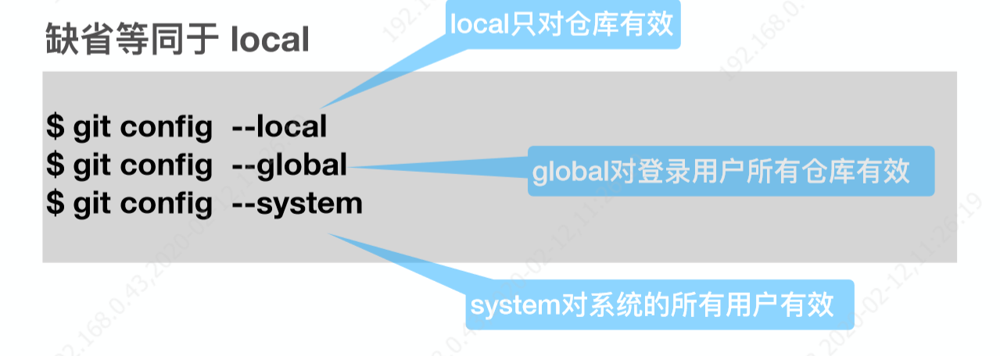

# 工具快捷键使用

  主要介绍一些工具使用的快捷键内容

## Typora

可以拥有不同的主题 推荐 Vue主题 和Bear 主题
- CTRL+SHIFT+L 跳出侧边栏的文件管理大纲
- Ctrl+/打开关闭源代码模式
- 支持html语法的不能实时渲染
- CTRL+SHIFT+I插入图片
- CTRL+K插入地址

 [常用操作](https://zhuanlan.zhihu.com/p/90561228)

## GIT
 最优的存储能⼒力力 
 ⾮非凡的性能
 开源的
 很容易易做备份
 ⽀支持离线操作
 很容易易定制⼯工作流程

### 常见的一些说明
1.最小配置local globle 
2.认识工作区和暂存区
3.文件重命名的简便方法
4.gitlog查看版本历史
5.gitk 图形展示历史
6..git目录的研究
7.commit、tree、blob关系
8.分离头指针要注意的事项
    git checkout   
      ‘hash' 分离头指针，正在工作没有分支的内容，如果没有-b下去 切换分支可能就没了
9.删除不必要的分支
    git branch  查看分支
       -v 看本地多少个分支
       -a 查看所有的包括远程分支
       -d 分支名，删除分支
       -D 删除分支
10.修改commit的message信息、修改老旧commitmessage、连续commit整理成一个、间隔的commit整理成一个
     git commit --m 暂存区提交到版本历史
       -am 工作区直接提交到版本历史
       --amend 修改最新一次提交日志
     git rebase 
       -i hash值 变基操作，基是他的父亲。原理是重新分离头指针。合并多个commit
11.  比较暂存区与HEAD文件的差异 、比较工作区和暂存区文件差异、看指定提交文件的差异、和仓库的对比
    git diff  **默认比较工作区和暂存区的区别所有**
       -- 文件名 只会比对特地的文件。
       HEAD HEAD~1 查看版本的区别 
       --cached 比对暂存区与HEAD中的区别 git diff --cached
       两个分支名称 -- 文件名 对不同分支的文件进行比较  git diff temp master -- index.html
       两个commit值 -- 文件名 对不同分支的commit进行比较  git diff 32322 11122 -- index.html
12.暂存区恢复成和HEAD一样、工作区恢复成和暂存区一样、取消暂存区文件的更改
     git reset 变更暂存区的内容
       HEAD 暂存区的恢复和HEAD中一样，所有文件
       HEAD -- {文件名} 对单个或者多个文件
       --hard hash值 头指针指向新的hash 同时暂存区和工作区也都恢复
                  git reset --hard fcbf4c66c4a22
     git checkout   
  		-- {文件名} 暂存区恢复到工作区上  git checkout -- 1.txt
13.消除最近几次提交、删除文件方法
   git reset 
           --hard hash值 头指针指向新的hash 同时暂存区和工作区也都恢复
                  git reset --hard fcbf4c66c4a22
14.临时加塞紧急任务处理
	git stash  把当前**工作区**的内容存储起来
       list 看多少东西有存储
       pop 把存储的弹出并删除当前zhan
       apply 弹出保留栈
15.指定不需要管理的文件
16.git仓库被分到本地
17.配置公私钥和远端进行连接。
 先看本地有没有 公私yao配置  ls -al ~/.ssh
 无则创建一个  ssh-keygen -t rsa -b 4096 -C "731291014@qq.com"
 把公钥贴到github上，通过ssh -T git@github.com来进行测hi
18.远端创建一个项目和本地的项目进行 合并提交 
    git remote add github git@github.com:zhenglzh/watch_git_objects.git
    push fetch
19.模拟两个人来进行提交
    不同人修改不同文件  merge
    不同人修改相同文件不同区域 merge
    不同人修改相同文件相同区域 ，会冲突。一定要记得先fetch或者pulll ，在merge
    不同人变更文件为不同文件名，会冲突
20.禁止push -f 操作、不要对集成分支改变历史rebase
21.github上的搜索使用 in:readme stars:>5000
22.github组织类型仓库、team成员、创建一个组织仓库等
22.结合idea使用
23.git流程的几个开发主干开发、 gitflow、gitlab flow、github flow
24.挑选分支进行合并集中合并策略的不一样内容
25.projects中看板查看

### 内容说明
#### 配置user信息
$ git config --global  user.name ‘your_name’ 
$ git config --global  user.email ‘your_email@domain.com’ 

展示：

删除：

#### 建仓库

两种⽅方式： 

1. ⽤用 Git 之前已经有项⽬目代码
$ cd 项⽬目代码所在的⽂文件夹 $ git init 
2. ⽤用 Git 之前还没有项⽬目代码
$ cd 某个⽂文件夹 $ git init your_project    #会在当前路路径下创建和项⽬目名称同名的⽂文件夹 $ $cd  your_project      

#### 其他内容
工作目录、暂存区、版本历史
熟悉add、commit、mv、log、gitk命令

#### .git目录内容

HEAD：整个仓库正在工作哪个分支上 指向refs里面的内容
config：配置信息用户等
refs文件夹：

tags 标签可以里程碑打一个
heads 文件夹里面是 有分支，master test，master文件里面存放的是hash值，就是最后的commit
objects文件夹：

pack文件夹：git打包文件在这边
通过外面的英文和里面的叠加可以看到内容

#### blob、tree、commit对象关系
一个commit 是当时的一个快照 里面包含了tree ，一个目录一个tree，blob是具体内容
当我们add时候就已经把内容放到.git/objects 里面中一个blob
git cat-file -p 083e18d
#### 常用命令
git add  增加 
   -u 已经被git管控的文件进行更新
git rm 删除工作区并提交到暂存区
git commit --m 暂存区提交到版本历史
   -am 工作区直接提交到版本历史
   --amend 修改最新一次提交日志
git reset --hard 把暂存区和工作区还原回去 
git mv 变化工作目录内容和添加到暂存区
git log 看当前分支版本演变历史
  --oneline 行看
  -n4 看最近几次提交 
  --all 查看所有分支演进历史
  --graph 图形分支查看
  temp 查看 temp 分支
git branch  查看分支
   -v 看本地多少个分支
   -a 查看所有的包括远程分支
   -d 分支名，删除分支
   -D 删除分支
git checkout   
  -b 目录  ‘hash值’/远端路劲     创建分支并到该分支里面
  分支名称  切换分支
  ‘hash' 分离头指针，正在工作没有分支的内容，如果没有-b下去 切换分支可能就没了
  -- 文件名 暂存区恢复到工作区上  git checkout -- 1.txt
git cat-file  看一个对象
   -t ‘hash’ 类型
   -p 看内容
git diff  **默认比较工作区和暂存区的区别所有**
   -- 文件名 只会比对特地的文件。
   HEAD HEAD~1 查看版本的区别 
   --cached 比对暂存区与HEAD中的区别 git diff --cached
   两个分支名称 -- 文件名 对不同分支的文件进行比较  git diff temp master -- index.html
   两个commit值 -- 文件名 对不同分支的commit进行比较  git diff 32322 11122 -- index.html
git rebase 
   -i hash值 变基操作，基是他的父亲。原理是重新分离头指针。合并多个commit
git reset 变更暂存区的内容
   HEAD 暂存区的恢复和HEAD中一样，所有文件
   HEAD -- 文件名 对单个或者多个文件
   --hard hash值 头指针指向新的hash 同时暂存区和工作区也都恢复
              git reset --hard fcbf4c66c4a22
git stash  把当前**工作区**的内容存储起来
   list 看多少东西有存储
   pop 把存储的弹出并删除当前zhan
   apply 弹出保留栈
.gitignore 文件可以做配置 把一些不需要的文件不进行管控提交	
git clone 克隆一个仓库内容
  哑协议和远程协议的区别 具体看图

  协议路劲 目录
  --bare 不复制工作区内容
  git clone --bare file:///e/BaiduNetdiskDownload/git_learning/watch_git_objects
git remote 
   -v 看当前有没有远端备份内容
   add 名称 路劲
   git remote add zhineng file:///e/BaiduNetdiskDownload/git_learning/watch_git_objects_remote/watch_git_objects.git
git push 当前分支push到远端
    远端站点  分支
    远端站点 --all  所有分支
git merge 合并树图看，本地会重新一次commit ，有两个父亲。与rebase不同
    名称 
git fetch 从远端拉去
  git fetch github master
git pull 拉取同时做merge行为 相当于 fetch有merge
gitk 图形界面查看版本历史
   --all 搜索数据都选上

