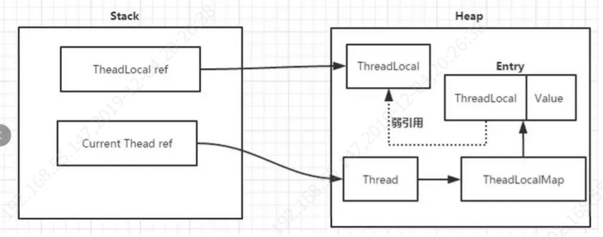

## 并发基础与JDK中的常见并发类

### 基础
#### 乐观锁&悲观锁
#### CAS

### 常见类

#### ThreadLocal
- 介绍
  线程级安全，

- 常见问题
  
  1. 为什么会内存泄漏
  
     ThreadLocalMap的key为ThreadLocal实例，他是一个弱引用，我们知道弱引用有利于GC的回收，当key == null时，GC就会回收这部分空间，但value不一定能被回收，因为他和Current Thread之间还存在一个**强引用**的关系。由于这个强引用的关系，会导致value无法回收，如果线程对象不消除这个强引用的关系，就可能会出现OOM。有些时候，我们调用ThreadLocalMap的remove()方法进行显式处理。
  
     
     
  2. JDK如何避免内存泄漏
  
     ThreadLocal的设计者也意识到了这一点(内存泄漏)， 他们在一些方法中埋了对key=null的value擦除操作。
  
     这里拿ThreadLocal提供的**get()**方法举例，它调用了ThreadLocalMap#getEntry()方法，对key进行了校验和对null key进行擦除。但不彻底，如果不调用get，set就会有问题
  
  3. 为什么不做成强引用
  
      这样会导致threadLocal不能正常被GC回收
