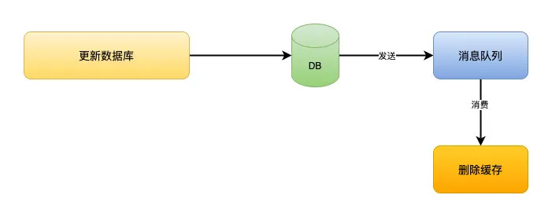

## 缓存有哪些类型？ 
### 本地缓存：

本地缓存就是在进程的内存中进行缓存，比如我们的 JVM 堆中，可以用 LRUMap 来实现，也可以使用 Ehcache 这样的工具来实现。
本地缓存是内存访问，没有远程交互开销，性能最好，但是受限于单机容量，一般缓存较小且无法扩展。
### 分布式缓存：
分布式缓存可以很好得解决这个问题。
分布式缓存一般都具有良好的水平扩展能力，对较大数据量的场景也能应付自如。缺点就是需要进行远程请求，性能不如本地缓存。
### 多级缓存：
为了平衡这种情况，实际业务中一般采用多级缓存，本地缓存只保存访问频率最高的部分热点数据，其他的热点数据放在分布式缓存中。
在目前的一线大厂中，这也是最常用的缓存方案，单考单一的缓存方案往往难以撑住很多高并发的场景。

## 缓存算法

缓存算法，比较常见的是三种：

- LRU（least recently used ，最近最少使用)
- LFU（Least Frequently used ，最不经常使用)
- FIFO（first in first out ，先进先出)

一般的剔除策略有**FIFO 淘汰最早数据**、**LRU 剔除最近最少使用**、和 **LFU 剔除最近使用频率最低**的数据几种策略。

LRU:  最近最少使用，以最近一次访问时间为参考。 LFU: 最近一次被访问次数最少的数据，以次数为参考

关于LRU和LFU的解释 https://blog.csdn.net/a3192048/article/details/82291222

### 手写LRU缓存

手写 LRU 代码的实现，有多种方式。其中，最简单的是基于 LinkedHashMap 来实现，代码如下：

```java
class LRUCache<K, V> extends LinkedHashMap<K, V> {
    private final int CACHE_SIZE;

    /**
     * 传递进来最多能缓存多少数据
     *
     * @param cacheSize 缓存大小
     */
    public LRUCache(int cacheSize) {
        // true 表示让 LinkedHashMap 按照访问顺序来进行排序，最近访问的放在头部，最老访问的放在尾部。
        super((int) Math.ceil(cacheSize / 0.75) + 1, 0.75f, true);
        CACHE_SIZE = cacheSize;
    }

    @Override
    protected boolean removeEldestEntry(Map.Entry<K, V> eldest) {
        // 当 map 中的数据量大于指定的缓存个数的时候，就自动删除最老的数据。
        return size() > CACHE_SIZE;
    }

}
```

其它更复杂，更能体现个人编码能力的 LRU 实现方式，可以看看如下两篇文章：

- [《动手实现一个 LRU Cache》](https://crossoverjie.top/2018/04/07/algorithm/LRU-cache/)
- [《缓存、缓存算法和缓存框架简介》](http://blog.jobbole.com/30940/) 文末，并且还提供了 FIFO、LFU 的代码实现。

## 缓存常见问题

常见的问题，可列举如下：

- 写入问题
  - 缓存何时**写入**？并且写时如何避免并发重复写入？
  - 缓存如何**失效**？
  - 缓存和 DB 的**一致性**如何保证？
- 经典三连问
  - 如何避免缓存**穿透**的问题？
  - 如何避免缓存**击穿**的问题？
  - 如果避免缓存**雪崩**的问题

## 缓存穿透(不存在的数据)

**缓存穿透**。产生这个问题的原因可能是外部的恶意攻击，例如，对用户信息进行了缓存，但恶意攻击者**使用不存在的用户id**频繁请求接口，导致查询缓存不命中，然后穿透 DB 查询依然不命中。这时会有大量请求穿透缓存访问到 DB。


### 方案一，缓存空对象。

当从 DB 查询数据为空，我们仍然将这个空结果进行缓存，具体的值需要使用**特殊的标识**，能和真正缓存的数据区分开。另外，需要设置较短的过期时间，一般建议不要超过 5 分钟。

> 为什么要较短的过期时间？因为缓存久没有意义，也浪费缓存的内存。

#### 遗留问题

1. 空值做了缓存，意味着缓存层中存了更多的键，需要更多的内存空间 ( 如果是攻击，问题更严重 )，比较有效的方法是针对这类数据设置一个较短的过期时间，让其自动剔除。
2. 缓存层和存储层的数据会有一段时间窗口的不一致，可能会对业务有一定影响。例如过期时间设置为 5 分钟，如果此时存储层添加了这个数据，那此段时间就会出现缓存层和存储层数据的不一致，**此时可以利用消息系统或者其他方式清除掉缓存层中的空对象。**

### 方案二，BloomFilter 布隆过滤器。

在缓存服务的基础上，构建 BloomFilter 数据结构，在 BloomFilter 中存储对应的 KEY 是否存在，如果存在，说明该 KEY 对应的值**不为空**。那么整个逻辑的如下：

- 1、根据 KEY 查询【BloomFilter 缓存】。如果不存在对应的值，直接返回；如果存在，继续向下执行。【后续的流程，就是标准的流程】
- 2、根据 KEY 查询在【数据缓存】的值。如果存在值，直接返回；如果不存在值，继续向下执行。
- 3、查询 DB 对应的值，如果存在，则更新到缓存，并返回该值。

可能有胖友不是很了解 BloomFilter 布隆过滤器，会有疑惑，为什么 BloomFilter 不存储 KEY 是不存在的情况（就是我们方案二反过来）？

- BloomFilter 存在误判。简单来说，**存在的不一定存在，不存在的一定不存在**。这样就会导致，一个存在的 KEY 被误判成不存在。
- 同时，BloomFilter**不允许删除**。例如说，一个 KEY 一开始是不存在的，后来数据新增了，但是 BloomFilter 不允许删除的特点，就会导致一直会被判断成不存在。

当然，使用 BloomFilter 布隆过滤器的话，**需要提前将已存在的 KEY ，初始化存储到【BloomFilter 缓存】中**。

#### 遗留问题

1、数据命中不高 2、数据相对固定、实时性低

#### 场景

IP黑名单过滤时候，在做秒杀场景时候，碰到非法的同一个ip攻击把ip 放到过滤器里面设置时间失效

#### 增强版过滤器

可以支持删除的操作 要把原来的bitmap改成数组每个是一个int 类型

#### 布谷鸟过滤器

##### 和布隆过滤器比较

**查询性能弱**是因为布隆过滤器需要使用多个 hash 函数探测位图中多个不同的位点，这些位点在内存上跨度很大，会导致 CPU 缓存行命中率低。

**空间效率低**是因为在相同的误判率下，布谷鸟过滤器的空间利用率要明显高于布隆，空间上大概能节省 40% 多。不过布隆过滤器并没有要求位图的长度必须是 2 的指数，而布谷鸟过滤器必须有这个要求。从这一点出发，似乎布隆过滤器的空间伸缩性更强一些。

**不支持反向删除操作**这个问题着实是击中了布隆过滤器的软肋。在一个动态的系统里面元素总是不断的来也是不断的走。布隆过滤器就好比是印迹，来过来就会有痕迹，就算走了也无法清理干净。比如你的系统里本来只留下 1kw 个元素，但是整体上来过了上亿的流水元素，布隆过滤器很无奈，它会将这些流失的元素的印迹也会永远存放在那里。随着时间的流失，这个过滤器会越来越拥挤，直到有一天你发现它的误判率太高了，不得不进行重建。

##### 概括

###### 布谷鸟哈希

最简单的布谷鸟哈希结构是一维数组结构，会有两个 hash 算法将新来的元素映射到数组的两个位置。如果两个位置中有一个位置为空，那么就可以将元素直接放进去。但是如果这两个位置都满了，它就不得不「鸠占鹊巢」，随机踢走一个，然后自己霸占了这个位置。

```
p1 = hash1(x) % l
p2 = hash2(x) % l
复制代码
```

不同于布谷鸟的是，布谷鸟哈希算法会帮这些受害者（被挤走的蛋）**寻找其它的窝**。因为每一个元素都可以放在两个位置，只要任意一个有空位置，就可以塞进去。所以这个伤心的被挤走的蛋会看看自己的另一个位置有没有空，如果空了，自己挪过去也就皆大欢喜了。但是如果这个位置也被别人占了呢？好，那么它会再来一次「鸠占鹊巢」，将受害者的角色转嫁给别人。然后这个新的受害者还会重复这个过程直到所有的蛋都找到了自己的巢为止。

###### 布谷鸟哈希的问题

但是会遇到一个问题，那就是如果数组太拥挤了，连续踢来踢去几百次还没有停下来，这时候会严重影响插入效率。这时候布谷鸟哈希会设置一个阈值，当连续占巢行为超出了某个阈值，就认为这个数组已经几乎满了。这时候就需要对它进行**扩容**，重新放置所有元素。

还会有另一个问题，那就是可能会存在挤兑循环。比如两个不同的元素，hash 之后的两个位置正好相同，这时候它们一人一个位置没有问题。但是这时候来了第三个元素，它 hash 之后的位置也和它们一样，很明显，这时候会出现挤兑的循环。不过让三个不同的元素经过两次 hash 后位置还一样，这样的概率并不是很高，除非你的 hash 算法太挫了。

布谷鸟哈希算法对待这种挤兑循环的态度就是认为数组太拥挤了，需要扩容（实际上并不是这样）。

**优化**

上面的布谷鸟哈希算法的平均空间利用率并不高，大概只有 50%。到了这个百分比，就会很快出现连续挤兑次数超出阈值。这样的哈希算法价值并不明显，所以需要对它进行改良。

改良的方案之一是**增加 hash 函数，让每个元素不止有两个巢，而是三个巢、四个巢**。这样可以大大降低碰撞的概率，将空间利用率提高到 95%左右。

另一个改良方案是在数组的每个位置上挂上多个座位，这样即使两个元素被 hash 在了同一个位置，也不必立即「鸠占鹊巢」，因为这里有多个座位，你可以随意坐一个。除非这多个座位都被占了，才需要进行挤兑。很明显这也会显著降低挤兑次数。这种方案的空间利用率只有 85%左右，**但是查询效率会很高**，**同一个位置上的多个座位在内存空间上是连续的，可以有效利用 CPU 高速缓存。**

所以更加高效的方案是将上面的两个改良方案融合起来，比如**使用 4 个 hash 函数，每个位置上放 2 个座位。这样既可以得到时间效率，又可以得到空间效率。这样的组合甚至可以将空间利用率提到高 99%，这是非常了不起的空间效率。**

###### 布谷鸟过滤器

布谷鸟过滤器和布谷鸟哈希结构一样，它也是一维数组，但是不同于布谷鸟哈希的是，布谷鸟哈希会存储整个元素，而布谷鸟过滤器中只会存储元素的指纹信息（几个bit，类似于布隆过滤器）。**这里过滤器牺牲了数据的精确性换取了空间效率。正是因为存储的是元素的指纹信息，所以会存在误判率，这点和布隆过滤器如出一辙。**

首先布谷鸟过滤器还是只会选用两个 hash 函数，但是**每个位置可以放置多个座位。**这两个 hash 函数选择的比较特殊，因为过滤器中只能存储指纹信息。当这个位置上的指纹被挤兑之后，它需要计算出另一个对偶位置。而计算这个对偶位置是需要元素本身的，我们来回忆一下前面的哈希位置计算公式。

```
fp = fingerprint(x)
p1 = hash1(x) % l
p2 = hash2(x) % l
```

我们知道了 p1 和 x 的指纹，是没办法直接计算出 p2 的。

**特殊的 hash 函数**

布谷鸟过滤器巧妙的地方就在于设计了一个独特的 hash 函数，使得可以根据 p1 和 元素指纹 直接计算出 p2，而不需要完整的 x 元素。


```
fp = fingerprint(x)
p1 = hash(x)
p2 = p1 ^ hash(fp)  // 异或
```

从上面的公式中可以看出，当我们知道 fp 和 p1，就可以直接算出 p2。同样如果我们知道 p2 和 fp，也可以直接算出 p1 —— 对偶性。


```
p1 = p2 ^ hash(fp)
```

所以我们根本不需要知道当前的位置是 p1 还是 p2，只需要将当前的位置和 hash(fp) 进行异或计算就可以得到对偶位置。而且只需要确保 hash(fp) != 0 就可以确保 p1 != p2，如此就不会出现自己踢自己导致死循环的问题。

也许你会问为什么这里的 hash 函数不需要对数组的长度取模呢？实际上是需要的，但是布谷鸟过滤器强制数组的长度必须是 2 的指数，所以对数组的长度取模等价于取 hash 值的最后 n 位。在进行异或运算时，忽略掉低 n 位 之外的其它位就行。将计算出来的位置 p 保留低 n 位就是最终的对偶位置。

### 方案比较

这两个方案，各有其优缺点。

|          | 缓存空对象                                          | BloomFilter 布隆过滤器                                       |
| :------- | :-------------------------------------------------- | :----------------------------------------------------------- |
| 适用场景 | 1、数据命中不高 2、保证一致性                       | 1、数据命中不高 2、数据相对固定、实时性低3、不支持反向操作删除 |
| 维护成本 | 1、代码维护简单 2、需要过多的缓存空间 3、数据不一致 | 1、代码维护复杂 2、缓存空间占用小                            |

实际情况下，使用方案二比较多。因为，相比方案一来说，更加节省内容，对缓存的负荷更小。

### 小结

- [RedisBloom](https://github.com/RedisBloom/RedisBloom)

  > Redis 4.0 引入 Module 机制，支持 Server 自定义拓展。而 RedisBloom ，就是 Redis BloomFilter 的拓展。

- [Redis-Lua-scaling-bloom-filter](https://github.com/erikdubbelboer/Redis-Lua-scaling-bloom-filter)

  > Lua 脚本，实现 BloomFilter 的功能。

- [Redisson BloomFilter](https://github.com/redisson/redisson/wiki/6.-分布式对象#68-布隆过滤器bloom-filter)

  > Java Redis 库，实现 BloomFilter 的功能。

- 其它文章

  - [《Google Guava之BloomFilter 源码分析及基于 Redis 的重构》](https://segmentfault.com/a/1190000012620152)
  - [《基于 Redis 的 BloomFilter 实现》](https://segmentfault.com/a/1190000017370384)

> 艿艿的遐想：因为 BloomFilter 布隆过滤器存在的误判的情况，如果最后去 DB 查询不到数据的情况，是不是可以结合方案一，缓存空对象到【BloomFilter 缓存】中。后来想想，必要性不大，因为 BloomFilter 布隆过滤器误判率很低，没必要把方案复杂化，大道至简。

------

另外，推荐看下 [《Redis架构之防雪崩设计：网站不宕机背后的兵法》](https://mp.weixin.qq.com/s/TBCEwLVAXdsTszRVpXhVug) 文章的 [「一、缓存穿透预防及优化」](http://svip.iocoder.cn/Cache/Interview/#) ，大神解释的更好，且提供相应的图和伪代码。

### 场景举例

1、IP黑名单过滤时候，在做秒杀场景时候，碰到非法的同一个ip攻击把ip 放到过滤器里面设置时间失效

2、业务场景中判断用户是否阅读过某视频或文章，比如抖音或头条，当然会导致一定的误判，但不会让用户看到重复的内容。

3、 用户读取过的消息内容

## 缓存击穿（热点数据失效）

**缓存击穿**，就是某个**热点数据失效时**，大量针对这个数据的请求会穿透到数据源。

### 方案一，使用互斥锁。

请求发现缓存不存在后，去查询 DB 前，使用分布式锁，保证有且只有一个线程去查询 DB ，并更新到缓存。流程如下：

- 1、获取分布式锁，直到成功或超时。如果超时，则抛出异常，返回。如果成功，继续向下执行。
- 2、获取缓存。如果存在值，则直接返回；如果不存在，则继续往下执行。😈 因为，获得到锁，可能已经被“那个”线程去查询过 DB ，并更新到缓存中了。
- 3、查询 DB ，并更新到缓存中，返回值。

### 方案二，手动过期

缓存上从不设置过期时间，功能上将过期时间存在 KEY 对应的 VALUE 里。流程如下：

- 1、获取缓存。通过 VALUE 的过期时间，判断是否过期。如果未过期，则直接返回；如果已过期，继续往下执行。
- 2、通过一个后台的异步线程进行缓存的构建，也就是“手动”过期。通过后台的异步线程，保证有且只有一个线程去查询 DB。
- 3、同时，虽然 VALUE 已经过期，**还是直接返回。**通过这样的方式，保证服务的可用性，虽然损失了一定的时效性。

### 方案比较

这两个方案，各有其优缺点。

|      | 使用互斥锁                          | 手动过期                  |
| :--- | :---------------------------------- | :------------------------ |
| 优点 | 1、思路简单 2、保证一致性           | 1、性价最佳，用户无需等待 |
| 缺点 | 1、代码复杂度增大 2、存在死锁的风险 | 1、无法保证缓存一致性     |

具体使用哪一种方案，胖友可以根据自己的业务场景去做选择。

- 有一点要注意，上述的两个方案，都是建立在**极度“热点”**数据存在的情况，所以实际场景下，需要结合 [「如果避免缓存”穿透”的问题？」](http://svip.iocoder.cn/Cache/Interview/#) 的方案，一起使用。

## 缓存雪崩（缓存挂掉）

**缓存雪崩**，产生的原因是缓存挂掉，这时所有的请求都会穿透到 DB。

### 方案一（缓存高可用）

通过搭建缓存的高可用，避免缓存挂掉导致无法提供服务的情况，从而降低出现缓存雪崩的情况。

假设我们使用 Redis 作为缓存，则可以使用 Redis Sentinel 或 Redis Cluster 实现高可用。

### 方案二（本地缓存）

如果使用本地缓存时，即使分布式缓存挂了，也可以将 DB 查询到的结果缓存到本地，避免后续请求全部到达 DB 中。

当然，引入本地缓存也会有相应的问题，例如说：

- 本地缓存的实时性怎么保证？
  - 方案一，可以引入消息队列。在数据更新时，发布数据更新的消息；而进程中有相应的消费者消费该消息，从而更新本地缓存。
  - 方案二，设置较短的过期时间，请求时从 DB 重新拉取。
  - 方案三，使用 [「如果避免缓存”击穿”的问题？」](http://svip.iocoder.cn/Cache/Interview/#) 问题的【方案二】，手动过期。
- 每个进程可能会本地缓存相同的数据，导致数据浪费？
  - 方案一，需要配置本地缓存的过期策略和缓存数量上限。

> 艿艿：上述的几个方案写的有点笼统，如果有不理解的地方，请在星球给艿艿留言。

如果我们使用 JVM ，则可以使用 Ehcache、Guava Cache 实现本地缓存的功能。

### 方案三（请求 DB 限流）

通过限制 DB 的每秒请求数，避免把 DB 也打挂了。这样至少能有两个好处：

1. 可能有一部分用户，还可以使用，系统还没死透。
2. 未来缓存服务恢复后，系统立即就已经恢复，无需再处理 DB 也挂掉的情况。

当然，被限流的请求，我们最好也要有相应的处理，走【服务降级】，提供一些默认的值，或者友情提示，甚至空白的值也行。

如果我们使用 Java ，则可以使用 Guava RateLimiter、Sentinel、Hystrix 实现限流的功能。

### 方案四（提前演练）

在项目上线前，演练缓存宕掉后，应用以及后端的负载情况以及可能出现的问题，在此基础上做一些预案设定。

## 淘汰策略
不管是本地缓存还是分布式缓存，为了保证较高性能，都是使用内存来保存数据，由于成本和内存限制，当存储的数据超过缓存容量时，需要对缓存的数据进行剔除。

一般的剔除策略有**FIFO 淘汰最早数据**、**LRU 剔除最近最少使用**、和 **LFU 剔除最近使用频率最低**的数据几种策略。

LRU:  最近最少使用，以最近一次访问时间为参考。 LFU: 最近一次被访问次数最少的数据，以次数为参考

关于LRU和LFU的解释 https://blog.csdn.net/a3192048/article/details/82291222

```txt
noeviction:返回错误当内存限制达到并且客户端尝试执行会让更多内存被使用的命令（大部分的写入指令，但DEL和几个例外）

allkeys-lru: 尝试回收最少使用的键（LRU），使得新添加的数据有空间存放。

volatile-lru: 尝试回收最少使用的键（LRU），但仅限于在过期集合的键,使得新添加的数据有空间存放。

allkeys-random: 回收随机的键使得新添加的数据有空间存放。

volatile-random: 回收随机的键使得新添加的数据有空间存放，但仅限于在过期集合的键。

volatile-ttl: 回收在过期集合的键，并且优先回收存活时间（TTL）较短的键,使得新添加的数据有空间存放。

如果没有键满足回收的前提条件的话，策略volatile-lru, volatile-random以及volatile-ttl就和noeviction 差不多了。
```

### 手写LRU缓存


## Memcache的限制

```txt
key 不能超过 250 个字节；
value 不能超过 1M 字节；
key 的最大失效时间是 30 天；
只支持 K-V 结构，不提供持久化和主从同步功能。
```

- 与 MC 不同的是，Redis 采用单线程模式处理请求。这样做的原因有 2 个：一个是因为采用了非阻塞的异步事件处理机制；另一个是缓存数据都是内存操作 IO 时间不会太长，单线程可以避免线程上下文切换产生的代价。
- **Redis** 支持持久化，所以 Redis 不仅仅可以用作缓存，也可以用作 NoSQL 数据库。
- 相比 MC，**Redis** 还有一个非常大的优势，就是除了 K-V 之外，还支持多种数据格式，例如 list、set、sorted set、hash 等。
- **Redis** 提供主从同步机制，以及 **Cluster** 集群部署能力，能够提供高可用服务。

## 缓存更新方式

缓存的数据在数据源发生变更时需要对缓存进行更新，数据源可能是 DB，也可能是远程服务。更新的方式可以是主动更新。数据源是 DB 时，可以在更新完 DB 后就直接更新缓存。

当数据源不是 DB 而是其他远程服务，可能无法及时主动感知数据变更，这种情况下一般会选择对缓存数据设置失效期，也就是数据不一致的**最大容忍时间**。

这种场景下，可以选择失效更新，key 不存在或失效时先请求数据源获取最新数据，然后再次缓存，并更新失效期。

但这样做有个问题，如果依赖的远程服务在更新时出现异常，则会导致数据不可用。改进的办法是异步更新，就是当失效时先不清除数据，继续使用旧的数据，**然后由异步线程去执行更新任务**。这样就避免了失效瞬间的空窗期。另外还有一种纯异步更新方式，定时对数据进行分批更新。实际使用时可以根据业务场景选择更新方式。

## 数据不一致

第二个问题是数据不一致的问题，可以说只要使用缓存，就要考虑如何面对这个问题。缓存不一致产生的原因一般是主动更新失败，例如更新 DB 后，更新 **Redis** 因为网络原因请求超时；或者是异步更新失败导致。

解决的办法是，如果服务对耗时不是特别敏感**可以增加重试**；如果服务对耗时敏感可以通过**异步补偿任务**处理失败的更新，或者短期的数据不一致不会影响业务，那么只要下次更新时可以成功，能保证最终一致性就可以。

### 1. 先删缓存，再更新数据库

   先删除缓存，数据库还没有更新成功，此时如果读取缓存，缓存不存在，去数据库中读取到的是旧值，缓存不一致发生。

   

#### 解决方案- 延时双删
   延时双删的方案的思路是，为了避免更新数据库的时候，其他线程从缓存中读取不到数据，就在更新完数据库之后，再sleep一段时间，然后再次删除缓存。

   sleep的时间要对业务读写缓存的时间做出评估，sleep时间大于读写缓存的时间即可。

   流程如下：

   1. 线程1删除缓存，然后去更新数据库
   2. 线程2来读缓存，发现缓存已经被删除，所以直接从数据库中读取，这时候由于线程1还没有更新完成，所以读到的是旧值，然后把旧值写入缓存
   3. 线程1，根据估算的时间，sleep，由于sleep的时间大于线程2读数据+写缓存的时间，所以缓存被再次删除
   4. 如果还有其他线程来读取缓存的话，就会再次从数据库中读取到最新值

   
### 2. 先更新数据库，再删除缓存

如果反过来操作，先更新数据库，再删除缓存呢？

这个就更明显的问题了，更新数据库成功，如果删除缓存失败或者还没有来得及删除，那么，其他线程从缓存中读取到的就是旧值，还是会发生不一致。


#### 解决方案-消息队列

这是网上很多文章里都有写过的方案。但是这个方案的缺陷会更明显一点。

先更新数据库，成功后往消息队列发消息，消费到消息后再删除缓存，借助消息队列的重试机制来实现，达到最终一致性的效果。



这个解决方案其实问题更多。

1. 引入消息中间件之后，问题更复杂了，怎么保证消息不丢失更麻烦
2. 就算更新数据库和删除缓存都没有发生问题，消息的延迟也会带来短暂的不一致性，不过这个延迟相对来说还是可以接受的

#### 解决方案-进阶版消息队列

为了解决缓存一致性的问题单独引入一个消息队列，太复杂了。

其实，一般大公司本身都会有监听binlog消息的消息队列存在，主要是为了做一些核对的工作。

这样，我们可以借助监听binlog的消息队列来做删除缓存的操作。这样做的好处是，不用你自己引入，侵入到你的业务代码中，中间件帮你做了解耦，同时，中间件的这个东西本身就保证了高可用。

当然，这样消息延迟的问题依然存在，但是相比单纯引入消息队列的做法更好一点。

而且，如果并发不是特别高的话，这种做法的实时性和一致性都还算可以接受的。


### 3. 设置缓存过期时间

每次放入缓存的时候，设置一个过期时间，比如5分钟，以后的操作只修改数据库，不操作缓存，等待缓存超时后从数据库重新读取。

如果对于一致性要求不是很高的情况，可以采用这种方案。

这个方案还会有另外一个问题，就是如果数据**更新的特别频繁，不一致性的问题就很大了。**

在实际生产中，我们有一些活动的缓存数据是使用这种方式处理的。

因为活动并不频繁发生改变，而且对于活动来说，短暂的不一致性并不会有什么大的问题。

### 4.  为什么是删除，而不是更新缓存？

我们以**先更新数据库，再删除缓存**来举例。

如果是更新的话，那就是**先更新数据库，再更新缓存**。

举个例子：如果数据库1小时内更新了1000次，那么缓存也要更新1000次，但是这个缓存可能在1小时内只被读取了1次，那么这1000次的更新有必要吗？

反过来，如果是删除的话，就算数据库更新了1000次，那么也只是做了1次缓存删除，只有当缓存真正被读取的时候才去数据库加载。


### 5. 总结

首先，我们要明确一点，缓存不是更新，而应该是删除。

删除缓存有两种方式：

1. 先删除缓存，再更新数据库。解决方案是使用延迟双删。
2. 先更新数据库，再删除缓存。解决方案是消息队列或者其他binlog同步，引入消息队列会带来更多的问题，并不推荐直接使用。

针对缓存一致性要求不是很高的场景，**那么只通过设置超时时间就可以了。**

其实，如果不是很高的并发，无论你选择先删缓存还是后删缓存的方式，都几乎很少能产生这种问题，但是在高并发下，你应该知道怎么解决问题.

当然，以上种种方案，各有其复杂性，如果胖友心里没底，还是仅仅使用如下任一方案：

- “**先淘汰缓存，再写数据库**”的方案，并且无需引入分布式锁。

  > 沈剑大佬，比较支持这种方案，见 [《缓存架构设计细节二三事》](https://www.w3cschool.cn/architectroad/architectroad-cache-architecture-design.html) 。
  >
  > 可能出现在写数据库，有人在查一次缓存导致数据不一致

- “**先写数据库，再更新缓存**”的方案，并且无需引入定时任务或者消息队列。

  > 左耳朵耗子，比较支持这种方案，[《缓存更新的套路》](https://coolshell.cn/articles/17416.html)。
  >
  > 一个是读操作，但是没有命中缓存，然后就到数据库中取数据，此时来了一个写操作，写完数据库后，让缓存失效，然后，之前的那个读操作再把老的数据放进去，所以，会造成脏数

原因如下：

> FROM 基友老梁的总结
>
> 使用缓存过程中，经常会遇到缓存数据的不一致性和脏读现象。一般情况下，采取缓存双淘汰机制，在更新数据库的**前**淘汰缓存。此外，设定超时时间，例如三十分钟。
>
> **极端场景下，即使有脏数据进入缓存，这个脏数据也最存在一段时间后自动销毁。**

- 重点，是最后一句话哟。
- 真的，和几个朋友沟通了下，真的出现不一致的情况，靠缓存过期后，重新从 DB 中读取即可。

另外，在 DB 主从架构下，方案会更加复杂。详细可以看看 [《主从 DB 与 cache 一致性优化》](https://www.w3cschool.cn/architectroad/architectroad-consistency-of-cache-with-master-and-slave-database.html) 。

> 艿艿：这是一道相对复杂的问题，重点在于理解为什么产生不一致的原因，然后针对这个原因去解决。

## CRM场景说明

1. 缓存的内容有CRM的元数据,这种就是通过统一的binglog来处理,同时也支持手动同步的方式,crm受理的客户的资产信息,如客户的产品实例.销售品实例,都有用到 ,个别的是通过单独的设置处理,以前一直纠结的就是先删缓存还是先处理数据库,后面定下来就是先处理数据库,对我们来说可以允许一段时间的不一致性,同时对于受理我们受理完后会重新清理一次档案信息.这种就是一次性的方式,对于工作台的消息内容,通过bollomfilter来处理.

## 什么是缓存预热？如何实现缓存预热？

### 缓存预热

在刚启动的缓存系统中，如果缓存中没有任何数据，如果依靠用户请求的方式重建缓存数据，那么对数据库的压力非常大，而且系统的性能开销也是巨大的。

此时，最好的策略是启动时就把热点数据加载好。这样，用户请求时，直接读取的就是缓存的数据，而无需去读取 DB 重建缓存数据。

举个例子，热门的或者推荐的商品，需要提前预热到缓存中。

### 如何实现

一般来说，有如下几种方式来实现：

1. 数据量不大时，项目启动时，自动进行初始化。
2. 写个修复数据脚本，手动执行该脚本。
3. 写个管理界面，可以手动点击，预热对应的数据到缓存中。

## 缓存数据淘汰策略

除了缓存服务器自带的缓存**自动**失效策略之外，我们还可以根据具体的业务需求进行自定义的**“手动”**缓存淘汰，常见的策略有两种：

- 1、定时去清理过期的缓存。
- 2、当有用户请求过来时，再判断这个请求所用到的缓存是否过期，过期的话就去底层系统得到新数据并更新缓存。

两者各有优劣，第一种的缺点是维护大量缓存的 key 是比较麻烦的，第二种的缺点就是每次用户请求过来都要判断缓存失效，逻辑相对比较复杂！
具体用哪种方案，大家可以根据自己的应用场景来权衡。

## 缓存po对象

实际场景下，缓存值可能是一个 POJO 对象，就需要考虑如何 POJO 对象存储的问题。目前有两种方式：

- 方案一，将 POJO 对象

  序列化

  进行存储，适合 Redis 和 Memcached 。

  - 可参考 [《Redis 序列化方式StringRedisSerializer、FastJsonRedisSerializer 和 KryoRedisSerializer》](https://blog.csdn.net/xiaolyuh123/article/details/78682200) 文章。
  - 对于 POJO 对象比较大，可以考虑使用压缩算法，例如说 Snappy、zlib、GZip 等等。

- 方案二，使用 Hash 数据结构，适合 Redis 。

  - 可参考 [《Redis 之序列化 POJO》](https://my.oschina.net/yuyidi/blog/499951) 文章。

不过对于 Redis 来说，大多数情况下，会考虑使用 JSON 序列化的方案。想要深入的胖友，可以看看如下两篇文章，很有趣：

- [《Redis 内存压缩实战》](http://www.iocoder.cn/Fight/Redis-memory-compression-combat/?self) ，Redis HASH 数据结构，可以通过 ziplist 的编码方式，压缩数据。
- [《redis-strings-vs-redis-hashes-to-represent-json-efficiency》](https://stackoverflow.com/questions/16375188/redis-strings-vs-redis-hashes-to-represent-json-efficiency) ，重点看 BMiner 的回答，提供了四种方案，非常有趣。

##  分布式锁的处理

```redis
SETEX key seconds value //这是一个原子操作 设置key对应的时间及值
```

### settex

知道我之前说这个命令的原因了吧，设置一个过期时间，就算线程1挂了，也会在失效时间到了，自动释放。

我这里就用到了nx和px的结合参数，就是set值并且加了过期时间，这里我还设置了一个过期时间，就是这时间内如果第二个没拿到第一个的锁，就退出阻塞了，因为可能是客户端断连了。


整体加锁的逻辑比较简单，大家基本上都能看懂，不过我拿到当前时间去减开始时间的操作感觉有点笨， System.currentTimeMillis()消耗很大的。

```
/**
 * 加锁
 *
 * @param id
 * @return
 */
public boolean lock(String id) {
    Long start = System.currentTimeMillis();
    try {
        for (; ; ) {
            //SET命令返回OK ，则证明获取锁成功
            String lock = jedis.set(LOCK_KEY, id, params);
            if ("OK".equals(lock)) {
                return true;
            }
            //否则循环等待，在timeout时间内仍未获取到锁，则获取失败
            long l = System.currentTimeMillis() - start;
            if (l >= timeout) {
                return false;
            }
            try {
                Thread.sleep(100);
            } catch (InterruptedException e) {
                e.printStackTrace();
            }
        }
    } finally {
        jedis.close();
    }
}
```

System.currentTimeMillis消耗大，每个线程进来都这样，我之前写代码，就会在服务器启动的时候，开一个线程不断去拿，调用方直接获取值就好了，不过也不是最优解，日期类还是有很多好方法的。

```
@Service
public class TimeServcie {
    private static long time;
    static {
        new Thread(new Runnable(){
            @Override
            public void run() {
                while (true){
                    try {
                        Thread.sleep(5);
                    } catch (InterruptedException e) {
                        e.printStackTrace();
                    }
                    long cur = System.currentTimeMillis();
                    setTime(cur);
                }
            }
        }).start();
    }

    public static long getTime() {
        return time;
    }

    public static void setTime(long time) {
        TimeServcie.time = time;
    }
}
```

### 解锁

解锁的逻辑更加简单，就是一段Lua的拼装，把Key做了删除。

你们发现没，我上面加锁解锁都用了UUID，这就是为了保证，谁加锁了谁解锁，要是你删掉了我的锁，那不乱套了嘛。

LUA是原子性的，也比较简单，就是判断一下Key和我们参数是否相等，是的话就删除，返回成功1，0就是失败。

```
/**
 * 解锁
 *
 * @param id
 * @return
 */
public boolean unlock(String id) {
    String script =
            "if redis.call('get',KEYS[1]) == ARGV[1] then" +
                    "   return redis.call('del',KEYS[1]) " +
                    "else" +
                    "   return 0 " +
                    "end";
    try {
        String result = jedis.eval(script, Collections.singletonList(LOCK_KEY), Collections.singletonList(id)).toString();
        return "1".equals(result) ? true : false;
    } finally {
        jedis.close();
    }
}
```

### 验证

我们可以用我们写的Redis锁试试效果，可以看到都按照顺序去执行了


### 思考

大家是不是觉得完美了，但是上面的锁，有不少瑕疵的，我没思考很多点，你或许可以思考一下，源码我都开源到我的GItHub了。

而且，锁一般都是需要可重入行的，上面的线程都是执行完了就释放了，无法再次进入了，进去也是重新加锁了，对于一个锁的设计来说肯定不是很合理的。

我不打算手写，因为都有现成的，别人帮我们写好了。

### redisson

redisson的锁，就实现了可重入了，但是他的源码比较晦涩难懂。

使用起来很简单，因为他们底层都封装好了，你连接上你的Redis客户端，他帮你做了我上面写的一切，然后更完美。

简单看看他的使用吧，跟正常使用Lock没啥区别。

```
ThreadPoolExecutor threadPoolExecutor =
        new ThreadPoolExecutor(inventory, inventory, 10L, SECONDS, linkedBlockingQueue);
long start = System.currentTimeMillis();
Config config = new Config();
config.useSingleServer().setAddress("redis://127.0.0.1:6379");
final RedissonClient client = Redisson.create(config);
final RLock lock = client.getLock("lock1");

for (int i = 0; i <= NUM; i++) {
    threadPoolExecutor.execute(new Runnable() {
        public void run() {
            lock.lock();
            inventory--;
            System.out.println(inventory);
            lock.unlock();
        }
    });
}
long end = System.currentTimeMillis();
System.out.println("执行线程数:" + NUM + "   总耗时:" + (end - start) + "  库存数为:" + inventory);
```

上面可以看到我用到了getLock，其实就是获取一个锁的实例。

`RedissionLock`也没做啥，就是熟悉的初始化。

```
public RLock getLock(String name) {
    return new RedissonLock(connectionManager.getCommandExecutor(), name);
}

public RedissonLock(CommandAsyncExecutor commandExecutor, String name) {
    super(commandExecutor, name);
    //命令执行器
    this.commandExecutor = commandExecutor;
    //UUID字符串
    this.id = commandExecutor.getConnectionManager().getId();
    //内部锁过期时间
    this.internalLockLeaseTime = commandExecutor.
                getConnectionManager().getCfg().getLockWatchdogTimeout();
    this.entryName = id + ":" + name;
}
```

### 加锁

有没有发现很多跟Lock很多相似的地方呢？

尝试加锁，拿到当前线程，然后我开头说的ttl也看到了，是不是一切都是那么熟悉？

```
public void lockInterruptibly(long leaseTime, TimeUnit unit) throws InterruptedException {
    
    //当前线程ID
    long threadId = Thread.currentThread().getId();
    //尝试获取锁
    Long ttl = tryAcquire(leaseTime, unit, threadId);
    // 如果ttl为空，则证明获取锁成功
    if (ttl == null) {
        return;
    }
    //如果获取锁失败，则订阅到对应这个锁的channel
    RFuture<RedissonLockEntry> future = subscribe(threadId);
    commandExecutor.syncSubscription(future);

    try {
        while (true) {
            //再次尝试获取锁
            ttl = tryAcquire(leaseTime, unit, threadId);
            //ttl为空，说明成功获取锁，返回
            if (ttl == null) {
                break;
            }
            //ttl大于0 则等待ttl时间后继续尝试获取
            if (ttl >= 0) {
                getEntry(threadId).getLatch().tryAcquire(ttl, TimeUnit.MILLISECONDS);
            } else {
                getEntry(threadId).getLatch().acquire();
            }
        }
    } finally {
        //取消对channel的订阅
        unsubscribe(future, threadId);
    }
    //get(lockAsync(leaseTime, unit));
}
```

### 获取锁

获取锁的时候，也比较简单，你可以看到，他也是不断刷新过期时间，跟我上面不断去拿当前时间，校验过期是一个道理，只是我比较粗糙。

```
private <T> RFuture<Long> tryAcquireAsync(long leaseTime, TimeUnit unit, final long threadId) {

    //如果带有过期时间，则按照普通方式获取锁
    if (leaseTime != -1) {
        return tryLockInnerAsync(leaseTime, unit, threadId, RedisCommands.EVAL_LONG);
    }
    
    //先按照30秒的过期时间来执行获取锁的方法
    RFuture<Long> ttlRemainingFuture = tryLockInnerAsync(
        commandExecutor.getConnectionManager().getCfg().getLockWatchdogTimeout(),
        TimeUnit.MILLISECONDS, threadId, RedisCommands.EVAL_LONG);
        
    //如果还持有这个锁，则开启定时任务不断刷新该锁的过期时间
    ttlRemainingFuture.addListener(new FutureListener<Long>() {
        @Override
        public void operationComplete(Future<Long> future) throws Exception {
            if (!future.isSuccess()) {
                return;
            }

            Long ttlRemaining = future.getNow();
            // lock acquired
            if (ttlRemaining == null) {
                scheduleExpirationRenewal(threadId);
            }
        }
    });
    return ttlRemainingFuture;
}
```

### 底层加锁逻辑

你可能会想这么多操作，在一起不是原子性不还是有问题么？

大佬们肯定想得到呀，所以还是LUA，他使用了Hash的数据结构。

主要是判断锁是否存在，存在就设置过期时间，如果锁已经存在了，那对比一下线程，线程是一个那就证明可以重入，锁在了，但是不是当前线程，证明别人还没释放，那就把剩余时间返回，加锁失败。

是不是有点绕，多理解一遍。

```
<T> RFuture<T> tryLockInnerAsync(long leaseTime, TimeUnit unit,     
                            long threadId, RedisStrictCommand<T> command) {

        //过期时间
        internalLockLeaseTime = unit.toMillis(leaseTime);

        return commandExecutor.evalWriteAsync(getName(), LongCodec.INSTANCE, command,
                  //如果锁不存在，则通过hset设置它的值，并设置过期时间
                  "if (redis.call('exists', KEYS[1]) == 0) then " +
                      "redis.call('hset', KEYS[1], ARGV[2], 1); " +
                      "redis.call('pexpire', KEYS[1], ARGV[1]); " +
                      "return nil; " +
                  "end; " +
                  //如果锁已存在，并且锁的是当前线程，则通过hincrby给数值递增1
                  "if (redis.call('hexists', KEYS[1], ARGV[2]) == 1) then " +
                      "redis.call('hincrby', KEYS[1], ARGV[2], 1); " +
                      "redis.call('pexpire', KEYS[1], ARGV[1]); " +
                      "return nil; " +
                  "end; " +
                  //如果锁已存在，但并非本线程，则返回过期时间ttl
                  "return redis.call('pttl', KEYS[1]);",
        Collections.<Object>singletonList(getName()), 
                internalLockLeaseTime, getLockName(threadId));
    }
```

### 解锁

锁的释放主要是publish释放锁的信息，然后做校验，一样会判断是否当前线程，成功就释放锁，还有个**hincrby**递减的操作，锁的值大于0说明是可重入锁，那就刷新过期时间。

如果值小于0了，那删掉Key释放锁。

是不是又和AQS很像了？

AQS就是通过一个volatile修饰status去看锁的状态，也会看数值判断是否是可重入的。

所以我说代码的设计，最后就万剑归一，都是一样的。

```java
public RFuture<Void> unlockAsync(final long threadId) {
    final RPromise<Void> result = new RedissonPromise<Void>();
    
    //解锁方法
    RFuture<Boolean> future = unlockInnerAsync(threadId);

    future.addListener(new FutureListener<Boolean>() {
        @Override
        public void operationComplete(Future<Boolean> future) throws Exception {
            if (!future.isSuccess()) {
                cancelExpirationRenewal(threadId);
                result.tryFailure(future.cause());
                return;
            }
            //获取返回值
            Boolean opStatus = future.getNow();
            //如果返回空，则证明解锁的线程和当前锁不是同一个线程，抛出异常
            if (opStatus == null) {
                IllegalMonitorStateException cause = 
                    new IllegalMonitorStateException("
                        attempt to unlock lock, not locked by current thread by node id: "
                        + id + " thread-id: " + threadId);
                result.tryFailure(cause);
                return;
            }
            //解锁成功，取消刷新过期时间的那个定时任务
            if (opStatus) {
                cancelExpirationRenewal(null);
            }
            result.trySuccess(null);
        }
    });

    return result;
}


protected RFuture<Boolean> unlockInnerAsync(long threadId) {
    return commandExecutor.evalWriteAsync(getName(), LongCodec.INSTANCE, EVAL,
    
            //如果锁已经不存在， 发布锁释放的消息
            "if (redis.call('exists', KEYS[1]) == 0) then " +
                "redis.call('publish', KEYS[2], ARGV[1]); " +
                "return 1; " +
            "end;" +
            //如果释放锁的线程和已存在锁的线程不是同一个线程，返回null
            "if (redis.call('hexists', KEYS[1], ARGV[3]) == 0) then " +
                "return nil;" +
            "end; " +
            //通过hincrby递减1的方式，释放一次锁
            //若剩余次数大于0 ，则刷新过期时间
            "local counter = redis.call('hincrby', KEYS[1], ARGV[3], -1); " +
            "if (counter > 0) then " +
                "redis.call('pexpire', KEYS[1], ARGV[2]); " +
                "return 0; " +
            //否则证明锁已经释放，删除key并发布锁释放的消息
            "else " +
                "redis.call('del', KEYS[1]); " +
                "redis.call('publish', KEYS[2], ARGV[1]); " +
                "return 1; "+
            "end; " +
            "return nil;",
    Arrays.<Object>asList(getName(), getChannelName()), 
        LockPubSub.unlockMessage, internalLockLeaseTime, getLockName(threadId));

}
```

### 加锁

## 秒杀设计

### 可能出现的问题

####  高并发

是的**高并发**这个是我们想都不用想的一个点，一瞬间这么多人进来这不是高并发什么时候是呢？

是吧，秒杀的特点就是这样**时间极短**、 **瞬间用户量大**。

正常的店铺营销都是用极低的价格配合上短信、APP的精准推送，吸引特别多的用户来参与这场秒杀，**爽了商家苦了开发呀**。

秒杀大家都知道如果真的营销到位，价格诱人，几十万的流量我觉得完全不是问题，那单机的**Redis**我感觉3-4W的QPS还是能顶得住的，但是再高了就没办法了，那这个数据随便搞个热销商品的秒杀可能都不止了。

大量的请求进来，我们需要考虑的点就很多了，**缓存雪崩**，**缓存击穿**，**缓存穿透**这些我之前提到的点都是有可能发生的，出现问题打挂DB那就很难受了，活动失败用户体验差，活动人气没了，最后背锅的还是**开发**。

#### 超卖

但凡是个秒杀，都怕**超卖**，我这里举例的只是尿不湿，要是换成100个华为MatePro30，商家的预算经费卖100个可以赚点还可以造势，结果你写错程序多卖出去200个，你不发货用户**投诉你**，平台**封你店**，你发货就**血亏**，你怎么办？
（没事看了敖丙的文章直接不怕）

那最后只能**杀个开发祭天**解气了，秒杀的价格本来就低了，基本上都是不怎么赚钱的，超卖了就恐怖了呀，所以超卖也是很关键的一个点。

#### 恶意请求

你这么低的价格，假如我抢到了，我转手卖掉我不是**血赚**？就算我不卖我也不亏啊，那用户知道，你知道，别的别有用心的人（黑客、黄牛…）肯定也知道的。

那简单啊，我知道你什么时候抢，我搞个几十台机器搞点脚本，我也模拟出来十几万个人左右的请求，那我是不是意味着我基本上有80%的成功率了。

真实情况可能远远不止，因为机器请求的速度比人的手速往往快太多了，在贵州的敖丙我每年回家抢高铁票都是**秒光**的，我也不知道有没有黄牛的功劳，我要Diss你，黄牛。杰伦演唱会门票抢不到，我也Diss你。

Tip：科普下，小道消息了解到的，黄牛的抢票系统，比国内很多小公司的系统还吊很多，架构设计都是顶级的，我用**顶配的服务**加上**顶配的架构设计**，你还想看演唱会？还想回家？

不过不用黄牛我回家都难，我们云贵川跟我一样要回家过年的仔太多了555！

#### 链接暴露

前面几个问题大家可能都很好理解，一看到这个有的小伙伴可能会比较疑惑，啥是**链接暴露**呀？


相信是个开发同学都对这个画面一点都不陌生吧，懂点行的仔都可以打开谷歌的**开发者模式**，然后看看你的网页代码，有的就有URL，但是我写VUE的时候是事件触发然后去调用文件里面的接口看源码看不到，但是我可以点击一下**查看你的请求地址**啊，不过你好像可以对按钮在秒杀前置灰。

不管怎么样子都有危险，撇开外面的所有的东西你都挡住了，你卖这个东西实在便宜得过分，有诱惑力，你能保证**开发不动心**？开发知道地址，在秒杀的时候自己提前请求。。。（开发：怎么TM又是我）

#### 数据库

每秒上万甚至十几万的**QPS**（每秒请求数）直接打到**数据库**，基本上都要把库打挂掉，而且你服务不单单是做秒杀的还涉及其他的业务，你没做**降级、限流、熔断**啥的，别的一起挂，小公司的话可能**全站崩溃404**。

反正不管你秒杀怎么挂，你别把别的搞挂了对吧，搞挂了就不是杀一个程序员能搞定的。

### 解决方案

#### 服务单一职责

设计个能抗住高并发的系统，我觉得还是得**单一职责**。

什么意思呢，大家都知道现在设计都是**微服务的设计思想**，然后再用**分布式的部署方式**

也就是我们下单是有个订单服务，用户登录管理等有个用户服务等等，那为啥我们不给秒杀也开个服务，我们把秒杀的代码业务逻辑放一起。

单独给他建立一个数据库，现在的互联网架构部署都是**分库**的，一样的就是订单服务对应订单库，秒杀我们也给他建立自己的秒杀库。

至于表就看大家怎么设计了，该设置索引的地方还是要设置索引的，建完后记得用**explain**看看**SQL**的执行计划。（不了解的小伙伴也没事，MySQL章节我会说的）

单一职责的好处就是就算秒杀没抗住，秒杀库崩了，服务挂了，也不会影响到其他的服务。（强行高可用）

### 场景说明

做过微信公众号的后端秒杀设计大概涉及以下内容，最核心的内容我们一定要防止超卖问题，我们数据库是使用乐观锁的方式来处理这块问题，下面就是各种优化手段了在高并发下 流量比较大超过我们服务器所以我们采用了限流，使用了令牌算法来处理Guava` 中 `RateLimiter。限时抢购需要把商品的有效时间放到redis上；秒杀接口隐藏，先获得一个md5的值，并设置有效期，请求带上该内容后端判断此块内容是否一致（需要手动删除），访问频次的限制，多次用md5访问。


## 文章推荐

参考与推荐如下文章：

- _痕迹 [《缓存那些事（二）什么是缓存以及缓存的作用》](https://www.jianshu.com/p/118725df0db2)
- yanglbme [《在项目中缓存是如何使用的？缓存如果使用不当会造成什么后果？》](https://github.com/doocs/advanced-java/blob/master/docs/high-concurrency/why-cache.md)
- boothsun [《缓存常见问题》](https://www.zybuluo.com/boothsun/note/1078466)
- 超神杀戮 [《缓存穿透与缓存雪崩》](https://www.cnblogs.com/fidelQuan/p/4543387.html) 

## Redis缓存

数据结构 位数据结构


