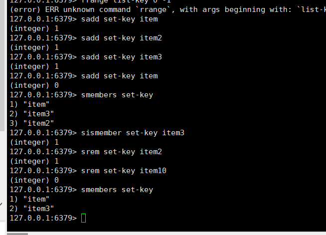

## Redis的概念

### redis常用数据结构

#### string类型

1. set hello world
2. del hello
3. get hello
4. incr article: 自增
5. incrby article: 3

#### list 列表
1. lpush list-key item 
2. rpush list-key item
3. lpop/rpop list-key
4. lrange list-key 0 -1

#### set 集合
因为Redis的集合使用无序（unordered）方式存储元素，所以用户不能像使用列表那样，将元素推入集合的某一端，或者从集合的某一端弹出元素。不过用户可以使用SADD命令将元素添加到集合，或者使用SRAM命令从集合里面移除元素。另外还可以通过SISMEMBER命令快速地检查一个元素是否已经存在于集合中，或者使用SMEMBERS命令获取集合包含的所有元素（如果集合包含的元素非常多，那么SMEMBERS命令的执行速度可能会很慢，所以请谨慎地使用这个命令）。
1. sadd set-key item

2. smembers set-key  查询所有元素

3. sismember set-key item

4. srem set-key item 如果存在移除

   
#### 散列
Redis的散列可以存储多个键值对之间的映射。和字符串一样，散列存储的值既可以是字符串又可以是数字值，并且用户同样可以对散列存储的数字值执行自增操作或者自减操作。
面就像是一个微缩版的Redis，不少字符串命令都有相应的散列版本

1. hset hash-key key1 value1
2. hget hash-key key1
3. hgetall hash-key
4. hdel hash-key key1
5. hincrby

#### redis的有序集合
有序集合是Redis里面唯一一个既可以根据成员访问元素（这一点和散列一样），又可以根据分值以及分值的排列顺序来访问元素的结构。
1. zadd zset-key 200 member0
2. zrange zset-key 0 -1 withscores
3. zrangebyscore zset-key 0 800 withscores
4. zrem zset-key member0
5. zincrby
6. ZREVRANGE 倒序
7. ZINTERSTORE 整合集合和有序集合key 生成一个新的有序集合

### 场景处理
#### 设计一个网站投票系统
1. 需求说明，这些网站会根据文章的发布时间和文章获得的投票数量计算出一个评分，然后按照这个评分来决定如何排序和展示文章。
2. 实体设计：
- 文章的内容实体，hash的方式，key  article:111  name value
- 文章发布时间和文章投票数据各一个，评分需要根据文章的时间和投票数量进行设置 zset
- 对一个文章的投票用户只能是一个用户 set集合
- 
3. 场景过程
- 内容的删除，文章在一定时间后不能在投票了，需要把用户列表删除
- 投票的过程：用户投票时候检查文章是否已经超期，超期提示不可投票，未超期查看是否已经投票过，未投票过增加选票、增加分数
- 发布文章：获取一个新的id，增加一个已投票的用户名单