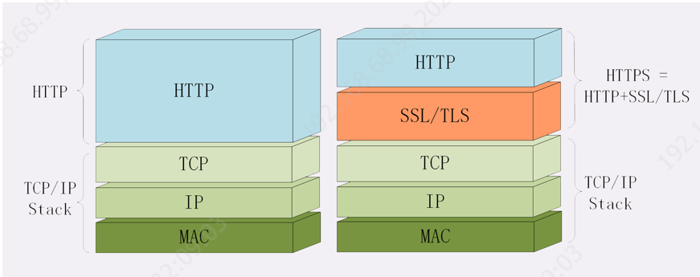

## HTTP总体学习路劲

### 偏理论内容
#### 编码

#### DNS

1. 域名使用字符串来代替 IP 地址，方便用户记忆，本质上一个名字空间系统；
2. DNS 就像是我们现实世界里的电话本、查号台，统管着互联网世界里的所有网站，是一个“超级大管家”；
3. DNS 是一个树状的分布式查询系统，但为了提高查询效率，外围有多级的缓存；
4. 使用 DNS 可以实现基于域名的负载均衡，既可以在内网，也可以在外网
5. 域名解析有个ttl有效期，到期就会去上一级dns重新获取，当然也可以主动刷新。

1. 在浏览器地址栏里随便输入一个不存在的域名，比如就叫“www. 不存在.com”，试着解释一下它的 DNS 解析过程。
   浏览器缓存-》操作系统缓存-》host-》DNS
2. 如果因为某些原因，DNS 失效或者出错了，会出现什么后果？

#### CDN
1. DNS 解析可能会给出 CDN 服务器的 IP 地址，这样你拿到的就会是 CDN 服务器而不是目标网站的实际地址。
2. 因为 CDN 会缓存网站的大部分资源，比如图片、CSS 样式表，所以有的 HTTP 请求就不需要再发到 Apple，CDN 就可以直接响应你的请求，把数据发给你。
3. 由 PHP、Java 等后台服务动态生成的页面属于“动态资源”，CDN 无法缓存，只能从目标网站获取。于是你发出的 HTTP 请求就要开始在互联网上的“漫长跋涉”，经过无数的路由器、网关、代理，最后到达目的地。
4. 访问服务器返回CDN 就可以进行缓存起来。
客户端-》CDN-》无数据-》转到后面？是的

你能试着解释一下在浏览器里点击页面链接后发生了哪些事情吗？
  是否本站内容？是HTTP1.1可以直接复用旧连接，
这一节课里讲的都是正常的请求处理流程，如果是一个不存在的域名，那么浏览器的工作流程会是怎么样的呢？
  解析DNS层就异常了

#### 七层四层

1. TCP/IP 分为四层，核心是二层的 IP 和三层的 TCP，HTTP 在第四层；

2. OSI 分为七层，基本对应 TCP/IP，TCP 在第四层，HTTP 在第七层；

3. OSI 可以映射到 TCP/IP，但这期间一、五、六层消失了；

4. 日常交流的时候我们通常使用 OSI 模型，用四层、七层等术语；

5. HTTP 利用 TCP/IP 协议栈逐层打包再拆包，实现了数据传输，但下面的细节并不可见。

1. 你能用自己的话解释一下“二层转发”“三层路由”吗？

   二层应该指数据链路层，工作在二层的设备，通过查找到目标MAC地址，进行数据转发；

   三层应该指网络层，工作在三层的设备，通过解析数据包头信息，找到目标IP地址，转发数据

2. 你认为上一讲中的 DNS 协议位于哪一层呢？

   应用层

3. 你认为 CDN 工作在那一层呢？

   应用层
   
   
   
   
   
#### HTTP报文的样子
请求行、请求头、请求内容

   

响应行、响应头、响应内容

1. 如果拼 HTTP 报文的时候，在头字段后多加了一个 CRLF，导致出现了一个空行，会发生什么？
    在header 下面第一个空行以后都会被当作body 体
2. 在header 下面第一个空行以后都会被当作body 体
    节省资源
##### 相关头内容
1. Host 请求字段上必须出现

2. User-Agent只出现在请求头里。它使用一个字符串来描述发起 HTTP 请求的客户端

3. Date字段是一个通用字段，但通常出现在响应头里，表示 HTTP 报文创建的时间，客户端可以使用这个时间再搭配其他字段决定缓存策略。

4. Content-Length，它表示报文里 body 的长度，也就是请求头或响应头空行后面数据的长度。服务器看到这个字段，就知道了后续有多少数据，可以直接接收。如果没有这个字段，那么 body 就是不定长的，需要使用 chunked 方式分段传输

5. 数据类型表示实体数据的内容是什么，使用的是 MIME type，相关的头字段是 Accept 和 Content-Type；Content-Type是实体字段所以请求和响应里都可以用。

6. 数据编码表示实体数据的压缩方式，相关的头字段是 Accept-Encoding 和 Content-Encoding；

7. 语言类型表示实体数据的自然语言，相关的头字段是 Accept-Language 和 Content-Language；

8. 字符集表示实体数据的编码方式，相关的头字段是 Accept-Charset 和 Content-Type；

9. Accept 等头字段可以用“,”顺序列出多个可能的选项，还可以用“;q=”参数来精确指定权重。

10. **accept 表达的是你想要的，而你发送 post请求时，你发送的数据是给服务器的，post时应该用content*字段描述body的语言。如果服务器也会有响应报文，所以就需要用accept头告诉服务器**

    
11. 范围请求；“Accept-Ranges: bytes”明确告知客户端；请求头Range是 HTTP 范围请求的专用字段，格式是“bytes=x-y”，其中的 x 和 y 是以字节为单位的数据范围。

##### 请求方法

1. GET：获取资源，可以理解为读取或者下载数据；
2. HEAD：获取资源的元信息； 服务器不会返回请求的实体数据，只会传回响应头，也就是资源的“元信息”,HEAD 方法可以看做是 GET 方法的一个“简化版”或者“轻量版”。因为它的响应头与 GET 完全相同，所以可以用在很多并不真正需要资源的场合，避免传输 body 数据的浪费。比如，想要检查一个文件是否存在，只要发个 HEAD 请求就可以了，没有必要用 GET 把整个文件都取下来。再比如，要检查文件是否有最新版本，同样也应该用 HEAD，服务器会在响应头里把文件的修改时间传回来。比如，想要检查一个文件是否存在，只要发个 HEAD 请求就可以了，没有必要用 GET 把整个文件都取下来。再比如，要检查文件是否有最新版本，同样也应该用 HEAD，服务器会在响应头里把文件的修改时间传回来。
3. POST：向资源提交数据，相当于写入或上传数据；
4. PUT：类似 POST；幂等“幂”后结果“相等”。
5. DELETE：删除资源；幂等
6. CONNECT：建立特殊的连接隧道；
7. OPTIONS：列出可对资源实行的方法；
8. TRACE：追踪请求 - 响应的传输路径。
##### URI 
本质上是一个字符串，这个字符串的作用是唯一地标记资源的位置或者名字
组成部分：

1. URI 第一个组成部分叫scheme，翻译成中文叫“方案名”或者“协议名”，表示资源应该使用哪种协议来访问。，例如 ftp、ldap、file、news 等。
2. 在 scheme 之后，必须是三个特定的字符“://”，它把 scheme 和后面的部分分离开。
3. 后是authority 的部分，表示资源所在的主机名，通常的形式是“host:port”，即主机名加端口号。
URI编码：
URI 引入了编码机制，对于 ASCII 码以外的字符集和特殊字符做一个特殊的操作，把它们转换成与 URI 语义不冲突的形式。这在 RFC 规范里称为“escape”和“unescape”，俗称“转义”。直接把非 ASCII 码或特殊字符转换成十六进制字节值，然后前面再加上一个“%”。可以支持任意的字符集用任何语言来标记资源

#### 响应码
##### 1. 1××：协议中间状态
   提示信息，表示目前是协议处理的中间状态，还需要后续的操作；
   1××类状态码属于**提示信息**，是协议处理的**中间状态**，实际能够用到的时候很少。我们偶尔能够见到的是“101 Switching Protocols”。它的意思是客户端使用 Upgrade 头字段，要求在 HTTP 协议的基础上改成其他的协议继续通信，比如 WebSocket。而如果服务器**也同意变更协议**，就会发送状态码 101，但这之后的数据传输就不会再使用 HTTP 了。
##### 2. 2××：成功
  成功，报文已经收到并被正确处理；
2××类状态码表示服务器收到并成功处理了客户端的请求，这也是客户端最愿意看到的状态码。
“200 OK”是最常见的成功状态码，表示一切正常，服务器如客户端所期望的那样返回了处理结果，如果是非 HEAD 请求，通常在响应头后都会有 body 数据。
“204 No Content”是另一个很常见的成功状态码，它的含义与“200 OK”基本相同，**但响应头后没有 body 数据**。所以对于 Web 服务器来说，正确地区分 200 和 204 是很必要的。
“206 Partial Content”是 **HTTP 分块下载或断点续传的基础**，在客户端发送“范围请求”、要求获取资源的部分数据时出现，它与 200 一样，也是服务器成功处理了请求，但 body 里的数据**不是资源的全部**，而是其中的一部分。状态码 206 通常还会伴随着头字段“Content-Range”，表示响应报文里 body 数据的具体范围，供客户端确认，**例如“Content-Range: bytes 0-99/2000”，意思是此次获取的是总计 2000 个字节的前 100 个字节**。

##### 3. 3××：重定向
资源位置发生变动，需要客户端重新发送请求；
3××类状态码表示**客户端请求的资源发生了变动**，客户端必须用新的 URI 重新发送请求获取资源，也就是通常所说的“重定向”，包括著名的 301、302 跳转。
“301 Moved Permanently”俗称“永久重定向”，含义是此次请求的资源已经不存在了，需要改用改用新的 URI 再次访问。
与它类似的是“302 Found”，曾经的描述短语是“Moved Temporarily”，俗称“临时重定向”，意思是请求的资源还在，但需要暂时用另一个 URI 来访问。
301 和 302 都会在响应头里使用字段**Location**指明后续要跳转的 URI，最终的效果很相似，浏览器都会重定向到新的 URI。两者的根本区别在于语义，**一个是“永久”，一个是“临时”**，所以在场景、用法上差距很大。
比如，你的网站升级到了 HTTPS，原来的 HTTP 不打算用了，这就是“永久”的，所以要配置 301 跳转，把所有的 HTTP 流量都切换到 HTTPS。
再比如，今天夜里网站后台要系统维护，服务暂时不可用，这就属于“临时”的，可以配置成 302 跳转，把流量临时切换到一个静态通知页面，浏览器看到这个 302 就知道这只是暂时的情况，**不会做缓存优化，第二天还会访问原来的地址**。
“304 Not Modified” 是一个比较有意思的状态码，它用于 If-Modified-Since 等条件请求，表示资源未修改，用于缓存控制。**它不具有通常的跳转含义，但可以理解成“重定向已到缓存的文件”（即“缓存重定向”）**。
##### 4. 4××：客服端请求内容有误
客户端错误，请求报文有误，服务器无法处理；
400 Bad Request”是一个通用的错误码，表示请求报文有错误，但具体是数据格式错误、缺少请求头还是 URI 超长它没有明确说，只是一个笼统的错误，客户端看到 400 只会是“一头雾水”“不知所措”。所以，在开发 Web 应用时应当**尽量避免给客户端返回 400**，而是要用其他更有明确含义的状态码。
“403 Forbidden”实际上不是客户端的请求出错，而是**表示服务器禁止访问资源**。原因可能多种多样，例如信息敏感、法律禁止等，如果服务器友好一点，可以在 body 里详细说明拒绝请求的原因，不过现实中通常都是直接给一个“闭门羹”。
“404 Not Found”可能是我们最常看见也是最不愿意看到的一个状态码，它的原意是资源在本服务器上未找到，所以无法提供给客户端。但现在已经被“用滥了”，只要服务器“不高兴”就可以给出个 404，而我们也无从得知后面到底是真的未找到，还是有什么别的原因，某种程度上它比 403 还要令人讨厌。
4××里剩下的一些代码较明确地说明了错误的原因，都很好理解，开发中常用的有：
405 Method Not Allowed：不允许使用某些方法操作资源，例如不允许 POST 只能 GET；
406 Not Acceptable：资源无法满足客户端请求的条件，例如请求中文但只有英文；
408 Request Timeout：请求超时，服务器等待了过长的时间；
409 Conflict：多个请求发生了冲突，可以理解为多线程并发时的竞态；
413 Request Entity Too Large：请求报文里的 body 太大；
414 Request-URI Too Long：请求行里的 URI 太大；
429 Too Many Requests：客户端发送了太多的请求，通常是由于服务器的限连策略；
431 Request Header Fields Too Large：请求头某个字段或总体太大；
##### 5. 5××：服务端错误
服务器错误，服务器在处理请求时内部发生了错误。
5××类状态码表示客户端请求报文正确，但服务器在处理时内部发生了错误，无法返回应有的响应数据，是服务器端的“错误码”。
“500 Internal Server Error”与 400 类似，也是一个通用的错误码，服务器究竟发生了什么错误我们是不知道的。不过对于服务器来说这应该算是好事，通常不应该把服务器内部的详细信息，例如出错的**函数调用栈告诉外界**。虽然不利于调试，但能够防止黑客的窥探或者分析。
“501 Not Implemented”**表示客户端请求的功能还不支持**，这个错误码比 500 要“温和”一些，和“即将开业，敬请期待”的意思差不多，不过具体什么时候“开业”就不好说了。
“502 Bad Gateway”通常是**服务器作为网关或者代理时返回的错误码**，表示服务器自身工作正常，访问后端服务器时发生了错误，但具体的错误原因也是不知道的。
“503 Service Unavailable”表示**服务器当前很忙，暂时无法响应服务**，我们上网时有时候遇到的“网络服务正忙，请稍后重试”的提示信息就是状态码 503。503 是一个“临时”的状态，很可能过几秒钟后服务器就不那么忙了，可以继续提供服务，所以 503 响应报文里通常还会有一个**“Retry-After”字段**，指示客户端可以在多久以后再次尝试发送请求

#### 优缺点
灵活、易于扩展”的特性还表现在 HTTP 对“可靠传输”的定义上，它不限制具体的下层协议，不仅可以使用 TCP、UNIX Domain Socket，还可以使用 SSL/TLS，甚至是基于 UDP 的 QUIC，下层可以随意变化，而上层的语义则始终保持稳定
##### 无状态

增加COOKIE处理

- 优点
因为服务器没有“记忆能力”，所以就不需要额外的资源来记录状态信息，不仅实现上会简单一些，而且还能减轻服务器的负担，能够把更多的 CPU 和内存用来对外提供服务。
而且，“无状态”也表示服务器都是相同的，没有“状态”的差异，所以可以很容易地组成集群，让负载均衡把请求转发到任意一台服务器，不会因为状态不一致导致处理出错，使用“堆机器”的“笨办法”轻松实现高并发高可用。
- 缺点
既然服务器没有“记忆能力”，它就无法支持需要连续多个步骤的“事务”操作。例如电商购物，首先要登录，然后添加购物车，再下单、结算、支付，这一系列操作都需要知道用户的身份才行，但“无状态”服务器是不知道这些请求是相互关联的，每次都得问一遍身份信息，不仅麻烦，而且还增加了不必要的数据传输量。
##### 明文
##### 不安全

#### Cookie机制
HTTP的状态管理机制，由服务端生产，当用户通过浏览器第一次访问服务器的时候，服务器肯定是不知道他的身份的。所以，就要创建一个独特的身份标识数据，格式是“key=value”，然后放进 Set-Cookie 字段里，随着响应报文一同发给浏览器。

##### Cookie的使用

##### Cookie 的属性

1. Expires
”俗称“过期时间”，用的是绝对时间点，可以理解为“截止日期”（deadline）。
2. Max-Age
用的是相对时间，单位是秒，浏览器用收到报文的时间点再加上 Max-Age，就可以得到失效的绝对时间。
Expires 和 Max-Age 可以同时出现，两者的失效时间可以一致，也可以不一致，但浏览器会优先采用 Max-Age 计算失效期。
3. Domain”和“Path”
指定了 Cookie 所属的域名和路径，浏览器在发送 Cookie 前会从 URI 中提取出 host 和 path 部分，对比 Cookie 的属性。如果不满足条件，就不会在请求头里发送 Cookie。
4. “HttpOnly”
会告诉浏览器，此 Cookie 只能通过浏览器 HTTP 协议传输，禁止其他方式访问，浏览器的 JS 引擎就会禁用 document.cookie 等一切相关的 API，脚本攻击也就无从谈起了。
5. “Secure”
表示这个 Cookie 仅能用 HTTPS 协议加密传输，明文的 HTTP 协议会禁止发送。但 Cookie 本身不是加密的，浏览器里还是以明文的形式存在。
#### 同源策略
浏览器不允许跨域、协议、端口不同的请求，除了一些特殊表单。
AJAX不允许跨域 解决方案	
1. 服务端增加允许的请求Origin
2. 
##### 安全性
1. CSRF
    跨站伪造攻击，用户请求了A站点，同时缓存了A站点信息；访问了B站点 ，故意勇一个表单提交大A站点上 携带了A站点cookie 导致了问题。
    解决：
  1. referr 来源 进行限制
  2. 表单增加一个token 处理

#### 缓存处理
##### 什么样的会被缓存
1. 请求方法可以被缓存
2. 响应码可以被缓存理解
3. 响应与请求没有指明no-cache
4. 代理缓存不能是private 等
##### 缓存匹配
URI匹配
Vary响应头部与请求中的头不相匹配

##### 缓存更新频率
1. 使用版本号来进行返回

##### 服务器的缓存控制
###### 服务端返回
- Cache-Control
1. max-age
相当于告诉浏览器，不接受超过max-age的秒数。时间的计算起点**是响应报文的创建时刻**（即 Date 字段，也就是离开服务器的时刻），而不是客户端收到报文的时刻，也就是说包含了在链路传输过程中所有节点所停留的时间。
具有的属性如下：
2. no_store：**不允许缓存**，用于某些变化非常频繁的数据，例如秒杀页面；
3. no_cache：它的字面含义容易与 no_store 搞混，实际的意思并不是不允许缓存，而是可以缓存，但在使用之前**必须要去服务器验证是否过期，是否有最新的版本**；
4. must-revalidate：又是一个和 no_cache 相似的词，它的意思是**如果缓存不过期就可以继续使用，但过期了如果还想用就必须去服务器验证**。

   
###### 条件请求
浏览器用“Cache-Control”做缓存控制只能是刷新数据，不能很好地利用缓存数据，又因为缓存会失效，使用前还必须要去服务器验证是否是最新版。
条件请求一共有 5 个头字段，我们最常用的是“if-Modified-Since”和“If-None-Match”这两个。需要第一次的响应报文预先提供“Last-modified”和“ETag”，然后第二次请求时就可以带上缓存里的原值，验证资源是否是最新的。如果资源没有变，服务器就回应一个**“304 Not Modified”**，表示缓存依然有效，浏览器就可以更新一下有效期，然后放心大胆地使用缓存了。
1. ETag
是资源的一个唯一标识，主要是用来解决修改时间无法准确区分文件变化的问题。
**强 ETag** 要求资源在字节级别必须完全相符，弱 ETag 在值前有个“W/”标记，只要求资源在语义上没有变化，但内部可能会有部分发生了改变（例如 HTML 里的标签顺序调整，或者多了几个空格）。

2. if-Modified-Since
 一般和Last-modified进行结合使用 ，看在时间上是否有进行改变。
3. If-None-Match
 配合ETag看下是否改变。
###### 客户端请求
- Cache-Control: no-cache
  告诉浏览器不用缓存

- Cache-Control: max-stale

  的意思是如果代理上的缓存过期了也可以接受，但不能过期太多，超过 x 秒也会不要。“min-fresh”的意思是缓存必须有效，而且必须在 x 秒后依然有效。

- **Cache-Control：min-fresh**

  有的时候客户端还会发出一个特别的“**only-if-cached**”属性，表示只接受代理缓存的数据，不接受源服务器的响应。如果代理上没有缓存或者缓存过期，就应该给客户端返回一个 504（Gateway Timeout）。

#### 代理服务器

##### 相关头部
1. Via
    Via 是一个通用字段，请求头或响应头里都可以出现。每当报文经过一个代理节点，代理服务器就会把自身的信息追加到字段的末尾，就像是经手人盖了一个章。

  

2. X-Forwarded-For
3. 代理协议
   在HTTP标准上在增加一行处理
##### 缓存代理
代理服务收到源服务器发来的响应数据后需要做两件事。第一个当然是把报文转发给客户端，而第二个就是把报文存入自己的 Cache 里。
- Cache-Control
1. private
“private”表示缓存只能在客户端保存，是用户“私有”的，不能放在代理上与别人共享。
	比如你登录论坛，返回的响应报文里用“Set-Cookie”添加了论坛 ID，这就属于私人数据，不能存在代理上。不然，别人访问代理获取了被缓存的响应就麻烦了。	
2. public
    而“public”的意思就是缓存完全开放，谁都可以存，谁都可以用。
3. must-revalidate
    是只要过期就必须回源服务器验证
4. proxy-revalidate
    只要求代理的缓存过期后必须验证，客户端不必回源，只验证到代理这个环节就行了。
5. s-maxage
    只限定在代理上能够存多久
6. no-transform
    代理有时候会对缓存下来的数据做一些优化，比如把图片生成 png、webp 等几种格式，方便今后的请求处理，而“no-transform”就会禁止这样做，不许“偷偷摸摸搞小动作”。
7. 一些例子
    水果上贴着标签“private, max-age=5”。这就是说水果不能放进冷柜，必须直接给顾客，保鲜期 5 天，过期了还得去超市重新进货。
    冻鱼上贴着标签“public, max-age=5, s-maxage=10”。这个的意思就是可以在冰柜里存 10 天，但顾客那里只能存 5 天，过期了可以来便利店取，只要在 10 天之内就不必再找超市。
    排骨上贴着标签“max-age=30, proxy-revalidate, no-transform”。因为缓存默认是 public 的，那么它在便利店和顾客的冰箱里就都可以存 30 天，过期后便利店必须去超市进新货，而且不能擅自把“大排”改成“小排”。
- Purge
  另一个问题是“Purge”，也就是“缓存清理”，它对于代理也是非常重要的功能，例如：
  过期的数据应该及时淘汰，避免占用空间；
  源站的资源有更新，需要删除旧版本，主动换成最新版（即刷新）；
  有时候会缓存了一些本不该存储的信息，例如网络谣言或者危险链接，必须尽快把它们删除。

- 头部Vary
  vary主要用在缓存，用来告诉缓存代理此报文依据的是哪些请求头字段。
  缓存代理收到带vary的响应报文后，就会根据vary里的字段提取请求头，计算hash，然后和缓存存在一起。当有新请求的时候就比较新请求的头字段hash与缓存的hash，一致就说明可以重用缓存。

  

#### 优化处理

##### 大文件压缩
1. **压缩**；使用头Accept-Encoding 和 Content-Encoding，例如 gzip、deflate、br 等；gzip 等压缩算法通常只对**文本**文件有较好的压缩率，而图片、音频视频等多媒体数据本身就已经是高度压缩的，效果不明显。

2. **分块传输**；分解成多个小块，把这些小块分批发给浏览器，浏览器收到后再组装复原，在响应报文里用头字段“**Transfer-Encoding: chunked**”来表示，意思是报文里的 body 部分不是一次性发过来的，而是分成了许多的块（chunk）逐个发送；与Content-Length”这两个字段是**互斥的**；每个分块包含两个部分，长度头和数据块；长度头是以 CRLF（回车换行，即\r\n）结尾的一行明文，用 16 进制数字表示长度；数据块紧跟在长度头后，最后也用 CRLF 结尾，但数据不包含 CRLF；最后用一个长度为 0 的块表示结束，即“0\r\n\r\n”。

   

分块传输数据的时候，如果数据里含有回车换行（\r\n）是否会影响分块的处理呢？
-- 不影响，前面已经说明了长度

##### 范围请求

**“Accept-Ranges: bytes”**明确告知客户端；请求头Range是 HTTP 范围请求的专用字段，格式是“bytes=x-y”，其中的 x 和 y 是以字节为单位的数据范围。请求头**Range**是 HTTP 范围请求的专用字段，格式是“bytes=x-y”，其中的 x 和 y 是以字节为单位的数据范围。
服务器收到 Range 字段后，需要做四件事。
第一，**它必须检查范围是否合法**，比如文件只有 100 个字节，但请求“200-300”，这就是范围越界了。服务器就会返回状态码**416**，意思是“你的范围请求有误，我无法处理，请再检查一下”。
第二，如果范围正确，服务器就可以根据 Range 头计算偏移量，读取文件的片段了，返回状态码**“206 Partial Content”**，和 200 的意思差不多，但表示 body 只是原数据的一部分。
第三，**服务器要添加一个响应头字段Content-Range**，告诉片段的实际偏移量和资源的总大小，格式是“bytes x-y/length”，与 Range 头区别在没有“=”，范围后多了总长度。例如，对于“0-10”的范围请求，值就是“bytes 0-10/100”。
最后剩下的就是发送数据了，直接把片段用 TCP 发给客户端，一个范围请求就算是处理完了。
不仅看视频的拖拽进度需要范围请求，常用的下载工具里的多段下载、断点续传也是基于它实现的，要点是：
**先发个 HEAD**，看服务器是否支持范围请求，同时获取文件的大小；
开 N 个线程，每个线程使用 Range 字段划分出各自负责下载的片段，发请求传输数据；
下载意外中断也不怕，不必重头再来一遍，只要根据上次的下载记录，用 Range 请求剩下的那一部分就可以了。
**多段数据请求**；多个range请求，这种情况需要使用一种特殊的 MIME 类型：**“multipart/byteranges”**，表示报文的 body 是由多段字节序列组成的，并且还要用一个参数**“boundary=xxx”给出段之间的分隔标记**。

1. 如果对一个被 gzip 的文件执行范围请求，比如“Range: bytes=10-19”，那么这个范围是应用于原文件还是压缩后的文件呢？ 
    是源文件对传输的文件。

##### HTTP的连接管理

连接针对单次连接有效，主要考虑代理服务器；

1. 代理服务器可以认识Connection

2. 代理服务器不认识Connection，不应原封不动的把Connection发给目标服务器，引入一个Proxy-Connection，旧版本不识别 就是短连接，而新版本认识这个 就会使用Connection来代替

   

###### 长连接
由于长连接对性能的改善效果非常显著，所以在 HTTP/1.1 中的连接都会默认启用长连接。不需要用什么特殊的头字段指定，只要向服务器发送了第一次请求，后续的请求都会重复利用第一次打开的 TCP 连接，也就是长连接，在这个连接上收发数据。
当然，我们也可以在请求头里明确地要求使用长连接机制，使用的字段是**Connection，值是“keep-alive”。**不过不管客户端是否显式要求长连接，如果服务器支持长连接，它总会在**响应**报文里放一个**“Connection: keep-alive”**字段，告诉客户端：“我是支持长连接的，接下来就用这个 TCP 一直收发数据吧”。
**缺点**：
因为 TCP 连接长时间不关闭，服务器必须在内存里保存它的状态，这就占用了服务器的资源。如果有大量的空闲长连接只连不发，就会很快耗尽服务器的资源，导致服务器无法为真正有需要的用户提供服务。
所以，长连接也需要在恰当的时间关闭，不能永远保持与服务器的连接，这在客户端或者服务器都可以做到。

- 客户端处理
在客户端，可以在请求头里加上“Connection: close”字段，告诉服务器：“这次通信后就关闭连接”。服务器看到这个字段，就知道客户端要主动关闭连接，于是在响应报文里也加上这个字段，发送之后就调用 Socket API 关闭 TCP 连接。
- 服务端处理
1. 使用“keepalive_timeout”指令，设置长连接的**超时时间**，如果在一段时间内连接上没有任何数据收发就主动断开连接，避免空闲连接占用系统资源。
2. 使用“keepalive_requests”指令，设置长连接上可发送的最大请求次数。比如设置成 1000，那么当 Nginx 在这个连接上处理了 1000 个**请求**后，也会主动断开连接。
3. 上面两个设置就会导致服务端返回“Connection: close”。
###### 短连接
每发送一次请求就要建立一次连接；（0.9/1.0），HTTP1.1默认开启长连接
###### 队头阻塞
因为 HTTP 规定报文必须是“一发一收”，，http是“半双工”模式，这就形成了一个先进先出的“串行”队列。队列里的请求没有轻重缓急的优先级，只有入队的先后顺序，排在最前面的请求被最优先处理。
**优化**

- 并发连接
就是同时对一个域名发起多个长连接，用数量来解决质量的问题，但是可能会导致并发太大。于是设置了上线这个上限提高到了 6~8；
- 域名分片
	HTTP 协议和浏览器不是限制并发连接数量吗？好，那我就多开几个域名，比如 shard1.chrono.com、shard2.chrono.com，而这些域名都指向同一台服务器。	

##### 重定向
1. 提交form后需要重定向
2. **重定向状态码**
**301**俗称“永久重定向”（Moved Permanently），意思是原 URI 已经“永久”性地不存在了，今后的所有请求都必须改用新的 URI。浏览器看到 301，就知道原来的 URI“过时”了，就会做适当的优化。比如历史记录、更新书签，下次可能就会直接用新的 URI 访问，省去了再次跳转的成本。搜索引擎的爬虫看到 301，也会更新索引库，不再使用老的 URI。
**302**俗称“临时重定向”（“Moved Temporarily”），意思是原 URI 处于“临时维护”状态，新的 URI 是起“顶包”作用的“临时工”。浏览器或者爬虫看到 302，会认为原来的 URI 仍然有效，但暂时不可用，所以只会执行简单的跳转页面，不记录新的 URI，也不会有其他的多余动作，下次访问还是用原 URI。
**303** See Other：类似 302，但要求重定向后的请求**改为 GET **方法，访问一个结果页面，避免 POST/PUT 重复操作；临时
**307** Temporary Redirect：类似 302，但重定向后**请求里的方法和实体**不允许变动，含义比 302 更明确；临时
**308** Permanent Redirect：类似 307，**不允许重定向后的请求变动**，但它是 301“永久重定向”的含义。永久
不过这三个状态码的接受程度较低，有的浏览器和服务器可能不支持，开发时应当慎重，测试确认浏览器的实际效果后才能使用。 
响应头字段 Location 指示了要跳转的 URI，可以用**绝对或相对**的形式；
重定向中还有一个Refresh实现延时重定向，
**缺点**
性能损耗；
循环跳转；

####  HTTPS
简单的回答是“因为 HTTP 不安全”。因此增加了HTTPS。
##### 安全的定义
安全的定义：通常认为，如果通信过程具备了四个特性，就可以认为是“安全”的，这四个特性是：**机密性、完整性，身份认证和不可否认**。
1. 机密性（Secrecy/Confidentiality）
是指对数据的“保密”，只能由可信的人访问，对其他人是不可见的“秘密”，简单来说就是不能让不相关的人看到不该看的东西。
2. 完整性Integrity
是指数据在传输过程中没有被窜改，不多也不少，“完完整整”地保持着原状。
3. 身份认证（Authentication）
是指确认对方的真实身份，也就是“证明你真的是你”，保证消息只能发送给可信的人。
4. 不可否认
也叫不可抵赖，意思是不能否认已经发生过的行为，不能“说话不算数”“耍赖皮”。
##### HTTPS是什么
它把 HTTP 下层的传输协议由 TCP/IP 换成了 SSL/TLS（会话层），由“HTTP over TCP/IP”变成了“HTTP over SSL/TLS”，让 HTTP 运行在了安全的 SSL/TLS 协议上（可参考第 4 讲和第 5 讲），收发报文不再使用 Socket API，而是调用专门的安全接口。

全是靠着后面的 SSL/TLS“撑腰”。只要学会了 SSL/TLS，HTTPS 自然就“手到擒来”。
#####  SSL/TLS

SSL 即安全套接层（Secure Sockets Layer），在 OSI 模型中处于第 5 层（会话层），由网景公司于 1994 年发明，有 v2 和 v3 两个版本，而 v1 因为有严重的缺陷从未公开过。正式标准化，版本号从 1.0 重新算起，所以 TLS1.0 实际上就是 SSLv3.1。
TLS 由**记录协议、握手协议、警告协议、变更密码规范协议**、扩展协议等几个子协议组成，综合使用了对称加密、非对称加密、身份认证等许多密码学前沿技术。
浏览器和服务器在使用 TLS 建立连接时需要**选择一组**恰当的加密算法来实现安全通信，这些算法的组合被称为**“密码套件”**（cipher suite，也叫加密套件）。

###### OpenSSL
它是一个著名的开源密码学程序库和工具包，几乎支持所有公开的加密算法和协议，已经成为了事实上的标准，许多应用软件都会使用它作为底层库来实现 TLS 功能，包括常用的 Web 服务器 Apache、Nginx 等。用OpenSSL来进行生成公私yao

###### 机密性
实现机密性最常用的手段是**“加密”（encrypt）**，就是把消息用某种方式转换成谁也看不懂的乱码，只有掌握特殊“钥匙”的人才能再转换出原始文本。
这里的“钥匙”就叫做“密钥”（key），加密前的消息叫“明文”（plain text/clear text），加密后的乱码叫“密文”（cipher text），使用密钥还原明文的过程叫“解密”（decrypt），是加密的反操作，加密解密的操作过程就是“加密算法”。
1. 对称加密
加密和解密时使用的密钥都是同一个，是“对称”的。**只要保证了密钥的安全**，那整个通信过程就可以说具有了机密性。
TLS 里有非常多的对称加密算法可供选择，比如 RC4、DES、3DES、AES、ChaCha20 等，但前**三种算法都被认为是不安全的**，通常都禁止使用，目前常用的**只有 AES 和 ChaCha20。**
AES 的意思是“高级加密标准”（Advanced Encryption Standard），密钥长度可以是 128、192 或 256。它是 DES 算法的替代者，安全强度很高，性能也很好，而且有的硬件还会做特殊优化，所以非常流行，是应用最广泛的对称加密算法。
ChaCha20 是 Google 设计的另一种加密算法，密钥长度固定为 256 位，纯软件运行性能要超过 AES，曾经在移动客户端上比较流行，但 ARMv8 之后也加入了 AES 硬件优化，所以现在不再具有明显的优势，但仍然算得上是一个不错算法。
- 加密分组模式概念
拿ECB来举例子，假设使用aes128，密钥长度是16字节，那么就把明文按16字节分组，然后每个分组用密钥加密。
- 主要依赖异或操作
2. 非对称加密
如果你和网站约定的密钥在传递途中被黑客窃取，那他就可以在之后随意解密收发的数据，通信过程也就没有机密性可言了。
它有两个密钥，一个叫**“公钥”（public key），一个叫“私钥”（private key）**。两个密钥是不同的，“不对称”，**公钥可以公开给任何人使用，而私钥必须严格保密**。
非对称加密可以解决**“密钥交换”**的问题。网站秘密保管私钥，在网上任意分发公钥，你想要登录网站只要用公钥加密就行了，密文只能由私钥持有者才能解密。而黑客因为没有私钥，所以就无法破解密文。
常见的是RSA算法。
缺点 **运算速度很慢**。
3. 混合加密
TLS 里使用的混合加密方式。
在通信刚开始的时候使用非对称算法，比如 RSA、ECDHE，首先**解决密钥交换**的问题。
然后用随机数产生对称算法使用的“会话密钥”（session key），再用公钥加密。因为会话密钥很短，通常只有 16 字节或 32 字节，所以慢一点也无所谓。
###### 完整性
实现完整性的手段主要是**摘要算法（Digest Algorithm）**，也就是常说的散列函数、哈希函数（Hash Function）。生成了一个数字“指纹”。一个大数据生成固定长度的内容。算法的好坏就看生成数字的唯一性。
目前 TLS 推荐使用的是 SHA-1 的后继者：SHA-2。
SHA-2 实际上是一系列摘要算法的统称，总共有 6 种，常用的有 SHA224、SHA256、SHA384，分别能够生成 28 字节、32 字节、48 字节的摘要。
不过摘要算法不具有机密性，如果明文传输，那么黑客可以修改消息后把摘要也一起改了，网站还是鉴别不出完整性。所以，真正的完整性必须要建立在机密性之上，在混合加密系统里用会话密钥加密消息和摘要，这样黑客无法得知明文，也就没有办法动手脚了。

###### 身份认证
数字签名的原理其实很简单，就是把公钥私钥的用法反过来，之前是公钥加密、私钥解密，现在是私钥加密、公钥解密。但又因为非对称加密效率太低，所以私钥只加密原文的摘要，这样运算量就小的多，而且得到的数字签名也很小，方便保管和传输。
签名和公钥一样完全公开，任何人都可以获取。但这个签名只有用私钥对应的公钥才能解开，拿到摘要后，再比对原文验证完整性，就可以像签署文件一样证明消息确实是你发的。**私钥只有你有其他人没办法伪造**

###### 数字证书和 PKI之CA
- PKI公钥基础设施
基于私钥加密，只有使用公钥解密，起到身份认证的使用。
1. 公钥的管理：
由CA数字认证机构将用户个人身份与公开密钥关联在一起。
2. 公钥数字证书组成：
CA信息、公钥用户信息、公钥、权威机构签字、有效期。**个人信息和公钥交给CA机构 ，CA机构核实后就会颁发给我一个数字证书**。
3. PKI用户
向CA注册公钥的用户，网站站长
希望使用已注册公钥的用户，浏览器使用者
4. 签发证书流程
    站长把个人信息和公钥提供给认证机构，认证机构认证后**通过自己的私钥签名形成公钥证书**。

这里还有一个“公钥的信任”问题。因为谁都可以发布公钥，我们还缺少防止黑客伪造公钥的手段，也就是说，怎么来判断这个公钥就是你或者某宝的公钥呢？
找一个公认的可信第三方，让它作为“信任的起点，递归的终点”，构建起公钥的信任链。
有了这个证书体系，操作系统和浏览器都**内置了各大 CA 的根证书**，上网的时候只要服务器发过来它的证书，**就可以验证证书里的签名**，顺着证书链（Certificate Chain）一层层地验证，直到找到根证书，就能够确定证书是可信的，从而里面的公钥也是可信的。

#####  TLS1.2连接过程解析

身份认证、达成安全套件共识、密钥交换、通讯

 

###### TLS协议组成
TLS 包含几个子协议，你也可以理解为它是由几个不同职责的模块组成，比较常用的有记录协议、警报协议、握手协议、变更密码规范协议等。
1. 记录协议（Record Protocol）
规定了 TLS 收发数据的基本单位：记录（record）。它有点像是 TCP 里的 segment，所有的其他子协议都需要通过记录协议发出。但多个记录数据可以在一个 TCP 包里一次性发出，也并不需要像 TCP 那样返回 ACK。
2. 警报协议（Alert Protocol）
职责是向对方发出警报信息，有点像是 HTTP 协议里的状态码。比如，protocol_version 就是不支持旧版本，bad_certificate 就是证书有问题，收到警报后另一方可以选择继续，也可以立即终止连接。
3. 握手协议（Handshake Protocol）
是 TLS 里最复杂的子协议，要比 TCP 的 SYN/ACK 复杂的多，浏览器和服务器会在握手过程中协商 TLS 版本号、随机数、密码套件等信息，然后交换证书和密钥参数，最终**双方协商得到会话密钥，用于后续的混合加密系统**。
4. 变更密码规范协议
它非常简单，就是一个“通知”，告诉对方，后续的数据都将使用加密保护。那么反过来，在它之前，数据都是明文的。
###### DH密钥交换
A自己私钥通过算法得到公钥A1，把一些参数和公钥给B，B也有自己的私钥，通过参数和私钥算出公钥B1， AB1  = BA1
1. 只有服务端提供公

问题：中间人伪造 ，大量算术慢 后面都使用ECDH密钥交换协议2 但是原理是一样的。
因为使用了 ECDHE，客户端可以不用等到服务器发回“Finished”确认握手完毕，立即就发出 HTTP 报文，**省去了一个消息往返的时间浪费**。这个叫“TLS False Start”，意思就是“抢跑”，和“TCP Fast Open”有点像，都是不等连接完全建立就提前发应用数据，提高传输的效率。
相比RSA快了一个RTT
###### 双向认证
没有认证客户端的一般叫做单向认证，双向认证类似客户端带上U盾

###### 结论

#####  TLS1.3连接
主要改进目标：兼容、安全与性能。
###### 最大化兼容性：
由于 1.1、1.2 等协议已经出现了很多年，很多应用软件、中间代理（官方称为“MiddleBox”）只认老的记录协议格式，更新改造很困难，甚至是不可行（设备僵化）。
这要用到一个新的扩展协议（Extension Protocol），它有点“补充条款”的意思，通过在记录末尾添加一系列的“扩展字段”来增加新的功能，老版本的 TLS 不认识它可以直接忽略，这就实现了“后向兼容”。
在记录头的 Version 字段被兼容性“固定”的情况下，只要是 TLS1.3 协议，握手的“Hello”消息后面就必须有**“supported_versions”扩展**，它标记了 TLS 的版本号，使用它就能区分新旧协议。
###### 强化安全：
1. 伪随机数函数由 PRF 升级为 HKDF（HMAC-based Extract-and-Expand Key Derivation Function）；
2. 明确禁止在记录协议里使用压缩；
3. 废除了 RC4、DES 对称加密算法；
4. 废除了 ECB、CBC 等传统分组模式；
5. 废除了 MD5、SHA1、SHA-224 摘要算法；
6. 废除了 RSA、DH 密钥交换算法和许多命名曲线。
上一讲用 Wireshark 抓包时你一定看到了，浏览器默认会使用 ECDHE 而不是 RSA 做密钥交换，这是因为它不具有**“前向安全”（Forward Secrecy）**。
假设有这么一个很有耐心的黑客，一直在长期收集混合加密系统收发的所有报文。如果加密系统使用服务器证书里的 RSA 做密钥交换，一旦私钥泄露或被破解（使用社会工程学或者巨型计算机），那么黑客就能够使用私钥解密出之前所有报文的“Pre-Master”，再算出会话密钥，破解所有密文。
这就是所谓的**“今日截获，明日破解”**。
而 ECDHE 算法在**每次握手**时都会生成一对临时的公钥和私钥，每次通信的密钥对都是不同的，也就是“一次一密”，即使黑客花大力气破解了这一次的会话密钥，也只是这次通信被攻击，之前的历史消息不会受到影响，仍然是安全的。

###### 提升性能：

优化RTT次数，少了一次交互选择哪个加密 ，

###### 握手分析：
为了兼容 1.1、1.2 等“老”协议，TLS1.3 会“伪装”成 TLS1.2，新特性在“扩展”里实现；
1.1、1.2 在实践中发现了很多安全隐患，所以 TLS1.3 大幅度删减了加密算法，只保留了 ECDHE、AES、ChaCha20、SHA-2 等极少数算法，强化了安全；
TLS1.3 也简化了握手过程，完全握手只需要一个消息往返，提升了性能。

#####  HTTPS优化
###### 硬件优化
###### 软件优化
###### 协议优化
服务器端应当开启“OCSP Stapling”功能，避免客户端访问 CA 去验证证书；
###### 证书优化
1. 会话复用
第一种叫“Session ID”，就是客户端和服务器首次连接后各自保存一个会话的 ID 号，内存里存储主密钥和其他相关的信息。当客户端再次连接时发一个 ID 过来，服务器就在内存里找，找到就直接用主密钥恢复会话状态，跳过证书验证和密钥交换，只用一个消息往返就可以建立安全通信。
缺点:服务端需要存储起来
2. 会话票证
它有点类似 HTTP 的 Cookie，存储的责任由服务器转移到了客户端，服务器加密会话信息，用“New Session Ticket”消息发给客户端，让客户端保存。重连的时候，客户端使用扩展“session_ticket”发送“Ticket”而不是“Session ID”，**服务器解密后验证有效期，就可以恢复会话**，开始加密通信。不过“Session Ticket”方案需要使用一个固定的密钥文件（ticket_key）来加密 Ticket，为了防止密钥被破解，保证“前向安全”，**密钥文件需要定期轮换**，比如设置为一小时或者一天。
3. 预共享密钥
TLS1.3中只能用该方式。
“False Start”“Session ID”“Session Ticket”等方式只能实现 1-RTT，而 TLS1.3 更进一步实现了“0-RTT”，原理和“Session Ticket”差不多，但在发送 **Ticket 的同时会带上应用数据（Early Data）**，免去了 1.2 里的服务器确认步骤，这种方式叫“Pre-shared Key”，简称为“PSK”。
缺点：容易受到“重放攻击”（Replay attack）的威胁。黑客可以截获“PSK”的数据，像复读机那样反复向服务器发送。在消息里加入时间戳、“nonce”验证，或者“一次性票证”限制重放。
#### HTTP2

HTTP/2 把 HTTP 分解成了“语义”和“语法”两个部分，“语义”层不做改动，与 HTTP/1 完全一致（即 RFC7231）。比如请求方法、URI、状态码、头字段等概念都保留不变，这样就消除了再学习的成本，基于 HTTP 的上层应用也不需要做任何修改，可以无缝转换到 HTTP/2。

HTTP/2 还在一定程度上改变了传统的“请求 - 应答”工作模式，服务器不再是完全被动地 响应请求，也可以新建“流”主动向客户端发送消息。比如，在浏览器刚请求 HTML 的时 候就提前把可能会用到的 JS、CSS 文件发给客户端，减少等待的延迟，**这被称为“服务器 推送”（Server Push，也叫 Cache Push）**。
##### 连接过程

TLS 握手成功之后，客户端必须要发送一个“**连接前言**”（connection preface），用来确认建立 HTTP/2 连接。只要服务器收到这个“有魔力的字符串”，就知道客户端在 TLS 上想要的是 HTTP/2 协议，而不是其他别的协议，后面就会都使用 HTTP/2 的数据格式。

1. h2c ,内容协商后增加 magic 还有帧发送 ，控制帧消息

   

2. h2 ；TLS里面增加内容协商进行交互。

##### 协议栈

##### 头部压缩
不过 HTTP/2 并没有使用传统的压缩算法，而是开发了专门的**“HPACK”算法**，在客户端
和服务器两端建立“字典”，用索引号表示重复的字符串，还**釆用哈夫曼编码**来压缩整数和字符串，可以达到 50%~90% 的高压缩率。哈夫曼静态编码表。

###### HPACK算法
“HPACK”算法是专门为压缩 HTTP 头部定制的算法，与 gzip、zlib 等压缩算法不同，它是一个“有状态”的算法，需要客户端和服务器**各自维护一份“索引表”**，也可以说是“字典”（这有点类似 brotli），压缩和解压缩就是查表和更新表的操作。主要使用哈夫曼算法。
###### 静态表
区分有值的或者是无值的。

###### 动态表
它添加在静态表后面，结构相同，但会在编码解码的时候随时更新。
比如说，第一次发送请求时的“user-agent”字段长是一百多个字节，用哈夫曼压缩编码发送之后，客户端和服务器都更新自己的动态表，添加一个新的索引号“65”。那么下一次发送的时候就不用再重复发那么多字节了，只要用一个字节发送编号就好。

###### 起始行

把起始行里面的请求方法、URI、状态码等统一转换成了头字段的形式，并且给这些“不是头字段的头字段”起了个特别的名字——**“伪头字段”（pseudo-header fields）**。而起始行里的版本号和错误原因短语因为没什么大用，顺便也给废除了。
为了与“真头字段”区分开来，这些“伪头字段”会在名字前加一个“:”，比如“:authority” “:method” “:status”，分别表示的是域名、请求方法和状态码。
现在 HTTP 报文头就简单了，全都是“Key-Value”形式的字段，于是 HTTP/2 就为一些最常用的头字段定义了一个只读的“静态表”（Static Table）。

###### 字面编码

主要区分 组成 （header name 和value以索引的；headername以索引，value以字面；name和value都以字面形式）。
可控制是否进入动态表；

1. 名称和值都在静态表中
2. 名称在索引表，值需要编码传递同时新增至动态编码
3. 名称和值都需要加到动态编码中
4. 名称在索引表，且值不增加到动态表中
5. 名称和值都不加到动态表中

##### 二进制格式（帧）

###### 帧的的格式

以二进制格式为基础，HTTP/2 就开始了“大刀阔斧”的改革。
它把 TCP 协议的部分特性挪到了应用层，把原来的“Header+Body”的消息“打散”为
数个小片的二进制“帧”（Frame），消息的组成：用“HEADERS”帧存放头数据、“DATA”帧存放
实体数据。

1. 帧长度 
    3 个字节的长度（但**不包括头**的 9 个字节），默认上限是 2^14，最大是 2^24，也就是说 HTTP/2 的帧通常不超过 16K，最大是 16M。

2. 帧类型
    长度后面的一个字节是帧类型，大致可以分成**数据帧**和**控制帧**两类，**HEADERS 帧和 DATA 帧属于数据帧**，存放的是 HTTP 报文，而 SETTINGS、PING、PRIORITY 等则是用来**管理流**的控制帧。管理流ID用0。
    HTTP/2 总共定义了 10 种类型的帧，但一个字节可以表示最多 256 种，所以也允许在标准之外定义其他类型实现功能扩展。这就有点像 TLS 里扩展协议的意思了，比如 Google 的 gRPC 就利用了这个特点，定义了几种自用的新帧类型。

    
###### HEADER；
header的体内容大概格式，其中HeaderBlock 里面也有很多区分
      

###### SETTINGS；
可以设置一些控制，如最大并发量、索引表最大尺寸、服务端是否可以推送、

###### PUSH_PROMISE；

这个是告知客户端要推送的东西，还会在下一个请求把具体的东西请求回去

3. 帧标志
    标志位是 0x25，转换成二进制有 3 个位被置 1。PRIORITY 表示设置了流的优先级，END_HEADERS 表示这一个帧就是完整的头数据，END_STREAM 表示单方向数据发送结束，后续再不会有数据帧（即请求报文完毕，不会再有 DATA 帧 /Body 数据）。可以保存 8 个标志位，携带简单的控制信息。常用的标志位有**END_HEADERS**表示头数据结束，相当于 HTTP/1 里头后的空行（“\r\n”），**END_STREAM**表示单方向数据发送结束（即 EOS，End of Stream），相当于 HTTP/1 里 Chunked 分块结束标志（“0\r\n\r\n”）。

    
    
4. 流标识符
    报文头里最后 4 个字节是流标识符，也就是帧所属的“流”，接收方使用它就可以从乱序的帧里识别出具有**相同流 ID 的帧序列，按顺序组装起来就实现了虚拟的“流”**。
##### 流与多路复用
流是二进制帧的双向传输序列。
在 HTTP/2 连接上，虽然帧是乱序收发的，但只要它们都拥有相同的流 ID，就都属于一个流，而且在这个流里帧不是无序的，而是有着**严格的先后顺序**。
在概念上，一个 HTTP/2 的流就**等同于一个 HTTP/1 里的“请求 - 应答”**。在 HTTP/1 里一个“请求 - 响应”报文来回是一次 HTTP 通信，在 HTTP/2 里一个流也承载了相同的功能。

###### 帧、消息、流的概述

在“流”的层面上看，**消息是一些有序的“帧”序列**，而**在“连接”的层面上看**，消息却是 乱序收发的“帧”。多个请求 / 响应之间没有了顺序关系，不需要排队等待，也就不会再 出现“队头阻塞”问题，降低了延迟，大幅度提高了连接的利用。**每一个请求响应都是一个流，流和流之间可以并行，流内的帧还是有序串行。**

###### 流的概念
1. 流之间没有固定关系，彼此独立，但流内部的帧是有严格顺序的；
2. 流是可并发的，一个 HTTP/2 连接上可以同时发出多个流传输数据，也就是**并发多请求**，实现“多路复用”；
...
###### MESSAGE概念
1. 一个HTTP消息由一个HEADER或者多个持续帧
2. 取消 1.1的CHUNK消息
3. 包含1.1的起始行和header

###### STEAM流状态

###### 流的优先级

通过权重和Stream-Dependcy

###### HTTP/2流的特点

1. 流是可并发的，一个 HTTP/2 连接上可以同时发出多个流传输数据，也就是**并发多请求**，实现“多路复用”；
2. 强化安全。但由于 HTTPS 已经是大势所趋，而且主流的浏览器 Chrome、Firefox 等都公开宣布只支
   持加密的 HTTP/2，所以“事实上”的 HTTP/2 是加密的。也就是说，互联网上通常所能见
   到的 HTTP/2 都是使用“https”协议名，跑在 TLS 上面
3. 客户端和服务器都可以创建流，双方互不干扰；服务端推送由服务端PUSH_PROMISE方式，
4. 流是双向的，一个流里面客户端和服务器都可以发送或接收数据帧，也就是一个“请求 - 应答”来回；
5. 流之间没有固定关系，彼此独立，但流内部的帧是有严格顺序的；
6. **流可以设置优先级**，让服务器优先处理，比如先传 HTML/CSS，后传图片，优化用户体验；
7. **流 ID 不能重用，只能顺序递增**，客户端发起的 ID 是奇数，服务器端发起的 ID 是偶数；
8. 在流上发送**“RST_STREAM”帧可以随时终止流**，取消接收或发送；
9. **第 0 号流**比较特殊，不能关闭，也不能发送数据帧，只能发送控制帧，用于流量控制。
10. 所以就要问了：ID 用完了该怎么办呢？这个时候可以再发一个**控制帧“GOAWAY”，真正关闭 TCP 连接**。
11. HTTP/2 的“多路复用”特性要求对一个域名（或者 IP）只用一个 TCP 连接。不同的浏览器打开呢？
       
###### HTTP/2流的缺点
1.  HTTP/2 在 TCP 级别还是存在“队头阻塞”的问题
2.  移动网络中发生 IP 地址切换的时候，下层的 TCP 必须重新建连，要再次“握手”，经历“慢启动”，而且之前连接里积累的 HPACK 字典也都消失了，必须重头开始计算，导致带宽浪费和时延。
3.  只开一个连接，所以一旦这个连接出问题，那么整个网站的体验也就变差了。
4.  

##### 未来之路：HTTP/3展望 
这是因为 HTTP/2 虽然使用“帧”“流”“多路复用”，没有了“队头阻塞”，但这些手段都是在应用层里，而在下层，也就是 TCP 协议里，还是会发生“队头阻塞”。
Google于是就又发明了一个新的“QUIC”协议，让 HTTP 跑在 QUIC 上而不是 TCP 上。

##### QUIC 协议
去掉TCp，采用UDP同时让QUIC把 TCP 的那一套连接管理、拥塞窗口、流量控制等“搬”了过来，“去其糟粕，取其精华”，打造出了一个全新的可靠传输协议，可以认为是“新时代的 TCP”。
**是一个传输层的协议，和 TCP 是平级的**。

- 特点
1. 基于UDP，无连接
2. 保证数据一定到底，引入了类似HTTP/2的流和多路复用，单个流是有序的
3. 全面加密通信 TLS1.3，不是建立在TLS之上，而是内包含
4. 它的流控功能在用户空间，而不是在内核空间
- 内部细节
  QUIC 的基本数据传输单位是**包（packet）和帧（frame）**，一个包由多个帧组成，**包面向的是“连接”，帧面向的是“流”**。
  QUIC 使用不透明的**“连接 ID**”来标记通信的两个端点，**客户端和服务器可以自行选择一组 ID 来标记自己**，这样就**解除**了 TCP 里连接对“IP 地址 + 端口”（即常说的四元组）的强绑定，支持“连接迁移”（Connection Migration）

  

#### WebSocket 
更准确地说，“WebSocket”是一种基于 TCP 的轻量级网络通信协议，**在地位上是与 HTTP“平级”的**。“**TCP over Web**”会更恰当一些。应用层直接通过TCP来进行操作
##### 解决的问题
WebSocket 与 HTTP/2 一样，都是为了解决 HTTP 某方面的缺陷而诞生的。HTTP/2 针对的是“队头阻塞”，而 WebSocket 针对的是“请求 - 应答”通信模式。
“请求 - 应答”是一种**“半双工”的通信模式**，虽然可以双向收发数据，但**同一时刻**只能一个方向上有动作，传输效率低。更关键的一点，它是一种**“被动”通信模式**，服务器只能“被动”响应客户端的请求，无法主动向客户端发送数据。 虽然HTTP/2、HTTP/3 新增了 Stream、Server Push 等特性，但“请求 - 应答”依然是**主要**的工作方式。

##### 特点
1. WebSocket 是一个真正“全双工”的通信协议。

2. WebSocket 采用了二进制帧结构，语法、语义与 HTTP **完全不兼容**，但因为它的主要运行环境是浏览器，为了便于推广和应用，就不得不“搭便车”，在使用习惯上尽量向 HTTP 靠拢，这就是它名字里“Web”的含义。

3. 服务发现方面。WebSocket 没有使用 TCP 的“IP 地址 + 端口号”，而是**延用了 HTTP 的 URI 格式**，但开头的协议名不是“http”，引入的是两个新的名字：**“ws”和“wss”**，分别表示明文和加密的 WebSocket 协议。端口号也沿用了 80 和 443；

   

4. WebSocket 利用 HTTP 协议实现连接握手，发送 GET 请求要求“协议升级”，握手过程中有个非常简单的认证机制，目的是防止误连接的

5. 牺牲了简单性不易扩容。

6. WebSocket 虽然是在应用层，但使用方式却与“TCP Socket”差不多，过于“原始”，**用户必须自己管理连接、缓存、状态，开发上比 HTTP 复杂的多**，所以是否要在项目中引入 WebSocket 必须慎重考虑。

#####  WebSocket 的帧结构
不过 WebSocket 和 HTTP/2 的关注点不同，WebSocket 更侧重于“实时通信”，而 HTTP/2 更侧重于提高传输效率，所以两者的帧结构也有很大的区别。**是一个有序帧**。

长度不固定，最少 2 个字节，最多 14 字节，看着好像很复杂，实际非常简单。

开头的两个字节是必须的，也是最关键的。

第一个字节的第一位“**FIN**”是消息结束的标志位，相当于 HTTP/2 里的“END_STREAM”，表示数据发送完毕。一个消息可以拆成多个帧，接收方看到“FIN”后，就可以把前面的帧拼起来，组成完整的消息。

“FIN”后面的三个位是保留位，目前没有任何意义，但必须是 0。

第一个字节的后 4 位很重要，叫**“Opcode**”，操作码，其实就是帧类型，比如 1 表示帧内容是纯文本，2 表示帧内容是二进制数据，8 是关闭连接，9 和 10 分别是连接保活的 PING 和 PONG，0表示持续帧和上面的一个帧一样。

第二个字节第一位是掩码标志位“**MASK**”，表示帧内容是否使用异或操作（xor）做简单的加密。目前的 WebSocket 标准规定，客户端发送数据**必须使用掩码**，而服务器发送则必须不使用掩码。而报文内容经过掩码，不是直接可见的明文，但掩码的**安全强度几乎是零**，用“Masking-key”简单地异或一下就可以转换出明文。

第二个字节后 7 位是“**Payload len**”，表示帧内容的长度。它是另一种变长编码，最少 7 位，最多是 7+64 位，也就是额外增加 8 个字节，所以一个 WebSocket 帧最大是 2^64。

长度字段后面是“**Masking-key**”，掩码密钥，它是由上面的标志位“MASK”决定的，如果使用掩码就是 4 个字节的随机数，否则就不存在。

这么分析下来，其实 WebSocket 的帧头就四个部分：“**结束标志位 + 操作码 + 帧长度 + 掩码**”，只是使用了变长编码的“小花招”，不像 HTTP/2 定长报文头那么简单明了。

我们的实验环境利用 OpenResty 的“lua-resty-websocket”库，实现了一个简单的 WebSocket 通信，你可以访问 URI“/38-1”，它会连接后端的 WebSocket 服务“ws://127.0.0.1/38-0”，用 Wireshark 抓包就可以看到 WebSocket 的整个通信过程。

下面的截图是其中的一个文本帧，因为它是客户端发出的，所以需要掩码，报文头就在两个字节之外多了四个字节的“Masking-key”，总共是 6 个字节。

##### WebSocket 的握手
和 TCP、TLS 一样，WebSocket 也要有一个握手过程，然后才能正式收发数据。这里它还是搭上了 HTTP 的“便车”，利用了 HTTP 本身的**“协议升级”特性**，“伪装”成 HTTP，这样就能绕过浏览器沙盒、网络防火墙等等限制，这也是 WebSocket 与 HTTP 的另一个重要关联点。
WebSocket 的握手是一个标准的 HTTP GET 请求，但要带上两个协议升级的专用头字段：
“Connection: Upgrade”，表示要求协议“升级”；
“Upgrade: websocket”，表示要“升级”成 WebSocket 协议。
另外，为了防止普通的 HTTP 消息被“意外”识别成 WebSocket，握手消息还增加了两个额外的认证用头字段（所谓的“挑战”，Challenge）：
Sec-WebSocket-Key：一个 Base64 编码的 16 字节随机数，作为简单的认证密钥；
Sec-WebSocket-Version：协议的版本号，当前必须是 13。
服务器收到 HTTP 请求报文，看到上面的四个字段，就知道这不是一个普通的 GET 请求，而是 WebSocket 的升级请求，于是就不走普通的 HTTP 处理流程，而是构造一个特殊的“101 Switching Protocols”响应报文，通知客户端，接下来就不用 HTTP 了，全改用 WebSocket 协议通信。（有点像 TLS 的“Change Cipher Spec”）
客户端收到响应报文，就可以用同样的算法，比对值是否相等，如果相等，就说明返回的报文确实是刚才握手时连接的服务器，认证成功。
握手完成，后续传输的数据就不再是 HTTP 报文，而是 WebSocket 格式的二进制帧了。

### 偏应用内容

