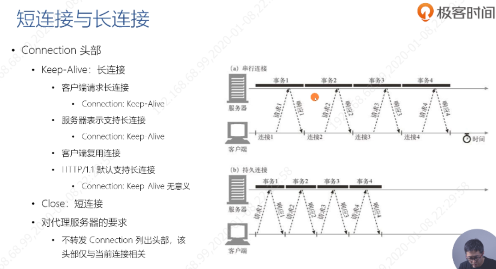
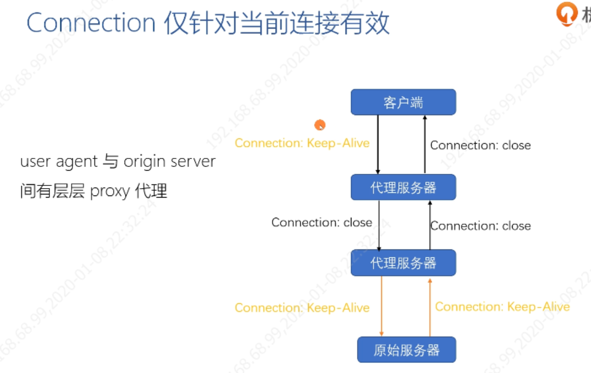
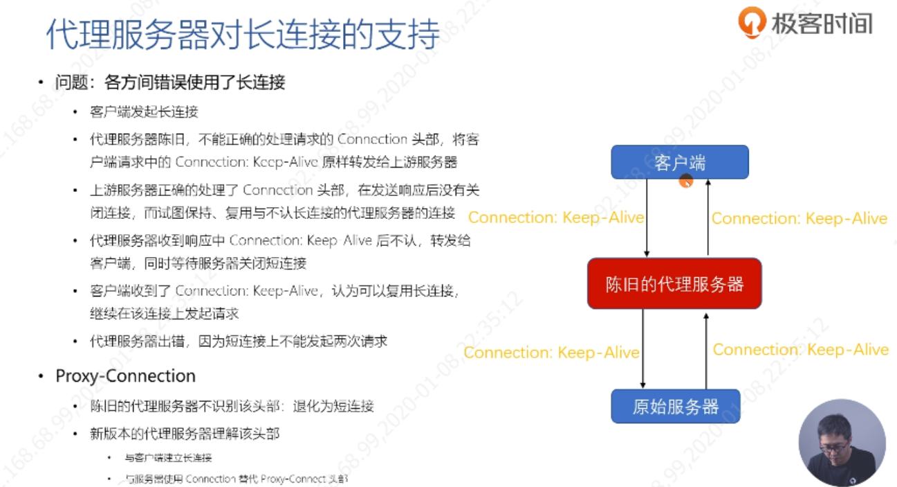
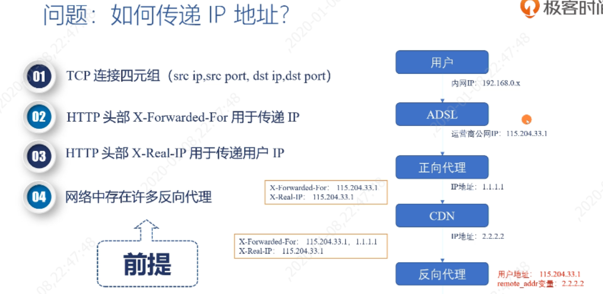
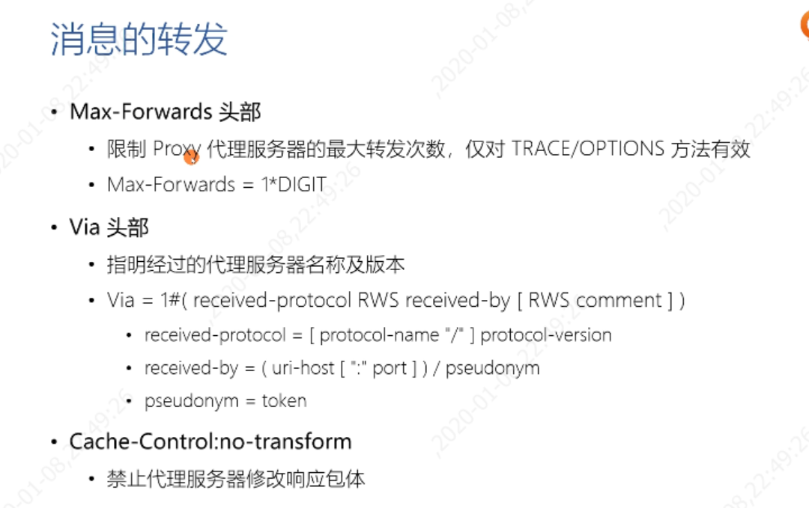
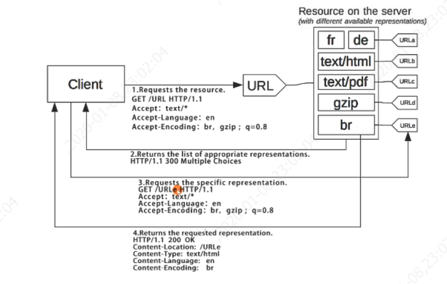
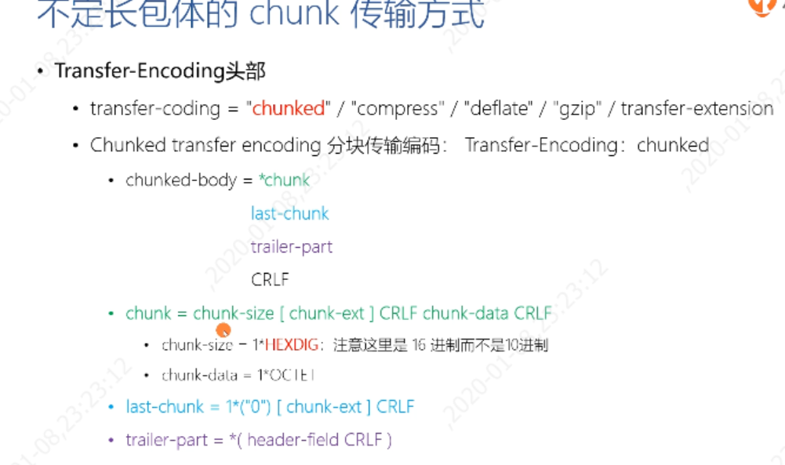

## 基础概念

### 短链接和长连接 Connection头部
提升效率
Keep-Alive 

Connection仅对当前连接有效，和代理服务器时候
1. 代理服务器可以认识Connection
2. 代理服务器不认识Connection，不i原封不动的把Connection发给目标服务器，引入一个Proxy-Connection，旧版本不识别 就是短连接，而新版本认识这个 就会使用Connection来代替

### 如何传递IP地址

Max-Forwards头部：限制Proxy代理服务器的最大转发次数。仅对TRACE/OPTIONS方法有效
Via头部：经过的代理服务器名称及版本
Cache-Control:

### 请求与响应的上下文
#### 请求上下文
User-Agent：表示请求的浏览器版本号等内容
Referer：当前浏览器来自某一页面的连接
#### 响应上下文
Server：服务器的信息
Allow：允许执行的方法
Accept-Ranges：

### 内容协商
决定服务器端用不同的方式来返回。
主动式内容协商（Proactive）
Accept:
Accept-Language:
Accept-Encoding:
响应式内容协商（Reactive） 
  
服务器端认为自己没法决定，返回一个300响应码，基本很少人用复杂。
### HTTP包体方式
- 方式一
明确长度Content-Length
1. 发送HTTP消息时已能够确定包体的全部长度，Content-Length：，
当Length不对时候浏览器只能截取到Length内容，如果超过内容的话
2. 接收端处理更简单
- 方式二
不明确长度，Transfer-Encoding头部为Chunk。
1. 有这个时候Content-Length头会被忽略
2. 优点：基于长连接来传；无需计算总的内容

Content-Disposition：
附件

