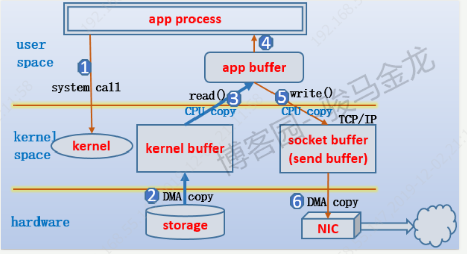
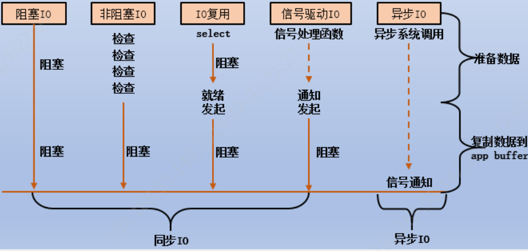
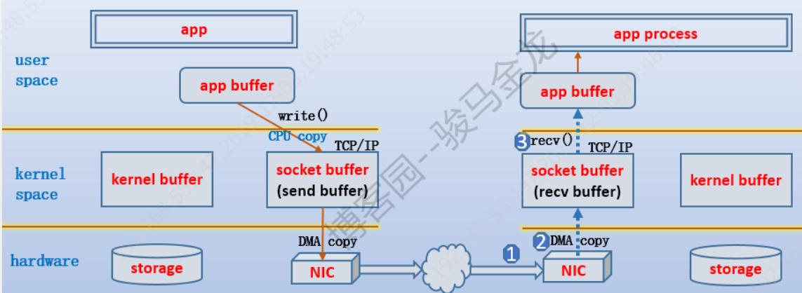
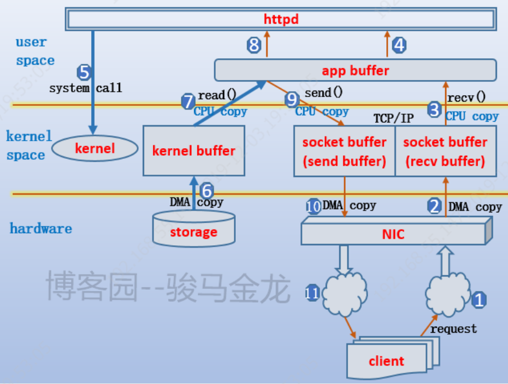
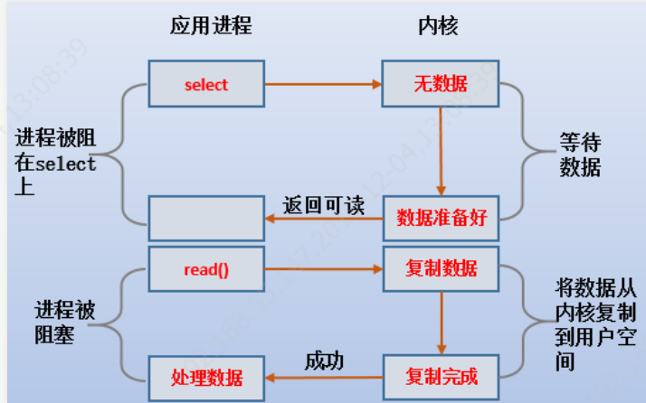

## IO模型


### IO基础概念

[基础概念](https://www.cnblogs.com/f-ck-need-u/p/7624733.html)



当某个程序或已存在的进程/线程(后文将不加区分的只认为是进程)需要某段数据时，它**只能**在用户空间中属于它自己的内存中访问、修改，这段内存暂且称之为app  buffer。假设需要的数据在磁盘上，那么进程首先得发起相关**系统调用**，通知内核去加载磁盘上的文件。但正常情况下，数据只能加载到**内核的缓冲区**，暂且称之为kernel buffer。数据加载到kernel buffer之后，还需将数据**复制**到app buffer。到了这里，进程就可以对数据进行访问、修改了。

对于一次IO操作，数据会先拷贝到内核空间中，然后再从内核空间拷贝到用户空间中，所以一次read操作，会经历两个阶段：

1. **数据准备** ：数据复制道kernel buffer中

2. **数据复制** ： 从kernel buffer到app buffer中

基于以上两个阶段就产生了五种不同的IO模式。

### 五种模型

[基础概念](https://www.cnblogs.com/f-ck-need-u/p/7624733.html)

1. Blocking I/O模型

2. Non-Blocking I/O模型

   关键点立即返回错误值EWOULDBLOCK，不断的polling，准备完成阻塞进行复制

3. I/O Multiplexing多路IO或IO复用模型

   select、poll和epoll，这些会阻塞 ，优点 监听多个文件 后面详细介绍

4. Signal-driven I/O模型 信号驱动模型

   http发起一个系统调用，立即返回，数据准备好（kernel buffer）会发送信号，后在发起系统调用如read，这时候会阻塞

5. Asynchronous I/O模型 异步IO模型

   httpd发起一个异步系统调用，立即返回，内核要准备好数据同时要复制到app buffer，后发送一个信号通知httpd进程。




### 阻塞与同步

阻塞非阻塞，同步异步针对的调用者和被调用者角色不同来区分的

因为同步调用、异步调用的说法，**是对于获取数据的过程而言**的，前面几种最后获取数据的 read 操作调用，都是同步的，在 read 调用时，内核将数据从内核空间拷贝到应用程序空间，这个过程是在 read 函数中同步进行的，如果内核实现的拷贝效率很差，read 调用就会在这个同步过程中消耗比较长的时间。

同步里面有**阻塞和非阻塞**的，异步里面只有非阻塞

阻塞与非阻塞
1. 阻塞：访问数据时候会一直等待数据准备就绪才继续处理
2. 非阻塞：不论数据是否准备好直接返回

接口

同步与异步
1. 同步：当前线程直接参与IO阻塞的方式来实现
2. 异步：当前线程不直接参与，可处理其他事情，等IO完成后调用一个通知

### JAVA IO模型

- NIO：

  ` linux`多路复用技术 (`select`模式)实现IO事件的轮询方式**同步非阻塞**的模式这种方式目前是主流的网络通信模式

  目前市面上的这种模式的框架有：`Mina, netty，mina2.0，nett5.0`–网络通信框架比直接写；不断的去轮询询问数据是否已经准备好了

  NIO要容易些，并且代码可读性更好。

  [为何要用IO多路复用技术](https://www.zhihu.com/question/32163005)

- BIO:

  `JDK1.4`以前使用都是`BIO`阻塞`IO`，主要是阻塞到线程来操作的，但对于线程的开销本来就是性能的浪费。

  **同步阻塞**

  面向流编程

- AIO:

  `jdk1.7(NIO2)`才是实现真正的异步`aio`,学习 它的思想主要是借鉴了`linux epoll`模式。
  
  **异步非阻塞** 数据准备好了会自动通知回来


### 常见问题

#### 基础概念 

##### 为什么不能直接将数据加载到app buffer呢？

实际上是可以的，有些程序或者硬件为了提高效率和性能，可以实现**内核旁路的功能**，避过内核的参与，直接在存储设备和app buffer之间进行数据传输，例如**RDMA技术**就需要实现这样的内核旁路功能。

但是，最普通也是绝大多数的情况下，**为了安全和稳定性**，数据必须先拷入内核空间的kernel buffer，再复制到app buffer，**以防止进程串进内核空间进行破坏**。

##### 上面提到的数据几次拷贝过程，拷贝方式是一样的吗？

不一样。现在的存储设备(包括网卡)基本上都支持DMA操作。什么是DMA(direct memory  access，直接内存访问)？简单地说，就是**内存和设备**之间的数据交互**可以直接传输，不再需要计算机的CPU参与**，而是通过硬件上的芯片(可以简单地认为是一个小cpu)进行控制。

假设，存储设备不支持DMA，那么数据在内存和存储设备之间的传输，**必须**通过计算机的CPU计算从哪个地址中获取数据、拷入到对方的哪些地址、拷入多少数据(多少个数据块、数据块在哪里)等等**，仅仅完成一次数据传输，CPU都要做很多事情。而DMA就**释放了计算机的CPU，让它可以去处理其他任务。

再说kernel buffer和app buffer之间的复制方式，这是两段内存空间的数据传输，**只能**由CPU来控制。

所以，在加载硬盘数据到kernel buffer的过程是DMA拷贝方式，而从kernel buffer到app buffer的过程是CPU参与的拷贝方式。

##### 如果数据要通过TCP连接传输出去要怎么办？

例如，web服务对客户端的响应数据，需要通过TCP连接传输给客户端。

TCP/IP协议栈维护着**两个**缓冲区：send buffer和recv buffer，它们合称为socket  buffer。需要通过TCP连接传输出去的数据，需要先复制到send  buffer，再复制给网卡通过网络传输出去。如果通过TCP连接接收到数据，数据首先通过网卡进入recv buffer，再被复制到用户空间的app buffer。

同样，在数据复制到send buffer或从recv buffer复制到app buffer时，是CPU参与的拷贝。从send buffer复制到网卡或从网卡复制到recv buffer时，是DMA操作方式的拷贝。

如下图所示，是通过TCP连接传输数据时的过程。



##### **网络数据一定要从kernel buffer复制到app buffer再复制到send buffer吗**？

不是。如果进程不需要修改数据，就直接发送给TCP连接的另一端，可以不用从kernel buffer复制到app buffer，而是直接复制到send buffer。这就是**零复制**技术。[零复制](https://www.cnblogs.com/f-ck-need-u/p/7615914.html)

例如httpd不需要访问和修改任何信息时，将数据原原本本地复制到app buffer再原原本本地复制到send buffer然后传输出去，但实际上复制到app buffer的过程是可以省略的。使用零复制技术，就可以减少一次拷贝过程，提升效率。

当然，实现零复制技术的方法有多种，见我的另一篇结束零复制的文章：[零复制(zero copy)技术](http://www.cnblogs.com/f-ck-need-u/p/7615914.html)。

以下是以httpd进程处理文件类请求时比较完整的数据操作流程。又对数据进行操作




**select() poll() epoll()3个的介绍**？

IO复用模型模型常用到这块，用户监控指定文件描述符的数据是否准备就绪；就绪区分**是否可读，是否可写，是否异常**。就绪后进程可在发起数据调用如read()。这3个函数处理的就是**数据是否准备好以及如何通知进程的问题**。



Select逻辑大概如下

```c++
FD_ZERO
for() {
    FD_SET()
    select()
    if(){
        FD_ISSET()
        FD_CLR()
    }
    writen()
}
```

1. FD_SET宏函数创建描述符集合，此时集合中的文件描述符都被打开，也就是稍后要被select()**监控**对象
2. 使用select()函数监控描述符集合。当某个文件描述符**满足就绪**条件时，select()函数返回集合中满足条件的数量。图中标黄色的小方块表示满足就绪条件的描述符
3. 通过FD_ISSET宏函数**遍历**整个描述符集合，并将满足就绪条件的描述符发送给进程。同时，使用FD_CLR宏函数将满足就绪条件的描述符从集合中移除
4. 进入下一个循环，继续使用FD_SET宏函数向描述符集合中添加新的待监控描述符。然后重复(2)、(3)两个步骤

poll逻辑如下
和select 逻辑类似 但是可以监听大于1024文件描述符

epoll逻辑如下
(1).epoll_create()创建的epoll实例可以随时通过epoll_ctl()来**新增和删除**感兴趣的文件描述符，不用再和select()每个循环后都要使用FD_SET更新描述符集合的数据结构。
(2).在epoll_create()创建epoll实例时，还创建了一个epoll**就绪链表list**。而epoll_ctl()每次向epoll实例添加描述符时，还会注册该描述符的**回调函数**。当epoll实例中的描述符满足就绪条件时将**触发**回调函数，被移入到就绪链表list中。
(3).当调用epoll_wait()进行监控时，它只需确定就绪链表中**是否有数据**即可，如果有，将复制到用户空间以被进程处理，如果没有，它将被阻塞。当然，如果监控的对象设置为非阻塞模式，它将不会被阻塞，而是不断地去检查。
也就是说，epoll的处理方式中，根本就无需遍历描述符集合
当 Socket 收到数据后，中断程序会给 eventpoll 的“就绪列表”添加 Socket 引用
``` c++
int s = socket(AF_INET, SOCK_STREAM, 0);   
bind(s, ...)
listen(s, ...)

int epfd = epoll_create(...);
epoll_ctl(epfd, ...); //将所有需要监听的socket添加到epfd中

while(1){
    int n = epoll_wait(...)
    for(接收到数据的socket){
        //处理
    }
}
```

