# Linux下 Socket学习

## Socket 源码学习

### 总体说明：
socket：网络上的两个程序通过一个双向的通信连接实现数据的交换，这个连接的一端称为一个socket。这是一种全双工的通信方式，socket的两端既可以读，又可以写。
整体流程 收发数据流程
监听状态的套接字
已经建立连接的套接字

[Socket Tcp连接过程](https://www.cnblogs.com/f-ck-need-u/p/7623252.html)

### 需要掌握的知识点
1. Linux虚拟文件系统

### 几个数据结构

+ struct socket 
+ struct sock
+ struct inet_sock <- sock
+ struct inet_connection_sock <- inet_sock  客户端与服务端的结构连接队列
  {
  	icsk_accept_queue   //已经建立连接队列
  }
+ struct  tcp_sock <- inet_connection_sock TCP 连接状态的重要数据结构
+ struct sk_buff  //是存储网络包的重要的数据结构，在应用层数据包叫 data，在 TCP 层我们称为 segment，在 IP 层我们叫 packet，在数据链路层称为 frame。在 struct sk_buff，首先是一个链表，将 struct sk_buff 结构串起来。

### 整体流程

- TCP流程

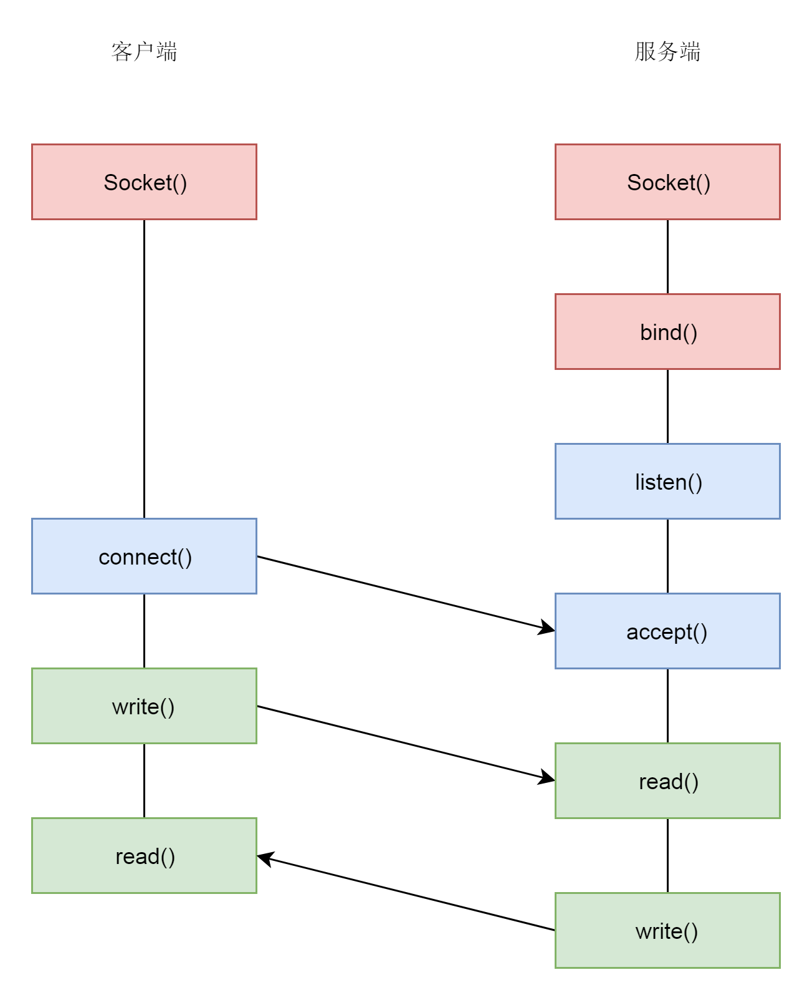

- 建立连接流程

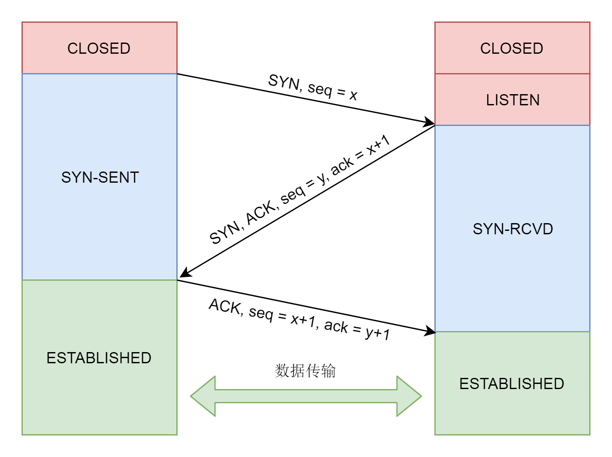

- UDP 流程

  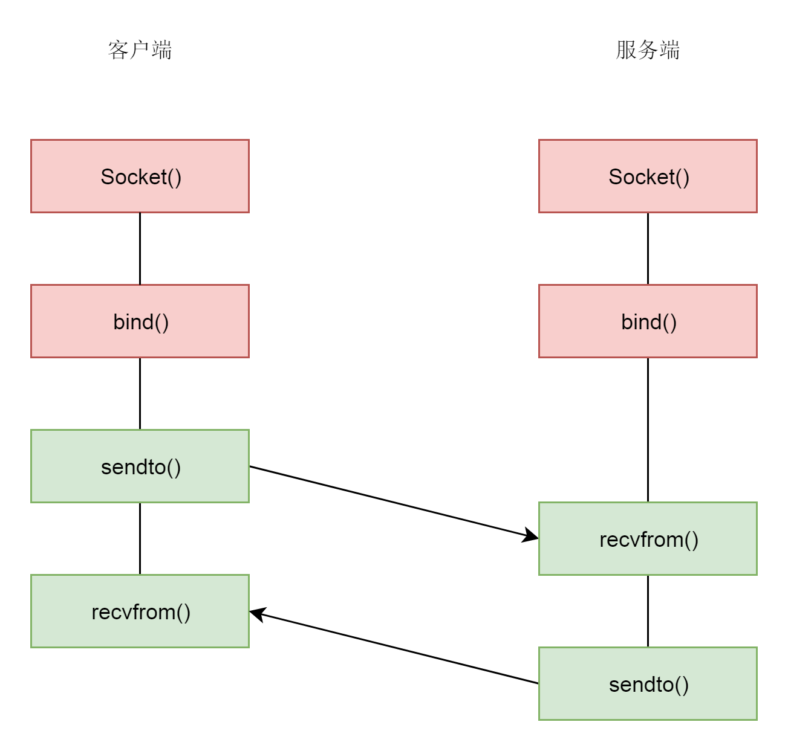

- 用户态和内核态的

  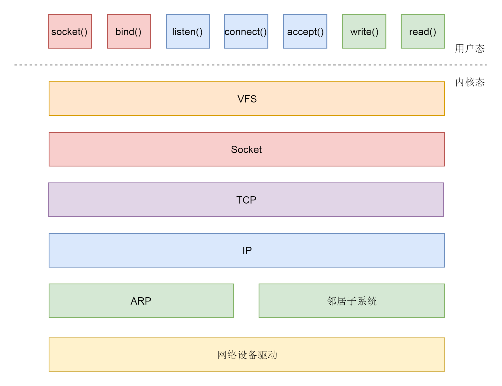

### 相关具体流程

- 创建Socket流程

  根据地址族等创建，创建好在linux 就是一个虚拟文件操作

- bind流程

  通过fd文件描述符找到socket结构

- listen 流程
  转化结构 inet_connection_sock
  在 TCP 的状态里面，有一个 listen 状态，当调用 listen 函数之后，就会进入这个状态，虽然我们写程序的时候，一般要等待服务端调用 accept 后，等待在那里的时候，让客户端就发起连接。其实服务端一旦处于 listen 状态，不用 accept，**客户端也能发起连接**。其实 TCP 的状态中，没有一个是否被 accept 的状态，那 accept 函数的作用是什么呢？
  在内核中，为每个 Socket 维护两个队列。一个是**已经建立了连接**的队列，这时候连接三次握手已经完毕，处于 established 状态；一个是**还没有完全建立连接**的队列，这个时候三次握手还没完成，处于 syn_rcvd 的状态。
  服务端调用 accept 函数，其实是在第一个队列中拿出一个已经完成的连接进行处理。如果还没有完成就阻塞等待。这里的 icsk_accept_queue 就是第一个队列。
  初始化完之后，将 TCP 的状态设置为 TCP_LISTEN，再次调用 get_port 判断端口是否冲突。

- accpet 流程
  accept 函数的实现，印证了 socket 的原理中说的那样，原来的 socket 是监听 socket，这里我们会找到原来的 struct socket，**并基于它去创建一个新的 newsock**。这才是连接 socket。除此之外，我们还会创建一个新的 struct file 和 fd，并关联到 socket。
  如果icsk_accept_queue为空，则进行等待，让出cpu等 可以参考 我们lock里面的实现同步等待的一个实现逻辑

  一个死循环for判断队列是否有数据

- connect 函数
	- 客户端
		什么情况下，icsk_accept_queue 才不为空呢？当然是三次握手结束才可以。接下来我们来分析三次握手的过程。图
		1. 获得道路由要知道从哪个网卡出去
		2. 初始化一个SYN包将SYN包发出去
		   1. 问题：SYN包大概内容时什么样的
		3. 一直等待客户端收服务端的ACK 状态为TCP_SYN_SENT
		4. 收到服务端返回返回一个ACK-ACK，状态为TCP_ESTABLISHED
			1. 问题：如果ACK-ACK服务端还没收到，这时候就发起数据传送可以吗
	- 服务端
		1. 收到SYN，回复一个ACK，服务端此时处于TCP_SYN_RECV
		
		2. 收到客户端的ACK-ACK 服务端也是TCP_ESTABLISHED
		
		   .jpg)
	
- write操作 

  1. VFS 层：write 系统调用找到 struct file，根据里面的 file_operations 的定义，调用 sock_write_iter 函数。sock_write_iter 函数调用 sock_sendmsg 函数。

  2. Socket 层：从 struct file 里面的 private_data 得到 struct socket，根据里面 ops 的定义，调用 inet_sendmsg 函数。

  3. Sock 层：从 struct socket 里面的 sk 得到 struct sock，根据里面 sk_prot 的定义，调用 tcp_sendmsg 函数。

     把应用层数据存入道sk_buff（这个数据结构包括各层的header）

     - 循环获取数据放到sk_buff，判断MSS大小

     - 问题：这块会浪费内存 同样数据从用户态拷贝到内核出于什么样的考虑
     - 问题：这边要把所有数据都获取完吗，不能边获取边发吗

  4. TCP 层：tcp_sendmsg 函数会调用 tcp_write_xmit 函数，tcp_write_xmit 函数会调用 tcp_transmit_skb，在这里实现了 TCP 层面向连接的逻辑。
     - 发送网络包 TSO 切分
     - 拥塞窗口控制发送频率 怕网络不稳定 互相试探看丢包情况
     - 接收窗口（滑动窗口），怕接收方塞满 TCPheader 定义
     - 填充TCP头

  5. IP 层：扩展 struct sock，得到 struct inet_connection_sock，根据里面 icsk_af_ops 的定义，调用 ip_queue_xmit 函数。

  6. IP 层：ip_route_output_ports 函数里面会调用 fib_lookup **查找路由表**。FIB 全称是 Forwarding Information Base，转发信息表，也就是路由表。

  7. 在 IP 层里面要做的另一个事情是填写 IP 层的头。

  8. 在 IP 层还要做的一件事情就是通过 iptables 规则。

  9. MAC 层：IP 层调用 ip_finish_output 进行 MAC 层。

  10. MAC 层需要 ARP 获得 MAC 地址，因而要调用 ___neigh_lookup_noref 查找属于同一个网段的邻居，他会调用 neigh_probe 发送 ARP。

  11. 有了 MAC 地址，就可以调用 dev_queue_xmit 发送二层网络包了，它会调用 __dev_xmit_skb 会将请求放入队列。

  12. 设备层：网络包的发送回触发一个软中断 NET_TX_SOFTIRQ 来处理队列中的数据。这个软中断的处理函数是 net_tx_action。

  13. 在软中断处理函数中，会将网络包从队列上拿下来，调用网络设备的传输函数 ixgb_xmit_frame，将网络包发的设备的队列上去。

  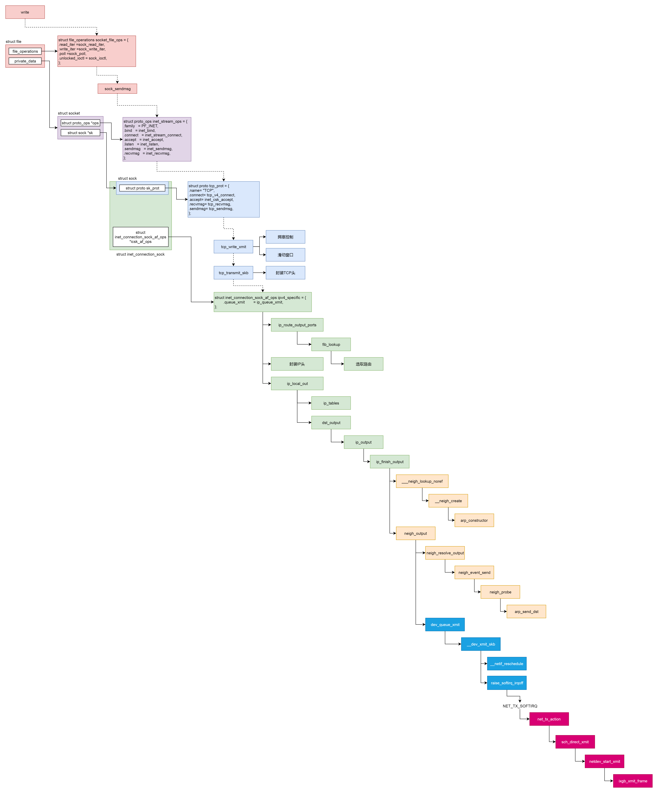

- read流程

  内核态

  - 硬件网卡接收到网络包之后，通过 DMA 技术，将网络包放入 Ring Buffer；
  - 硬件网卡通过中断通知 CPU 新的网络包的到来；
  - 网卡驱动程序会注册中断处理函数 ixgb_intr；
  - 中断处理函数处理完需要暂时屏蔽中断的核心流程之后，通过软中断 NET_RX_SOFTIRQ 触发接下来的处理过程；
  - NET_RX_SOFTIRQ 软中断处理函数 net_rx_action，net_rx_action 会调用 napi_poll，进而调用 ixgb_clean_rx_irq，从 Ring Buffer 中读取数据到内核 struct sk_buff；
  - 调用 netif_receive_skb 进入内核网络协议栈，进行一些关于 VLAN 的二层逻辑处理后，调用 ip_rcv 进入三层 IP 层；
  - 在 IP 层，会处理 iptables 规则，然后调用 ip_local_deliver 交给更上层 TCP 层；
  - 在 TCP 层调用 tcp_v4_rcv，这里面有三个队列需要处理，如果当前的 Socket 不是正在被读；取，则放入 backlog 队列，如果正在被读取，不需要很实时的话，则放入 prequeue 队列，其他情况调用 tcp_v4_do_rcv；
  - 在 tcp_v4_do_rcv 中，如果是处于 TCP_ESTABLISHED 状态，调用 tcp_rcv_established，其他的状态，调用 tcp_rcv_state_process；
  - 在 tcp_rcv_established 中，调用 tcp_data_queue，如果序列号能够接的上，则放入 sk_receive_queue 队列；如果序列号接不上，则暂时放入 out_of_order_queue 队列，等序列号能够接上的时候，再放入 sk_receive_queue 队列。

  用户态网络包的过程，这个过程分成几个层次。

  - VFS 层：read 系统调用找到 struct file，根据里面的 file_operations 的定义，调用 sock_read_iter 函数。sock_read_iter 函数调用 sock_recvmsg 函数。

  - Socket 层：从 struct file 里面的 private_data 得到 struct socket，根据里面 ops 的定义，调用 inet_recvmsg 函数。

  - Sock 层：从 struct socket 里面的 sk 得到 struct sock，根据里面 sk_prot 的定义，调用 tcp_recvmsg 函数。

  - TCP 层：tcp_recvmsg 函数会依次读取 receive_queue 队列、prequeue 队列和 backlog 队列。

    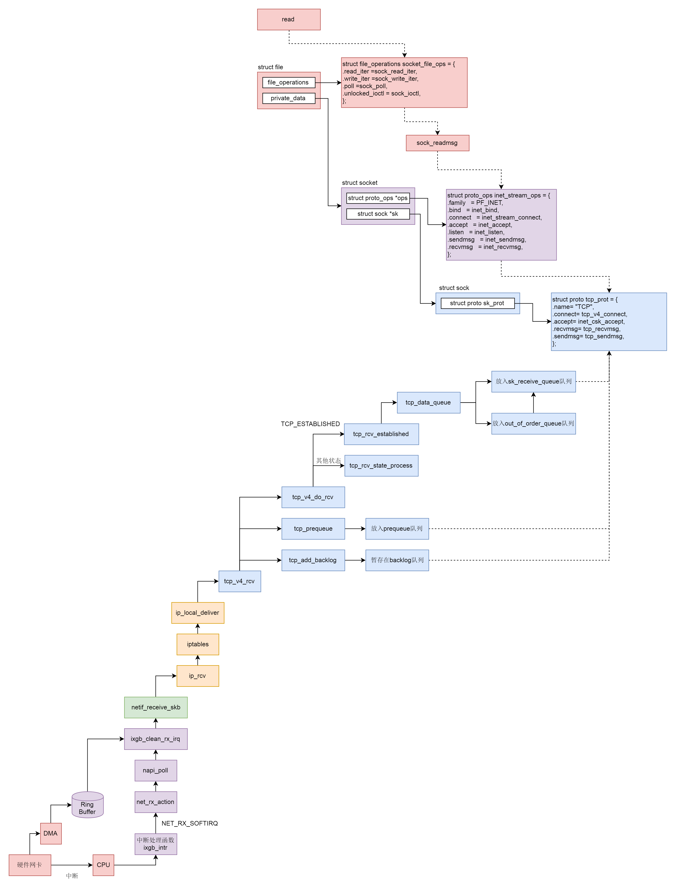

### 常见问题与解答：
1. 服务端create bind listen accept  connect 都市做了哪些内容

2. 如何等待新来的连接 

3. 为什么获取字的时候是获取1024

4. 用户态和内核态区别

5. syn flood的影响
    此外，如果监听者发送SYN+ACK后，迟迟收不到客户端返回的ACK消息，监听者将被select()/poll()设置的超时时间唤醒，并对该客户端**重新发送**SYN+ACK消息，防止这个消息遗失在茫茫网络中。但是，这一重发就出问题了，如果客户端调用connect()时**伪造源地址**，那么监听者回复的SYN+ACK消息是一定到不了**对方的主机的**，也就是说，监听者会迟迟收不到ACK消息，于是重新发送SYN+ACK。但无论是监听者因为select()/poll()设置的超时时间一次次地被唤醒，还是一次次地将数据拷入send buffer，这期间都是**需要CPU**参与的，而且send  buffer中的SYN+ACK还要再拷入网卡(这次是DMA拷贝，不需要CPU)。如果，这个客户端是个攻击者，源源不断地发送了数以千、万计的SYN，监听者几乎直接就崩溃了，网卡也会被阻塞的很严重。这就是所谓的syn flood攻击。
解决syn  flood的方法有多种，例如，缩小listen()维护的两个队列的最大长度，减少重发syn+ack的次数，增大重发的时间间隔，减少收到ack的等待超时时间，使用syncookie等，但直接修改tcp选项的**任何一种方法都不能很好兼顾性能和效率**。所以在连接到达监听者线程之前对**数据包进行过滤**是极其重要的手段。


## 阻塞和非阻塞read/write

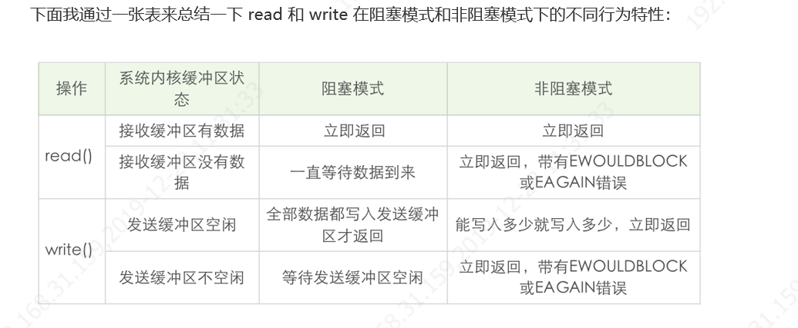
总体说明：
1. read 总是在接收缓冲区有数据时就立即返回，不是等到应用程序给定的数据充满才返回。当接收缓冲区为空时，阻塞模式会等待，非阻塞模式立即返回 -1，并有 EWOULDBLOCK 或 EAGAIN 错误。
2. 和 read 不同，阻塞模式下，write 只有在发送缓冲区足以容纳应用程序的输出字节时才返回；而非阻塞模式下，则是**能写入多少就写入多少**，**并返回实际写入的字节数**。
3. 阻塞模式下的 write 有个特例, 就是对方主动关闭了套接字，这个时候 **write 调用会立即返回**，并通过返回值告诉应用程序实际写入的字节数，如果再次对这样的套接字进行 write 操作，就会返回失败。失败是通过**返回值 -1 来通知**到应用程序的。
### read

```c
#include<unistd.h>
ssize_t read(int filedes,void *buf,size_t nbytes);
```
如read成功，则返回读到的字节数。如已到达文件结尾，则返回0.，一般请求大小和返回大小一致。
读**常规文件是不会阻塞的**，不管读多少字节，read一定会在有限的时间内返回。从终端设备或网络读则不一定，如果从终端输入的数据没有换行符，调用read读终端设备就会阻塞，如果网络上没有接收到数据包，调用read从网络读就会阻塞，至于会阻塞多长时间也是不确定的，如果一直没有数据到达就一直阻塞在那里

- 读常规文件时，在读到count个字节之前已到达文件末尾。例如，距文件末尾还有30个字节而请求读100个字节，则read返回30，下次read将返回0。
- 从终端设备读，通常以行为单位，读到换行符就返回了。
- 从网络读，根据不同的传输层协议和内核缓存机制，返回值可能小于请求的字节数，后面socket编程部分会详细讲解
  
#### 阻塞读

#### 非阻塞读

如果套接字对应的接收缓冲区没有数据可读，在非阻塞情况下 read 调用会立即返回，一般返回 **EWOULDBLOCK 或 EAGAIN 出错信息**。在这种情况下，出错信息是需要小心处理，比如后面再次调用 read 操作，而不是直接作为错误直接返回。这就好像去书店买书没买到离开一样，需要不断进行又一次轮询处理

    while(1) {
    	非阻塞read(设备1);
    	if(设备1有数据到达)
    		处理数据;
    	非阻塞read(设备2);
    	if(设备2有数据到达)
    		处理数据;
    	sleep(n);
    }
### write
不知道你有没有注意到，在阻塞 I/O 情况下，write 函数返回的字节数，和输入的参数总是一样的。如果返回值总是和输入的数据大小一样，write 等写入函数还需要定义返回值吗？我不知道你是不是和我一样，刚接触到这一部分知识的时候有这种困惑。
非阻塞 I/O 需要这样：拷贝→返回→再拷贝→再返回。
不过在实战中，你可以不用区别阻塞和非阻塞 I/O，**使用循环的方式**来写入数据就好了。只不过在阻塞 I/O 的情况下，循环只执行一次就结束了。
```c
#include<unistd.h>
ssize_t write(int filedes,const void *buf,size_t nbytes);
```

写常规文件时，`write`的返回值通常等于请求写的字节数`count`，而向终端设备或网络写则不一定。写常规文件是不会阻塞的，而向终端设备或网络写则不一定。

### 非阻塞accept
如果把监听套接字设置成阻塞，当监听事件可读时候，在进行accept的时候，如果客户端断掉连接，accept就会一直阻塞。如果我们将监听套接字设为非阻塞，上述的情形就不会再发生。只不过对于 accept 的返回值，需要正确地处理各种看似异常的错误，例如忽略 EWOULDBLOCK、EAGAIN 等。
这个例子给我们的启发是，**一定要将监听套接字设置为非阻塞的**，尽管这里休眠时间 5 秒有点夸张，但是在极端情况下处理不当的服务器程序是有可能碰到文稿中例子所阐述的情况，为了让服务器程序在极端情况下工作正常，这点工作还是非常值得的。

### 非阻塞IO与多路复用
非阻塞 I/O 可以使用在 read、write、accept、connect 等多种不同的场景，在非阻塞 I/O 下，使用轮询的方式引起 CPU 占用率高，所以一般将非阻塞 I/O 和 I/O 多路复用技术 select、poll 等搭配使用，在非阻塞 I/O 事件发生时，再调用对应事件的处理函数。这种方式，极大地提高了程序的健壮性和稳定性，是 Linux 下高性能网络编程的首选。


## I/O多路复用

### Select

通过监听多个事件 ，当事件处理完成后，控制权返回；使用 select 函数，通知内核挂起进程，当一个或多个 I/O 事件发生后，控制权返还给应用程序，由应用程序进行 I/O 事件的处理

它通过描述符集合来表示检测的 I/O 对象，通过**三个不同的描述符集合**来描述 I/O 事件 ：可读、可写和异常。但是 select 有一个缺点，那就是所支持的文件**描述符的个数是有限的**。在 Linux 系统中，select 的默认最大值为 1024。

#### 使用方法

```c
int select(int maxfd, fd_set *readset, fd_set *writeset, fd_set *exceptset, const struct timeval *timeout);
```

返回：若有就绪描述符则为其数目，若超时则为 0，若出错则为 -1

#### 套接字描述符就绪条件

当我们说 select 测试返回，某个套接字准备好可读，表示什么样的事件发生呢？
第一种情况是套**接字接收缓冲区有数据可以读**，如果我们使用 read 函数去执行读操作，肯定***不会被阻塞***，而是会直接读到这部分数据。
第二种情况是对方发送了 FIN，使用 read 函数执行读操作，不会被阻塞，**直接返回 0**。
第三种情况是针对一个**监听套接字而言**的，有已经完成的连接建立，此时使用 accept 函数去执行不会阻塞，直接返回已经完成的连接。
第四种情况是套接字有错误待处理，使用 read 函数去执行读操作，不阻塞，且返回 -1。
总结成一句话就是，**内核通知我们套接字有数据可以读**了，使用 read 函数不会阻塞。
不知道你是不是和我一样，刚开始理解某个套接字可写的时候，会有一个错觉，总是从应用程序角度出发去理解套接字可写，我开始是这样想的，当应用程序完成相应的计算，有数据准备发送给对端了，可以往套接字写，对应的就是套接字可写。
其实这个理解是非常不正确的，select 检测**套接字可写**，**完全是基于套接字本身的特性来说**的，具体来说有以下几种情况。
第一种是套接字发送缓冲区足够大，如果我们使用**非阻塞套接字进行 write 操作**，将不会被阻塞，直接返回。
第二种是连接的写半边已经关闭，如果继续进行写操作将会产生 SIGPIPE 信号。
第三种是套接字上有错误待处理，使用 write 函数去执行读操作，不阻塞，且返回 -1。
总结成一句话就是，**内核通知我们套接字可以往里写了**，使用 write 函数就不会阻塞。


### poll函数
突破文件描述符个数，poll 每次检测之后的结果不会修改原来的传入值，而是将结果保留在 revents 字段中，这样就**不需要每次检测完都得重置待检测的描述字和感兴趣的事件**。我们可以把 revents 理解成“returned events”。
#### 使用方法
```c
int poll(struct pollfd *fds, unsigned long nfds, int timeout); 
```
返回：若有就绪描述符则为其数目，若超时则为 0，若出错则为 -1
这个函数里面输入了三个参数，第一个参数是一个 pollfd 的数组。其中 pollfd 的结构如下
```c
struct pollfd {
    int    fd;       /* file descriptor */
    short  events;   /* events to look for */
    short  revents;  /* events returned */
 };
```
 events 分为以下几个：
 1. 可读事件
 ```c
#define POLLIN     0x0001    /* any readable data available */
#define POLLPRI    0x0002    /* OOB/Urgent readable data */
#define POLLRDNORM 0x0040    /* non-OOB/URG data available */
#define POLLRDBAND 0x0080    /* OOB/Urgent readable data */
 ```
 2. 可写事件
 ```c
#define POLLOUT    0x0004    /* file descriptor is writeable */
#define POLLWRNORM POLLOUT   /* no write type differentiation */
#define POLLWRBAND 0x0100    /* OOB/Urgent data can be written */
 ```
 3. returned events 除了上面两个还有以下
 ···c
#define POLLERR    0x0008    /* 一些错误发送 */
#define POLLHUP    0x0010    /* 描述符挂起 */
#define POLLNVAL   0x0020    /* 请求的事件无效 */

### epoll函数
#### 用法
使用 epoll 进行网络程序的编写，需要三个步骤，分别是 epoll_create，epoll_ctl 和 epoll_wait。
1. epoll_create 创建一个epoll

   ```c
   int epoll_create(int size);
   int epoll_create1(int flags);
           返回值: 若成功返回一个大于 0 的值，表示 epoll 实例；若返回 -1 表示出错
   ```

2. epoll_ctl 增加或删除监控事件

   ```c
    int epoll_ctl(int epfd, int op, int fd, struct epoll_event *event); 返回值: 若成功返回 0；若返回 -1 表示出错
   ```

   在创建完 epoll 实例之后，可以通过调用 epoll_ctl 往这个 epoll 实例增加或删除监控的事件。函数 epll_ctl 有 4 个入口参数。

   第一个参数 epfd 是刚刚调用 epoll_create 创建的 epoll 实例描述字，可以简单理解成是 epoll 句柄。

   第二个参数表示增加还是删除一个监控事件，它有三个选项可供选择：

   - EPOLL_CTL_ADD： 向 epoll 实例**注册**文件描述符对应的事件；
   - EPOLL_CTL_DEL：向 epoll 实例**删除**文件描述符对应的事件；
   - EPOLL_CTL_MOD： **修改**文件描述符对应的事件。

   第三个参数是注册的事件的文件描述符，比如**一个监听套接字。

   第四个参数表示的是注册的事件类型，并且可以在这个结构体里设置用户需要的数据，其中最为常见的是使用联合结构里的 fd 字段，表示事件所对应的文件描述符。

   ```
   typedef union epoll_data {
        void        *ptr;
        int          fd;
        uint32_t     u32;
        uint64_t     u64;
    } epoll_data_t;
    
    struct epoll_event {
        uint32_t     events;      /* Epoll events */
        epoll_data_t data;        /* User data variable */
    };
   ```

   我们在前面介绍 poll 的时候已经接触过基于 mask 的事件类型了，这里 epoll 仍旧使用了同样的机制，我们重点看一下这几种事件类型：

   - EPOLLIN：表示对应的文件描述字可以读；
   - EPOLLOUT：表示对应的文件描述字可以写；
   - EPOLLRDHUP：表示套接字的一端已经关闭，或者半关闭；
   - EPOLLHUP：表示对应的文件描述字被挂起；
   - EPOLLET：设置为 edge-triggered，默认为 level-triggered。
   
3. epoll_wait等待内核事件的分发

   ```c
   int epoll_wait(int epfd, struct epoll_event *events, int maxevents, int timeout);
   返回值: 成功返回的是一个大于 0 的数，表示事件的个数；返回 0 表示的是超时时间到；若出错返回 -1.
   ```

   epoll_wait() 函数类似之前的 poll 和 select 函数，调用者进程被挂起，在等待内核 I/O 事件的分发。
   这个函数的第一个参数是 epoll 实例描述字，也就是 epoll 句柄。
   第二个参数返回给用户空间需要处理的 I/O 事件，这是一个数组，数组的大小由 epoll_wait 的返回值决定，这个数组的每个元素都是一个**需要待处理的 I/O 事件**，其中 events 表示具体的事件类型，事件类型取值和 epoll_ctl 可设置的值一样，这个 epoll_event 结构体里的 data 值就是在 epoll_ctl 那里设置的 data，也就是用户空间和内核空间调用时需要的数据。
   第三个参数是一个大于 0 的整数，表示 epoll_wait 可以返回的最大事件值。
   第四个参数是 epoll_wait 阻塞调用的超时值，如果这个值设置为 -1，表示不超时；如果设置为 0 则立即返回，即使没有任何 I/O 事件发生。
#### 优点
1. **接口使用方便**，将epoll对象的创建，文件描述符的注册和等待三种操作拆分开，等待操作循环进行，而创建epoll对象只在刚开始时调用。不用每次设置输入。
2. 在注册新的文件描述符时不用从拷贝数据从用户到内核。只在返回时拷贝少量数据。epoll_wait返回时**只拷贝就绪队列中的文件描述符**，时间复杂度O（1），而select和poll将三种操作*在一个函数中实现**，**每次循环都要进行用户态到内核态的数据拷贝**，开销很大。
3. **避免遍历**。因为采用了**回调机制**，直接将就绪的fd加入**就绪队列**，而select在返回时需要遍历整个位图，来找到就绪的文件描述符，在用户态也要进行遍历。
4. 可监控的文件描述符个数不受限制，只要有被注册的fd，就将其挂载到红黑树上。而select可监控的fd受fd_set的大小限制，不能监控特别多的文件描述符。
5. 底层使用红黑树管理*；而边缘触发的意思是只有**第一次满足条件的时候才触发**，之后就不会再传递同样的事件了

#### 条件促发与边缘促发
条件触发的意思是只要满足事件的条件，比如有数据需要读，就**一直不断地把这个事件**传递给用户；而边缘触发的意思是**只有第一次满足条件**的时候才触发，之后就不会再传递同样的事件了。
1. 条件促发（LT）
   - 当epoll检测到socket事件就绪时，可以不立刻处理，或者只处理一部分
   - 当第一次**未读取完缓冲区中所有数据**，在第二次调用epoll_wait时，epoll_wait会立刻返回并通知socket读事件就绪。
   - 当缓冲区中所有数据处理完，再调用epoll_wait,它才不会立刻返回
   - 支持阻塞读写和非阻塞读写
2. 边缘促发（ET）
   - 当epoll检测到socket事件就绪时，必须立刻处理
   - 当第一次未读取完缓冲区中所有数据，在第二次调用epoll_wait时，epoll_wait**不会再返回了**。
   - 在ET模式下，文件描述符上的时间就绪后，只有一次处理机会
   - 比起**LT更加高效**，因为epoll_wait返回的次数少了很多

#### epoll源码分析

这个循环中通过调用 schedule_hrtimeout_range，将当前进程陷入休眠，CPU 时间被调度器调度给其他进程使用，当然，当前进程可能会被唤醒，唤醒的条件包括有以下四种：
当前进程超时；
当前进程收到一个 signal 信号；
某个描述字上有事件发生；
当前进程被 CPU 重新调度，进入 for 循环重新判断，如果没有满足前三个条件，就又重新进入休眠。

### C10K问题解决方案
#### 问题说明
如何在一台物理机上同时服务 10000 个用户？这里 **C 表示并发**，10K 等于 10000。得益于操作系统、编程语言的发展，在现在的条件下，普通用户使用 Java Netty、Libevent 等框架或库就可以轻轻松松写出支持并发超过 10000 的服务器端程序，甚至于经过优化之后可以达到十万，乃至百万的并发，但在二十年前，突破 C10K 问题可费了不少的心思，是一个了不起的突破。

#### 解决方案
需要考虑 **文件句柄 、系统内存（套接字、发送缓冲区、接收缓冲区）、网络带宽**。在系统层面的资源分析看，是可以解决这块内容的；但是在网络编程中，涉及到**频繁的用户态内核态数据拷贝**这块设计才能达到高并发的情形。因此要从两个层面统筹考虑
1. 应用程序如何和操作系统配合，感知IO事件发生，并调度处理在上万个套接字上的 I/O 操作，阻塞非阻塞处理
2. 应用程序如何分配进程、线程资源来服务上万个连接
##### 阻塞I/O+进程
父进程中创建出一个子进程；fork函数实现的时候，实际上会把当前父进程的所有相关值都克隆一份，包括地址空间、打开的文件描述符、程序计数器等，就连执行代码也会拷贝一份，新派生的进程的表现行为和父进程近乎一样，就好像是派生进程调用过 fork 函数一样。为了区别两个不同的进程，实现者可以通过改变 fork 函数的栈空间值来判断，对应到程序中就是返回值的不同。
- 要注意对套接字的关闭梳理；父进程关闭不需要的内容连接，子进程关闭监听

- 要注意对子进程进行回收，避免产生不必要的僵尸进程。由父进程派生出来的子进程，也必须由父进程负责回收，否则子进程就会变成僵尸进程。处理子进程退出的方式一般是注册一个信号处理函数，捕捉信号 SIGCHILD 信号，然后再在信号处理函数里调用 waitpid 函数来完成子进程资源的回收。SIGCHLD 是**子进程退出或者中断时由内核向父进程发出的信号**，默认这个信号是忽略的

  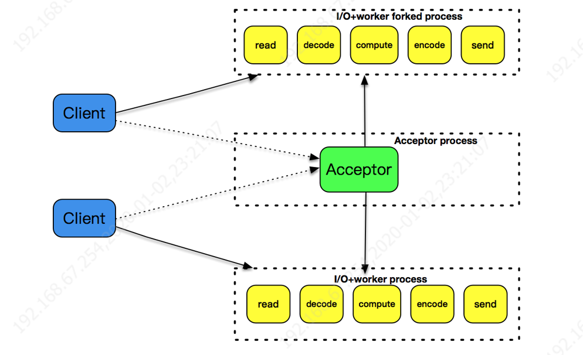
  
  

##### 阻塞 I/O + 线程

因此，引入了线程池的概念，预先创建出一个线程池，在每次新连接达到时，从线程池挑选出一个线程为之服务，很好地解决了线程创建的开销。但是，这个模式还是没有解决空闲连接占用资源的问题，如果一个连接在一定时间内没有数据交互，这个连接还是要占用一定的线程资源，直到这个连接消亡为止。

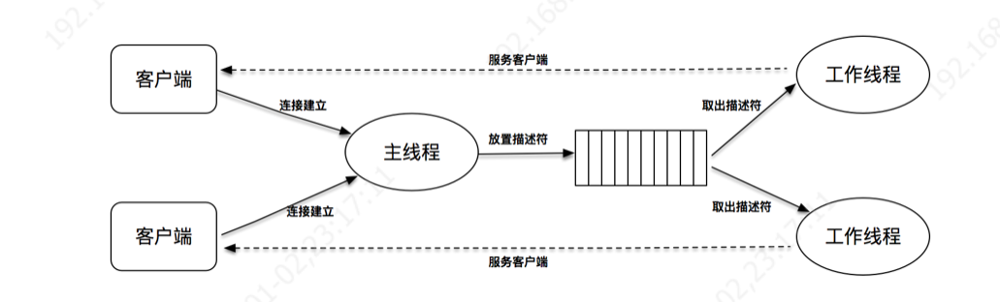

##### 非阻塞 I/O + readiness notification 
基于事件的程序设计通过使用 poll、epoll 等 I/O 分发技术，可以设计出基于套接字的事件驱动程序，从而满足高性能、高并发的需求。
事件驱动模型，也被叫做**反应堆模型（reactor）**，或者是 Event loop 模型。这个模型的核心有两点。
第一，它存在一个**无限循环的事件分发线程**，或者叫做 **reactor 线程**、Event loop 线程。这个事件分发线程的背后，就是 poll、epoll 等 I/O 分发技术的使用。
第二，所有的 I/O 操作都可以**抽象成事件**，每个事件必须有回调函数来处理。acceptor 上有连接建立成功、已连接套接字上发送缓冲区空出可以写、通信管道 pipe 上有数据可以读，这些都是一个个事件，通过事件分发，这些事件都可以一一被检测，并**调用对应的回调函数**加以处理。
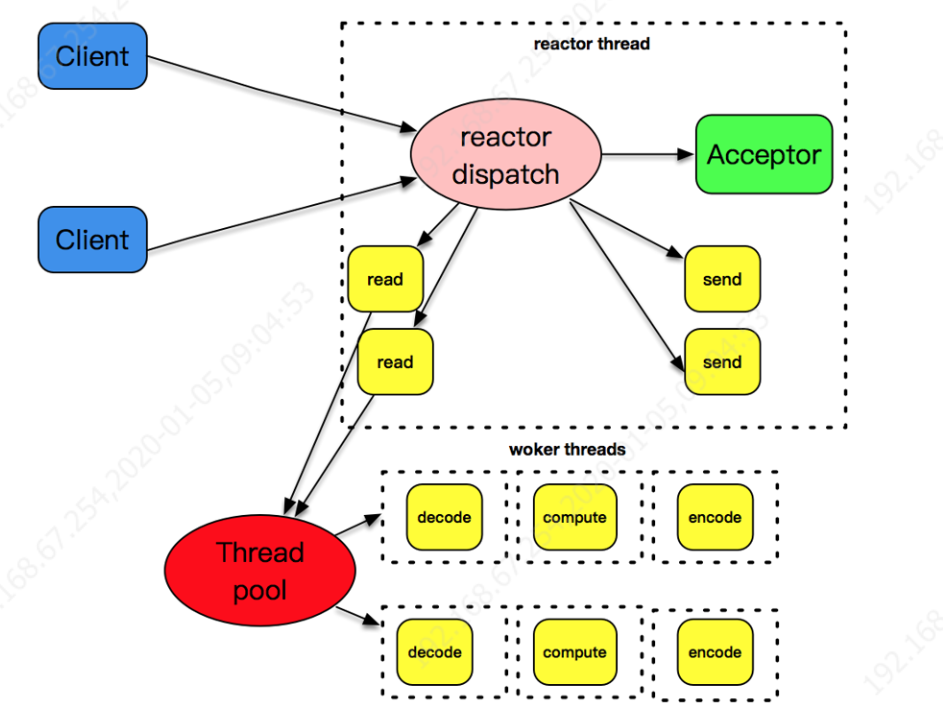
主从Reactor模式
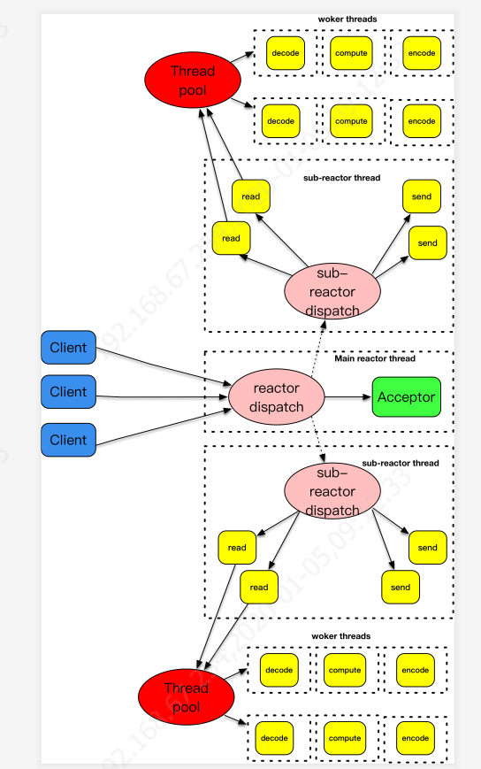

##### 异步I/O探索 


Linux下 仅仅针对磁盘类 I/O，套接字 I/O 不支持。

**Reactor 模式是基于待完成的 I/O 事件，而 Proactor 模式则是基于已完成的 I/O 事件**，两者的本质，都是借由事件分发的思想，设计出可兼容、可扩展、接口友好的一套程序框架