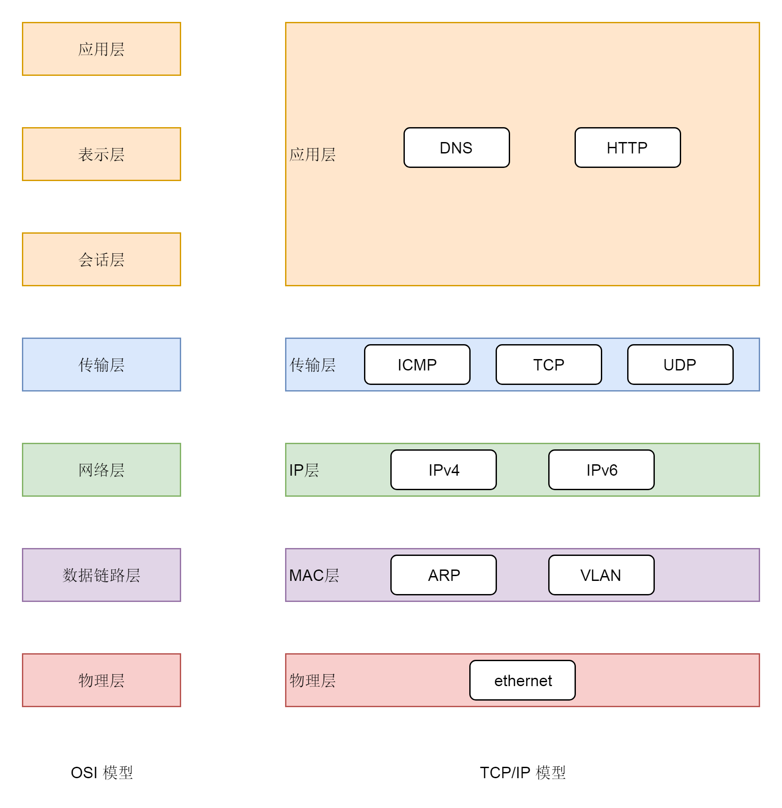

## 网络协议

### MAC层（数据链路层）
#### 解决的问题
1. 这个包是发给谁的？谁应该接收？

    可以看具体的格式，有类型区分

    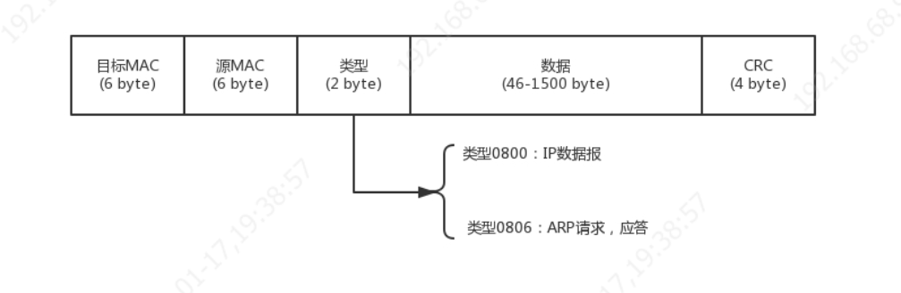

2. 大家都在发，会不会产生混乱？有没有谁先发、谁后发的规则？

    MAC的全称是Medium Access Control，即媒体访问控制。控制什么呢？其实就是控制在往媒体上发数据的时候，**谁先发、谁后发的问题**。防止发生混乱。这解决的是第二个问题。这个问题中的规则，学名叫**多路访问**。有很多算法可以解决这个问题。就像车管所管束马路上跑的车，能想的办法都想过了。
    比如接下来这三种方式：

    方式一：分多个车道。每个车一个车道，你走你的，我走我的。这在计算机网络里叫作**信道划分**；

    方式二：今天单号出行，明天双号出行，轮着来。这在计算机网络里叫作**轮流协议**；

    方式三：不管三七二十一，有事儿先出门，发现特堵，就回去。错过高峰再出。我们叫作**随机接入协议**。著名的以太网，用的就是这个方式。

3. 如果发送的时候出现了错误，怎么办？

    对于以太网，第二层的最后面是**CRC**，也就是**循环冗余检测**。通过 XOR 异或的算法，来计算整个包是否在发送的过程中出现了错误，主要解决第三个问题。

4. 如何获取MAC地址。

    这里还有一个没有解决的问题，当源机器知道目标机器的时候，可以将目标地址放入包里面，如果不知道呢？一个广播的网络里面接入了 N 台机器，我怎么知道每个 MAC 地址是谁呢？这就是**ARP 协议**，也就是已知 IP 地址，求 MAC 地址的协议。在一个局域网里面，当知道了 IP 地址，不知道 MAC 怎么办呢？靠“吼”。

    具体流程：

    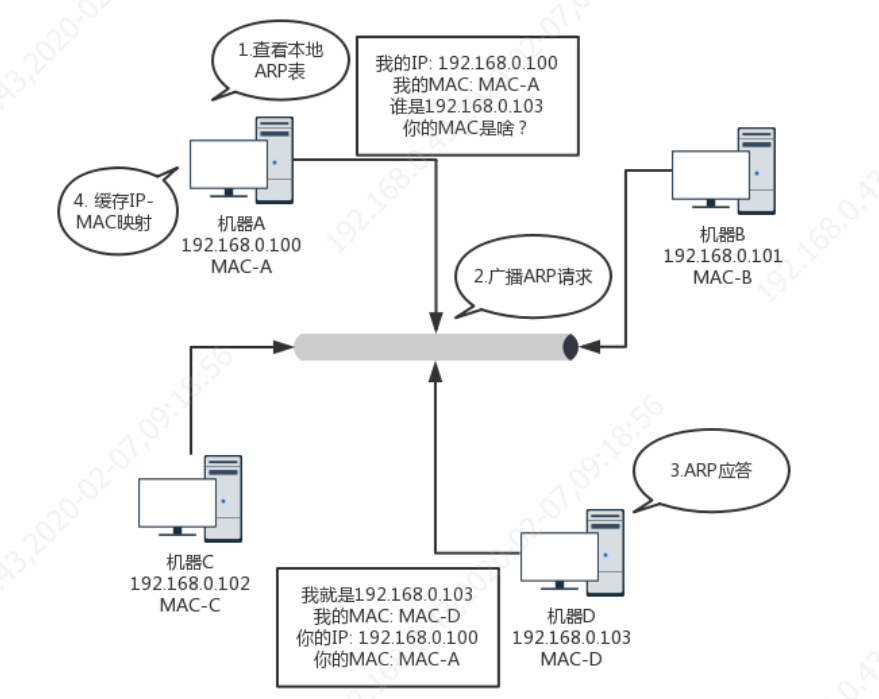

    具体询问和响应报文：

    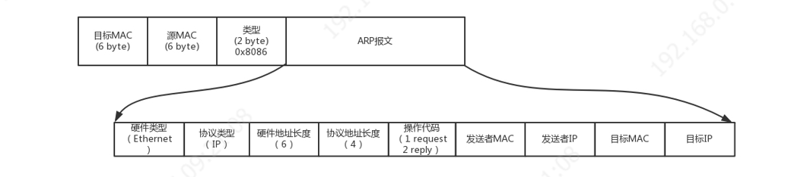

    注意ARP就是发起广播的这块如果有环路，会造成整个网络复制

#### 常见设备

1. Hub（集线器）
Hub 是广播的，不管某个接口是否需要，所有的 Bit **都会被发送出去**，然后让主机来判断是不是需要。这种方式路上的车少就没问题，车一多，产生冲突的概率就提高了。而且把不需要的包转发过去，纯属浪费
2. 交换机
一台 MAC1 电脑将一个包发送给另一台 MAC2 电脑，当这个包到达交换机的时候，一开始交换机也不知道 MAC2 的电脑在哪个口，所以没办法，它只能将包转发给除了来的那个口之外的其他所有的口。但是，这个时候，交换机会干一件非常聪明的事情，就是交换机会记住，**MAC1 是来自一个明确的口**。以后有包的目的地址是 MAC1 的，直接发送到这个口就可以了。
当交换机作为一个关卡一样，过了一段时间之后，就有了整个网络的一个结构了，这个时候，基本上不用广播了，全部可以准确转发。当然，每个机器的 IP 地址会变，所在的口也会变，因而交换机上的学习的结果，我们称为**转发表**，是有一个过期时间的。
#### 解决环路问题和安全问题

环路问题的出现就是

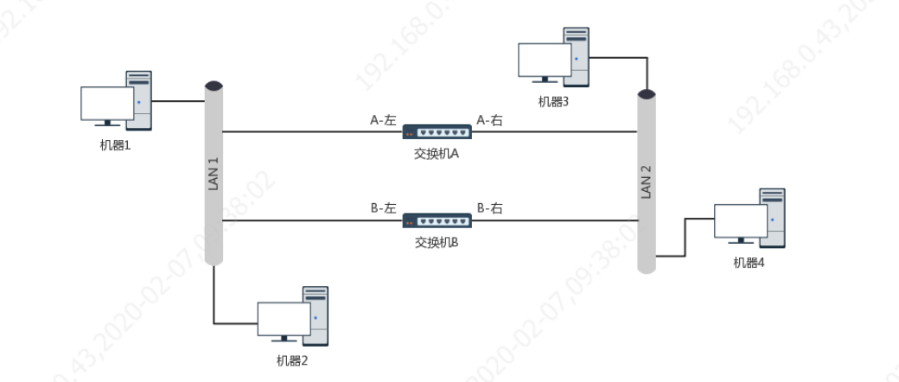

1. 物理隔离。
    每个部门设一个单独的会议室，对应到网络方面，就是每个部门有单独的交换机，配置单独的子网，这样部门之间的沟通就需要路由器了。路由器咱们还没讲到，以后再说。这样的问题在于，有的部门人多，有的部门人少。人少的部门慢慢人会变多，人多的部门也可能人越变越少。如果每个部门有单独的交换机，口多了浪费，少了又不够用。

2. 虚拟隔离 VLAN

   另外一种方式是**虚拟隔离**，就是用我们常说的**VLAN**，或者叫**虚拟局域网**。使用 VLAN，一个交换机上会连属于多个局域网的机器，那交换机怎么区分哪个机器属于哪个局域网呢？

   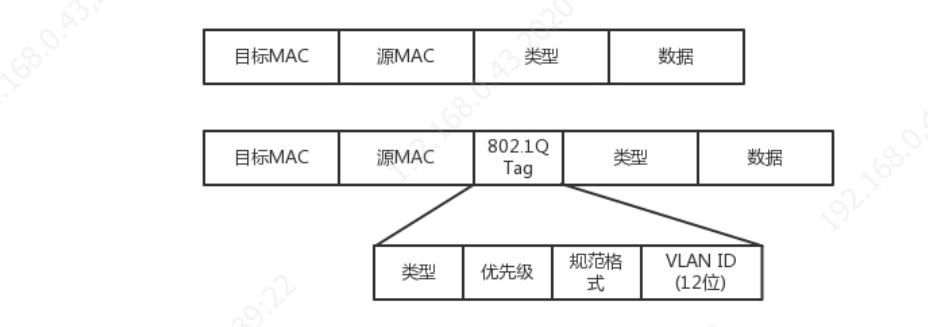

   我们只需要在原来的二层的头上加一个 TAG，里面有一个 VLAN ID，一共 12 位。为什么是 12 位呢？因为 12 位可以划分 4096 个 VLAN。这样是不是还不够啊。现在的情况证明，目前云计算厂商里面绝对不止 4096 个用户。当然每个用户需要一个 VLAN 了啊，怎么办呢，这个我们在后面的章节再说。

   如果我们买的交换机是支持 VLAN 的，当**这个交换机把二层的头取下来的时候**，就能够识别这个 VLAN ID。这样只有相同 VLAN 的包，才会互相转发，不同 VLAN 的包，是看不到的。这样广播问题和安全问题就都能够解决了。

   有人会问交换机之间怎么连接呢？将两个交换机连接起来的口应该设置成什么 VLAN 呢？对于支持 VLAN 的交换机，有一种口叫作**Trunk 口**。它可以转发属于任何 VLAN 的口。交换机之间可以通过这种口相互连接。

   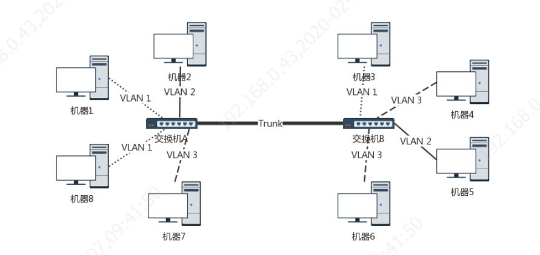

#### 总结

第一，MAC 层是用来解决多路访问的堵车问题的；
第二，ARP 是通过吼的方式来寻找目标 MAC 地址的，吼完之后记住一段时间，这个叫作缓存；
第三，交换机是有 MAC 地址学习能力的，学完了它就知道谁在哪儿了，不用广播了。
第四，当交换机的数目越来越多的时候，会遭遇环路问题，让网络包迷路，这就需要使用 STP 协议，通过华山论剑比武的方式，将有环路的图变成没有环路的树，从而解决环路问题。
第五，交换机数目多会面临隔离问题，可以通过 VLAN 形成虚拟局域网，从而解决广播问题和安全问题。

### 网络层（IP）
#### ICMP
ping 是基于 ICMP 协议工作的。ICMP全称Internet Control Message Protocol，就是互联网控制报文协议。这里面的关键词是“控制”，那具体是怎么控制的呢？
ICMP 报文是**封装在 IP 包**里面的。因为传输指令的时候，肯定需要源地址和目标地址
ICMP 报文有很多的类型，不同的类型有不同的代码。最常用的类型是主动请求为 8，主动请求的应答为 0。

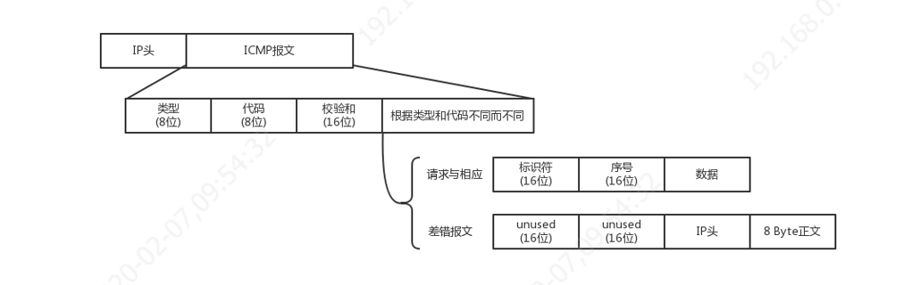

##### 查询类型报文 ping
主动查看敌情，对应 ICMP 的查询报文类型。例如，常用的ping 就是查询报文，是一种主动请求，并且获得主动应答的 ICMP 协议。所以，ping 发的包也是符合 ICMP 协议格式的，只不过它在后面增加了自己的格式。

1. 多了标识符
这个很好理解，你派出去两队侦查兵，一队是侦查战况的，一队是去查找水源的，要有个标识才能区分。
2. 多了序号
你派出去的侦查兵，都要编个号。如果派出去 10 个，回来 10 个，就说明前方战况不错；如果派出去 10 个，回来 2 个，说明情况可能不妙。
3. 选项数据
ping 还会存放发送请求的时间值，来计算往返时间，说明路程的长短。

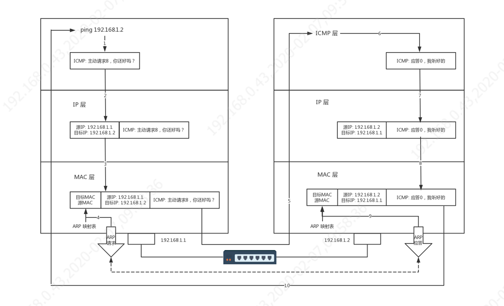

在规定的时候间内，源主机如果没有接到 ICMP 的应答包，则说明目标主机不可达；如果接收到了 ICMP 应答包，则说明目标主机可达。此时，源主机会检查，用当前时刻减去该数据包最初从源主机上发出的时刻，就是 ICMP 数据包的时间延迟。

如果在自己的可控范围之内，当遇到网络不通的问题的时候，除了直接 ping 目标的 IP 地址之外，还应该有一个清晰的网络拓扑图。并且从理论上来讲，应该要清楚地知道一个网络包从源地址到目标地址都需要经过哪些设备，然后逐个 ping 中间的这些设备或者机器。如果可能的话，在这些关键点，通过 tcpdump -i eth0 icmp，查看包有没有到达某个点，回复的包到达了哪个点，可以更加容易推断出错的位置。

##### 差错报文类型 Tracert

我举几个 ICMP 差错报文的例子：终点不可达为 3，源抑制为 4，超时为 11，重定向为 5。这些都是什么意思呢？我给你具体解释一下。

1. 是终点不可达。
小兵：报告主公，您让把粮草送到张将军那里，结果没有送到。如果你是主公，你肯定会问，为啥送不到？具体的原因在代码中表示就是，网络不可达代码为 0，主机不可达代码为 1，协议不可达代码为 2，端口不可达代码为 3，需要进行分片但设置了不分片位代码为 4。
2. 源站抑制
让源站放慢发送速度。小兵：报告主公，您粮草送的太多了吃不完。
3. 时间超时
也就是超过网络包的生存时间**还是没到**
4. 路由重定向
让下次发给另一个路由器

Traceroute，是个“大骗子”。它会使用 ICMP 的规则，故意制造一些能够产生错误的场景。
所以，**Traceroute 的第一个作用就是故意设置特殊的 TTL，来追踪去往目的地时沿途经过的路由器**。Traceroute 的参数指向某个目的 IP 地址，它会发送一个 UDP 的数据包。将 TTL 设置成 1，也就是说一旦遇到**一个路由器或者一个关卡**，就表示它“牺牲”了。这样，**Traceroute 就拿到了所有的路由器 IP**。当然，有的路由器压根不会回这个 ICMP。会导致看不到中间路由的原因。
使用UDP 采用一个不存在的端口，依靠对方的返回来进行判断消息得到。
#### IP

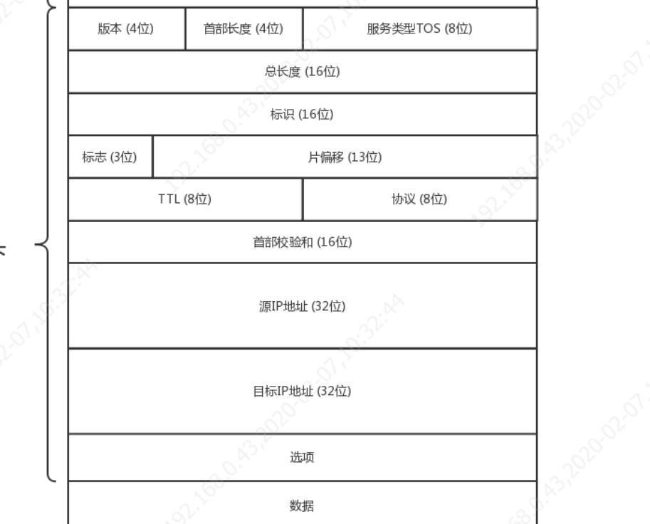

#### 出网关
网关往往是一个路由器，是一个三层转发的设备，分析到网际层。
在任何一台机器上，当要访问另一个 IP 地址的时候，都会先判断，这个目标 IP 地址，和当前机器的 IP 地址，是否在同一个网段。怎么判断同一个网段呢？需要 CIDR 和子网掩码。
**如果是同一个网段**，例如，你访问你旁边的兄弟的电脑，那就没网关什么事情，直接将源地址和目标地址放入 IP 头中，然后通过 ARP 获得 MAC 地址，将源 MAC 和目的 MAC 放入 MAC 头中，发出去就可以了。
**如果不是同一网段**，例如，你要访问你们校园网里面的 BBS，该怎么办？这就需要发往**默认网关 Gateway**。Gateway 的地址一定是和源 IP 地址是一个网段的。往往不是第一个，就是第二个。例如 192.168.1.0/24 这个网段，Gateway 往往会是 192.168.1.1/24 或者 192.168.1.2/24。
如何发往默认网关呢？网关不是和源 IP 地址是一个网段的么？这个过程就和发往同一个网段的其他机器是一样的：将源地址和目标 IP 地址放入 IP 头中，通过 ARP 获得网关的 MAC 地址，将源 MAC 和网关的 MAC 放入 MAC 头中，发送出去。网关所在的端口，例如 192.168.1.1/24 将网络包收进来，然后接下来怎么做，就完全看网关的了。
任何一个想发往其他局域网的包，都会到达其中一只手，被拿进来，拿下 MAC 头和 IP 头，看看，根据自己的路由算法，选择另一只手，加上 IP 头和 MAC 头，然后扔出去。
这个时候，问题来了，该选择哪一只手？IP 头和 MAC 头加什么内容，哪些变、哪些不变呢？

##### 路由器
路由器是一台设备，它有五个网口或者网卡，相当于有五只手，分别连着五个局域网。每只手的 IP 地址都和局域网的 IP 地址相同的网段，每只手都是它握住的那个局域网的网关。

##### 静态路由
其实就是在路由器上，配置一条一条规则。这些规则包括：想访问 BBS 站（它肯定有个网段），从 2 号口出去，下一跳是 IP2；想访问教学视频站（它也有个自己的网段），从 3 号口出去，下一跳是 IP3，然后保存在路由器里。
###### 转发网关

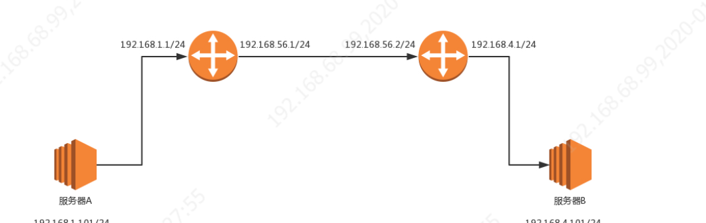

不改变 IP 地址的网关，我们称为转发网关；
每到一个新的局域网，**MAC 都是要变的**，但是原 IP 地址都不变。在 IP 头里面，不会保存任何网关的 IP 地址。**所谓的下一跳是，某个 IP 要将这个 IP 地址转换为MAC 放入 MAC 头**。

###### NAT 网关

改变 IP 地址的网关，我们称为NAT 网关。
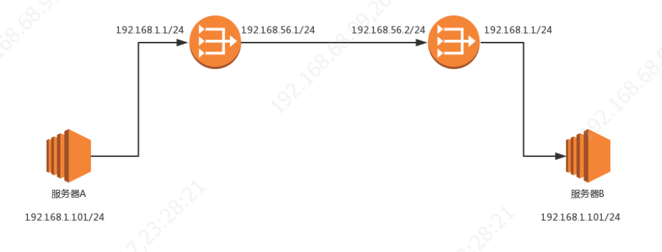
既然局域网之间没有商量过，你们各管各的，那到国际上，也即中间的局域网里面，就需要使用另外的地址。就像出国，不能用咱们自己的身份证，而要改用护照一样，玄奘西游也要拿着专门取经的通关文牒，而不能用自己国家的身份证。
多个使用同一个国际身份证时候 **对方返回的包通过下面方式进行映射返回**
<内部地址+内部端口>与<外部地址+外部端口>

##### 动态路由

#### 总结
1. ICMP 相当于网络世界的侦察兵。我讲了两种类型的 ICMP 报文，一种是主动探查的查询报文，一种异常报告的差错报文；
2. ping 使用查询报文，Traceroute 使用差错报文。
3. 许多人问：tracerouter发udp，为啥出错回icmp？正常情况下，协议栈能正常走到udp，当然正常返回udp。但是，你主机不可达，是ip层的（还没到udp）。ip层，当然只知道回icmp。报文分片错误也是同理。
4. 如果离开本局域网，就需要经过网关，网关是路由器的一个网口；
5. 路由器是一个三层设备，里面有如何寻找下一跳的规则；
6. 经过路由器之后 MAC 头要变，如果 IP 不变，相当于不换护照的欧洲旅游，如果 IP 变，相当于换护照的玄奘西行。

### 传输层

#### TCP
面向连接的数据流协议
连接管理，拥塞控制，数据流与窗口管理，超时和重传，数据流write 包发送失败了 应用端如何可以知道  只有再次write 或者get才能知道吗

##### TCP结构

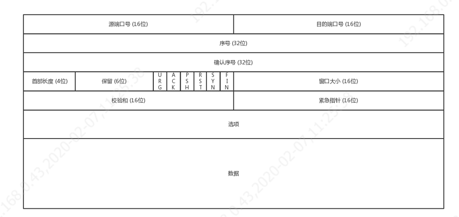

1. 源端口号和目标端口号是不可少的，这一点和 UDP 是一样的。如果没有这两个端口号。数据就不知道应该发给哪个应用。
2. 包的序号。为什么要给包编号呢？当然是为了解决乱序的问题。不编好号怎么确认哪个应该先来，哪个应该后到呢。编号是为了解决乱序问题。既然是社会老司机，做事当然要稳重，一件件来，面临再复杂的情况，也临危不乱。
3. 就是确认序号。发出去的包应该有确认，要不然我怎么知道对方有没有收到呢？如果没有收到就应该重新发送，直到送达。这个可以解决不丢包的问题。作为老司机，做事当然要靠谱，答应了就要做到，暂时做不到也要有个回复。
4. TCP 是靠谱的协议，但是这不能说明它面临的网络环境好。从 IP 层面来讲，如果网络状况的确那么差，是没有任何可靠性保证的，而作为 IP 的上一层 TCP 也无能为力，唯一能做的就是更加努力，不断重传，通过各种算法保证。也就是说，对于 TCP 来讲，IP 层你丢不丢包，我管不着，但是我在我的层面上，会努力保证可靠性。
5. 接下来有一些状态位。例如 SYN 是发起一个连接，ACK 是回复，RST 是重新连接，FIN 是结束连接等。TCP 是面向连接的，因而双方要维护连接的状态，这些带状态位的包的发送，会引起双方的状态变更。
6. 窗口大小。TCP 要做流量控制，通信双方各声明一个窗口，标识自己当前能够的处理能力，别发送的太快，撑死我，也别发的太慢，饿死我。
通过对 TCP 头的解析，我们知道要掌握 TCP 协议，重点应该关注以下几个问题：
- 顺序问题 ，稳重不乱；
- 丢包问题，承诺靠谱；
- 连接维护，有始有终；
- 流量控制，把握分寸；
- 拥塞控制，知进知退。

##### 连接 

3次握手

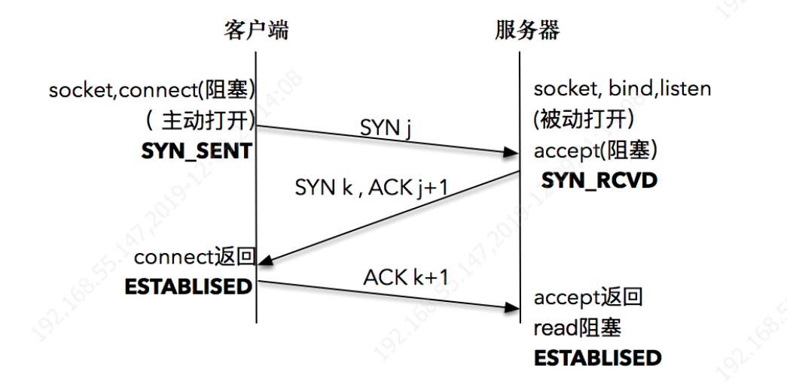

服务端：

int accept(int listensockfd, struct sockaddr *cliaddr, socklen_t *addrlen)

函数的第一个参数 listensockfd 是套接字，可以叫它为 listen 套接字，因为这就是前面通过 bind，listen 一系列操作而得到的套接字。函数的返回值有两个部分，第一个部分 cliadd 是通过指针方式获取的**客户端的地址**，addrlen 告诉我们**地址的大小**，这可以理解成当我们拿起电话机时，看到了来电显示，知道了对方的号码；另一个部分是函数的返回值，这个返回值是一个全新的描述字，代表了与客户端的连接。

客户端：

int connect(int sockfd, const struct sockaddr *servaddr, socklen_t addrlen)

第一个参数 sockfd 是连接套接字，通过前面讲述的 socket 函数创建。第二个、第三个参数 servaddr 和 addrlen 分别代表指向套接字地址结构的指针和该结构的大小。套接字地址结构必须含有服务器的 IP 地址和端口号

如果是 TCP 套接字，那么调用 connect 函数将激发 TCP 的三次握手过程，而且仅在连接建立成功或出错时**才返回**。其中出错返回可能有以下几种情况：

1. 三次握手无法建立，客户端发出的 SYN 包**没有任何响应**，于是返回 **TIMEOUT 错误**。这种情况比较常见的原因是对应的**服务端 IP 写错**。
2. 客户端收到了 **RST（复位）**回答，这时候客户端会立即返回 **CONNECTION REFUSED **错误。这种情况比较常见于客户端发送连接请求时的**请求端口写错**，因为 RST 是 TCP 在**发生错误**时发送的一种 TCP 分节。产生 RST 的三个条件是：目的地为某端口的 **SYN 到达**，然而该端口上**没有正在监听的服务器**（如前所述）；TCP 想**取消一个已有**连接；TCP 接收到一个根本**不存在的连接上**的分节。
3. 客户发出的 SYN 包在网络上引起了**"destination unreachable"**，即目的不可达的错误。这种情况比较常见的原因是客**户端和服务器端路由不通**。

TCP 包的序号的问题：
三次握手除了双方建立连接外，主要还是为了沟通一件事情，就是**TCP 包的序号的问题**。
A 要告诉 B，我这面发起的包的序号起始是从哪个号开始的，B 同样也要告诉 A，B 发起的包的序号起始是从哪个号开始的。为什么序号不能都从 1 开始呢？因为这样往往会出现冲突。
每个连接都要有不同的序号。这个序号的起始序号是随着时间变化的，可以看成一个 32 位的计数器，每 4ms 加一，如果计算一下，如果到重复，需要 4 个多小时，那个绕路的包早就死翘翘了，因为我们都知道 IP 包头里面有个 TTL，也即生存时间。

##### 交流

1. 发送数据

   write函数

   与普通文件描述符是有区别的。操作系统内核帮我们不断地往文件系统中写入字节流，写入的字节流大小通常和输入的size值相同。而套接字有**缓冲区**的概念导致可能不一致。

   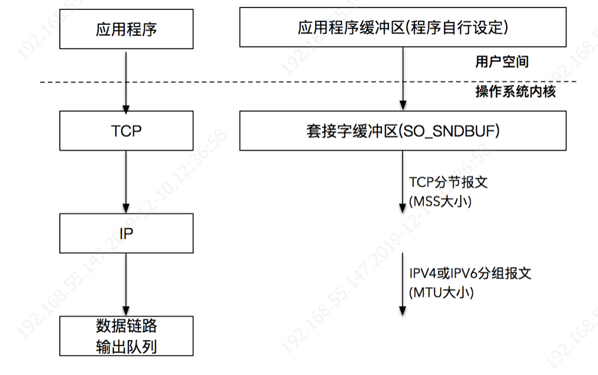

2. 读取数据

   read函数：ssize_t read (int socketfd, void *buffer, size_t size)

   read 函数要求操作系统内核从套接字描述字 socketfd**读取最多多少个字节（size），并将结果存储到 buffer 中。返回值告诉我们实际读取的字节数目，也有一些特殊情况，如果返回值为 0，<u>表示 EOF（end-of-file），这在网络中表示对端发送了 FIN 包</u>，要处理断连的情况**；如果返回值为 -1，表示出错。当然，如果是非阻塞 I/O，情况会略有不同，在后面的提高篇中我们会重点讲述非阻塞 I/O 的特点。

3. 真正从write调用到发送还要经过哪些流程 详细可以在看下Linux下Socet学习笔记

   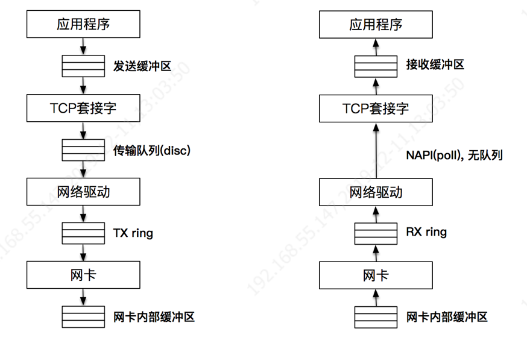

###### TCP协议之动态传输

为了保证顺序性，每一个包都有一个 ID。在建立连接的时候，会商定起始的 ID 是什么，然后按照 ID 一个个发送。为了保证不丢包，对于发送的包都要进行应答，但是这个应答也不是一个一个来的，而是会应答某个之前的 ID，表示都收到了，这种模式称为**累计确认**或者**累计应答**（**cumulative acknowledgment**）。

发送端：

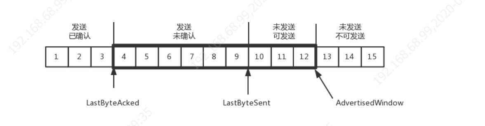
LastByteAcked：发送了并且已经确认的，第一部分和第二部分的分界线
LastByteSent：发送了并且尚未确认的，第二部分和第三部分的分界线
AdvertisedWindow：没有发送，但是已经等待发送的。这部分是你还没有交代给下属，但是马上就要交代的。第三部分和第四部分的分界线
未发送的：没有发送，并且暂时还不会发送的。这部分是你还没有交代给下属，而且暂时还不会交代给下属的
LastByteSent+AdvertisedWindow = 传输窗口
接收端：

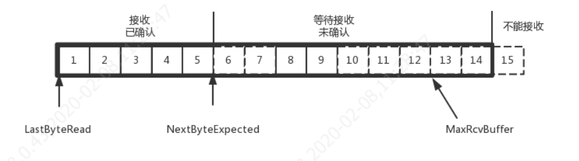
第一部分：接受并且确认过的。也就是我领导交代给我，并且我做完的。
第二部分：还没接收，但是马上就能接收的。也即是我自己的能够接受的最大工作量。
第三部分：还没接收，也没法接收的。也即超过工作量的部分，实在做不完。
MaxRcvBuffer：最大缓存的量；
LastByteRead 之后是已经接收了，但是还没被应用层读取的；
NextByteExpected 是第一部分和第二部分的分界线。

1. 顺序问题与丢包问题：

   顺序问题和丢包问题都有可能发生，所以我们先来看**确认与重发的机制**。
   一种方法就是**超时重试**，也即对每一个发送了，但是没有 ACK 的包，都有设一个定时器，超过了一定的时间，就重新尝试。但是这个超时的时间如何评估呢？这个时间不宜过短，时间必须大于往返时间 RTT，否则会引起不必要的重传。也不宜过长，这样超时时间变长，访问就变慢了。
估计往返时间，需要 TCP 通过采样 RTT 的时间，然后进行加权平均，算出一个值，而且这个值还是要不断变化的，因为网络状况不断的变化。除了采样 RTT，还要采样 RTT 的波动范围，计算出一个估计的超时时间。由于重传时间是不断变化的，我们称为**自适应重传算法**（Adaptive Retransmission Algorithm）。
如果过一段时间，5、6、7 都超时了，就会重新发送。接收方发现 5 原来接收过，于是丢弃 5；6 收到了，发送 ACK，要求下一个是 7，7 不幸又丢了。当 7 再次超时的时候，有需要重传的时候，TCP 的策略是超时**间隔加倍**。每当遇到一次超时重传的时候，都会将下一次超时时间间隔设为先前值的两倍。两次超时，就说明网络环境差，不宜频繁反复发送。
超时触发重传存在的问题是，超时周期可能相对较长。那是不是可以有更快的方式呢？
有一个可以**快速重传的机制**，当接收方收到一个序号大于下一个所期望的报文段时，就检测到了数据流中的一个间格，于是发送**三个冗余的 AC**K，客户端收到后，就在定时器过期之前，重传丢失的报文段。
例如，接收方发现 6、8、9 都已经接收了，就是 7 没来，那肯定是丢了，于是发送三个 6 的 ACK，要求下一个是 7。客户端收到 3 个，就会发现 7 的确又丢了，**不等超时，马上重发**。
还有一种方式称为Selective Acknowledgment （SACK）。这种方式需要在 TCP 头里加一个 SACK 的东西，**可以将缓存的地图发送给发送方**。例如可以发送 ACK6、SACK8、SACK9，有了地图，发送方一下子就能看出来是 7 丢了。

1. 拥塞控制和数据传输

   - 本质：TCP 就必须考虑多个连接共享在有限的带宽上，**兼顾效率和公平性的控制**
   - 控制算法：
     - 慢启动：它通过一定的规则，慢慢地将网络发送数据的速率增加到一个阈值。超过这个阈值之后，慢启动就结束了
     - 拥塞避免：TCP 会不断地探测网络状况，并随之不断调整拥塞窗口的大小
   - 在任何一个时刻，TCP 发送缓冲区的数据是否能真正发送出去，**至少**取决于两个因素，一个是**当前的发送窗口大小**，另一个是**拥塞窗口大小**

2. 流量控制
   作为单 TCP 连接、点对点之间的流量控制模型，它是需要和接收端一起**共同协调**来调整大小的。
   在对于包的确认中，同时会携带一个窗口的大小。发送方会定时发送窗口探测数据包，看是否有机会调整窗口的大小。当接收方比较慢的时候，要防止低能窗口综合征，别空出一个字节来就赶快告诉发送方。
   
3. 拥塞控制
   反应了作为多个 TCP 连接共享带宽的拥塞控制模型，它是发送端独立地**根据网络状况**来动态调整的。主要来避免两种现象，**包丢失和超时重传**
   也是通过窗口的大小来控制的，前面的滑动窗口 rwnd 是怕发送方把接收方缓存塞满，而拥塞窗口 cwnd，是怕把网络塞满。
   
   **第一个问题**是丢包并不代表着通道满了，也可能是管子本来就漏水。例如公网上带宽不满也会丢包，这个时候就认为拥塞了，退缩了，其实是不对的。
   **第二个问题**是 TCP 的拥塞控制要等到将中间设备都填充满了，才发生丢包，从而降低速度，这时候已经晚了。其实 TCP 只要填满管道就可以了，不应该接着填，直到连缓存也填满。
   为了优化这两个问题，后来有了**TCP BBR 拥塞算法**。它企图找到一个平衡点，就是通过不断的加快发送速度，将管道填满，但是不要填满中间设备的缓存，因为这样时延会增加，在这个平衡点可以很好的达到高带宽和低时延的平衡。
   
   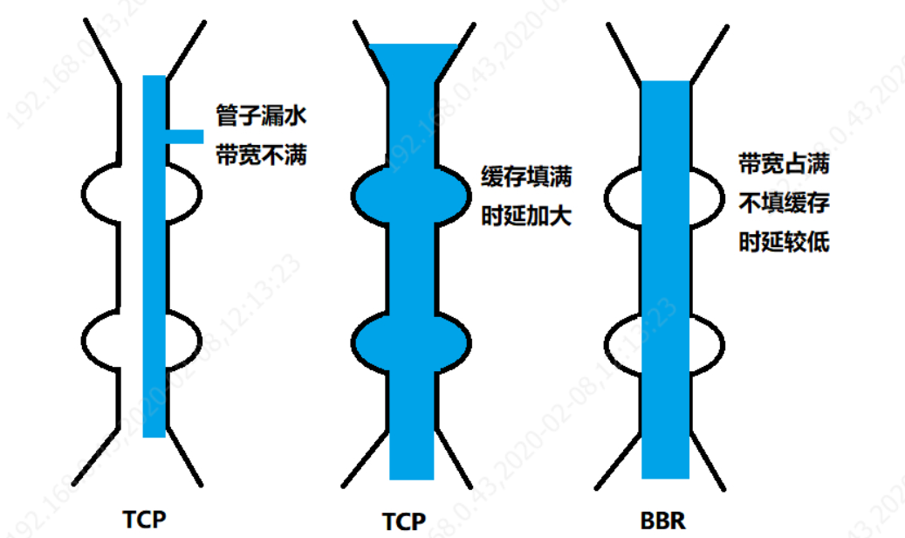
   
4. 场景与解决方案

   - 接收端处理得急不可待，比如刚刚读入了 100 个字节，就告诉发送端：“喂，我已经读走 100 个字节了，你继续发”，在这种情况下，你觉得发送端应该怎么做呢？

     也被叫做**糊涂窗口综合症**，这个场景需要在**接收端**进行优化。也就是说，接收端**不能**在接收缓冲区空出一个很小的部分之后，就急吼吼地向发送端发送窗口更新通知，而是需要在自己的缓冲区大到一个**合理的值**之后，再向发送端发送窗口更新通知。这个合理的值，由对应的 RFC 规范定义

   - 交互式”场景，比如我们使用 telnet 登录到一台服务器上，或者使用 SSH 和远程的服务器交互，这种情况下，我们在屏幕上敲打了一个命令，等待服务器返回结果，这个过程需要不断和服务器端进行数据传输。这里最大的问题是，每次传输的数据可能都**非常小**，比如敲打的命令“pwd”，仅仅三个字符。这意味着什么？这就好比，每次叫了一辆大货车，只送了一个小水壶。在这种情况下，你又觉得发送端该怎么做才合理呢

     发送端进行优化。这个优化的算法叫做 **Nagle 算法**，Nagle 算法的本质其实就是**限制大批量的小数据包同时发送**，为此，它提出，在**任何一个时刻**，未被确认的小数据包**不能超过**一个。这里的小数据包，指的是长度小于最大报文段长度 MSS 的 TCP 分组。这样，发送端就可以把接下来连续的几个小数据包存储起来，等待接收到前一个小数据包的 ACK 分组之后，再将数据**一次性**发送出去

   - 接收端需要对每个接收到的 TCP 分组进行确认，也就是发送 ACK 报文，但是 ACK 报文本身是不带数据的分段，如果一直这样发送大量的 ACK 报文，就会消耗大量的带宽。之所以会这样，是因为 TCP 报文、IP 报文固有的消息头是不可或缺的，比如两端的地址、端口号、时间戳、序列号等信息， 在这种情形下，你觉得合理的做法是什么

     也是需要在接收端进行优化，这个优化的算法叫做**延时 ACK**。延时 ACK 在收到数据后并**不马上回复**，而是累计需要发送的 ACK 报文，等到有数据需要发送给对端时，将累计的 ACK**捎带一并发送出去**。当然，延时 ACK 机制，**不能无限地延时**下去，否则发送端误认为数据包没有发送成功，**引起重传**，反而会占用额外的网络带宽。

   Nagle算法和延时ACK会有冲突，可以禁用Nagle算法但是不推荐。

###### 理解TCP的“流”与不可靠

1. 不可靠 ：拆包，缓冲区

   TCP 连接建立之后，能**感知 **TCP 链路的方式是有限的，**一种是以 read 为核心的读操作**，**另一种是以 write 为核心的写操作**。接下来，我们就看下如何通过读写操作来感知异常情况，以及对应的处理方式。

   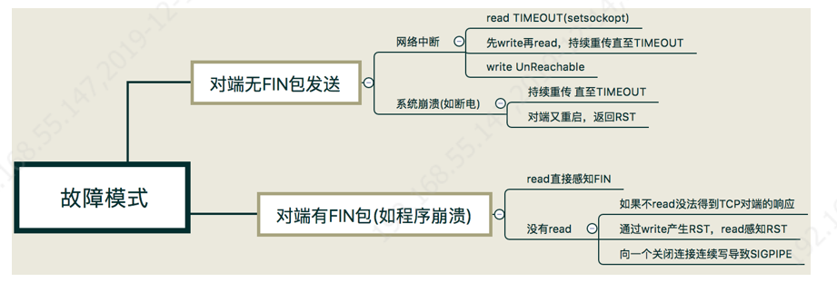

   - 网络终端情况无FIN包：

     TCP 程序并不能及时感知到异常信息。除非网络中的其他设备，如路由器发出一条 ICMP 报文，说明目的网络或主机不可达，这个时候**通过 read 或 write 调用**就会返回 Unreachable 的错误。在没有 ICMP 报文的情况下，TCP 程序并不能理解感应到连接异常。如果程序是**阻塞在 read 调用**上，那么很不幸，程序无法从异常中恢复。这显然是非常不合理的，不过，我们可以通过给 read 操作**设置超时**来解决。程序先调用了 write 操作发送了一段数据流，接下来阻塞在 read 调用上，结果会非常不同。Linux 系统的 TCP 协议栈会不断尝试将发送缓冲区的数据发送出去，大概在重传 12 次、合计时间约为 9 分钟之后，协议栈会标识该连接异常，这时，阻塞的 read 调用会返回一条 **TIMEOUT **的错误信息，在调用write 就会返回rst 后面在有sigpipe信号。

   - 系统奔溃造成无FIN包

     和上面多了一个场景，系统奔溃后又重启，当重传的 TCP 分组到达重启后的系统，由于系统中没有该 TCP 分组对应的连接数据，**系统会返回一个 RST 重置分节**，TCP 程序通过 read 或 write 调用可以分别对 RST 进行错误处理， read 调用，会立即返回一个错误，**错误信息为连接重置（Connection Resest）**

   - 有FIN包发出

     可能的场景是对端调用了 close 或 shutdown 显式地关闭了连接，也可能是对端应用程序崩溃，操作系统内核代为清理所发出的，要通过read和write来进行感知

2. 报文读取和解析

   常见的报文格式有两种方法，一种是发送端把要发送的报文**长度**预先通过报文告知给接收端；另一种是通过一些**特殊的字符**来进行边界的划分

   - 显示编码报文长度

     首先 4 个字节大小的消息长度，其目的是将真正发送的字节流的大小显式通过报文告知接收端，接下来是 4 个字节大小的消息类型，而真正需要发送的数据则紧随其后。

     

     读取时候按照格式 一个个的读取

     [代码](https://github.com/froghui/yolanda/tree/master/chap-16)

   - 特殊字符左边界

     HTTP 是一个非常好的例子。HTTP 通过设置回车符、换行符做为 HTTP 报文协议的边界。

     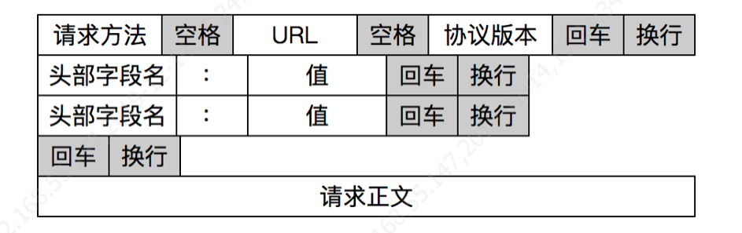

     

     

     

     

     

##### 关闭

FIN发错另外一端如何判断ACK。

1. close 函数

   这个函数会对套接字**引用计数减一**，一旦发现套接字**引用**计数到 0（fork情况），就会对套接字进行**彻底释放**，并且会关闭**TCP 两个方向的数据流**（写入和发送）。在输入方向，系统内核会将该套接字设置为不可读，任何读操作都会**返回异常**。在输出方向，系统内核尝试将**发送缓冲区的数据**发送给对端，并**最后**向对端发送一个 **FIN **报文，接下来如果再对该套接字进行写操作会**返回异常**。如果对端没有检测到套接字已关闭，还继续发送报文，就会收到一个 **RST 报文**，告诉对端：“Hi, 我已经关闭了，别再给我发数据了。”

2. shutdown 函数

   int shutdown(int sockfd, int howto)

   howto主要有3个选项

   - SHUT_RD(0)：关闭连接的“读”这个方向，对该套接字进行读操作直接返回 EOF。从数据角度来看，套接字上接收缓冲区已有的数据将被**丢弃**，如果再有新的数据流到达，会**对数据**进行 ACK，然后悄悄地**丢弃**。也就是说，对端还是会接收到 ACK，在这种情况下根本不知道数据已经被丢弃了。
   - SHUT_WR(1)：关闭连接的“写”这个方向，这就是常被称为”半关闭“的连接。此时，不管套接字引用计数的值是**多少**，都会直接关闭连接的写方向。套接字上发送缓冲区已有的数据将被**立即发送出去**，并发送一个 **FIN **报文给对端。应用程序如果对该套接字进行写操作会**报错**。但是**可以读**来自对端的数据，也就是对端可以写。
   - SHUT_RDWR(2)：相当于 SHUT_RD 和 SHUT_WR 操作各一次，关闭套接字的读和写两个方向。

   

3. 差别：

   - close 会关闭连接，并释放**所有**连接对应的资源?，而 shutdown 并不会释放掉套接字和所有的资源
   - close 存在引用计数的概念，并不一定导致该套接字不可用；shutdown 则不管引用计数，直接使得该套接字**不可用**，如果有别的进程企图使用该套接字，将会受到影响
   - **close 的引用计数导致不一定会发出 FIN 结束报文**，而 shutdown 则总是会发出 FIN 结束报文，这在我们打算关闭连接通知对端的时候，是非常重要的

4. 实验场景

   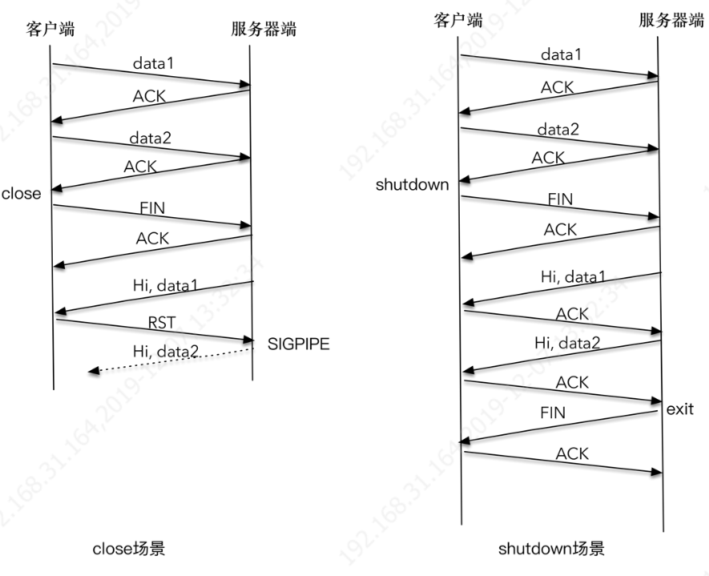

   1. 因为客户端调用 close 函数关闭了整个连接，当服务器端发送的“Hi, data1”分组到底时，客户端给**回送一个 RST 分组**；服务器端再次尝试发送“Hi, data2”第二个应答分组时，系统内核通知 **SIGPIPE 信号**。这是因为，在 RST 的套接字进行写操作，会直接**触发** SIGPIPE 信号。

      SIGPIPE 信号：连接建立，**若某一端关闭**连接，而另一端仍然向它写数据，**第一次**写数据后会收到RST响应，此后再写数据，**内核将向进程发出SIGPIPE信号**，通知进程此连接已经断开。而SIGPIPE信号的默认处理是**终止**程序，导致上述问题的发生

   2. shutdown函数当服务器端读到 EOF 时，**立即向客户端发送了 FIN 报文**，客户端在 read 函数中感知了 EOF，也进行了正常退出。
   
   

###### 4次挥手

TCP 连接终止时，主机 1 先发送 FIN 报文，主机 2 进入 CLOSE_WAIT 状态，并发送一个 ACK 应答，同时，主机 2 通过 **read 调用获得 EOF**，并将此结果通知应用程序进行主动关闭操作，发送 FIN 报文。主机 1 在接收到 FIN 报文后发送 ACK 应答，此时主机 1 进入 TIME_WAIT 状态

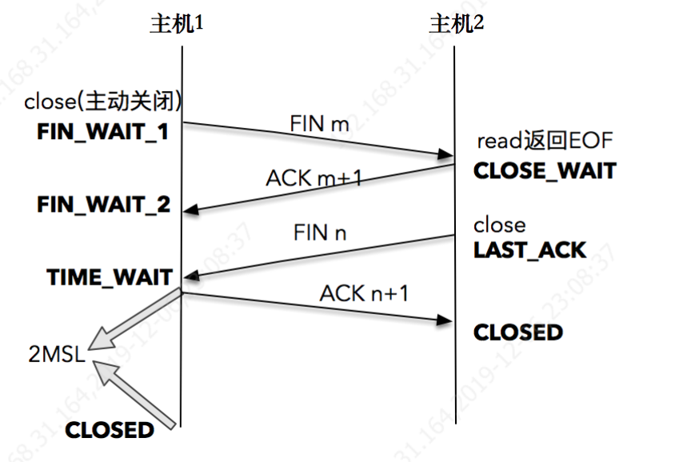

疑问1：主动发起FIN时候 ，是说所有前面的包都已经ack 了吗 ？

  这个 FIN 由 TCP 协议栈处理，我们知道，TCP 协议栈为 FIN 包插入一个文件结束符 EOF 到接收缓冲区中，应用程序可以通过 read 调用来感知这个 FIN 包。一定要注意，这个 EOF 会被放在**已排队等候的其他已接收的数据之后**，这就意味着接收端应用程序需要处理这种异常情况，因为 EOF 表示在该连接上再无额外数据到达。此时，被动关闭方进入 CLOSE_WAIT 状态。不是；此时发起的客户端**不在往服务端写入数据**，服务端读完所有的数据不会又新的报文到达，此时服务端在对客户端的报文做处理，还可能计算一些值在**写回客户端**。

疑问2：这时候主机1还可以在接收数据吗或者发送数据吗？

  发送不行了 因为是调用close 或者shutdown时候 再写会报错，接收是可以。

  close 后 如果对端还写数据会返回RST报文。后续促发SIGPIPE的信号

疑问3：一端发出FIN时候另外一端还没返回ACK此时 还往发出FIN端写数据 会发生什么？

疑问4：FIN接收到了 对端会马上返回ACK吗 判断依据是什么？
[收发代码讲解](https://my.oschina.net/alchemystar/blog/1821680)
收到对端的fin之后并不会立即发送ack告知对端收到了，而是等有数据携带一块发送,或者等携带重传定时器到期后发送ack。从TCP_FIN_WAIT1变迁到TCP_FIN_WAIT2之后，还调用tcp_time_wait设置一个TCP_FIN_WAIT2定时器，在tmo+(2MSL或者基于RTO计算超时)**超时后会直接变迁到closed状态**(不过此时已经是inet_timewait_sock了）。这个超时时间可防止一直等待。

疑问5：出现大量的CLOSE_wait

   如果应用close的时间过晚，对端已经将连接给销毁。则应用发送给fin给对端，对端会由于找不到对应的连接而发送一个RST(Reset)报文。后续只能通过keep alive超时后回收

###### FIN_WAIT2

从TCP_FIN_WAIT1变迁到TCP_FIN_WAIT2之后，还调用tcp_time_wait设置一个TCP_FIN_WAIT2定时器，在tmo+(2MSL或者基于RTO计算超时)**超时后会直接变迁到closed状态**(不过此时已经是inet_timewait_sock了）。这个超时时间可

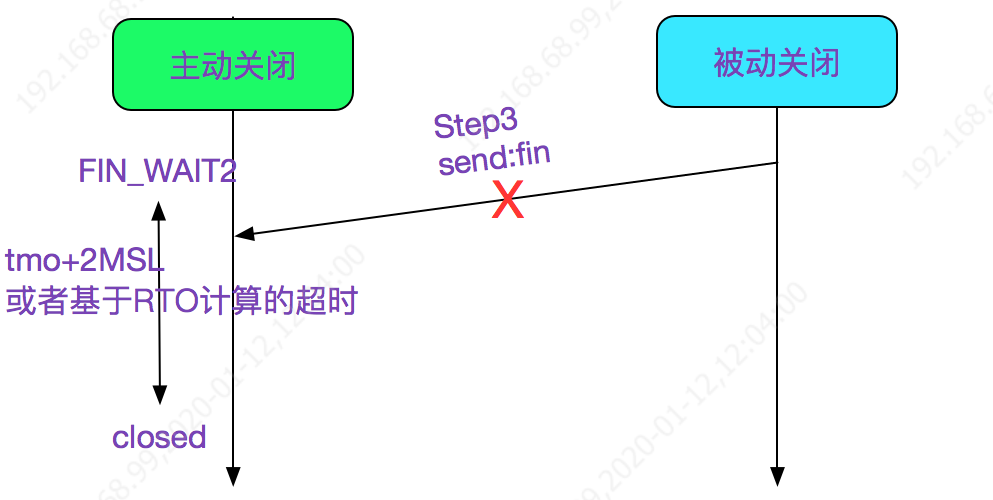

###### TIME_WAIT

4次挥手的发起方断开连接有一段时间在TIME_WAIT状态。

场景：

netstat发现主机很多处于TIME_WAIT连接，每个连接会占用一个端口，太多会导致本机端口耗尽，**导致表象无法对外提供服务**，系统后续把TIME_WAIT的连接回收并关闭后，又可以对外提供服务周而复始。

特点：

主机 1 在 TIME_WAIT 停留持续时间是固定的，是最长分节生命期 MSL（maximum segment lifetime）的**两倍**，一般称之为 2MSL。和大多数 BSD 派生的系统一样，Linux 系统里有一个硬编码的字段，名称为`TCP_TIMEWAIT_LEN`，其值为 60 秒。也就是说，**Linux 系统停留在 TIME_WAIT 的时间为固定的 60 秒。**过了这个时间之后，主机 1 就进入 CLOSED 状态。

2MSL**从主机 1 接收到 FIN 后发送 ACK 开始计时的**如果在 TIME_WAIT 时间内，因为主机 1 的 ACK 没有传输到主机 2，主机 1 又接收到了主机 2 重发的 FIN 报文，那么 2MSL 时间将**重新计时**

作用：

1. 这样做是为了确保最后的 ACK 能让被动关闭方接收，从而帮助其正常关闭
2. 让旧连接的重复分节在网络中**自然消失**；经过2MSL，让两个方向的分组都被丢弃使得原来连接的分组在网络中都自然消失，再出现肯定是新的(防止后面一的端口内容的连接接收到上个连接的包)

问题：

1. 内存资源占用，这个目前看来不是太严重，基本可以忽略
2. 对端口资源的占用，如果 TIME_WAIT 状态过多，会导致无法创建新连接

解决：

1. TCP 协议也在与时俱进，RFC 1323 中实现了 TCP 拓展规范，以便保证 TCP 的高可用，并引入了新的 TCP 选项，两个 4 字节的时间戳字段。重复的数据包会因为时间戳过期被自然丢弃
2. net.ipv4.tcp_tw_reuse，可以复用处于 TIME_WAIT 的套接字为新的连接所用。满足
   - 只适用于**连接发起方**（C/S 模型中的客户端）；
   - 对应的 TIME_WAIT 状态的连接创建时间超过 1 秒才可以被复用

###### CLOSE_WAIT

linux中出现大量close_wait的情况一般是应用在检测到对端fin时没有及时close当前连接。有一种可能如下图所示:

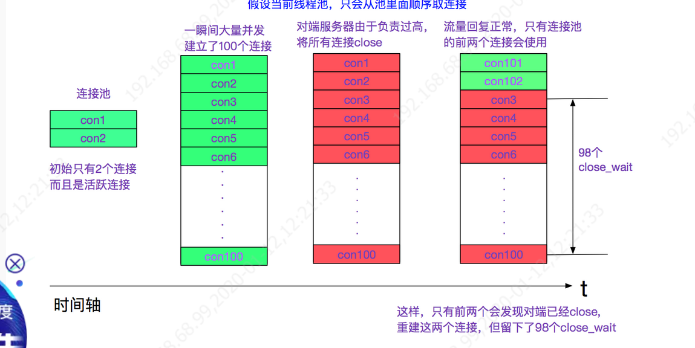

操作系统回收回收close_wait。可以设置tcp keep alive的时间

##### 解决Address in use**

场景：在原有已经有TCP连接存在时候 快速关闭服务端时候 ，在立即关闭

原因：通过服务器端发起的关闭连接操作，引起了一个已有的 TCP 连接处于 **TME_WAIT 状态**，正是这个 TIME_WAIT 的连接，**使得服务器重启时**，如果继续绑定在 127.0.0.1 地址和 9527 端口上的操作，返回了**Address already in use**的错误。

解决：使用重用套接字方式

setsockopt(listenfd, SOL_SOCKET, SO_REUSEADDR, &on, sizeof(on));

##### 检测连接的有效性

在很多情况下，连接的一端需要一直感知连接的状态，如果连接无效了，应用程序可能需要报错，或者重新发起连接等。

场景：

服务端运行中奔溃，异常情况没能正常送达客户端，造成客户端一直维护一个过时的连接，导致不会收到服务器送来的消息。

原因：

作为 NATS 服务器的客户端，消息订阅者没有及时对连接的有效性进行检测，这样就造成了问题。保持对连接有效性的检测，实际中要特别注意。

解决：

1. TCP Keep-Alive选项

   定义一个时间段，在这个时间段内，如果没有任何连接相关的活动，TCP 保活机制会开始作用，**每隔一个时间间隔**，**发送**一个探测报文，该探测报文包含的数据非常少，如果**连续几个**探测报文都没有得到**响应**，则认为当前的 TCP 连接已经**死亡**，系统内核将错误信息通知给上层应用程序。

   上述的可定义变量，分别被称为保活时间、保活时间间隔和保活探测次数。在 Linux 系统中，这些变量分别对应 sysctl 变量`net.ipv4.tcp_keepalive_time`、`net.ipv4.tcp_keepalive_intvl`、 `net.ipv4.tcp_keepalve_probes`，默认设置是 7200 秒（2 小时）、75 秒和 9 次探测

   开启TCP保活动，需考虑以下情况

   - **能正常接收**；对端程序是正常工作的。当 TCP 保活的探测报文发送给对端, 对端会正常响应，这样 TCP 保活时间会被重置，等待下一个 TCP 保活时间的到来
   - **崩溃并重启的会返回RST报文**；对端程序崩溃并重启。当 TCP 保活的探测报文发送给对端后，对端是可以响应的，但由于没有该连接的有效信息，会产生一个 RST 报文，这样很快就会发现 TCP 连接已经被重置。
   - **奔溃连续几次报告已经死亡**；是对端程序崩溃，或对端由于其他原因导致报文不可达。当 TCP 保活的探测报文发送给对端后，石沉大海，没有响应，连续几次，达到保活探测次数后，TCP 会报告该 TCP 连接已经死亡

2. 应用探活

   如果使用 TCP 自身的 keep-Alive 机制，在 Linux 系统中，最少需要经过 2 小时 11 分 15 秒才可以发现一个“死亡”连接。这个时间是怎么计算出来的呢？其实是通过 2 小时，加上 75 秒乘以 9 的总和。实际上，对很多对时延要求敏感的系统中，这个时间间隔是不可接受的。

   参考TCP的探活在应用端做一个。第一个是需要使用**定时器**，这可以通过使用 I/O 复用自身的机制来实现（**超时机制**）；第二个是需要设计一个 PING-PONG 的**协议**。

   代码：参考极客时间网络编程实战的12章

如何知道数据已经发完了。读到一个EOP标志？通过关闭来判断的吗

什么是RTS报文？

MSL的意思是最长报文段寿命，TTL：生存时间

##### TCP粘合

#### UDP

##### UDP结构

##### 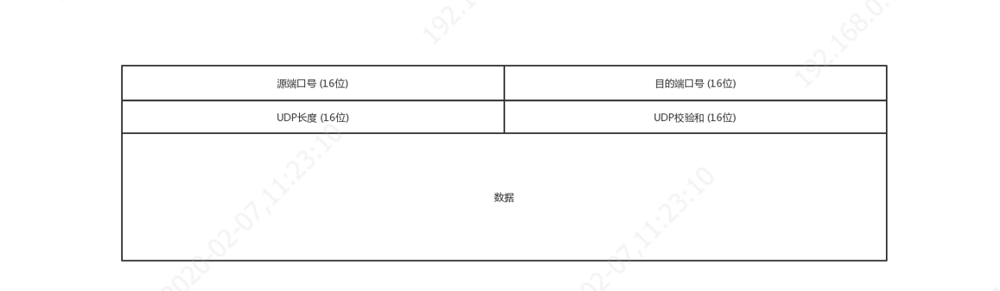

##### UDP特点

第一，沟通简单，不需要一肚子花花肠子（大量的数据结构、处理逻辑、包头字段）。前提是它相信网络世界是美好的，秉承性善论，相信网络通路默认就是很容易送达的，不容易被丢弃的。
第二，轻信他人。它不会建立连接，虽然有端口号，但是监听在这个地方，谁都可以传给他数据，他也可以传给任何人数据，甚至可以同时传给多个人数据。
第三，愣头青，做事不懂权变。不知道什么时候该坚持，什么时候该退让。它不会根据网络的情况进行发包的拥塞控制，无论网络丢包丢成啥样了，它该怎么发还怎么发。

速度、广播或者多播、

面向数据报的协议

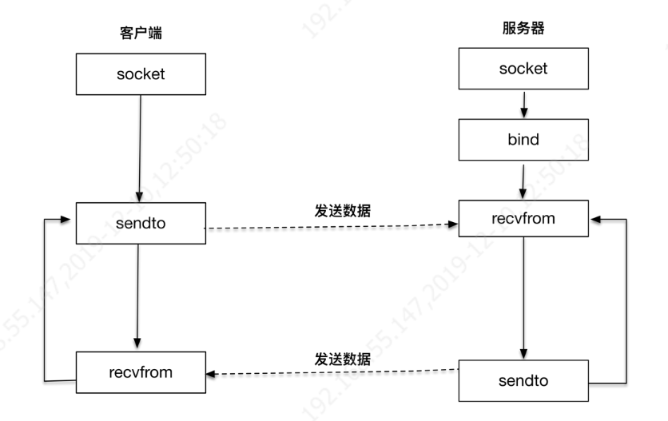

主要函数：
~~~c
ssize_t recvfrom(int sockfd, void *buff, size_t nbytes, int flags, struct sockaddr *from, socklen_t *addrlen); 

~~~
sockfd、buff 和 nbytes 是前三个参数。sockfd 是本地创建的套接字描述符，buff 指向本地的缓存，nbytes 表示最大接收数据字节。后面两个参数 from 和 addrlen，实际上是返回对端发送方的地址和端口等信息，这和 TCP 非常不一样，TCP 是通过 accept 函数拿到的描述字信息来决定对端的信息。另外 UDP 报文**每次接收都会获取对端的信息**，也就是说报文和报文之间是**没有上下文的**。
函数的返回值告诉我们实际接收的字节数。

~~~c
ssize_t sendto(int sockfd, const void *buff, size_t nbytes, int flags, const struct sockaddr *to, socklen_t *addrlen); 
~~~
后面两个参数 to 和 addrlen，表示发送的对端地址和端口等信息。

**与TCP的主要区别**：

1. 如果我们**只运行客户端**，程序会一直**阻塞**在 recvfrom 上。TCP的在Connect时候**旧报错**了，sentto步阻塞
2. 先开启服务端，再开启客户端  正常处理
3. 先开启服务端，再开启客户端 ，**重启**服务端，还是可以继续交互

##### UDP connect 的作用

客户端做connect

  主要是为了让应用程序**能够接收”异步错误“的信息**。
  如果我们回想一下第 6 篇不调用 connect 操作的客户端程序，在服务器端不开启的情况下，客户端程序是不会报错的，程序只会阻塞在 recvfrom 上，等待返回（或者超时）。
在这里，我们通过对 UDP 套接字进行 connect 操作，将 UDP 套接字建立了”上下文“，该**套接字和服务器端的地址和端口产生了联系**，正是这种绑定关系给了操作系统内核必要的信息，能够将**操作系统内核收到的信息**和对应的套接字进行关联数据包。
sendto进行内容发送，实际并不知道是否发送成功，**只能在recvfrom 进行得知**。

服务端做connect

  该服务端变成只能和一个客户端进交流，其他客户端过来就会报错 Connection refused 

思考：
可以对一个 UDP 套接字进行多次 connect 操作吗? 你不妨动手试试，看看结果。
如果想使用多播或广播，我们应该怎么去使用 connect 呢？

#### 总结
1. 如果将 TCP 比作成熟的社会人，UDP 则是头脑简单的小朋友。TCP 复杂，UDP 简单；TCP 维护连接，UDP 谁都相信；TCP 会坚持知进退；UDP 愣头青一个，勇往直前；
2. UDP 虽然简单，但它有简单的用法。它可以用在环境简单、需要多播、应用层自己控制传输的地方。例如 DHCP、VXLAN、QUIC 等。
3. TCP 包头很复杂，但是主要关注五个问题，顺序问题，丢包问题，连接维护，流量控制，拥塞控制；
4. 连接的建立是经过三次握手，断开的时候四次挥手，一定要掌握的我画的那个状态图。
5. 顺序问题、丢包问题、流量控制都是通过滑动窗口来解决的，这其实就相当于你领导和你的工作备忘录，布置过的工作要有编号，干完了有反馈，活不能派太多，也不能太少；
6. 拥塞控制是通过拥塞窗口来解决的，相当于往管道里面倒水，快了容易溢出，慢了浪费带宽，要摸着石头过河，找到最优值。

#### SOCKET套接字

AF_：地址族 PF_：协议族

通用地址 IPV4地址 IPV6地址 等结构

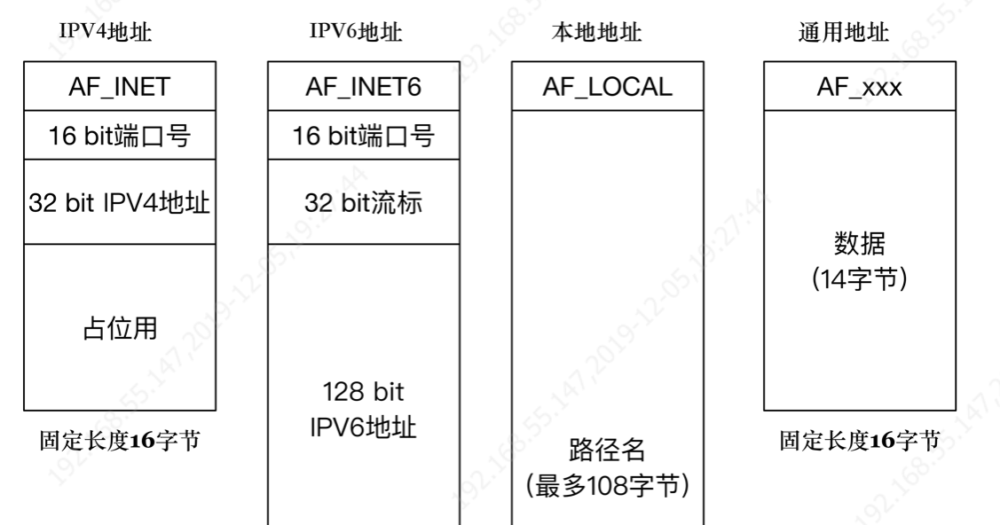

建立连接的过程

收发数据的过程

1. 对于 send 来说，返回成功仅仅表示数据**写到发送缓冲区成功**，并不表示对端已经成功收到。
2. 对于 read 来说，需要循环读取数据，并且需要考虑 EOF 等异常条件。

#### 本地套接字

本地套接字（ IPC）是一种特殊类型的套接字，和 TCP/UDP 套接字不同。TCP/UDP 即使在本地地址通信，也要**走系统网络协议栈**，而本地套接字，严格意义上说提供了一种**单主机跨进程间调用**的手段，减少了协议栈实现的复杂度，**效率**比 TCP/UDP 套接字都要高许多。类似的 IPC 机制还有 UNIX 管道、共享内存和 RPC 调用等。但是IPC开发便捷，接受度高，普遍在用。**AF_LOCAL**。创建一个本地文件，该文件起到**定位**的作用，一定需要的。**由服务端来创建改文件**，这个文件并没有任何变化（不管是文件大小、文件修改日期

1. 本地字节流套接字：本地字节流套接字识别服务器不再通过 IP 地址和端口，而是通过本地文件。

2. 本地数据包套接字：也是通过本地文件，客户端也要bind一个地址上进行通讯 

   两者什么区别：TCP字节流有序可靠；UDP没有有序可靠

#### 网络协议
远程调用要解决的一系列问题
1. 如何规定远程调用的语法？语法分析，字符各自代表的含义，正确与错误的返回
2. 如果传递参数？语义分析，一端发送的数据，另一端怎么认为是结束。
3. 如何标识数据？数据、协议约定分析，二进制 大端小端
4. 哪个端口可以访问远程调用，服务发现问题？
5. 错误、重传、丢包、性能？但是如果服务器崩溃了又重启，当前连接断开了，TCP 就保证不了了，需要应用自己进行重新调用
XML SOAP、JSON RESTful、二进制RPC、跨语言RPC（GRPC）、SERVICE mesh讲解
分别从上面的几个点来进行表述差别和优缺点（自描述语法）

#### 常用工具手段

我再来总结一下这几个命令的作用：

- ping 可以用来帮助我们进行网络连通性的探测。
- ifconfig，用来显示当前系统中的所有网络设备。
- netstat 和 lsof 可以查看活动的连接状况。
- tcpdump 可我再来总结一下这几个命令的作用：
- 以对各种奇怪的环境进行抓包，进而帮我们了解报文，排查问题。