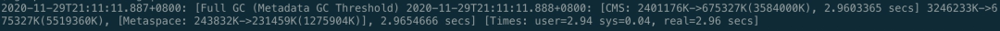
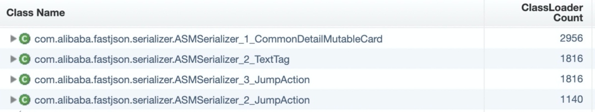

# JVM

## 案例一 （Metadata GC）

### 过程排查

metagc日志：



1. 查看了Metaspace 大小，把MetaspaceSize 从256M提高到了512M。但是发现Metaspace引发的Full GC还是没有消除。上线后 没有太大的用处

2. 立即dump了二台机器的日志，第一次分析GC 日志文件，没发现异常，这里有个注意的地方，大家dump文件时机很重要，有时候dump 的GC 日志没问题是因为刚好 Full GC完成之后dump的，内存回收的干干净净，有些内存缓慢增加的问题一定要在Full GC前dump。可以使用\#jinfo -flag +HeapDumpBeforeFullGC **5940**在进行临时设置

3. 分析GC dump日志发现可疑点，同一个ClassCloader 加载了接近3000个，如下图所示，前面我们说过，ClassCloader 信息在Metaspace 区域。

   破案了，fastjson使用不当引入了ASM Serializer的坑。

4. 故障定位与修复

   FastJson之所以快，原因就是使用asm字节码增强替代了反射。所以肯定是代码中应用了fastjson的ASM处理数据时造成的频繁加载同一个类，基本问题清楚了，那就是撸代码了，很快就定位了问题代码。如：

   ```
   for(Item item -> arrays) {
     SerializeConfig serializeConfig = new SerializeConfig();
      serializeConfig.put(Custom.class, new CustomSerializer());
      jsonString = JSON.toJSONString(item, serializeConfig);
   }
   ```

   这段代码是自定义了一个序列化实现类CustomSerializer，在进行序列化时进行了一个类似AOP的切面处理，对所有Custom类型的字段进行统一自定义序列化（使用CustomSerializer）。

   实现原理上是对需要序列化的Class使用asm动态生成了代理类，在这里就是Item类，使用SerializeConfig配置动态生成字节码代理类: com.alibaba.fastjson.serializer.ASMSerializer_1_Item，但是每次new SerializeConfig对象（内存地址不一样），FastJson会当作每次代理的目标是不一样的，导致每次会使用一个新的类加载器ASMClassLoader，所以Metaspace很快就满了，触发了频繁Full GC。

   如果希望深入研究可以看下FastJson源码：

   ```
   com.alibaba.fastjson.serializer.SerializeConfig#createASMSerializer
   ```

   问题修复：

   注册ObjectSerializer，让ObjectSerializer 成为全局唯一的，相当于是单例的。

   ```
   SerializeConfig.getGlobalInstance().put(Character.class, new CharacterSerializer());
   ```

   SerializeConfig 改成单例的后，每次序列化不用重复加载。

   ### 类似问题排查 & 调优

   1. 如果dump 日志发现很多classloader 名称前缀相同，排查是否有这种动态代理技术的使用，可能在不断生成代理对象。
   2. 发现内存缓慢增长，GC回收不掉，dump GC日志，查看是否有类被重复加载；
   3. Metaspace调优，比如我们现在生产环境 Metaspace 基本会设置256M 或者512M，可以根据应用的类型和机器内存配置来决定，因素：1. 是否会加载比较多的类，2. 机器内存允许, 可以适当调大Metaspace。

### 知识点

这里有二个知识点：

- Matespace（元空间）是什么？在JVM中扮演什么角色，也就是存放什么的？
- Full GC跟Matespace 大小设置有什么关系？
- fastJson的特性

Matespace叫做元空间，从JDK 8开始，永久代(PermGen)的概念被废弃掉了，取而代之的是一个称为Metaspace的存储空间。

Metaspace用来存放：Class文件在JVM 里的运行时数据结构；以及存Klass相关的其他的内容，比如Method，ConstantPool等。

Metaspace使用的是本地内存，而不是堆内存，也就是说在默认情况下Metaspace的大小只与本地内存大小有关。但是很容易有个**误区**是Matespace可以随便用，不管使用多少，只要不超本地内存就不会触发GC，这是错误的。

Matespace的设置方式是：-XX: MetaspaceSize=**M, 这个JVM参数的作用是让Matespace 达到MetaspaceSize时触发Full GC, 如果不设置Matespace, 默认值很小，也就 20M左右(不同系统会有一点差别)，如果程序Load Class比较多，很容易触发Full GC。这里要明白的是Class信息和加载Class 的ClassLoader 都存放在Metaspace，我们知道一个类是由这个类的类加载器加上全限定名（由包名&类名组成）确定唯一性的。

所以大家可以检查一下自己应用JVM Metaspace 设置的大小，如果没设置可以通过 -XX:+PrintFlagsInitial 查看一下默认值。

## 案例二 （Metadata GC）