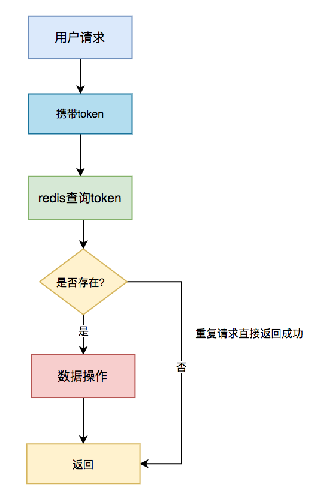
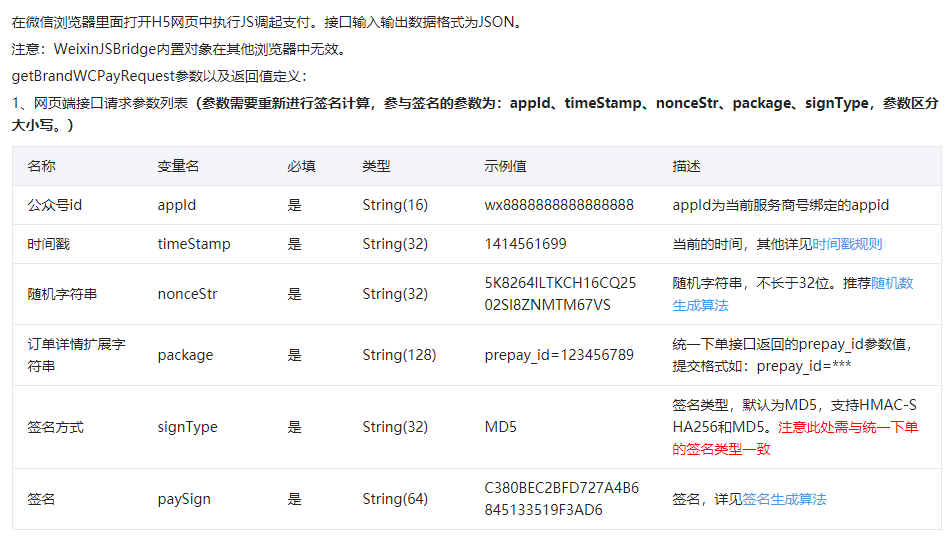
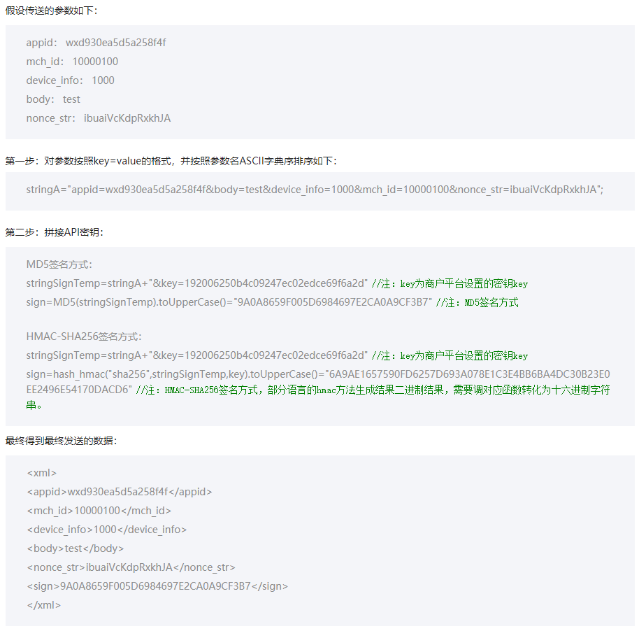
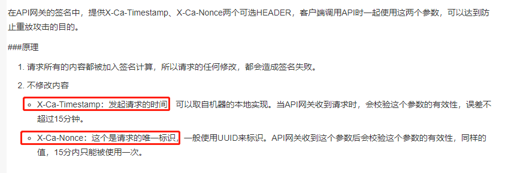
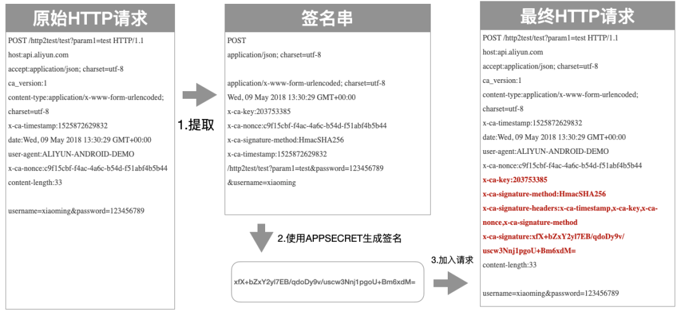
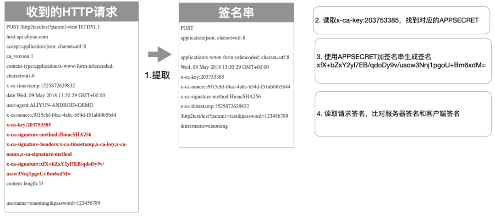

# JVM

## 案例一 （Metadata GC）

### 过程排查

metagc日志：


1. 查看了Metaspace 大小，把MetaspaceSize 从256M提高到了512M。但是发现Metaspace引发的Full GC还是没有消除。上线后 没有太大的用处

2. 立即dump了二台机器的日志，第一次分析GC 日志文件，没发现异常，这里有个注意的地方，大家dump文件时机很重要，有时候dump 的GC 日志没问题是因为刚好 Full GC完成之后dump的，内存回收的干干净净，有些内存缓慢增加的问题一定要在Full GC前dump。可以使用\#jinfo -flag +HeapDumpBeforeFullGC **5940**在进行临时设置

3. 分析GC dump日志发现可疑点，同一个ClassCloader 加载了接近3000个，如下图所示，前面我们说过，ClassCloader 信息在Metaspace 区域。

   破案了，fastjson使用不当引入了ASM Serializer的坑。

4. 故障定位与修复

   FastJson之所以快，原因就是使用asm字节码增强替代了反射。所以肯定是代码中应用了fastjson的ASM处理数据时造成的频繁加载同一个类，基本问题清楚了，那就是撸代码了，很快就定位了问题代码。如：

   ```
   for(Item item -> arrays) {
     SerializeConfig serializeConfig = new SerializeConfig();
      serializeConfig.put(Custom.class, new CustomSerializer());
      jsonString = JSON.toJSONString(item, serializeConfig);
   }
   ```

   这段代码是自定义了一个序列化实现类CustomSerializer，在进行序列化时进行了一个类似AOP的切面处理，对所有Custom类型的字段进行统一自定义序列化（使用CustomSerializer）。

   实现原理上是对需要序列化的Class使用asm动态生成了代理类，在这里就是Item类，使用SerializeConfig配置动态生成字节码代理类: com.alibaba.fastjson.serializer.ASMSerializer_1_Item，但是每次new SerializeConfig对象（内存地址不一样），FastJson会当作每次代理的目标是不一样的，导致每次会使用一个新的类加载器ASMClassLoader，所以Metaspace很快就满了，触发了频繁Full GC。

   如果希望深入研究可以看下FastJson源码：

   ```
   com.alibaba.fastjson.serializer.SerializeConfig#createASMSerializer
   ```

   问题修复：

   注册ObjectSerializer，让ObjectSerializer 成为全局唯一的，相当于是单例的。

   ```
   SerializeConfig.getGlobalInstance().put(Character.class, new CharacterSerializer());
   ```

   SerializeConfig 改成单例的后，每次序列化不用重复加载。

   ### 类似问题排查 & 调优

   1. 如果dump 日志发现很多classloader 名称前缀相同，排查是否有这种动态代理技术的使用，可能在不断生成代理对象。
   2. 发现内存缓慢增长，GC回收不掉，dump GC日志，查看是否有类被重复加载；
   3. Metaspace调优，比如我们现在生产环境 Metaspace 基本会设置256M 或者512M，可以根据应用的类型和机器内存配置来决定，因素：1. 是否会加载比较多的类，2. 机器内存允许, 可以适当调大Metaspace。

### 知识点

这里有二个知识点：

- Matespace（元空间）是什么？在JVM中扮演什么角色，也就是存放什么的？
- Full GC跟Matespace 大小设置有什么关系？
- fastJson的特性

Matespace叫做元空间，从JDK 8开始，永久代(PermGen)的概念被废弃掉了，取而代之的是一个称为Metaspace的存储空间。

Metaspace用来存放：Class文件在JVM 里的运行时数据结构；以及存Klass相关的其他的内容，比如Method，ConstantPool等。

Metaspace使用的是本地内存，而不是堆内存，也就是说在默认情况下Metaspace的大小只与本地内存大小有关。但是很容易有个**误区**是Matespace可以随便用，不管使用多少，只要不超本地内存就不会触发GC，这是错误的。

Matespace的设置方式是：-XX: MetaspaceSize=**M, 这个JVM参数的作用是让Matespace 达到MetaspaceSize时触发Full GC, 如果不设置Matespace, 默认值很小，也就 20M左右(不同系统会有一点差别)，如果程序Load Class比较多，很容易触发Full GC。这里要明白的是Class信息和加载Class 的ClassLoader 都存放在Metaspace，我们知道一个类是由这个类的类加载器加上全限定名（由包名&类名组成）确定唯一性的。

所以大家可以检查一下自己应用JVM Metaspace 设置的大小，如果没设置可以通过 -XX:+PrintFlagsInitial 查看一下默认值。

## 案例二 （数据量暴涨）

### 过程排查

消息队列告警，

立即开始问题排查，遇到线上问题，一定是保证最快速度止血，降低对业务的影响，然后再是排查原因，当然有的问题也需要快速找到原因。

第一反应是不是入口流量太大，处理消息的线程池核心线程数满了，任务都在排队，但是看了入口流量并没有尖刺。

看监控的消息消费任务耗时，如下图：

img

可以看到耗时在不断增加。那就需要看处理耗时增加原因了，为什么处理任务的耗时上涨了。

查看消息消费日志，如下：

img

发现有很多网络接口超时的。

img

大致得出结论：消息处理任务依赖下游系统接口，连接下游接口超时，连接下游接口设置的超时时间不算短，为什么下游接口如此多SocketTimeOut呢？

img

查看下游系统的监控大盘，发现了问题：


老年代GC次数暴涨，而且gc耗时都到了秒级别，1分钟5～10秒，太恐怖了。

找一台机器，把GC回收dump下来分析，使用mat查看，如下图所示：

img

一共七百多M空间，一个对象就占了640M空间，找到原因了，有内鬼（大对象）。

继续往下，看这个对象为什么会这么大，从GC Roots最短路径如下，MAT的使用，以及JVM相关分析，感兴趣可以微信公众号【安琪拉的博客】回复JVM，拉你进JVM交流群。

img

解释下，上面主要有三列，第一列是内存对象的类，重点在2，3列，Shallow Heap指的是对象本身占据的内存大小， Retained Heap = 本身本身占据内存大小 + 当前对象可直接或间接引用到的对象的大小总和，换句话说，就是当前对象如果被回收，能够回收的内存大小。

继续看，第一步，查看谁引用了这个对象，找到自己代码中的类，

img

第二步，查看这个对象TaggedMetricRegistry都引用了谁，为什么会占用这么大的内存空间，如下图所示，

img

找到罪魁祸首了，metrics这个 `ConcurrentHashMap` 占了671M内存，现在开始可以看下代码，找到 TaggedMetricRegistry继承自MetricRegistry，metrics 是MetricRegistry的成员变量，如下图：

img

img

那为什么这个 `ConcurrentHashMap` 占了这么大的内存空间，并且GC也回收不掉呢？

我们继续看MAT，分析 `ConcurrentHashMap` 占有的详细内存分布：

img

发现`ConcurrentHashMap`有几个Node节点尤其大，

追下去，继续

img

看到这个key，对应在代码中的位置，

img

你们可能好奇这段代码是干嘛的呢？

这个代码的作用是统计接口每次的执行时间，它内部update的源码如下：

在这里插入图片描述

这个方法是统计接口的耗时、调用次数的，它内部有一个measurements 的跳跃表，存放时间戳和统计指标（耗时、调用次数）的键值对，设置的时间窗口是1分钟，也就是它会存放1分钟的统计数据在内存中，当然这里面有个采样比，不是1分钟的全量数据，可以看到采样比是COLLISION_BUFFER决定的，然后1分钟上报一次内存数据到远端。问题就出现在这，因为这个耗时统计的函数的QPS非常高，**1分钟有数据频繁产生的时候，会导致在一个时间窗口（1分钟）measurements极速增长，导致内存占用快速增长，但是因为有强引用，GC的时候也不会把这个回收掉，所有才出现了上面的那个情况。**


非静态的匿名内部类会对外围类有一个强引用


## 案例三 （超时排查）

### 一. 问题现象

商品团队反馈，会员部分 Dubbo 接口偶现超时异常，而且时间不规律，几乎每天都有，商品服务超时报错如下图：


超时的接口平时耗时极短，平均耗时 4-5 毫秒。查看 Dubbo 的接口配置，商品调用会员接口超时时间是一秒，失败策略是 failFast，快速失败不会重试。

会员共部署了8台机器，都是 Java 应用，Java 版本使用的是 JDK 8，都跑在 Docker 容器中 。

### 二. 问题分析

开始以为只是简单的接口超时，着手排查。首先查看接口逻辑，只有简单的数据库调用，封装参数返回。SQL 走了索引查询，理应返回很快才是。

于是搜索 Dubbo 的拦截器ElapsedFilter打印的耗时日志（ElapsedFilter是 Dubbo SPI 机制的扩展点之一，超过 300 毫秒的接口耗时都会打印），这个接口的部分时间耗时确实很长。


再查询数据库的慢 SQL 平台，未发现慢 SQL。

### 1. 数据库超时？

怀疑是获取数据库连接耗时。代码中调用数据库查询可以分为两步，获取数据库连接和 SQL 查询，慢SQL 平台监测的 SQL 执行时间，既然慢 SQL 平台没有发现，那可能是建立连接耗时较长。

查看应用中使用了 Druid 连接池，数据库连接会在初始化使用时建立，而不是每次 SQL 查询再建立连接。Druid 配置的 initial-size（初始化链接数）是 5，max-active（最大连接池数量）是 50，但 min-idle（最小连接池数量）只有 1，猜测可能是连接长时间不被使用后都回收了，有新的请求进来后触发建立连接，耗时较长。

因此调整 min-idle 为 10，并加上了 Druid 连接池的使用情况日志，每隔 3 秒打印连接池的活跃数等信息，重新观察。

改动上线后，还是有超时发生，超时发生时查看连接池日志，连接数正常，连接池连接数也没什么波动。

### 2. STW？

因此重新回到报错日志观察，ElapsedFilter 打印的耗时日志已经消失。

由于在业务方法的入口和出口，以及数据库操作的前后打印了日志，发现整个业务操作耗时极短，都在几毫秒内完成。

但是调用端隔一段时间开始超时报错，且并不是调用一个接口超时，而是调用好几个接口都同时超时。

另外，调用端的几台机器都会同时报超时（可以在 elk 平台筛选 hostname 查看），而提供服务超时的机器是同一台。

这样问题就比较清晰了，**应该是某一时刻提供服务的某台机器出现比较全局性的问题导致几乎所有接口都超时**。

继续观察日志，抓了其中一个超时的请求从调用端到服务端的所有日志（理应有分布式 ID 可以追踪，context id 只能追踪单应用内的一个请求，跨应用就失效了，所以只能自己想办法，此处是根据调用IP+时间+接口+参数在 elk 定位）。

这次有了新的发现，服务端收到请求的时间比调用端发起调用的时间晚了一秒。

比较严谨的说法是调用端的超时日志中 Dubbo 有打印 startTime（记为T1）和 endTime，同时在服务端的接口方法入口加了日志，可以定位请求进来的时间（记为T2），比较这两个时间，发现 T2 比 T1 晚了一秒多，更长一点的有两到三秒。

内网调用网络时间几乎可以忽略不计，这个延迟时间极其不正常。很容易想到 Java 应用的 STW(Stop The World)，其中，特别是垃圾回收会导致短暂的应用停顿，无法响应请求。

排查垃圾回收问题第一件事自然是打开垃圾回收日志（GC log），GC log 打印了 GC 发生的时间，GC 的类型，以及 GC 耗费的时间等。增加 JVM 启动参数

> -XX:+PrintGCDetails 
>
> -Xloggc:${APPLICATION_LOG_DIR}/gc.log
>
> -XX:+PrintGCDateStamps 
>
> -XX:+PrintGCApplicationStoppedTime。

为了方便排查，同时打印了所有应用的停顿时间。（除了垃圾回收会导致应用停顿，还有很多操作也会导致停顿，比如取消偏向锁等操作）。由于应用是在 docker 环境，因此每次应用发布都会导致 GC 日志被清除，写了个上报程序，定时把 GC log 上报到 elk 平台，方便观察。

以下是接口超时时 GC 的情况：


可以看到，有次 GC 耗费的时间接近两秒，应用的停顿时间也接近两秒，而且此次的垃圾回收是 ParNew 算法，也就是发生在新生代。所以基本可以确定，**是垃圾回收的停顿导致应用不可用，进而导致接口超时**。

### 2.1 安全点及 FinalReferecne

以下开始排查新生代垃圾回收耗时过长的问题。

首先，应用的 JVM 参数配置是

> -Xmx5g 
>
> -Xms5g
>
> -Xmn1g
>
> -XX:MetaspaceSize=512m
>
> -XX:MaxMetaspaceSize=512m
>
> -Xss256k
>
> -XX:SurvivorRatio=8
>
> -XX:+UseParNewGC
>
> -XX:+UseConcMarkSweepGC
>
> -XX:CMSInitiatingOccupancyFraction=70

通过观察监控平台，发现堆的利用率一直很低，GC 日志甚至没出现过一次 CMS GC，由此可以排除是堆大小不够用的问题。

ParNew 回收算法较为简单，不像老年代使用的 CMS 那么复杂。

ParNew 采用标记-复制算法，把新生代分为 Eden 和 Survivor 区，Survivor 区分为 S0 和 S1，新的对象先被分配到 Eden 和 S0 区，都满了无法分配的时候把存活的对象复制到 S1 区，清除剩下的对象，腾出空间。

比较耗时的操作有三个地方，**找到并标记存活对象，回收对象，复制存活对象**（此处涉及到比较多垃圾回收的知识，详细部分就不展开说了）。

找到并标记存活对象前 JVM 需要暂停所有线程，这一步并不是一蹴而就的，需要等所有的线程都跑到安全点。

部分线程可能由于执行较长的循环等操作无法马上响应安全点请求，JVM 有个参数可以打印所有安全点操作的耗时，加上参数

> -XX:+PrintSafepointStatistics 
>
> -XX: PrintSafepointStatisticsCount=1 
>
> -XX:+UnlockDiagnosticVMOptions 
>
> -XX: -DisplayVMOutput 
>
> -XX:+LogVMOutput 
>
> -XX:LogFile=/opt/apps/logs/safepoint.log。


安全点日志中 spin+block 时间是线程跑到安全点并响应的时间，从日志可以看出，此处耗时极短，大部分时间都消耗在 vmop 操作，也就是到达安全点之后的操作时间，排除线程等待进入安全点耗时过长的可能。

继续分析回收对象的耗时，根据引用强弱程度不同，Java 的对象类型可分为各类 Reference。

其中FinalReference 较为特殊，对象有个 finalize 方法，可在对象被回收之前调用，给对象一个垂死挣扎的机会。有些框架会在对象 finalize 方法中做一些资源回收，关闭连接的操作，导致垃圾回收耗时增加。

因此通过增加JVM参数 -XX:+PrintReferenceGC，打印各类 Reference 回收的时间。


可以看到，FinalReference 的回收时间也极短。

最后看复制存活对象的耗时，复制的时间主要由存活下来的对象大小决定，从 GC log 可以看到，每次新生代回收基本可以回收百分之九十以上的对象，存活对象极少。因此基本可以排除这种可能。

问题的排查陷入僵局，ParNew 算法较为简单，因此 JVM 并没有更多的日志记录，所以排查更多是通过经验。

### 2.2 垃圾回收线程

不得已，开始求助网友，上 stackoverflow 发帖（链接见文末），有大神从 GC log 发现，有两次 GC 回收的对象大小几乎一样，但是耗时却相差十倍，因此建议确认下系统的 CPU 情况，是否是虚拟环境，可能存在激烈的 CPU 资源竞争。

其实之前已经怀疑是 CPU 资源问题，通过监控平台发现，垃圾回收时 CPU 波动并不大。

但运维发现我们应用的垃圾回收线程数有些问题（GC 线程数可以通过 jstack 命令打印线程堆栈查看），JVM 的 GC 线程数量是根据 CPU 的核数确定的，如果是八个核心以下，GC 线程数等于CPU 核心数，我们应用跑在 docker 容器，分配的核心是六核，但是新生代 GC 线程数却达到了 53个，这明显不正常。

最后发现，这个问题是 JVM 在 docker 环境中，获取到的 CPU 信息是宿主机的（容器中 /proc目录并未做隔离，各容器共享，CPU信息保存在该目录下），并不是指定的六核心，宿主机是八十核心，因此创建的垃圾回收线程数远大于 docker 环境的 CPU 资源，导致每次新生代回收线程间竞争激烈，耗时增加。

通过指定 JVM 垃圾回收线程数为 CPU 核心数，限制新生代垃圾回收线程，增加JVM参数

> -XX:ParallelGCThreads=6 
>
> -XX:ConcGCThreads=6


效果立竿见影！

新生代垃圾回收时间基本降到 50 毫秒以下，成功解决垃圾回收耗时较长问题。

### 三. 问题重现

本以为超时问题应该彻底解决了，但还是收到了接口超时的报警。现象完全一样，同一时间多个接口同时超时。查看 GC 日志，发现已经没有超过一秒的停顿时间，甚至上百毫秒的都已经没有。

#### 1. Arthas 和 Dubbo

回到代码，重新分析。

开始对整个 Dubbo 接口接收请求过程进行拆解，打算借助阿里巴巴开源的Arthas 对请求进行 trace，打印全链路各个步骤的时间。

服务端接收 dubbo 请求，从网络层开始再到应用层。具体是从 netty 的 worker 线程接收到请求，再投递到 dubbo 的业务线程池（应用使用的是 ALL 类型线程池），由于涉及到多个线程，只能分两段进行 trace，netty 接收请求的一段，dubbo 线程处理的一段。

Arthas 的 trace 功能可以在后台运行，同时只打印耗时超过某个阈值的链路。（trace 采用的是instrument+ASM，会导致短暂的应用暂停，暂停时间取决于被植入的类的数量，需注意）

由于没有打印参数，无法准确定位超时的请求，而且 trace 只能看到调用第一层的耗时时间，结果都是业务处理时间过长，最后放弃了该 trace 方法。

受 GC 线程数思路的启发，由于应用运行基本不涉及刷盘的操作，都是 CPU 运算+内存读取，耗时仍旧应该是线程竞争或者锁引起的。

重新回到 jstack 的堆栈进行排查，发现总线程数仍有 900+，处于一个较高的水平，其中 forkjoin 线程和 netty 的 worker 的线程数仍较多。

于是重新搜索代码中线程数是通过CPU核心数设置（Runtime.getRuntime().availableProcessors()）的地方，发现还是有不少框架使用这个参数，这部分无法通过设置 JVM 参数解决。

因此和容器组商量，是否能够给容器内应用传递正确的 CPU 核心数。

容器组确认可以通过升级 JDK 版本和开启 CPU SET 技术限制容器使用的 CPU 数，从 Java 8u131 和 Java 9 开始，JVM 可以理解和利用 cpuset 来确定可用处理器的大小(**Java 和 cpuset 见文末参考链接**)。

现在使用的也是JDK 8，小版本升级风险较小，因此测试没问题后，推动应用内8台容器升级到了 Java 8u221，并且开启了 cpu set，指定容器可使用的 CPU 数。

**重新修改上线后，还是有超时情况发生。**

#### 2. 网络抓包

观察具体的超时机器和时间，发现并不是多台机器超时，而是一段时间有某台机器比较密集的超时，而且频率比之前密集了许多。

以前的超时在各机器之间较为随机，而且频率低很多。

比较奇怪的是，应用 经过发布之后，原来超时的机器不超时了，而是其他的机器开始超时，看起来像是接力赛。（docker 应用的宿主机随着每次发布都可能变化）

面对如此奇怪的现象，只能怀疑是宿主机或者是网络问题了，因此开始网络抓包。

由于超时是发生在一台机器上，而且频率较为密集，因此直接进入该机器，使用 tcpdump 命令抓取host 是调用方进来的包并保存抓包记录，通过 wireshark 分析（wireshark 是抓包分析神器），抓到了一些异常包。


> 注意抓包中出现的 「TCP Out_of_Order」,「TCP Dup ACK」,「TCP Retransmission」，三者的释义如下:
>
> `TCP Out_of_Order`:  一般来说是网络拥塞，导致顺序包抵达时间不同，延时太长，或者包丢失，需要重新组合数据单元，因为他们可能是由不同的路径到达你的电脑上面。
>
> `TCP dup ack XXX#X`: 重复应答，#前的表示报文到哪个序号丢失，#后面的是表示第几次丢失
>
> `TCP Retransmission`：超时引发的数据重传

终于，通过在 elk 中超时日志打印的 contextid，在 wireshark 过滤定位超时的 TCP 包，发现超时的时候有丢包和重传。

抓了多个超时的日志都有丢包发生，确认是网络问题引起。

问题至此基本告一段落，接下来容器组继续排查网络偶发丢包问题。

#### 3. 巨人的肩膀

- stackoverflow 提问帖子 : http://aakn.cn/YbFsl
- jstack 可视化分析工具 : https://fastthread.io/
- 2018年的 Docker 和 JVM : https://www.jdon.com/51214

### why哥说

**前面就是公众号[码海]的号主坤哥给大家分享的一个线上问题排查案例。建议大家关注一波坤哥，他某电商独角兽大厂技术专家，发布的文章都很硬核。文首可以直达该公众号。**

不知道大家读这个案例的时候是什么感觉，反正我整体读下来之后就一个字：通透！

从最开始 Dubbo 调用超时的这个表象，分别从数据库、GC、网络、链路追踪等各个角度去分析了问题，且是一个循序渐进的过程。

就是说大家的排查套路都无外乎这样，层层递减的排查，抽丝剥茧的寻找问题。

而且这里面还涉及到了很多其他的知识点，由于不是本文的重点，所以作者没有详细的写出来。

比如举几个例子：

1. 为什么要说“失败策略是 failFast，快速失败不会重试”？因为如果是failover，会默认重试，且超时时间是重试时间之和。所以，他告诉我们，这里没有重试，超时不是因为请求重试带来的时间叠加导致的。
2. 文章提到的 ElapsedFilter 过滤器，“超过 300 毫秒的接口耗时都会打印”，是作者公司自己扩展的 Filter，基于Dubbo 的 SPI 实现的，并不是 Dubbo 官方的自带功能。所以，他才额外提了一句“ElapsedFilter是 Dubbo SPI 机制的（自定义）扩展点之一”。
3. 作者用的 Druid 连接池，猜测连接长时间不被使用后都回收了，那么关于 Druid 的配置文件中的有关时间的配置，你是否知道且清楚其作用？
4. 如果要观察 GC 日志，你是否大概知道应该配置什么参数，是否知道应该关注的信息是什么？为什么他这里要提到安全点？安全点和 STW 的时间之间的关系又是什么？
5. 等等后面的一些关于容器的、Arthas工具使用的、网络抓包工具使用的相关技能和知识储备。

正如文章开头说的，当把这些知识单独拎出来形成面试题的时候，也许你会觉得，为什么你老是问我 MySQL 的知识、问我网络相关的知识、问我一些用不上的垃圾回收的知识？

问你，把你问的哑口无言不是目的。考察你知识的广度，让你学以致用才是目的。重要的是把你学的一个个孤立的点，通过某种方式，串联起来。

而这个案例分享出来，你发现了没有，完全没有背景相关的铺垫，你看起来却毫无障碍。这就是前面说的“排查套路”，所以，套路在这里，背景你可以自己去填充。

填充，懂吧？就是适当的加工。

面试的时候万一能用上呢？把“拿来主义”贯彻到底。

就像我：你这个案例很好，现在它是我的了。


最后，不得不补充一句，有的同学的解决方案，可能就是把超时时间从 1 秒改到了 2 秒，甚至更长，然后问题就解决了......

也不能说不行，只是可惜错过了一次排查的机会。


# Mysql

## limit优化

### 过程排查

果然，沟通的情况是线上的一个查询数据的接口被疯狂的失去理智般的调用，这个操作直接导致线上的MySql集群被拖慢了。

我们在查看前几页的时候，发现速度非常快，比如  `limit 200,25`，瞬间就出来了。但是越往后，速度就越慢，特别是百万条之后，卡到不行，那这个是什么原理呢。先看一下我们翻页翻到后面时，查询的sql是怎样的：

```
select * from t_name where c_name1='xxx' order by c_name2 limit 2000000,25;
```

这种查询的慢，其实是因为limit后面的偏移量太大导致的。比如像上面的  `limit 2000000,25` ，这个等同于数据库要扫描出 2000025条数据，然后再丢弃前面的 20000000条数据，返回剩下25条数据给用户，这种取法明显不合理。


大家翻看《高性能MySQL》第六章：查询性能优化，对这个问题有过说明：

分页操作通常会使用limit加上偏移量的办法实现，同时再加上合适的order by子句。但这会出现一个常见问题：当偏移量非常大的时候，它会导致MySQL扫描大量不需要的行然后再抛弃掉。

### 解决方案

1. ### 使用索引覆盖+子查询优化

   因为我们有主键id，并且在上面建了索引，所以可以先在索引树中找到开始位置的 id值，再根据找到的id值查询行数据。

   ```
   /*子查询获取偏移100条的位置的id，在这个位置上往后取25*/
   SELECT a.empno,a.empname,a.job,a.sal,b.depno,b.depname
   from emp a left join dep b on a.depno = b.depno
   where a.id >= (select id from emp order by id limit 100,1)
   order by a.id limit 25;
   
   /*子查询获取偏移4800000条的位置的id，在这个位置上往后取25*/
   SELECT a.empno,a.empname,a.job,a.sal,b.depno,b.depname
   from emp a left join dep b on a.depno = b.depno
   where a.id >= (select id from emp order by id limit 4800000,1)
   order by a.id limit 25;
   ```

   执行结果

   执行效率相比之前有大幅的提升：

   ```
   [SQL]
   SELECT a.empno,a.empname,a.job,a.sal,b.depno,b.depname
   from emp a left join dep b on a.depno = b.depno
   where a.id >= (select id from emp order by id limit 100,1)
   order by a.id limit 25;
   受影响的行: 0
   时间: 0.106s
   
   [SQL]
   SELECT a.empno,a.empname,a.job,a.sal,b.depno,b.depname
   from emp a left join dep b on a.depno = b.depno
   where a.id >= (select id from emp order by id limit 4800000,1)
   order by a.id limit 25;
   受影响的行: 0
   时间: 1.541s
   ```

2. ### 起始位置重定义

   记住上次查找结果的主键位置，避免使用偏移量 offset

   ```
   /*记住了上次的分页的最后一条数据的id是100，这边就直接跳过100，从101开始扫描表*/
   SELECT a.id,a.empno,a.empname,a.job,a.sal,b.depno,b.depname
   from emp a left join dep b on a.depno = b.depno
   where a.id > 100 order by a.id limit 25;
   
   /*记住了上次的分页的最后一条数据的id是4800000，这边就直接跳过4800000，从4800001开始扫描表*/
   SELECT a.id,a.empno,a.empname,a.job,a.sal,b.depno,b.depname
   from emp a left join dep b on a.depno = b.depno
   where a.id > 4800000
   order by a.id limit 25;
   ```

   执行结果

   ```
   [SQL]
   SELECT a.id,a.empno,a.empname,a.job,a.sal,b.depno,b.depname
   from emp a left join dep b on a.depno = b.depno
   where a.id > 100 order by a.id limit 25;
   受影响的行: 0
   时间: 0.001s
   
   [SQL]
   SELECT a.id,a.empno,a.empname,a.job,a.sal,b.depno,b.depname
   from emp a left join dep b on a.depno = b.depno
   where a.id > 4800000
   order by a.id limit 25;
   受影响的行: 0
   时间: 0.000s
   ```

   这个效率是最好的，无论怎么分页，耗时基本都是一致的，因为他执行完条件之后，都只扫描了25条数据。

   但是有个问题，只适合一页一页的分页，这样才能记住前一个分页的最后Id。如果用户跳着分页就有问题了，比如刚刚刷完第25页，马上跳到35页，数据就会不对。

   这种的适合场景是类似百度搜索或者腾讯新闻那种滚轮往下拉，不断拉取不断加载的情况。这种延迟加载会保证数据不会跳跃着获取。

   

   ### 3、降级策略

   看了网上一个阿里的dba同学分享的方案：配置limit的偏移量和获取数一个最大值，超过这个最大值，就返回空数据。

   因为他觉得超过这个值你已经不是在分页了，而是在刷数据了，如果确认要找数据，应该输入合适条件来缩小范围，而不是一页一页分页。

   这个跟我同事的想法大致一样：request的时候 如果offset大于某个数值就先返回一个4xx的错误。


# 幂等

## 1. insert前先select

通常情况下，在保存数据的接口中，我们为了防止产生重复数据，一般会在`insert`前，先根据`name`或`code`字段`select`一下数据。如果该数据已存在，则执行`update`操作，如果不存在，才执行  `insert`操作。


该方案可能是我们平时在防止产生重复数据时，使用最多的方案。但是该方案不适用于并发场景，在并发场景中，要配合其他方案一起使用，否则同样会产生重复数据。我在这里提一下，是为了避免大家踩坑。

## 2. 加悲观锁

在支付场景中，用户A的账号余额有150元，想转出100元，正常情况下用户A的余额只剩50元。一般情况下，sql是这样的：

- 

```
update user amount = amount-100 where id=123;

```

如果出现多次相同的请求，可能会导致用户A的余额变成负数。这种情况，用户A来可能要哭了。于此同时，系统开发人员可能也要哭了，因为这是很严重的系统bug。

为了解决这个问题，可以加悲观锁，将用户A的那行数据锁住，在同一时刻只允许一个请求获得锁，更新数据，其他的请求则等待。

通常情况下通过如下sql锁住单行数据：

- 

```
select * from user id=123 for update;

```

具体流程如下：


具体步骤：

1. 多个请求同时根据id查询用户信息。
2. 判断余额是否不足100，如果余额不足，则直接返回余额不足。
3. 如果余额充足，则通过for update再次查询用户信息，并且尝试获取锁。
4. 只有第一个请求能获取到行锁，其余没有获取锁的请求，则等待下一次获取锁的机会。
5. 第一个请求获取到锁之后，判断余额是否不足100，如果余额足够，则进行update操作。
6. 如果余额不足，说明是重复请求，则直接返回成功。


> 需要特别注意的是：如果使用的是mysql数据库，存储引擎必须用innodb，因为它才支持事务。此外，这里id字段一定要是主键或者唯一索引，不然会锁住整张表。

悲观锁需要在同一个事务操作过程中锁住一行数据，如果事务耗时比较长，会造成大量的请求等待，影响接口性能。

此外，每次请求接口很难保证都有相同的返回值，所以不适合幂等性设计场景，但是在防重场景中是可以的使用的。

在这里顺便说一下，`防重设计` 和 `幂等设计`，其实是有区别的。防重设计主要为了避免产生重复数据，对接口返回没有太多要求。而幂等设计除了避免产生重复数据之外，还要求每次请求都返回一样的结果。

## 3. 加乐观锁

既然悲观锁有性能问题，为了提升接口性能，我们可以使用乐观锁。需要在表中增加一个`timestamp`或者`version`字段，这里以`version`字段为例。

在更新数据之前先查询一下数据：

```
select id,amount,version from user id=123;

```

如果数据存在，假设查到的`version`等于`1`，再使用`id`和`version`字段作为查询条件更新数据：

```
update user set amount=amount+100,version=version+1where id=123 and version=1;

```

更新数据的同时`version+1`，然后判断本次`update`操作的影响行数，如果大于0，则说明本次更新成功，如果等于0，则说明本次更新没有让数据变更。

由于第一次请求`version`等于`1`是可以成功的，操作成功后`version`变成`2`了。这时如果并发的请求过来，再执行相同的sql：

```
 update user set amount=amount+100,version=version+1where id=123 and version=1;
```

该`update`操作不会真正更新数据，最终sql的执行结果影响行数是`0`，因为`version`已经变成`2`了，`where`中的`version=1`肯定无法满足条件。但为了保证接口幂等性，接口可以直接返回成功，因为`version`值已经修改了，那么前面必定已经成功过一次，后面都是重复的请求。

具体流程如下：

具体步骤：

1. 先根据id查询用户信息，包含version字段
2. 根据id和version字段值作为where条件的参数，更新用户信息，同时version+1
3. 判断操作影响行数，如果影响1行，则说明是一次请求，可以做其他数据操作。
4. 如果影响0行，说明是重复请求，则直接返回成功。

## 4. 加唯一索引

绝大数情况下，为了防止重复数据的产生，我们都会在表中加唯一索引，这是一个非常简单，并且有效的方案。

- 

```
alter table `order` add UNIQUE KEY `un_code` (`code`);

```

加了唯一索引之后，第一次请求数据可以插入成功。但后面的相同请求，插入数据时会报`Duplicate entry '002' for key 'order.un_code`异常，表示唯一索引有冲突。

虽说抛异常对数据来说没有影响，不会造成错误数据。但是为了保证接口幂等性，我们需要对该异常进行捕获，然后返回成功。

如果是`java`程序需要捕获：`DuplicateKeyException`异常，如果使用了`spring`框架还需要捕获：`MySQLIntegrityConstraintViolationException`异常。

具体流程图如下：


具体步骤：

1. 用户通过浏览器发起请求，服务端收集数据。
2. 将该数据插入mysql
3. 判断是否执行成功，如果成功，则操作其他数据（可能还有其他的业务逻辑）。
4. 如果执行失败，捕获唯一索引冲突异常，直接返回成功。

## 5. 建防重表

有时候表中并非所有的场景都不允许产生重复的数据，只有某些特定场景才不允许。这时候，直接在表中加唯一索引，显然是不太合适的。

针对这种情况，我们可以通过`建防重表`来解决问题。

该表可以只包含两个字段：`id` 和 `唯一索引`，唯一索引可以是多个字段比如：name、code等组合起来的唯一标识，例如：susan_0001。

具体流程图如下：


具体步骤：

1. 用户通过浏览器发起请求，服务端收集数据。
2. 将该数据插入mysql防重表
3. 判断是否执行成功，如果成功，则做mysql其他的数据操作（可能还有其他的业务逻辑）。
4. 如果执行失败，捕获唯一索引冲突异常，直接返回成功。

> 需要特别注意的是：防重表和业务表必须在同一个数据库中，并且操作要在同一个事务中。

## 6. 根据状态机

很多时候业务表是有状态的，比如订单表中有：1-下单、2-已支付、3-完成、4-撤销等状态。如果这些状态的值是有规律的，按照业务节点正好是从小到大，我们就能通过它来保证接口的幂等性。

假如id=123的订单状态是`已支付`，现在要变成`完成`状态。

- 

```
update `order` set status=3 where id=123 and status=2;

```

第一次请求时，该订单的状态是`已支付`，值是`2`，所以该`update`语句可以正常更新数据，sql执行结果的影响行数是`1`，订单状态变成了`3`。

后面有相同的请求过来，再执行相同的sql时，由于订单状态变成了`3`，再用`status=2`作为条件，无法查询出需要更新的数据，所以最终sql执行结果的影响行数是`0`，即不会真正的更新数据。但为了保证接口幂等性，影响行数是`0`时，接口也可以直接返回成功。

具体流程图如下：


具体步骤：

1. 用户通过浏览器发起请求，服务端收集数据。
2. 根据id和当前状态作为条件，更新成下一个状态
3. 判断操作影响行数，如果影响了1行，说明当前操作成功，可以进行其他数据操作。
4. 如果影响了0行，说明是重复请求，直接返回成功。

> 主要特别注意的是，该方案仅限于要更新的`表有状态字段`，并且刚好要更新`状态字段`的这种特殊情况，并非所有场景都适用。

## 7. 加分布式锁

其实前面介绍过的`加唯一索引`或者`加防重表`，本质是使用了`数据库`的`分布式锁`，也属于分布式锁的一种。但由于`数据库分布式锁`的性能不太好，我们可以改用：`redis`或`zookeeper`。

鉴于现在很多公司分布式配置中心改用`apollo`或`nacos`，已经很少用`zookeeper`了，我们以`redis`为例介绍分布式锁。

目前主要有三种方式实现redis的分布式锁：

1. setNx命令
2. set命令
3. Redission框架

每种方案各有利弊，具体实现细节我就不说了，有兴趣的朋友可以加我微信找我私聊。

具体流程图如下：


具体步骤：

1. 用户通过浏览器发起请求，服务端会收集数据，并且生成订单号code作为唯一业务字段。
2. 使用redis的set命令，将该订单code设置到redis中，同时设置超时时间。
3. 判断是否设置成功，如果设置成功，说明是第一次请求，则进行数据操作。
4. 如果设置失败，说明是重复请求，则直接返回成功。

> 需要特别注意的是：分布式锁一定要设置一个合理的过期时间，如果设置过短，无法有效的防止重复请求。如果设置过长，可能会浪费`redis`的存储空间，需要根据实际业务情况而定。

## 8. 获取token

除了上述方案之外，还有最后一种使用`token`的方案。该方案跟之前的所有方案都有点不一样，需要两次请求才能完成一次业务操作。

1. 第一次请求获取`token`
2. 第二次请求带着这个`token`，完成业务操作。

具体流程图如下：

第一步，先获取token。


第二步，做具体业务操作。




具体步骤：

1. 用户访问页面时，浏览器自动发起获取token请求。
2. 服务端生成token，保存到redis中，然后返回给浏览器。
3. 用户通过浏览器发起请求时，携带该token。
4. 在redis中查询该token是否存在，如果不存在，说明是第一次请求，做则后续的数据操作。
5. 如果存在，说明是重复请求，则直接返回成功。
6. 在redis中token会在过期时间之后，被自动删除。

以上方案是针对幂等设计的。

如果是防重设计，流程图要改改：


> 需要特别注意的是：token必须是全局唯一的。

9. 业务支持幂等。状态机这种方式。

# 重放攻击

## **加时间戳**

首先，常见的解决方案就是在请求报文里面加上时间戳，并参与加签。

当接收方收到报文，经过验签之后。

首先第一个事儿就是拿着请求中的时间戳字段和本地时间做个对比。

如果时间误差在指定时间，比如 60 秒内，那么认为这个请求是合理的，程序可以继续处理。

为什么要有一个时间容错范围，能理解吧？

因为报文的传输、解密、验签是需要时间，不能假设我这一秒发出去，下一秒服务端就收到了。

所以，得有时间容错范围。

但是这个容错范围又带来了另外一个问题。

不能完全避免重放攻击。

至少时间容错范围内，比如 60 秒，重发过来的请求，服务端认为是有效的。

那么怎么办呢？

## **加随机串**

换个思路，我们在请求报文里面加个随机串，然后让它参与加签。

接受方收到报文，验签之后，把随机串拿出来，来判断一下这个随机串是否已经处理过了。比如判断一下是否存在于 Redis 里面。

当请求再次重放过来的时候，一看：嚯，好家伙，这个随机串已经被用过了呀，不处理了。

在这个情况下，随机串就得保证唯一性了，还得历史全局唯一。

因为你指不定哪天就收到一个几天前的被重放过来的请求。

确实是解决了请求重放的问题，但是弊端也很明显：历史全局唯一。

我还得存储下来，而且存储的数据量还会越来越大，是不是有点麻烦了？

确实麻烦了。

这个思想就和用全局唯一流水号去保证接口幂等性很像了。

所以，我第一次遇到这个面试题的时候，我朝着接口幂等的角度去回答了，也不能说回答的不对。

只能说回答的不是面试官想要的标准答案。

那么什么是面试官想要听到的回答呢？

**时间戳+随机串**

时间戳的问题是有一定的时间容错窗口，这个时间窗口内的重放攻击是防不住的。

随机串的问题是要保证历史全局唯一，保存随机串成了一个麻烦的事情。

那么当我们把这两个方案揉在一起的时候，神奇的事情就发生了：

我只需要保证时间窗口内的生成的随机串不重复就行。

而且假设时间窗口为 60 秒，我们用 Redis 来记录出现过的随机串，那么这个串在后台的超时时间设置为 60 秒就行。

一般来说这个时间窗口都不会太长了，我对接过这么多各种各样的渠道，见过最长的也就 5 分钟。

保证 5 分钟内生成的两个随机串不重复，这个需求比保证实现一个历史全局唯一的流水号容易实现多了吧？

另外，最关键的一句话一定要说：**时间戳和随机串得参与到加签逻辑中去。**

这个很好理解吧？

接受方看报文是否被篡改，看的就是签名是否能匹配上。

而签名的结果是和参与签名的字段的值有直接关系的。

要是你时间戳和随机串不参与加签，那么任意修改时间戳或者随机串，都不会引起签名的变化，那不白忙活一场吗？

中间人咔一下拦截到请求，发现有时间戳和随机串，正准备放弃的时候，想着死马当做活马医，把随机串一改，又扔给接收方了。

结果收到正确的响应了。

我要是这个中间人，我都会笑出来声来：写这个代码的程序员也太可爱了吧？

## 微信支付

其实说到时间戳加随机串的时候，我就想起了微信支付。

刚刚入行的时候，可是被这个微信支付搞的服服帖帖的。

但是需要说明的是，虽然它的接口文档里面也有时间戳加随机串，但是目的不是为了防止重放攻击的。

写出来呢只是为了让对于加签这个东西不太熟悉的朋友有一个具体的认知。

来，我们看一下微信支付的接口文档：

> https://pay.weixin.qq.com/wiki/doc/api/jsapi.php?chapter=7_7&index=6



可以看到请求参数里面确实有时间戳（timeStamp）和随机字符串（nonceStr），且人家还专门加粗了：

> **参与签名的参数为：appId、timeStamp、nonceStr、package、signType，参数区分大小写。**

那么是怎么签名的呢？

官方也是给了详尽的说明的：

> https://pay.weixin.qq.com/wiki/doc/api/jsapi.php?chapter=4_3

首先就是按照字典序，对所有需要参与签名的、非空的字段进行排序。并使用 URL 键值对的格式（即key1=value1&key2=value2…）拼接成字符串 stringA。

然后在 stringA 最后拼接上 key（商户密钥） 得到 stringSignTemp 字符串，并对 stringSignTemp 进行 MD5 运算，再将得到的字符串所有字符转换为大写，得到 sign 值 signValue。

官方给了一个实际的案例，如下：



再说一次：微信支付的接口里面虽然有时间戳加随机串，但是目的不是为了防止重放攻击的。写在这里只是让大家对于加签这个过程有一个具体的认知。

别整茬了。

那么它在接口里面加入随机串的目的是什么呢？

官方自己都说了：

> 微信支付API接口协议中包含字段nonce_str，主要保证签名不可预测。我们推荐生成随机数算法如下：调用随机数函数生成，将得到的值转换为字符串。

## 阿里API网关

看完微信支付，再看看阿里的 API 网关是怎么防止重放攻击的。

> https://help.aliyun.com/knowledge_detail/50041.html



阿里的 API 网关，就是在 HEADER 里面加了两个参数：X-Ca-Timestamp、X-Ca-Nonce。

这个解决方案就是我们前面说的时间戳加随机串。

接着看看它的签名生成过程。

首先是客户端生成签名，三步：

> - 1.从原始请求中提取关键数据，得到一个用来签名的字符串
> - 2.使用加密算法加APP Secret对关键数据签名串进行加密处理，得到签名
> - 3.将签名所相关的所有头加入到原始HTTP请求中，得到最终HTTP请求

一图胜千言：



然后是服务端验证签名，四步：

> - 1.从接收到的请求中提取关键数据，得到一个用来签名的字符串
> - 2.从接收到的请求中读取APP Key，通过APP Key查询到对应的APP Secret
> - 3.使用加密算法和APP Secret对关键数据签名串进行加密处理，得到签名
> - 4.从接收到的请求中读取客户端签名，对比服务器端签名和客户端签名的一致性。



而具体的签名算法其实和微信支付，大同小异，主要也是对于参与签名的字段按照字典序排序。

个中差异就不进行对比说明了，有兴趣的朋友可以自己看一下。

**好了，本文的技术部分就到这里啦。**

下面这个环节叫做[荒腔走板]，技术文章后面我偶尔会记录、分享点生活相关的事情，和技术毫无关系。我知道看起来很突兀，但是我喜欢，因为这是一个普通博主的生活气息。你要不喜欢，退出之前记得点个“在看”哦。


