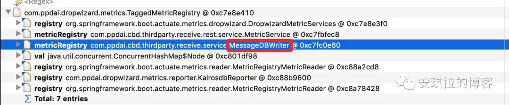

# JVM

## 案例一 （Metadata GC）

### 过程排查

metagc日志：


1. 查看了Metaspace 大小，把MetaspaceSize 从256M提高到了512M。但是发现Metaspace引发的Full GC还是没有消除。上线后 没有太大的用处

2. 立即dump了二台机器的日志，第一次分析GC 日志文件，没发现异常，这里有个注意的地方，大家dump文件时机很重要，有时候dump 的GC 日志没问题是因为刚好 Full GC完成之后dump的，内存回收的干干净净，有些内存缓慢增加的问题一定要在Full GC前dump。可以使用\#jinfo -flag +HeapDumpBeforeFullGC **5940**在进行临时设置

3. 分析GC dump日志发现可疑点，同一个ClassCloader 加载了接近3000个，如下图所示，前面我们说过，ClassCloader 信息在Metaspace 区域。

   破案了，fastjson使用不当引入了ASM Serializer的坑。

4. 故障定位与修复

   FastJson之所以快，原因就是使用asm字节码增强替代了反射。所以肯定是代码中应用了fastjson的ASM处理数据时造成的频繁加载同一个类，基本问题清楚了，那就是撸代码了，很快就定位了问题代码。如：

   ```
   for(Item item -> arrays) {
     SerializeConfig serializeConfig = new SerializeConfig();
      serializeConfig.put(Custom.class, new CustomSerializer());
      jsonString = JSON.toJSONString(item, serializeConfig);
   }
   ```

   这段代码是自定义了一个序列化实现类CustomSerializer，在进行序列化时进行了一个类似AOP的切面处理，对所有Custom类型的字段进行统一自定义序列化（使用CustomSerializer）。

   实现原理上是对需要序列化的Class使用asm动态生成了代理类，在这里就是Item类，使用SerializeConfig配置动态生成字节码代理类: com.alibaba.fastjson.serializer.ASMSerializer_1_Item，但是每次new SerializeConfig对象（内存地址不一样），FastJson会当作每次代理的目标是不一样的，导致每次会使用一个新的类加载器ASMClassLoader，所以Metaspace很快就满了，触发了频繁Full GC。

   如果希望深入研究可以看下FastJson源码：

   ```
   com.alibaba.fastjson.serializer.SerializeConfig#createASMSerializer
   ```

   问题修复：

   注册ObjectSerializer，让ObjectSerializer 成为全局唯一的，相当于是单例的。

   ```
   SerializeConfig.getGlobalInstance().put(Character.class, new CharacterSerializer());
   ```

   SerializeConfig 改成单例的后，每次序列化不用重复加载。

   ### 类似问题排查 & 调优

   1. 如果dump 日志发现很多classloader 名称前缀相同，排查是否有这种动态代理技术的使用，可能在不断生成代理对象。
   2. 发现内存缓慢增长，GC回收不掉，dump GC日志，查看是否有类被重复加载；
   3. Metaspace调优，比如我们现在生产环境 Metaspace 基本会设置256M 或者512M，可以根据应用的类型和机器内存配置来决定，因素：1. 是否会加载比较多的类，2. 机器内存允许, 可以适当调大Metaspace。

### 知识点

这里有二个知识点：

- Matespace（元空间）是什么？在JVM中扮演什么角色，也就是存放什么的？
- Full GC跟Matespace 大小设置有什么关系？
- fastJson的特性

Matespace叫做元空间，从JDK 8开始，永久代(PermGen)的概念被废弃掉了，取而代之的是一个称为Metaspace的存储空间。

Metaspace用来存放：Class文件在JVM 里的运行时数据结构；以及存Klass相关的其他的内容，比如Method，ConstantPool等。

Metaspace使用的是本地内存，而不是堆内存，也就是说在默认情况下Metaspace的大小只与本地内存大小有关。但是很容易有个**误区**是Matespace可以随便用，不管使用多少，只要不超本地内存就不会触发GC，这是错误的。

Matespace的设置方式是：-XX: MetaspaceSize=**M, 这个JVM参数的作用是让Matespace 达到MetaspaceSize时触发Full GC, 如果不设置Matespace, 默认值很小，也就 20M左右(不同系统会有一点差别)，如果程序Load Class比较多，很容易触发Full GC。这里要明白的是Class信息和加载Class 的ClassLoader 都存放在Metaspace，我们知道一个类是由这个类的类加载器加上全限定名（由包名&类名组成）确定唯一性的。

所以大家可以检查一下自己应用JVM Metaspace 设置的大小，如果没设置可以通过 -XX:+PrintFlagsInitial 查看一下默认值。

## 案例二 （数据量暴涨）

### 过程排查

消息队列告警，

立即开始问题排查，遇到线上问题，一定是保证最快速度止血，降低对业务的影响，然后再是排查原因，当然有的问题也需要快速找到原因。

第一反应是不是入口流量太大，处理消息的线程池核心线程数满了，任务都在排队，但是看了入口流量并没有尖刺。

看监控的消息消费任务耗时，如下图：

img

可以看到耗时在不断增加。那就需要看处理耗时增加原因了，为什么处理任务的耗时上涨了。

查看消息消费日志，如下：

img

发现有很多网络接口超时的。

img

大致得出结论：消息处理任务依赖下游系统接口，连接下游接口超时，连接下游接口设置的超时时间不算短，为什么下游接口如此多SocketTimeOut呢？

img

查看下游系统的监控大盘，发现了问题：


老年代GC次数暴涨，而且gc耗时都到了秒级别，1分钟5～10秒，太恐怖了。

找一台机器，把GC回收dump下来分析，使用mat查看，如下图所示：

img

一共七百多M空间，一个对象就占了640M空间，找到原因了，有内鬼（大对象）。

继续往下，看这个对象为什么会这么大，从GC Roots最短路径如下，MAT的使用，以及JVM相关分析，感兴趣可以微信公众号【安琪拉的博客】回复JVM，拉你进JVM交流群。

img

解释下，上面主要有三列，第一列是内存对象的类，重点在2，3列，Shallow Heap指的是对象本身占据的内存大小， Retained Heap = 本身本身占据内存大小 + 当前对象可直接或间接引用到的对象的大小总和，换句话说，就是当前对象如果被回收，能够回收的内存大小。

继续看，第一步，查看谁引用了这个对象，找到自己代码中的类，

img

第二步，查看这个对象TaggedMetricRegistry都引用了谁，为什么会占用这么大的内存空间，如下图所示，

img

找到罪魁祸首了，metrics这个 `ConcurrentHashMap` 占了671M内存，现在开始可以看下代码，找到 TaggedMetricRegistry继承自MetricRegistry，metrics 是MetricRegistry的成员变量，如下图：

img

img

那为什么这个 `ConcurrentHashMap` 占了这么大的内存空间，并且GC也回收不掉呢？

我们继续看MAT，分析 `ConcurrentHashMap` 占有的详细内存分布：

img

发现`ConcurrentHashMap`有几个Node节点尤其大，

追下去，继续

img

看到这个key，对应在代码中的位置，

img

你们可能好奇这段代码是干嘛的呢？

这个代码的作用是统计接口每次的执行时间，它内部update的源码如下：

在这里插入图片描述

这个方法是统计接口的耗时、调用次数的，它内部有一个measurements 的跳跃表，存放时间戳和统计指标（耗时、调用次数）的键值对，设置的时间窗口是1分钟，也就是它会存放1分钟的统计数据在内存中，当然这里面有个采样比，不是1分钟的全量数据，可以看到采样比是COLLISION_BUFFER决定的，然后1分钟上报一次内存数据到远端。问题就出现在这，因为这个耗时统计的函数的QPS非常高，**1分钟有数据频繁产生的时候，会导致在一个时间窗口（1分钟）measurements极速增长，导致内存占用快速增长，但是因为有强引用，GC的时候也不会把这个回收掉，所有才出现了上面的那个情况。**


非静态的匿名内部类会对外围类有一个强引用