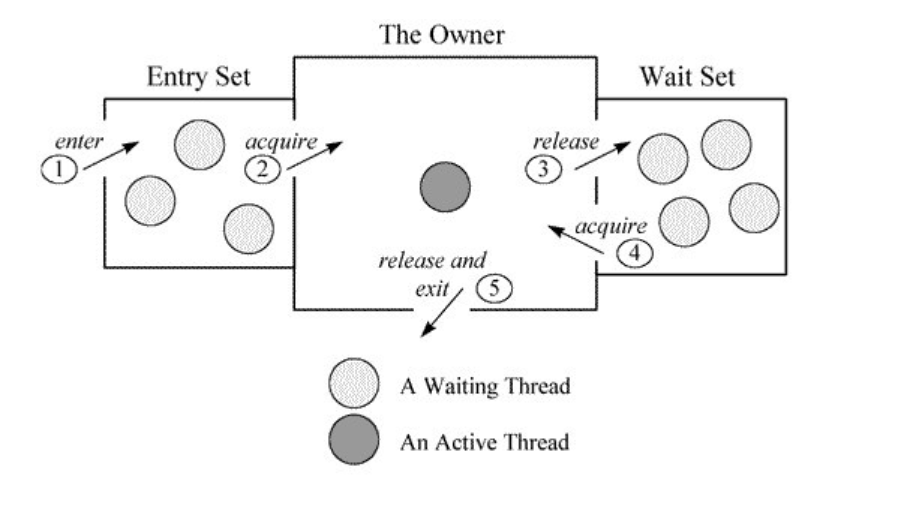

## HTTP

1. 现代浏览器在与服务器建立了一个 TCP 连接后是否会在一个 HTTP 请求完成后断开？什么情况下会断开？

   答：在 HTTP/1.0 中，一个服务器在发送完一个 HTTP 响应后，会断开 TCP 链接。但是这样每次请求都会重新建立和断开 TCP 连接，代价过大。所以虽然标准中没有设定，某些服务器对 Connection: keep-alive 的 Header 进行了支持。意思是说，完成这个 HTTP 请求之后，不要断开 HTTP 请求使用的 TCP 连接。这样的好处是连接可以被重新使用，之后发送 HTTP 请求的时候不需要重新建立 TCP 连接，以及如果维持连接，那么 SSL 的开销也可以避免。HTTP/1.1 就把 Connection 头写进标准，并且默认开启持久连接，除非请求中写明 Connection: close，那么浏览器和服务器之间是会维持一段时间的 TCP 连接，不会一个请求结束就断掉。**所以默认情况下建立 TCP 连接不会断开，只有在请求报头中声明 Connection: close 才会在请求完成后关闭连接。**

2. 一个 TCP 连接可以对应几个 HTTP 请求？

   了解了第一个问题之后，其实这个问题已经有了答案，如果维持连接，一个 TCP 连接是可以发送多个 HTTP 请求的。

3. 一个 TCP 连接中 HTTP 请求发送可以一起发送么（比如一起发三个请求，再三个响应一起接收）？

   HTTP/1.1 存在一个问题，单个 TCP 连接在同一时刻只能处理一个请求，意思是说：两个请求的生命周期不能重叠，任意两个 HTTP 请求从开始到结束的时间在同一个 TCP 连接里不能重叠。HTTP2 提供了 Multiplexing 多路传输特性，可以在一个 TCP 连接中同时完成多个 HTTP 请求。至于 Multiplexing 具体怎么实现的就是另一个问题了。**在 HTTP/1.1 存在 Pipelining 技术可以完成这个多个请求同时发送，但是由于浏览器默认关闭，所以可以认为这是不可行的。在 HTTP2 中由于 Multiplexing 特点的存在，多个 HTTP 请求可以在同一个 TCP 连接中并行进行。**

4. 为什么有的时候刷新页面不需要重新建立 SSL 连接？

   TCP 连接有的时候会被浏览器和服务端维持一段时间。TCP 不需要重新建立，SSL 自然也会用之前的

5. 浏览器对同一 Host 建立 TCP 连接到数量有没有限制？

   有。Chrome 最多允许对同一个 Host 建立六个 TCP 连接。不同的浏览器有一些区别。浏览器就会在一个 HOST 上建立多个 TCP 连接，连接数量的最大限制取决于浏览器设置，这些连接会在空闲的时候被浏览器用来发送新的请求，如果所有的连接都正在发送请求呢？那其他的请求就只能等等了。

6. HTTP/1.1 时代，浏览器是如何提高页面加载效率的呢？

   - 维持和服务器已经建立的 TCP 连接，在同一连接上顺序处理多个请求。
   - 和服务器建立多个 TCP 连接。
   - 服务端把文件进行合并一次性返回
   - 建多个DNS扩大TCP
   
   
## 并发问题
### 1. java中的状态与linux中的状态

### 2. synchronized的实现原理
通过javap生成的字节码中包含 ** monitorenter ** 和 ** monitorexit **指令。

- ObjectMonitor中等待列表是怎么样形式等待
### 3. synchronized在方法上但是同一个对象为何可以不互斥
### 4. thread.join的含义
thread.join的含义是当前线程需要等待previousThread线程终止之后才从thread.join返回。简单来说，就是线程没有执行完之前，主线程会一直阻塞在join方法处。有很多人不理解join为什么阻塞的是主线程呢? 不理解的原因是阻塞主线程的方法是放在previousThread这个实例作用，让大家误以为应该阻塞previousThread线程。实际上主线程会持有previousThread这个对象的锁，然后调用wait方法去阻塞，而这个**方法的调用者是在主线程中的。所以造成主线程阻塞。**
- 线程是如何被阻塞的？又是通过什么方法唤醒的呢？
 线程是通过调用wait方法导致阻塞，具体要了解wait的原理
- 为什么previousThread线程执行完毕就能够唤醒住线程呢？或者说是在什么时候唤醒的？
 当**线程执行结束以后**，会触发两个事情，第一个是设置native线程对象为null、第二个是通过notifyall方法，让等待在previousThread对象锁上的wait方法被唤醒。
### 5. thread.yield的含义
### 6. Object.wait、notify的原理
wait()、notify/notifyAll() 在synchsyronized 代码块执行，说明当前线程一定是获取了锁的。**获取锁的实例要和synchsyronized 的内容一致**
每个线程都有两个ObjectMonitor对象列表，分别为free和used列表，如果当前free列表为空，线程将向全局global list请求分配ObjectMonitor。
ObjectMonitor对象中有两个队列：_WaitSet 和 _EntryList，用来保存ObjectWaiter对象列表；_**owner指向获得ObjectMonitor对象的线程**。**_WaitSet ** ：处于wait状态的线程，会被加入到wait set；**_EntryList**：处于等待锁block状态的线程，会被加入到entry set；
    

- 进入wait/notify方法之前，为什么要获取synchronized锁？
 执行monitorenter指令**可以获取对象的monitor，执行wait 时候需要这个monitor对象**。wait方法会将当前线程放入wait set，等待被唤醒，并放弃lock对象上的所有同步声明，意味着线程A释放了锁，线程B可以重新执行加锁操作。**不过又有一个疑问：在线程A的wait方法释放锁，到线程B获取锁，这期间发生了什么？线程B是如何知道线程A已经释放了锁？可以看下synchronized的原理**
- 线程A获取了synchronized锁，执行wait方法并挂起，线程B又如何再次获取锁？
  wait挂起后就会释放锁进入wait队列中，此时可以进行抢占锁。
- 进入wait列表是怎么样的形式 轮询还是休眠 具体如何做到

- notify的执行
  notify也是在synchsyronized中执行，或者线程结束后自己的一个清理工作。在锁状态下执行后并不会立马唤醒等待线程，在notify方法后面加一段sleep代码就可以看到效果，如果线程B执行完notify方法之后sleep 5s，在这段时间内，线程B依旧持有monitor，线程A只能继续等待；

wait前要先拿到锁。 此时的线程状态 是怎么样 挂起 还是 在linux中的状态又是怎样， notify后线程是怎么得到唤醒操作。

#### pthread_cond_wait

#### pthread_cond_signal
通过上述两段代码，可以看出线程的挂起和唤醒是通过UNIX(对应BSD版本)线程库函数pthread_cond_wait和pthread_cond_signal实现的。

## LINUX
### 1. 用户态和内核态的区别
内核态相当于一个**介于硬件与应用之间的层**，内核有ring 0的权限，可以执行任何cpu指令，也可以引用任何内存地址，包括外围设备, 例如硬盘, 网卡，权限等级最高。用户态则**权利有限**，例如在内存分配中，有**一部分内存是仅为内核态使用的**，用户态code则不允许访问那些内存地址，每个进程**只允许访问自己申请到的内存**。而且不允许访问外围设备。另外在执行cpu指令的时候也可以被高优先级抢占。
1.1 状态的转化：
- 系统调用
 用户态进程通过系统调用申请使 用操作系统提供的服务程序完成工作
- 异常
 异常处理要查看栈信息，可能是直接拽出来系统的栈，这种方法铁铁的需要进入内核态。如果是JVM这种自己维护了这样的栈呢？那其实就不需要去内核态拿栈。但是不管怎么说，异常处理是极其耗时的这点不会错
- 外围设备中断
 当外围设备完成用户请求的操作后，会向CPU发出相应的中断信号，这时CPU会 暂停执行下一条即将要执行的指令转而去执行与中断信号对应的处理程序，如果先前执行的指令是用户态下的程序，那么这个转换的过程自然也就发生了由用户态到 内核态的切换。比如硬盘读写操作完成，系统会切换到硬盘读写的中断处理程序中执行后续操作等。
1.2 耗时
 linux下每个进程的栈有两个，一个是用户态栈，一个是内核态栈。在需要从用户态栈切换到内核的时候，需要进行执行栈的转换，保存用户态的状态，包括寄存器状态，然后执行内核态操作，操作完成后要恢复现场，切换到用户态，这个过程是耗时的。
### 2. 上下文切换
1. 进程上下文切换可以描述为kernel执行下面的操作
- 挂起一个进程，并储存该进程当时寄存器和程序计数器的状态
- 从内存中恢复下一个要执行的进程，恢复该进程原来的状态到寄存器，返回到其上次暂停的执行代码然后继续执行
2. **上下文切换只能发生在内核态，所以还会触发用户态与内核态切换？？**
